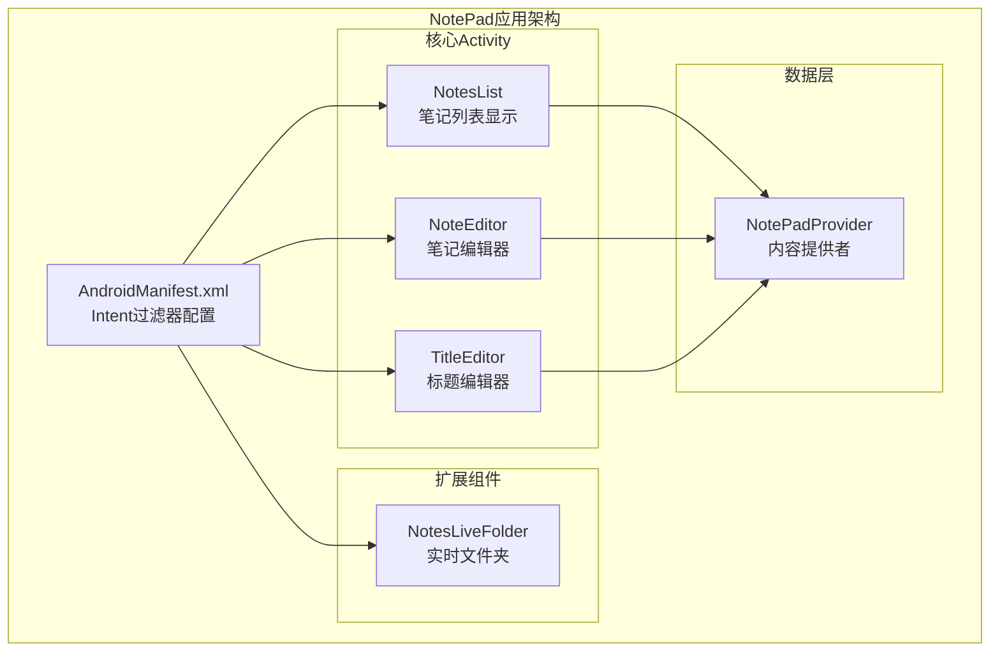
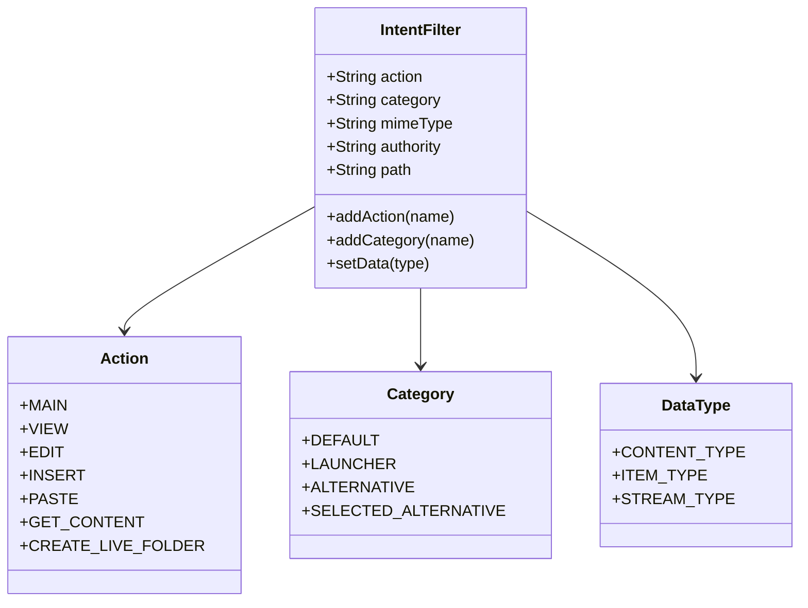
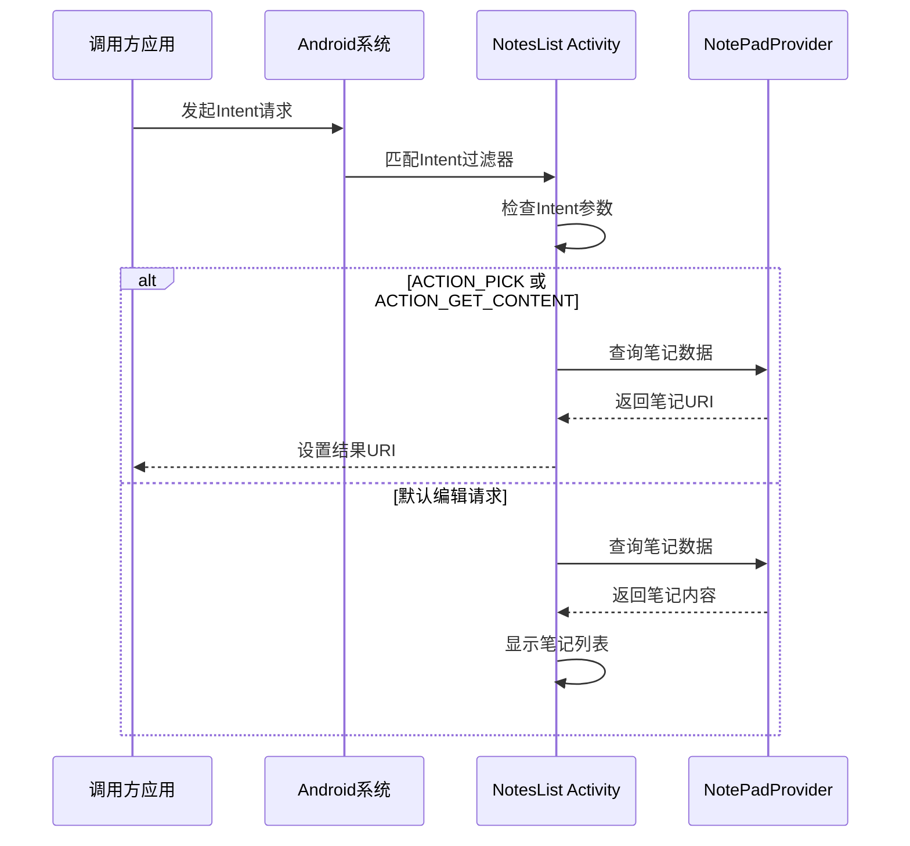
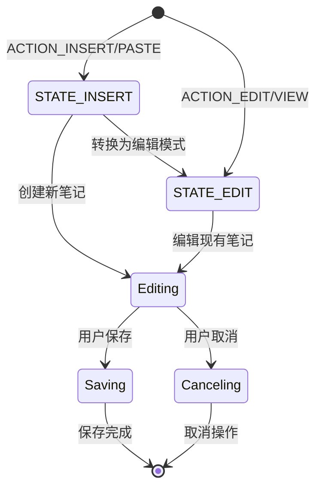
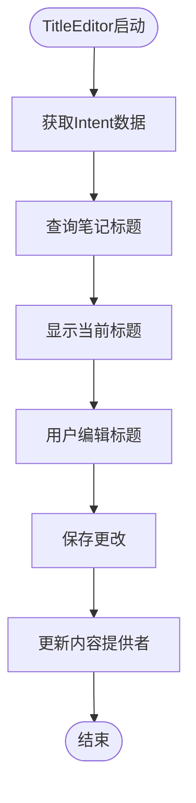

# Intent集成

<cite>
**本文档中引用的文件**
- [AndroidManifest.xml](file://app/src/main/AndroidManifest.xml)
- [NotesList.java](file://app/src/main/java/com/example/android/notepad/NotesList.java)
- [NoteEditor.java](file://app/src/main/java/com/example/android/notepad/NoteEditor.java)
- [TitleEditor.java](file://app/src/main/java/com/example/android/notepad/TitleEditor.java)
- [strings.xml](file://app/src/main/res/values/strings.xml)
</cite>

## 目录
1. [简介](#简介)
2. [项目结构概述](#项目结构概述)
3. [Intent过滤器架构](#intent过滤器架构)
4. [核心Activity的Intent配置](#核心activity的intent配置)
5. [Intent通信机制详解](#intent通信机制详解)
6. [扩展机制：Alternative Actions](#扩展机制alternative-actions)
7. [实际使用示例](#实际使用示例)
8. [开发者集成指南](#开发者集成指南)
9. [最佳实践与注意事项](#最佳实践与注意事项)
10. [总结](#总结)

## 简介

Android的Intent系统是应用程序间通信的核心机制，它允许不同的应用组件和服务能够相互发现、调用和交换数据。在NotePad应用中，Intent系统被巧妙地运用在各个Activity之间，实现了灵活的功能扩展和组件间的无缝协作。

本文档将深入分析NotePad应用如何利用Intent系统实现组件间通信，重点关注AndroidManifest.xml中的Intent过滤器配置、各Activity的响应机制，以及如何通过Intent实现功能扩展。

## 项目结构概述

NotePad应用包含以下核心组件：



**图表来源**
- [AndroidManifest.xml](file://app/src/main/AndroidManifest.xml#L28-L118)
- [NotesList.java](file://app/src/main/java/com/example/android/notepad/NotesList.java#L54-L536)
- [NoteEditor.java](file://app/src/main/java/com/example/android/notepad/NoteEditor.java#L54-L616)
- [TitleEditor.java](file://app/src/main/java/com/example/android/notepad/TitleEditor.java#L36-L168)

## Intent过滤器架构

AndroidManifest.xml中的Intent过滤器定义了每个Activity能够响应的外部请求类型。这些过滤器通过组合action、category和data三个要素来精确描述Activity的功能边界。

### Intent过滤器的基本组成



**图表来源**
- [AndroidManifest.xml](file://app/src/main/AndroidManifest.xml#L34-L118)

## 核心Activity的Intent配置

### NotesList Activity的Intent过滤器

NotesList作为应用的主要入口点，配置了多个Intent过滤器来支持不同的使用场景：

#### 主入口过滤器
```xml
<intent-filter>
    <action android:name="android.intent.action.MAIN" />
    <category android:name="android.intent.category.LAUNCHER" />
</intent-filter>
```

这个过滤器使NotesList成为应用启动器图标，当用户点击应用图标时触发。

#### 数据浏览过滤器
```xml
<intent-filter>
    <action android:name="android.intent.action.VIEW" />
    <action android:name="android.intent.action.EDIT" />
    <action android:name="android.intent.action.PICK" />
    <category android:name="android.intent.category.DEFAULT" />
    <data android:mimeType="vnd.android.cursor.dir/vnd.google.note" />
</intent-filter>
```

支持对笔记目录的浏览、编辑和选择操作。

#### 内容获取过滤器
```xml
<intent-filter>
    <action android:name="android.intent.action.GET_CONTENT" />
    <category android:name="android.intent.category.DEFAULT" />
    <data android:mimeType="vnd.android.cursor.item/vnd.google.note" />
</intent-filter>
```

允许其他应用获取单个笔记内容。

**节来源**
- [AndroidManifest.xml](file://app/src/main/AndroidManifest.xml#L34-L50)

### NoteEditor Activity的Intent配置

NoteEditor负责处理单个笔记的创建、编辑和粘贴操作：

#### 笔记编辑过滤器
```xml
<intent-filter android:label="@string/resolve_edit">
    <action android:name="android.intent.action.VIEW" />
    <action android:name="android.intent.action.EDIT" />
    <action android:name="com.android.notepad.action.EDIT_NOTE" />
    <category android:name="android.intent.category.DEFAULT" />
    <data android:mimeType="vnd.android.cursor.item/vnd.google.note" />
</intent-filter>
```

支持标准的VIEW、EDIT操作以及自定义的EDIT_NOTE操作。

#### 笔记创建过滤器
```xml
<intent-filter>
    <action android:name="android.intent.action.INSERT" />
    <action android:name="android.intent.action.PASTE" />
    <category android:name="android.intent.category.DEFAULT" />
    <data android:mimeType="vnd.android.cursor.dir/vnd.google.note" />
</intent-filter>
```

处理新建笔记和从剪贴板粘贴内容的场景。

**节来源**
- [AndroidManifest.xml](file://app/src/main/AndroidManifest.xml#L53-L77)

### TitleEditor Activity的Intent配置

TitleEditor展示了Android Intent系统的强大扩展能力，特别是ALTERNATIVE和SELECTED_ALTERNATIVE类别的使用：

```xml
<intent-filter android:label="@string/resolve_title">
    <action android:name="com.android.notepad.action.EDIT_TITLE" />
    <category android:name="android.intent.category.DEFAULT" />
    <category android:name="android.intent.category.ALTERNATIVE" />
    <category android:name="android.intent.category.SELECTED_ALTERNATIVE" />
    <data android:mimeType="vnd.android.cursor.item/vnd.google.note" />
</intent-filter>
```

这种配置允许其他应用在用户操作笔记时发现并提供"编辑标题"这一替代操作。

**节来源**
- [AndroidManifest.xml](file://app/src/main/AndroidManifest.xml#L81-L105)

## Intent通信机制详解

### NotesList中的Intent处理流程

NotesList展示了如何响应各种Intent请求：



**图表来源**
- [NotesList.java](file://app/src/main/java/com/example/android/notepad/NotesList.java#L513-L534)

### NoteEditor中的状态管理

NoteEditor通过状态常量来区分不同的操作模式：



**图表来源**
- [NoteEditor.java](file://app/src/main/java/com/example/android/notepad/NoteEditor.java#L73-L75)

### TitleEditor的特殊处理

TitleEditor专门处理标题编辑操作，展示了Intent系统的灵活性：



**图表来源**
- [TitleEditor.java](file://app/src/main/java/com/example/android/notepad/TitleEditor.java#L65-L167)

**节来源**
- [NotesList.java](file://app/src/main/java/com/example/android/notepad/NotesList.java#L513-L534)
- [NoteEditor.java](file://app/src/main/java/com/example/android/notepad/NoteEditor.java#L140-L200)
- [TitleEditor.java](file://app/src/main/java/com/example/android/notepad/TitleEditor.java#L65-L167)

## 扩展机制：Alternative Actions

Android的ALTERNATIVE和SELECTED_ALTERNATIVE类别提供了强大的功能扩展机制。在NotePad中，TitleEditor就是这一机制的最佳实践：

### Alternative Actions的工作原理


### 实际应用场景

1. **多应用协作**：不同应用可以注册自己的标题编辑器
2. **功能增强**：第三方应用可以提供更专业的标题编辑功能
3. **用户体验优化**：用户可以直接从笔记界面访问专业编辑工具

**节来源**
- [AndroidManifest.xml](file://app/src/main/AndroidManifest.xml#L96-L105)
- [NotesList.java](file://app/src/main/java/com/example/android/notepad/NotesList.java#L413-L420)

## 实际使用示例

### 从其他应用调用NotePad功能

以下是几种常见的Intent调用方式：

#### 启动笔记列表
```java
Intent intent = new Intent(Intent.ACTION_MAIN);
intent.setClassName("com.example.android.notepad", "com.example.android.notepad.NotesList");
startActivity(intent);
```

#### 创建新笔记
```java
Intent intent = new Intent(Intent.ACTION_INSERT);
intent.setData(NotePad.Notes.CONTENT_URI);
startActivity(intent);
```

#### 编辑特定笔记
```java
Uri noteUri = ContentUris.withAppendedId(NotePad.Notes.CONTENT_URI, noteId);
Intent intent = new Intent(Intent.ACTION_EDIT, noteUri);
startActivity(intent);
```

#### 使用Alternative Action
```java
Intent intent = new Intent("com.android.notepad.action.EDIT_TITLE");
intent.setData(noteUri);
startActivity(intent);
```

### 集成到其他应用

开发者可以通过以下方式集成NotePad功能：

1. **添加菜单项**：在应用菜单中添加调用NotePad的选项
2. **快捷方式**：创建桌面快捷方式直接打开特定功能
3. **数据导入导出**：通过Intent传输笔记数据
4. **批量操作**：利用GET_CONTENT和PICK操作批量处理笔记

## 开发者集成指南

### 如何为NotePad开发扩展插件

#### 步骤1：实现TitleEditor风格的Activity

```java
public class CustomTitleEditor extends Activity {
    public static final String EDIT_TITLE_ACTION = "com.yourcompany.action.EDIT_CUSTOM_TITLE";
    
    @Override
    protected void onCreate(Bundle savedInstanceState) {
        super.onCreate(savedInstanceState);
        // 实现类似TitleEditor的逻辑
    }
}
```

#### 步骤2：在AndroidManifest.xml中注册

```xml
<activity android:name=".CustomTitleEditor">
    <intent-filter>
        <action android:name="com.yourcompany.action.EDIT_CUSTOM_TITLE" />
        <category android:name="android.intent.category.DEFAULT" />
        <category android:name="android.intent.category.ALTERNATIVE" />
        <category android:name="android.intent.category.SELECTED_ALTERNATIVE" />
        <data android:mimeType="vnd.android.cursor.item/vnd.google.note" />
    </intent-filter>
</activity>
```

#### 步骤3：测试兼容性

确保你的Activity能够正确处理来自NotePad的Intent请求，并且不会破坏原有的功能。

### 最佳实践建议

1. **保持向后兼容**：确保你的扩展不会影响原有功能
2. **遵循命名规范**：使用包名前缀避免冲突
3. **提供清晰的标签**：为用户提供明确的操作说明
4. **处理异常情况**：妥善处理无效的URI或数据格式

## 最佳实践与注意事项

### Intent设计原则

1. **单一职责**：每个Activity应该专注于一个特定的功能
2. **明确的数据类型**：使用正确的MIME类型标识数据
3. **适当的权限控制**：确保敏感数据的安全访问
4. **优雅的错误处理**：提供有意义的错误反馈

### 性能优化考虑

1. **异步操作**：避免在UI线程执行耗时的数据库操作
2. **内存管理**：及时释放不需要的资源
3. **缓存策略**：合理使用缓存减少重复查询

### 安全注意事项

1. **输入验证**：严格验证所有外部输入
2. **权限检查**：确保有足够的权限执行操作
3. **数据加密**：敏感数据应该进行适当保护

## 总结

NotePad应用展示了Android Intent系统的强大功能和灵活性。通过精心设计的Intent过滤器，应用实现了：

1. **模块化架构**：每个Activity都有明确的职责和接口
2. **功能扩展性**：通过Alternative Actions支持第三方扩展
3. **用户体验优化**：无缝的跨应用协作体验
4. **开发友好性**：清晰的API设计便于集成和定制

这种设计不仅提高了代码的可维护性和可扩展性，也为用户提供了丰富的功能组合可能性。对于Android开发者而言，理解并掌握Intent系统是构建高质量应用的关键技能之一。

通过学习NotePad中的Intent集成模式，开发者可以更好地理解Android应用架构的设计思想，并将其应用到自己的项目中，创造出更加灵活和强大的移动应用。