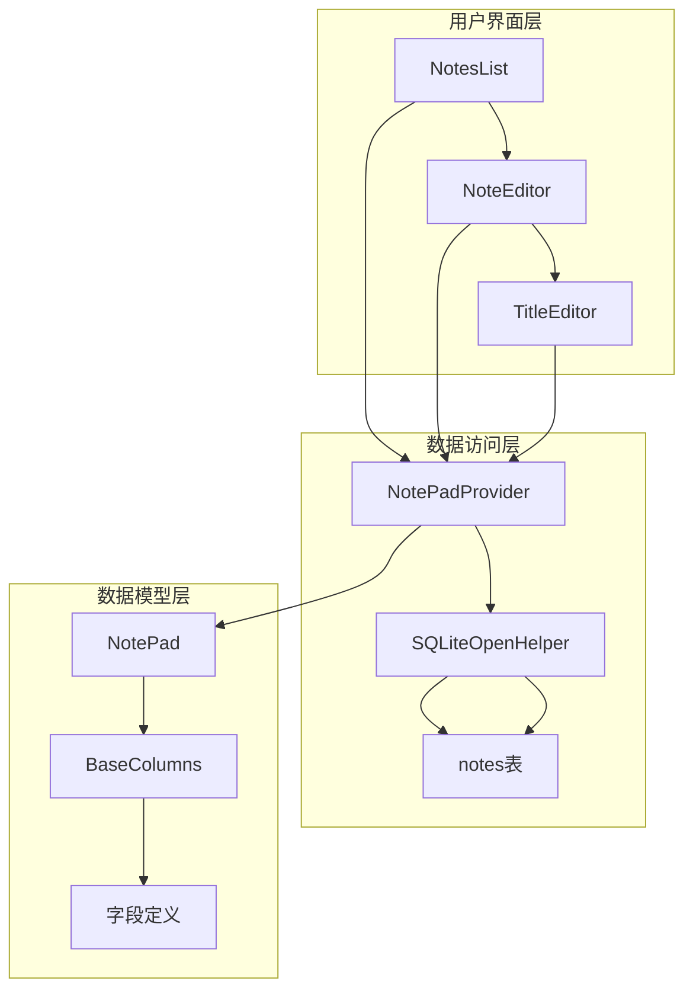
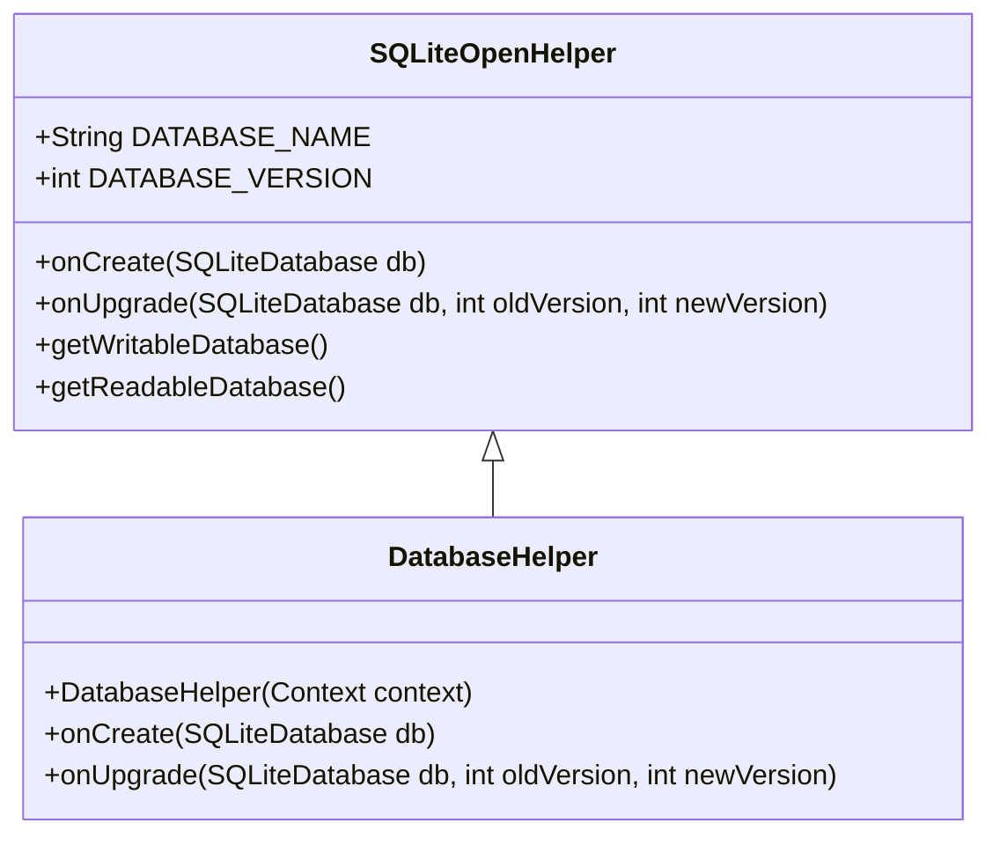
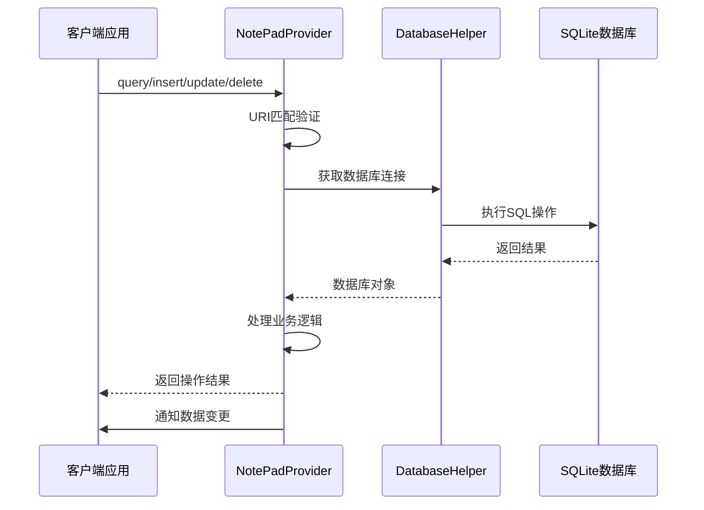
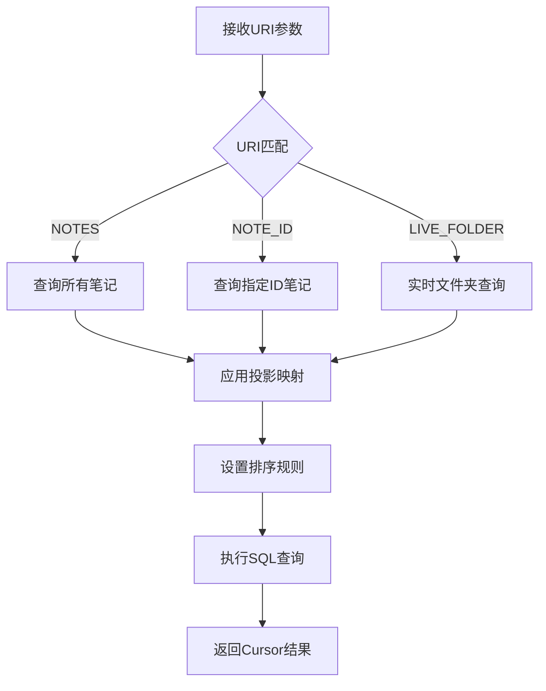
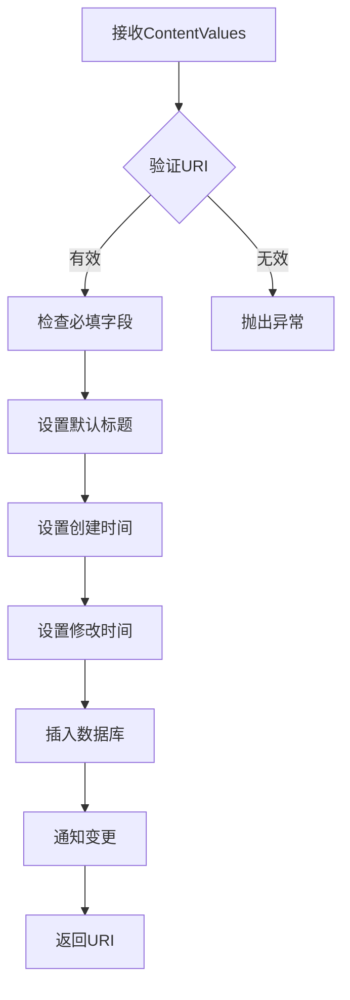
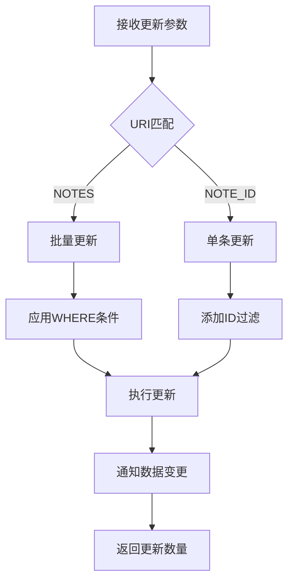
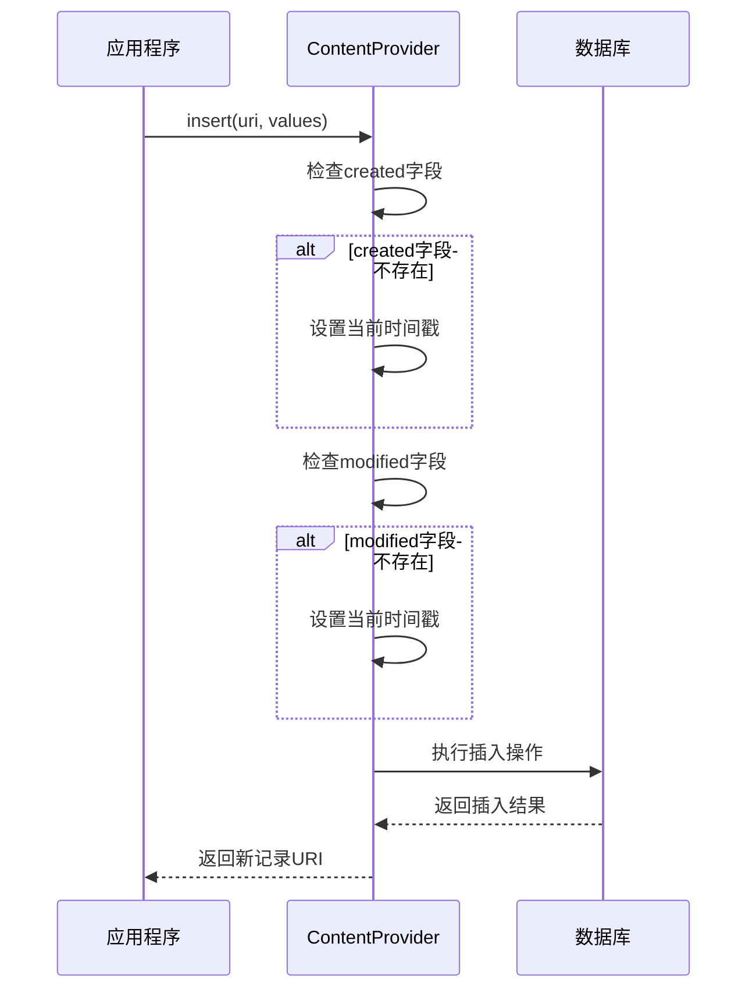
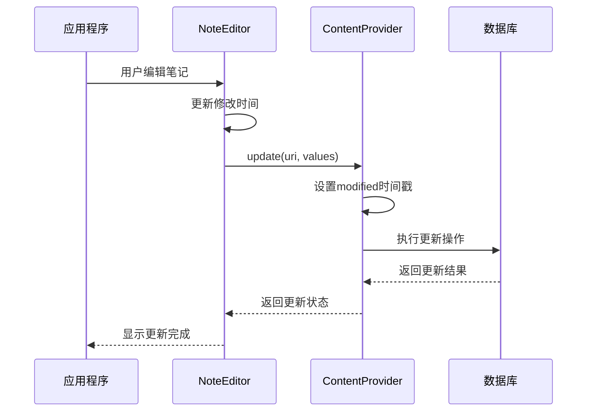
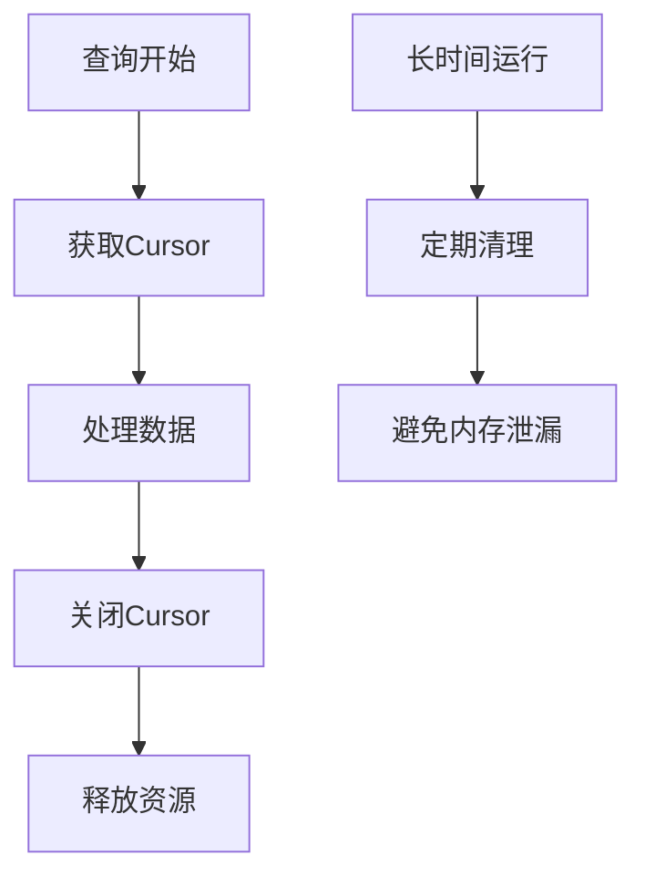
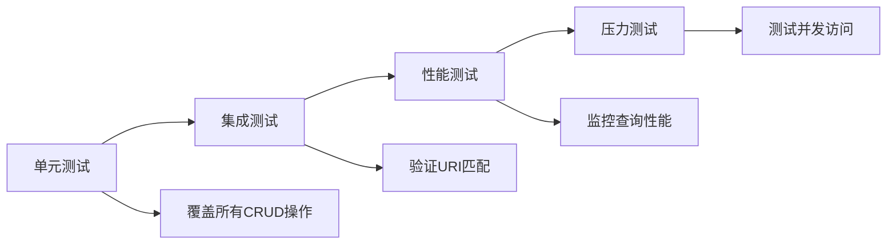

# 数据库设计

<cite>
**本文档中引用的文件**
- [NotePad.java](file://app/src/main/java/com/example/android/notepad/NotePad.java)
- [NotePadProvider.java](file://app/src/main/java/com/example/android/notepad/NotePadProvider.java)
- [NoteEditor.java](file://app/src/main/java/com/example/android/notepad/NoteEditor.java)
- [NotesList.java](file://app/src/main/java/com/example/android/notepad/NotesList.java)
- [NotePadProviderTest.java](file://app/src/androidTest/java/com/example/android/notepad/NotePadProviderTest.java)
</cite>

## 目录
1. [简介](#简介)
2. [项目结构概览](#项目结构概览)
3. [核心数据模型](#核心数据模型)
4. [数据库架构](#数据库架构)
5. [Content Provider实现](#content-provider实现)
6. [CRUD操作详解](#crud操作详解)
7. [时间戳管理机制](#时间戳管理机制)
8. [数据库迁移策略](#数据库迁移策略)
9. [性能优化建议](#性能优化建议)
10. [最佳实践指南](#最佳实践指南)
11. [总结](#总结)

## 简介

NotePad应用采用Android标准的Content Provider模式实现数据持久化，通过SQLite数据库存储笔记信息。该设计遵循Android平台的最佳实践，提供了标准化的CRUD操作接口，支持笔记的创建、查询、更新和删除功能。

本文档详细分析了NotePad应用的数据库设计，重点说明了`notes`表的完整结构、SQLiteOpenHelper的实现细节、Content Provider的封装机制，以及时间戳字段的自动管理策略。

## 项目结构概览

NotePad应用采用分层架构设计，主要包含以下核心组件：



**图表来源**
- [NotePadProvider.java](file://app/src/main/java/com/example/android/notepad/NotePadProvider.java#L54-L753)
- [NotePad.java](file://app/src/main/java/com/example/android/notepad/NotePad.java#L28-L155)

## 核心数据模型

### Notes表结构

`notes`表是NotePad应用的核心数据表，包含以下字段：

| 字段名 | 数据类型 | 主键 | 约束 | 业务含义 |
|--------|----------|------|------|----------|
| _id | INTEGER | 是 | PRIMARY KEY | 笔记唯一标识符，自增主键 |
| title | TEXT | 否 | - | 笔记标题，默认为"无标题" |
| note | TEXT | 否 | - | 笔记内容，支持富文本 |
| created | INTEGER | 否 | - | 创建时间戳（毫秒级） |
| modified | INTEGER | 否 | - | 最后修改时间戳（毫秒级） |

### 字段详细说明

#### 主键字段 (_id)
- 使用`INTEGER PRIMARY KEY`定义
- 自动递增特性确保每条记录的唯一性
- 支持`AUTOINCREMENT`但当前实现未启用

#### 标题字段 (title)
- 文本类型，支持任意长度
- 默认值为空字符串或系统默认标题
- 用于笔记的快速识别和搜索

#### 内容字段 (note)
- 文本类型，支持大容量内容存储
- 可包含富文本格式
- 存储原始文本内容

#### 时间戳字段
- `created`: 记录创建时的时间戳
- `modified`: 记录最后修改时的时间戳
- 均以毫秒为单位的Long类型存储

**章节来源**
- [NotePad.java](file://app/src/main/java/com/example/android/notepad/NotePad.java#L130-L152)
- [NotePadProvider.java](file://app/src/main/java/com/example/android/notepad/NotePadProvider.java#L194-L200)

## 数据库架构

### SQLiteOpenHelper实现

数据库操作通过`DatabaseHelper`类实现，继承自`SQLiteOpenHelper`：



**图表来源**
- [NotePadProvider.java](file://app/src/main/java/com/example/android/notepad/NotePadProvider.java#L179-L223)

### 表创建语句

`onCreate()`方法中的SQL语句定义了完整的表结构：

```sql
CREATE TABLE notes (
    _ID INTEGER PRIMARY KEY,
    title TEXT,
    note TEXT,
    created INTEGER,
    modified INTEGER
);
```

### 版本管理

- 当前数据库版本：2
- 支持版本升级检测
- 升级策略：完全重建数据库

**章节来源**
- [NotePadProvider.java](file://app/src/main/java/com/example/android/notepad/NotePadProvider.java#L181-L223)

## Content Provider实现

### 提供者架构

Content Provider作为数据访问的统一接口，封装了底层数据库操作：



**图表来源**
- [NotePadProvider.java](file://app/src/main/java/com/example/android/notepad/NotePadProvider.java#L252-L752)

### URI模式匹配

Provider使用`UriMatcher`进行URI模式匹配：

| 模式 | 动作 | 描述 |
|------|------|------|
| `/notes` | NOTES | 查询所有笔记 |
| `/notes/#` | NOTE_ID | 查询特定笔记ID |
| `/live_folders/notes` | LIVE_FOLDER_NOTES | 实时文件夹查询 |

**章节来源**
- [NotePadProvider.java](file://app/src/main/java/com/example/android/notepad/NotePadProvider.java#L123-L131)

## CRUD操作详解

### 查询操作 (query)

查询方法支持多种查询模式：



**图表来源**
- [NotePadProvider.java](file://app/src/main/java/com/example/android/notepad/NotePadProvider.java#L252-L321)

### 插入操作 (insert)

插入操作包含自动时间戳设置：



**图表来源**
- [NotePadProvider.java](file://app/src/main/java/com/example/android/notepad/NotePadProvider.java#L499-L566)

### 更新操作 (update)

更新操作支持部分字段更新：



**图表来源**
- [NotePadProvider.java](file://app/src/main/java/com/example/android/notepad/NotePadProvider.java#L669-L738)

### 删除操作 (delete)

删除操作支持批量删除和单条删除：


**图表来源**
- [NotePadProvider.java](file://app/src/main/java/com/example/android/notepad/NotePadProvider.java#L583-L645)

## 时间戳管理机制

### 自动时间戳设置

NotePad应用实现了智能的时间戳管理：

#### 插入时的时间戳设置



**图表来源**
- [NotePadProvider.java](file://app/src/main/java/com/example/android/notepad/NotePadProvider.java#L518-L529)

#### 更新时的时间戳设置



**图表来源**
- [NoteEditor.java](file://app/src/main/java/com/example/android/notepad/NoteEditor.java#L526-L560)

### 排序机制

数据库默认按照修改时间降序排列：

```java
public static final String DEFAULT_SORT_ORDER = "modified DESC";
```

这种排序策略确保：
- 最近修改的笔记显示在最前面
- 笔记列表具有动态更新特性
- 用户能快速找到最新编辑的内容

**章节来源**
- [NotePad.java](file://app/src/main/java/com/example/android/notepad/NotePad.java#L124)
- [NoteEditor.java](file://app/src/main/java/com/example/android/notepad/NoteEditor.java#L527)

## 数据库迁移策略

### 当前迁移实现

NotePad应用采用简单的数据库迁移策略：

```mermaid
flowchart TD
A[检测数据库版本] --> B{版本是否升级}
B --> |否| C[使用现有数据库]
B --> |是| D[记录升级日志]
D --> E[删除旧表]
E --> F[重新创建表结构]
F --> G[onCreate()被调用]
G --> H[新数据库就绪]
```

**图表来源**
- [NotePadProvider.java](file://app/src/main/java/com/example/android/notepad/NotePadProvider.java#L211-L221)

### 迁移策略特点

- **简单直接**：完全重建数据库而非增量升级
- **开发友好**：便于快速迭代和调试
- **生产风险**：可能导致数据丢失
- **版本控制**：明确的版本号管理

### 改进建议

对于生产环境，建议采用更安全的迁移策略：

1. **增量迁移**：保留现有数据，仅添加新字段
2. **备份机制**：迁移前自动备份数据
3. **回滚支持**：提供失败后的回滚选项
4. **兼容性检查**：验证数据完整性

**章节来源**
- [NotePadProvider.java](file://app/src/main/java/com/example/android/notepad/NotePadProvider.java#L203-L221)

## 性能优化建议

### 索引策略

虽然当前实现未显式创建索引，但可以考虑以下优化：

| 字段 | 索引类型 | 优化效果 |
|------|----------|----------|
| title | 普通索引 | 加速标题搜索 |
| created | 普通索引 | 改善时间排序 |
| modified | 普通索引 | 优化最近修改排序 |

### 查询优化

1. **投影限制**：只查询需要的字段
2. **分页查询**：大数据集使用LIMIT和OFFSET
3. **缓存策略**：合理使用Cursor的缓存机制
4. **批量操作**：合并多个小操作为批量操作

### 内存管理



**章节来源**
- [NotePadProvider.java](file://app/src/main/java/com/example/android/notepad/NotePadProvider.java#L309-L321)

## 最佳实践指南

### 数据库设计原则

1. **单一职责**：每个表专注于特定业务实体
2. **字段命名**：使用描述性的字段名称
3. **数据类型**：选择合适的数据类型
4. **约束定义**：合理使用主键、外键和唯一约束

### Content Provider设计

1. **URI设计**：遵循Android URI规范
2. **权限控制**：实现适当的安全检查
3. **错误处理**：提供详细的错误信息
4. **性能考虑**：优化查询和更新操作

### 时间戳管理

1. **自动设置**：在业务层自动处理时间戳
2. **精度控制**：使用适当的精度级别
3. **时区处理**：统一使用UTC时间
4. **历史追踪**：保留重要的时间戳信息

### 测试策略



**图表来源**
- [NotePadProviderTest.java](file://app/src/androidTest/java/com/example/android/notepad/NotePadProviderTest.java#L45-L840)

**章节来源**
- [NotePadProviderTest.java](file://app/src/androidTest/java/com/example/android/notepad/NotePadProviderTest.java#L138-L156)

## 总结

NotePad应用的数据库设计体现了Android平台数据持久化的最佳实践。通过Content Provider模式，实现了数据访问的标准化和安全性；通过SQLiteOpenHelper，提供了灵活的数据库操作能力；通过智能的时间戳管理，确保了数据的时效性和可追溯性。

### 设计亮点

1. **标准化接口**：符合Android Content Provider规范
2. **自动时间管理**：减少业务层的重复代码
3. **灵活查询**：支持多种查询模式和排序策略
4. **扩展性强**：易于添加新功能和字段

### 改进方向

1. **索引优化**：根据查询模式添加适当的索引
2. **迁移增强**：实现更安全的数据库迁移策略
3. **性能监控**：添加查询性能监控机制
4. **并发控制**：加强多线程环境下的数据一致性

这个设计为Android应用的数据持久化提供了优秀的参考模板，展示了如何在保持简洁性的同时实现功能的完整性和可靠性。