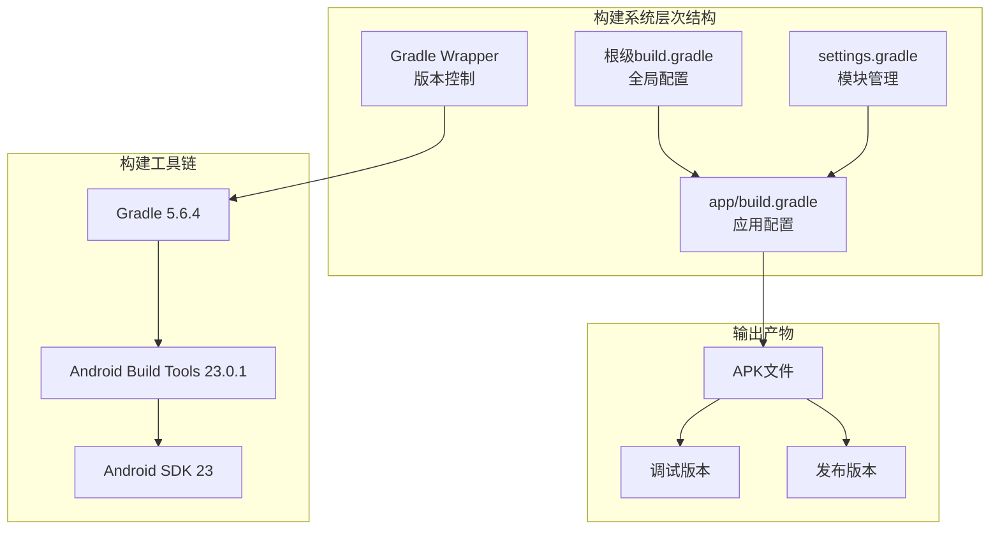
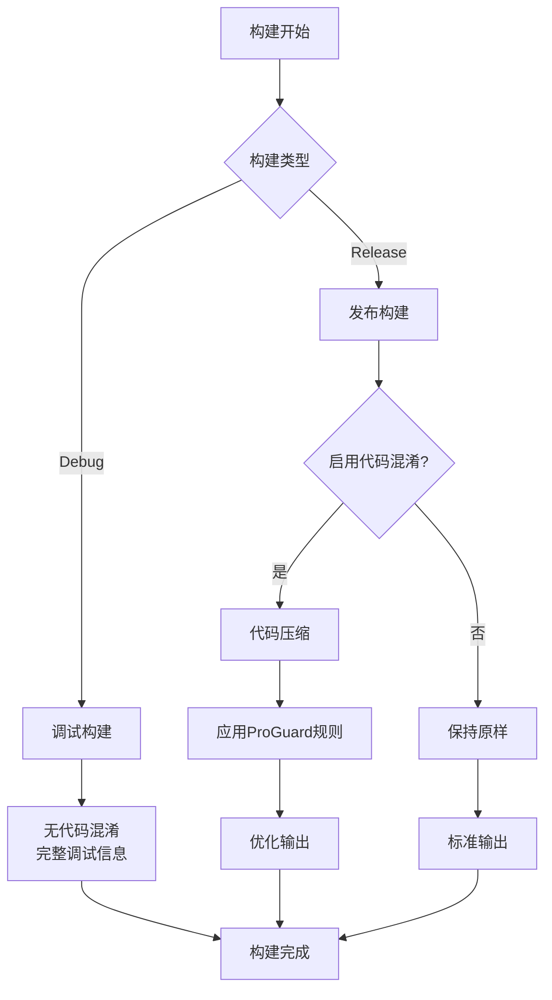
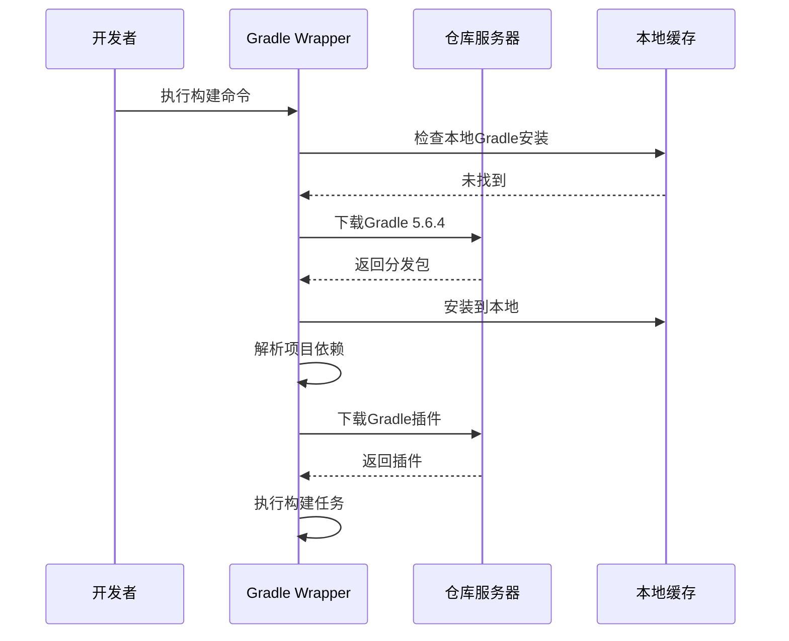
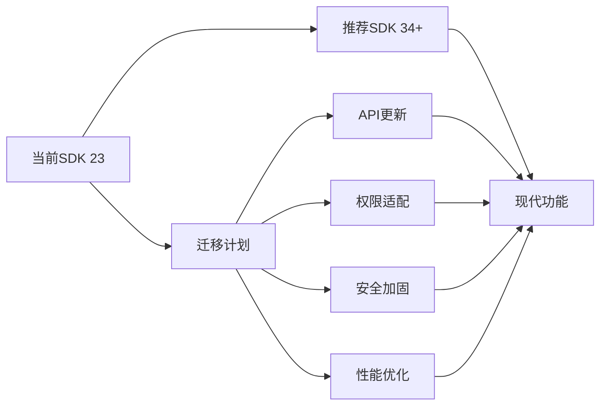
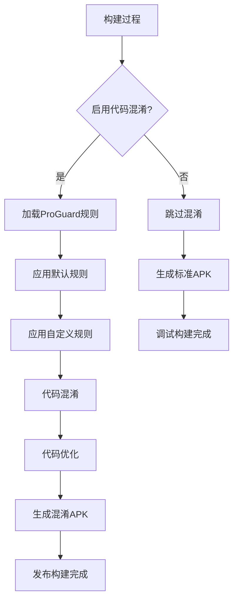

# 构建与部署

<cite>
**本文档中引用的文件**
- [app/build.gradle](file://app/build.gradle)
- [build.gradle](file://build.gradle)
- [settings.gradle](file://settings.gradle)
- [gradle/wrapper/gradle-wrapper.properties](file://gradle/wrapper/gradle-wrapper.properties)
- [gradlew](file://gradlew)
- [local.properties](file://local.properties)
- [README.md](file://README.md)
</cite>

## 目录
1. [项目概述](#项目概述)
2. [构建系统架构](#构建系统架构)
3. [核心构建配置](#核心构建配置)
4. [Gradle Wrapper使用指南](#gradle-wrapper使用指南)
5. [构建步骤详解](#构建步骤详解)
6. [SDK版本兼容性](#sdk版本兼容性)
7. [代码混淆配置](#代码混淆配置)
8. [快速开始指南](#快速开始指南)
9. [故障排除](#故障排除)
10. [最佳实践建议](#最佳实践建议)

## 项目概述

NotePad项目是一个基于Android平台的简单笔记应用程序，采用传统的Android Gradle构建系统。该项目展示了Android应用开发的基础概念，包括数据库操作、内容提供者和服务组件的使用。

**章节来源**
- [README.md](file://README.md#L1-L4)

## 构建系统架构

NotePad项目采用标准的Android Gradle构建架构，包含以下核心组件：



**图表来源**
- [build.gradle](file://build.gradle#L1-L17)
- [app/build.gradle](file://app/build.gradle#L1-L23)
- [settings.gradle](file://settings.gradle#L1-L2)

**章节来源**
- [build.gradle](file://build.gradle#L1-L17)
- [app/build.gradle](file://app/build.gradle#L1-L23)
- [settings.gradle](file://settings.gradle#L1-L2)

## 核心构建配置

### 应用程序配置

项目的核心配置定义了应用程序的基本属性和构建参数：

| 配置项 | 值 | 说明 |
|--------|-----|------|
| `namespace` | `com.example.android.notepad` | 应用程序包名前缀 |
| `compileSdkVersion` | 23 | 编译时使用的Android SDK版本 |
| `buildToolsVersion` | "23.0.1" | Android构建工具版本 |
| `applicationId` | `com.example.android.notepad` | 实际安装的应用程序标识符 |
| `minSdkVersion` | 11 | 最低支持的Android API级别 |
| `targetSdkVersion` | 23 | 目标Android API级别 |

### 构建类型配置

项目配置了两种主要的构建类型：



**图表来源**
- [app/build.gradle](file://app/build.gradle#L17-L22)

**章节来源**
- [app/build.gradle](file://app/build.gradle#L3-L23)

## Gradle Wrapper使用指南

### Gradle Wrapper简介

Gradle Wrapper确保项目在不同开发环境中使用一致的Gradle版本，避免版本冲突问题。

### Wrapper配置

| 属性 | 值 | 说明 |
|------|-----|------|
| 分发URL | `https://services.gradle.org/distributions/gradle-5.6.4-bin.zip` | Gradle分发包地址 |
| 包装器路径 | `wrapper/dists` | 包装器文件存储位置 |
| 用户主目录 | `$GRADLE_USER_HOME` | Gradle用户目录 |

### 命令行使用

#### 在Unix/Linux/macOS系统上：
```bash
# 构建调试版本
./gradlew assembleDebug

# 构建发布版本
./gradlew assembleRelease

# 清理项目
./gradlew clean

# 运行测试
./gradlew test
```

#### 在Windows系统上：
```cmd
# 构建调试版本
gradlew.bat assembleDebug

# 构建发布版本
gradlew.bat assembleRelease

# 清理项目
gradlew.bat clean
```

**章节来源**
- [gradle/wrapper/gradle-wrapper.properties](file://gradle/wrapper/gradle-wrapper.properties#L1-L7)
- [gradlew](file://gradlew#L1-L161)

## 构建步骤详解

### 1. 环境准备

在开始构建之前，请确保以下环境要求：

- **Java Development Kit (JDK)**：建议使用JDK 8或更高版本
- **Android SDK**：已配置的Android SDK路径
- **Gradle**：通过Wrapper自动下载的Gradle 5.6.4

### 2. 依赖解析

构建过程的第一步是解析项目依赖：



**图表来源**
- [gradle/wrapper/gradle-wrapper.properties](file://gradle/wrapper/gradle-wrapper.properties#L4-L4)
- [build.gradle](file://build.gradle#L7-L9)

### 3. 编译过程

构建过程包含多个阶段，每个阶段都有特定的任务：

| 阶段 | 主要任务 | 输出文件 |
|------|----------|----------|
| 资源处理 | 编译XML资源、处理字符串资源 | R.java文件 |
| Java编译 | 编译Java源代码 | .class文件 |
| 资源打包 | 打包所有资源文件 | resources.ap_ |
| DEX转换 | 将.class文件转换为DEX格式 | classes.dex |
| APK打包 | 创建APK文件 | app-debug.apk/app-release.apk |

### 4. 测试执行

项目包含单元测试和集成测试：

- **单元测试**：在本地JVM上运行
- **集成测试**：在Android设备或模拟器上运行

**章节来源**
- [app/build.gradle](file://app/build.gradle#L8-L15)

## SDK版本兼容性

### 当前SDK配置

NotePad项目使用较旧的Android SDK版本配置：

| 版本类型 | 当前值 | 推荐值 | 兼容性影响 |
|----------|--------|--------|------------|
| `compileSdkVersion` | 23 | 34+ | 可能缺少最新API支持 |
| `targetSdkVersion` | 23 | 34+ | 安全性和权限模型限制 |
| `minSdkVersion` | 11 | 21+ | 设备兼容性受限 |
| `buildToolsVersion` | 23.0.1 | 34.x.x | 工具链过时 |

### 兼容性注意事项

由于使用较旧的SDK版本，开发者需要注意以下兼容性问题：

1. **API废弃**：部分API可能已被标记为废弃或移除
2. **安全更新**：缺少最新的安全补丁
3. **性能优化**：无法利用新版本的性能改进
4. **权限模型**：不支持运行时权限请求

### 升级建议

为了在现代开发环境中更好地运行项目，建议考虑以下升级路径：



**章节来源**
- [app/build.gradle](file://app/build.gradle#L5-L11)

## 代码混淆配置

### ProGuard设置

项目配置了ProGuard代码混淆，但当前处于禁用状态：

| 配置项 | 值 | 说明 |
|--------|-----|------|
| `minifyEnabled` | `false` | 是否启用代码压缩 |
| 默认规则文件 | `proguard-android.txt` | Android官方默认混淆规则 |
| 自定义规则 | `proguard-rules.txt` | 项目特定的混淆规则 |

### 混淆配置分析



**图表来源**
- [app/build.gradle](file://app/build.gradle#L18-L21)

### 启用混淆的步骤

如果需要启用代码混淆，可以按照以下步骤操作：

1. 修改`app/build.gradle`中的`minifyEnabled`设置
2. 确保`proguard-rules.txt`文件存在并配置适当的规则
3. 运行`./gradlew assembleRelease`构建发布版本

**章节来源**
- [app/build.gradle](file://app/build.gradle#L18-L21)

## 快速开始指南

### 环境要求

在开始构建之前，请确保满足以下环境要求：

1. **操作系统**：Windows 10/11、macOS 10.12+、Linux
2. **Java**：JDK 8或更高版本
3. **Android SDK**：已正确配置的SDK路径
4. **Git**：用于克隆项目（可选）

### 构建步骤

#### 步骤1：克隆项目（可选）
```bash
# 如果从Git仓库克隆
git clone <repository-url>
cd NotePad
```

#### 步骤2：验证环境配置
```bash
# 检查Java版本
java -version

# 检查Android SDK路径
cat local.properties
```

#### 步骤3：构建调试版本
```bash
# Unix/Linux/macOS
./gradlew assembleDebug

# Windows
gradlew.bat assembleDebug
```

#### 步骤4：查找构建产物
构建完成后，APK文件将位于以下路径：

- **调试版本**：`app/build/outputs/apk/debug/app-debug.apk`
- **发布版本**：`app/build/outputs/apk/release/app-release.apk`

#### 步骤5：安装APK
```bash
# 使用ADB安装APK
adb install app/build/outputs/apk/debug/app-debug.apk
```

### 常用构建命令

| 命令 | 功能 | 输出位置 |
|------|------|----------|
| `assembleDebug` | 构建调试版本 | debug目录 |
| `assembleRelease` | 构建发布版本 | release目录 |
| `clean` | 清理构建缓存 | 删除build目录 |
| `test` | 运行单元测试 | test-results目录 |
| `connectedAndroidTest` | 运行设备测试 | connected目录 |

**章节来源**
- [gradlew](file://gradlew#L1-L161)
- [local.properties](file://local.properties#L1-L9)

## 故障排除

### 常见构建错误

#### 1. Java版本不兼容
**错误信息**：`Unsupported major.minor version`
**解决方案**：
- 确保使用JDK 8或更高版本
- 设置正确的`JAVA_HOME`环境变量

#### 2. Android SDK路径错误
**错误信息**：`Failed to find Build Tools revision`
**解决方案**：
- 检查`local.properties`文件中的SDK路径
- 确保指定的Android SDK版本已安装

#### 3. Gradle版本冲突
**错误信息**：`Gradle version X.X is required`
**解决方案**：
- 使用项目提供的Gradle Wrapper
- 不要手动安装Gradle

#### 4. 内存不足错误
**错误信息**：`OutOfMemoryError`
**解决方案**：
- 增加Gradle堆内存：在`gradle.properties`中添加`org.gradle.jvmargs=-Xmx2048m`

### 性能优化建议

#### 1. 增量构建
启用增量构建以加快重复构建速度：
```properties
# 在gradle.properties中添加
org.gradle.parallel=true
org.gradle.configureondemand=true
```

#### 2. 并行构建
利用多核CPU加速构建过程：
```properties
# 在gradle.properties中添加
org.gradle.parallel=true
```

#### 3. 构建缓存
启用Gradle构建缓存：
```properties
# 在gradle.properties中添加
org.gradle.caching=true
```

### 调试技巧

#### 查看详细日志
```bash
# 启用详细日志输出
./gradlew assembleDebug --info

# 启用调试日志输出
./gradlew assembleDebug --debug
```

#### 检查依赖树
```bash
# 查看完整的依赖树
./gradlew app:dependencies

# 查看特定配置的依赖
./gradlew app:dependencies --configuration debugRuntimeClasspath
```

## 最佳实践建议

### 项目维护

#### 1. 定期更新依赖
- 定期检查并更新Gradle插件版本
- 关注Android SDK的新版本发布
- 更新第三方库到稳定版本

#### 2. 代码质量保证
- 集成静态代码分析工具
- 添加自动化测试覆盖率检查
- 实施代码审查流程

#### 3. 构建优化
- 使用Gradle构建扫描工具分析构建性能
- 优化构建脚本减少不必要的任务执行
- 考虑使用CI/CD流水线自动化构建过程

### 安全考虑

#### 1. 密钥管理
- 不要将密钥文件提交到版本控制系统
- 使用环境变量或安全的密钥管理服务
- 定期轮换发布密钥

#### 2. 依赖安全
- 使用`./gradlew dependencyCheck`检查已知漏洞
- 关注第三方库的安全公告
- 及时更新有安全问题的依赖

### 发布准备

#### 1. 版本管理
```bash
# 创建发布标签
git tag -a v1.0.0 -m "Release version 1.0.0"
git push origin v1.0.0
```

#### 2. 发布检查清单
- [ ] 所有测试通过
- [ ] 代码审查完成
- [ ] 文档更新
- [ ] 版本号更新
- [ ] 发布说明编写

#### 3. 分发渠道
- Google Play Store
- 第三方应用市场
- 直接APK分发

### 长期维护策略

#### 1. 技术债务管理
- 定期重构过时的代码
- 更新项目模板和构建脚本
- 学习和应用新的Android开发最佳实践

#### 2. 社区参与
- 关注Android开发社区动态
- 参与开源项目贡献
- 分享项目经验和最佳实践

通过遵循这些最佳实践，可以确保NotePad项目在长期维护过程中保持高质量和可维护性，同时为学习Android开发提供良好的基础平台。