# Controller层详解

<cite>
**本文档引用的文件**
- [NotesList.java](file://app/src/main/java/com/example/android/notepad/NotesList.java)
- [NoteEditor.java](file://app/src/main/java/com/example/android/notepad/NoteEditor.java)
- [AndroidManifest.xml](file://app/src/main/AndroidManifest.xml)
- [NotePad.java](file://app/src/main/java/com/example/android/notepad/NotePad.java)
- [NotePadProvider.java](file://app/src/androidTest/java/com/example/android/notepad/NotePadProviderTest.java)
- [list_options_menu.xml](file://app/src/main/res/menu/list_options_menu.xml)
- [editor_options_menu.xml](file://app/src/main/res/menu/editor_options_menu.xml)
- [list_context_menu.xml](file://app/src/main/res/menu/list_context_menu.xml)
</cite>

## 目录
1. [简介](#简介)
2. [项目架构概览](#项目架构概览)
3. [NotesList控制器详解](#noteslist控制器详解)
4. [NoteEditor控制器详解](#noteeditor控制器详解)
5. [Intent过滤器与启动机制](#intent过滤器与启动机制)
6. [用户操作事件流分析](#用户操作事件流分析)
7. [状态管理与生命周期](#状态管理与生命周期)
8. [最佳实践指南](#最佳实践指南)
9. [总结](#总结)

## 简介

NotePad应用的Controller层主要由两个核心Activity组成：NotesList和NoteEditor。这两个控制器分别负责笔记列表的展示与编辑功能，通过Android的Intent机制实现组件间的通信和数据传递。本文档将深入分析这两个控制器的实现细节，包括它们的初始化过程、事件处理机制、状态管理和内存泄漏防范策略。

## 项目架构概览

NotePad应用采用经典的MVC架构模式，其中Controller层负责处理用户交互和业务逻辑：

```mermaid
graph TB
subgraph "Controller层"
NotesList["NotesList<br/>笔记列表控制器"]
NoteEditor["NoteEditor<br/>笔记编辑控制器"]
end
subgraph "Model层"
NotePadProvider["NotePadProvider<br/>内容提供者"]
Database["SQLite数据库"]
end
subgraph "View层"
ListView["ListView<br/>笔记列表视图"]
EditText["EditText<br/>笔记编辑视图"]
MenuViews["菜单视图"]
end
NotesList --> ListView
NotesList --> MenuViews
NoteEditor --> EditText
NotesList < --> NotePadProvider
NoteEditor < --> NotePadProvider
NotePadProvider --> Database
```

**图表来源**
- [NotesList.java](file://app/src/main/java/com/example/android/notepad/NotesList.java#L56-L550)
- [NoteEditor.java](file://app/src/main/java/com/example/android/notepad/NoteEditor.java#L54-L616)
- [NotePadProvider.java](file://app/src/androidTest/java/com/example/android/notepad/NotePadProviderTest.java#L34-L752)

## NotesList控制器详解

### 初始化过程与onCreate方法

NotesList作为笔记列表的主控制器，其onCreate方法是整个Activity生命周期的起点：

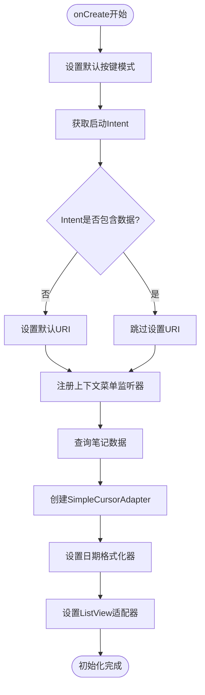

**图表来源**
- [NotesList.java](file://app/src/main/java/com/example/android/notepad/NotesList.java#L81-L166)

#### 数据查询与适配器绑定

NotesList通过ContentResolver查询NotePadProvider获取笔记列表数据，并使用SimpleCursorAdapter将数据绑定到ListView：

| 查询参数 | 值 | 说明 |
|---------|-----|------|
| URI | NotePad.Notes.CONTENT_URI | 默认的笔记内容URI |
| 投影列 | PROJECTION数组 | 包含ID、标题、修改时间 |
| 选择条件 | null | 查询所有笔记 |
| 选择参数 | null | 无参数 |
| 排序方式 | DEFAULT_SORT_ORDER | 按修改时间降序排列 |

#### 选项菜单与上下文菜单

NotesList实现了完整的菜单系统，包括顶部选项菜单和ListView项的上下文菜单：

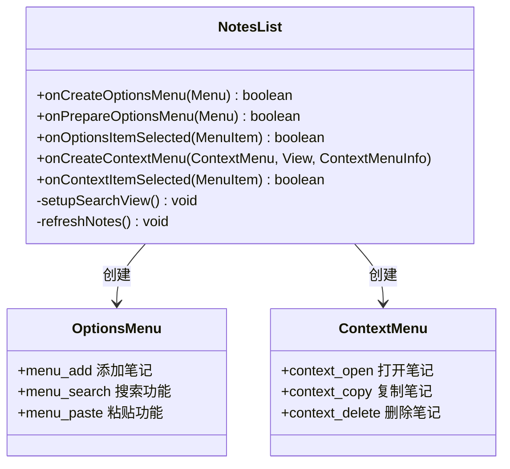

**图表来源**
- [NotesList.java](file://app/src/main/java/com/example/android/notepad/NotesList.java#L182-L515)
- [list_options_menu.xml](file://app/src/main/res/menu/list_options_menu.xml#L1-L23)
- [list_context_menu.xml](file://app/src/main/res/menu/list_context_menu.xml#L1-L9)

**章节来源**
- [NotesList.java](file://app/src/main/java/com/example/android/notepad/NotesList.java#L81-L550)

### 搜索功能实现

NotesList集成了强大的搜索功能，支持实时过滤笔记：

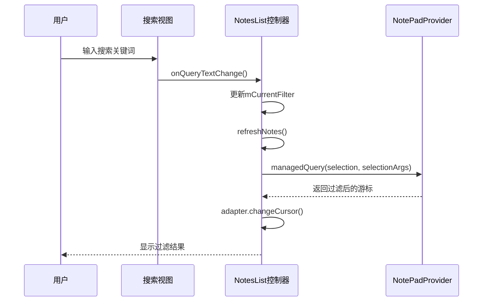

**图表来源**
- [NotesList.java](file://app/src/main/java/com/example/android/notepad/NotesList.java#L205-L231)
- [NotesList.java](file://app/src/main/java/com/example/android/notepad/NotesList.java#L233-L256)

## NoteEditor控制器详解

### Intent动作处理逻辑

NoteEditor是笔记编辑的主要控制器，根据不同的Intent动作执行相应的逻辑分支：

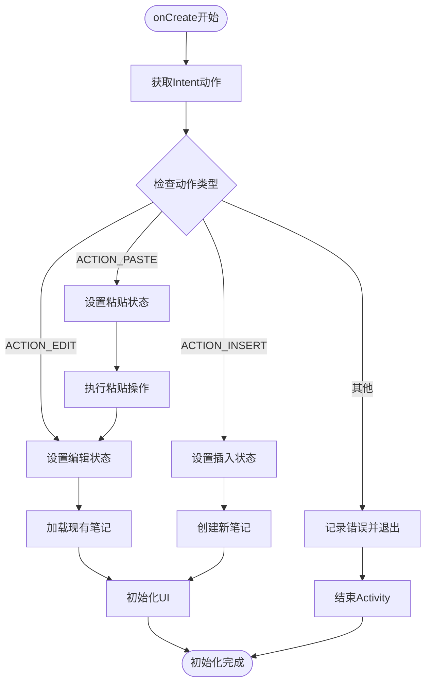

**图表来源**
- [NoteEditor.java](file://app/src/main/java/com/example/android/notepad/NoteEditor.java#L140-L200)

#### 编辑状态与插入状态的区别

| 状态 | Intent动作 | 数据源 | UI行为 |
|------|-----------|--------|--------|
| 编辑状态 | ACTION_EDIT | 已存在的笔记URI | 显示现有内容，允许修改 |
| 插入状态 | ACTION_INSERT | 新建空笔记 | 显示空白内容，自动保存 |
| 粘贴状态 | ACTION_PASTE | 剪贴板内容 | 从剪贴板导入内容 |

### 数据验证与异常处理

NoteEditor在保存笔记时执行严格的数据验证：

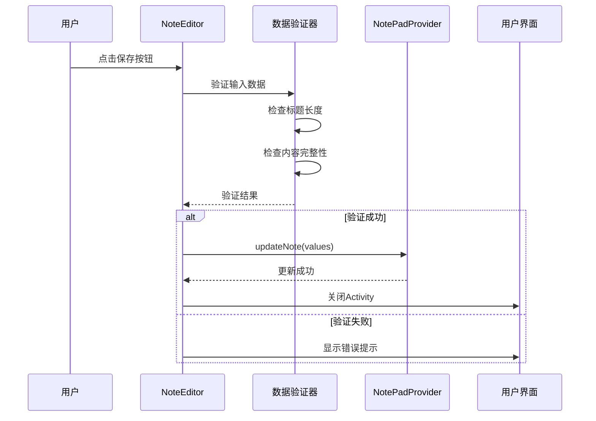

**图表来源**
- [NoteEditor.java](file://app/src/main/java/com/example/android/notepad/NoteEditor.java#L523-L577)

**章节来源**
- [NoteEditor.java](file://app/src/main/java/com/example/android/notepad/NoteEditor.java#L140-L616)

## Intent过滤器与启动机制

### AndroidManifest.xml配置分析

AndroidManifest.xml中的intent-filter配置定义了Activity的启动模式和Intent解析机制：

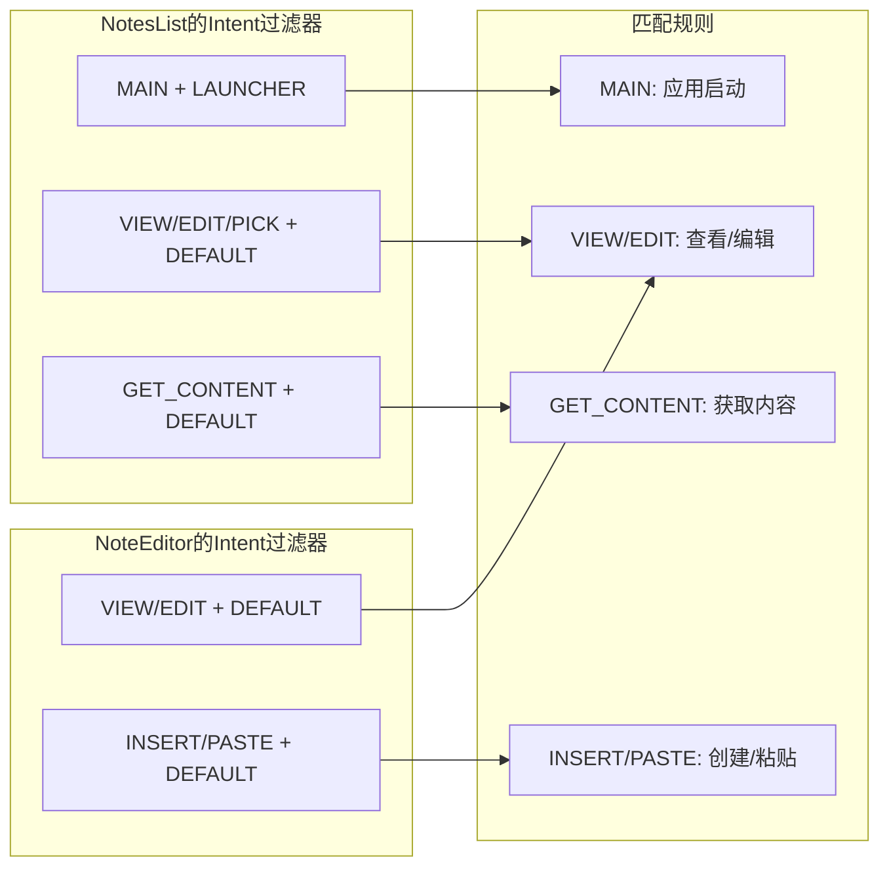

**图表来源**
- [AndroidManifest.xml](file://app/src/main/AndroidManifest.xml#L34-L77)

### 启动模式详解

| Activity | 启动模式 | 主要用途 | Intent匹配 |
|----------|---------|----------|------------|
| NotesList | LAUNCHER | 应用入口点 | MAIN + LAUNCHER |
| NotesList | VIEW/EDIT | 笔记列表浏览 | VIEW/EDIT + DEFAULT |
| NoteEditor | VIEW/EDIT | 单个笔记编辑 | VIEW/EDIT + DEFAULT |
| NoteEditor | INSERT/PASTE | 新笔记创建 | INSERT/PASTE + DEFAULT |

**章节来源**
- [AndroidManifest.xml](file://app/src/main/AndroidManifest.xml#L34-L77)

## 用户操作事件流分析

### 完整的操作流程追踪

以下是从用户点击菜单到数据更新的完整事件流：

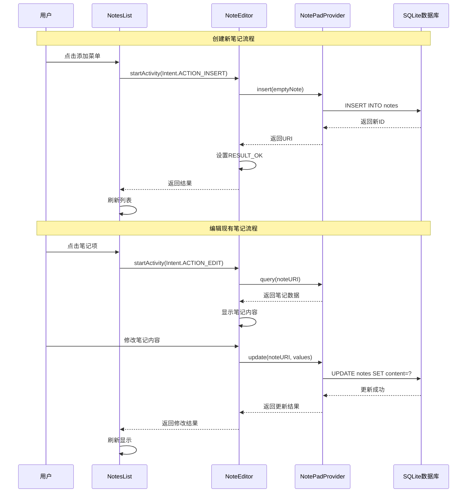

**图表来源**
- [NotesList.java](file://app/src/main/java/com/example/android/notepad/NotesList.java#L528-L548)
- [NoteEditor.java](file://app/src/main/java/com/example/android/notepad/NoteEditor.java#L164-L178)

### 上下文菜单操作流程

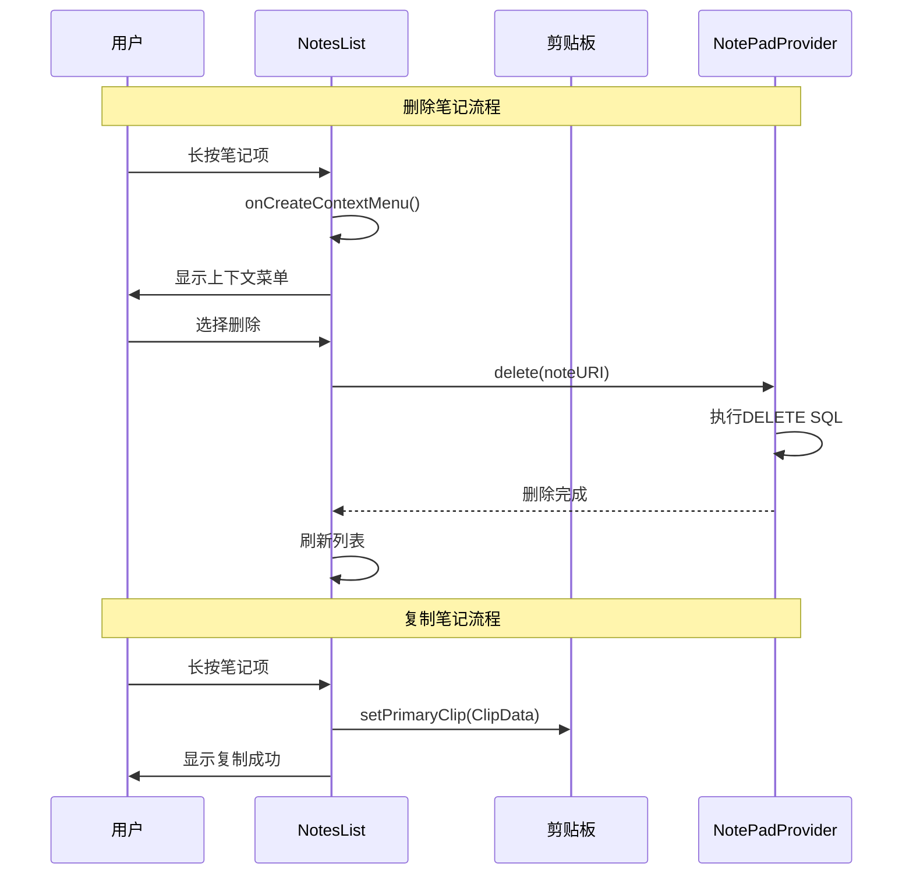

**图表来源**
- [NotesList.java](file://app/src/main/java/com/example/android/notepad/NotesList.java#L437-L514)

## 状态管理与生命周期

### Activity生命周期管理

NotePad应用的Controller层严格遵循Android的Activity生命周期规范：

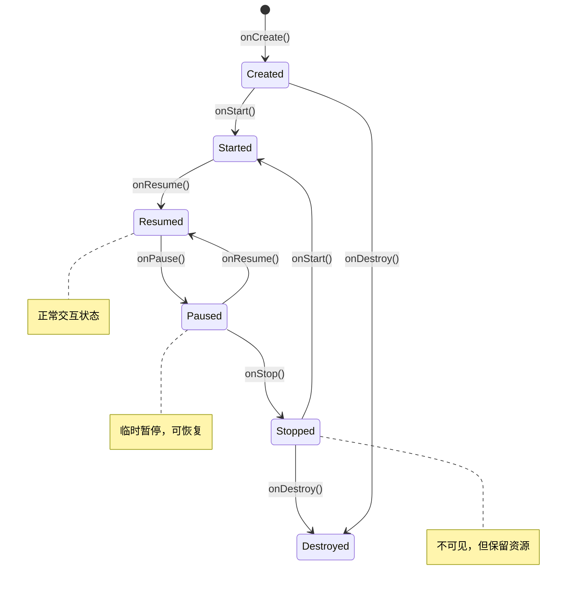

### 内存泄漏防范策略

#### NotesList的内存管理

NotesList通过以下机制防止内存泄漏：

| 防范措施 | 实现方式 | 效果 |
|----------|----------|------|
| 游标管理 | 使用managedQuery() | 自动关闭游标 |
| 适配器优化 | SimpleCursorAdapter | 避免直接持有数据引用 |
| 菜单状态 | onPrepareOptionsMenu() | 动态更新菜单状态 |

#### NoteEditor的状态保存

NoteEditor实现了完整的状态保存机制：

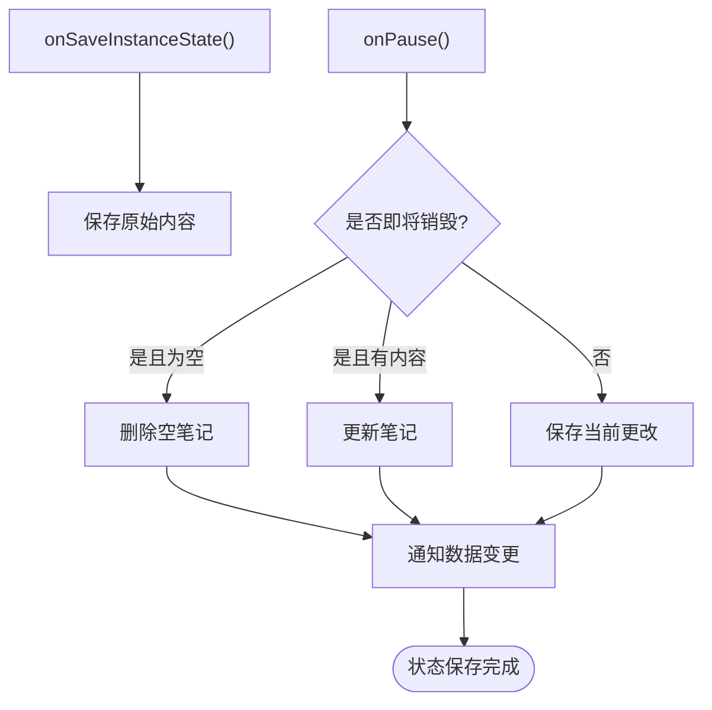

**图表来源**
- [NoteEditor.java](file://app/src/main/java/com/example/android/notepad/NoteEditor.java#L319-L376)

**章节来源**
- [NotesList.java](file://app/src/main/java/com/example/android/notepad/NotesList.java#L81-L166)
- [NoteEditor.java](file://app/src/main/java/com/example/android/notepad/NoteEditor.java#L140-L376)

## 最佳实践指南

### Controller层设计原则

1. **单一职责原则**
   - NotesList专注于笔记列表的展示和管理
   - NoteEditor专注于单个笔记的编辑功能

2. **状态机模式**
   - 使用明确的状态常量区分不同操作模式
   - 在生命周期方法中正确处理状态转换

3. **异步操作**
   - 虽然示例代码在UI线程执行数据库操作，实际应用应使用AsyncTask或ContentProvider的异步接口

### 性能优化建议

#### NotesList优化策略

| 优化点 | 实现方法 | 性能提升 |
|--------|----------|----------|
| 数据加载 | 使用CursorLoader替代managedQuery | 减少主线程阻塞 |
| 视图回收 | SimpleCursorAdapter的内置机制 | 提高滚动性能 |
| 搜索优化 | 实现延迟搜索和防抖机制 | 减少不必要的查询 |

#### NoteEditor优化策略

| 优化点 | 实现方法 | 性能提升 |
|--------|----------|----------|
| 文本处理 | 使用SpannableStringBuilder | 提高文本操作效率 |
| 状态保存 | 及时保存用户输入 | 防止数据丢失 |
| 内存管理 | 及时释放不需要的资源 | 减少内存占用 |

### 错误处理最佳实践

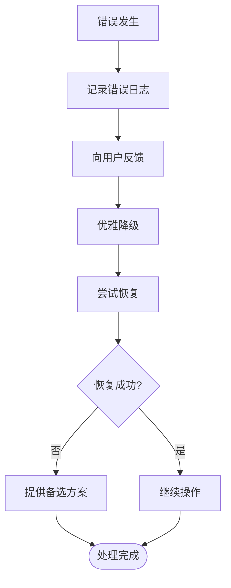

### 测试策略

#### 单元测试覆盖

| 测试类别 | 测试方法 | 测试重点 |
|----------|----------|----------|
| 生命周期测试 | 模拟Activity生命周期 | 状态保存和恢复 |
| Intent处理测试 | Mock Intent对象 | 不同动作的正确处理 |
| 数据操作测试 | 测试ContentProvider接口 | CRUD操作的正确性 |
| 异常处理测试 | 模拟各种异常情况 | 错误处理的健壮性 |

**章节来源**
- [NotesList.java](file://app/src/main/java/com/example/android/notepad/NotesList.java#L56-L550)
- [NoteEditor.java](file://app/src/main/java/com/example/android/notepad/NoteEditor.java#L54-L616)

## 总结

NotePad应用的Controller层展现了Android开发中控制器模式的经典实现。通过NotesList和NoteEditor两个核心Activity，我们看到了：

1. **清晰的职责分离**：每个控制器都有明确的功能边界和责任范围
2. **完善的生命周期管理**：严格遵循Android生命周期规范，确保资源的正确管理
3. **灵活的Intent处理**：通过Intent过滤器实现多种启动模式和数据传递方式
4. **健壮的状态管理**：通过状态机模式和状态保存机制确保应用的稳定性
5. **优秀的用户体验**：通过菜单系统、上下文操作和实时搜索提供流畅的交互体验

这些设计模式和最佳实践不仅适用于NotePad应用，也为Android应用开发提供了宝贵的参考价值。开发者在构建类似应用时，可以借鉴这些设计理念，同时根据具体需求进行适当的调整和优化。