# 主列表控制器详解

<cite>
**本文档引用的文件**
- [NotesList.java](file://app/src/main/java/com/example/android/notepad/NotesList.java)
- [NotePad.java](file://app/src/main/java/com/example/android/notepad/NotePad.java)
- [NotePadProvider.java](file://app/src/main/java/com/example/android/notepad/NotePadProvider.java)
- [noteslist_item.xml](file://app/src/main/res/layout/noteslist_item.xml)
- [list_options_menu.xml](file://app/src/main/res/menu/list_options_menu.xml)
- [list_context_menu.xml](file://app/src/main/res/menu/list_context_menu.xml)
- [strings.xml](file://app/src/main/res/values/strings.xml)
- [AndroidManifest.xml](file://app/src/main/AndroidManifest.xml)
- [CategoriesListActivity.java](file://app/src/main/java/com/example/android/notepad/CategoriesListActivity.java)
- [Category.java](file://app/src/main/java/com/example/android/notepad/Category.java)
- [CategoryDataSource.java](file://app/src/main/java/com/example/android/notepad/CategoryDataSource.java)
- [ExportActivity.java](file://app/src/main/java/com/example/android/notepad/ExportActivity.java)
- [ImportActivity.java](file://app/src/main/java/com/example/android/notepad/ImportActivity.java)
- [bottom_sheet_category_filter.xml](file://app/src/main/res/layout/bottom_sheet_category_filter.xml)
- [toolbar_menu.xml](file://app/src/main/res/menu/toolbar_menu.xml)
</cite>

## 更新摘要
**变更内容**
- 在“选项菜单（OptionsMenu）构建流程”部分新增了分类过滤、待办事项筛选和导入导出功能的集成说明
- 新增“分类过滤功能实现”章节，详细说明分类筛选的UI与逻辑实现
- 新增“待办事项筛选机制”章节，解析待办与普通笔记的URI路由机制
- 新增“导入导出功能集成”章节，阐述导入导出Activity的调用流程与权限处理
- 更新“架构概览”类图以包含新增组件
- 更新“项目结构概览”图表以反映新增模块

## 目录
1. [简介](#简介)
2. [项目结构概览](#项目结构概览)
3. [核心组件分析](#核心组件分析)
4. [架构概览](#架构概览)
5. [详细组件分析](#详细组件分析)
6. [依赖关系分析](#依赖关系分析)
7. [性能考虑](#性能考虑)
8. [故障排除指南](#故障排除指南)
9. [结论](#结论)

## 简介

NotesList是Android NotePad应用程序中的主列表控制器，负责展示用户的笔记列表。作为ListActivity的子类，它实现了完整的生命周期管理、UI绑定、数据查询、菜单系统和用户交互处理。该控制器采用传统的managedQuery方式执行数据库查询，虽然在现代Android开发中推荐使用AsyncQueryHandler或AsyncTask，但其设计模式仍然具有重要的学习价值。

## 项目结构概览

NotePad应用程序采用经典的Android MVC架构，主要包含以下核心模块：

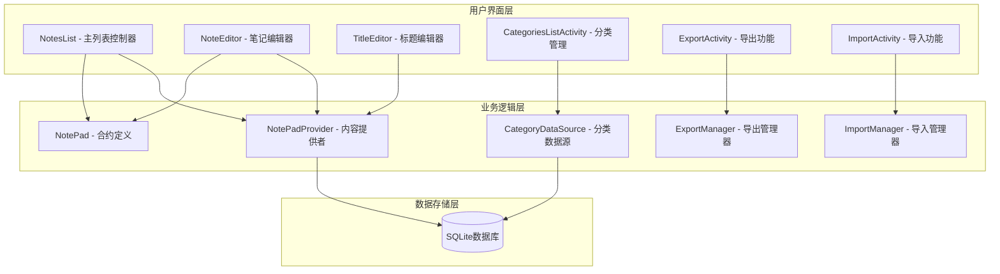

**图表来源**
- [NotesList.java](file://app/src/main/java/com/example/android/notepad/NotesList.java#L1-L50)
- [NotePadProvider.java](file://app/src/main/java/com/example/android/notepad/NotePadProvider.java#L1-L50)
- [NotePad.java](file://app/src/main/java/com/example/android/notepad/NotePad.java#L1-L50)
- [CategoryDataSource.java](file://app/src/main/java/com/example/android/notepad/CategoryDataSource.java#L1-L50)
- [ExportActivity.java](file://app/src/main/java/com/example/android/notepad/ExportActivity.java#L1-L50)
- [ImportActivity.java](file://app/src/main/java/com/example/android/notepad/ImportActivity.java#L1-L50)

**章节来源**
- [NotesList.java](file://app/src/main/java/com/example/android/notepad/NotesList.java#L1-L100)
- [AndroidManifest.xml](file://app/src/main/AndroidManifest.xml#L25-L50)

## 核心组件分析

### PROJECTION字段映射

NotesList定义了关键的PROJECTION数组，用于指定需要查询的数据库列：

| 列索引 | 列名 | 数据类型 | 描述 |
|--------|------|----------|------|
| 0 | _ID | INTEGER | 笔记唯一标识符 |
| 1 | COLUMN_NAME_TITLE | TEXT | 笔记标题 |
| 2 | COLUMN_NAME_MODIFICATION_DATE | INTEGER | 修改时间戳 |
| 3 | COLUMN_NAME_STATUS | INTEGER | 待办状态 |
| 4 | COLUMN_NAME_CATEGORY_ID | INTEGER | 分类ID |

这些映射确保了数据查询的精确性和效率，避免了不必要的列数据传输。

### SimpleCursorAdapter数据绑定逻辑

控制器通过SimpleCursorAdapter实现了高效的数据绑定：

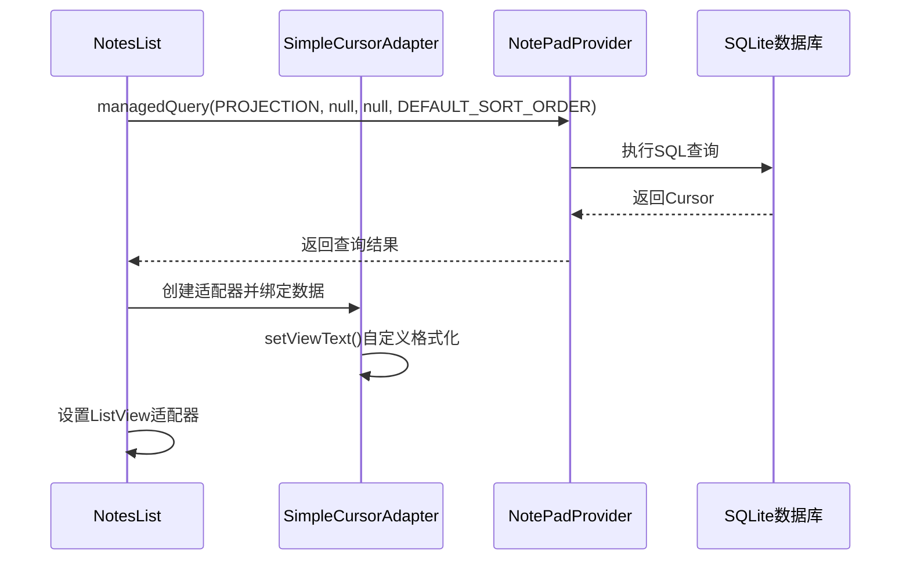

**图表来源**
- [NotesList.java](file://app/src/main/java/com/example/android/notepad/NotesList.java#L113-L166)
- [NotePadProvider.java](file://app/src/main/java/com/example/android/notepad/NotePadProvider.java#L252-L321)

**章节来源**
- [NotesList.java](file://app/src/main/java/com/example/android/notepad/NotesList.java#L64-L166)

## 架构概览

NotesList采用了典型的Android Activity生命周期管理模式，结合ListActivity的特性实现高效的列表展示：

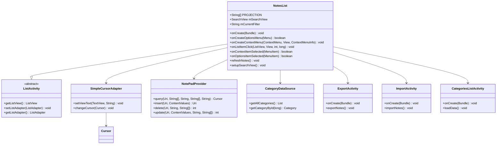

**图表来源**
- [NotesList.java](file://app/src/main/java/com/example/android/notepad/NotesList.java#L56-L100)
- [NotePadProvider.java](file://app/src/main/java/com/example/android/notepad/NotePadProvider.java#L252-L321)
- [CategoryDataSource.java](file://app/src/main/java/com/example/android/notepad/CategoryDataSource.java#L31-L196)
- [ExportActivity.java](file://app/src/main/java/com/example/android/notepad/ExportActivity.java#L52-L369)
- [ImportActivity.java](file://app/src/main/java/com/example/android/notepad/ImportActivity.java#L36-L247)
- [CategoriesListActivity.java](file://app/src/main/java/com/example/android/notepad/CategoriesListActivity.java#L1-L300)

## 详细组件分析

### 生命周期管理与UI绑定流程

#### onCreate方法深度解析

onCreate方法是NotesList的核心初始化入口，执行以下关键步骤：

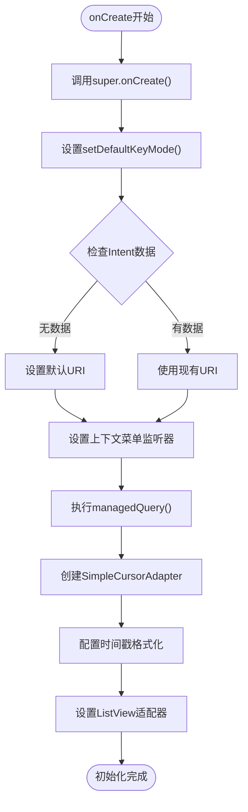

**图表来源**
- [NotesList.java](file://app/src/main/java/com/example/android/notepad/NotesList.java#L81-L166)

#### managedQuery数据查询机制

managedQuery是Android传统查询方式，直接在UI线程执行数据库操作：

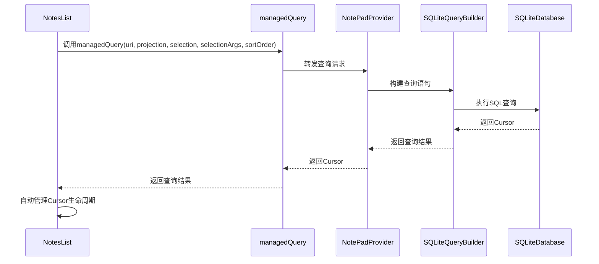

**图表来源**
- [NotesList.java](file://app/src/main/java/com/example/android/notepad/NotesList.java#L113-L119)
- [NotePadProvider.java](file://app/src/main/java/com/example/android/notepad/NotePadProvider.java#L252-L321)

**章节来源**
- [NotesList.java](file://app/src/main/java/com/example/android/notepad/NotesList.java#L81-L166)

### 时间戳格式化处理

SimpleCursorAdapter的setViewText方法实现了modification date的时间戳格式化：

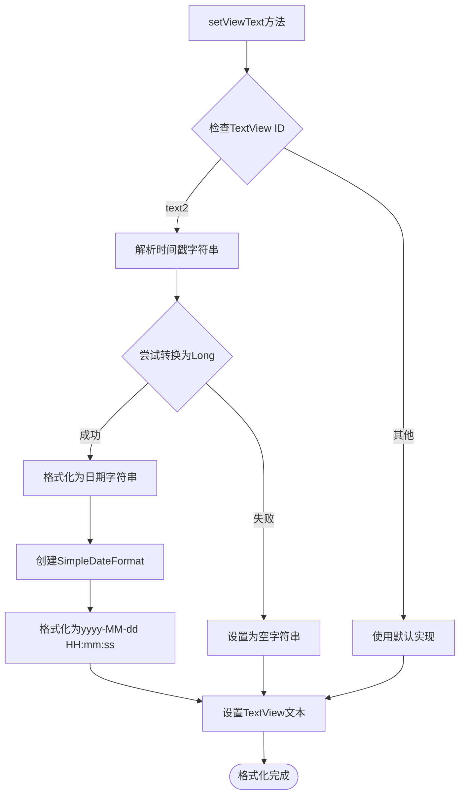

**图表来源**
- [NotesList.java](file://app/src/main/java/com/example/android/notepad/NotesList.java#L146-L162)

**章节来源**
- [NotesList.java](file://app/src/main/java/com/example/android/notepad/NotesList.java#L146-L162)

### 选项菜单（OptionsMenu）构建流程

#### 标准菜单项加载

选项菜单通过onCreateOptionsMenu方法构建，包含以下核心功能：

| 菜单项 | 功能描述 | 快捷键 | 显示位置 |
|--------|----------|--------|----------|
| menu_add | 新建笔记 | Alt+A | 始终显示 |
| menu_search | 搜索功能 | 可配置 | 折叠动作视图 |
| menu_paste | 粘贴功能 | Alt+P | 条件显示 |
| menu_manage_categories | 管理分类 | C | 始终显示 |
| menu_show_all | 显示全部笔记 | 无 | 始终显示 |
| menu_show_todo | 仅显示待办事项 | 无 | 始终显示 |
| menu_show_normal | 仅显示普通笔记 | 无 | 始终显示 |
| menu_filter_by_category | 按分类筛选 | 无 | 始终显示 |

#### 第三方应用扩展机制

通过addIntentOptions方法集成第三方应用：

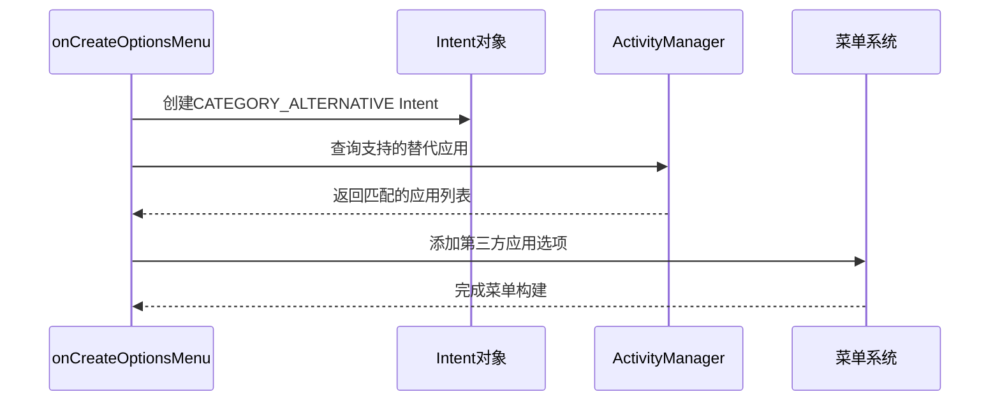

**图表来源**
- [NotesList.java](file://app/src/main/java/com/example/android/notepad/NotesList.java#L198-L200)

**章节来源**
- [NotesList.java](file://app/src/main/java/com/example/android/notepad/NotesList.java#L170-L202)

### 上下文菜单（ContextMenu）系统

#### 触发条件与动态生成

上下文菜单在用户长按列表项时触发：

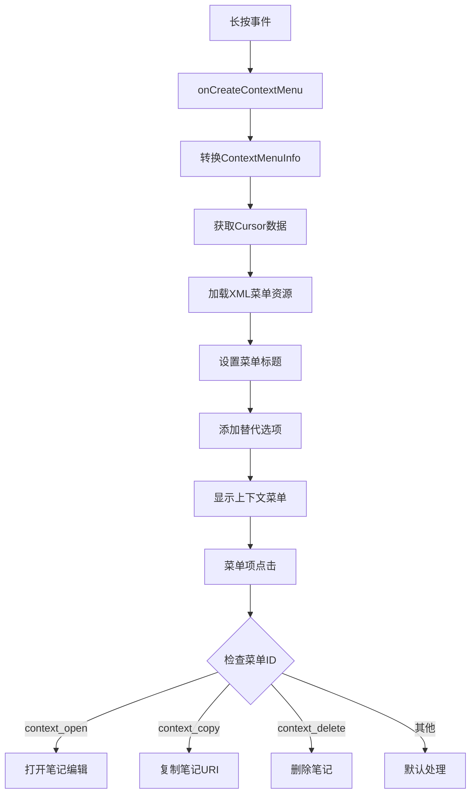

**图表来源**
- [NotesList.java](file://app/src/main/java/com/example/android/notepad/NotesList.java#L387-L435)
- [NotesList.java](file://app/src/main/java/com/example/android/notepad/NotesList.java#L447-L514)

#### COPY/DELETE操作实现逻辑

上下文菜单提供了简洁而有效的操作接口：

| 操作 | 实现方式 | 数据处理 |
|------|----------|----------|
| COPY | 复制到剪贴板 | 设置PrimaryClip包含笔记URI |
| DELETE | 数据库删除 | 使用ContentResolver.delete() |
| OPEN | 启动编辑器 | 发送ACTION_EDIT Intent |

**章节来源**
- [NotesList.java](file://app/src/main/java/com/example/android/notepad/NotesList.java#L387-L514)

### 用户交互路由分发

#### onListItemClick方法分析

用户点击笔记项时的路由分发逻辑：

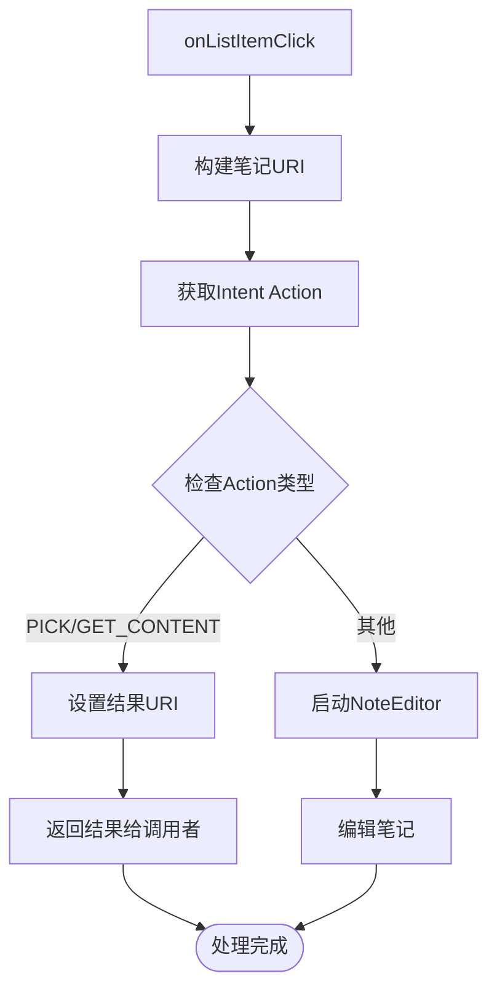

**图表来源**
- [NotesList.java](file://app/src/main/java/com/example/android/notepad/NotesList.java#L528-L548)

#### Intent Action路由机制

| Action类型 | 处理方式 | 应用场景 |
|------------|----------|----------|
| ACTION_PICK | 设置结果URI，返回给调用者 | 选择笔记作为返回值 |
| ACTION_GET_CONTENT | 设置结果URI，返回给调用者 | 获取笔记内容 |
| ACTION_EDIT | 启动NoteEditor进行编辑 | 默认编辑操作 |

**章节来源**
- [NotesList.java](file://app/src/main/java/com/example/android/notepad/NotesList.java#L528-L548)

### 搜索功能实现

#### SearchView集成与实时过滤

搜索功能通过SearchView实现实时过滤：

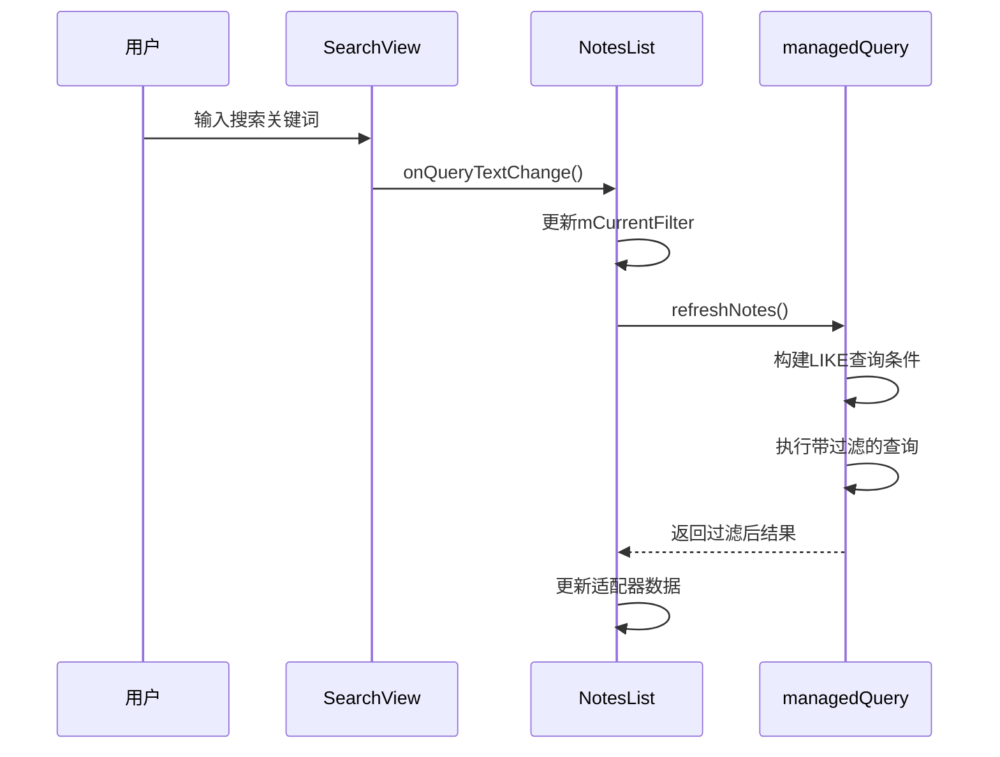

**图表来源**
- [NotesList.java](file://app/src/main/java/com/example/android/notepad/NotesList.java#L207-L230)
- [NotesList.java](file://app/src/main/java/com/example/android/notepad/NotesList.java#L233-L256)

**章节来源**
- [NotesList.java](file://app/src/main/java/com/example/android/notepad/NotesList.java#L206-L256)

### 分类过滤功能实现

#### 分类筛选菜单构建

NotesList通过setupCategoryFilterMenu方法动态构建分类筛选菜单：

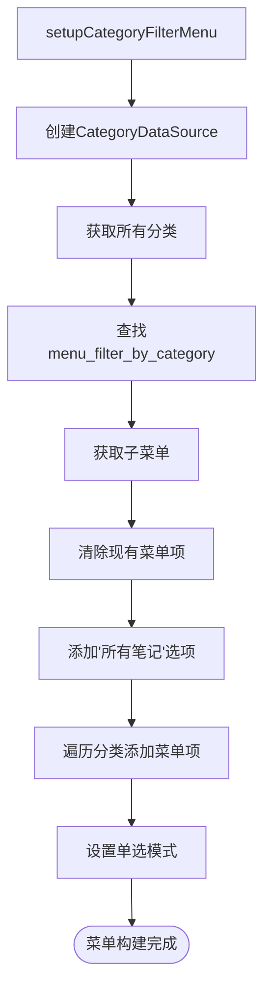

**图表来源**
- [NotesList.java](file://app/src/main/java/com/example/android/notepad/NotesList.java#L318-L359)

**章节来源**
- [NotesList.java](file://app/src/main/java/com/example/android/notepad/NotesList.java#L318-L359)

#### Bottom Sheet分类选择器

当用户选择"按分类筛选"时，显示Bottom Sheet进行分类选择：

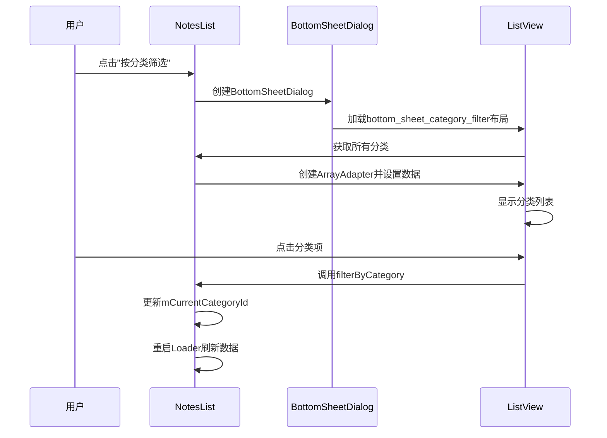

**图表来源**
- [NotesList.java](file://app/src/main/java/com/example/android/notepad/NotesList.java#L768-L824)
- [bottom_sheet_category_filter.xml](file://app/src/main/res/layout/bottom_sheet_category_filter.xml#L1-L30)

**章节来源**
- [NotesList.java](file://app/src/main/java/com/example/android/notepad/NotesList.java#L768-L824)

### 待办事项筛选机制

#### URI路由与状态过滤

NotesList通过不同的URI路径实现待办事项筛选：

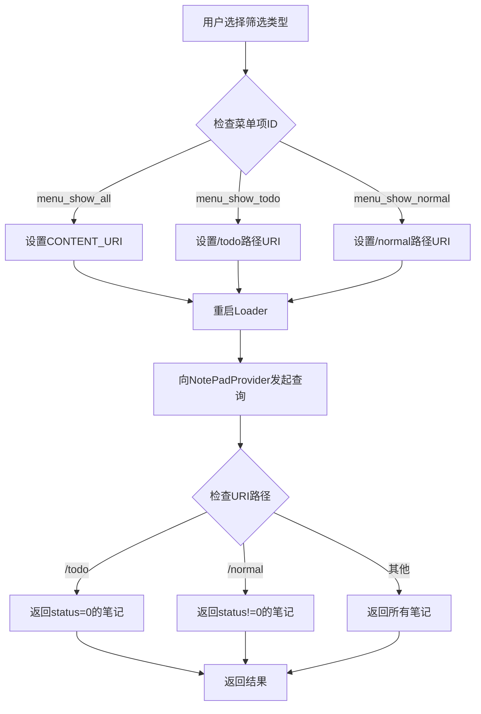

**图表来源**
- [NotesList.java](file://app/src/main/java/com/example/android/notepad/NotesList.java#L556-L572)
- [NotePadProvider.java](file://app/src/main/java/com/example/android/notepad/NotePadProvider.java#L252-L321)

**章节来源**
- [NotesList.java](file://app/src/main/java/com/example/android/notepad/NotesList.java#L556-L572)

### 导入导出功能集成

#### 功能入口与权限处理

导入导出功能通过选项菜单集成到主列表控制器：

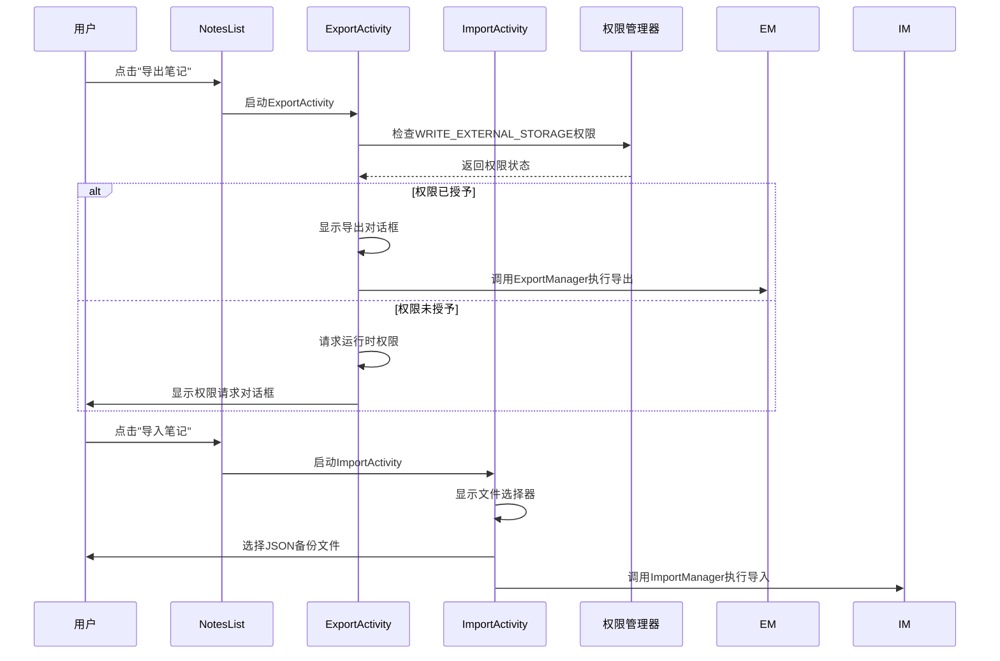

**图表来源**
- [NotesList.java](file://app/src/main/java/com/example/android/notepad/NotesList.java#L553-L555)
- [ExportActivity.java](file://app/src/main/java/com/example/android/notepad/ExportActivity.java#L64-L369)
- [ImportActivity.java](file://app/src/main/java/com/example/android/notepad/ImportActivity.java#L47-L247)
- [AndroidManifest.xml](file://app/src/main/AndroidManifest.xml#L124-L126)

**章节来源**
- [NotesList.java](file://app/src/main/java/com/example/android/notepad/NotesList.java#L553-L555)
- [ExportActivity.java](file://app/src/main/java/com/example/android/notepad/ExportActivity.java#L64-L369)
- [ImportActivity.java](file://app/src/main/java/com/example/android/notepad/ImportActivity.java#L47-L247)

## 依赖关系分析

### 组件耦合度分析

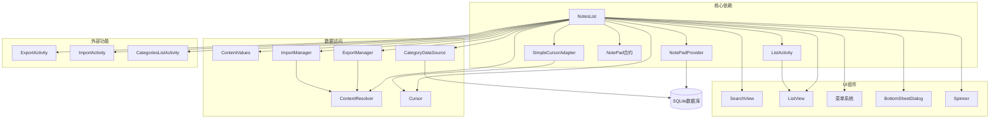

**图表来源**
- [NotesList.java](file://app/src/main/java/com/example/android/notepad/NotesList.java#L19-L41)
- [NotePadProvider.java](file://app/src/main/java/com/example/android/notepad/NotePadProvider.java#L19-L41)
- [CategoryDataSource.java](file://app/src/main/java/com/example/android/notepad/CategoryDataSource.java#L31-L196)
- [ExportActivity.java](file://app/src/main/java/com/example/android/notepad/ExportActivity.java#L52-L369)
- [ImportActivity.java](file://app/src/main/java/com/example/android/notepad/ImportActivity.java#L36-L247)

### 外部依赖管理

| 依赖类型 | 组件名称 | 版本要求 | 用途 |
|----------|----------|----------|------|
| Android SDK | ListActivity | API 1+ | 基础列表功能 |
| Android SDK | SimpleCursorAdapter | API 1+ | 数据绑定 |
| Android SDK | ContentProvider | API 1+ | 数据访问 |
| Android SDK | SearchView | API 11+ | 搜索功能 |
| Android SDK | BottomSheetDialog | API 23+ | 分类筛选UI |
| Android SDK | ActivityCompat | API 23+ | 运行时权限处理 |

**章节来源**
- [NotesList.java](file://app/src/main/java/com/example/android/notepad/NotesList.java#L19-L41)

## 性能考虑

### UI线程查询的性能影响

当前实现直接在UI线程执行managedQuery，存在以下性能问题：

1. **阻塞风险**：大数据量查询会阻塞主线程
2. **ANR风险**：超过5秒的查询可能导致应用无响应
3. **用户体验**：大列表加载缓慢

### AsyncQueryHandler最佳实践建议

现代Android开发推荐使用AsyncQueryHandler替代UI线程查询：

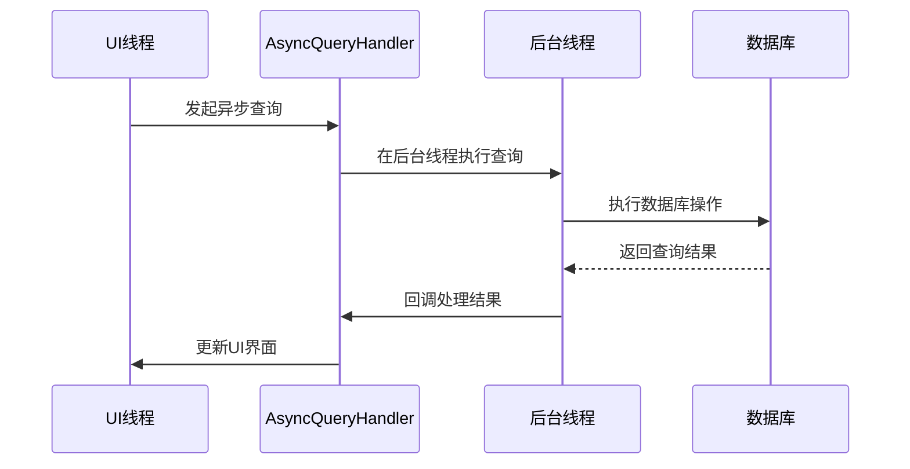

### 优化策略建议

1. **使用AsyncQueryHandler**：将数据库操作移至后台线程
2. **实现分页加载**：限制每次查询的数据量
3. **添加进度指示器**：提升用户体验
4. **缓存机制**：减少重复查询次数
5. **分类缓存**：在NotesList中维护mCategoryCache减少数据库查询

## 故障排除指南

### 常见问题诊断

#### 数据查询失败

**症状**：笔记列表为空或显示错误
**可能原因**：
- 数据库连接失败
- 查询条件错误
- 权限不足

**解决方案**：
1. 检查数据库状态
2. 验证查询参数
3. 确认权限配置

#### 菜单显示异常

**症状**：菜单项不显示或显示错误
**可能原因**：
- 菜单资源文件缺失
- Intent过滤器配置错误
- 权限问题

**解决方案**：
1. 检查菜单XML文件
2. 验证Intent过滤器
3. 确认应用权限

#### 上下文菜单无响应

**症状**：长按无反应或菜单不显示
**可能原因**：
- ContextMenu监听器未设置
- 菜单项ID配置错误
- 数据绑定问题

**解决方案**：
1. 确认setOnCreateContextMenuListener调用
2. 检查菜单资源ID
3. 验证数据源完整性

#### 分类筛选无效

**症状**：分类筛选后数据未更新
**可能原因**：
- filterByCategory方法未正确调用
- Loader未重启
- 分类ID映射错误

**解决方案**：
1. 检查filterByCategory调用逻辑
2. 确认restartLoader被调用
3. 验证分类ID与名称的映射关系

#### 导出权限被拒绝

**症状**：导出功能无法保存文件
**可能原因**：
- WRITE_EXTERNAL_STORAGE权限未授予
- 存储空间不足
- 目录创建失败

**解决方案**：
1. 检查权限请求流程
2. 验证存储空间
3. 确认Environment.getExternalStoragePublicDirectory可用

**章节来源**
- [NotesList.java](file://app/src/main/java/com/example/android/notepad/NotesList.java#L387-L514)
- [ExportActivity.java](file://app/src/main/java/com/example/android/notepad/ExportActivity.java#L147-L189)

## 结论

NotesList作为Android NotePad应用的主列表控制器，展现了传统Android开发模式的典型特征。其设计体现了以下重要原则：

1. **清晰的职责分离**：控制器专注于UI管理和用户交互
2. **标准的生命周期管理**：遵循Android Activity生命周期规范
3. **灵活的菜单系统**：支持标准操作和第三方扩展
4. **直观的数据绑定**：通过SimpleCursorAdapter实现高效展示
5. **模块化功能扩展**：通过独立Activity实现分类管理、导入导出等复杂功能

虽然当前实现直接在UI线程执行数据库查询，存在性能瓶颈，但其架构设计为后续优化提供了良好的基础。建议开发者在实际项目中采用AsyncQueryHandler等现代技术，以提升应用的响应性和稳定性。

通过深入理解NotesList的设计理念和实现细节，开发者可以更好地掌握Android列表控件的开发技巧，为构建高质量的移动应用奠定坚实基础。