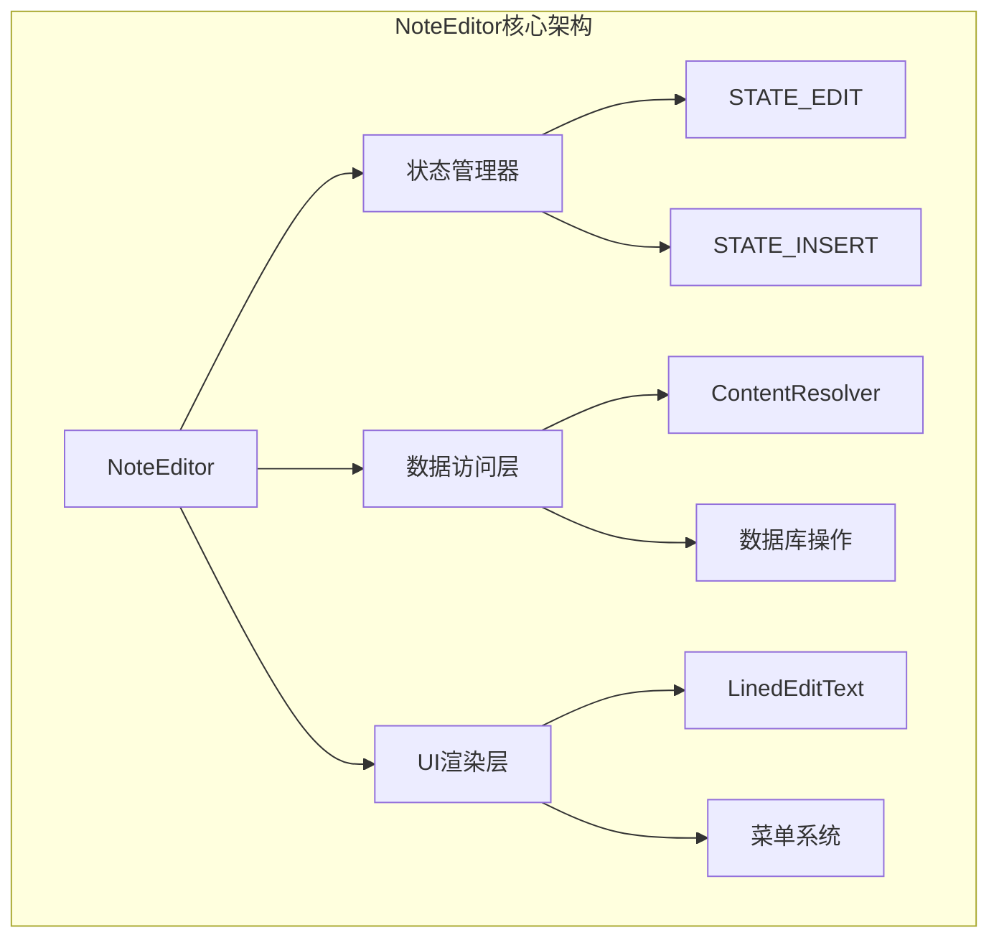
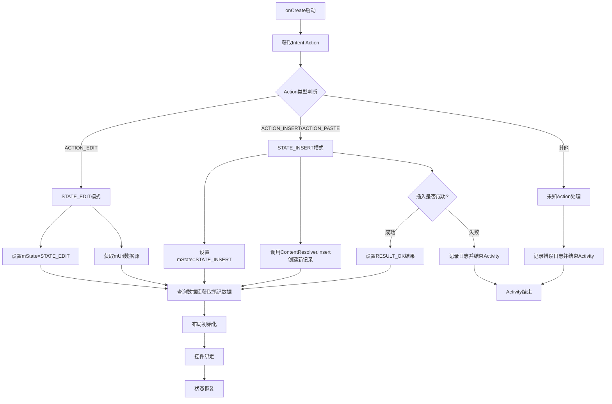
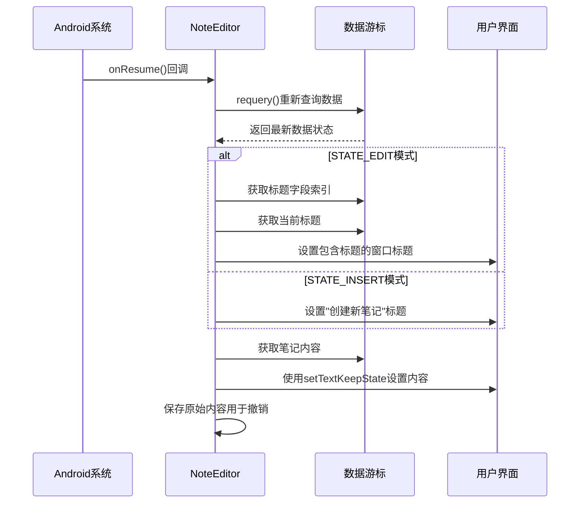
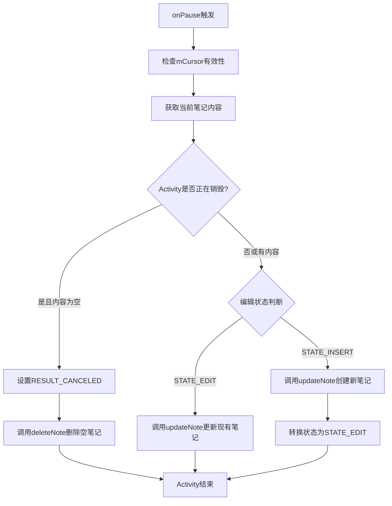
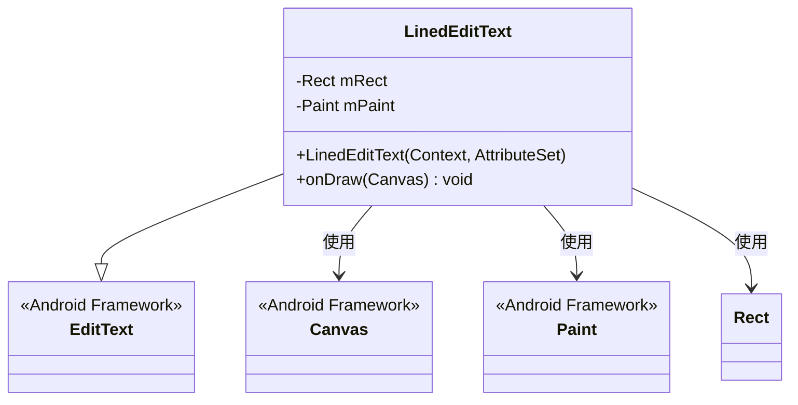
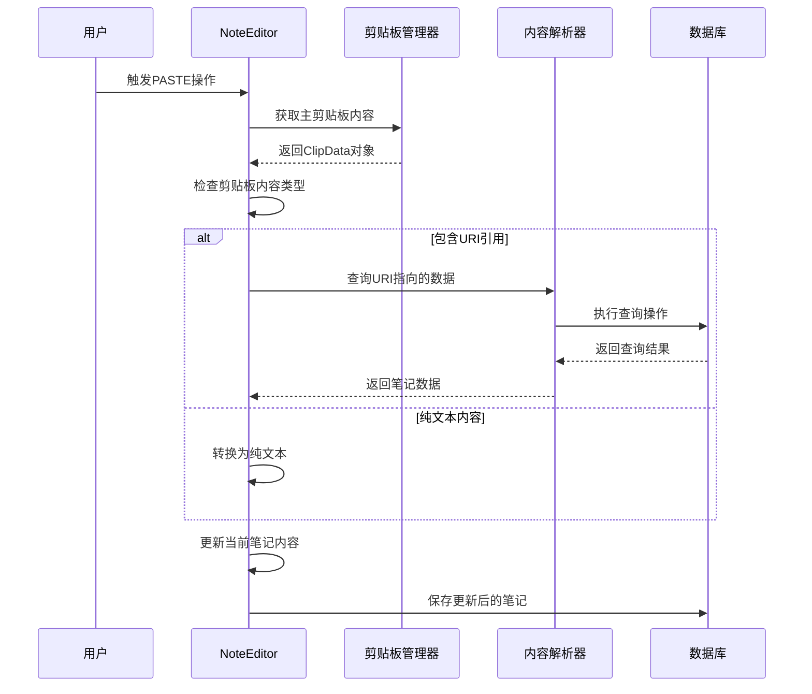
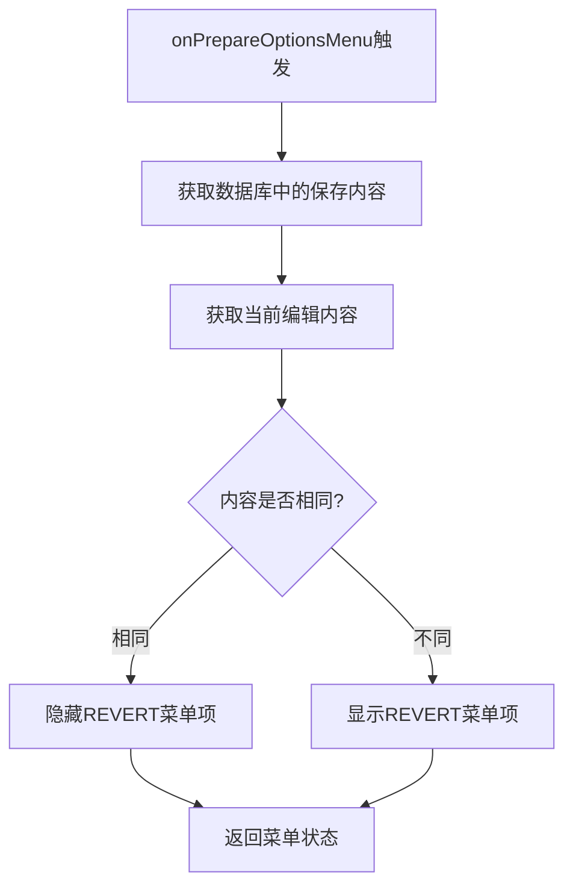

# NoteEditor编辑控制器详解

<cite>
**本文档引用的文件**
- [NoteEditor.java](file://app/src/main/java/com/example/android/notepad/NoteEditor.java)
- [note_editor.xml](file://app/src/main/res/layout/note_editor.xml)
- [editor_options_menu.xml](file://app/src/main/res/menu/editor_options_menu.xml)
- [AndroidManifest.xml](file://app/src/main/AndroidManifest.xml)
</cite>

## 目录
1. [简介](#简介)
2. [项目结构概览](#项目结构概览)
3. [核心组件架构](#核心组件架构)
4. [多模式处理机制](#多模式处理机制)
5. [生命周期管理](#生命周期管理)
6. [数据持久化策略](#数据持久化策略)
7. [用户界面设计](#用户界面设计)
8. [剪贴板集成](#剪贴板集成)
9. [性能优化考虑](#性能优化考虑)
10. [总结](#总结)

## 简介

NoteEditor是Android笔记应用中的核心编辑控制器，负责处理笔记的创建、编辑和删除操作。该组件采用多模式处理机制，能够根据不同的Intent Action（EDIT/INSERT/PASTE）执行相应的业务逻辑，为用户提供流畅的笔记编辑体验。

## 项目结构概览

NoteEditor位于`com.example.android.notepad`包中，作为笔记应用的主要编辑界面。其核心功能通过Activity生命周期方法和状态管理机制实现，支持多种编辑场景的无缝切换。

**图表来源**
- [NoteEditor.java](file://app/src/main/java/com/example/android/notepad/NoteEditor.java#L53-L81)

## 核心组件架构

### 状态常量定义

NoteEditor定义了两个核心状态常量来区分不同的编辑模式：

- **STATE_EDIT (0)**：用于编辑现有笔记
- **STATE_INSERT (1)**：用于创建新笔记

这些状态常量贯穿整个编辑流程，决定了后续的操作行为和界面表现。

### 数据模型映射

系统使用标准化的投影数组来获取笔记数据：
- `_ID`：笔记唯一标识符
- `COLUMN_NAME_TITLE`：笔记标题
- `COLUMN_NAME_NOTE`：笔记内容

**章节来源**
- [NoteEditor.java](file://app/src/main/java/com/example/android/notepad/NoteEditor.java#L60-L66)

## 多模式处理机制

### onCreate方法中的状态分支判断

onCreate方法是NoteEditor的核心入口点，负责根据Intent Action确定编辑模式并初始化相应资源。

**图表来源**
- [NoteEditor.java](file://app/src/main/java/com/example/android/notepad/NoteEditor.java#L139-L239)

### STATE_EDIT与STATE_INSERT初始化差异

#### STATE_EDIT模式初始化
- **数据来源**：从Intent中获取已存在的笔记URI
- **数据查询**：通过ContentResolver查询现有笔记数据
- **状态标识**：mState设置为STATE_EDIT
- **用户交互**：允许修改现有内容，支持撤销操作

#### STATE_INSERT模式初始化
- **数据来源**：调用ContentResolver.insert创建新的空记录
- **数据查询**：插入后立即查询新创建的笔记记录
- **状态标识**：mState设置为STATE_INSERT
- **用户交互**：需要用户输入内容，自动创建初始标题

**章节来源**
- [NoteEditor.java](file://app/src/main/java/com/example/android/notepad/NoteEditor.java#L157-L199)

### INSERT模式下的ContentResolver.insert实现

在INSERT模式下，系统通过以下步骤创建新笔记记录：

1. **URI构建**：使用Intent提供的通用笔记URI
2. **记录插入**：调用ContentResolver.insert方法创建空记录
3. **结果验证**：检查返回的URI是否为空以确认插入成功
4. **异常处理**：插入失败时记录错误并终止Activity

**章节来源**
- [NoteEditor.java](file://app/src/main/java/com/example/android/notepad/NoteEditor.java#L168-L186)

## 生命周期管理

### onResume中的动态标题设置

onResume方法负责在Activity重新获得焦点时更新界面状态，特别是根据当前编辑状态动态设置Activity标题。

**图表来源**
- [NoteEditor.java](file://app/src/main/java/com/example/android/notepad/NoteEditor.java#L250-L298)

### mText.setTextKeepState的用户体验优化

setTextKeepState方法确保在更新文本内容时保持光标位置不变，这一设计细节显著提升了用户的编辑体验：

- **光标位置保持**：避免因内容更新导致光标跳转
- **编辑连续性**：让用户能够无缝继续编辑工作
- **用户体验一致性**：符合现代应用的交互标准

**章节来源**
- [NoteEditor.java](file://app/src/main/java/com/example/android/notepad/NoteEditor.java#L289-L293)

### onPause中的自动保存策略

onPause方法实现了智能的自动保存机制，遵循Android应用设计原则：

**图表来源**
- [NoteEditor.java](file://app/src/main/java/com/example/android/notepad/NoteEditor.java#L337-L376)

### 新建笔记的撤销逻辑

对于新建的笔记，系统实现了特殊的撤销处理逻辑：

- **编辑状态**：调用cancelNote时直接恢复原始内容
- **插入状态**：调用cancelNote时删除新创建的空笔记
- **状态转换**：INSERT状态下完成首次保存后自动转换为EDIT状态

**章节来源**
- [NoteEditor.java](file://app/src/main/java/com/example/android/notepad/NoteEditor.java#L585-L601)

## 数据持久化策略

### mCursor数据加载过程

mCursor对象承载着笔记数据的查询结果，其加载过程涉及多个关键步骤：

1. **查询执行**：通过managedQuery方法执行数据库查询
2. **数据绑定**：将查询结果映射到对应的字段索引
3. **状态维护**：确保数据的一致性和完整性

### 不同生命周期方法中的使用方式

- **onCreate**：初始化时建立数据连接，准备编辑环境
- **onResume**：重新查询数据，确保显示最新的笔记内容
- **onPause**：保存当前编辑状态，执行自动持久化

**章节来源**
- [NoteEditor.java](file://app/src/main/java/com/example/android/notepad/NoteEditor.java#L209-L216)

## 用户界面设计

### LinedEditText自定义控件

NoteEditor引入了LinedEditText自定义控件来提升编辑体验：

**图表来源**
- [NoteEditor.java](file://app/src/main/java/com/example/android/notepad/NoteEditor.java#L85-L134)

### 绘制原理分析

LinedEditText的绘制机制基于Canvas API，通过以下步骤实现行线绘制：

1. **行数计算**：获取当前EditText中的行数
2. **坐标获取**：通过getLineBounds方法获取每行的基线坐标
3. **线条绘制**：在每行基线下方绘制水平线
4. **样式配置**：使用蓝色半透明线条增强视觉效果

这种设计特别适合笔记编辑场景，帮助用户更好地组织和阅读长篇内容。

**章节来源**
- [NoteEditor.java](file://app/src/main/java/com/example/android/notepad/NoteEditor.java#L105-L133)

## 剪贴板集成

### performPaste方法的完整流程

performPaste方法实现了从剪贴板提取数据并填充笔记内容的完整功能：

**图表来源**
- [NoteEditor.java](file://app/src/main/java/com/example/android/notepad/NoteEditor.java#L454-L514)

### URI与纯文本的处理策略

系统对剪贴板内容采用智能识别机制：

- **URI检测**：优先尝试将剪贴板内容识别为笔记URI
- **MIME类型验证**：确认URI指向的数据类型匹配
- **降级处理**：当URI无效时自动转换为纯文本
- **数据合并**：同时获取标题和内容信息

**章节来源**
- [NoteEditor.java](file://app/src/main/java/com/example/android/notepad/NoteEditor.java#L474-L511)

## 选项菜单功能实现

### SAVE/DELETE/REVERT功能详解

NoteEditor提供了完整的笔记操作菜单，每个功能都有明确的实现逻辑：

| 功能 | 实现方法 | 行为描述 |
|------|----------|----------|
| 保存(SAVE) | onOptionsItemSelected | 获取当前内容，调用updateNote，然后finish() |
| 删除(DELETE) | onOptionsItemSelected | 调用deleteNote，然后finish() |
| 撤销(REVERT) | onOptionsItemSelected | 调用cancelNote，恢复原始内容 |

### REVERT菜单项的可见性控制

REVERT菜单项的显示状态通过onPrepareOptionsMenu方法动态控制：

**图表来源**
- [NoteEditor.java](file://app/src/main/java/com/example/android/notepad/NoteEditor.java#L410-L422)

**章节来源**
- [NoteEditor.java](file://app/src/main/java/com/example/android/notepad/NoteEditor.java#L434-L448)

## 性能优化考虑

### 同步操作的潜在问题

NoteEditor在多个关键方法中直接使用ContentResolver进行同步操作：

- **onCreate中的managedQuery**：阻塞UI线程直到查询完成
- **onPause中的updateNote**：阻塞UI线程直到更新完成
- **performPaste中的cr.query**：阻塞UI线程直到查询完成

这种设计虽然简化了代码结构，但在实际应用中可能导致性能问题。建议改用AsyncQueryHandler或AsyncTask等异步机制。

### 内存管理策略

系统采用了多项内存管理措施：

- **Cursor生命周期管理**：在适当时机关闭Cursor避免内存泄漏
- **状态保存恢复**：通过onSaveInstanceState保存关键状态
- **资源释放**：在Activity销毁前清理相关资源

## 总结

NoteEditor作为笔记编辑控制器展现了优秀的软件架构设计：

1. **多模式处理**：通过Intent Action区分编辑和创建场景，实现灵活的功能切换
2. **状态管理**：清晰的状态常量和生命周期方法配合，确保操作的一致性
3. **用户体验**：从光标保持到自动保存，每个细节都体现了对用户需求的深入理解
4. **扩展性**：模块化的代码结构为功能扩展提供了良好的基础
5. **数据安全**：完善的撤销机制和自动保存策略保障数据完整性

该组件的设计充分体现了Android应用开发的最佳实践，为开发者提供了优秀的参考范例。通过深入理解其实现原理，可以更好地掌握Android应用开发中的核心概念和技术要点。