# MVC架构详解：NotePad应用设计分析

<cite>
**本文档引用的文件**
- [NotePadProvider.java](file://app/src/main/java/com/example/android/notepad/NotePadProvider.java)
- [NotesList.java](file://app/src/main/java/com/example/android/notepad/NotesList.java)
- [NoteEditor.java](file://app/src/main/java/com/example/android/notepad/NoteEditor.java)
- [NotePad.java](file://app/src/main/java/com/example/android/notepad/NotePad.java)
- [noteslist_item.xml](file://app/src/main/res/layout/noteslist_item.xml)
- [note_editor.xml](file://app/src/main/res/layout/note_editor.xml)
- [list_options_menu.xml](file://app/src/main/res/menu/list_options_menu.xml)
- [editor_options_menu.xml](file://app/src/main/res/menu/editor_options_menu.xml)
- [CategoriesListActivity.java](file://app/src/main/java/com/example/android/notepad/CategoriesListActivity.java)
- [CategoryEditorActivity.java](file://app/src/main/java/com/example/android/notepad/CategoryEditorActivity.java)
- [CategoryDataSource.java](file://app/src/main/java/com/example/android/notepad/CategoryDataSource.java)
- [Category.java](file://app/src/main/java/com/example/android/notepad/Category.java)
- [ExportActivity.java](file://app/src/main/java/com/example/android/notepad/ExportActivity.java)
- [ImportActivity.java](file://app/src/main/java/com/example/android/notepad/ImportActivity.java)
- [ExportManager.java](file://app/src/main/java/com/example/android/notepad/ExportManager.java)
- [ImportManager.java](file://app/src/main/java/com/example/android/notepad/ImportManager.java)
- [activity_categories_list.xml](file://app/src/main/res/layout/activity_categories_list.xml)
- [activity_category_editor.xml](file://app/src/main/res/layout/activity_category_editor.xml)
- [activity_export.xml](file://app/src/main/res/layout/activity_export.xml)
- [activity_import.xml](file://app/src/main/res/layout/activity_import.xml)
</cite>

## 更新摘要
**变更内容**
- 在Model层中添加了分类管理、待办事项和导入导出功能的详细说明
- 在View层中更新了布局文件和数据绑定机制，以支持新功能
- 在Controller层中扩展了Activity和菜单系统的功能描述
- 新增了MVC组件交互机制的更新内容
- 更新了架构优势与最佳实践部分

## 目录
1. [引言](#引言)
2. [项目结构概览](#项目结构概览)
3. [Model层深度分析](#model层深度分析)
4. [View层深度分析](#view层深度分析)
5. [Controller层深度分析](#controller层深度分析)
6. [MVC组件交互机制](#mvc组件交互机制)
7. [数据流与生命周期管理](#数据流与生命周期管理)
8. [架构优势与最佳实践](#架构优势与最佳实践)
9. [总结](#总结)

## 引言

NotePad应用是一个经典的Android示例应用，完美展示了MVC（Model-View-Controller）架构模式在移动应用开发中的实际应用。该应用通过ContentProvider作为数据层，Activity作为控制器层，XML布局文件作为视图层，构建了一个完整且可维护的应用架构。

本文档将深入分析NotePad应用的MVC架构实现，重点关注各层之间的交互机制、数据流向以及设计模式的应用，为Android开发者提供清晰的架构理解和实践指导。

## 项目结构概览

NotePad应用采用标准的Android项目结构，清晰地分离了MVC三个层次：

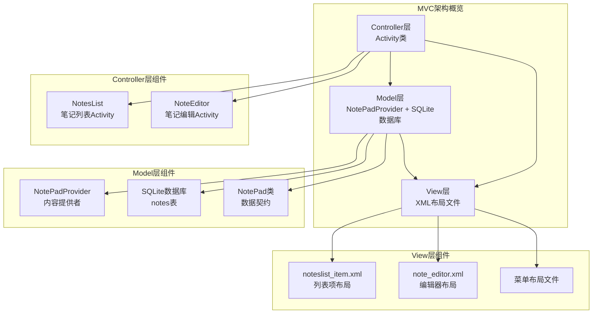

**图表来源**
- [NotePadProvider.java](file://app/src/main/java/com/example/android/notepad/NotePadProvider.java#L1-L50)
- [NotesList.java](file://app/src/main/java/com/example/android/notepad/NotesList.java#L1-L50)
- [NoteEditor.java](file://app/src/main/java/com/example/android/notepad/NoteEditor.java#L1-L50)

**章节来源**
- [NotePadProvider.java](file://app/src/main/java/com/example/android/notepad/NotePadProvider.java#L1-L100)
- [NotesList.java](file://app/src/main/java/com/example/android/notepad/NotesList.java#L1-L100)
- [NoteEditor.java](file://app/src/main/java/com/example/android/notepad/NoteEditor.java#L1-L100)

## Model层深度分析

Model层是NotePad应用的数据核心，主要由NotePadProvider和SQLite数据库组成，负责数据的存储、检索和管理。

### 数据库设计与ContentProvider架构

NotePadProvider继承自ContentProvider，实现了Android平台的标准数据访问接口：

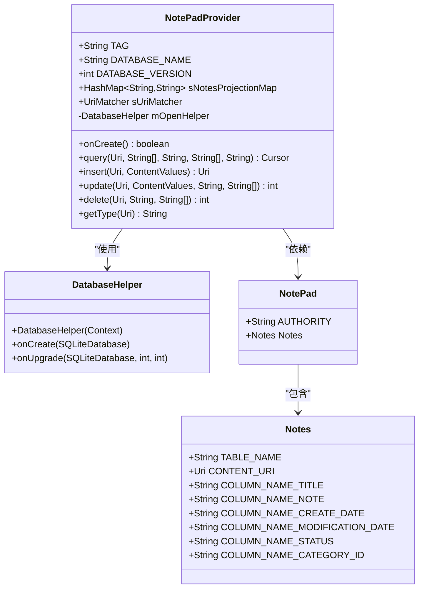

**图表来源**
- [NotePadProvider.java](file://app/src/main/java/com/example/android/notepad/NotePadProvider.java#L54-L223)
- [NotePad.java](file://app/src/main/java/com/example/android/notepad/NotePad.java#L38-L154)

### 数据库创建与升级机制

数据库采用SQLite实现，通过DatabaseHelper类管理：

| 组件 | 功能描述 | 实现细节 |
|------|----------|----------|
| 数据库名称 | note_pad.db | 定义在DATABASE_NAME常量中 |
| 版本控制 | 当前版本4 | 通过DATABASE_VERSION跟踪，支持分类和待办事项功能 |
| 表结构 | notes表和categories表 | notes表包含标题、内容、创建时间、修改时间、状态和分类ID字段 |
| 主键策略 | 自增ID | 使用INTEGER PRIMARY KEY |

### CRUD操作实现机制

Model层提供了完整的CRUD操作，通过ContentProvider接口暴露：

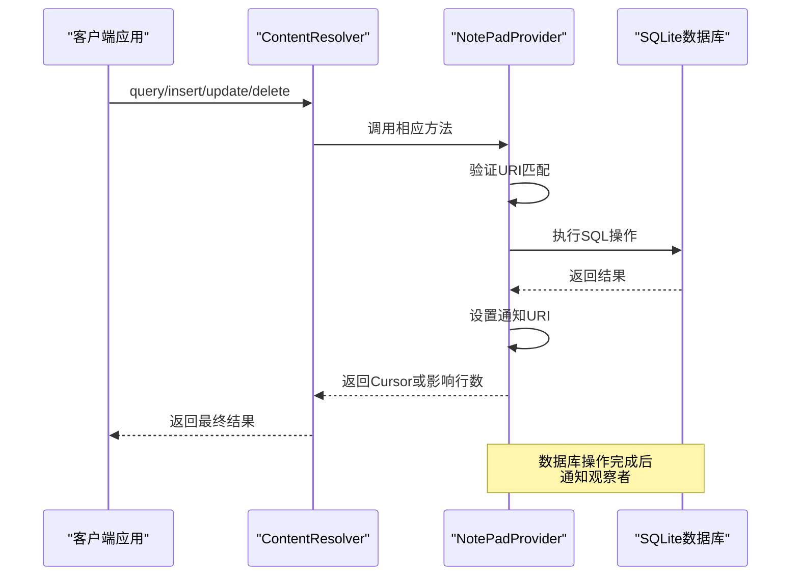

**图表来源**
- [NotePadProvider.java](file://app/src/main/java/com/example/android/notepad/NotePadProvider.java#L243-L739)

### 数据投影映射系统

Model层使用投影映射系统优化数据查询：

| 映射类型 | 投影映射 | 用途 |
|----------|----------|------|
| 标准投影 | sNotesProjectionMap | 常规笔记查询 |
| 实时文件夹投影 | sLiveFolderProjectionMap | LiveFolder支持 |
| 读取笔记投影 | READ_NOTE_PROJECTION | 笔记内容读取 |
| 分类投影 | sCategoriesProjectionMap | 分类数据查询 |

**章节来源**
- [NotePadProvider.java](file://app/src/main/java/com/example/android/notepad/NotePadProvider.java#L54-L321)
- [NotePad.java](file://app/src/main/java/com/example/android/notepad/NotePad.java#L38-L154)

### 分类管理数据模型

新增的分类管理功能通过Category类和CategoryDataSource类实现：

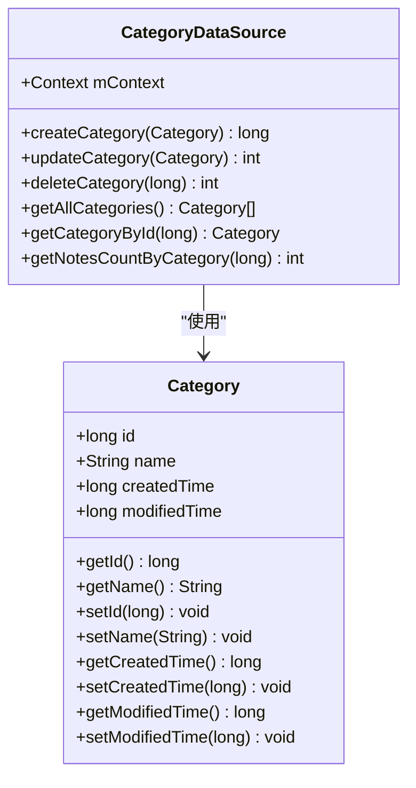

**图表来源**
- [Category.java](file://app/src/main/java/com/example/android/notepad/Category.java#L1-L102)
- [CategoryDataSource.java](file://app/src/main/java/com/example/android/notepad/CategoryDataSource.java#L1-L196)

### 导入导出功能实现

导入导出功能通过ExportManager和ImportManager类实现：

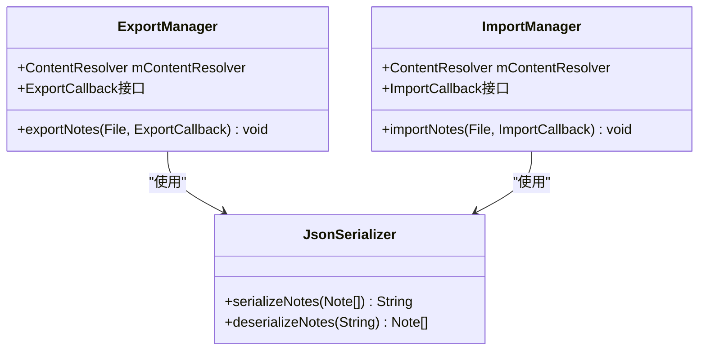

**图表来源**
- [ExportManager.java](file://app/src/main/java/com/example/android/notepad/ExportManager.java#L1-L100)
- [ImportManager.java](file://app/src/main/java/com/example/android/notepad/ImportManager.java#L1-L100)
- [JsonSerializer.java](file://app/src/main/java/com/example/android/notepad/JsonSerializer.java#L1-L100)

## View层深度分析

View层负责用户界面的呈现，主要由XML布局文件构成，通过SimpleCursorAdapter实现数据绑定。

### 布局文件架构设计

View层包含多个主要布局文件，分别服务于不同的UI场景：

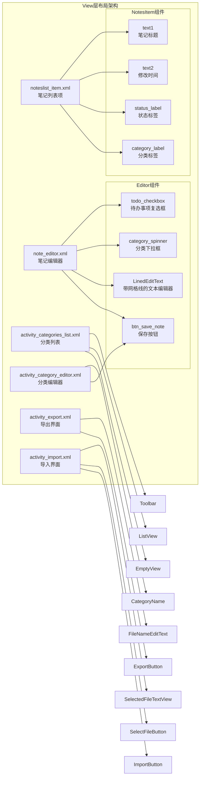

**图表来源**
- [noteslist_item.xml](file://app/src/main/res/layout/noteslist_item.xml#L17-L40)
- [note_editor.xml](file://app/src/main/res/layout/note_editor.xml#L16-L29)
- [activity_categories_list.xml](file://app/src/main/res/layout/activity_categories_list.xml#L1-L55)
- [activity_category_editor.xml](file://app/src/main/res/layout/activity_category_editor.xml#L1-L47)
- [activity_export.xml](file://app/src/main/res/layout/activity_export.xml#L1-L54)
- [activity_import.xml](file://app/src/main/res/layout/activity_import.xml#L1-L64)

### SimpleCursorAdapter数据绑定机制

View层通过SimpleCursorAdapter实现Model层数据与UI组件的自动绑定：

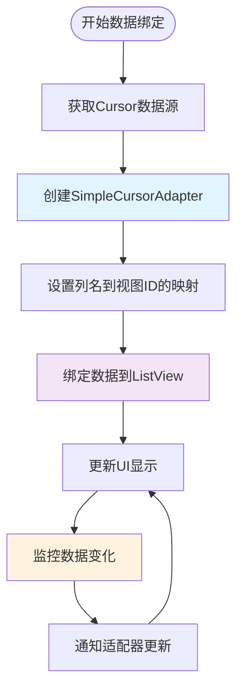

**图表来源**
- [NotesList.java](file://app/src/main/java/com/example/android/notepad/NotesList.java#L137-L166)

### 自定义UI组件实现

NoteEditor中实现了自定义的LinedEditText组件，提供特殊的文本编辑体验：

| 组件特性 | 实现方式 | 用户体验 |
|----------|----------|----------|
| 网格线绘制 | Canvas.drawLine() | 提供书写格式参考 |
| 自定义绘制 | onDraw()方法重写 | 独特的编辑界面 |
| 文本格式化 | 时间戳转换 | 友好的时间显示 |

**章节来源**
- [noteslist_item.xml](file://app/src/main/res/layout/noteslist_item.xml#L1-L40)
- [note_editor.xml](file://app/src/main/res/layout/note_editor.xml#L1-L29)
- [NotesList.java](file://app/src/main/java/com/example/android/notepad/NotesList.java#L137-L166)
- [NoteEditor.java](file://app/src/main/java/com/example/android/notepad/NoteEditor.java#L83-L134)

## Controller层深度分析

Controller层由NotesList和NoteEditor等Activity构成，负责处理用户交互、业务逻辑和状态管理。

### NotesList控制器架构

NotesList作为主界面控制器，管理笔记列表的显示和交互：

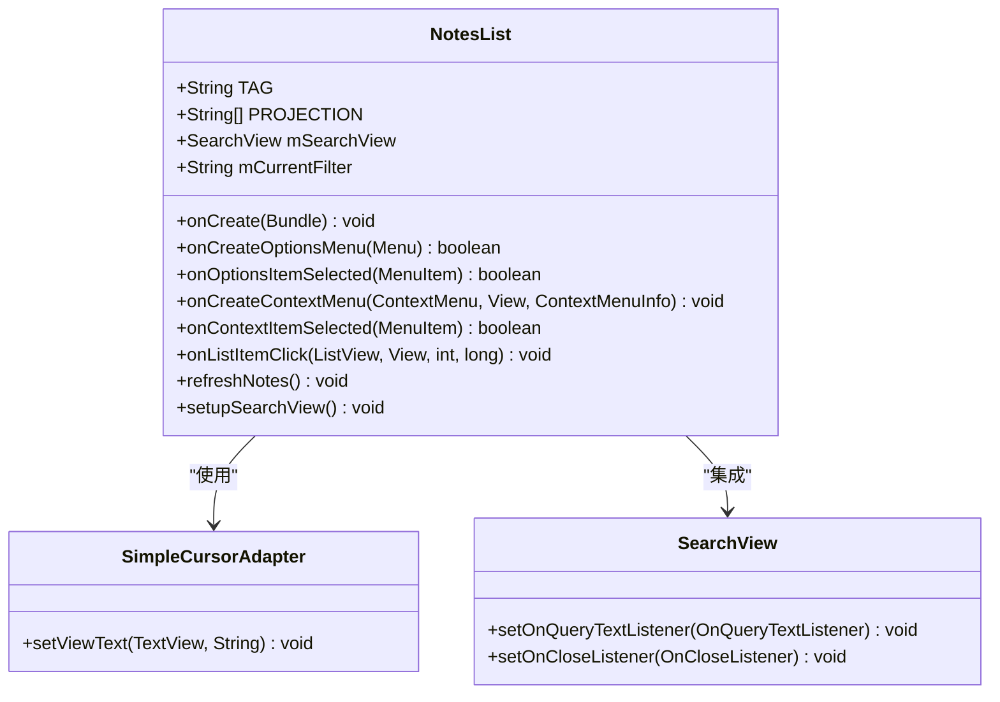

**图表来源**
- [NotesList.java](file://app/src/main/java/com/example/android/notepad/NotesList.java#L56-L550)

### 用户交互处理机制

Controller层实现了多层次的用户交互处理：

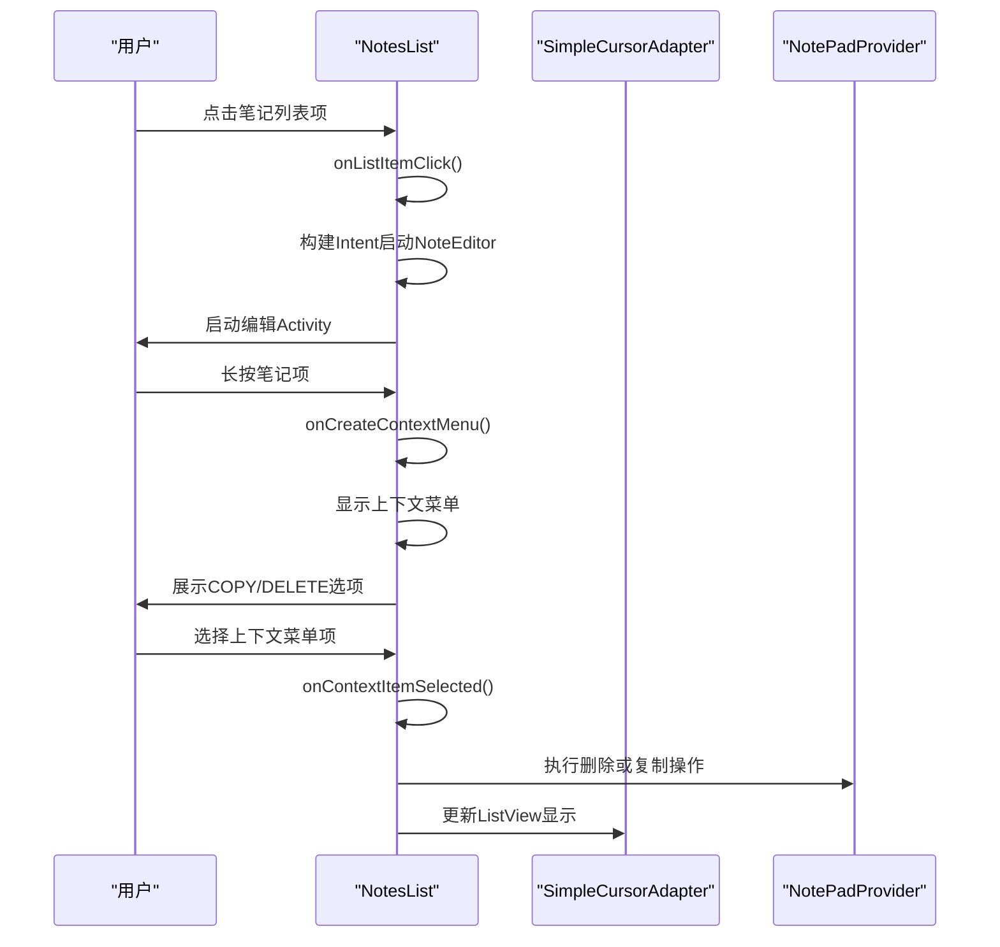

**图表来源**
- [NotesList.java](file://app/src/main/java/com/example/android/notepad/NotesList.java#L437-L549)

### NoteEditor控制器功能

NoteEditor作为笔记编辑控制器，处理笔记的创建、编辑和删除：

| 控制器状态 | 功能描述 | 处理方式 |
|------------|----------|----------|
| STATE_EDIT | 编辑现有笔记 | 从Provider加载笔记数据 |
| STATE_INSERT | 创建新笔记 | 插入空记录到Provider |
| 用户输入 | 文本编辑 | 实时保存到Provider |
| 生命周期 | 状态管理 | 保存和恢复笔记状态 |

### 菜单系统集成

Controller层集成了丰富的菜单系统，支持多种用户操作：

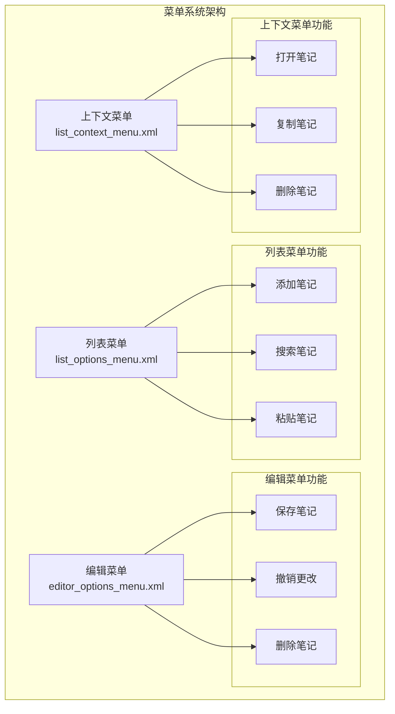

**图表来源**
- [list_options_menu.xml](file://app/src/main/res/menu/list_options_menu.xml#L1-L23)
- [editor_options_menu.xml](file://app/src/main/res/menu/editor_options_menu.xml#L1-L15)

### 分类管理控制器

新增的分类管理功能通过CategoriesListActivity和CategoryEditorActivity实现：

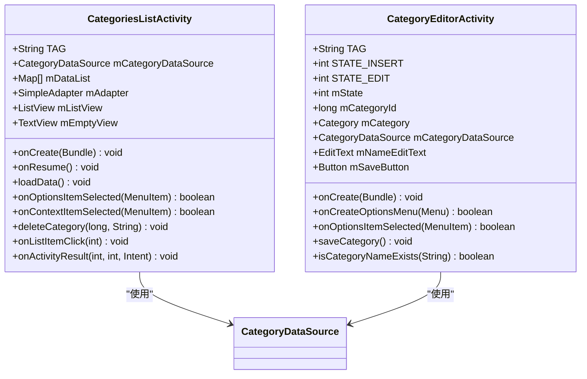

**图表来源**
- [CategoriesListActivity.java](file://app/src/main/java/com/example/android/notepad/CategoriesListActivity.java#L1-L257)
- [CategoryEditorActivity.java](file://app/src/main/java/com/example/android/notepad/CategoryEditorActivity.java#L1-L180)

### 导入导出控制器

导入导出功能通过ExportActivity和ImportActivity实现：

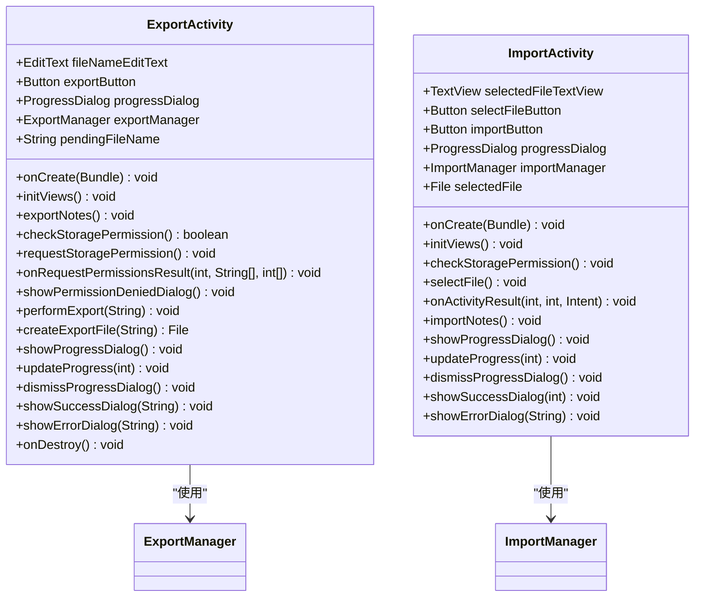

**图表来源**
- [ExportActivity.java](file://app/src/main/java/com/example/android/notepad/ExportActivity.java#L1-L369)
- [ImportActivity.java](file://app/src/main/java/com/example/android/notepad/ImportActivity.java#L1-L247)

## MVC组件交互机制

MVC架构的核心在于三个层次之间的协调工作，NotePad应用展示了清晰的交互模式。

### 数据流向分析

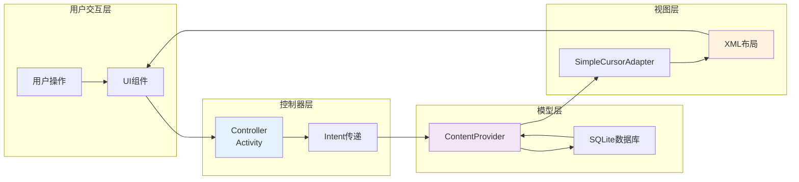

**图表来源**
- [NotesList.java](file://app/src/main/java/com/example/android/notepad/NotesList.java#L108-L166)
- [NoteEditor.java](file://app/src/main/java/com/example/android/notepad/NoteEditor.java#L209-L231)

### 事件传播机制

Controller层通过Intent机制实现组件间的通信：

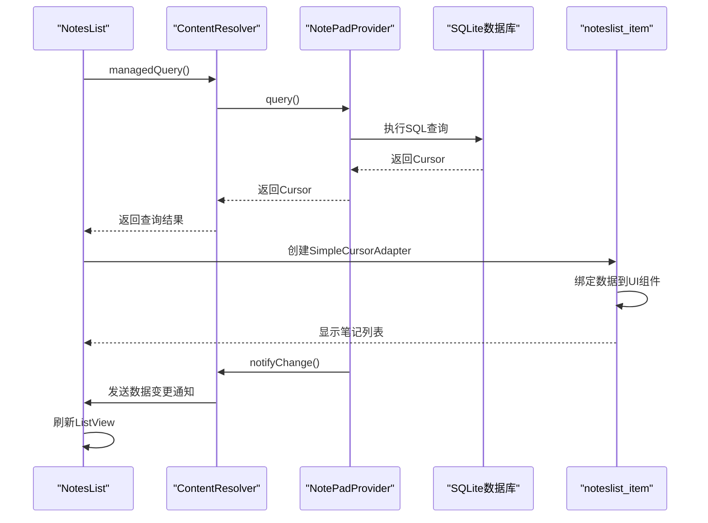

**图表来源**
- [NotesList.java](file://app/src/main/java/com/example/android/notepad/NotesList.java#L108-L166)
- [NotePadProvider.java](file://app/src/main/java/com/example/android/notepad/NotePadProvider.java#L319-L321)

### 状态同步机制

MVC架构确保了数据状态的一致性：

| 同步层级 | 同步机制 | 实现方式 |
|----------|----------|----------|
| Model-View | 观察者模式 | Cursor.setNotificationUri() |
| Controller-Model | ContentResolver | managedQuery() |
| Controller-View | Adapter更新 | changeCursor() |
| 数据持久化 | SQLite事务 | 自动提交 |

**章节来源**
- [NotesList.java](file://app/src/main/java/com/example/android/notepad/NotesList.java#L108-L256)
- [NotePadProvider.java](file://app/src/main/java/com/example/android/notepad/NotePadProvider.java#L319-L321)

## 数据流与生命周期管理

MVC架构中的数据流和生命周期管理是确保应用稳定运行的关键。

### Activity生命周期与数据同步

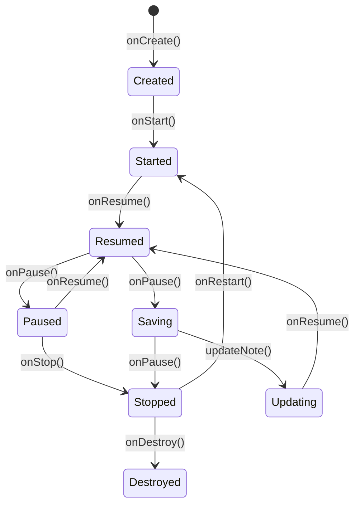

**图表来源**
- [NoteEditor.java](file://app/src/main/java/com/example/android/notepad/NoteEditor.java#L250-L377)

### 数据持久化策略

Controller层实现了智能的数据持久化机制：

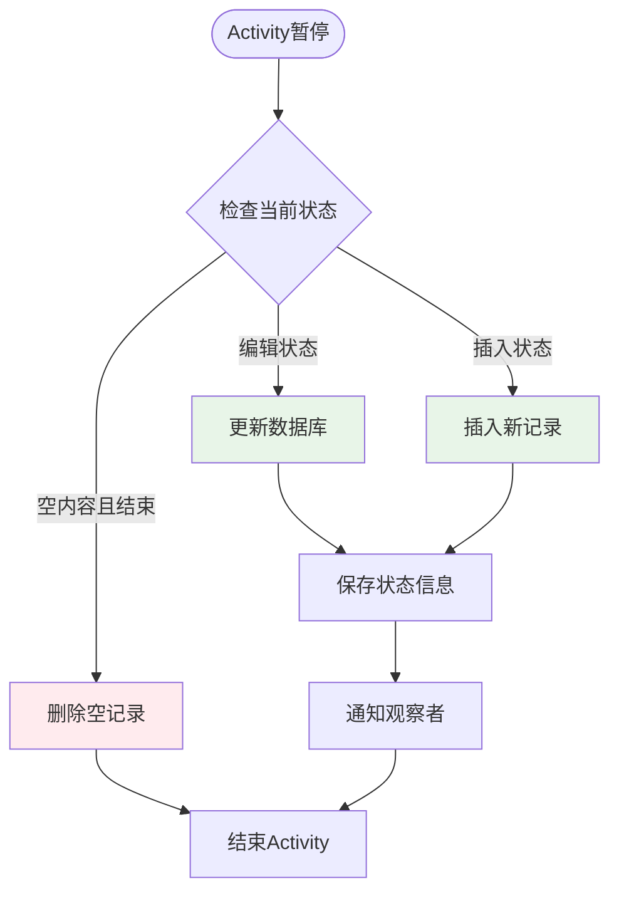

**图表来源**
- [NoteEditor.java](file://app/src/main/java/com/example/android/notepad/NoteEditor.java#L338-L377)

### 内存管理与资源释放

MVC架构注重内存管理和资源释放：

| 资源类型 | 管理策略 | 实现位置 |
|----------|----------|----------|
| Cursor资源 | managedQuery()自动管理 | NotesList |
| 数据库连接 | DatabaseHelper管理 | NotePadProvider |
| UI组件 | Activity生命周期管理 | NotesList/NoteEditor |
| 回调监听器 | onDetachedFromWindow()清理 | 自定义View |

**章节来源**
- [NotesList.java](file://app/src/main/java/com/example/android/notepad/NotesList.java#L108-L166)
- [NoteEditor.java](file://app/src/main/java/com/example/android/notepad/NoteEditor.java#L250-L377)

## 架构优势与最佳实践

NotePad应用的MVC架构体现了Android开发的最佳实践。

### 架构优势分析

```mermaid
mindmap
root((MVC架构优势))
分离关注点
Model层专注数据逻辑
View层专注UI展示
Controller层专注业务流程
可测试性
单元测试支持
模拟对象可用
集成测试友好
可维护性
代码结构清晰
耦合度低
扩展性强
性能优化
数据缓存机制
异步操作支持
内存管理优化
```

### 设计模式应用

NotePad应用中应用了多种设计模式：

| 设计模式 | 应用场景 | 实现方式 |
|----------|----------|----------|
| 观察者模式 | 数据变更通知 | Cursor.setNotificationUri() |
| 工厂模式 | 对象创建 | DatabaseHelper构造函数 |
| 适配器模式 | 数据绑定 | SimpleCursorAdapter |
| 策略模式 | 不同编辑状态 | STATE_EDIT/STATE_INSERT |
| 单例模式 | 全局配置 | ContentProvider实例 |

### 性能优化策略

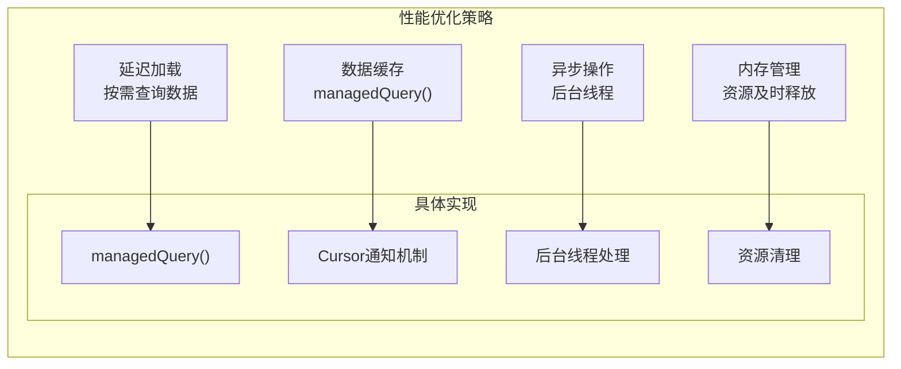

### 错误处理与容错机制

MVC架构提供了完善的错误处理机制：

| 错误类型 | 处理策略 | 实现方式 |
|----------|----------|----------|
| 数据库错误 | 异常捕获 | try-catch包装 |
| 网络异常 | 重试机制 | 重试次数限制 |
| UI异常 | 状态恢复 | onSaveInstanceState() |
| 内存不足 | 资源释放 | onDestroy()清理 |

**章节来源**
- [NotePadProvider.java](file://app/src/main/java/com/example/android/notepad/NotePadProvider.java#L243-L739)
- [NotesList.java](file://app/src/main/java/com/example/android/notepad/NotesList.java#L56-L550)
- [NoteEditor.java](file://app/src/main/java/com/example/android/notepad/NoteEditor.java#L54-L616)

## 总结

NotePad应用的MVC架构设计展现了Android开发中数据驱动应用的经典模式。通过ContentProvider作为Model层，Activity作为Controller层，XML布局作为View层的清晰分离，实现了高度模块化的应用架构。

### 关键设计原则

1. **关注点分离**：每个层次专注于特定职责，降低耦合度
2. **数据驱动**：通过ContentProvider统一数据访问，支持多组件共享
3. **生命周期管理**：充分利用Android生命周期，确保资源正确管理
4. **用户体验优先**：通过适配器模式实现流畅的数据绑定和UI更新

### 开发建议

对于基于MVC架构的Android应用开发，建议遵循以下最佳实践：

- **Model层**：保持数据逻辑独立，避免UI相关的副作用
- **View层**：专注于用户界面展示，减少业务逻辑
- **Controller层**：协调Model和View，处理用户交互和状态管理
- **数据流**：建立清晰的数据流向，确保状态一致性
- **性能优化**：合理使用缓存和异步操作，提升用户体验

这种架构模式不仅适用于简单的笔记应用，也为复杂的Android应用提供了可扩展的基础框架，是Android开发中值得学习和借鉴的经典设计。