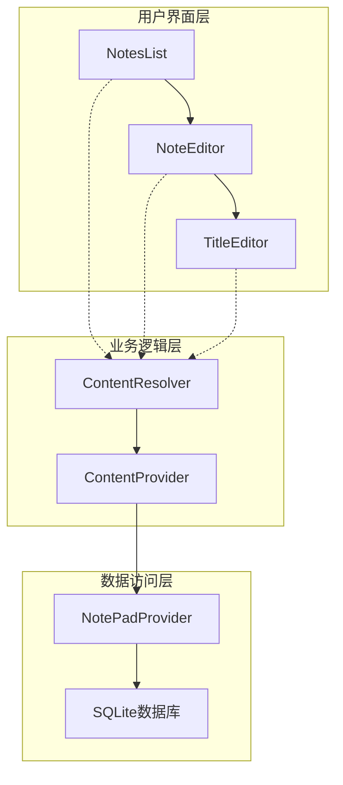
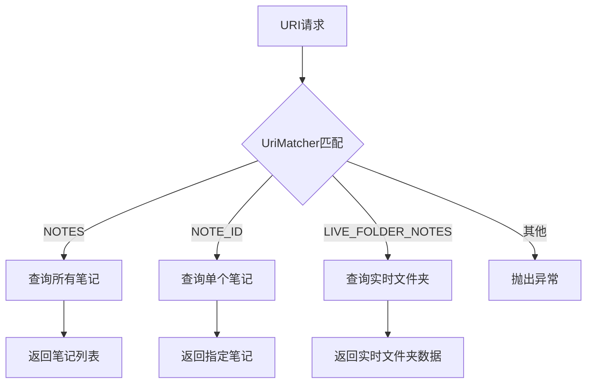
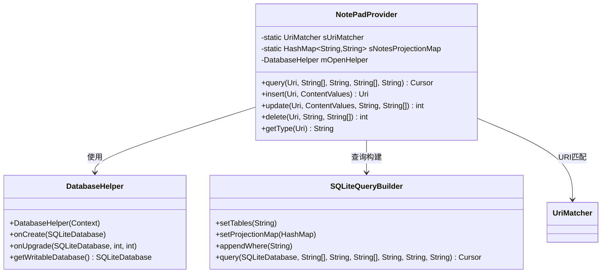
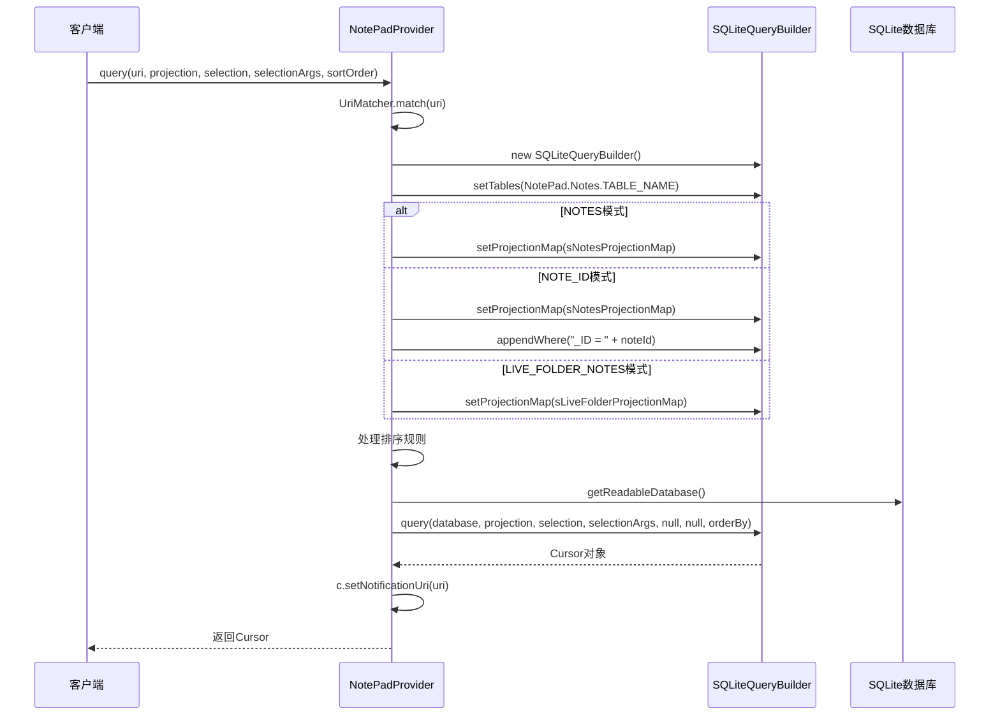
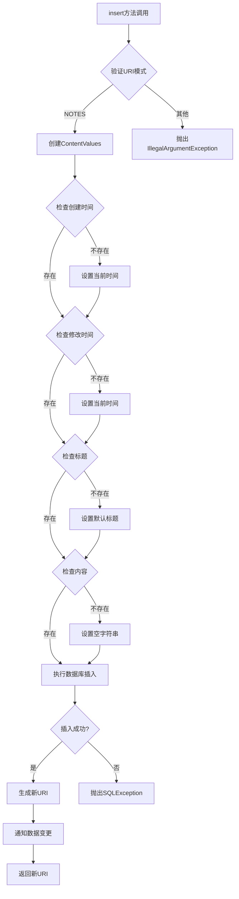
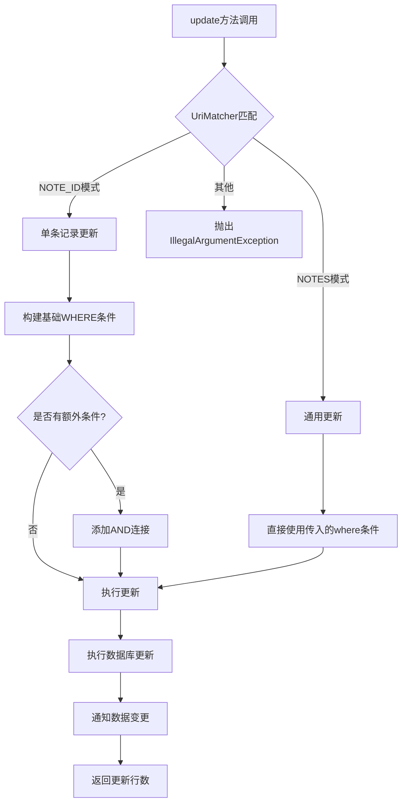
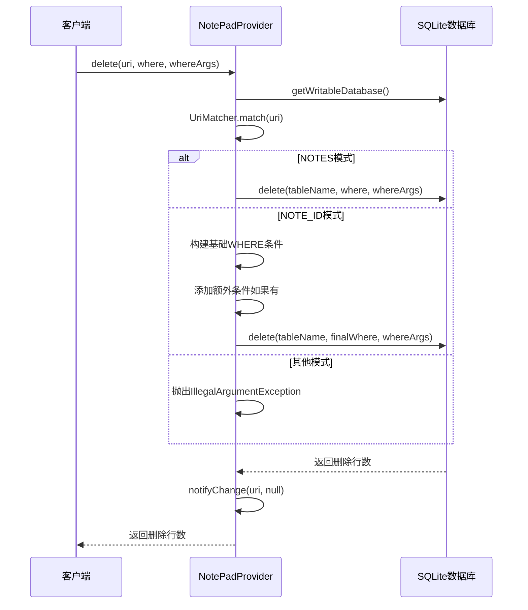
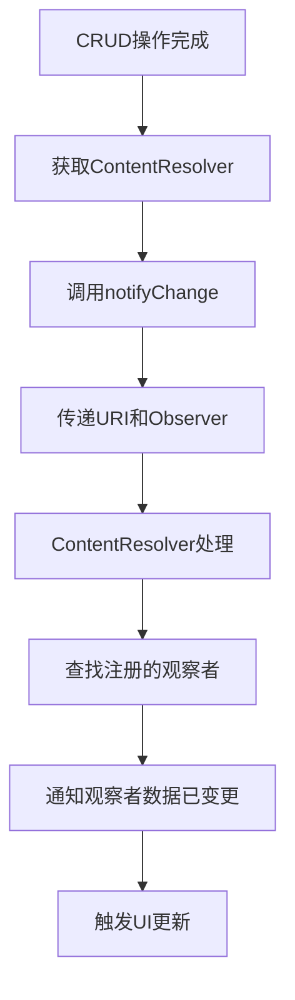
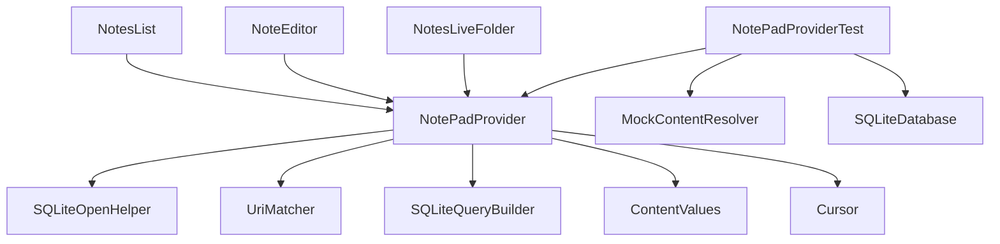

# ContentProvider核心逻辑深度解析

<cite>
**本文档引用的文件**
- [NotePadProvider.java](file://app/src/main/java/com/example/android/notepad/NotePadProvider.java)
- [NotePad.java](file://app/src/main/java/com/example/android/notepad/NotePad.java)
- [NoteEditor.java](file://app/src/main/java/com/example/android/notepad/NoteEditor.java)
- [NotesList.java](file://app/src/main/java/com/example/android/notepad/NotesList.java)
- [NotePadProviderTest.java](file://app/src/androidTest/java/com/example/android/notepad/NotePadProviderTest.java)
</cite>

## 目录
1. [简介](#简介)
2. [项目结构概览](#项目结构概览)
3. [核心组件分析](#核心组件分析)
4. [架构概览](#架构概览)
5. [详细组件分析](#详细组件分析)
6. [依赖关系分析](#依赖关系分析)
7. [性能考虑](#性能考虑)
8. [故障排除指南](#故障排除指南)
9. [结论](#结论)

## 简介

NotePad应用的ContentProvider是Android应用程序中数据访问层的核心组件，负责管理笔记数据的CRUD（创建、读取、更新、删除）操作。本文档深入分析NotePadProvider类中query、insert、update、delete四大核心方法的实现细节，揭示其安全查询构建、默认值填充机制、条件构建逻辑以及数据变更通知机制。

该ContentProvider采用SQLite数据库作为底层存储，通过UriMatcher进行URI模式匹配，实现了类型安全的数据访问控制。通过详细的代码分析，我们将展示如何利用SQLiteQueryBuilder构建安全查询，如何处理不同URI模式下的条件构建，以及如何实现跨组件的数据同步通知。

## 项目结构概览

NotePad应用采用典型的Android三层架构：用户界面层、业务逻辑层和数据访问层。ContentProvider位于数据访问层的核心位置，为上层应用提供统一的数据访问接口。



**图表来源**
- [NotePadProvider.java](file://app/src/main/java/com/example/android/notepad/NotePadProvider.java#L54-L753)
- [NotesList.java](file://app/src/main/java/com/example/android/notepad/NotesList.java#L56-L550)
- [NoteEditor.java](file://app/src/main/java/com/example/android/notepad/NoteEditor.java#L54-L616)

**章节来源**
- [NotePadProvider.java](file://app/src/main/java/com/example/android/notepad/NotePadProvider.java#L1-L753)
- [NotePad.java](file://app/src/main/java/com/example/android/notepad/NotePad.java#L1-L155)

## 核心组件分析

### 数据库架构设计

NotePadProvider使用SQLite数据库存储笔记数据，数据库表结构包含以下核心字段：

| 字段名 | 类型 | 描述 | 默认值 |
|--------|------|------|--------|
| _ID | INTEGER | 主键标识符 | 自动生成 |
| title | TEXT | 笔记标题 | "Untitled" |
| note | TEXT | 笔记内容 | "" |
| created | INTEGER | 创建时间戳 | 当前系统时间 |
| modified | INTEGER | 修改时间戳 | 当前系统时间 |

### URI模式匹配系统

ContentProvider通过UriMatcher实现精确的URI模式匹配，支持三种主要模式：



**图表来源**
- [NotePadProvider.java](file://app/src/main/java/com/example/android/notepad/NotePadProvider.java#L93-L132)

**章节来源**
- [NotePadProvider.java](file://app/src/main/java/com/example/android/notepad/NotePadProvider.java#L58-L172)
- [NotePad.java](file://app/src/main/java/com/example/android/notepad/NotePad.java#L28-L155)

## 架构概览

### ContentProvider整体架构



**图表来源**
- [NotePadProvider.java](file://app/src/main/java/com/example/android/notepad/NotePadProvider.java#L54-L753)

## 详细组件分析

### query方法实现详解

query方法是ContentProvider的核心查询入口，采用SQLiteQueryBuilder构建安全查询，通过投影映射和排序规则处理实现灵活的数据检索。

#### 查询构建流程



**图表来源**
- [NotePadProvider.java](file://app/src/main/java/com/example/android/notepad/NotePadProvider.java#L252-L321)

#### 投影映射应用

投影映射（sNotesProjectionMap）确保查询结果的列名与客户端期望的一致性：

| 映射键 | 映射值 | 用途 |
|--------|--------|------|
| _ID | _ID | 主键标识符 |
| title | title | 笔记标题 |
| note | note | 笔记内容 |
| created | created | 创建时间 |
| modified | modified | 修改时间 |

#### 排序规则处理

query方法支持灵活的排序规则：
- 默认按修改时间降序排列（`modified DESC`）
- 支持客户端自定义排序规则
- 空排序规则时自动使用默认排序

**章节来源**
- [NotePadProvider.java](file://app/src/main/java/com/example/android/notepad/NotePadProvider.java#L252-L321)

### insert方法实现详解

insert方法负责向数据库插入新笔记记录，实现了智能的默认值填充机制和新记录URI生成策略。

#### 默认值填充机制



**图表来源**
- [NotePadProvider.java](file://app/src/main/java/com/example/android/notepad/NotePadProvider.java#L499-L567)

#### 新记录URI生成策略

insert方法生成的URI遵循标准格式：`content://com.google.provider.NotePad/notes/{rowId}`

#### 异常处理机制

- URI模式验证失败：抛出`IllegalArgumentException`
- 数据库插入失败：抛出`SQLException`
- 数据完整性约束违反：数据库层面处理

**章节来源**
- [NotePadProvider.java](file://app/src/main/java/com/example/android/notepad/NotePadProvider.java#L499-L567)

### update方法实现详解

update方法支持对单个笔记或多个笔记进行批量更新操作，基于URI模式构建精确的WHERE条件。

#### 条件构建逻辑



**图表来源**
- [NotePadProvider.java](file://app/src/main/java/com/example/android/notepad/NotePadProvider.java#L669-L738)

#### 路径参数提取

在NOTE_ID模式下，update方法从URI路径中提取笔记ID：

```java
String noteId = uri.getPathSegments().get(NotePad.Notes.NOTE_ID_PATH_POSITION);
```

#### WHERE子句组合

update方法支持复杂的WHERE条件组合：
- 基础WHERE条件（来自参数）
- URI模式特定条件（NOTE_ID模式）
- 条件之间的AND连接

**章节来源**
- [NotePadProvider.java](file://app/src/main/java/com/example/android/notepad/NotePadProvider.java#L669-L738)

### delete方法实现详解

delete方法提供灵活的删除功能，支持单条记录删除和批量删除操作。

#### 删除操作流程



**图表来源**
- [NotePadProvider.java](file://app/src/main/java/com/example/android/notepad/NotePadProvider.java#L583-L646)

#### 条件构建策略

delete方法采用分层条件构建策略：
1. **基础条件**：根据URI模式确定的操作范围
2. **扩展条件**：客户端提供的额外过滤条件
3. **最终条件**：合并后的完整WHERE子句

**章节来源**
- [NotePadProvider.java](file://app/src/main/java/com/example/android/notepad/NotePadProvider.java#L583-L646)

### 数据变更通知机制

ContentProvider通过notifyChange方法实现跨组件的数据同步通知。

#### 通知机制流程



**图表来源**
- [NotePadProvider.java](file://app/src/main/java/com/example/android/notepad/NotePadProvider.java#L560-L561)
- [NotePadProvider.java](file://app/src/main/java/com/example/android/notepad/NotePadProvider.java#L642-L643)
- [NotePadProvider.java](file://app/src/main/java/com/example/android/notepad/NotePadProvider.java#L734-L735)

#### 通知时机

- **insert操作**：插入完成后立即通知
- **update操作**：更新完成后立即通知  
- **delete操作**：删除完成后立即通知

#### 通知目标

- **Cursor对象**：自动重新查询数据
- **UI组件**：刷新显示内容
- **其他观察者**：触发相应的业务逻辑

**章节来源**
- [NotePadProvider.java](file://app/src/main/java/com/example/android/notepad/NotePadProvider.java#L560-L561)
- [NotePadProvider.java](file://app/src/main/java/com/example/android/notepad/NotePadProvider.java#L642-L643)
- [NotePadProvider.java](file://app/src/main/java/com/example/android/notepad/NotePadProvider.java#L734-L735)

## 依赖关系分析

### 组件耦合度分析



**图表来源**
- [NotePadProvider.java](file://app/src/main/java/com/example/android/notepad/NotePadProvider.java#L19-L48)
- [NotesList.java](file://app/src/main/java/com/example/android/notepad/NotesList.java#L19-L42)
- [NoteEditor.java](file://app/src/main/java/com/example/android/notepad/NoteEditor.java#L19-L42)

### 外部依赖

| 依赖项 | 版本要求 | 用途 |
|--------|----------|------|
| Android SDK | API Level 7+ | ContentProvider框架 |
| SQLite | 内置 | 数据存储引擎 |
| Java | JDK 6+ | 开发语言 |

**章节来源**
- [NotePadProvider.java](file://app/src/main/java/com/example/android/notepad/NotePadProvider.java#L19-L48)

## 性能考虑

### 查询优化策略

1. **索引利用**：主键_id自动建立索引
2. **投影限制**：只查询需要的列
3. **条件优化**：合理使用WHERE子句
4. **游标管理**：及时关闭不再使用的游标

### 并发控制

- **读写分离**：查询使用只读数据库连接
- **事务管理**：批量操作时使用事务
- **锁机制**：SQLite自动处理并发访问

### 内存管理

- **大结果集处理**：使用游标分页加载
- **缓存策略**：避免重复查询相同数据
- **资源释放**：及时释放数据库连接

## 故障排除指南

### 常见问题及解决方案

#### 查询失败问题

**症状**：query方法返回空游标或抛出异常
**原因**：
- URI模式不匹配
- 数据库连接失败
- SQL语法错误

**解决方案**：
- 验证URI格式正确性
- 检查数据库状态
- 使用日志调试SQL语句

#### 插入失败问题

**症状**：insert方法抛出SQLException
**原因**：
- 主键冲突
- 字段长度超限
- 数据类型不匹配

**解决方案**：
- 检查主键唯一性
- 验证字段长度限制
- 确认数据类型兼容性

#### 更新失败问题

**症状**：update方法返回0行更新
**原因**：
- WHERE条件不匹配
- 记录不存在
- 权限不足

**解决方案**：
- 验证WHERE条件准确性
- 检查目标记录是否存在
- 确认操作权限

**章节来源**
- [NotePadProviderTest.java](file://app/src/androidTest/java/com/example/android/notepad/NotePadProviderTest.java#L1-L840)

## 结论

NotePad应用的ContentProvider展现了Android数据访问层的最佳实践。通过SQLiteQueryBuilder的安全查询构建、智能的默认值填充机制、精确的条件构建逻辑以及完善的数据变更通知机制，实现了高效、安全、可维护的数据访问服务。

该实现的主要优势包括：

1. **安全性**：通过UriMatcher和投影映射防止SQL注入
2. **灵活性**：支持多种查询模式和条件组合
3. **可扩展性**：模块化设计便于功能扩展
4. **性能**：合理的数据库操作和缓存策略
5. **可靠性**：完善的异常处理和错误恢复机制

对于Android开发者而言，这个ContentProvider实现是一个优秀的学习案例，展示了如何构建健壮的数据访问层，为上层应用提供稳定可靠的数据服务。