# Model层详解

<cite>
**本文档中引用的文件**
- [NotePadProvider.java](file://app/src/main/java/com/example/android/notepad/NotePadProvider.java)
- [NotePad.java](file://app/src/main/java/com/example/android/notepad/NotePad.java)
- [AndroidManifest.xml](file://app/src/main/AndroidManifest.xml)
- [NotesList.java](file://app/src/main/java/com/example/android/notepad/NotesList.java)
- [NoteEditor.java](file://app/src/main/java/com/example/android/notepad/NoteEditor.java)
- [NotePadProviderTest.java](file://app/src/androidTest/java/com/example/android/notepad/NotePadProviderTest.java)
</cite>

## 目录
1. [简介](#简介)
2. [项目架构概览](#项目架构概览)
3. [NotePadProvider核心组件](#notepadprovider核心组件)
4. [数据库管理机制](#数据库管理机制)
5. [URI匹配与路由策略](#uri匹配与路由策略)
6. [CRUD操作实现](#crud操作实现)
7. [数据变更通知机制](#数据变更通知机制)
8. [数据库表结构](#数据库表结构)
9. [权限控制与跨应用共享](#权限控制与跨应用共享)
10. [组件交互时序图](#组件交互时序图)
11. [总结](#总结)

## 简介

NotePad应用的Model层以NotePadProvider为核心，实现了Android平台上的ContentProvider模式。该组件负责管理笔记数据的持久化存储，提供统一的数据访问接口，并确保数据的一致性和完整性。通过继承ContentProvider基类，NotePadProvider提供了标准的CRUD操作接口，支持多应用间的数据共享和同步。

## 项目架构概览

NotePad应用采用经典的MVC架构模式，Model层负责数据管理和业务逻辑处理：

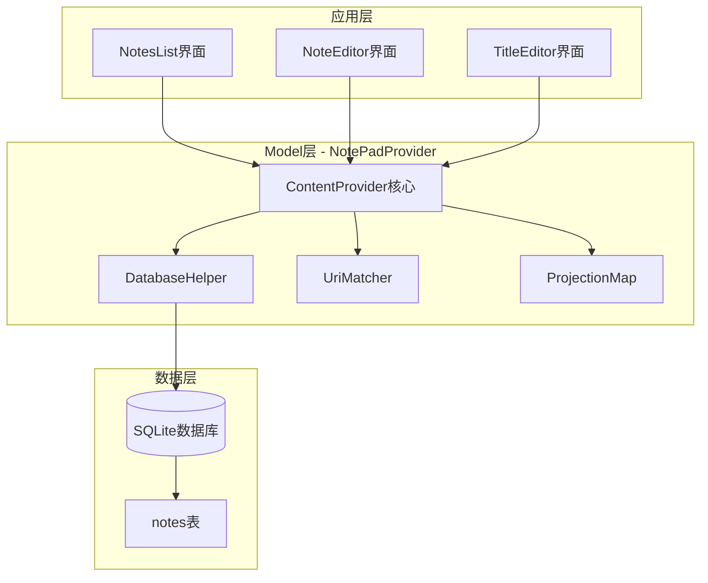

**图表来源**
- [NotePadProvider.java](file://app/src/main/java/com/example/android/notepad/NotePadProvider.java#L54-L753)
- [NotePad.java](file://app/src/main/java/com/example/android/notepad/NotePad.java#L28-L155)

**章节来源**
- [NotePadProvider.java](file://app/src/main/java/com/example/android/notepad/NotePadProvider.java#L1-L753)
- [NotePad.java](file://app/src/main/java/com/example/android/notepad/NotePad.java#L1-L155)

## NotePadProvider核心组件

### 类结构设计

NotePadProvider继承自ContentProvider，实现了Android平台的标准数据访问接口：

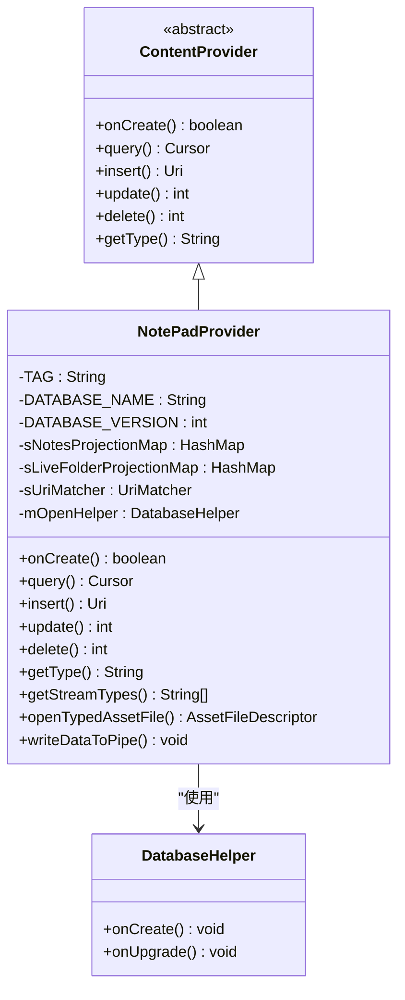

**图表来源**
- [NotePadProvider.java](file://app/src/main/java/com/example/android/notepad/NotePadProvider.java#L54-L753)

### 核心常量配置

NotePadProvider定义了关键的常量用于数据库管理和URI处理：

| 常量名称 | 类型 | 值 | 用途 |
|---------|------|-----|------|
| DATABASE_NAME | String | "note_pad.db" | 数据库文件名 |
| DATABASE_VERSION | int | 2 | 数据库版本号 |
| AUTHORITY | String | "com.google.provider.NotePad" | 内容提供者授权标识 |

**章节来源**
- [NotePadProvider.java](file://app/src/main/java/com/example/android/notepad/NotePadProvider.java#L56-L67)
- [NotePad.java](file://app/src/main/java/com/example/android/notepad/NotePad.java#L29)

## 数据库管理机制

### SQLiteOpenHelper实现

DatabaseHelper类继承自SQLiteOpenHelper，负责数据库的创建、版本管理和生命周期管理：

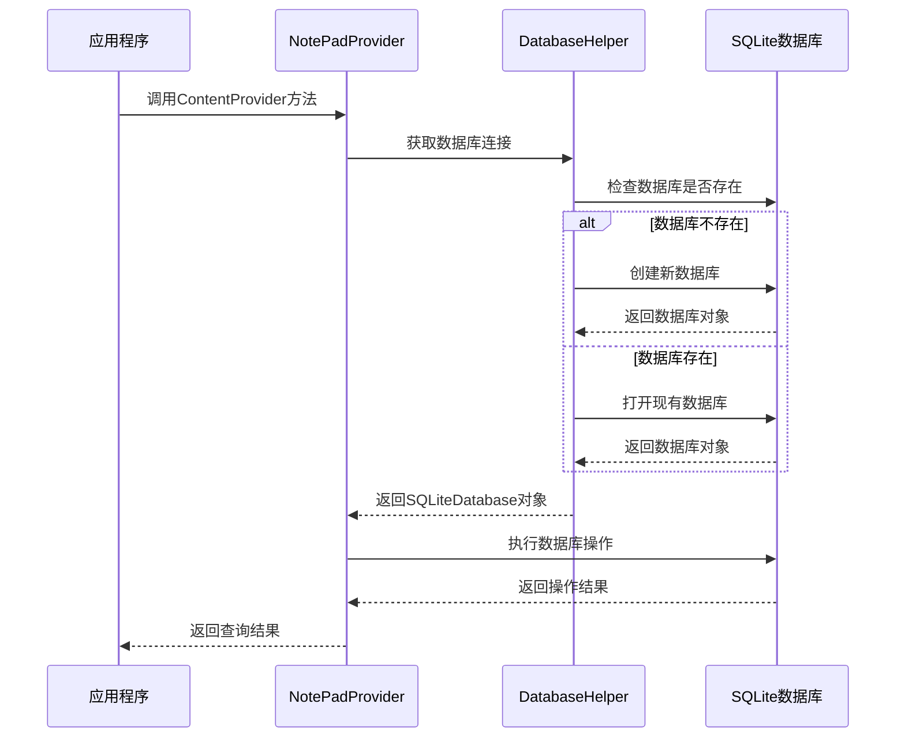

**图表来源**
- [NotePadProvider.java](file://app/src/main/java/com/example/android/notepad/NotePadProvider.java#L179-L223)

### 数据库初始化流程

DatabaseHelper的onCreate方法负责创建初始的notes表结构：

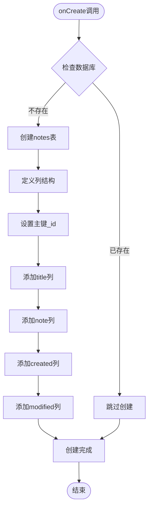

**图表来源**
- [NotePadProvider.java](file://app/src/main/java/com/example/android/notepad/NotePadProvider.java#L192-L201)

**章节来源**
- [NotePadProvider.java](file://app/src/main/java/com/example/android/notepad/NotePadProvider.java#L179-L223)

## URI匹配与路由策略

### UriMatcher配置

NotePadProvider使用UriMatcher来识别不同的URI模式并路由到相应的数据库操作：

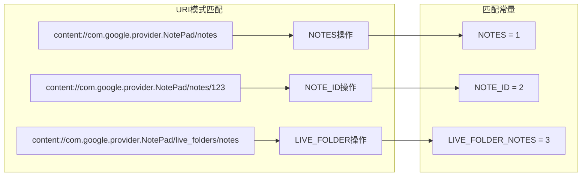

**图表来源**
- [NotePadProvider.java](file://app/src/main/java/com/example/android/notepad/NotePadProvider.java#L120-L131)

### 投影映射机制

系统维护两个投影映射表来优化查询性能：

| 映射类型 | 用途 | 主要字段 |
|---------|------|----------|
| sNotesProjectionMap | 标准笔记查询 | _id, title, note, created, modified |
| sLiveFolderProjectionMap | 实时文件夹查询 | _ID AS _ID, title AS NAME |

**章节来源**
- [NotePadProvider.java](file://app/src/main/java/com/example/android/notepad/NotePadProvider.java#L115-L172)

## CRUD操作实现

### onCreate方法实现

onCreate方法是ContentProvider的初始化入口，负责创建DatabaseHelper实例：

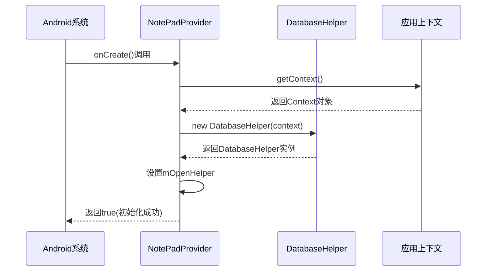

**图表来源**
- [NotePadProvider.java](file://app/src/main/java/com/example/android/notepad/NotePadProvider.java#L231-L240)

### query方法实现

query方法根据URI模式执行不同的查询操作：

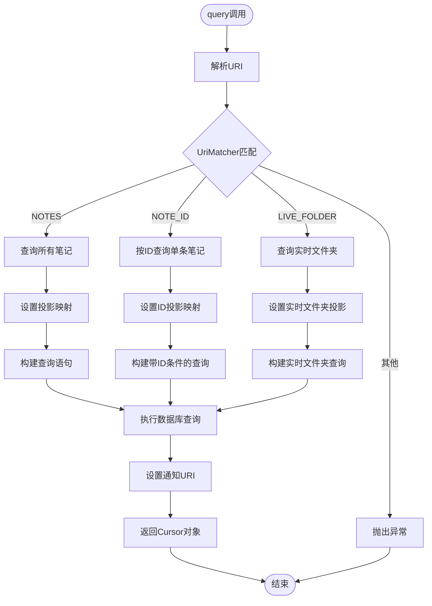

**图表来源**
- [NotePadProvider.java](file://app/src/main/java/com/example/android/notepad/NotePadProvider.java#L252-L321)

### insert方法实现

insert方法处理新笔记的插入操作，包含默认值设置和通知机制：

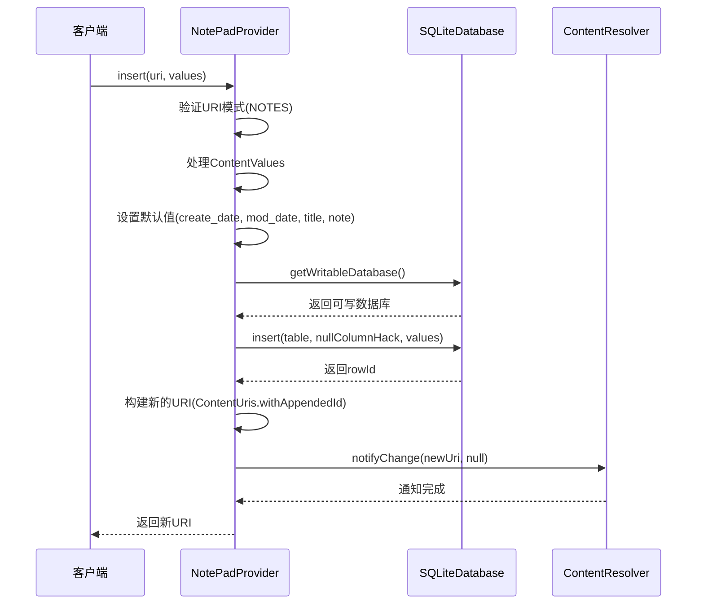

**图表来源**
- [NotePadProvider.java](file://app/src/main/java/com/example/android/notepad/NotePadProvider.java#L498-L567)

### update方法实现

update方法支持批量更新和单条记录更新：

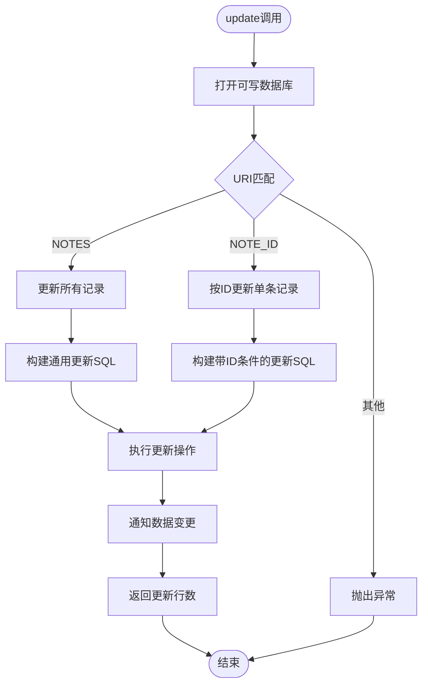

**图表来源**
- [NotePadProvider.java](file://app/src/main/java/com/example/android/notepad/NotePadProvider.java#L668-L739)

### delete方法实现

delete方法提供灵活的删除功能，支持条件删除：

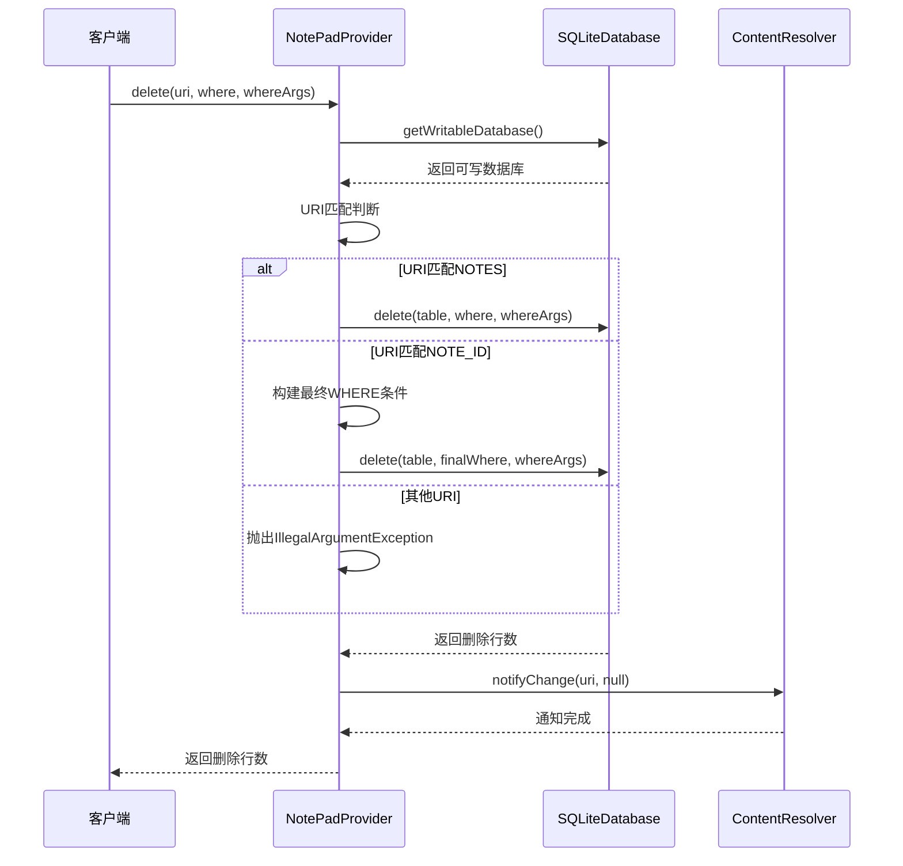

**图表来源**
- [NotePadProvider.java](file://app/src/main/java/com/example/android/notepad/NotePadProvider.java#L582-L646)

**章节来源**
- [NotePadProvider.java](file://app/src/main/java/com/example/android/notepad/NotePadProvider.java#L231-L753)

## 数据变更通知机制

### notifyChange机制

NotePadProvider通过notifyChange方法实现数据变更通知，确保UI层能够及时响应数据变化：

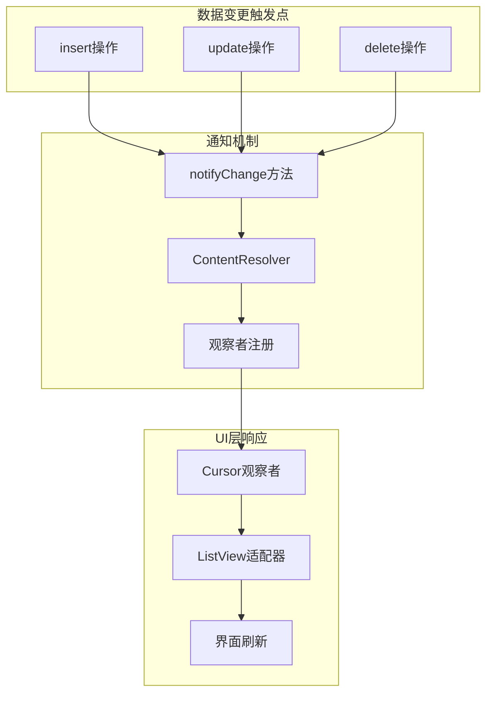

**图表来源**
- [NotePadProvider.java](file://app/src/main/java/com/example/android/notepad/NotePadProvider.java#L560-L561)
- [NotePadProvider.java](file://app/src/main/java/com/example/android/notepad/NotePadProvider.java#L642-L643)
- [NotePadProvider.java](file://app/src/main/java/com/example/android/notepad/NotePadProvider.java#L735-L736)

### 通知URI设置

在query方法中，系统会为Cursor设置通知URI：

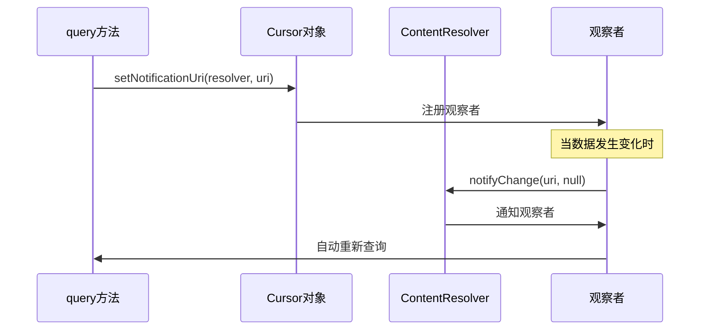

**图表来源**
- [NotePadProvider.java](file://app/src/main/java/com/example/android/notepad/NotePadProvider.java#L319-L321)

**章节来源**
- [NotePadProvider.java](file://app/src/main/java/com/example/android/notepad/NotePadProvider.java#L560-L561)
- [NotePadProvider.java](file://app/src/main/java/com/example/android/notepad/NotePadProvider.java#L642-L643)
- [NotePadProvider.java](file://app/src/main/java/com/example/android/notepad/NotePadProvider.java#L735-L736)

## 数据库表结构

### notes表定义

NotePad应用使用SQLite数据库存储笔记数据，核心表结构如下：

| 字段名 | 数据类型 | 约束 | 描述 |
|--------|----------|------|------|
| _id | INTEGER | PRIMARY KEY | 主键，自增唯一标识符 |
| title | TEXT | - | 笔记标题，默认值为"Untitled" |
| note | TEXT | - | 笔记内容，默认为空字符串 |
| created | INTEGER | - | 创建时间戳，毫秒级Unix时间 |
| modified | INTEGER | - | 修改时间戳，毫秒级Unix时间 |

### 表结构SQL语句

```sql
CREATE TABLE notes (
    _id INTEGER PRIMARY KEY,
    title TEXT,
    note TEXT,
    created INTEGER,
    modified INTEGER
);
```

### 索引设计

虽然当前实现未显式创建索引，但以下字段适合建立索引以提高查询性能：
- `_id`: 主键自动创建聚集索引
- `modified`: 默认排序字段，可考虑索引
- `created`: 时间范围查询常用字段

**章节来源**
- [NotePadProvider.java](file://app/src/main/java/com/example/android/notepad/NotePadProvider.java#L194-L200)
- [NotePad.java](file://app/src/main/java/com/example/android/notepad/NotePad.java#L130-L153)

## 权限控制与跨应用共享

### ContentProvider权限配置

在AndroidManifest.xml中，NotePadProvider配置了适当的权限控制：

```xml
<provider android:name="NotePadProvider"
    android:authorities="com.google.provider.NotePad"
    android:exported="true">
    <grant-uri-permission android:pathPattern=".*" />
</provider>
```

### 权限控制机制

| 控制项 | 配置 | 作用 |
|--------|------|------|
| android:exported | true | 允许其他应用访问此Provider |
| grant-uri-permission | pathPattern=".*" | 授予对所有路径的URI访问权限 |
| MIME类型 | vnd.android.cursor.dir/vnd.google.note | 定义数据类型规范 |

### 跨应用数据共享

NotePadProvider支持多种跨应用数据共享场景：

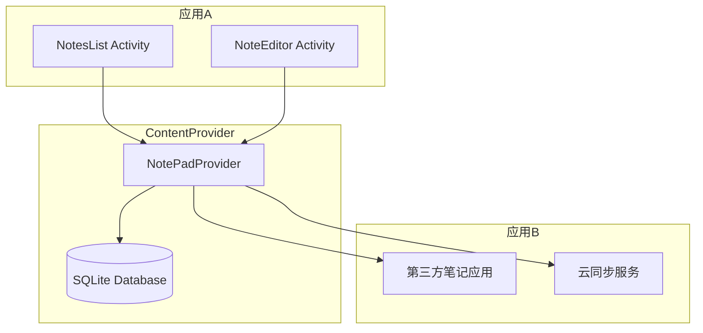

**图表来源**
- [AndroidManifest.xml](file://app/src/main/AndroidManifest.xml#L28-L31)

**章节来源**
- [AndroidManifest.xml](file://app/src/main/AndroidManifest.xml#L28-L31)

## 组件交互时序图

### 查询操作时序图

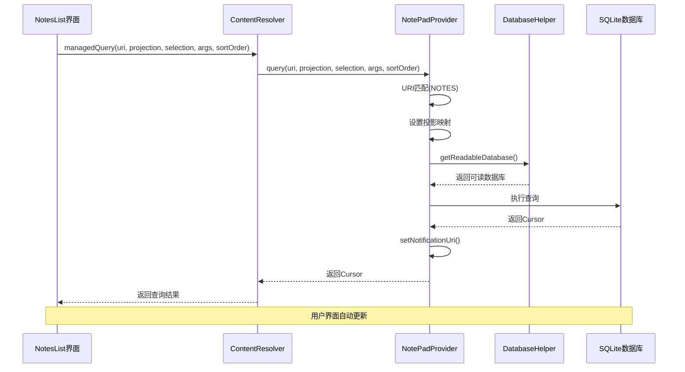

**图表来源**
- [NotesList.java](file://app/src/main/java/com/example/android/notepad/NotesList.java#L113-L119)
- [NotePadProvider.java](file://app/src/main/java/com/example/android/notepad/NotePadProvider.java#L252-L321)

### 插入操作时序图

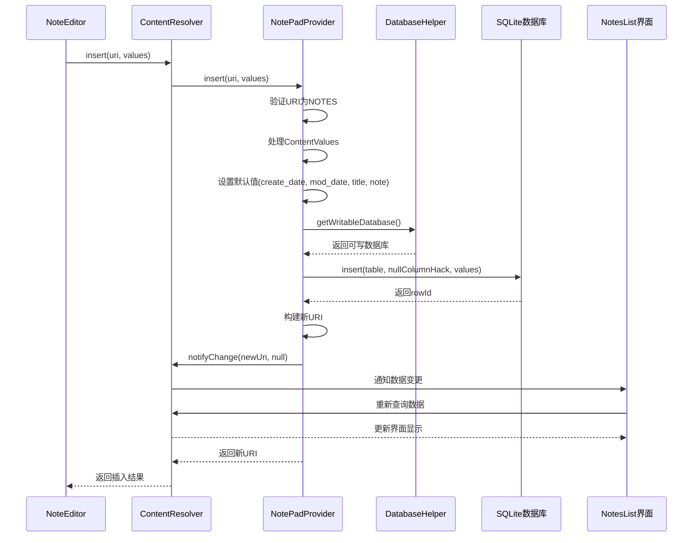

**图表来源**
- [NoteEditor.java](file://app/src/main/java/com/example/android/notepad/NoteEditor.java#L169-L171)
- [NotePadProvider.java](file://app/src/main/java/com/example/android/notepad/NotePadProvider.java#L498-L567)

### 更新操作时序图

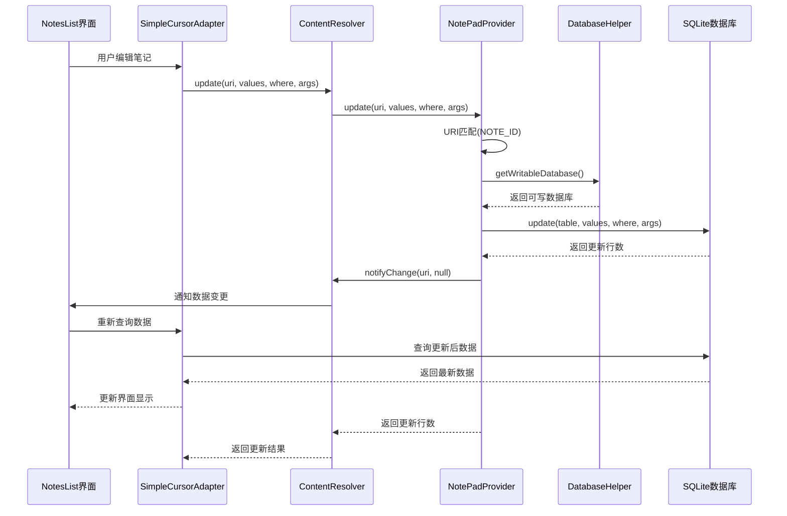

**图表来源**
- [NotePadProvider.java](file://app/src/main/java/com/example/android/notepad/NotePadProvider.java#L668-L739)

## 总结

NotePadProvider作为NotePad应用的Model层核心组件，展现了Android平台ContentProvider模式的最佳实践。通过深入分析其实现机制，我们可以总结出以下关键特性：

### 核心优势

1. **标准化接口**: 遵循Android ContentProvider规范，提供统一的数据访问接口
2. **灵活URI路由**: 通过UriMatcher实现精确的URI模式匹配和路由分发
3. **高效数据库管理**: 利用SQLiteOpenHelper简化数据库生命周期管理
4. **智能数据通知**: 实现自动化的数据变更通知机制，确保UI层实时更新
5. **安全权限控制**: 提供细粒度的权限控制和跨应用数据共享能力

### 设计亮点

- **投影映射优化**: 使用HashMap缓存投影映射，提升查询性能
- **默认值处理**: 在insert操作中自动设置必要的默认值
- **事务安全保障**: 数据库操作采用事务机制保证数据一致性
- **资源管理**: 合理管理数据库连接和Cursor资源

### 最佳实践

1. **异步操作**: 建议在实际应用中使用AsyncQueryHandler或AsyncTask进行异步数据库操作
2. **错误处理**: 完善的异常处理机制确保应用稳定性
3. **性能优化**: 合理使用索引和查询优化技术
4. **测试覆盖**: 完整的单元测试确保代码质量

NotePadProvider的设计为Android应用开发提供了优秀的参考模板，展示了如何构建健壮、高效的Model层组件。通过理解其内部机制，开发者可以更好地掌握Android数据持久化技术，构建出更加优秀的移动应用。