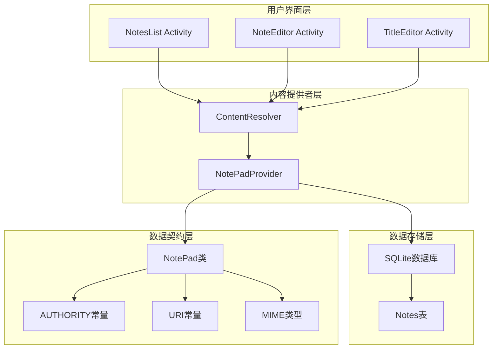
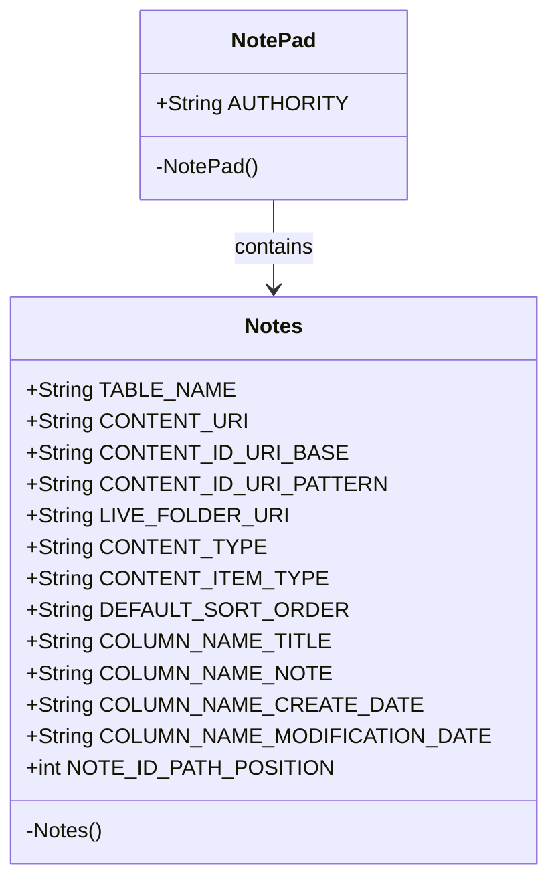
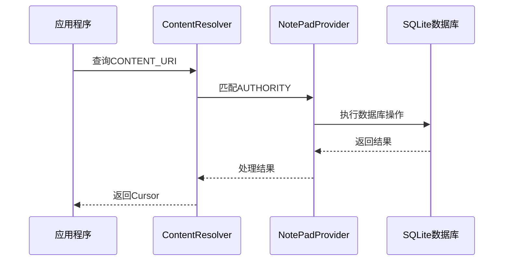
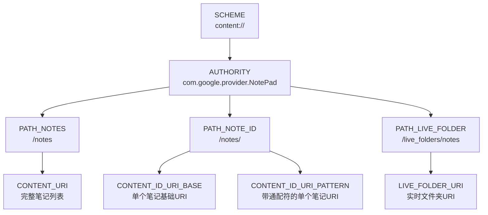
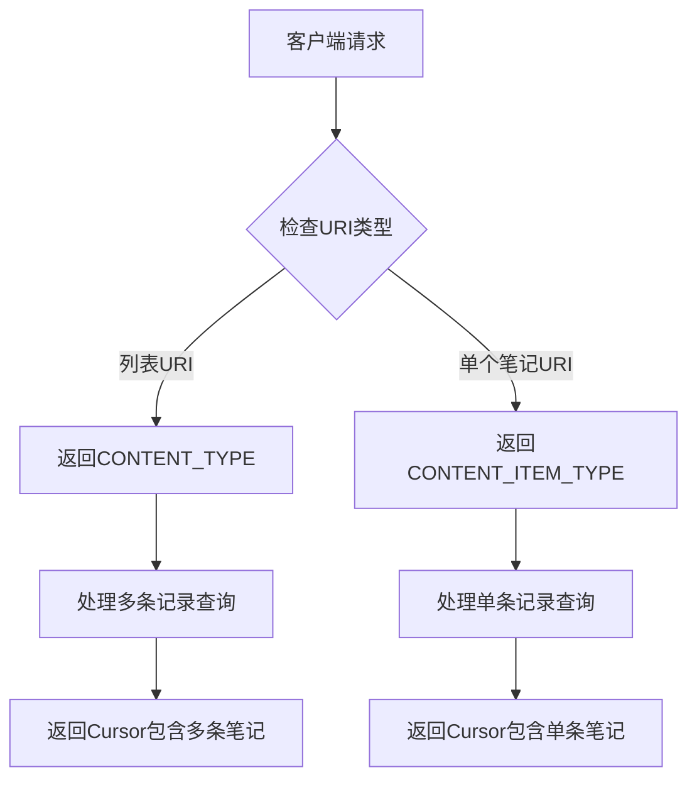
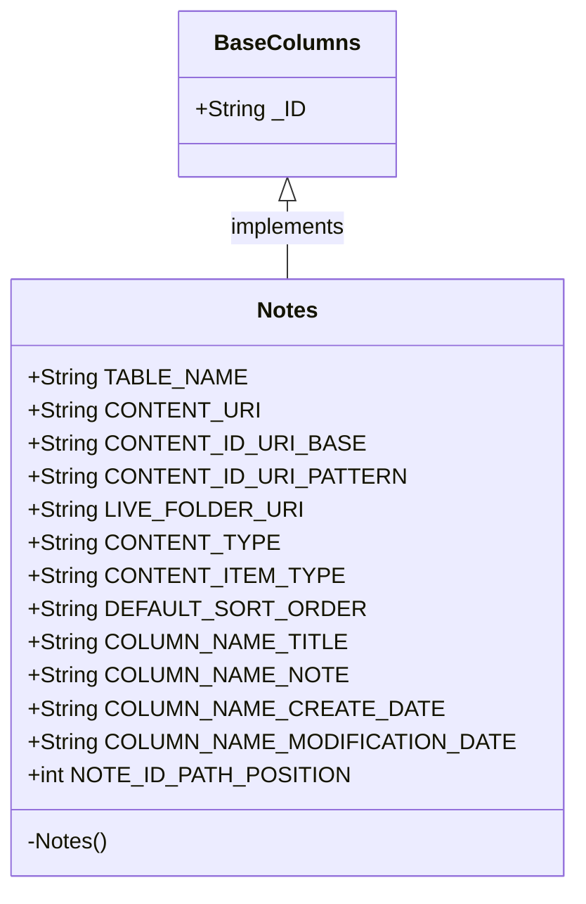
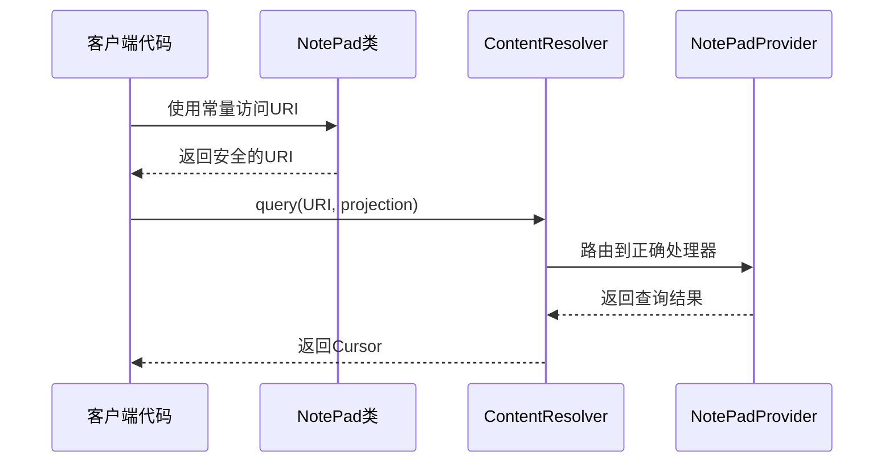
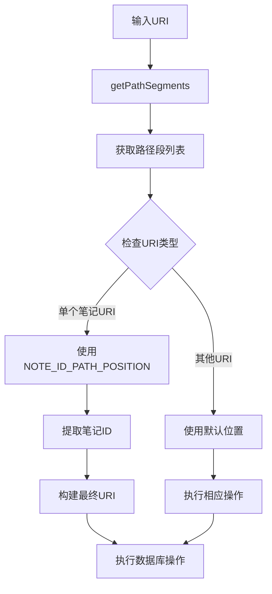

# 数据契约定义

<cite>
**本文档中引用的文件**
- [NotePad.java](file://app/src/main/java/com/example/android/notepad/NotePad.java)
- [NotePadProvider.java](file://app/src/main/java/com/example/android/notepad/NotePadProvider.java)
- [NoteEditor.java](file://app/src/main/java/com/example/android/notepad/NoteEditor.java)
- [NotesList.java](file://app/src/main/java/com/example/android/notepad/NotesList.java)
- [AndroidManifest.xml](file://app/src/main/AndroidManifest.xml)
- [strings.xml](file://app/src/main/res/values/strings.xml)
</cite>

## 目录
1. [简介](#简介)
2. [项目架构概览](#项目架构概览)
3. [NotePad类核心数据契约](#notepad类核心数据契约)
4. [AUTHORITY常量的重要性](#authority常量的重要性)
5. [URI常量系统详解](#uri常量系统详解)
6. [MIME类型定义与应用](#mime类型定义与应用)
7. [BaseColumns接口继承](#basecolumns接口继承)
8. [客户端安全访问实践](#客户端安全访问实践)
9. [URI解析机制分析](#uri解析机制分析)
10. [总结](#总结)

## 简介

NotePad应用是一个经典的Android内容提供者示例，展示了如何通过数据契约模式实现数据访问的安全性和一致性。本文档深入分析NotePad类作为核心数据访问契约的设计理念和实现细节，重点阐述其在Android应用程序架构中的重要作用。

数据契约是Android应用程序中连接用户界面层和数据存储层的重要桥梁，它定义了数据访问的标准接口，确保了不同组件之间的数据交互的一致性和可靠性。

## 项目架构概览

NotePad应用采用典型的Android三层架构设计：

**图表来源**
- [NotePadProvider.java](file://app/src/main/java/com/example/android/notepad/NotePadProvider.java#L54-L753)
- [NotePad.java](file://app/src/main/java/com/example/android/notepad/NotePad.java#L28-L155)

## NotePad类核心数据契约

NotePad类是整个NotePad应用的数据契约核心，它定义了所有与笔记数据相关的常量和约定。该类采用静态内部类的设计模式，将相关的常量组织在一个逻辑单元中。

### 类结构设计

**图表来源**
- [NotePad.java](file://app/src/main/java/com/example/android/notepad/NotePad.java#L28-L155)

### 核心设计理念

1. **不可实例化设计**：NotePad类被声明为私有构造函数，防止外部实例化
2. **静态常量集合**：所有常量都声明为static final，确保值的不可变性
3. **命名空间隔离**：通过嵌套类结构实现命名空间的逻辑分离
4. **类型安全**：使用强类型常量，避免字符串字面量的硬编码

**章节来源**
- [NotePad.java](file://app/src/main/java/com/example/android/notepad/NotePad.java#L28-L33)

## AUTHORITY常量的重要性

AUTHORITY常量是内容提供者标识的核心，它在整个Android系统中唯一标识了NotePad应用的数据提供者。

### AUTHORITY的作用机制

**图表来源**
- [NotePadProvider.java](file://app/src/main/java/com/example/android/notepad/NotePadProvider.java#L122-L131)
- [AndroidManifest.xml](file://app/src/main/AndroidManifest.xml#L28-L31)

### AUTHORITY的配置要求

1. **域名唯一性**：通常使用反向域名格式确保全局唯一性
2. **包名映射**：与应用的包名保持一致
3. **权限控制**：影响应用间数据共享的权限设置

### 在AndroidManifest.xml中的配置

AUTHORITY常量在AndroidManifest.xml中通过`android:authorities`属性进行配置，这是内容提供者注册的关键部分。

**章节来源**
- [NotePad.java](file://app/src/main/java/com/example/android/notepad/NotePad.java#L29)
- [AndroidManifest.xml](file://app/src/main/AndroidManifest.xml#L29)

## URI常量系统详解

URI常量系统是NotePad数据契约的核心组成部分，它定义了数据访问的统一路径规范。

### URI常量层次结构

**图表来源**
- [NotePad.java](file://app/src/main/java/com/example/android/notepad/NotePad.java#L55-L98)

### CONTENT_URI的构成

CONTENT_URI是访问笔记列表的根URI，它由以下三部分组成：
- **方案部分**：`content://`
- **授权部分**：AUTHORITY常量
- **路径部分**：`/notes`

### CONTENT_ID_URI_BASE的作用

CONTENT_ID_URI_BASE用于构建指向特定笔记的URI，它是单个笔记记录的基础URI模板。客户端需要在此基础上附加具体的笔记ID来访问特定的笔记。

### CONTENT_ID_URI_PATTERN的通配符机制

CONTENT_ID_URI_PATTERN使用`/#`作为通配符模式，其中`#`表示一个或多个数字字符。这种模式匹配机制允许内容提供者识别和处理带有ID参数的URI请求。

**章节来源**
- [NotePad.java](file://app/src/main/java/com/example/android/notepad/NotePad.java#L83-L98)

## MIME类型定义与应用

MIME类型在Android内容提供者中起到数据类型识别和路由选择的重要作用。

### CONTENT_TYPE与CONTENT_ITEM_TYPE的区别

| MIME类型 | 用途 | 使用场景 |
|---------|------|----------|
| CONTENT_TYPE | `vnd.android.cursor.dir/vnd.google.note` | 笔记列表目录类型，返回多条记录 |
| CONTENT_ITEM_TYPE | `vnd.android.cursor.item/vnd.google.note` | 单个笔记项类型，返回单条记录 |

### MIME类型的应用机制

**图表来源**
- [NotePadProvider.java](file://app/src/main/java/com/example/android/notepad/NotePadProvider.java#L340-L347)

### MIME类型在Intent过滤器中的应用

在AndroidManifest.xml中，MIME类型用于定义Activity能够处理的数据类型，实现智能的Intent路由。

**章节来源**
- [NotePad.java](file://app/src/main/java/com/example/android/notepad/NotePad.java#L113-L119)
- [AndroidManifest.xml](file://app/src/main/AndroidManifest.xml#L44-L49)

## BaseColumns接口继承

BaseColumns接口提供了标准的数据库列定义，特别是`_id`主键字段的定义。

### _id字段的继承使用

**图表来源**
- [NotePad.java](file://app/src/main/java/com/example/android/notepad/NotePad.java#L38)

### _id字段的重要性

1. **数据库索引优化**：作为主键提高查询性能
2. **ContentProvider要求**：大多数ContentProvider要求提供_id列
3. **Cursor适配器支持**：简化ListView的数据绑定
4. **数据完整性保证**：确保每条记录的唯一性

### 数据库表结构映射

在NotePadProvider的数据库创建方法中，可以看到_id字段的正确定义：

**章节来源**
- [NotePad.java](file://app/src/main/java/com/example/android/notepad/NotePad.java#L46)
- [NotePadProvider.java](file://app/src/main/java/com/example/android/notepad/NotePadProvider.java#L194-L200)

## 客户端安全访问实践

通过NotePad类访问数据可以避免硬编码字符串，提高代码的可维护性和安全性。

### 安全访问模式

**图表来源**
- [NoteEditor.java](file://app/src/main/java/com/example/android/notepad/NoteEditor.java#L210-L216)
- [NotesList.java](file://app/src/main/java/com/example/android/notepad/NotesList.java#L113-L119)

### 推荐的访问方式

1. **使用常量而非硬编码**：始终通过NotePad.Notes.CONTENT_URI访问数据
2. **投影列的安全选择**：只请求必要的列，避免数据泄露
3. **参数化查询**：使用selection和selectionArgs进行安全查询
4. **异常处理**：妥善处理查询失败的情况

### 代码示例模式

客户端应该遵循以下模式来安全访问数据：

**章节来源**
- [NoteEditor.java](file://app/src/main/java/com/example/android/notepad/NoteEditor.java#L61-L66)
- [NotesList.java](file://app/src/main/java/com/example/android/notepad/NotesList.java#L64-L68)

## URI解析机制分析

NOTE_ID_PATH_POSITION常量在URI解析过程中发挥关键作用，它指定了笔记ID在URI路径段中的位置。

### URI路径解析流程

**图表来源**
- [NotePadProvider.java](file://app/src/main/java/com/example/android/notepad/NotePadProvider.java#L272-L278)
- [NotePadProvider.java](file://app/src/main/java/com/example/android/notepad/NotePadProvider.java#L695-L697)

### NOTE_ID_PATH_POSITION的实际用途

NOTE_ID_PATH_POSITION常量的值为1，这表示在URI路径中，笔记ID位于第2个位置（从0开始计数）。这个位置信息对于正确解析带有ID的URI至关重要。

### URI匹配机制

在NotePadProvider中，URI匹配通过UriMatcher类实现，它根据预定义的模式匹配传入的URI：

**章节来源**
- [NotePad.java](file://app/src/main/java/com/example/android/notepad/NotePad.java#L74)
- [NotePadProvider.java](file://app/src/main/java/com/example/android/notepad/NotePadProvider.java#L122-L131)

## 总结

NotePad类作为数据契约的核心，在Android应用程序中发挥了以下重要作用：

### 设计优势

1. **统一的数据访问接口**：通过常量定义确保所有组件使用相同的数据访问路径
2. **类型安全的URI管理**：避免了字符串硬编码带来的维护问题
3. **清晰的命名空间划分**：将相关的常量组织在逻辑单元中
4. **标准化的MIME类型定义**：支持Android系统的Intent路由机制

### 最佳实践要点

1. **始终使用契约类常量**：避免直接使用字符串字面量
2. **正确处理URI路径解析**：利用NOTE_ID_PATH_POSITION常量
3. **遵循MIME类型约定**：根据数据类型选择合适的MIME类型
4. **合理使用BaseColumns**：继承标准的数据库列定义

### 架构意义

NotePad数据契约的设计体现了Android应用程序架构的最佳实践，为开发者提供了一个可扩展、可维护的数据访问解决方案。通过这种方式，应用程序能够更好地适应需求变化，同时保持良好的代码质量和用户体验。

这种契约式的设计不仅适用于简单的笔记应用，也为更复杂的企业级应用提供了坚实的基础架构支持。