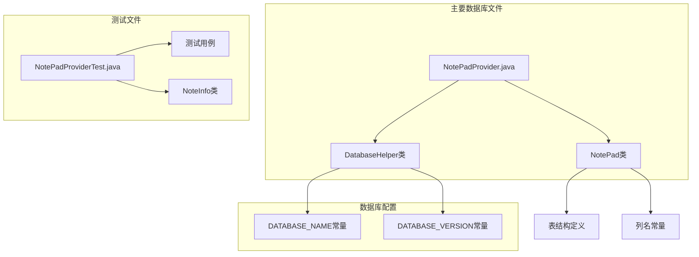
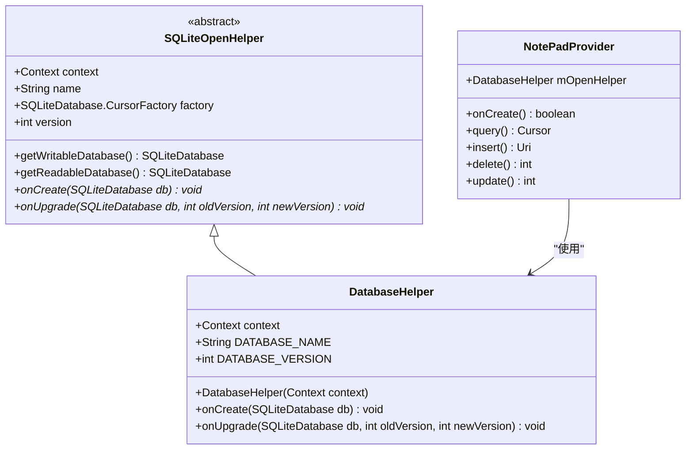
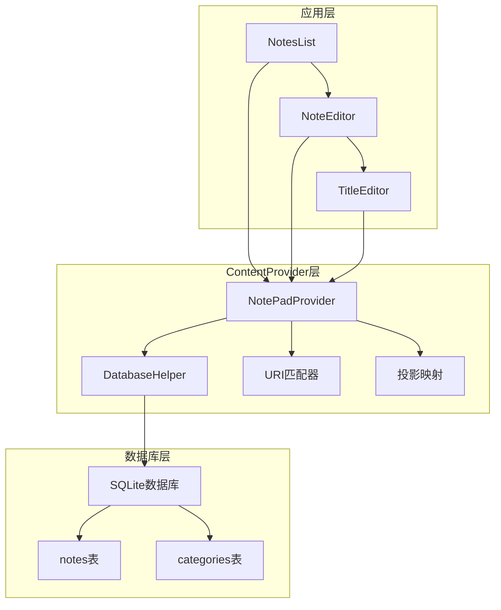
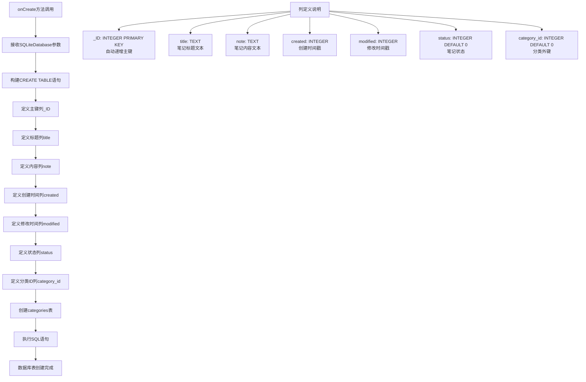
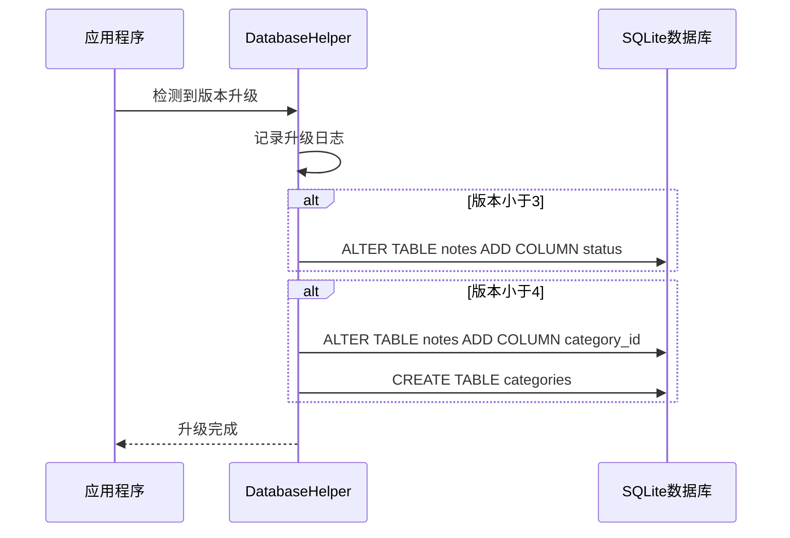
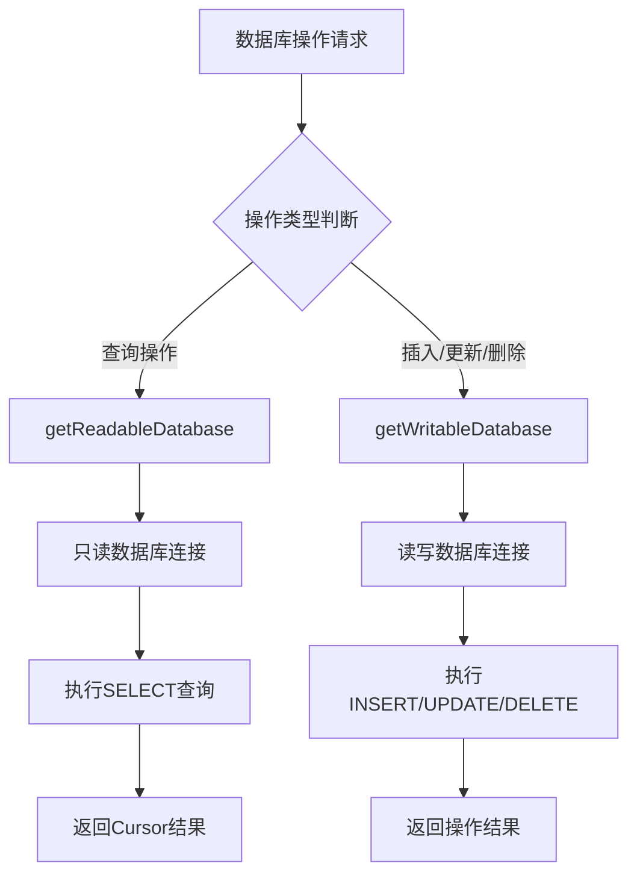
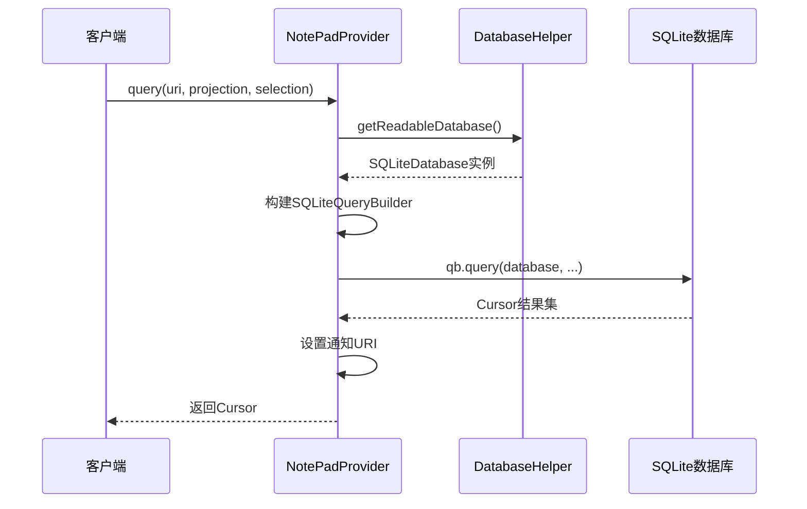
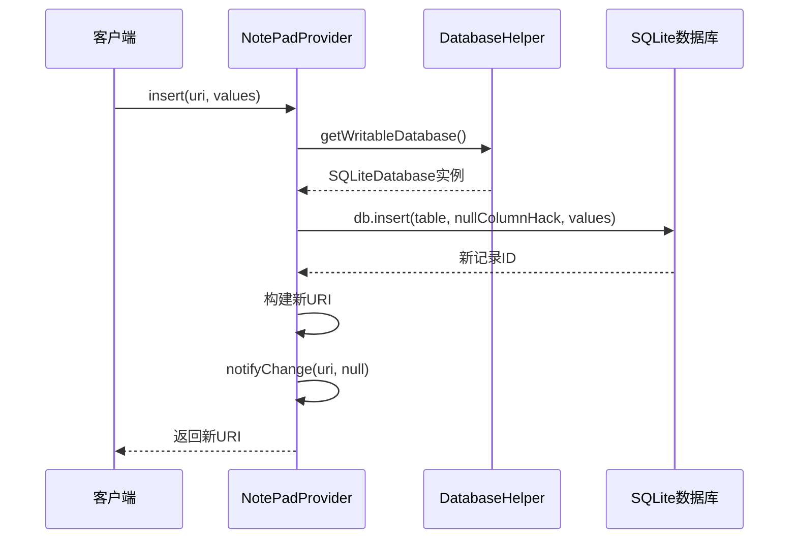
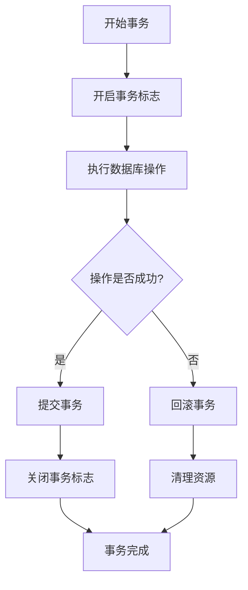
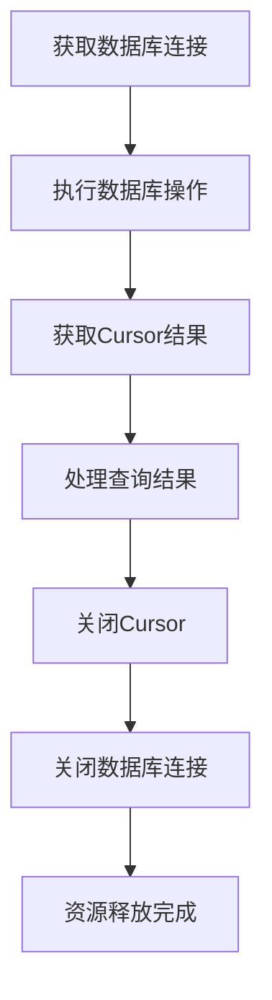

# 数据库实现

<cite>
**本文档引用的文件**
- [NotePadProvider.java](file://app/src/main/java/com/example/android/notepad/NotePadProvider.java)
- [NotePad.java](file://app/src/main/java/com/example/android/notepad/NotePad.java)
- [NotePadProviderTest.java](file://app/src/androidTest/java/com/example/android/notepad/NotePadProviderTest.java)
- [Category.java](file://app/src/main/java/com/example/android/notepad/Category.java)
- [Note.java](file://app/src/main/java/com/example/android/notepad/Note.java)
</cite>

## 更新摘要
**已修改内容**
- 更新了onCreate方法中notes表的创建语句，添加了status和category_id字段
- 新增了categories表的创建和结构说明
- 更新了onUpgrade方法的版本升级策略，支持增量升级
- 更新了数据库配置管理中的版本号
- 新增了ER图和时序图建议

## 目录
1. [简介](#简介)
2. [项目结构概览](#项目结构概览)
3. [核心组件分析](#核心组件分析)
4. [架构概览](#架构概览)
5. [详细组件分析](#详细组件分析)
6. [数据库配置管理](#数据库配置管理)
7. [数据库读写操作](#数据库读写操作)
8. [事务处理最佳实践](#事务处理最佳实践)
9. [性能考虑](#性能考虑)
10. [故障排除指南](#故障排除指南)
11. [结论](#结论)

## 简介

NotePad应用采用Android平台的标准SQLite数据库实现，通过ContentProvider模式提供数据访问接口。该应用的核心数据库实现位于`NotePadProvider`类中，其中包含一个继承自`SQLiteOpenHelper`的内部类`DatabaseHelper`，负责数据库的创建、升级和版本管理。

本文档深入分析DatabaseHelper类作为SQLiteOpenHelper子类的实现机制，详细说明数据库表结构设计、版本升级策略、以及数据库操作的最佳实践。

## 项目结构概览

NotePad应用的数据库相关文件组织结构如下：

**图表来源**
- [NotePadProvider.java](file://app/src/main/java/com/example/android/notepad/NotePadProvider.java#L179-L222)
- [NotePad.java](file://app/src/main/java/com/example/android/notepad/NotePad.java#L38-L153)

**章节来源**
- [NotePadProvider.java](file://app/src/main/java/com/example/android/notepad/NotePadProvider.java#L1-L200)
- [NotePad.java](file://app/src/main/java/com/example/android/notepad/NotePad.java#L1-L155)

## 核心组件分析

### DatabaseHelper类结构

DatabaseHelper类是NotePad应用数据库实现的核心组件，它继承自Android的SQLiteOpenHelper类，提供了完整的数据库生命周期管理功能。

**图表来源**
- [NotePadProvider.java](file://app/src/main/java/com/example/android/notepad/NotePadProvider.java#L179-L222)

**章节来源**
- [NotePadProvider.java](file://app/src/main/java/com/example/android/notepad/NotePadProvider.java#L179-L222)

## 架构概览

NotePad应用采用分层架构设计，数据库层通过ContentProvider模式与上层应用逻辑分离：

**图表来源**
- [NotePadProvider.java](file://app/src/main/java/com/example/android/notepad/NotePadProvider.java#L54-L108)

## 详细组件分析

### onCreate方法实现机制

DatabaseHelper的onCreate方法负责创建应用的初始数据库结构，通过SQL语句定义notes表和categories表的完整结构：

**图表来源**
- [NotePadProvider.java](file://app/src/main/java/com/example/android/notepad/NotePadProvider.java#L237-L254)

#### 表结构详细说明

**notes表结构**

| 列名 | 数据类型 | 约束条件 | 描述 |
|------|----------|----------|------|
| _ID | INTEGER | PRIMARY KEY | 主键，自动递增，用于唯一标识每条笔记 |
| title | TEXT | 无 | 笔记标题，支持任意长度的文本 |
| note | TEXT | 无 | 笔记内容，存储完整的笔记信息 |
| created | INTEGER | 无 | 创建时间戳，使用System.currentTimeMillis()格式 |
| modified | INTEGER | 无 | 修改时间戳，记录最后修改时间 |
| status | INTEGER | DEFAULT 0 | 笔记状态，0表示待办，1表示已完成 |
| category_id | INTEGER | DEFAULT 0 | 分类ID，外键关联categories表 |

**categories表结构**

| 列名 | 数据类型 | 约束条件 | 描述 |
|------|----------|----------|------|
| _ID | INTEGER | PRIMARY KEY AUTOINCREMENT | 主键，自动递增，用于唯一标识每个分类 |
| name | TEXT | NOT NULL UNIQUE | 分类名称，必须唯一 |
| created_time | INTEGER | 无 | 分类创建时间戳 |
| modified_time | INTEGER | 无 | 分类最后修改时间戳 |

**章节来源**
- [NotePadProvider.java](file://app/src/main/java/com/example/android/notepad/NotePadProvider.java#L237-L254)
- [NotePad.java](file://app/src/main/java/com/example/android/notepad/NotePad.java#L130-L164)
- [Note.java](file://app/src/main/java/com/example/android/notepad/Note.java#L22-L29)
- [Category.java](file://app/src/main/java/com/example/android/notepad/Category.java#L22-L26)

### onUpgrade方法版本升级策略

当前实现采用增量升级策略，在数据库版本变更时逐步添加新字段和表：

**图表来源**
- [NotePadProvider.java](file://app/src/main/java/com/example/android/notepad/NotePadProvider.java#L272-L287)

#### 生产环境改进建议

为了在生产环境中实现更安全的数据库升级，建议采用以下策略：

1. **增量升级模式**：保留现有数据，仅添加新列或修改结构
2. **备份策略**：升级前自动备份重要数据
3. **渐进式升级**：分多个版本逐步完成复杂结构变更
4. **数据迁移**：为新字段提供合理的默认值

**章节来源**
- [NotePadProvider.java](file://app/src/main/java/com/example/android/notepad/NotePadProvider.java#L272-L287)

## 数据库配置管理

### 常量定义分析

DatabaseHelper通过静态常量管理数据库配置信息：

| 常量名称 | 值 | 类型 | 用途 |
|----------|-----|------|------|
| DATABASE_NAME | "note_pad.db" | String | 数据库文件名 |
| DATABASE_VERSION | 4 | int | 当前数据库版本号 |

这些常量在DatabaseHelper构造函数中被传递给父类SQLiteOpenHelper，确保数据库配置的一致性和可维护性。

**章节来源**
- [NotePadProvider.java](file://app/src/main/java/com/example/android/notepad/NotePadProvider.java#L61-L66)

## 数据库读写操作

### 数据库连接获取方式

NotePadProvider通过两种方式获取数据库连接，根据操作类型选择合适的连接模式：

**图表来源**
- [NotePadProvider.java](file://app/src/main/java/com/example/android/notepad/NotePadProvider.java#L302-L302)
- [NotePadProvider.java](file://app/src/main/java/com/example/android/notepad/NotePadProvider.java#L585-L585)
- [NotePadProvider.java](file://app/src/main/java/com/example/android/notepad/NotePadProvider.java#L671-L671)

### 具体操作示例

#### 查询操作流程

**图表来源**
- [NotePadProvider.java](file://app/src/main/java/com/example/android/notepad/NotePadProvider.java#L252-L321)

#### 插入操作流程

**图表来源**
- [NotePadProvider.java](file://app/src/main/java/com/example/android/notepad/NotePadProvider.java#L540-L566)

**章节来源**
- [NotePadProvider.java](file://app/src/main/java/com/example/android/notepad/NotePadProvider.java#L252-L321)
- [NotePadProvider.java](file://app/src/main/java/com/example/android/notepad/NotePadProvider.java#L540-L566)

## 事务处理最佳实践

### 数据库事务管理

虽然当前实现没有显式使用事务，但在实际应用中应该考虑以下事务处理最佳实践：

1. **批量操作事务**：对于大量数据的插入、更新或删除操作，应该使用事务来保证原子性
2. **错误回滚**：在事务中发生异常时，应该能够回滚到事务开始前的状态
3. **性能优化**：适当的事务可以减少数据库锁定时间，提高并发性能

### 推荐的事务使用模式

## 性能考虑

### 数据库性能优化建议

1. **索引策略**：为经常查询的列（如created、modified）创建索引
2. **查询优化**：使用适当的投影列，避免SELECT *查询
3. **连接池管理**：合理管理数据库连接的打开和关闭
4. **内存管理**：及时释放不需要的Cursor对象

### 内存泄漏预防

确保在适当的时候关闭数据库连接和游标，避免内存泄漏：

## 故障排除指南

### 常见数据库问题及解决方案

#### 数据库版本不匹配

**问题描述**：应用启动时提示数据库版本不匹配错误

**解决方案**：
1. 检查DATABASE_VERSION常量值
2. 实现适当的onUpgrade方法
3. 考虑用户数据备份策略

#### 数据库锁定

**问题描述**：数据库操作超时或锁定错误

**解决方案**：
1. 检查是否有长时间运行的查询
2. 确保正确关闭数据库连接
3. 使用适当的事务管理

#### 存储空间不足

**问题描述**：数据库文件过大导致存储空间不足

**解决方案**：
1. 定期清理过期数据
2. 实现数据库压缩功能
3. 监控数据库文件大小

**章节来源**
- [NotePadProvider.java](file://app/src/main/java/com/example/android/notepad/NotePadProvider.java#L211-L221)

## 结论

NotePad应用的数据库实现展示了Android平台SQLite数据库使用的标准模式。DatabaseHelper类作为SQLiteOpenHelper的子类，提供了完整的数据库生命周期管理功能，包括：

1. **优雅的表结构设计**：通过合理的列定义和约束，确保数据完整性和查询效率
2. **清晰的版本管理**：通过常量定义数据库配置，便于维护和升级
3. **灵活的操作接口**：支持多种数据库操作，满足应用需求
4. **良好的扩展性**：为未来的功能扩展预留了空间

虽然当前的onUpgrade实现采用了简单的重建策略，但在生产环境中应该考虑更安全的迁移方案。通过遵循本文档提供的最佳实践和建议，开发者可以构建更加健壮和高效的数据库应用程序。