# View层详解

<cite>
**本文档引用的文件**
- [note_editor.xml](file://app/src/main/res/layout/note_editor.xml)
- [noteslist_item.xml](file://app/src/main/res/layout/noteslist_item.xml)
- [title_editor.xml](file://app/src/main/res/layout/title_editor.xml)
- [strings.xml](file://app/src/main/res/values/strings.xml)
- [editor_options_menu.xml](file://app/src/main/res/menu/editor_options_menu.xml)
- [list_options_menu.xml](file://app/src/main/res/menu/list_options_menu.xml)
- [list_context_menu.xml](file://app/src/main/res/menu/list_context_menu.xml)
- [NotesList.java](file://app/src/main/java/com/example/android/notepad/NotesList.java)
- [NoteEditor.java](file://app/src/main/java/com/example/android/notepad/NoteEditor.java)
</cite>

## 目录
1. [简介](#简介)
2. [项目结构概览](#项目结构概览)
3. [核心布局文件分析](#核心布局文件分析)
4. [数据绑定机制](#数据绑定机制)
5. [UI组件关系图](#ui组件关系图)
6. [资源系统与本地化](#资源系统与本地化)
7. [性能优化策略](#性能优化策略)
8. [调试与故障排除](#调试与故障排除)
9. [最佳实践建议](#最佳实践建议)
10. [总结](#总结)

## 简介

NotePad应用的View层采用了经典的Android MVC架构模式，通过精心设计的布局文件和数据绑定机制，实现了简洁而功能完整的笔记管理界面。本文档将深入分析res/layout目录下的UI布局文件设计原理，详细说明SimpleCursorAdapter的数据绑定机制，以及Android资源系统的本地化支持。

## 项目结构概览

NotePad应用的View层主要由以下核心组件构成：

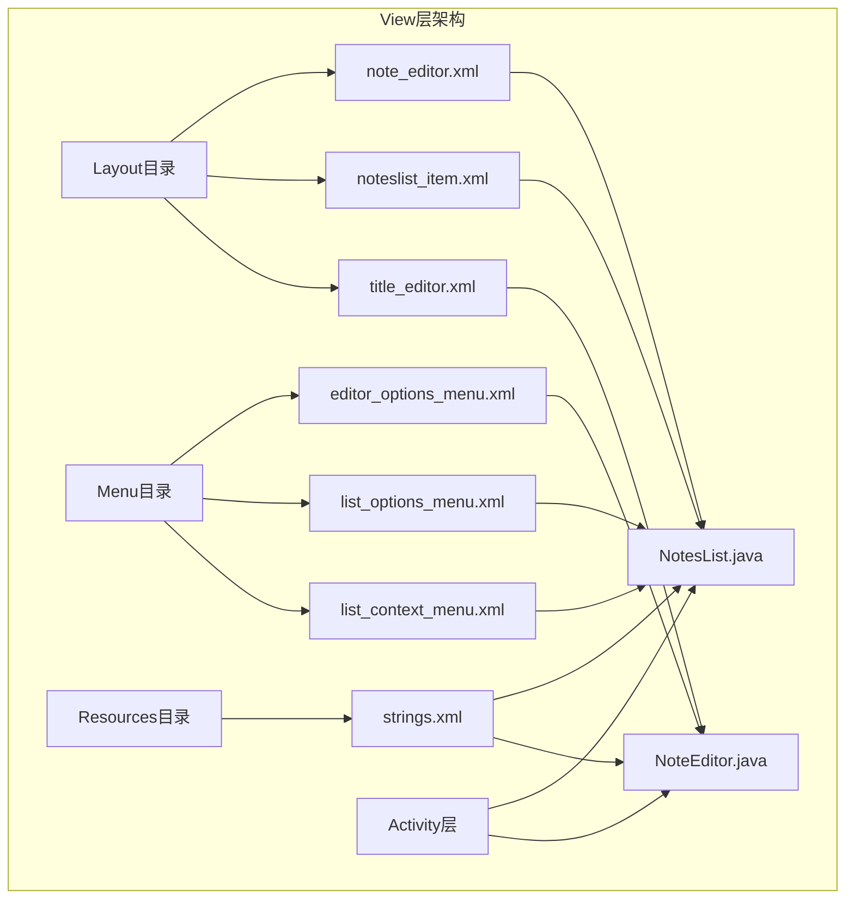

**图表来源**
- [note_editor.xml](file://app/src/main/res/layout/note_editor.xml#L1-L29)
- [noteslist_item.xml](file://app/src/main/res/layout/noteslist_item.xml#L1-L40)
- [NotesList.java](file://app/src/main/java/com/example/android/notepad/NotesList.java#L1-L50)

**章节来源**
- [note_editor.xml](file://app/src/main/res/layout/note_editor.xml#L1-L29)
- [noteslist_item.xml](file://app/src/main/res/layout/noteslist_item.xml#L1-L40)
- [title_editor.xml](file://app/src/main/res/layout/title_editor.xml#L1-L44)

## 核心布局文件分析

### noteslist_item.xml - 笔记列表项设计

noteslist_item.xml是笔记列表的核心布局文件，采用垂直LinearLayout容器，为每个笔记条目提供统一的视觉结构。

#### 布局结构设计

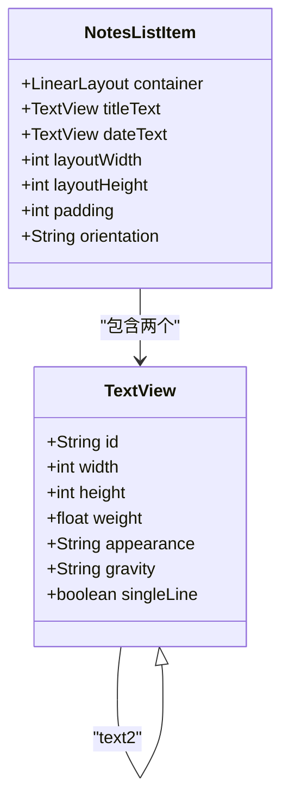

**图表来源**
- [noteslist_item.xml](file://app/src/main/res/layout/noteslist_item.xml#L17-L40)

#### 关键设计特性

1. **高度适配机制**：使用`?android:attr/listPreferredItemHeight`确保在不同设备上保持一致的列表项高度
2. **权重分配**：两个TextView各占50%的高度（`layout_weight="1"`），实现垂直居中对齐
3. **文本外观**：标题使用大号字体（`textAppearanceLarge`），时间戳使用小号字体（`textAppearanceSmall`）
4. **颜色主题**：时间戳使用辅助文本颜色（`textColorSecondary`）以区分主次信息

#### 排版与视觉层次

| 组件 | 属性配置 | 设计目的 |
|------|----------|----------|
| 容器 | `match_parent` × `?listPreferredItemHeight` | 占满父容器宽度，高度自适应 |
| 标题文本 | `weight=1` + `center_vertical` | 主要信息突出显示 |
| 时间文本 | `weight=1` + `small` + `secondaryColor` | 次要信息清晰展示 |
| 内边距 | `paddingLeft=5dip` | 视觉间距和品牌一致性 |

**章节来源**
- [noteslist_item.xml](file://app/src/main/res/layout/noteslist_item.xml#L17-L40)

### note_editor.xml - 编辑界面设计

note_editor.xml采用自定义LinedEditText类，提供专业的书写体验。

#### 自定义EditText组件

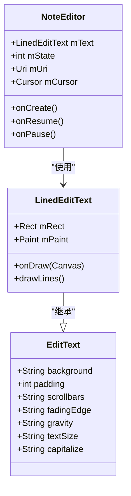

**图表来源**
- [NoteEditor.java](file://app/src/main/java/com/example/android/notepad/NoteEditor.java#L83-L134)
- [note_editor.xml](file://app/src/main/res/layout/note_editor.xml#L16-L28)

#### 软键盘交互配置

| 属性 | 值 | 功能说明 |
|------|-----|----------|
| `background` | `@android:color/transparent` | 透明背景，避免视觉干扰 |
| `padding` | `5dp` | 适当的内边距提供舒适书写空间 |
| `scrollbars` | `vertical` | 支持长文本垂直滚动 |
| `fadingEdge` | `vertical` | 滚动时的渐隐效果 |
| `gravity` | `top` | 文本从顶部开始显示 |
| `textSize` | `22sp` | 大号字体便于阅读 |
| `capitalize` | `sentences` | 句首自动大写 |

**章节来源**
- [note_editor.xml](file://app/src/main/res/layout/note_editor.xml#L16-L28)
- [NoteEditor.java](file://app/src/main/java/com/example/android/notepad/NoteEditor.java#L83-L134)

### title_editor.xml - 标题编辑器设计

title_editor.xml为新笔记提供简洁的标题输入界面。

#### 布局特点

```mermaid
flowchart TD
A[LinearLayout容器] --> B[垂直排列]
B --> C[标题输入框]
B --> D[确认按钮]
C --> E[maxLines=1]
C --> F[autoText=true]
C --> G[capitalize=sentences]
C --> H[scrollHorizontally=true]
D --> I[onClick=onClickOk]
D --> J[text=@string/button_ok]
```

**图表来源**
- [title_editor.xml](file://app/src/main/res/layout/title_editor.xml#L17-L44)

**章节来源**
- [title_editor.xml](file://app/src/main/res/layout/title_editor.xml#L17-L44)

## 数据绑定机制

### SimpleCursorAdapter核心机制

SimpleCursorAdapter是NotePad应用View层与数据层连接的核心桥梁，实现了Cursor数据到ListView视图的高效映射。

#### 数据映射关系

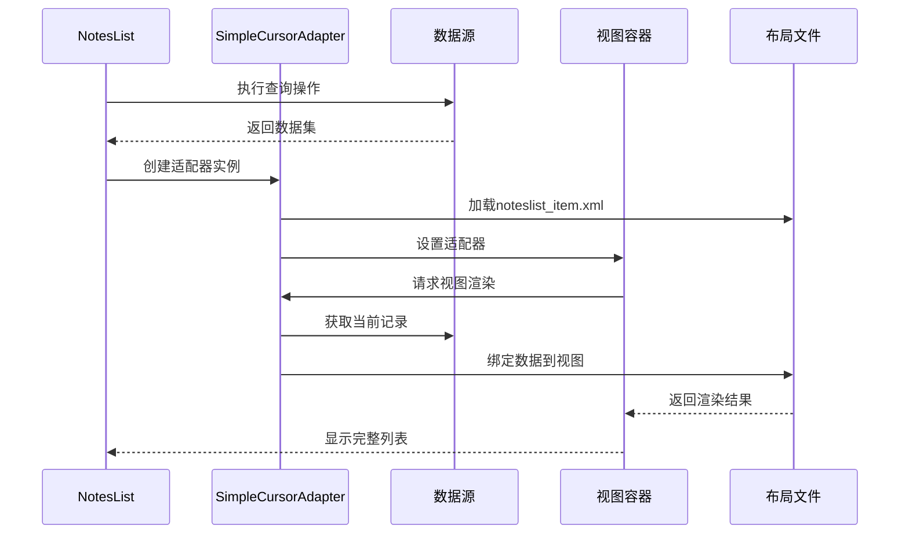

**图表来源**
- [NotesList.java](file://app/src/main/java/com/example/android/notepad/NotesList.java#L136-L166)

#### 关键配置参数

| 参数 | 值 | 作用 |
|------|-----|------|
| Context | `this` | 提供上下文环境 |
| Layout Resource | `R.layout.noteslist_item` | 指定列表项布局 |
| Cursor | `cursor` | 数据源对象 |
| Data Columns | `{COLUMN_NAME_TITLE, COLUMN_NAME_MODIFICATION_DATE}` | 需要显示的列 |
| View IDs | `{android.R.id.text1, android.R.id.text2}` | 对应的视图ID |

#### 自定义数据处理

SimpleCursorAdapter支持重写`setViewText()`方法，实现特殊的数据格式化需求：

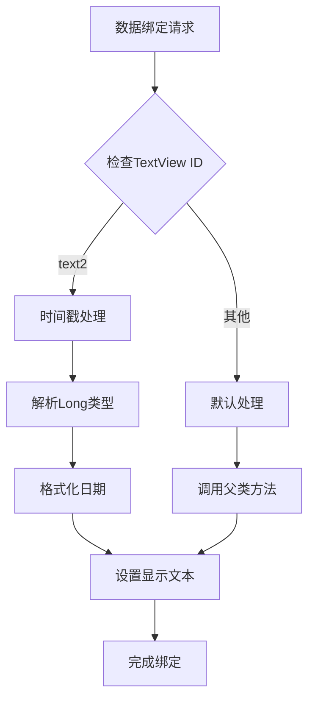

**图表来源**
- [NotesList.java](file://app/src/main/java/com/example/android/notepad/NotesList.java#L146-L162)

**章节来源**
- [NotesList.java](file://app/src/main/java/com/example/android/notepad/NotesList.java#L136-L166)

## UI组件关系图

### 整体架构关系

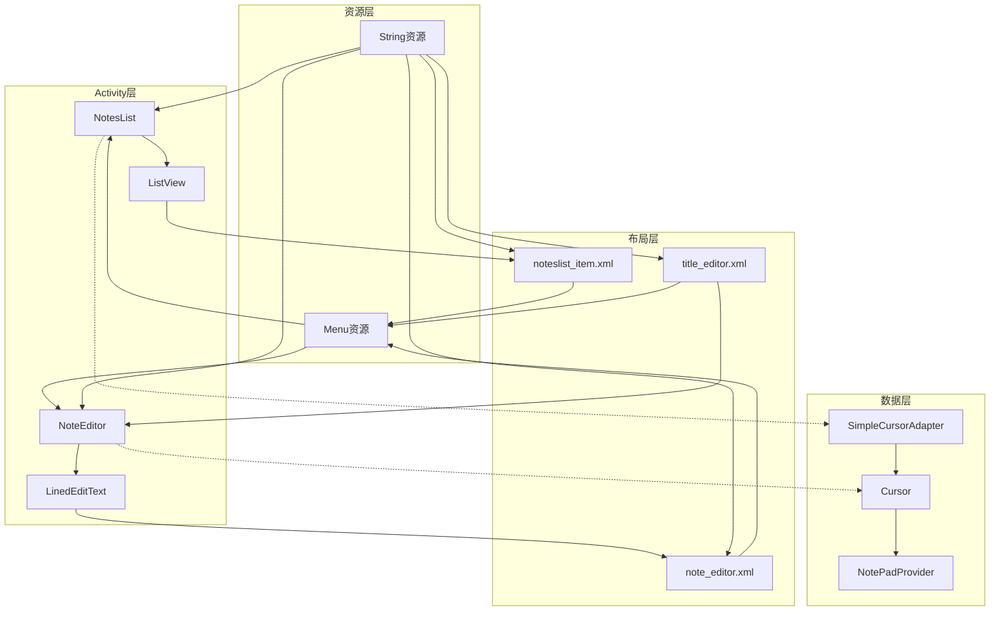

**图表来源**
- [NotesList.java](file://app/src/main/java/com/example/android/notepad/NotesList.java#L56-L167)
- [NoteEditor.java](file://app/src/main/java/com/example/android/notepad/NoteEditor.java#L54-L228)

### 组件交互流程

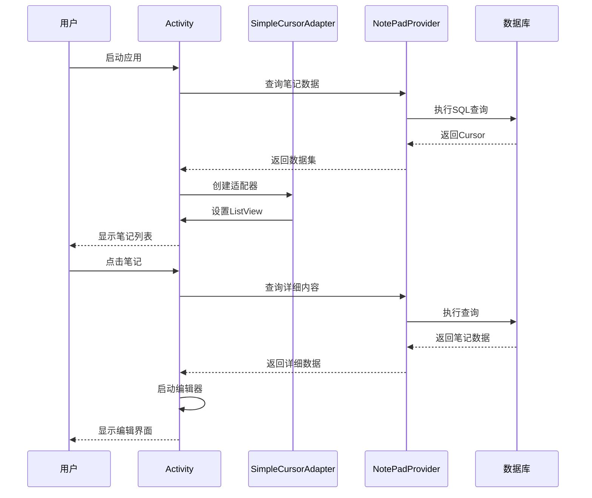

**图表来源**
- [NotesList.java](file://app/src/main/java/com/example/android/notepad/NotesList.java#L108-L167)
- [NoteEditor.java](file://app/src/main/java/com/example/android/notepad/NoteEditor.java#L140-L228)

## 资源系统与本地化

### 字符串资源管理

strings.xml文件采用模块化设计，将所有用户可见文本集中管理，支持国际化和本地化。

#### 资源分类体系

| 类别 | 资源名称 | 用途说明 |
|------|----------|----------|
| 应用信息 | `app_name`, `live_folder_name` | 应用标识和文件夹名称 |
| 编辑界面 | `title_edit_title`, `title_create`, `title_edit` | 标题编辑相关文本 |
| 列表界面 | `title_notes_list`, `menu_add`, `menu_save` | 列表操作相关文本 |
| 按钮文本 | `button_ok`, `text_title` | 按钮和标签文本 |
| 引导文本 | `resolve_edit`, `resolve_title` | 操作引导文本 |
| 错误信息 | `error_title`, `error_message` | 错误提示文本 |
| 提示信息 | `nothing_to_save` | 状态提示文本 |

#### 本地化支持机制

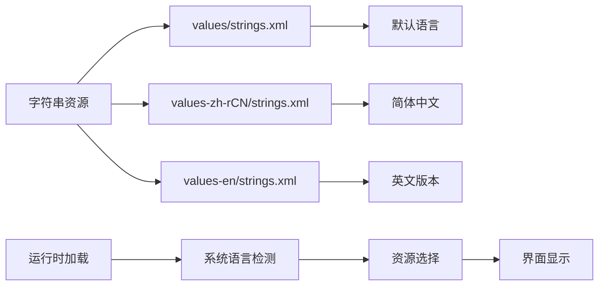

**图表来源**
- [strings.xml](file://app/src/main/res/values/strings.xml#L17-L43)

**章节来源**
- [strings.xml](file://app/src/main/res/values/strings.xml#L17-L43)

### 主题样式应用

虽然代码中未显式指定主题，但通过使用系统属性实现了良好的主题兼容性：

| 系统属性 | 用途 | 优势 |
|----------|------|------|
| `?android:attr/listPreferredItemHeight` | 列表项高度 | 自动适配不同屏幕密度 |
| `?android:attr/textAppearanceLarge` | 大号文本 | 使用系统推荐字体大小 |
| `?android:attr/textAppearanceSmall` | 小号文本 | 保持视觉层次感 |
| `?android:attr/textColorSecondary` | 辅助文本色 | 与主色调形成对比 |

## 性能优化策略

### 布局性能优化

#### 权重分配优化

noteslist_item.xml采用权重分配而非固定高度，实现了以下优势：

1. **响应式设计**：自动适应不同屏幕尺寸
2. **内存效率**：减少不必要的视图嵌套
3. **渲染性能**：简化测量和布局计算

#### 视图复用机制

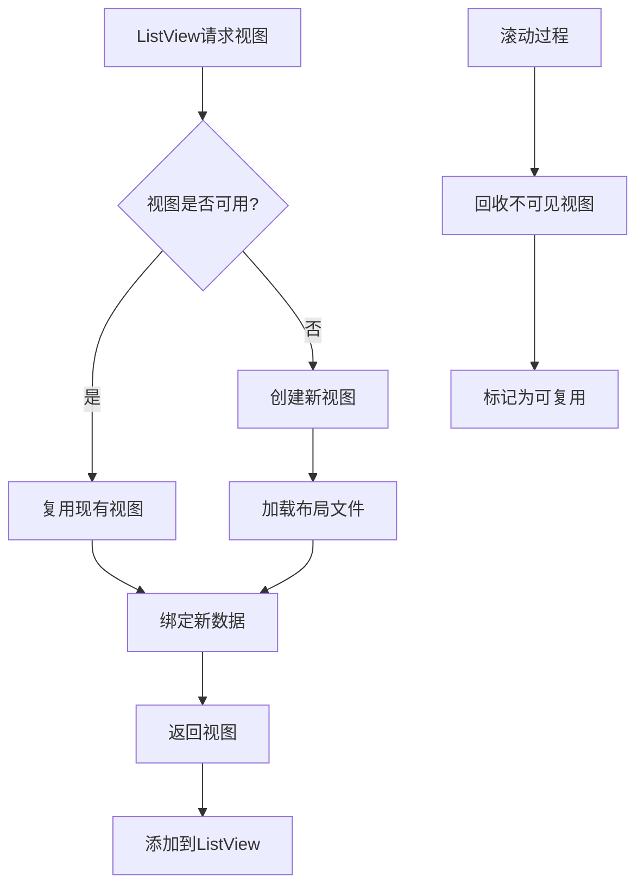

**图表来源**
- [NotesList.java](file://app/src/main/java/com/example/android/notepad/NotesList.java#L136-L166)

### 内存管理策略

#### Cursor生命周期管理

| 阶段 | 操作 | 注意事项 |
|------|------|----------|
| 创建 | `managedQuery()` | 自动管理Cursor生命周期 |
| 使用 | `moveToFirst()`, `requery()` | 确保数据有效性 |
| 销毁 | `close()` | 及时释放资源 |
| 更新 | `changeCursor()` | 平滑切换数据源 |

#### 缓存策略

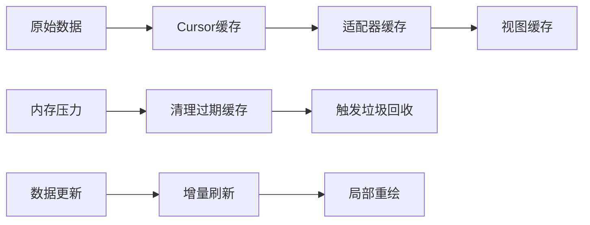

**章节来源**
- [NotesList.java](file://app/src/main/java/com/example/android/notepad/NotesList.java#L108-L167)

## 调试与故障排除

### 常见UI问题诊断

#### 布局显示异常

| 问题症状 | 可能原因 | 解决方案 |
|----------|----------|----------|
| 文本截断 | `singleLine="true"`限制 | 调整布局权重或使用多行 |
| 高度不一致 | 固定高度设置错误 | 使用系统属性替代固定值 |
| 字体过大 | `textSize`设置不当 | 使用`sp`单位并参考系统设置 |
| 颜色不协调 | 主题不匹配 | 使用系统主题属性 |

#### 数据绑定问题

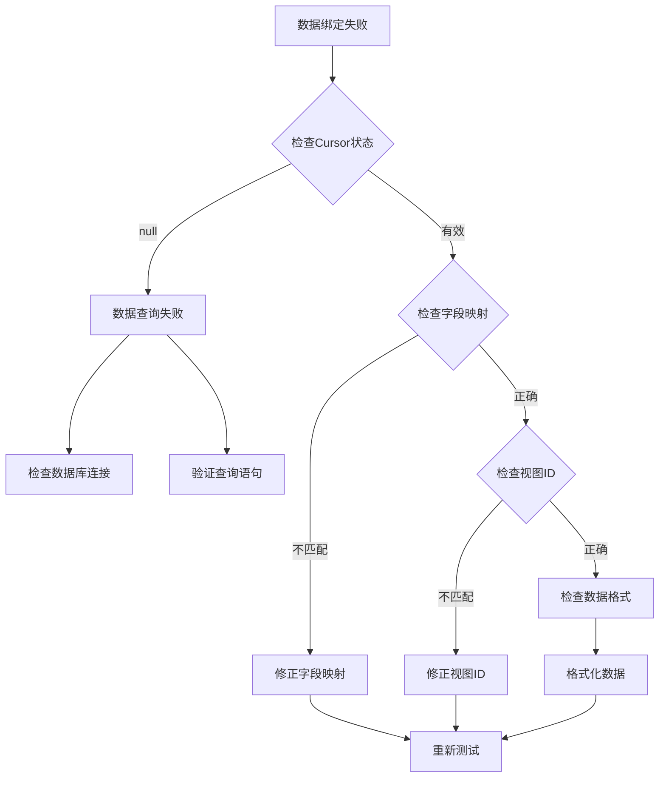

### 性能监控指标

#### 关键性能指标

| 指标 | 正常范围 | 监控方法 |
|------|----------|----------|
| 布局复杂度 | < 10层级 | Layout Inspector |
| 内存占用 | < 50MB | Memory Profiler |
| 渲染时间 | < 16ms | GPU Profiler |
| 数据加载时间 | < 100ms | Network Monitor |

#### 调试工具使用

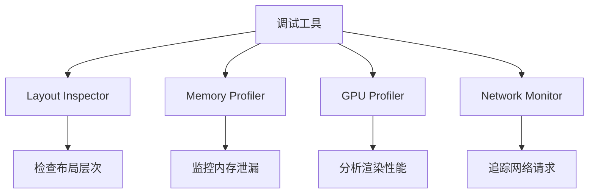

**章节来源**
- [NotesList.java](file://app/src/main/java/com/example/android/notepad/NotesList.java#L108-L167)
- [NoteEditor.java](file://app/src/main/java/com/example/android/notepad/NoteEditor.java#L140-L228)

## 最佳实践建议

### 开发者指南

#### 布局文件设计原则

1. **单一职责**：每个布局文件只负责特定的功能模块
2. **可复用性**：合理使用include和merge标签
3. **性能优先**：避免过度嵌套和复杂的布局计算
4. **适配性**：使用相对尺寸和系统属性

#### 数据绑定最佳实践

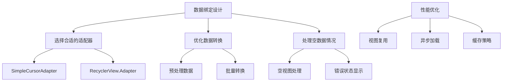

#### 资源管理建议

| 资源类型 | 管理策略 | 示例 |
|----------|----------|------|
| 字符串资源 | 分类组织，使用占位符 | `title_edit="Edit: %1$s"` |
| 图标资源 | 多密度支持，命名规范 | `ic_menu_save`, `ic_menu_delete` |
| 颜色资源 | 使用主题属性，保持一致性 | `?android:attr/textColorSecondary` |
| 尺寸资源 | 使用dp和sp单位 | `5dip`, `22sp` |

### 架构改进建议

#### 当前架构的优势

1. **简洁明了**：MVC架构清晰，职责分离明确
2. **易于维护**：模块化设计，便于功能扩展
3. **性能良好**：合理的数据绑定和视图复用

#### 改进方向

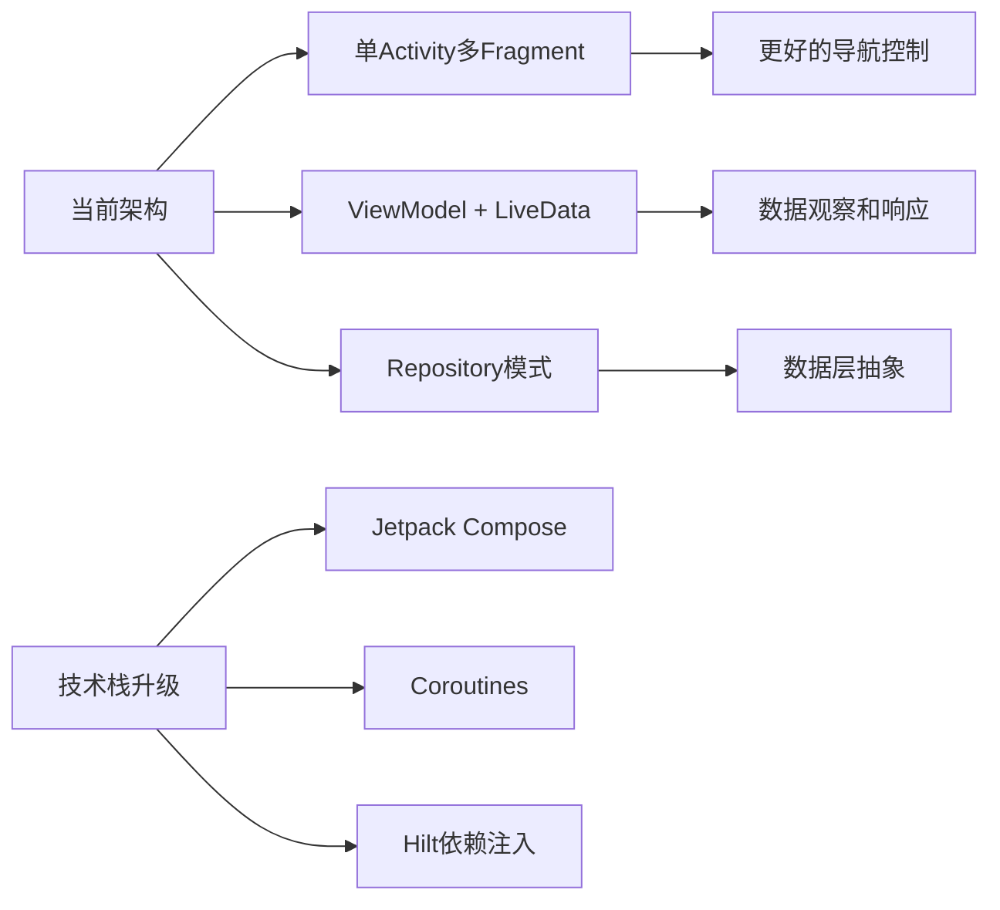

## 总结

NotePad应用的View层展现了Android开发中的经典设计模式和最佳实践。通过深入分析其布局文件设计、数据绑定机制和资源管理系统，我们可以得出以下关键结论：

### 技术亮点

1. **优雅的布局设计**：noteslist_item.xml通过权重分配实现了响应式布局，time_editor.xml提供了专业的书写体验
2. **高效的数据绑定**：SimpleCursorAdapter的使用展示了Android数据绑定的最佳实践
3. **完善的资源管理**：模块化的字符串资源和主题属性支持实现了良好的本地化和主题兼容性

### 学习价值

- **MVC架构理解**：清晰的View层设计为理解Android MVC架构提供了绝佳案例
- **性能优化思路**：从布局到数据绑定的全方位性能考虑值得学习
- **最佳实践应用**：实际项目中的设计决策和解决方案具有很高的参考价值

### 发展方向

随着Android技术的发展，View层可以进一步采用现代架构组件，如Jetpack Compose、ViewModel和LiveData等，以获得更好的开发体验和用户体验。同时，应该关注性能监控和用户体验优化，确保应用在各种设备上都能提供流畅的使用体验。

通过深入理解和应用这些设计理念和技术要点，开发者可以构建出更加专业和用户友好的Android应用程序。