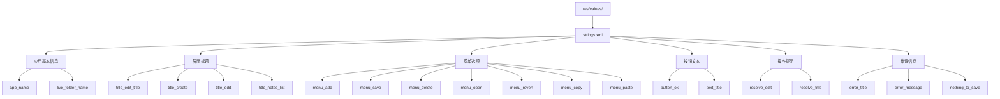
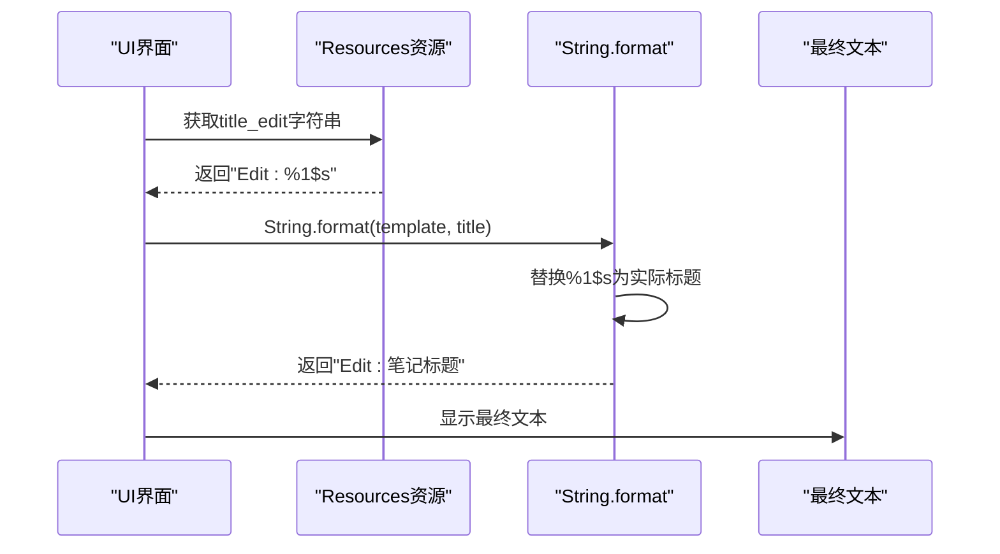
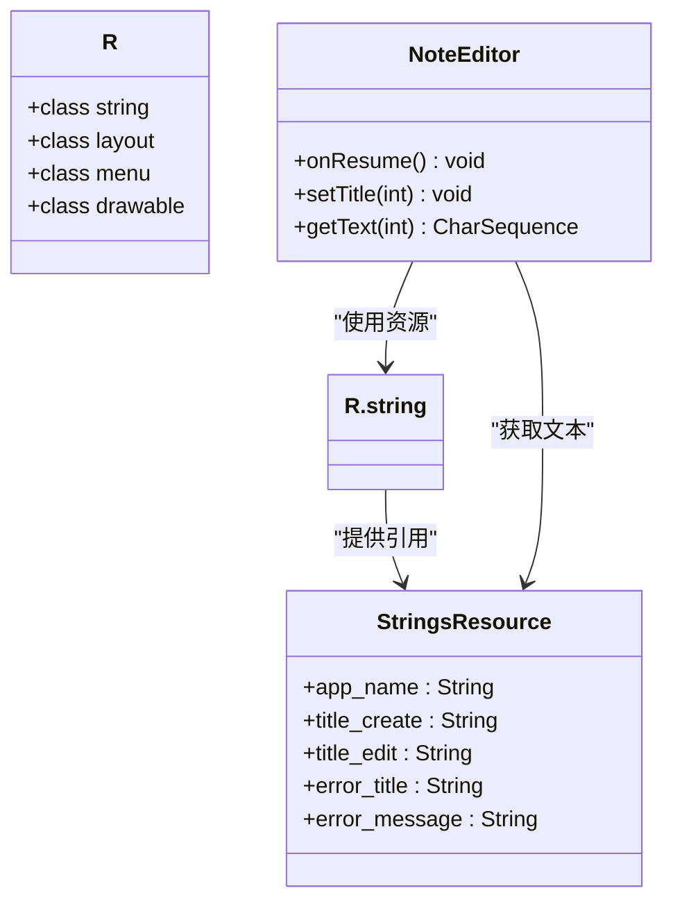
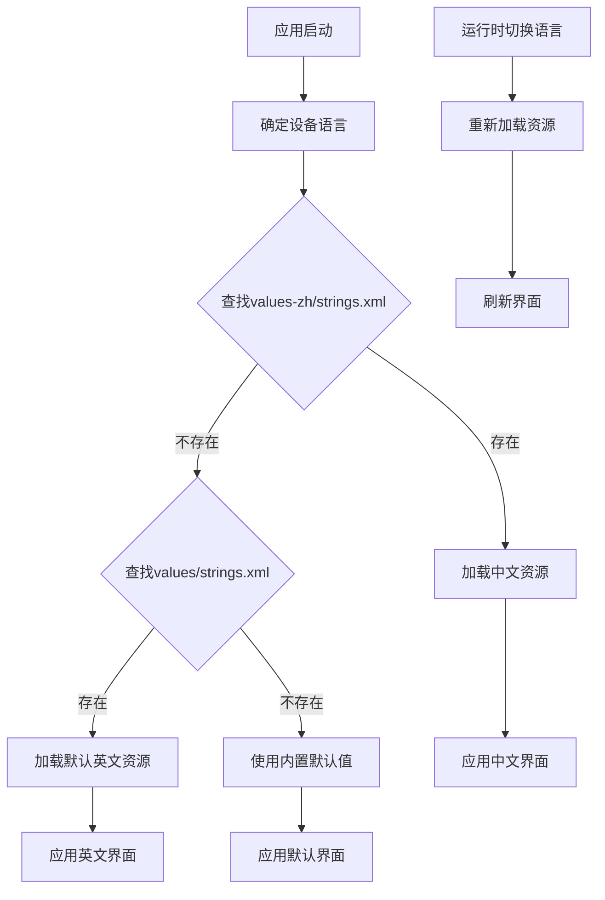

# 字符串资源与UI解耦

<cite>
**本文档中引用的文件**
- [strings.xml](file://app/src/main/res/values/strings.xml)
- [NoteEditor.java](file://app/src/main/java/com/example/android/notepad/NoteEditor.java)
- [NotesList.java](file://app/src/main/java/com/example/android/notepad/NotesList.java)
- [TitleEditor.java](file://app/src/main/java/com/example/android/notepad/TitleEditor.java)
- [editor_options_menu.xml](file://app/src/main/res/menu/editor_options_menu.xml)
- [list_options_menu.xml](file://app/src/main/res/menu/list_options_menu.xml)
- [list_context_menu.xml](file://app/src/main/res/menu/list_context_menu.xml)
- [note_editor.xml](file://app/src/main/res/layout/note_editor.xml)
- [title_editor.xml](file://app/src/main/res/layout/title_editor.xml)
</cite>

## 目录
1. [引言](#引言)
2. [字符串资源组织架构](#字符串资源组织架构)
3. [核心字符串分类分析](#核心字符串分类分析)
4. [格式化字符串技术实现](#格式化字符串技术实现)
5. [UI层中的资源解耦机制](#ui层中的资源解耦机制)
6. [多语言支持机制](#多语言支持机制)
7. [最佳实践指南](#最佳实践指南)
8. [性能优化考虑](#性能优化考虑)
9. [故障排除指南](#故障排除指南)
10. [总结](#总结)

## 引言

在Android开发中，字符串资源的合理组织和使用是构建高质量应用程序的基础。本文档深入分析NotePad项目中字符串资源的组织结构及其在UI层中的核心作用，探讨如何通过资源解耦提升应用的可维护性和国际化能力。

字符串资源不仅仅是简单的文本存储，它们构成了应用程序的本地化基础，提供了统一的文本管理机制，并确保了界面的一致性。通过系统性的分析，我们将揭示字符串资源在现代Android应用架构中的重要作用。

## 字符串资源组织架构

### 资源目录结构

NotePad项目采用标准的Android资源组织方式，所有字符串资源都集中存放在`res/values/strings.xml`文件中：



**图表来源**
- [strings.xml](file://app/src/main/res/values/strings.xml#L17-L43)

### 资源命名规范

项目遵循Android资源命名的最佳实践：

| 类别 | 命名模式 | 示例 | 用途 |
|------|----------|------|------|
| 应用名称 | `app_name` | `NotePad` | 应用程序主名称 |
| 界面标题 | `title_*` | `title_edit`, `title_create` | 各种界面的标题 |
| 菜单选项 | `menu_*` | `menu_add`, `menu_save` | 菜单项显示文本 |
| 按钮文本 | `button_*` | `button_ok` | 按钮显示文本 |
| 操作提示 | `resolve_*` | `resolve_edit` | 操作确认提示 |
| 错误信息 | `error_*` | `error_title`, `error_message` | 错误提示信息 |

**章节来源**
- [strings.xml](file://app/src/main/res/values/strings.xml#L18-L42)

## 核心字符串分类分析

### 应用基本信息字符串

应用基本信息字符串定义了应用程序的核心标识：

- **app_name**: 定义应用程序的主名称，用于应用图标下方显示和应用列表中
- **live_folder_name**: 定义Live Folder的名称，用于桌面快捷方式显示

这些字符串为用户提供了一致的应用识别标识，确保在不同界面和上下文中保持统一的品牌形象。

### 界面标题字符串

界面标题字符串负责为各种界面组件提供描述性文本：

#### 编辑界面标题
- **title_edit_title**: "Note title:" - 用于编辑器中标题输入框的标签
- **title_create**: "New note" - 新建笔记时的界面标题
- **title_edit**: "Edit: %1$s" - 编辑现有笔记时的动态标题，包含占位符

#### 列表界面标题
- **title_notes_list**: "Notes" - 笔记列表界面的标题

这些标题字符串通过资源引用实现了界面文本的集中管理，便于统一修改和维护。

### 菜单选项字符串

菜单选项字符串涵盖了应用程序的主要功能入口：

| 字符串键 | 功能描述 | 使用场景 |
|----------|----------|----------|
| `menu_add` | "New note" | 添加新笔记的菜单项 |
| `menu_save` | "Save" | 保存当前编辑的菜单项 |
| `menu_delete` | "Delete" | 删除当前笔记的菜单项 |
| `menu_open` | "Open" | 打开笔记的菜单项 |
| `menu_revert` | "Revert changes" | 撤销更改的菜单项 |
| `menu_copy` | "Copy" | 复制笔记内容的菜单项 |
| `menu_paste` | "Paste" | 粘贴剪贴板内容的菜单项 |

这些字符串确保了用户界面的一致性和可访问性，同时为屏幕阅读器等辅助技术提供了必要的语义信息。

### 操作提示与错误信息

操作提示和错误信息字符串提供了用户交互过程中的反馈：

#### 操作提示字符串
- **resolve_edit**: "Edit note" - 编辑操作的确认提示
- **resolve_title**: "Edit title" - 修改标题操作的确认提示

#### 错误信息字符串
- **error_title**: "Error" - 错误对话框的标题
- **error_message**: "Error loading note" - 加载笔记失败的错误消息
- **nothing_to_save**: "There is nothing to save" - 尝试保存空内容时的提示

这些字符串通过明确的错误处理机制提升了用户体验，帮助用户理解操作结果并采取适当的行动。

**章节来源**
- [strings.xml](file://app/src/main/res/values/strings.xml#L18-L42)

## 格式化字符串技术实现

### 占位符机制

NotePad项目中使用了Android的格式化字符串功能，特别是在动态标题显示中：



**图表来源**
- [NoteEditor.java](file://app/src/main/java/com/example/android/notepad/NoteEditor.java#L274-L276)

### 实现细节分析

在`NoteEditor`类中，格式化字符串的使用展示了动态文本生成的技术实现：

1. **资源获取**: `Resources res = getResources();`
2. **模板读取**: `String template = res.getString(R.string.title_edit);`
3. **参数替换**: `String formattedText = String.format(template, title);`
4. **界面更新**: `setTitle(formattedText);`

这种实现方式具有以下优势：
- **类型安全**: 编译时检查字符串格式
- **性能优化**: 格式化操作在运行时完成
- **灵活性**: 支持复杂的文本组合逻辑

### 多参数格式化

虽然当前项目主要使用单参数格式化，但Android的`String.format()`方法支持多个参数：

```java
// 示例：支持多个参数的格式化
String message = String.format(
    getString(R.string.complex_format),
    param1, param2, param3
);
```

这为未来的功能扩展提供了可能性，可以轻松添加更多动态内容到界面文本中。

**章节来源**
- [NoteEditor.java](file://app/src/main/java/com/example/android/notepad/NoteEditor.java#L274-L276)

## UI层中的资源解耦机制

### 资源引用机制

Android的资源系统通过R类提供了强类型的资源访问机制：



**图表来源**
- [NoteEditor.java](file://app/src/main/java/com/example/android/notepad/NoteEditor.java#L278-L280)
- [NoteEditor.java](file://app/src/main/java/com/example/android/notepad/NoteEditor.java#L305-L306)

### 解耦优势分析

#### 1. 维护性提升
- **集中管理**: 所有文本内容集中在一处修改
- **版本控制**: 文本变更更容易追踪和回滚
- **团队协作**: 内容提供者和开发者可以独立工作

#### 2. 国际化支持
- **资源分离**: 文本内容与业务逻辑分离
- **语言包**: 可以为不同语言创建专门的资源文件
- **自动适配**: 系统自动选择合适的语言资源

#### 3. 性能优化
- **延迟加载**: 资源只在需要时加载
- **内存管理**: 系统智能管理资源缓存
- **配置变化**: 屏幕方向变化时自动重新加载

### 具体实现示例

#### 菜单资源绑定

在菜单XML文件中直接引用字符串资源：

```xml
<!-- editor_options_menu.xml -->
<item android:title="@string/menu_save" />
```

这种方式确保了菜单项的文本完全由资源文件管理，无需在Java代码中硬编码文本。

#### 动态文本设置

在Java代码中通过资源ID设置动态文本：

```java
// 设置界面标题
setTitle(getText(R.string.title_create));

// 设置错误信息
setTitle(getText(R.string.error_title));
mText.setText(getText(R.string.error_message));
```

这种实现方式确保了所有界面文本都通过资源系统管理，便于后续的本地化和维护。

**章节来源**
- [NoteEditor.java](file://app/src/main/java/com/example/android/notepad/NoteEditor.java#L278-L306)
- [editor_options_menu.xml](file://app/src/main/res/menu/editor_options_menu.xml#L6-L14)

## 多语言支持机制

### Android资源加载机制

Android系统采用了一套完善的资源加载和匹配机制：



### 优先级匹配规则

Android资源系统按照以下优先级顺序匹配资源：

1. **具体语言目录**: `values-zh-rCN/` (简体中文中国)
2. **语言代码目录**: `values-zh/` (简体中文)
3. **默认目录**: `values/` (英语)
4. **内置默认值**: 硬编码在代码中的默认值

### 实现建议

为了充分利用Android的多语言支持机制，建议：

#### 1. 资源文件组织
```
app/
├── src/
│   ├── main/
│   │   ├── res/
│   │   │   ├── values/           # 默认英文资源
│   │   │   ├── values-zh/        # 中文资源
│   │   │   ├── values-zh-rCN/    # 简体中文中国
│   │   │   └── values-zh-rTW/    # 繁体中文台湾
```

#### 2. 文本质量保证
- **完整性检查**: 确保所有语言版本都有对应翻译
- **文化适应**: 考虑不同文化的表达习惯
- **长度适配**: 注意不同语言的文本长度差异

#### 3. 测试策略
- **自动化测试**: 验证资源文件的完整性
- **人工测试**: 由母语者验证翻译质量
- **边界测试**: 测试长文本和特殊字符的显示

**章节来源**
- [strings.xml](file://app/src/main/res/values/strings.xml#L17-L43)

## 最佳实践指南

### 资源命名规范

#### 命名原则
1. **语义明确**: 名称应清楚表达字符串的用途
2. **层次清晰**: 使用前缀区分不同功能模块
3. **避免歧义**: 避免使用过于通用的名称

#### 推荐命名模式
```
# 应用级别
app_name
live_folder_name

# 界面级别
title_main_activity
title_note_editor
title_settings

# 功能级别
menu_save
menu_delete
menu_share

# 提示级别
hint_enter_title
message_no_notes_found

# 错误级别
error_network_failed
error_invalid_input
```

### 上下文注释添加

在strings.xml中添加详细的上下文注释：

```xml
<!-- 主应用名称，显示在应用图标下方 -->
<string name="app_name">NotePad</string>

<!-- 笔记列表界面的标题 -->
<string name="title_notes_list">Notes</string>

<!-- 编辑现有笔记时的动态标题，%1$s会被实际标题替换 -->
<string name="title_edit">Edit: %1$s</string>

<!-- 保存按钮的文本 -->
<string name="menu_save">Save</string>

<!-- 错误对话框的标题 -->
<string name="error_title">Error</string>
```

### 硬编码文本避免策略

#### 1. 早期检测
使用Android Studio的Lint工具检测硬编码文本：

```bash
# 运行Lint检查
./gradlew lint

# 重点关注hardcoded text警告
```

#### 2. 自动化检查
在构建过程中集成资源检查：

```groovy
android {
    lintOptions {
        abortOnError true
        warningsAsErrors true
        checkAllWarnings true
    }
}
```

#### 3. 团队协作规范
建立代码审查清单，重点检查：
- 是否有新的硬编码文本
- 资源名称是否符合规范
- 注释是否完整准确

### 未使用资源检测

#### Lint工具使用
Android Studio提供了强大的资源检测功能：

```xml
<!-- 在build.gradle中配置 -->
android {
    lintOptions {
        disable 'UnusedResources'
    }
}
```

#### 命令行检测
```bash
# 检查未使用的资源
./gradlew lintDebug --warning-mode all

# 生成报告
./gradlew lintDebug --output-format xml --output lint-results.xml
```

#### 手动清理流程
1. **定期扫描**: 每周进行一次资源使用情况检查
2. **版本对比**: 对比不同版本间的资源变化
3. **依赖分析**: 分析第三方库的资源使用情况
4. **历史清理**: 清理长期未使用的过时资源

**章节来源**
- [strings.xml](file://app/src/main/res/values/strings.xml#L17-L43)

## 性能优化考虑

### 资源加载优化

#### 1. 按需加载
Android系统会智能地按需加载资源，开发者无需额外优化：

```java
// 系统自动管理资源加载
String appName = getString(R.string.app_name); // 首次访问时加载
String appNameAgain = getString(R.string.app_name); // 直接从缓存获取
```

#### 2. 内存管理
- **及时释放**: 不要长时间持有资源引用
- **避免泄漏**: 在Activity销毁时清理资源引用
- **批量操作**: 对于大量文本操作，考虑批量处理

#### 3. 缓存策略
```java
// 避免重复调用资源获取
private String cachedAppName;
private void cacheAppName() {
    cachedAppName = getString(R.string.app_name);
}
```

### 运行时性能

#### 1. 格式化字符串优化
对于频繁使用的格式化字符串，考虑预编译：

```java
// 预编译格式化模板
private static final String TITLE_TEMPLATE = 
    getContext().getString(R.string.title_edit);

// 运行时替换
String formattedTitle = String.format(TITLE_TEMPLATE, title);
```

#### 2. 多线程考虑
在后台线程中处理资源相关的计算：

```java
// 在UI线程中避免复杂的字符串操作
new Thread(() -> {
    String formattedText = String.format(
        getString(R.string.complex_format), 
        params
    );
    runOnUiThread(() -> updateUI(formattedText));
}).start();
```

### 存储空间优化

#### 1. 资源压缩
- **XML压缩**: 移除不必要的空白字符
- **重复消除**: 避免在不同文件中重复定义相同文本
- **版本控制**: 清理历史版本中的废弃资源

#### 2. 条件加载
对于大型应用，考虑条件加载特定语言的资源包。

## 故障排除指南

### 常见问题诊断

#### 1. 字符串显示异常
**症状**: 界面显示资源ID而非实际文本
**原因**: 资源文件损坏或引用错误
**解决方案**:
- 检查strings.xml语法
- 验证资源ID拼写
- 重新构建项目

#### 2. 多语言显示问题
**症状**: 应用不显示目标语言文本
**原因**: 缺少对应语言的资源文件
**解决方案**:
- 创建对应语言的values目录
- 确保资源文件完整性
- 测试资源回退机制

#### 3. 格式化字符串错误
**症状**: 占位符未正确替换
**原因**: 格式化参数不匹配
**解决方案**:
- 检查格式化字符串语法
- 验证参数数量和类型
- 添加运行时验证

### 调试技巧

#### 1. 资源追踪
```java
// 调试时打印资源路径
Log.d("Resources", "Loading string: " + 
      getResources().getResourceEntryName(R.string.app_name));
```

#### 2. 语言环境模拟
```java
// 在开发阶段强制使用特定语言
Configuration config = new Configuration();
config.setLocale(Locale.SIMPLIFIED_CHINESE);
getBaseContext().getResources().updateConfiguration(
    config, getBaseContext().getResources().getDisplayMetrics());
```

#### 3. 性能监控
```java
// 监控资源加载时间
long startTime = System.currentTimeMillis();
String text = getString(R.string.some_string);
long loadTime = System.currentTimeMillis() - startTime;
Log.d("Performance", "Resource loaded in " + loadTime + "ms");
```

### 预防措施

#### 1. 开发规范
- 建立资源命名约定
- 实施代码审查制度
- 定期进行资源质量检查

#### 2. 测试覆盖
- 单元测试验证资源访问
- 集成测试检查多语言支持
- 用户验收测试验证界面显示

#### 3. 监控告警
- 设置资源使用异常告警
- 监控应用崩溃中的资源相关错误
- 跟踪用户反馈中的显示问题

## 总结

字符串资源与UI解耦是现代Android应用开发的重要实践。通过系统性的分析NotePad项目，我们可以看到：

### 核心价值
1. **可维护性**: 集中管理使文本修改变得简单高效
2. **可扩展性**: 为国际化和本地化奠定基础
3. **一致性**: 确保界面文本的统一性和专业性
4. **可测试性**: 便于进行本地化测试和质量保证

### 技术实现
- **资源引用机制**: 通过R类提供类型安全的资源访问
- **格式化字符串**: 支持动态文本生成和参数化显示
- **多语言支持**: 基于Android资源系统的自动语言适配
- **性能优化**: 系统级别的资源管理和缓存机制

### 最佳实践
- 遵循命名规范，建立清晰的资源组织结构
- 添加详细上下文注释，提高团队协作效率
- 使用Lint工具检测和预防硬编码文本
- 建立完整的资源质量保证流程

### 发展趋势
随着移动应用全球化需求的增长，字符串资源管理正朝着更加智能化和自动化的方向发展。未来的最佳实践将包括：
- AI辅助的翻译质量检查
- 实时的语言内容管理系统
- 更加精细的资源使用分析
- 跨平台的统一资源管理方案

通过深入理解和正确实施字符串资源与UI解耦，开发者可以构建出更加健壮、可维护和用户友好的Android应用程序。