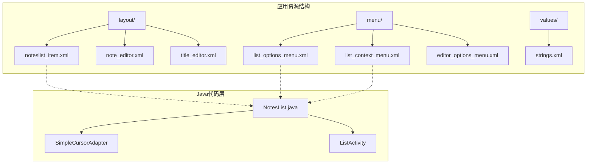
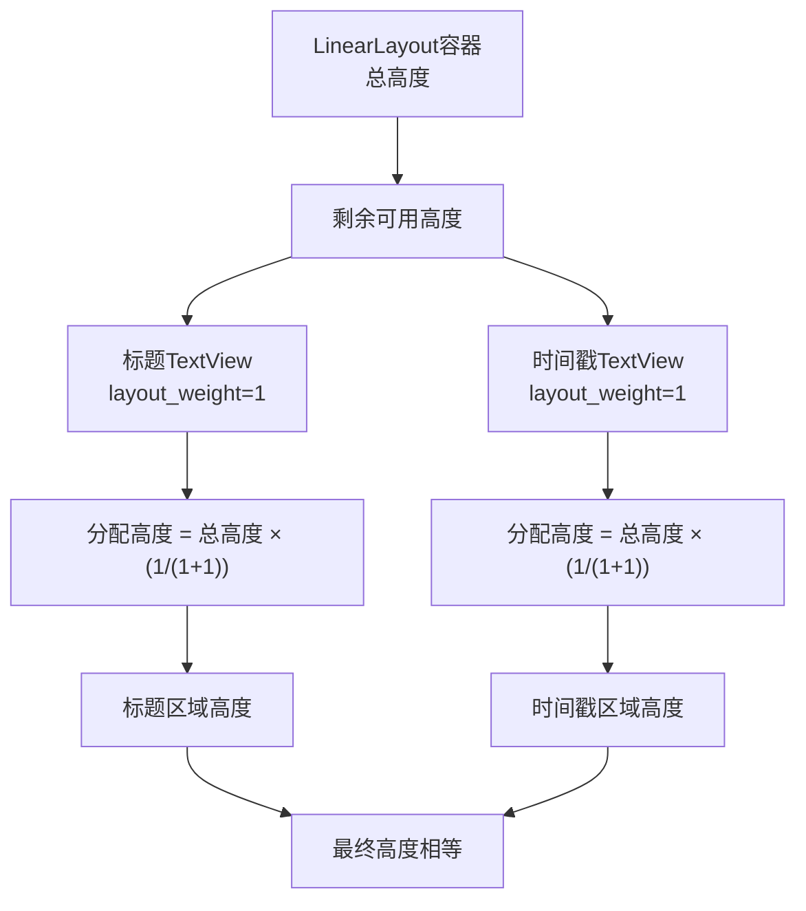
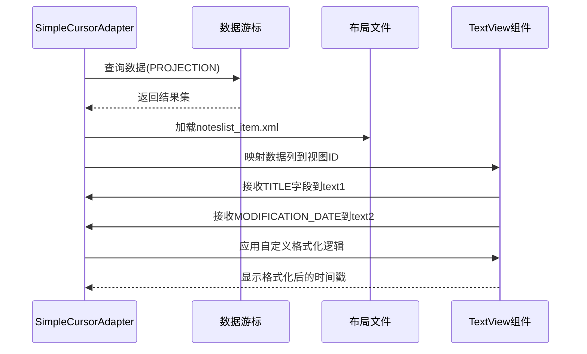

# 笔记列表项布局设计与实现深度解析

<cite>
**本文档引用的文件**
- [noteslist_item.xml](file://app/src/main/res/layout/noteslist_item.xml)
- [NotesList.java](file://app/src/main/java/com/example/android/notepad/NotesList.java)
- [strings.xml](file://app/src/main/res/values/strings.xml)
- [list_options_menu.xml](file://app/src/main/res/menu/list_options_menu.xml)
- [list_context_menu.xml](file://app/src/main/res/menu/list_context_menu.xml)
</cite>

## 目录
1. [引言](#引言)
2. [项目结构概览](#项目结构概览)
3. [LinearLayout容器架构分析](#linearLayout容器架构分析)
4. [TextView组件职责划分](#textView组件职责划分)
5. [布局权重机制详解](#布局权重机制详解)
6. [样式系统与视觉层次](#样式系统与视觉层次)
7. [数据绑定与适配器逻辑](#数据绑定与适配器逻辑)
8. [性能优化策略](#性能优化策略)
9. [高分辨率屏幕适配](#高分辨率屏幕适配)
10. [最佳实践总结](#最佳实践总结)

## 引言

本文档深入解析Android NotePad应用中的笔记列表项布局设计，重点分析noteslist_item.xml布局文件的架构实现。该布局采用LinearLayout容器作为根元素，通过精心设计的垂直排版结构，为笔记列表提供了简洁而高效的用户界面。布局文件巧妙地利用了Android的布局权重系统，实现了动态空间分配，并通过样式系统构建了清晰的视觉层次。

## 项目结构概览

NotePad应用采用了经典的MVC架构模式，其中布局文件位于`res/layout`目录下，负责定义用户界面的视觉结构。noteslist_item.xml作为列表项的核心布局文件，与其他资源文件协同工作，形成了完整的笔记管理界面体系。

**图表来源**
- [noteslist_item.xml](file://app/src/main/res/layout/noteslist_item.xml#L17-L40)
- [NotesList.java](file://app/src/main/java/com/example/android/notepad/NotesList.java#L56-L167)

**章节来源**
- [noteslist_item.xml](file://app/src/main/res/layout/noteslist_item.xml#L1-L40)
- [NotesList.java](file://app/src/main/java/com/example/android/notepad/NotesList.java#L1-L50)

## LinearLayout容器架构分析

### 整体高度定义

LinearLayout容器通过`android:layout_height="?android:attr/listPreferredItemHeight"`属性定义了列表项的整体高度。这种设计充分利用了Android系统提供的标准高度规范，确保在不同设备上都能呈现一致的用户体验。`?android:attr/listPreferredItemHeight`是一个系统属性，它根据设备的屏幕密度和用户设置的字体大小自动调整，保证了良好的可访问性。

### 垂直排版结构

容器采用`android:orientation="vertical"`设置垂直方向的子视图排列方式。垂直布局的优势在于能够清晰地分离不同的信息层级：标题信息占据主要空间，时间戳信息作为辅助信息位于下方。这种排版方式符合用户的阅读习惯，使重要信息优先呈现。

### 内边距配置

左侧内边距`android:paddingLeft="5dip"`的设置体现了对视觉平衡的考虑。5dip的间距既不会显得过于拥挤，又能有效区分列表项之间的边界，同时保持了整体的紧凑感。

**章节来源**
- [noteslist_item.xml](file://app/src/main/res/layout/noteslist_item.xml#L17-L21)

## TextView组件职责划分

### 标题文本组件（@android:id/text1）

标题文本组件承担着展示笔记核心内容的重要职责。其关键属性配置如下：

- **ID标识**：使用`@android:id/text1`作为标准标识符，这是Android系统为列表项标题预留的标准ID
- **宽度配置**：`android:layout_width="match_parent"`确保标题区域占据可用的全部水平空间
- **高度处理**：`android:layout_height="0dp"`配合权重系统实现动态高度分配
- **权重设置**：`android:layout_weight="1"`与另一个TextView共享垂直空间
- **样式应用**：`android:textAppearance="?android:attr/textAppearanceLarge"`赋予大号字体样式
- **对齐方式**：`android:gravity="center_vertical"`确保文本在垂直方向居中显示
- **单行限制**：`android:singleLine="true"`防止标题过长时换行，保持界面整洁

### 时间戳文本组件（@android:id/text2）

时间戳组件作为辅助信息，承担着显示笔记修改时间的职责：

- **ID标识**：使用`@android:id/text2`作为标准标识符
- **宽度配置**：同样采用`match_parent`以获得最大可用空间
- **高度处理**：`android:layout_height="0dp"`参与权重分配
- **权重设置**：`android:layout_weight="1"`与标题组件平分垂直空间
- **样式应用**：`android:textAppearance="?android:attr/textAppearanceSmall"`使用较小的字体样式
- **颜色处理**：`android:textColor="?android:attr/textColorSecondary"`赋予次要信息的颜色弱化效果
- **对齐方式**：`android:gravity="center_vertical"`保持垂直居中
- **单行限制**：`android:singleLine="true"`确保格式整齐

**章节来源**
- [noteslist_item.xml](file://app/src/main/res/layout/noteslist_item.xml#L23-L38)

## 布局权重机制详解

### 权重分配原理

布局权重系统是Android线性布局中实现动态空间分配的核心机制。在本布局中，两个TextView组件都设置了`layout_height="0dp"`配合`layout_weight="1"`的组合，这种配置遵循以下原理：

**图表来源**
- [noteslist_item.xml](file://app/src/main/res/layout/noteslist_item.xml#L25-L34)

### 空间均等分配机制

权重值相等（均为1）确保了两个TextView组件在垂直方向上获得相同的空间份额。这种设计的优势包括：

1. **视觉平衡**：两个信息层级在视觉上具有相同的权重
2. **响应式设计**：无论容器高度如何变化，两者的相对比例始终保持不变
3. **可维护性**：单一权重值便于理解和维护
4. **扩展性**：如果需要调整比例，只需修改权重值即可

### 高度计算公式

对于任意LinearLayout容器，每个子视图的高度计算遵循以下公式：
- 子视图高度 = 容器总高度 × (子视图权重 / 所有子视图权重之和)

在本例中，由于两个TextView的权重都是1，因此它们各自获得50%的垂直空间。

**章节来源**
- [noteslist_item.xml](file://app/src/main/res/layout/noteslist_item.xml#L25-L34)

## 样式系统与视觉层次

### textAppearanceLarge的作用

`textAppearance="?android:attr/textAppearanceLarge"`样式的应用产生了以下视觉效果：

- **字体大小**：提供比默认文本稍大的字体尺寸，突出标题的重要性
- **字体粗细**：通常采用较粗的字体重量，增强视觉冲击力
- **行高调整**：适当的行高设置，提高可读性
- **系统一致性**：遵循Android系统的字体规范，确保界面风格统一

### textAppearanceSmall的弱化效果

`textAppearance="?android:attr/textAppearanceSmall"`样式则实现了辅助信息的弱化处理：

- **字体缩小**：使用较小的字体尺寸，降低视觉权重
- **颜色变淡**：配合`textColorSecondary`属性，进一步弱化视觉焦点
- **信息层级**：明确区分主次信息，引导用户关注重要内容
- **空间节省**：较小的字体占用更少的垂直空间，提高列表密度

### textColorSecondary的辅助信息处理

`textColor="?android:attr/textColorSecondary"`属性的应用体现了现代UI设计中的信息层次原则：

- **颜色对比**：使用较浅的颜色，减少视觉干扰
- **可读性平衡**：在弱化的同时保持足够的可读性
- **系统集成**：与系统的主题色彩协调一致
- **无障碍设计**：确保色盲用户也能识别信息类型

**章节来源**
- [noteslist_item.xml](file://app/src/main/res/layout/noteslist_item.xml#L27-L36)

## 数据绑定与适配器逻辑

### SimpleCursorAdapter的配置

NotesList类中的SimpleCursorAdapter配置展示了完整的数据绑定流程：

**图表来源**
- [NotesList.java](file://app/src/main/java/com/example/android/notepad/NotesList.java#L136-L163)

### 字段映射关系

数据绑定过程中的关键映射关系：

| 游标列索引 | 列名 | 视图ID | 组件功能 |
|------------|------|--------|----------|
| 0 | _ID | 无直接映射 | 用于唯一标识，不显示 |
| 1 | COLUMN_NAME_TITLE | android.R.id.text1 | 主要标题信息 |
| 2 | COLUMN_NAME_MODIFICATION_DATE | android.R.id.text2 | 修改时间戳 |

### 自定义文本设置逻辑

SimpleCursorAdapter的匿名子类重写了`setViewText`方法，实现了特殊的数据处理逻辑：

- **标题处理**：直接使用数据库中的原始标题文本
- **时间戳处理**：将Unix时间戳转换为人类可读的日期格式
- **错误处理**：对无效的时间戳进行异常捕获和优雅降级

**章节来源**
- [NotesList.java](file://app/src/main/java/com/example/android/notepad/NotesList.java#L64-L73)
- [NotesList.java](file://app/src/main/java/com/example/android/notepad/NotesList.java#L129-L134)
- [NotesList.java](file://app/src/main/java/com/example/android/notepad/NotesList.java#L146-L162)

## 性能优化策略

### 布局扁平化设计

noteslist_item.xml采用了扁平化的布局结构，避免了嵌套的复杂视图层次：

- **单一容器**：仅使用一个LinearLayout作为根容器
- **直接子视图**：两个TextView直接作为LinearLayout的子元素
- **减少测量开销**：扁平结构降低了布局测量和绘制的计算复杂度

### 权重系统优化

权重系统的合理使用带来了显著的性能优势：

- **动态计算**：Android系统会预先计算权重分配，减少运行时开销
- **硬件加速**：权重计算可以在GPU层面优化
- **内存效率**：避免了复杂的布局参数计算

### 单行文本优化

`android:singleLine="true"`属性的应用提供了多方面的性能收益：

- **测量简化**：减少了文本测量的复杂度
- **渲染优化**：避免了多行文本的布局计算
- **内存节省**：减少了文本缓存的需求

**章节来源**
- [noteslist_item.xml](file://app/src/main/res/layout/noteslist_item.xml#L29-L38)

## 高分辨率屏幕适配

### 密度无关像素（DIP）使用

布局中广泛使用了`dip`单位，这是Android推荐的密度无关单位：

- **统一基准**：1dip在任何密度下都代表相同的物理尺寸
- **自动缩放**：系统自动根据屏幕密度调整实际像素值
- **设计一致性**：确保在不同设备上呈现一致的视觉效果

### 系统属性集成

通过使用系统属性如`?android:attr/listPreferredItemHeight`，布局获得了天然的高分辨率适配能力：

- **自动调整**：系统根据设备规格自动调整高度值
- **主题兼容**：与各种系统主题保持一致
- **无障碍支持**：支持用户的字体大小偏好设置

### 响应式设计原则

布局设计遵循了响应式设计的基本原则：

- **弹性空间**：权重系统确保空间分配的灵活性
- **比例保持**：标题和时间戳的比例在任何尺寸下都保持不变
- **内容优先**：重要信息（标题）获得更多的垂直空间

**章节来源**
- [noteslist_item.xml](file://app/src/main/res/layout/noteslist_item.xml#L18-L21)

## 最佳实践总结

### 布局设计原则

基于noteslist_item.xml的分析，我们可以总结出以下布局设计的最佳实践：

1. **系统集成**：优先使用系统属性和标准ID，确保与平台的一致性
2. **权重平衡**：合理使用布局权重实现动态空间分配
3. **样式层次**：通过不同的样式创建清晰的信息层次
4. **性能优先**：选择扁平化结构和优化的属性配置

### 开发建议

针对类似场景的开发建议：

- **数据绑定**：使用适配器模式实现数据与视图的解耦
- **格式化处理**：在适配器中处理特殊数据格式
- **错误处理**：对异常数据进行优雅的降级处理
- **可访问性**：考虑不同用户群体的需求，特别是无障碍功能

### 维护性考虑

布局文件的维护性体现在：

- **语义化命名**：使用有意义的属性名称
- **注释说明**：为复杂的布局逻辑添加必要的注释
- **模块化设计**：将相关功能组织在独立的布局文件中
- **版本兼容**：考虑向后兼容性和新版本特性

这个笔记列表项布局设计充分体现了Android开发中的最佳实践，通过合理的架构设计、高效的性能优化和良好的用户体验考虑，为开发者提供了优秀的参考范例。