# 笔记编辑界面布局深度解析

<cite>
**本文档中引用的文件**
- [note_editor.xml](file://app/src/main/res/layout/note_editor.xml)
- [NoteEditor.java](file://app/src/main/java/com/example/android/notepad/NoteEditor.java)
- [AndroidManifest.xml](file://app/src/main/AndroidManifest.xml)
- [title_editor.xml](file://app/src/main/res/layout/title_editor.xml)
</cite>

## 目录
1. [引言](#引言)
2. [项目结构概览](#项目结构概览)
3. [自定义LinedEditText组件详解](#自定义linededittext组件详解)
4. [布局参数深度分析](#布局参数深度分析)
5. [Activity生命周期集成](#activity生命周期集成)
6. [软键盘窗口调整策略](#软键盘窗口调整策略)
7. [视觉效果与用户体验](#视觉效果与用户体验)
8. [扩展方案与最佳实践](#扩展方案与最佳实践)
9. [总结](#总结)

## 引言

本文档深入解析Android笔记应用中`note_editor.xml`布局文件的设计理念和技术实现，重点探讨通过`<view>`标签引用`com.example.android.notepad.NoteEditor$LinedEditText`类的创新设计模式。该布局采用全屏编辑体验设计，通过精心配置的属性组合实现了专业级的文本编辑界面。

## 项目结构概览

该项目采用标准的Android项目结构，核心文件组织如下：

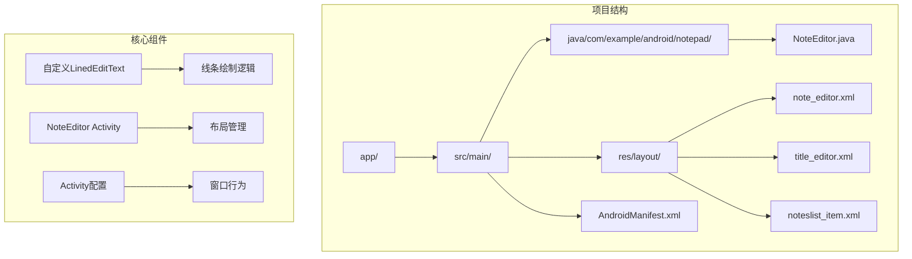

**图表来源**
- [NoteEditor.java](file://app/src/main/java/com/example/android/notepad/NoteEditor.java#L83-L134)
- [note_editor.xml](file://app/src/main/res/layout/note_editor.xml#L16-L28)

**章节来源**
- [NoteEditor.java](file://app/src/main/java/com/example/android/notepad/NoteEditor.java#L1-L50)
- [note_editor.xml](file://app/src/main/res/layout/note_editor.xml#L1-L29)

## 自定义LinedEditText组件详解

### 类声明与继承关系

`LinedEditText`是`NoteEditor`类的静态内部类，继承自Android的`EditText`组件。这种设计模式具有以下优势：

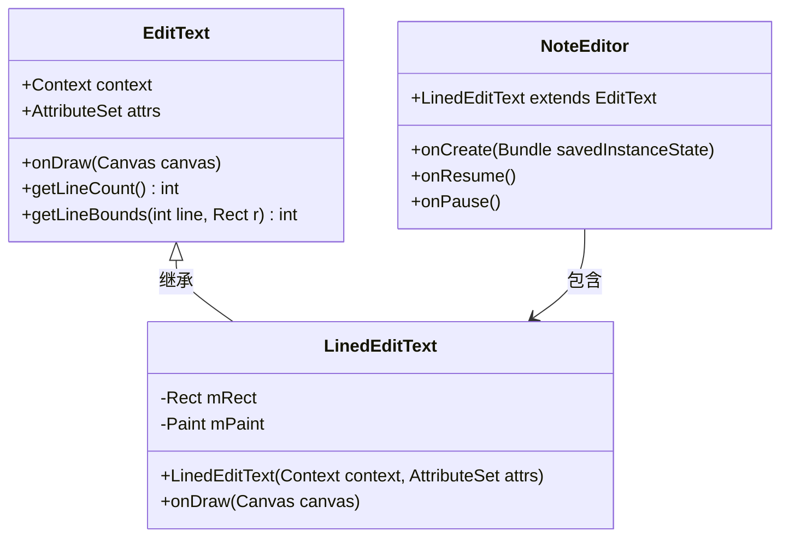

**图表来源**
- [NoteEditor.java](file://app/src/main/java/com/example/android/notepad/NoteEditor.java#L86-L134)

### 构造函数初始化机制

`LinedEditText`构造函数负责初始化绘图所需的资源：

| 初始化步骤 | 功能描述 | 实现细节 |
|------------|----------|----------|
| 创建Rect对象 | 定义绘制区域边界 | `mRect = new Rect()` |
| 创建Paint对象 | 设置画笔样式和颜色 | `mPaint.setStyle(Paint.Style.STROKE)` |
| 配置画笔属性 | 蓝色线条，半透明效果 | `mPaint.setColor(0x800000FF)` |

### 核心绘制逻辑

`onDraw()`方法实现了专业的线条绘制功能：

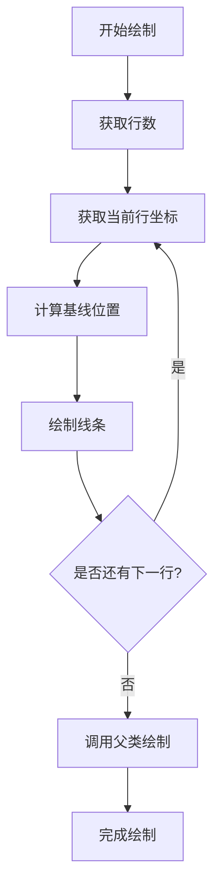

**图表来源**
- [NoteEditor.java](file://app/src/main/java/com/example/android/notepad/NoteEditor.java#L105-L133)

**章节来源**
- [NoteEditor.java](file://app/src/main/java/com/example/android/notepad/NoteEditor.java#L86-L134)

## 布局参数深度分析

### match_parent宽高设置

布局采用`android:layout_width="match_parent"`和`android:layout_height="match_parent"`配置，实现全屏编辑体验：

| 属性配置 | 设计目的 | 技术优势 |
|----------|----------|----------|
| match_parent | 占据整个屏幕空间 | 提供最大可用编辑区域 |
| 全屏覆盖 | 减少视觉干扰 | 专注编辑体验 |
| 系统适配 | 支持不同屏幕尺寸 | 响应式布局 |

### background透明配置

`android:background="@android:color/transparent"`的设计考量：

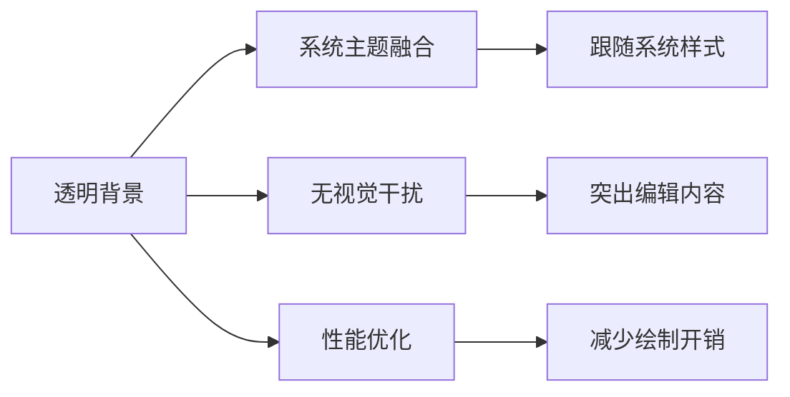

### padding='5dp'内容边距

5dp的内边距提供了恰到好处的内容保护：

| 边距类型 | 数值大小 | 作用效果 |
|----------|----------|----------|
| 内边距 | 5dp | 防止文字紧贴边缘 |
| 视觉平衡 | 适中尺寸 | 不影响阅读体验 |
| 响应式设计 | dp单位 | 适配不同密度屏幕 |

### scrollbars='vertical'滚动条行为

垂直滚动条配置实现了流畅的长文本浏览体验：

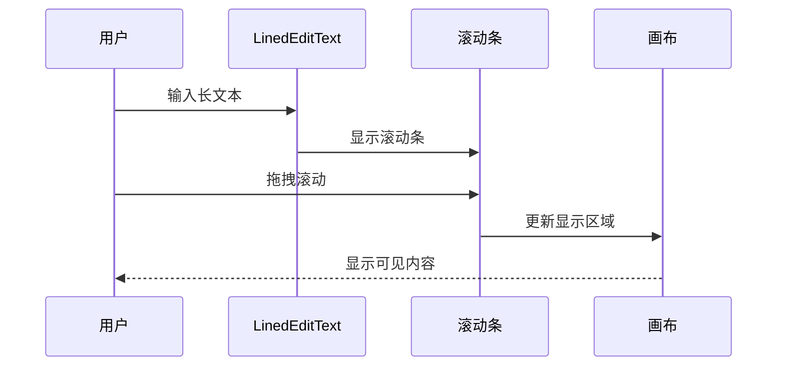

**图表来源**
- [note_editor.xml](file://app/src/main/res/layout/note_editor.xml#L22-L23)

### fadingEdge='vertical'边缘渐变

垂直边缘渐变提供了视觉引导效果：

| 渐变特性 | 实现效果 | 用户体验 |
|----------|----------|----------|
| 渐变方向 | 垂直渐变 | 引导视线移动 |
| 透明度变化 | 自然过渡 | 平滑视觉效果 |
| 性能考虑 | 轻量级实现 | 不影响渲染性能 |

### gravity='top'文本对齐

顶部对齐确保文本从页面顶部开始排列：

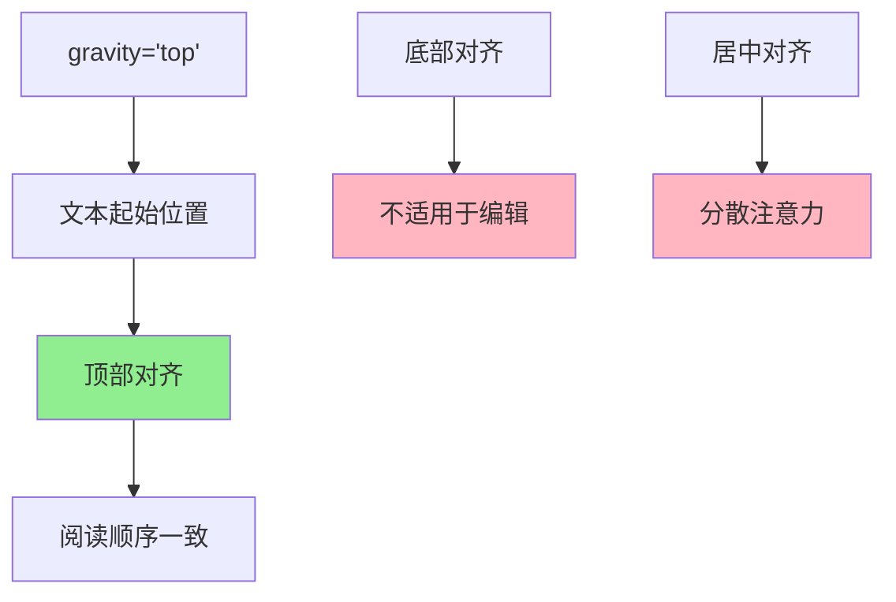

### textSize='22sp'字体大小

22sp的字体大小经过精心选择：

| 字体大小 | 设计考量 | 适用场景 |
|----------|----------|----------|
| 22sp | 可读性最佳 | 移动设备阅读 |
| 相对单位 | 适应系统设置 | 用户个性化需求 |
| 标准尺寸 | 符合设计规范 | 一致性体验 |

### capitalize='sentences'输入优化

句子首字母大写功能提升了输入效率：

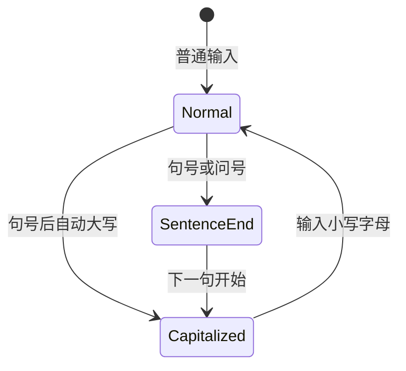

**章节来源**
- [note_editor.xml](file://app/src/main/res/layout/note_editor.xml#L16-L28)

## Activity生命周期集成

### 布局加载与组件绑定

`NoteEditor` Activity通过以下流程实现布局与组件的绑定：

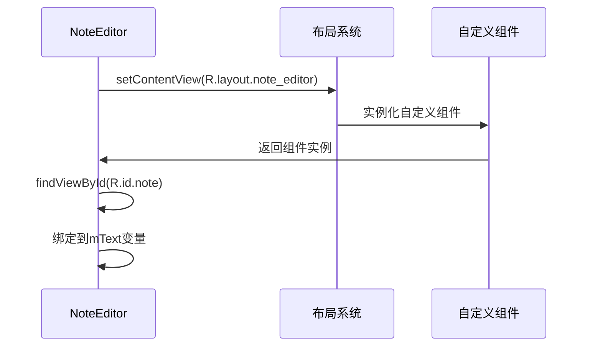

**图表来源**
- [NoteEditor.java](file://app/src/main/java/com/example/android/notepad/NoteEditor.java#L227-L232)

### 数据持久化机制

Activity实现了完整的数据保存和恢复机制：

| 生命周期阶段 | 处理任务 | 实现方式 |
|--------------|----------|----------|
| onCreate | 初始化数据状态 | `onSaveInstanceState()` |
| onResume | 恢复编辑状态 | `setTextKeepState()` |
| onPause | 保存编辑进度 | 自动保存机制 |
| onDestroy | 清理资源 | 关闭游标和连接 |

**章节来源**
- [NoteEditor.java](file://app/src/main/java/com/example/android/notepad/NoteEditor.java#L227-L323)

## 软键盘窗口调整策略

### Activity配置分析

`NoteEditor` Activity的窗口配置体现了对软键盘的深度理解：

```mermaid
graph TB
A[Activity配置] --> B[windowSoftInputMode]
A --> C[configChanges]
A --> D[screenOrientation]
B --> E[stateVisible]
C --> F[keyboardHidden|orientation]
D --> G[sensor]
E --> H[软键盘始终可见]
F --> I[避免配置变更重建]
G --> J[支持自动旋转]
```

**图表来源**
- [AndroidManifest.xml](file://app/src/main/AndroidManifest.xml#L54-L56)

### 窗口行为优化

软键盘弹出时的窗口调整策略：

| 配置项 | 值 | 效果描述 |
|--------|-----|----------|
| windowSoftInputMode | stateVisible | 软键盘始终可见 |
| configChanges | keyboardHidden\|orientation | 避免重建Activity |
| screenOrientation | sensor | 支持自动旋转 |

### 状态保持机制

Activity实现了智能的状态保持：

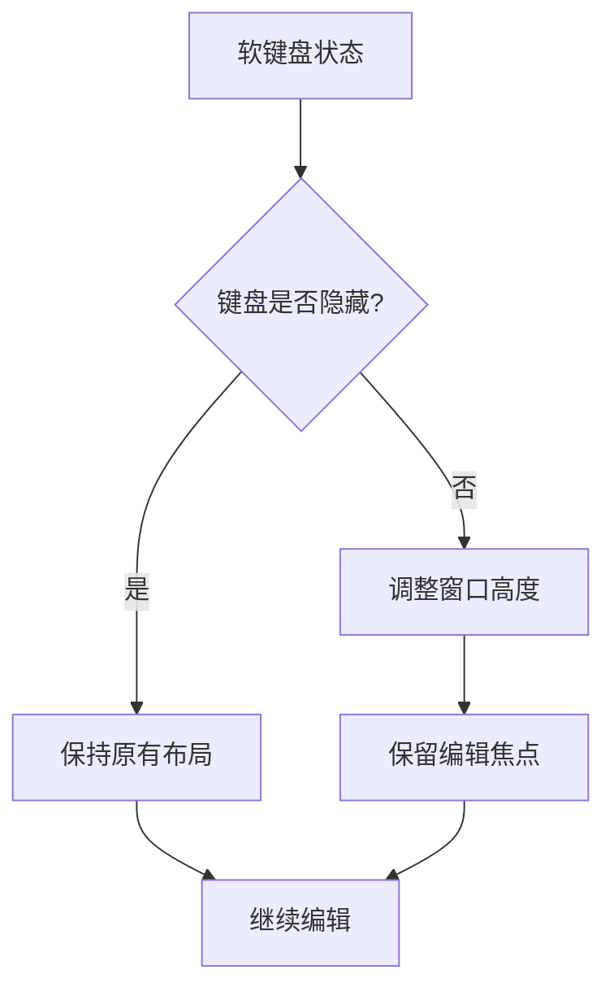

**章节来源**
- [AndroidManifest.xml](file://app/src/main/AndroidManifest.xml#L54-L56)

## 视觉效果与用户体验

### 线条绘制的专业性

`LinedEditText`的线条绘制技术展现了专业级的视觉效果：

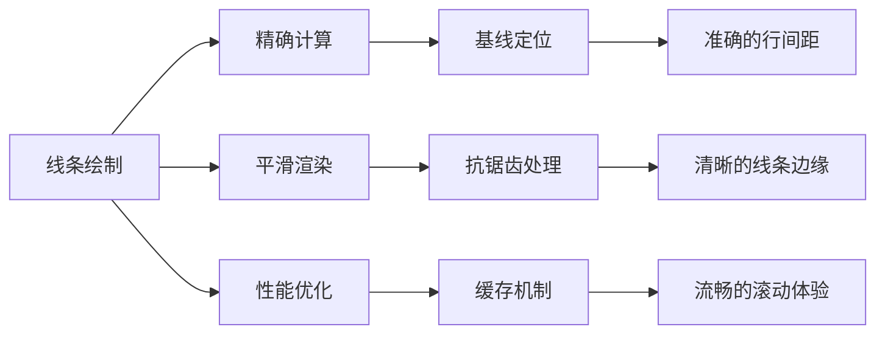

### 主题协同效果

透明背景与系统主题的完美融合：

| 主题元素 | 协同效果 | 设计原则 |
|----------|----------|----------|
| 系统主题 | 无缝集成 | 保持一致性 |
| 应用主题 | 品牌识别 | 突出特色 |
| 用户偏好 | 个性化体验 | 尊重用户选择 |

### 视觉层次构建

通过多种视觉元素构建清晰的阅读层次：

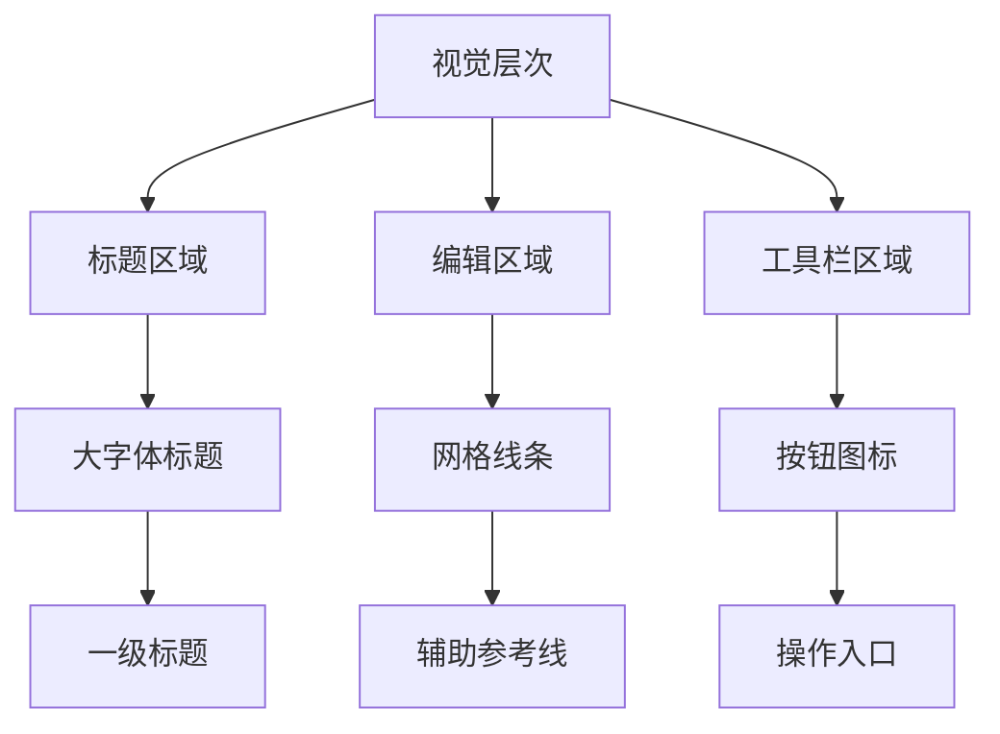

**章节来源**
- [NoteEditor.java](file://app/src/main/java/com/example/android/notepad/NoteEditor.java#L105-L133)

## 扩展方案与最佳实践

### 复杂文本输入场景的扩展

针对更复杂的文本编辑需求，可以考虑以下扩展方案：

| 扩展功能 | 实现方案 | 技术要点 |
|----------|----------|----------|
| 语法高亮 | 自定义绘制层 | 多层Canvas叠加 |
| 占位符提示 | 文本监听器 | TextWatcher接口 |
| 搜索高亮 | 正则表达式匹配 | 高效算法实现 |
| 自动完成功能 | 异步数据源 | AsyncTask或RxJava |

### 性能优化策略

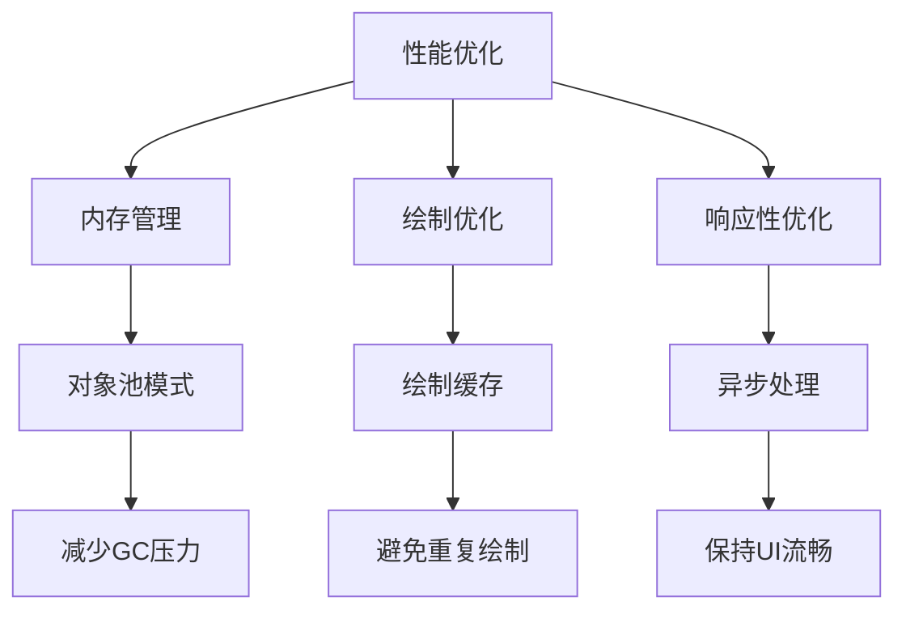

### 可访问性增强

为提高应用的可访问性，建议添加以下功能：

| 可访问性功能 | 实现方式 | 用户价值 |
|--------------|----------|----------|
| 屏幕阅读器支持 | ContentDescription | 视觉障碍用户导航 |
| 高对比度模式 | 主题适配 | 视力不佳用户使用 |
| 字体大小调整 | 系统设置联动 | 个性化阅读体验 |
| 键盘快捷键 | KeyEvent处理 | 高级用户效率提升 |

### 跨平台兼容性

为了确保在不同Android版本上的兼容性：

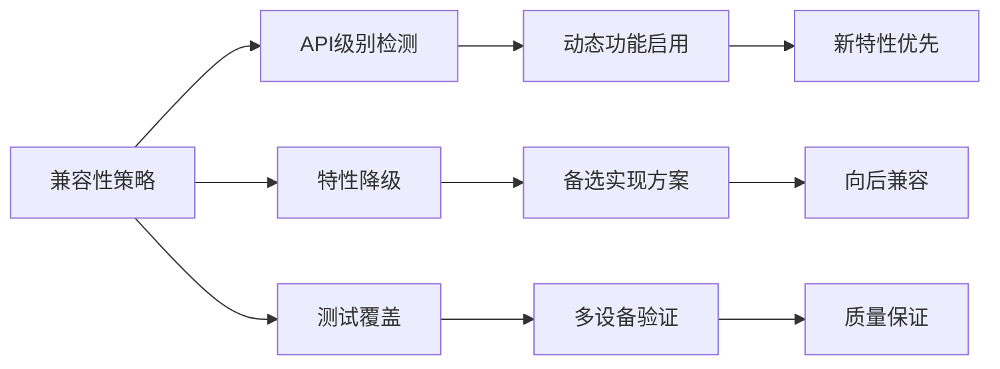

## 总结

`note_editor.xml`布局文件通过巧妙的设计和精心的参数配置，实现了一个专业级的文本编辑界面。该设计的核心优势包括：

1. **技术创新**：通过自定义`LinedEditText`类实现了独特的线条绘制效果
2. **用户体验**：全屏编辑、智能软键盘处理、直观的视觉层次
3. **技术实现**：合理的布局参数、完善的生命周期管理、优秀的性能表现
4. **扩展潜力**：模块化设计为功能扩展提供了良好的基础

这种设计理念不仅适用于简单的文本编辑场景，更为复杂的文本处理应用提供了宝贵的参考价值。开发者在实现类似功能时，应当充分考虑用户体验、性能优化和可维护性等多方面因素，以创造出真正优秀的移动应用界面。