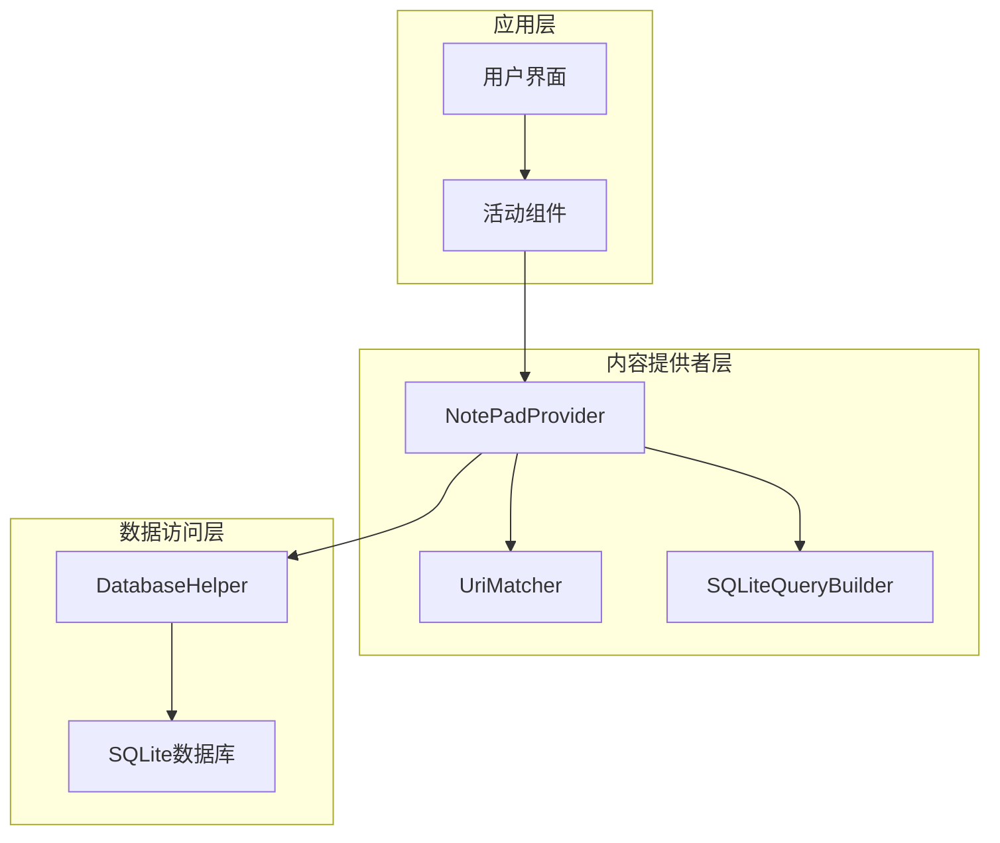
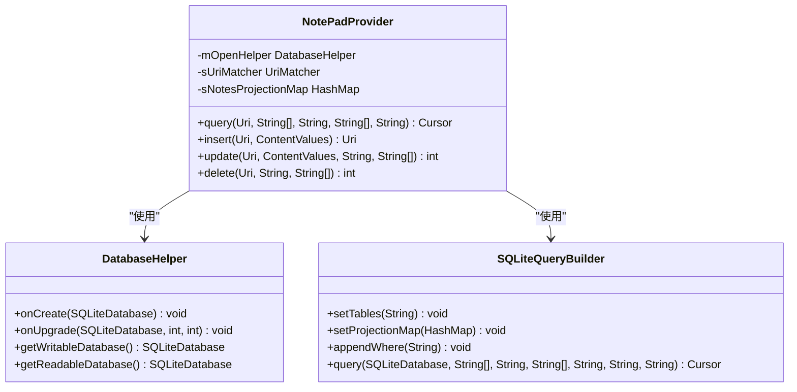
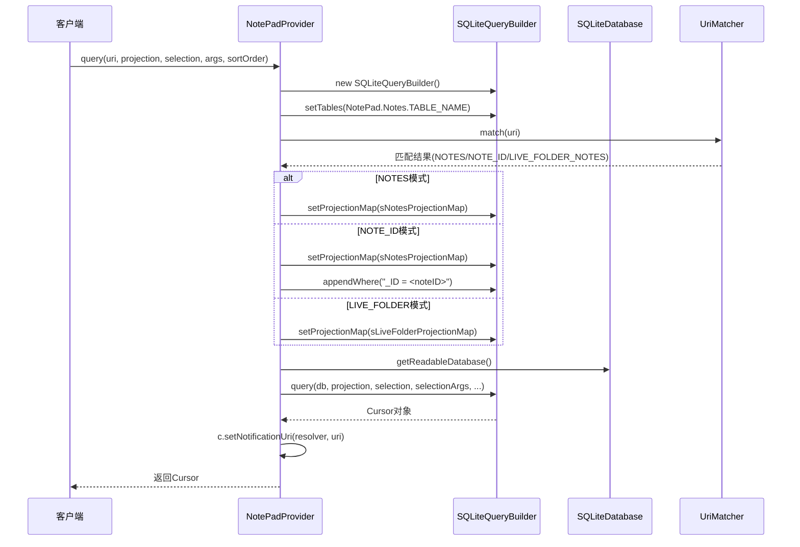
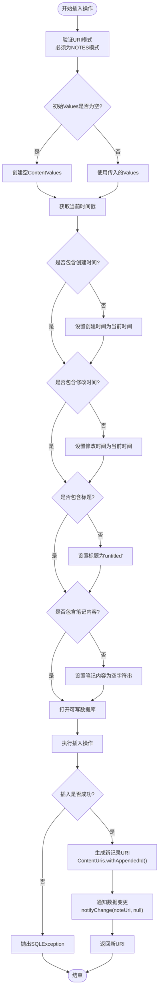
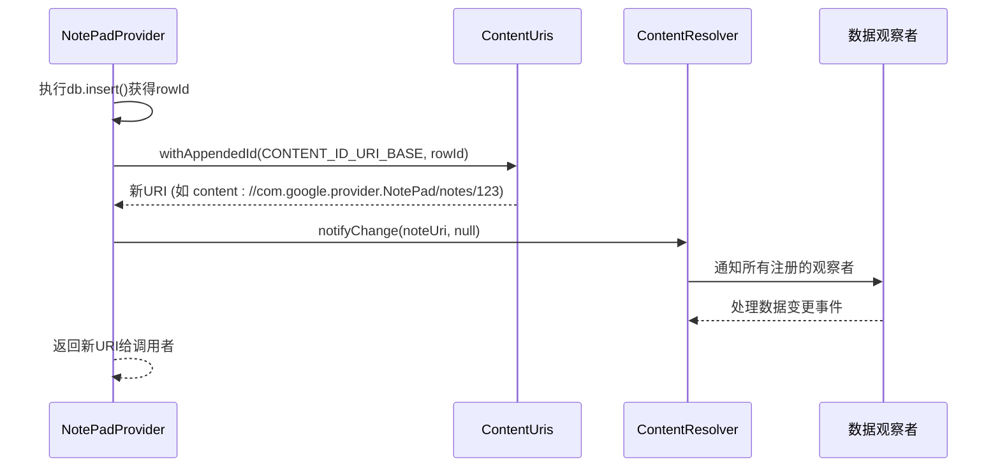
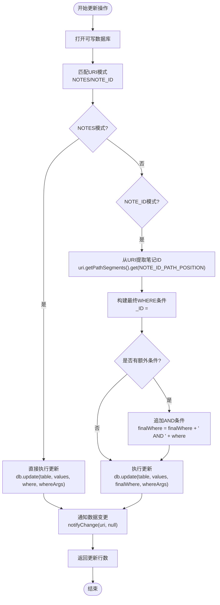
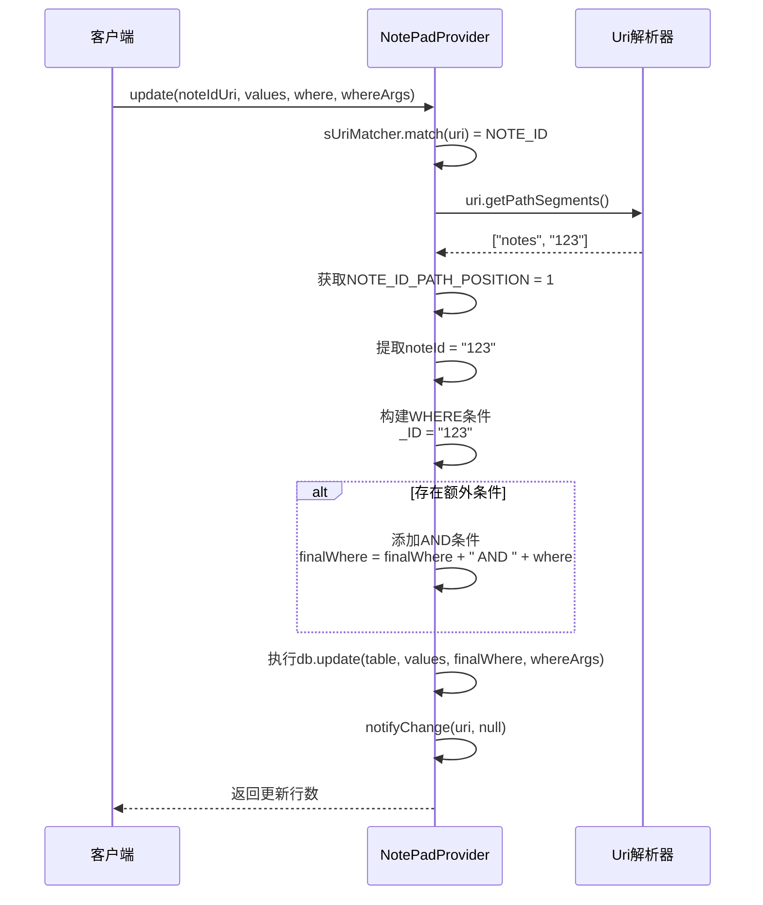
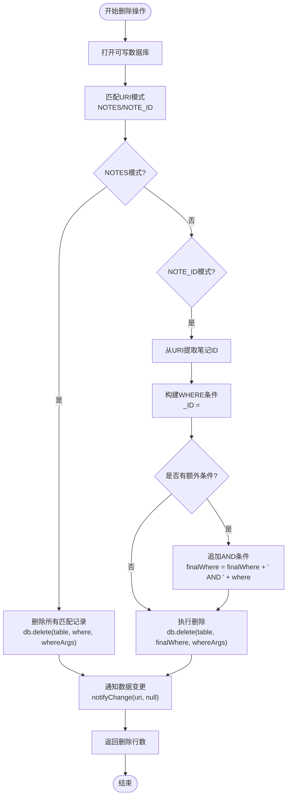
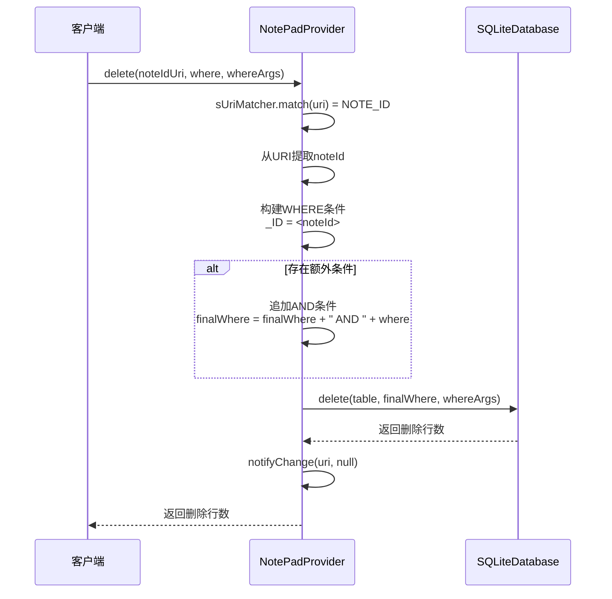
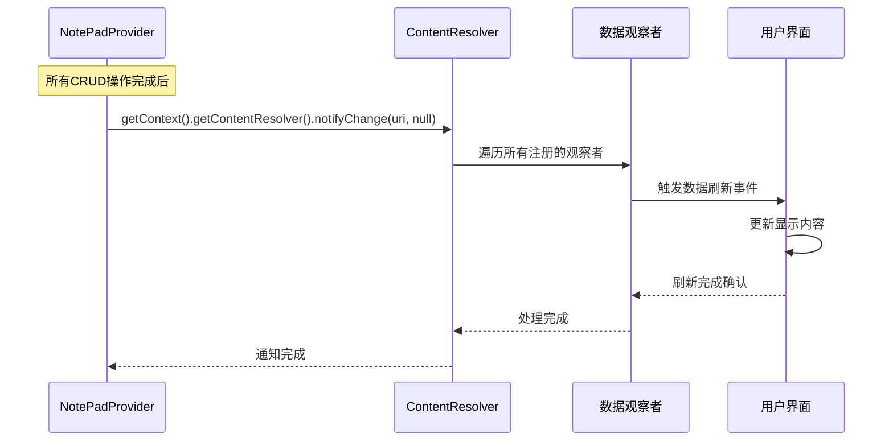

# NotePadProvider CRUD操作实现

<cite>
**本文档中引用的文件**
- [NotePadProvider.java](file://app/src/main/java/com/example/android/notepad/NotePadProvider.java)
- [NotePad.java](file://app/src/main/java/com/example/android/notepad/NotePad.java)
- [NotePadProviderTest.java](file://app/src/androidTest/java/com/example/android/notepad/NotePadProviderTest.java)
</cite>

## 目录
1. [简介](#简介)
2. [项目结构概览](#项目结构概览)
3. [核心数据操作方法](#核心数据操作方法)
4. [查询操作详解](#查询操作详解)
5. [插入操作详解](#插入操作详解)
6. [更新操作详解](#更新操作详解)
7. [删除操作详解](#删除操作详解)
8. [数据同步机制](#数据同步机制)
9. [性能考虑](#性能考虑)
10. [故障排除指南](#故障排除指南)
11. [总结](#总结)

## 简介

NotePadProvider是Android应用中的核心内容提供者，负责管理笔记数据的CRUD（创建、读取、更新、删除）操作。该提供者实现了SQLite数据库的抽象层，为上层应用提供了标准化的数据访问接口。本文档将深入分析其四大核心数据操作方法的实现原理和最佳实践。

## 项目结构概览

NotePadProvider位于`com.example.android.notepad`包中，采用标准的Android内容提供者架构：

**图表来源**
- [NotePadProvider.java](file://app/src/main/java/com/example/android/notepad/NotePadProvider.java#L54-L109)

**章节来源**
- [NotePadProvider.java](file://app/src/main/java/com/example/android/notepad/NotePadProvider.java#L1-L753)
- [NotePad.java](file://app/src/main/java/com/example/android/notepad/NotePad.java#L1-L155)

## 核心数据操作方法

NotePadProvider实现了四个核心的CRUD操作方法，每个方法都针对特定的数据操作场景进行了优化：

**图表来源**
- [NotePadProvider.java](file://app/src/main/java/com/example/android/notepad/NotePadProvider.java#L179-L223)
- [NotePadProvider.java](file://app/src/main/java/com/example/android/notepad/NotePadProvider.java#L252-L290)

## 查询操作详解

查询操作是NotePadProvider的核心功能之一，通过SQLiteQueryBuilder结合URI匹配结果和投影映射构建安全的SELECT语句。

### SQLiteQueryBuilder的工作原理

SQLiteQueryBuilder作为查询构建器，提供了安全且灵活的SQL查询生成机制：

**图表来源**
- [NotePadProvider.java](file://app/src/main/java/com/example/android/notepad/NotePadProvider.java#L252-L321)

### 投影映射机制

投影映射确保查询的安全性和一致性：

| 映射类型 | 源列名 | 目标列名 | 用途 |
|---------|--------|----------|------|
| 标准笔记 | `_ID` | `_ID` | 唯一标识符 |
| 标准笔记 | `title` | `title` | 笔记标题 |
| 标准笔记 | `note` | `note` | 笔记内容 |
| 标准笔记 | `created` | `created` | 创建时间戳 |
| 标准笔记 | `modified` | `modified` | 修改时间戳 |
| 实时文件夹 | `_ID` | `_ID AS _ID` | 文件夹ID别名 |
| 实时文件夹 | `NAME` | `title AS NAME` | 标题别名 |

### c.setNotificationUri的关键作用

`c.setNotificationUri`方法在查询操作中起到至关重要的作用：

1. **数据变更通知**: 告诉Cursor监听指定URI的数据变化
2. **自动刷新机制**: 当底层数据发生变化时，Cursor能够自动感知并更新
3. **性能优化**: 避免客户端频繁轮询检查数据更新
4. **内存管理**: 在Cursor关闭时自动取消通知注册

**章节来源**
- [NotePadProvider.java](file://app/src/main/java/com/example/android/notepad/NotePadProvider.java#L252-L321)

## 插入操作详解

插入操作负责向数据库添加新的笔记记录，实现了智能的默认值填充逻辑和URI生成机制。

### 默认值填充策略

插入操作采用智能的默认值填充策略，确保每条记录都包含完整的信息：

**图表来源**
- [NotePadProvider.java](file://app/src/main/java/com/example/android/notepad/NotePadProvider.java#L499-L566)

### 默认值填充逻辑详解

| 字段 | 默认值 | 生成时机 | 用途 |
|------|--------|----------|------|
| 创建时间 | 当前时间戳 | 插入前计算 | 记录创建时间 |
| 修改时间 | 当前时间戳 | 插入前计算 | 记录最后修改时间 |
| 标题 | 'untitled' | 使用Resources.getString() | 提供默认标题 |
| 笔记内容 | "" | 空字符串 | 初始化为空内容 |

### 新记录URI生成流程

插入成功后，通过`ContentUris.withAppendedId()`生成新记录的完整URI：

**图表来源**
- [NotePadProvider.java](file://app/src/main/java/com/example/android/notepad/NotePadProvider.java#L557-L562)

**章节来源**
- [NotePadProvider.java](file://app/src/main/java/com/example/android/notepad/NotePadProvider.java#L499-L566)

## 更新操作详解

更新操作根据URI模式动态构建WHERE子句，支持全表批量更新和单条记录精确更新。

### 动态WHERE子句构建

更新操作的核心在于根据不同的URI模式构建相应的WHERE条件：

**图表来源**
- [NotePadProvider.java](file://app/src/main/java/com/example/android/notepad/NotePadProvider.java#L669-L738)

### NOTE_ID场景下的路径参数处理

在NOTE_ID模式下，系统需要从URI中提取具体的笔记ID：

**图表来源**
- [NotePadProvider.java](file://app/src/main/java/com/example/android/notepad/NotePadProvider.java#L695-L724)

### 更新操作的灵活性

更新操作提供了两种工作模式：

1. **全表更新模式**: 当URI匹配NOTES模式时，使用传入的where条件进行批量更新
2. **单条记录更新模式**: 当URI匹配NOTE_ID模式时，自动限制到特定记录

**章节来源**
- [NotePadProvider.java](file://app/src/main/java/com/example/android/notepad/NotePadProvider.java#L669-L738)

## 删除操作详解

删除操作同样根据URI模式动态构建WHERE子句，支持批量删除和单条记录删除。

### 删除操作的双模式设计

删除操作采用了与更新操作相似的双模式设计：

**图表来源**
- [NotePadProvider.java](file://app/src/main/java/com/example/android/notepad/NotePadProvider.java#L583-L645)

### 单条记录删除的精确控制

在NOTE_ID模式下，删除操作确保只影响特定的笔记记录：

**图表来源**
- [NotePadProvider.java](file://app/src/main/java/com/example/android/notepad/NotePadProvider.java#L612-L629)

**章节来源**
- [NotePadProvider.java](file://app/src/main/java/com/example/android/notepad/NotePadProvider.java#L583-L645)

## 数据同步机制

所有CRUD操作都统一通过`notifyChange`方法实现数据同步，确保客户端能够及时感知数据变化。

### notifyChange的统一调用模式

**图表来源**
- [NotePadProvider.java](file://app/src/main/java/com/example/android/notepad/NotePadProvider.java#L561-L562)
- [NotePadProvider.java](file://app/src/main/java/com/example/android/notepad/NotePadProvider.java#L642-L643)
- [NotePadProvider.java](file://app/src/main/java/com/example/android/notepad/NotePadProvider.java#L735-L736)

### 数据同步的最佳实践

1. **及时通知**: 在每次成功的CRUD操作后立即通知
2. **准确URI**: 使用正确的URI模式确保观察者能够正确响应
3. **资源管理**: 自动清理不再需要的通知注册
4. **错误处理**: 在异常情况下确保不遗漏通知

**章节来源**
- [NotePadProvider.java](file://app/src/main/java/com/example/android/notepad/NotePadProvider.java#L561-L562)
- [NotePadProvider.java](file://app/src/main/java/com/example/android/notepad/NotePadProvider.java#L642-L643)
- [NotePadProvider.java](file://app/src/main/java/com/example/android/notepad/NotePadProvider.java#L735-L736)

## 性能考虑

### 数据库连接管理

NotePadProvider采用了合理的数据库连接管理模式：

- **延迟打开**: 只有在实际需要时才打开数据库连接
- **读写分离**: query操作使用只读连接，其他操作使用可写连接
- **连接池**: SQLiteOpenHelper自动管理连接池

### 查询优化策略

1. **投影映射**: 通过投影映射减少不必要的列传输
2. **索引利用**: 数据库表设计考虑了常见查询模式
3. **缓存机制**: Cursor的setNotificationUri提供了缓存友好的设计

### 内存管理

- **及时释放**: Cursor对象在使用完毕后自动释放
- **观察者清理**: 自动清理不再使用的观察者注册
- **资源复用**: DatabaseHelper复用数据库连接

## 故障排除指南

### 常见问题及解决方案

| 问题类型 | 症状 | 可能原因 | 解决方案 |
|---------|------|----------|----------|
| 查询失败 | 返回空Cursor | URI模式不匹配 | 检查URI格式和权限 |
| 插入失败 | 抛出SQLException | 数据库连接问题 | 检查数据库状态和权限 |
| 更新失败 | 返回0行更新 | WHERE条件不匹配 | 验证WHERE条件和数据存在性 |
| 删除失败 | 返回0行删除 | 权限不足或数据不存在 | 检查权限和目标数据 |

### 调试技巧

1. **日志记录**: 在关键操作点添加日志输出
2. **异常捕获**: 合理处理各种异常情况
3. **单元测试**: 使用ProviderTestCase2进行单元测试
4. **性能监控**: 监控数据库操作的执行时间

**章节来源**
- [NotePadProviderTest.java](file://app/src/androidTest/java/com/example/android/notepad/NotePadProviderTest.java#L1-L200)

## 总结

NotePadProvider的CRUD操作实现展现了Android内容提供者的最佳实践：

1. **安全性**: 通过SQLiteQueryBuilder和URI匹配确保SQL注入防护
2. **灵活性**: 支持多种查询模式和更新策略
3. **一致性**: 统一的数据同步机制保证数据一致性
4. **性能**: 合理的数据库连接管理和查询优化
5. **可维护性**: 清晰的代码结构和完善的错误处理

这些设计原则不仅适用于笔记应用，也为其他Android应用的数据访问层设计提供了宝贵的参考。通过深入理解这些实现细节，开发者可以构建更加健壮和高效的数据访问层。