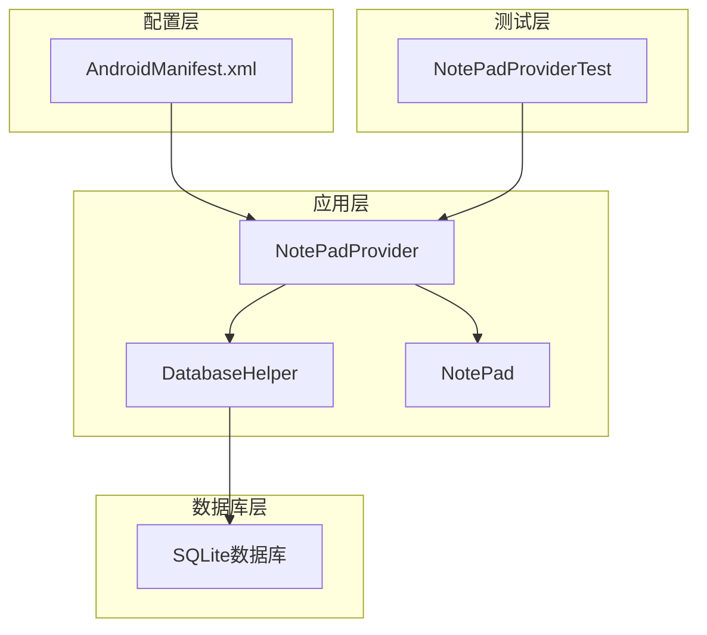
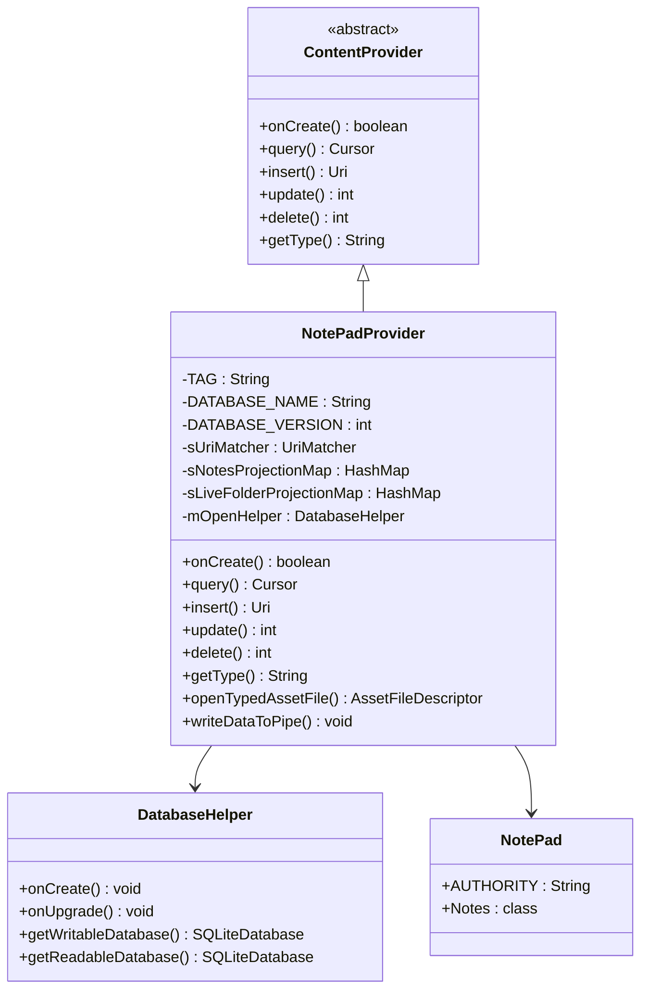
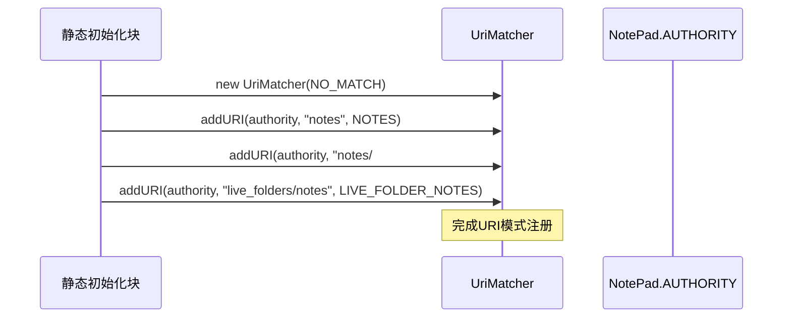
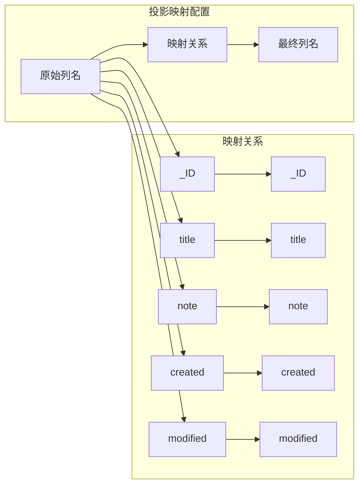
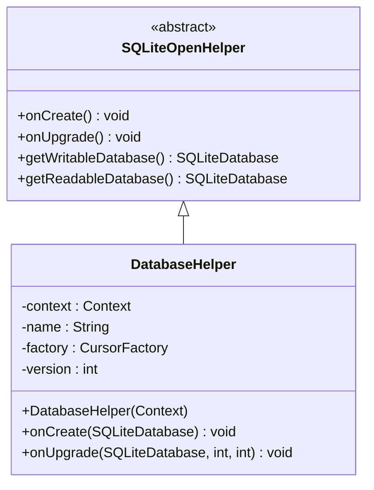
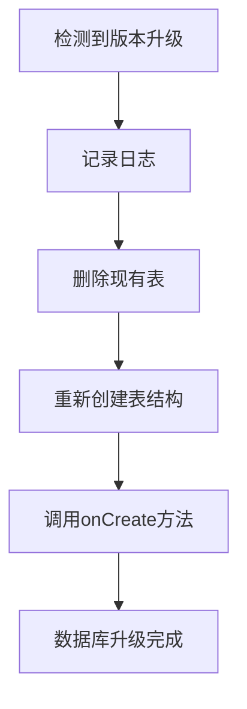
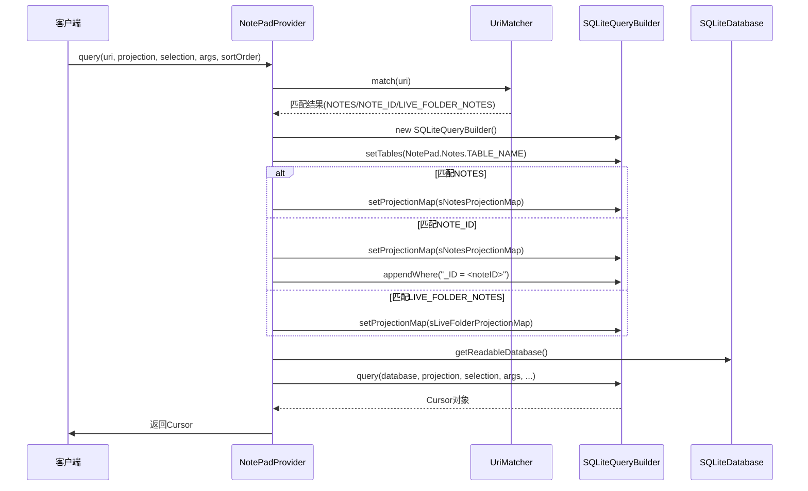
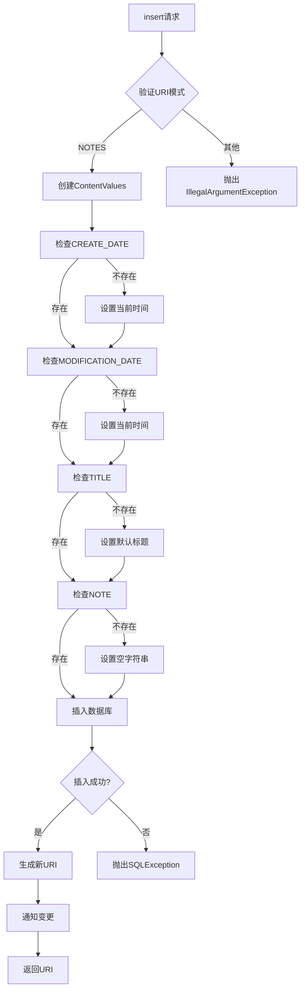
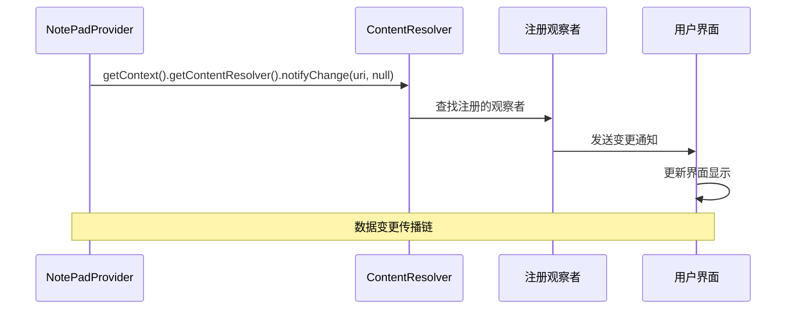
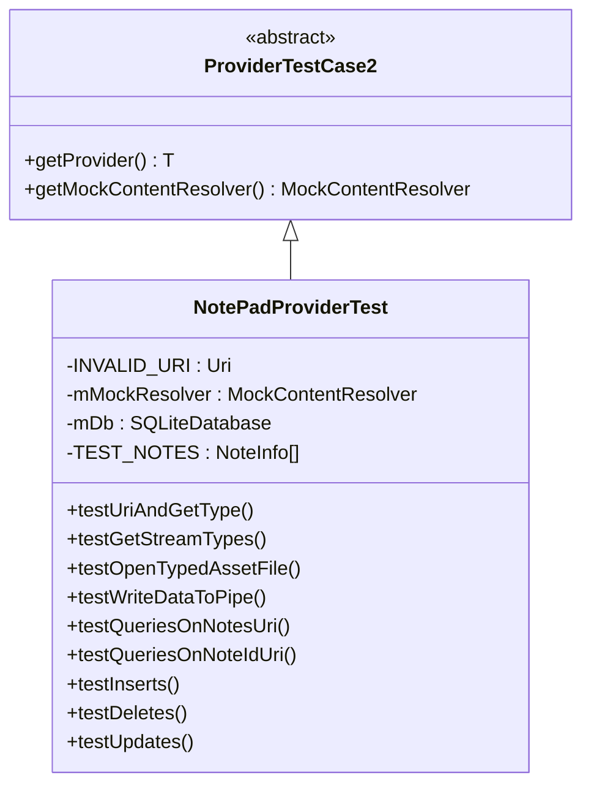

# NotePadProvider内容提供者技术文档

<cite>
**本文档引用的文件**
- [NotePadProvider.java](file://app/src/main/java/com/example/android/notepad/NotePadProvider.java)
- [NotePad.java](file://app/src/main/java/com/example/android/notepad/NotePad.java)
- [DatabaseHelper.java](file://app/src/main/java/com/example/android/notepad/DatabaseHelper.java)
- [AndroidManifest.xml](file://app/src/main/AndroidManifest.xml)
- [NotePadProviderTest.java](file://app/src/androidTest/java/com/example/android/notepad/NotePadProviderTest.java)
</cite>

## 目录
1. [简介](#简介)
2. [项目结构概览](#项目结构概览)
3. [核心组件分析](#核心组件分析)
4. [UriMatcher路由机制](#urimatcher路由机制)
5. [投影映射系统](#投影映射系统)
6. [数据库管理策略](#数据库管理策略)
7. [核心数据操作方法](#核心数据操作方法)
8. [数据变更通知机制](#数据变更通知机制)
9. [测试框架与验证](#测试框架与验证)
10. [性能优化考虑](#性能优化考虑)
11. [故障排除指南](#故障排除指南)
12. [总结](#总结)

## 简介

NotePadProvider是Android平台上的一个内容提供者(Content Provider)，它为笔记应用提供了统一的数据访问接口。该提供者实现了标准的CRUD操作(创建、读取、更新、删除)，并通过UriMatcher实现了智能的请求路由，通过投影映射系统提供了灵活的列选择功能，并通过DatabaseHelper类进行数据库的生命周期管理。

## 项目结构概览

NotePadProvider项目采用标准的Android应用结构，主要包含以下核心文件：



**图表来源**
- [NotePadProvider.java](file://app/src/main/java/com/example/android/notepad/NotePadProvider.java#L1-L50)
- [DatabaseHelper.java](file://app/src/main/java/com/example/android/notepad/DatabaseHelper.java#L1-L30)

**章节来源**
- [NotePadProvider.java](file://app/src/main/java/com/example/android/notepad/NotePadProvider.java#L1-L100)
- [AndroidManifest.xml](file://app/src/main/AndroidManifest.xml#L25-L32)

## 核心组件分析

### NotePadProvider类架构

NotePadProvider继承自ContentProvider并实现了PipeDataWriter接口，提供了完整的数据访问功能：



**图表来源**
- [NotePadProvider.java](file://app/src/main/java/com/example/android/notepad/NotePadProvider.java#L54-L110)
- [DatabaseHelper.java](file://app/src/main/java/com/example/android/notepad/DatabaseHelper.java#L179-L223)

### 数据库常量定义

NotePad类定义了所有数据库相关的常量，包括表名、列名、URI模式等：

| 常量类型 | 名称 | 描述 | 默认值 |
|---------|------|------|--------|
| 表名 | TABLE_NAME | 笔记表名称 | "notes" |
| 列名 | _ID | 主键列 | "note_id" |
| 列名 | COLUMN_NAME_TITLE | 标题列 | "title" |
| 列名 | COLUMN_NAME_NOTE | 内容列 | "note" |
| 列名 | COLUMN_NAME_CREATE_DATE | 创建时间戳 | "created" |
| 列名 | COLUMN_NAME_MODIFICATION_DATE | 修改时间戳 | "modified" |
| 排序 | DEFAULT_SORT_ORDER | 默认排序方式 | "modified DESC" |

**章节来源**
- [NotePad.java](file://app/src/main/java/com/example/android/notepad/NotePad.java#L38-L155)

## UriMatcher路由机制

### UriMatcher工作原理

UriMatcher是NotePadProvider的核心路由组件，通过addURI方法将不同的URI模式映射到相应的操作常量：

```mermaid
flowchart TD
A[客户端请求] --> B[UriMatcher.match(uri)]
B --> C{匹配模式}
C --> |"/notes"| D[NOTES常量: 1]
C --> |"/notes/#"| E[NOTE_ID常量: 2]
C --> |"/live_folders/notes"| F[LIVE_FOLDER_NOTES常量: 3]
C --> |无匹配| G[抛出IllegalArgumentException]
D --> H[执行通用查询]
E --> I[执行单条记录查询]
F --> J[执行Live Folder查询]
```

**图表来源**
- [NotePadProvider.java](file://app/src/main/java/com/example/android/notepad/NotePadProvider.java#L122-L131)

### Uri模式映射表

| URI模式 | 匹配常量 | 功能描述 | 示例URI |
|---------|----------|----------|---------|
| `/notes` | NOTES (1) | 查询所有笔记 | `content://com.google.provider.NotePad/notes` |
| `/notes/#` | NOTE_ID (2) | 查询指定ID的笔记 | `content://com.google.provider.NotePad/notes/123` |
| `/live_folders/notes` | LIVE_FOLDER_NOTES (3) | Live Folder查询 | `content://com.google.provider.NotePad/live_folders/notes` |

### 静态初始化块

UriMatcher在静态初始化块中完成配置：



**图表来源**
- [NotePadProvider.java](file://app/src/main/java/com/example/android/notepad/NotePadProvider.java#L120-L131)

**章节来源**
- [NotePadProvider.java](file://app/src/main/java/com/example/android/notepad/NotePadProvider.java#L114-L132)

## 投影映射系统

### sNotesProjectionMap投影映射

投影映射系统允许客户端选择需要的列，提高查询效率：



**图表来源**
- [NotePadProvider.java](file://app/src/main/java/com/example/android/notepad/NotePadProvider.java#L139-L157)

### sLiveFolderProjectionMap特殊映射

Live Folder使用特殊的投影映射，添加了别名支持：

| 映射前 | 映射后 | 用途 |
|--------|--------|------|
| `_ID` | `notes._ID AS _ID` | 提供Live Folder格式的ID |
| `LiveFolders.NAME` | `notes.title AS NAME` | 将标题映射为Live Folder的名称 |

### setProjectionMap机制

每个查询都会根据URI模式设置相应的投影映射：

```mermaid
flowchart TD
A[查询请求] --> B{sUriMatcher.match(uri)}
B --> |NOTES| C[设置sNotesProjectionMap]
B --> |NOTE_ID| D[设置sNotesProjectionMap]
B --> |LIVE_FOLDER_NOTES| E[设置sLiveFolderProjectionMap]
C --> F[SQLiteQueryBuilder.setProjectionMap]
D --> F
E --> F
F --> G[执行带投影的查询]
```

**图表来源**
- [NotePadProvider.java](file://app/src/main/java/com/example/android/notepad/NotePadProvider.java#L262-L284)

**章节来源**
- [NotePadProvider.java](file://app/src/main/java/com/example/android/notepad/NotePadProvider.java#L137-L172)

## 数据库管理策略

### DatabaseHelper类设计

DatabaseHelper继承自SQLiteOpenHelper，负责数据库的创建和版本升级：



**图表来源**
- [NotePadProvider.java](file://app/src/main/java/com/example/android/notepad/NotePadProvider.java#L179-L223)

### onCreate方法实现

数据库创建时执行的SQL语句：

```sql
CREATE TABLE notes (
    _id INTEGER PRIMARY KEY,
    title TEXT,
    note TEXT,
    created INTEGER,
    modified INTEGER
);
```

### onUpgrade方法策略

当前版本的升级策略相对简单，直接重建数据库：



**图表来源**
- [NotePadProvider.java](file://app/src/main/java/com/example/android/notepad/NotePadProvider.java#L211-L221)

**章节来源**
- [NotePadProvider.java](file://app/src/main/java/com/example/android/notepad/NotePadProvider.java#L179-L223)

## 核心数据操作方法

### query方法数据处理流程

query方法是最重要的查询入口，实现了复杂的路由和投影逻辑：



**图表来源**
- [NotePadProvider.java](file://app/src/main/java/com/example/android/notepad/NotePadProvider.java#L252-L321)

### insert方法默认值填充机制

insert方法实现了智能的默认值填充，确保每条记录都有完整的信息：



**图表来源**
- [NotePadProvider.java](file://app/src/main/java/com/example/android/notepad/NotePadProvider.java#L499-L566)

### update方法条件处理

update方法支持两种模式：全表更新和单条记录更新：

```mermaid
flowchart TD
A[update请求] --> B{匹配URI模式}
B --> |NOTES| C[全表更新]
B --> |NOTE_ID| D[单条记录更新]
C --> E[直接执行db.update]
D --> F[构建限制条件]
F --> G[finalWhere = "_ID = <noteID>"]
G --> H{有额外条件?}
H --> |是| I[追加AND条件]
H --> |否| J[执行更新]
I --> J
E --> K[通知变更]
J --> K
K --> L[返回更新行数]
```

**图表来源**
- [NotePadProvider.java](file://app/src/main/java/com/example/android/notepad/NotePadProvider.java#L669-L738)

### delete方法删除策略

delete方法同样支持两种删除模式：

| 删除模式 | 条件处理 | 应用场景 |
|----------|----------|----------|
| 全表删除 | 使用传入的where和whereArgs | 删除符合条件的所有记录 |
| 单条删除 | 限制到特定ID，可附加额外条件 | 删除指定ID的记录，可附加过滤条件 |

**章节来源**
- [NotePadProvider.java](file://app/src/main/java/com/example/android/notepad/NotePadProvider.java#L252-L738)

## 数据变更通知机制

### notifyChange通知流程

NotePadProvider通过notifyChange方法实现数据变更通知：



**图表来源**
- [NotePadProvider.java](file://app/src/main/java/com/example/android/notepad/NotePadProvider.java#L560-L561)
- [NotePadProvider.java](file://app/src/main/java/com/example/android/notepad/NotePadProvider.java#L642-L643)
- [NotePadProvider.java](file://app/src/main/java/com/example/android/notepad/NotePadProvider.java#L735-L736)

### 通知时机和范围

| 操作类型 | 通知URI | 通知范围 |
|----------|---------|----------|
| insert | 新记录URI | 仅新记录 |
| update | 原始URI | 所有监听该URI的观察者 |
| delete | 原始URI | 所有监听该URI的观察者 |

**章节来源**
- [NotePadProvider.java](file://app/src/main/java/com/example/android/notepad/NotePadProvider.java#L560-L566)
- [NotePadProvider.java](file://app/src/main/java/com/example/android/notepad/NotePadProvider.java#L642-L646)
- [NotePadProvider.java](file://app/src/main/java/com/example/android/notepad/NotePadProvider.java#L735-L739)

## 测试框架与验证

### NotePadProviderTest测试架构

测试框架使用ProviderTestCase2基类，提供了完整的测试环境：



**图表来源**
- [NotePadProviderTest.java](file://app/src/androidTest/java/com/example/android/notepad/NotePadProviderTest.java#L45-L102)

### 关键测试方法

| 测试方法 | 验证内容 | 测试重点 |
|----------|----------|----------|
| testUriAndGetType | URI模式识别和MIME类型 | UriMatcher和getType方法 |
| testQueriesOnNotesUri | 全表查询功能 | query方法的投影和过滤 |
| testQueriesOnNoteIdUri | 单条记录查询 | URI模式匹配和条件查询 |
| testInserts | 插入功能和默认值 | insert方法和自动填充 |
| testUpdates | 更新功能 | update方法的条件处理 |
| testDeletes | 删除功能 | delete方法的删除策略 |

**章节来源**
- [NotePadProviderTest.java](file://app/src/androidTest/java/com/example/android/notepad/NotePadProviderTest.java#L163-L840)

## 性能优化考虑

### 数据库连接管理

- 使用getReadableDatabase()和getWritableDatabase()方法按需获取数据库连接
- 在适当的时候关闭Cursor对象以释放资源
- 使用事务批量操作大量数据

### 查询优化策略

- 通过投影映射减少不必要的列传输
- 合理使用索引列进行查询优化
- 避免在查询中使用复杂的计算表达式

### 内存管理

- 及时释放不再使用的数据库连接
- 使用适当的缓存策略避免重复查询
- 注意ContentValues对象的内存占用

## 故障排除指南

### 常见问题及解决方案

| 问题类型 | 症状 | 可能原因 | 解决方案 |
|----------|------|----------|----------|
| URI匹配失败 | IllegalArgumentException | URI格式错误 | 检查Authority和路径格式 |
| 数据库升级失败 | 数据丢失 | onUpgrade策略过于激进 | 实现增量升级策略 |
| 查询结果为空 | Cursor为空 | 投影映射错误 | 验证投影映射配置 |
| 通知不生效 | 界面不更新 | 观察者未注册 | 检查ContentObserver注册 |

### 调试技巧

- 使用Log.d()输出关键变量值
- 检查数据库表结构是否正确
- 验证URI模式匹配结果
- 监控数据库操作的返回值

## 总结

NotePadProvider作为Android内容提供者的经典实现，展示了以下关键技术要点：

1. **智能路由机制**：通过UriMatcher实现精确的请求分发
2. **灵活投影系统**：支持客户端定制查询结果
3. **完善的数据库管理**：提供安全的数据库生命周期管理
4. **标准化数据操作**：实现完整的CRUD功能
5. **实时数据同步**：通过通知机制保持数据一致性

该实现为Android开发者提供了内容提供者开发的最佳实践范例，涵盖了从基础架构到高级特性的完整技术栈。通过深入理解这些机制，开发者可以构建更加健壮和高效的数据访问层。