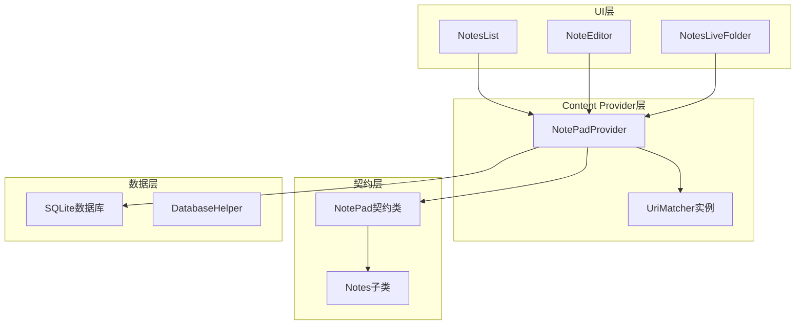
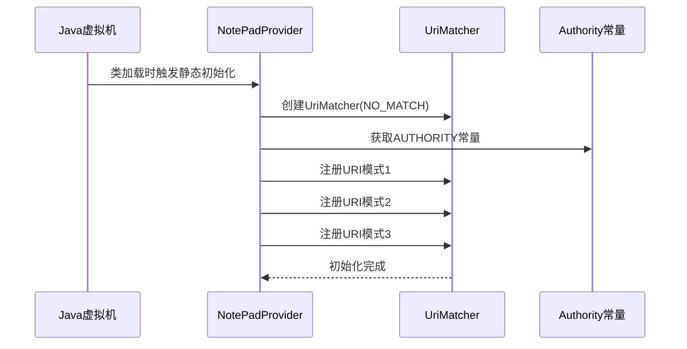
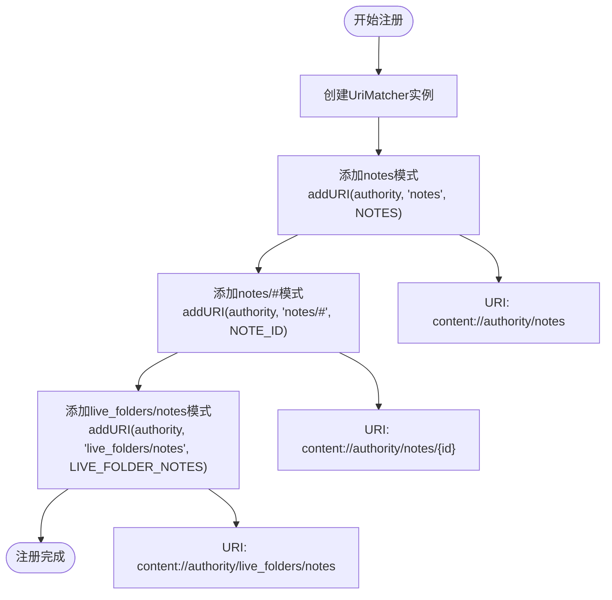
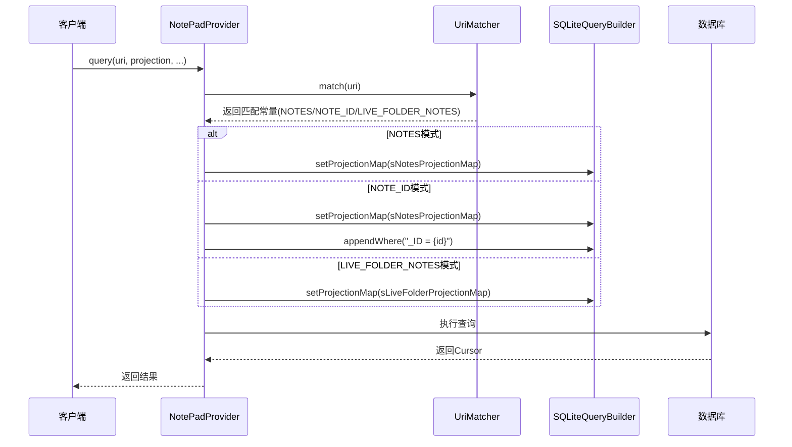
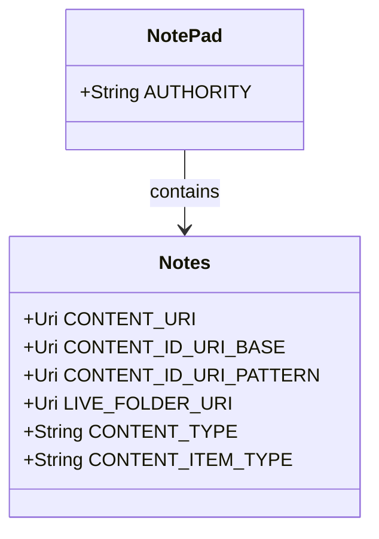
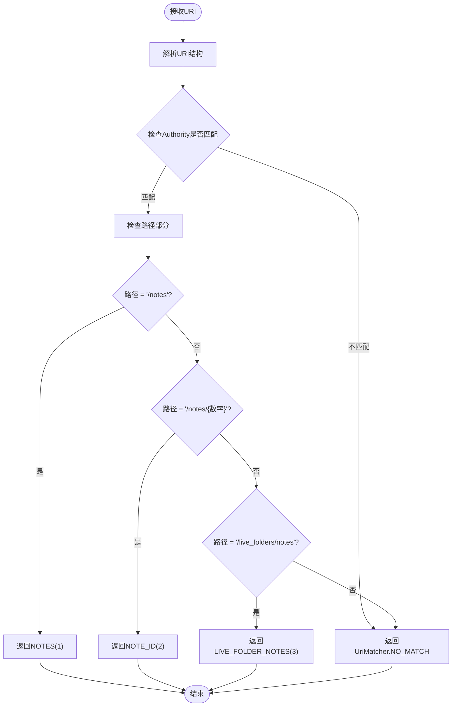
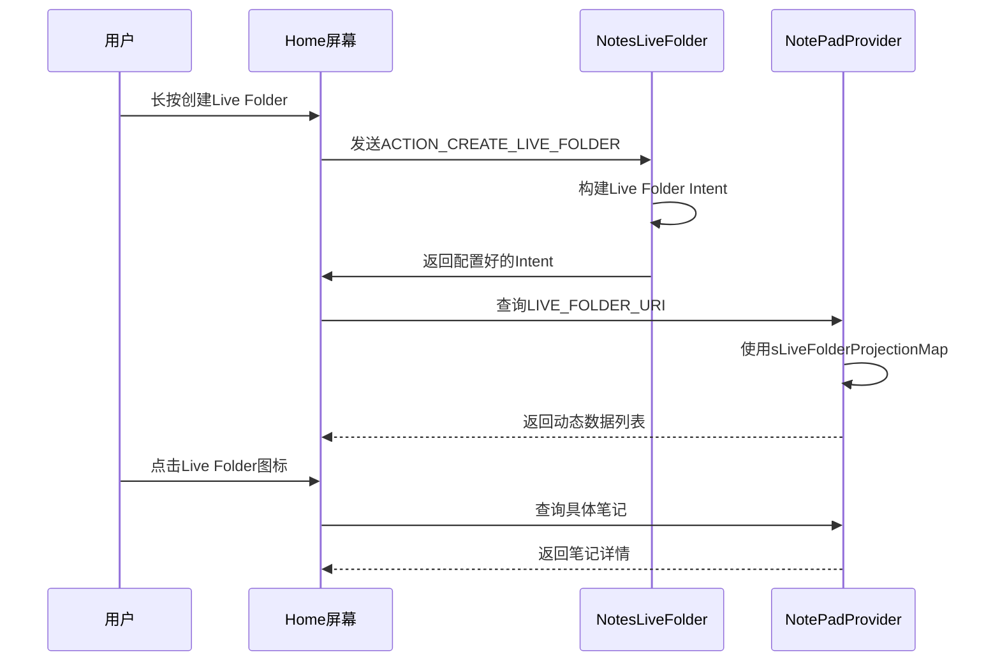

# URI匹配机制

<cite>
**本文档中引用的文件**
- [NotePadProvider.java](file://app/src/main/java/com/example/android/notepad/NotePadProvider.java)
- [NotePad.java](file://app/src/main/java/com/example/android/notepad/NotePad.java)
- [NotePadProviderTest.java](file://app/src/androidTest/java/com/example/android/notepad/NotePadProviderTest.java)
- [NotesLiveFolder.java](file://app/src/main/java/com/example/android/notepad/NotesLiveFolder.java)
- [AndroidManifest.xml](file://app/src/main/AndroidManifest.xml)
</cite>

## 目录
1. [简介](#简介)
2. [项目结构概述](#项目结构概述)
3. [UriMatcher静态实例详解](#urimatcher静态实例详解)
4. [URI模式注册机制](#uri模式注册机制)
5. [Content Provider路由机制](#content-provider路由机制)
6. [客户端URI构造指南](#客户端uri构造指南)
7. [match方法判断流程](#match方法判断流程)
8. [switch语句应用分析](#switch语句应用分析)
9. [Live Folders集成](#live-folders集成)
10. [性能考虑与最佳实践](#性能考虑与最佳实践)
11. [故障排除指南](#故障排除指南)
12. [总结](#总结)

## 简介

UriMatcher是Android Content Provider框架中的核心组件，负责将传入的URI与预定义的模式进行匹配，从而确定相应的数据库操作类型。在NotePad应用程序中，UriMatcher被巧妙地用于区分不同的数据访问场景，包括批量查询、单条记录操作和Live Folders支持。

本文档深入解析NotePadProvider中UriMatcher的实现细节，展示其如何通过三个关键URI模式支持完整的CRUD操作，并为客户端提供统一的数据访问接口。

## 项目结构概述

NotePad项目采用标准的Android Content Provider架构，主要包含以下核心组件：



**图表来源**
- [NotePadProvider.java](file://app/src/main/java/com/example/android/notepad/NotePadProvider.java#L54-L752)
- [NotePad.java](file://app/src/main/java/com/example/android/notepad/NotePad.java#L28-L155)

**章节来源**
- [NotePadProvider.java](file://app/src/main/java/com/example/android/notepad/NotePadProvider.java#L1-L50)
- [NotePad.java](file://app/src/main/java/com/example/android/notepad/NotePad.java#L1-L30)

## UriMatcher静态实例详解

### 实例化过程

UriMatcher静态实例在NotePadProvider类的静态初始化块中创建，确保在整个Content Provider生命周期内保持唯一性：



**图表来源**
- [NotePadProvider.java](file://app/src/main/java/com/example/android/notepad/NotePadProvider.java#L114-L132)

### 常量定义

UriMatcher使用三个整型常量来标识不同的URI模式：

| 常量名称 | 数值 | 描述 |
|---------|------|------|
| NOTES | 1 | 匹配根notes URI，支持批量查询和插入 |
| NOTE_ID | 2 | 匹配特定笔记ID的URI，支持单条记录操作 |
| LIVE_FOLDER_NOTES | 3 | 匹配Live Folders URI，支持动态列表 |

**章节来源**
- [NotePadProvider.java](file://app/src/main/java/com/example/android/notepad/NotePadProvider.java#L93-L101)

## URI模式注册机制

### 模式注册流程

UriMatcher通过addURI方法注册三种关键URI模式，每种模式都对应特定的操作类型：



**图表来源**
- [NotePadProvider.java](file://app/src/main/java/com/example/android/notepad/NotePadProvider.java#L122-L131)

### 模式匹配规则

每种URI模式都有严格的匹配规则：

1. **根notes模式** (`/notes`)
   - 匹配完整notes表的所有记录
   - 支持批量查询、插入操作
   - 返回目录类型的MIME类型

2. **笔记ID模式** (`/notes/#`)
   - 匹配特定ID的单条笔记记录
   - 支持精确查询、更新、删除操作
   - 返回项目类型的MIME类型

3. **Live Folders模式** (`/live_folders/notes`)
   - 支持动态生成的笔记列表
   - 用于Home屏幕上的快捷方式
   - 提供实时数据访问能力

**章节来源**
- [NotePadProvider.java](file://app/src/main/java/com/example/android/notepad/NotePadProvider.java#L122-L131)

## Content Provider路由机制

### query方法路由

query方法通过UriMatcher的match方法确定操作类型，然后选择相应的投影映射：



**图表来源**
- [NotePadProvider.java](file://app/src/main/java/com/example/android/notepad/NotePadProvider.java#L252-L321)

### CRUD操作路由

其他CRUD方法也采用类似的路由机制：

| 方法 | 匹配模式 | 特殊处理 |
|------|----------|----------|
| insert | NOTES | 验证URI是否为根notes URI |
| update | NOTES/NOTE_ID | 根据模式调整WHERE条件 |
| delete | NOTES/NOTE_ID | 根据模式限制操作范围 |

**章节来源**
- [NotePadProvider.java](file://app/src/main/java/com/example/android/notepad/NotePadProvider.java#L499-L567)
- [NotePadProvider.java](file://app/src/main/java/com/example/android/notepad/NotePadProvider.java#L583-L646)
- [NotePadProvider.java](file://app/src/main/java/com/example/android/notepad/NotePadProvider.java#L669-L739)

## 客户端URI构造指南

### 契约类常量使用

客户端应使用NotePad契约类提供的常量来构造合法的URI：



**图表来源**
- [NotePad.java](file://app/src/main/java/com/example/android/notepad/NotePad.java#L83-L104)

### URI构造示例

以下是客户端构造URI的标准模式：

1. **批量查询所有笔记**
   ```java
   Uri notesUri = NotePad.Notes.CONTENT_URI;
   ```

2. **查询特定笔记**
   ```java
   Uri noteUri = ContentUris.withAppendedId(NotePad.Notes.CONTENT_ID_URI_BASE, noteId);
   ```

3. **Live Folders访问**
   ```java
   Uri liveFolderUri = NotePad.Notes.LIVE_FOLDER_URI;
   ```

**章节来源**
- [NotePad.java](file://app/src/main/java/com/example/android/notepad/NotePad.java#L83-L104)

## match方法判断流程

### 匹配算法详解

UriMatcher的match方法按照注册顺序进行模式匹配，一旦找到匹配项就立即返回对应的常量值：



**图表来源**
- [NotePadProvider.java](file://app/src/main/java/com/example/android/notepad/NotePadProvider.java#L262-L288)

### 错误处理机制

当URI无法匹配任何已注册模式时，系统会抛出IllegalArgumentException异常：

```java
// 在query方法中
switch (sUriMatcher.match(uri)) {
    case NOTES:
    case NOTE_ID:
    case LIVE_FOLDER_NOTES:
        // 正常处理
        break;
    default:
        throw new IllegalArgumentException("Unknown URI " + uri);
}
```

**章节来源**
- [NotePadProvider.java](file://app/src/main/java/com/example/android/notepad/NotePadProvider.java#L262-L288)

## switch语句应用分析

### query方法中的switch语句

query方法中的switch语句根据匹配结果执行不同的逻辑分支：

```mermaid
graph TD
SwitchStart([sUriMatcher.match(uri)]) --> CaseNotes["case NOTES:<br/>设置sNotesProjectionMap"]
CaseNotes --> CaseNoteId["case NOTE_ID:<br/>设置sNotesProjectionMap<br/>添加ID过滤条件"]
CaseNoteId --> CaseLiveFolder["case LIVE_FOLDER_NOTES:<br/>设置sLiveFolderProjectionMap"]
CaseLiveFolder --> Default["default:<br/>抛出异常"]
CaseNotes --> QueryExec["执行数据库查询"]
CaseNoteId --> QueryExec
CaseLiveFolder --> QueryExec
Default --> ThrowException["throw IllegalArgumentException"]
```

**图表来源**
- [NotePadProvider.java](file://app/src/main/java/com/example/android/notepad/NotePadProvider.java#L262-L288)

### 其他方法中的switch语句

类似模式在其他CRUD方法中也有应用：

1. **getType方法** - 根据URI类型返回MIME类型
2. **getStreamTypes方法** - 处理数据流类型请求
3. **insert方法** - 验证插入权限
4. **update/delete方法** - 根据操作类型调整SQL条件

**章节来源**
- [NotePadProvider.java](file://app/src/main/java/com/example/android/notepad/NotePadProvider.java#L333-L352)
- [NotePadProvider.java](file://app/src/main/java/com/example/android/notepad/NotePadProvider.java#L374-L394)
- [NotePadProvider.java](file://app/src/main/java/com/example/android/notepad/NotePadProvider.java#L499-L504)

## Live Folders集成

### Live Folders概念

Live Folders是Android系统提供的动态列表功能，允许用户在Home屏幕上创建指向Content Provider数据的快捷方式。

### 集成实现



**图表来源**
- [NotesLiveFolder.java](file://app/src/main/java/com/example/android/notepad/NotesLiveFolder.java#L44-L112)
- [NotePadProvider.java](file://app/src/main/java/com/example/android/notepad/NotePadProvider.java#L281-L284)

### 投影映射配置

Live Folders使用专门的投影映射来适配列表显示需求：

```java
// sLiveFolderProjectionMap配置
sLiveFolderProjectionMap.put(LiveFolders._ID, NotePad.Notes._ID + " AS " + LiveFolders._ID);
sLiveFolderProjectionMap.put(LiveFolders.NAME, NotePad.Notes.COLUMN_NAME_TITLE + " AS " + LiveFolders.NAME);
```

**章节来源**
- [NotePadProvider.java](file://app/src/main/java/com/example/android/notepad/NotePadProvider.java#L166-L171)

## 性能考虑与最佳实践

### 匹配性能优化

1. **注册顺序优化** - 将最常用的模式放在前面
2. **模式简化** - 避免过于复杂的正则表达式
3. **缓存机制** - UriMatcher内部维护匹配结果缓存

### 内存管理

- 静态实例化避免重复创建
- 及时释放不再使用的资源
- 合理使用投影映射减少数据传输

### 错误处理

- 提供清晰的错误信息
- 实现优雅的降级策略
- 记录详细的日志信息

## 故障排除指南

### 常见问题及解决方案

1. **Unknown URI异常**
   - 检查URI格式是否正确
   - 验证Authority是否匹配
   - 确认路径部分是否符合注册模式

2. **权限拒绝**
   - 验证Content Provider声明
   - 检查权限配置
   - 确认签名一致性

3. **数据查询为空**
   - 检查数据库连接状态
   - 验证查询条件
   - 确认数据存在性

**章节来源**
- [NotePadProviderTest.java](file://app/src/androidTest/java/com/example/android/notepad/NotePadProviderTest.java#L179-L181)

## 总结

UriMatcher在NotePadProvider中的实现展示了Android Content Provider架构的最佳实践。通过三个精心设计的URI模式，系统实现了：

1. **清晰的职责分离** - 不同模式对应不同操作类型
2. **高效的路由机制** - 快速准确的模式匹配
3. **灵活的扩展能力** - 易于添加新的URI模式
4. **完整的功能覆盖** - 支持CRUD操作和Live Folders

这种设计不仅保证了系统的可维护性和可扩展性，还为客户端提供了直观易用的数据访问接口。对于Android开发者而言，理解并掌握UriMatcher的使用技巧，是构建高质量Content Provider应用的关键技能。