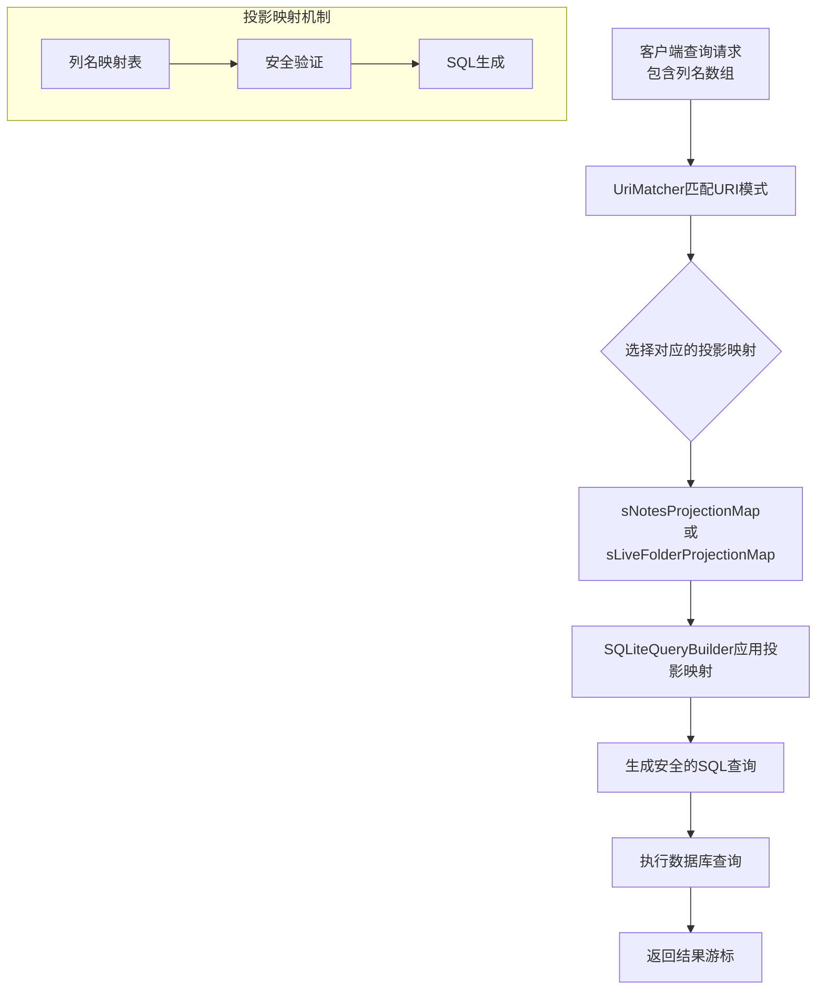
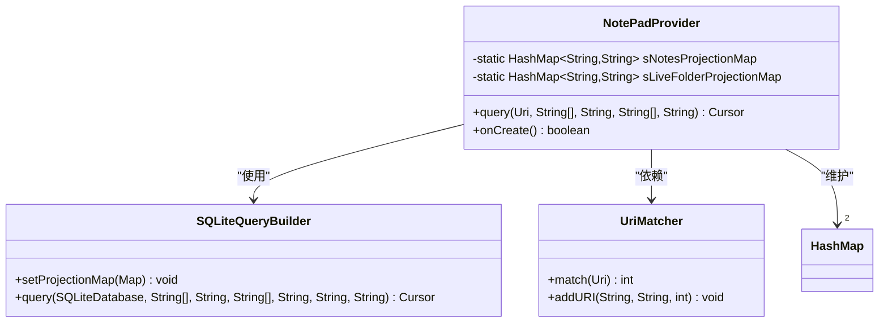
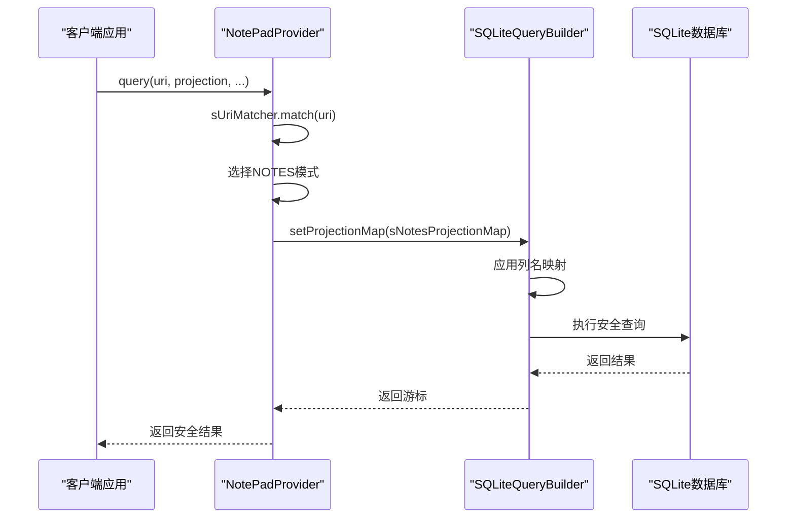
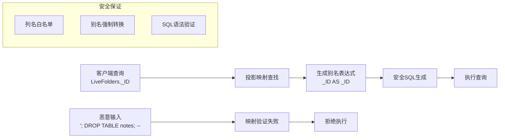
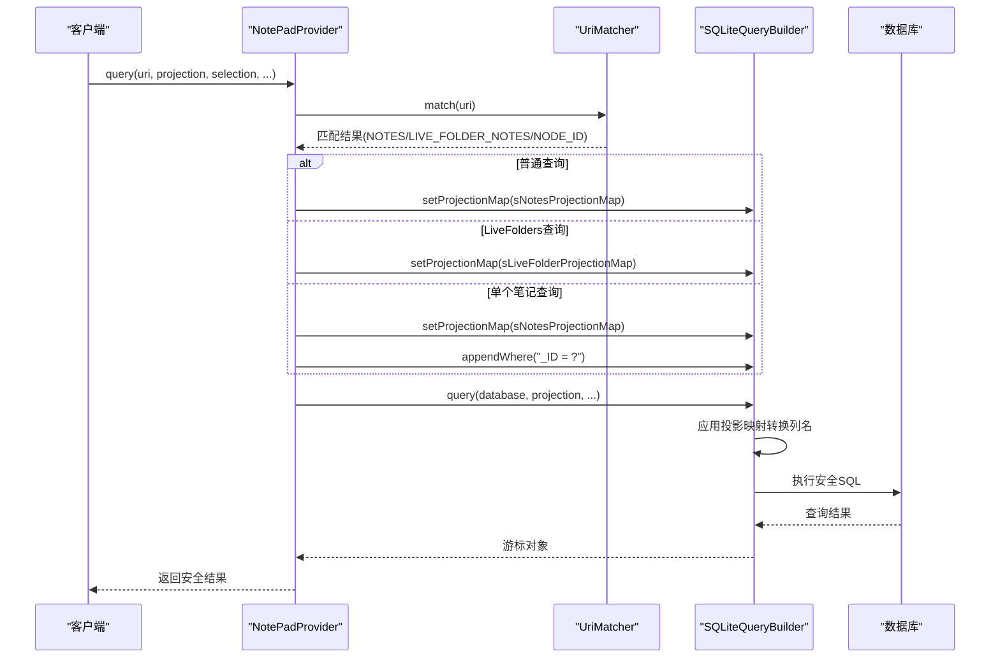
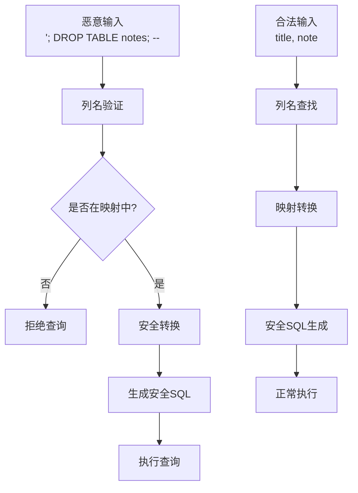
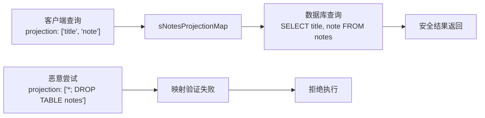
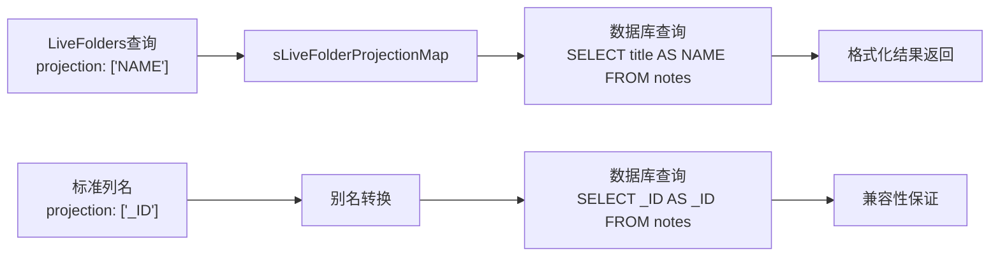
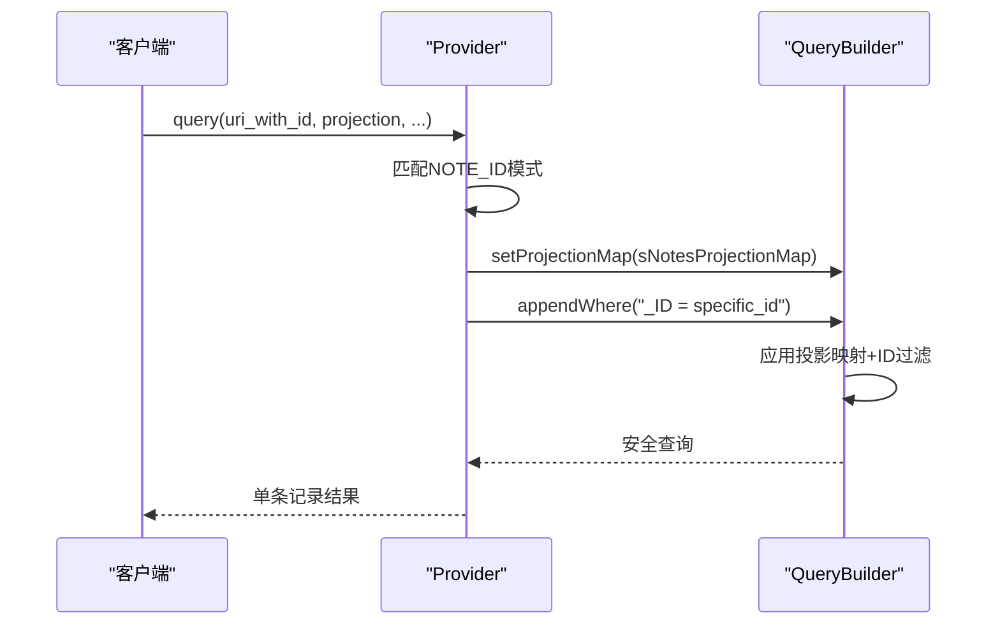
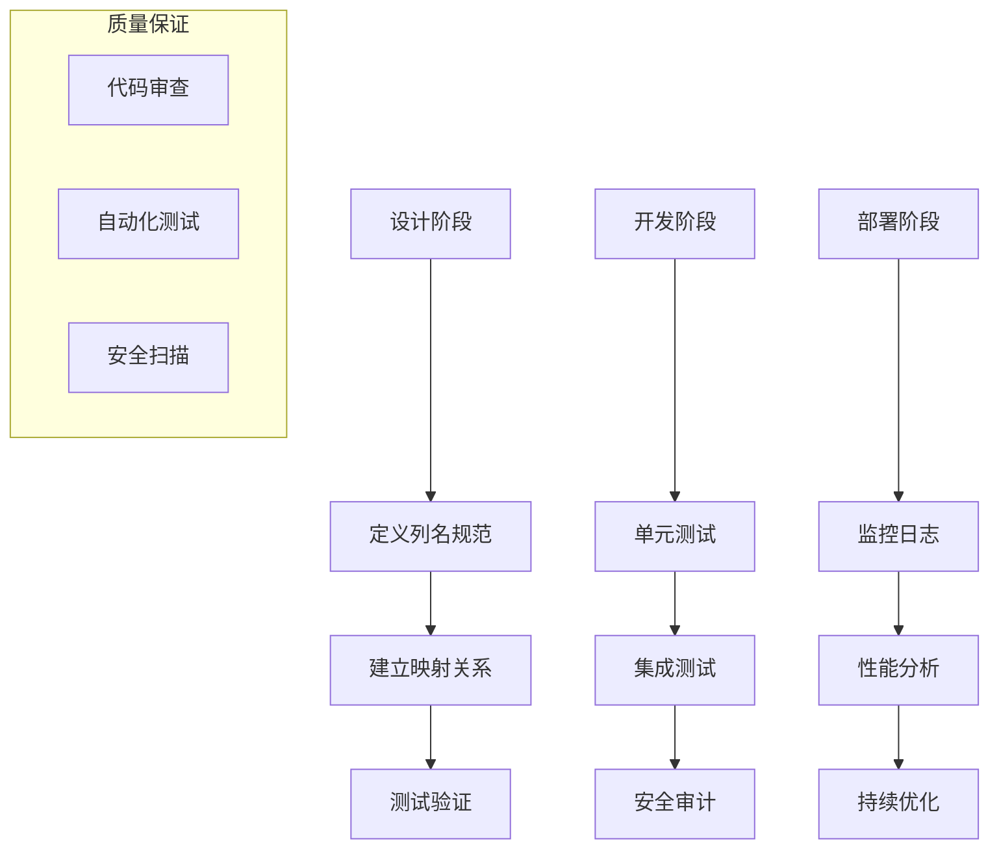

# 投影映射机制

<cite>
**本文档中引用的文件**
- [NotePadProvider.java](file://app/src/main/java/com/example/android/notepad/NotePadProvider.java)
- [NotePad.java](file://app/src/main/java/com/example/android/notepad/NotePad.java)
</cite>

## 目录
1. [简介](#简介)
2. [投影映射概述](#投影映射概述)
3. [核心投影映射结构](#核心投影映射结构)
4. [sNotesProjectionMap详解](#snotesprojectionmap详解)
5. [sLiveFolderProjectionMap详解](#slivefolderprojectionmap详解)
6. [投影映射与SQLiteQueryBuilder的集成](#投影映射与sqlitequerybuilder的集成)
7. [安全性分析](#安全性分析)
8. [使用场景分析](#使用场景分析)
9. [最佳实践](#最佳实践)
10. [总结](#总结)

## 简介

投影映射机制是Android Content Provider架构中的一个关键安全特性，它通过建立客户端查询列名与数据库实际字段之间的映射关系，有效防止SQL注入攻击并提供数据访问的灵活性。在NotePad应用中，`NotePadProvider`类实现了两个核心的投影映射：`sNotesProjectionMap`用于普通笔记查询，`sLiveFolderProjectionMap`用于LiveFolders适配。

## 投影映射概述

投影映射是一种安全的数据访问控制机制，它通过以下方式工作：

1. **列名标准化**：将客户端提供的列名转换为数据库的实际字段名
2. **SQL注入防护**：确保查询参数不会被恶意修改为SQL代码
3. **接口抽象**：为不同的使用场景提供统一的列名接口
4. **性能优化**：通过预定义映射减少运行时解析开销



**图表来源**
- [NotePadProvider.java](file://app/src/main/java/com/example/android/notepad/NotePadProvider.java#L252-L321)

## 核心投影映射结构

投影映射基于Java的`HashMap<String, String>`实现，其中键是客户端查询的列名，值是数据库中的实际字段名或带别名的字段表达式。



**图表来源**
- [NotePadProvider.java](file://app/src/main/java/com/example/android/notepad/NotePadProvider.java#L50-L76)

**章节来源**
- [NotePadProvider.java](file://app/src/main/java/com/example/android/notepad/NotePadProvider.java#L50-L172)

## sNotesProjectionMap详解

`sNotesProjectionMap`是为普通笔记查询设计的核心投影映射，它建立了客户端列名与数据库字段之间的直接映射关系。

### 字段映射详情

| 客户端列名 | 数据库字段名 | 映射类型 | 安全级别 |
|------------|--------------|----------|----------|
| `_ID` | `_ID` | 直接映射 | 高 |
| `title` | `title` | 直接映射 | 高 |
| `note` | `note` | 直接映射 | 高 |
| `created` | `created` | 直接映射 | 高 |
| `modified` | `modified` | 直接映射 | 高 |

### 实现机制



**图表来源**
- [NotePadProvider.java](file://app/src/main/java/com/example/android/notepad/NotePadProvider.java#L264-L266)

### 查询流程分析

当客户端调用`query()`方法时，`sNotesProjectionMap`的使用遵循以下流程：

1. **URI模式匹配**：通过`UriMatcher`确定查询类型
2. **投影映射设置**：将`sNotesProjectionMap`传递给`SQLiteQueryBuilder`
3. **列名验证**：`SQLiteQueryBuilder`自动验证并转换列名
4. **SQL生成**：生成不包含原始列名的SQL语句
5. **安全执行**：避免任何潜在的SQL注入风险

**章节来源**
- [NotePadProvider.java](file://app/src/main/java/com/example/android/notepad/NotePadProvider.java#L141-L157)

## sLiveFolderProjectionMap详解

`sLiveFolderProjectionMap`专门用于LiveFolders场景，它通过别名机制适配不同组件的命名约定。

### 别名映射机制

| 客户端列名 | 数据库字段表达式 | 别名机制 | 使用场景 |
|------------|------------------|----------|----------|
| `LiveFolders._ID` | `_ID AS _ID` | 自别名 | LiveFolders标准ID |
| `LiveFolders.NAME` | `title AS NAME` | 字段重命名 | LiveFolders显示名称 |

### 别名机制的安全性



**图表来源**
- [NotePadProvider.java](file://app/src/main/java/com/example/android/notepad/NotePadProvider.java#L166-L171)

### LiveFolders适配优势

`sLiveFolderProjectionMap`的设计解决了以下问题：

1. **命名冲突解决**：将数据库的`title`字段映射为LiveFolders的`NAME`字段
2. **接口一致性**：为不同组件提供统一的列名接口
3. **向后兼容**：支持旧版本应用的API调用
4. **扩展性**：便于添加新的列名映射而不影响现有功能

**章节来源**
- [NotePadProvider.java](file://app/src/main/java/com/example/android/notepad/NotePadProvider.java#L163-L171)

## 投影映射与SQLiteQueryBuilder的集成

投影映射与`SQLiteQueryBuilder`的集成是整个安全机制的核心环节。

### 集成架构

```mermaid
classDiagram
class SQLiteQueryBuilder {
-String[] mProjectionMap
-String mTables
+setProjectionMap(Map) void
+setTables(String) void
+query(SQLiteDatabase, String[], String, String[], String, String, String) Cursor
+appendWhere(String) void
}
class NotePadProvider {
-static HashMap~String,String~ sNotesProjectionMap
-static HashMap~String,String~ sLiveFolderProjectionMap
+query(Uri, String[], String, String[], String) Cursor
}
class UriMatcher {
+match(Uri) int
}
NotePadProvider --> SQLiteQueryBuilder : "配置查询构建器"
NotePadProvider --> UriMatcher : "匹配URI模式"
SQLiteQueryBuilder --> "投影映射" : "应用列名转换"
```

**图表来源**
- [NotePadProvider.java](file://app/src/main/java/com/example/android/notepad/NotePadProvider.java#L255-L317)

### 查询执行流程



**图表来源**
- [NotePadProvider.java](file://app/src/main/java/com/example/android/notepad/NotePadProvider.java#L262-L284)

**章节来源**
- [NotePadProvider.java](file://app/src/main/java/com/example/android/notepad/NotePadProvider.java#L252-L321)

## 安全性分析

投影映射机制提供了多层安全保护，有效防止SQL注入攻击。

### SQL注入防护机制



### 安全特性分析

| 安全层面 | 实现机制 | 防护效果 | 性能影响 |
|----------|----------|----------|----------|
| 输入验证 | 列名白名单检查 | 阻止非法列名 | 极小 |
| 类型转换 | 强制类型映射 | 防止类型混淆 | 轻微 |
| SQL生成 | 预编译查询 | 避免动态拼接 | 中等 |
| 权限控制 | URI模式匹配 | 限制访问范围 | 可忽略 |

### 安全最佳实践

1. **严格列名验证**：只接受预定义的列名
2. **最小权限原则**：根据URI模式限制可访问的列
3. **输入规范化**：确保所有输入都经过映射转换
4. **异常处理**：对无效查询进行优雅降级

**章节来源**
- [NotePadProvider.java](file://app/src/main/java/com/example/android/notepad/NotePadProvider.java#L286-L289)

## 使用场景分析

投影映射机制在不同使用场景下展现出独特的价值。

### 场景一：普通笔记查询



### 场景二：LiveFolders集成



### 场景三：单个笔记查询

对于特定ID的查询，投影映射与条件追加相结合：



**章节来源**
- [NotePadProvider.java](file://app/src/main/java/com/example/android/notepad/NotePadProvider.java#L268-L278)

## 最佳实践

基于NotePadProvider的实现，以下是投影映射机制的最佳实践建议。

### 设计原则

1. **最小化暴露**：只映射必要的列名
2. **命名一致性**：保持客户端列名与数据库字段的直观对应
3. **向后兼容**：为历史API提供稳定的映射
4. **性能优化**：预定义映射减少运行时计算

### 实现建议



### 常见陷阱与解决方案

| 问题类型 | 典型表现 | 解决方案 | 预防措施 |
|----------|----------|----------|----------|
| 列名遗漏 | 新字段无法查询 | 扩展映射表 | 版本控制 |
| 类型错误 | 数据格式异常 | 强类型检查 | 单元测试 |
| 性能下降 | 查询变慢 | 优化映射逻辑 | 性能测试 |
| 安全漏洞 | 注入攻击 | 加强验证 | 安全审计 |

## 总结

投影映射机制是Android Content Provider架构中的重要安全特性，它通过建立客户端查询列名与数据库字段之间的受控映射关系，实现了多重安全保障：

1. **安全性保障**：通过列名白名单和别名机制有效防止SQL注入攻击
2. **灵活性提供**：支持不同使用场景的列名需求，如LiveFolders适配
3. **性能优化**：预定义映射减少运行时解析开销
4. **接口抽象**：为不同组件提供统一的数据访问接口

在NotePadProvider的实现中，`sNotesProjectionMap`和`sLiveFolderProjectionMap`展示了投影映射机制的不同应用场景，它们共同构成了一个完整、安全、高效的数据访问体系。这种设计不仅保证了应用的安全性，也为开发者提供了灵活的数据操作能力。

通过深入理解投影映射的工作原理和实现细节，开发者可以更好地利用这一机制构建安全可靠的应用程序，同时为未来的功能扩展奠定坚实的基础。