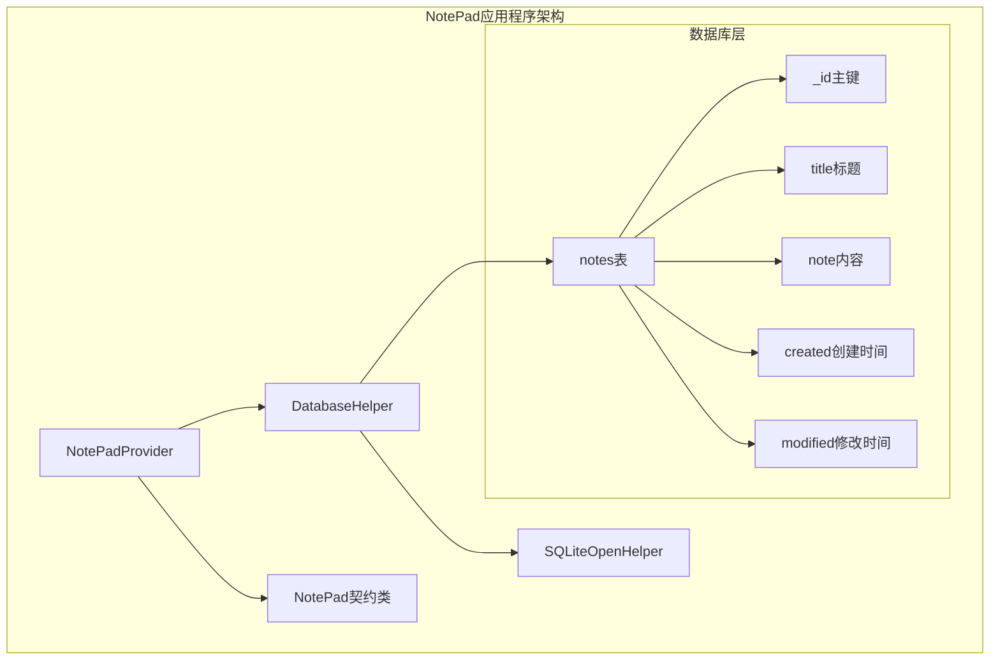
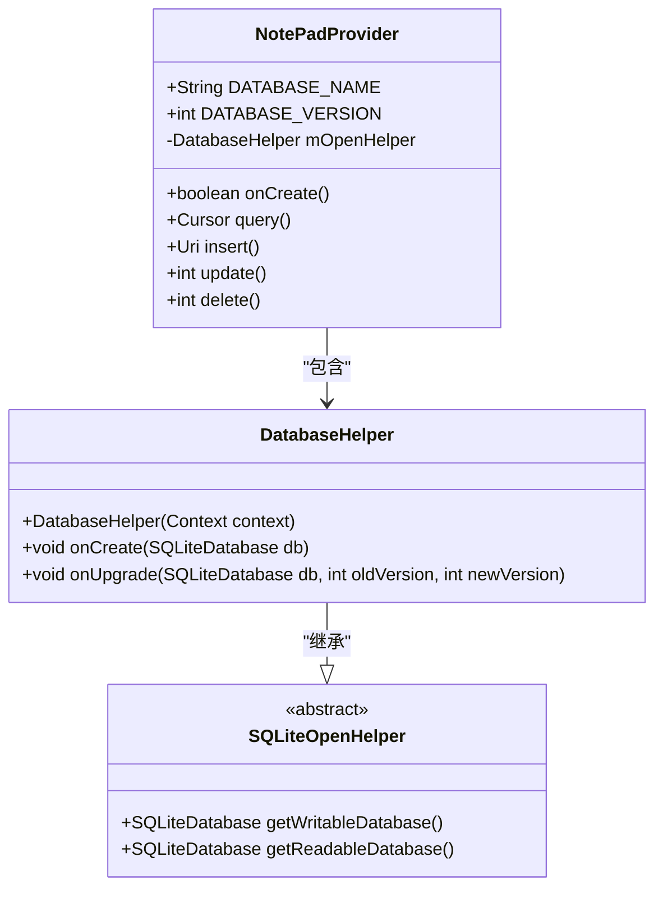
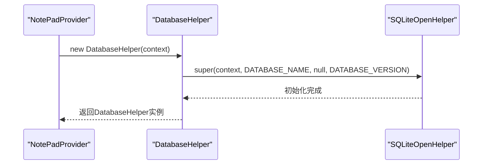
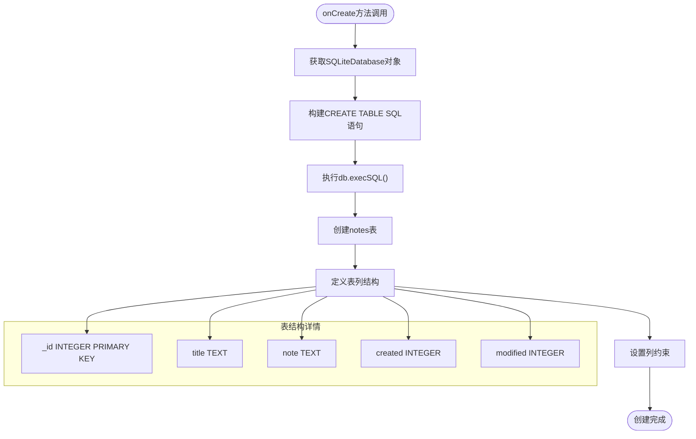
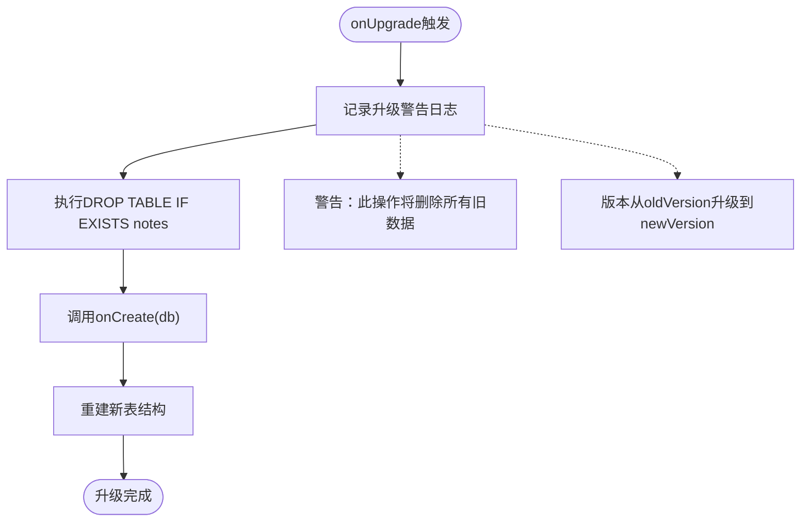
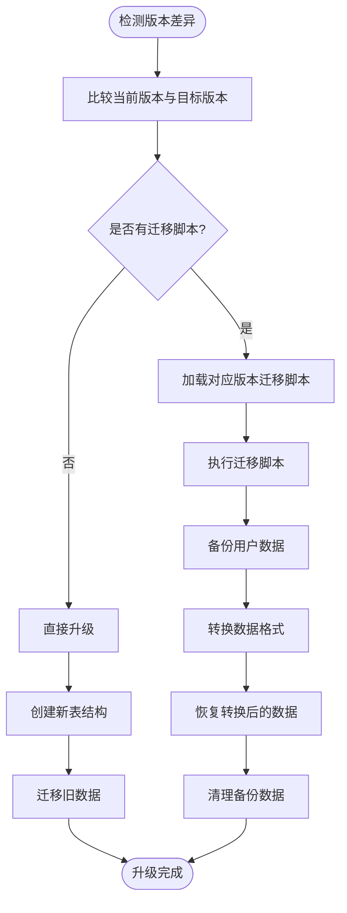
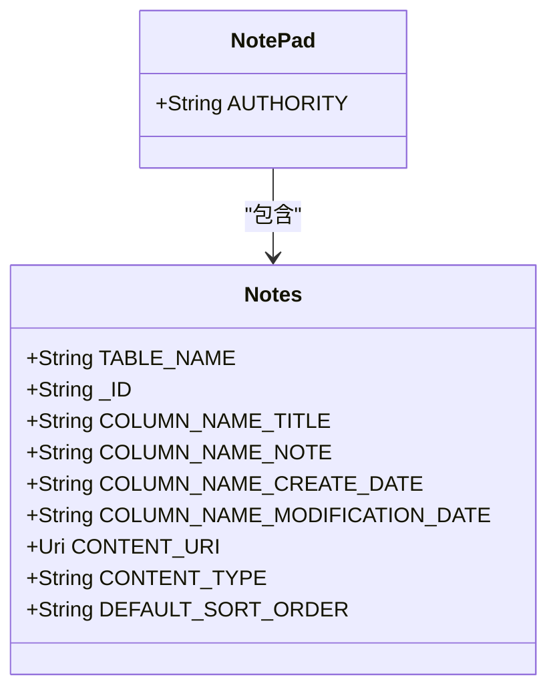
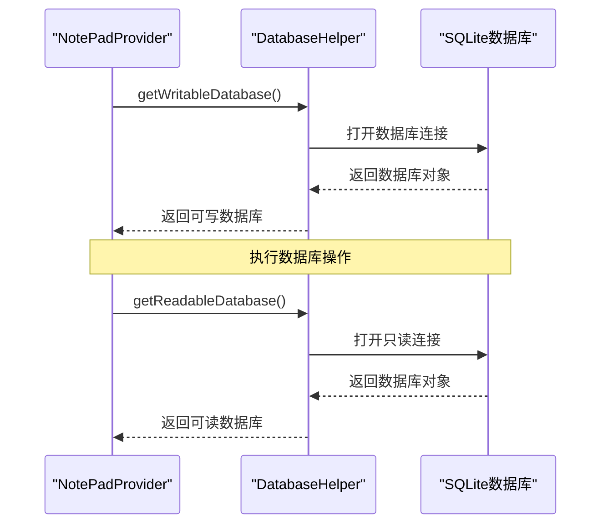

# 数据库管理

<cite>
**本文档中引用的文件**
- [NotePadProvider.java](file://app/src/main/java/com/example/android/notepad/NotePadProvider.java)
- [NotePad.java](file://app/src/main/java/com/example/android/notepad/NotePad.java)
</cite>

## 目录
1. [简介](#简介)
2. [项目结构概览](#项目结构概览)
3. [DatabaseHelper类架构](#databasehelper类架构)
4. [核心组件分析](#核心组件分析)
5. [数据库创建机制](#数据库创建机制)
6. [数据库升级策略](#数据库升级策略)
7. [常量设计与代码解耦](#常量设计与代码解耦)
8. [性能考虑](#性能考虑)
9. [故障排除指南](#故障排除指南)
10. [结论](#结论)

## 简介

NotePadProvider中的DatabaseHelper类是一个关键的数据库管理组件，它继承自Android的SQLiteOpenHelper类，负责管理应用程序的本地SQLite数据库。该类实现了数据库的创建、版本管理和升级功能，为笔记应用提供了可靠的数据存储基础设施。

DatabaseHelper类采用了标准的Android数据库管理模式，通过静态内部类的方式封装了数据库操作逻辑，确保了良好的封装性和可测试性。该类的设计体现了Android开发中的最佳实践，包括常量复用、版本控制和错误处理等重要特性。

## 项目结构概览

NotePad应用程序采用典型的Android内容提供者模式，其数据库管理结构如下：

**图表来源**
- [NotePadProvider.java](file://app/src/main/java/com/example/android/notepad/NotePadProvider.java#L179-L223)
- [NotePad.java](file://app/src/main/java/com/example/android/notepad/NotePad.java#L38-L154)

**章节来源**
- [NotePadProvider.java](file://app/src/main/java/com/example/android/notepad/NotePadProvider.java#L1-L753)
- [NotePad.java](file://app/src/main/java/com/example/android/notepad/NotePad.java#L1-L155)

## DatabaseHelper类架构

DatabaseHelper类是NotePadProvider的静态内部类，专门负责数据库的生命周期管理。该类继承自SQLiteOpenHelper，提供了数据库创建和版本升级的核心功能。

**图表来源**
- [NotePadProvider.java](file://app/src/main/java/com/example/android/notepad/NotePadProvider.java#L179-L223)

### 类设计特点

DatabaseHelper类采用了以下设计原则：

1. **封装性**：作为静态内部类，避免了外部直接访问数据库实例
2. **继承性**：继承SQLiteOpenHelper获得基础数据库功能
3. **不可变性**：使用final修饰符确保常量值不被修改
4. **上下文依赖**：通过构造函数接收Context参数

**章节来源**
- [NotePadProvider.java](file://app/src/main/java/com/example/android/notepad/NotePadProvider.java#L179-L185)

## 核心组件分析

### 构造函数设计

DatabaseHelper构造函数简洁而高效，直接调用父类SQLiteOpenHelper的构造函数：

**图表来源**
- [NotePadProvider.java](file://app/src/main/java/com/example/android/notepad/NotePadProvider.java#L181-L184)

### 常量定义系统

DatabaseHelper类通过两个关键常量控制数据库行为：

| 常量名称 | 类型 | 值 | 作用 |
|---------|------|----|----- |
| DATABASE_NAME | String | "note_pad.db" | 指定数据库文件名 |
| DATABASE_VERSION | int | 2 | 控制数据库版本号 |

这些常量的设计体现了以下优势：
- **集中管理**：所有配置信息集中在一处
- **易于维护**：修改时只需调整一处
- **类型安全**：编译时检查类型正确性

**章节来源**
- [NotePadProvider.java](file://app/src/main/java/com/example/android/notepad/NotePadProvider.java#L61-L66)

## 数据库创建机制

### onCreate方法实现

onCreate方法是DatabaseHelper的核心功能之一，负责在数据库首次创建时建立notes表结构：

**图表来源**
- [NotePadProvider.java](file://app/src/main/java/com/example/android/notepad/NotePadProvider.java#L192-L201)

### notes表结构详解

根据onCreate方法的SQL语句，notes表具有以下结构：

| 字段名 | 数据类型 | 约束条件 | 描述 |
|--------|----------|----------|------|
| _id | INTEGER | PRIMARY KEY | 主键，自动递增 |
| title | TEXT | 无 | 笔记标题，支持空值 |
| note | TEXT | 无 | 笔记内容，支持空值 |
| created | INTEGER | 无 | 创建时间戳（毫秒） |
| modified | INTEGER | 无 | 修改时间戳（毫秒） |

#### 字段设计分析

1. **_id字段**：作为主键，确保每条记录的唯一性
2. **title字段**：TEXT类型支持富文本格式
3. **note字段**：TEXT类型存储完整的笔记内容
4. **时间戳字段**：INTEGER类型存储Unix时间戳

这种设计充分利用了SQLite的类型亲和性，同时保持了数据的完整性和查询效率。

**章节来源**
- [NotePadProvider.java](file://app/src/main/java/com/example/android/notepad/NotePadProvider.java#L194-L200)

## 数据库升级策略

### 当前升级实现分析

DatabaseHelper的onUpgrade方法采用简单直接的升级策略：

**图表来源**
- [NotePadProvider.java](file://app/src/main/java/com/example/android/notepad/NotePadProvider.java#L210-L221)

### 升级策略评估

#### 现有实现的优点
- **简单易懂**：代码逻辑清晰，易于理解和维护
- **快速实现**：开发成本低，适合原型开发
- **彻底清理**：确保数据库结构完全符合新版本要求

#### 存在的问题和风险
1. **数据丢失风险**：现有数据会被完全清除
2. **用户体验影响**：用户数据无法保留
3. **业务连续性问题**：不适合生产环境应用
4. **扩展性限制**：难以支持复杂的数据迁移场景

### 生产环境推荐方案

对于生产环境，建议采用增量迁移策略：

**图表来源**
- [NotePadProvider.java](file://app/src/main/java/com/example/android/notepad/NotePadProvider.java#L210-L221)

#### 增量迁移的优势
1. **数据保护**：保留用户的重要数据
2. **平滑过渡**：减少对用户的影响
3. **灵活扩展**：支持复杂的迁移场景
4. **错误恢复**：提供回滚机制

**章节来源**
- [NotePadProvider.java](file://app/src/main/java/com/example/android/notepad/NotePadProvider.java#L204-L221)

## 常量设计与代码解耦

### NotePad契约类的作用

NotePad契约类（NotePad）作为数据访问层的接口，提供了完整的数据库表结构定义：

**图表来源**
- [NotePad.java](file://app/src/main/java/com/example/android/notepad/NotePad.java#L38-L154)

### 常量复用机制

DatabaseHelper类通过NotePad契约类实现常量复用：

| 复用方式 | 实现位置 | 优势 |
|---------|----------|------|
| 表名复用 | `NotePad.Notes.TABLE_NAME` | 避免硬编码，统一管理 |
| 列名复用 | 各种COLUMN_NAME_*常量 | 维护一致性 |
| URI复用 | CONTENT_URI和CONTENT_ID_URI_BASE | 支持内容提供者集成 |
| 类型复用 | CONTENT_TYPE和CONTENT_ITEM_TYPE | MIME类型标准化 |

### 设计优势分析

1. **降低耦合度**：数据库结构变化不影响其他模块
2. **提高可维护性**：一处修改，处处生效
3. **增强可读性**：通过有意义的常量名称提升代码可理解性
4. **减少错误**：编译时检查常量引用的正确性

**章节来源**
- [NotePadProvider.java](file://app/src/main/java/com/example/android/notepad/NotePadProvider.java#L194-L200)
- [NotePad.java](file://app/src/main/java/com/example/android/notepad/NotePad.java#L46-L154)

## 性能考虑

### 数据库连接管理

DatabaseHelper类通过SQLiteOpenHelper自动管理数据库连接：

**图表来源**
- [NotePadProvider.java](file://app/src/main/java/com/example/android/notepad/NotePadProvider.java#L301-L303)

### 性能优化建议

1. **连接池管理**：利用SQLiteOpenHelper的连接池功能
2. **事务处理**：对批量操作使用事务提高性能
3. **索引优化**：为常用查询字段添加索引
4. **内存管理**：及时关闭游标和数据库连接

### 内存使用优化

DatabaseHelper类的设计考虑了内存使用效率：
- 延迟初始化：数据库仅在需要时创建
- 资源管理：自动管理数据库连接资源
- 缓存策略：SQLiteOpenHelper内置缓存机制

## 故障排除指南

### 常见问题及解决方案

#### 数据库创建失败

**症状**：应用启动时提示数据库创建错误
**原因**：权限不足或磁盘空间不足
**解决方案**：
1. 检查应用权限声明
2. 验证设备存储空间
3. 清理应用缓存数据

#### 数据库升级异常

**症状**：应用崩溃，提示数据库版本不匹配
**原因**：onUpgrade方法实现不当
**解决方案**：
1. 实现增量迁移逻辑
2. 添加数据备份机制
3. 提供降级回退方案

#### 查询性能问题

**症状**：数据库查询响应缓慢
**原因**：缺少适当的索引或查询优化不足
**解决方案**：
1. 分析查询执行计划
2. 为常用查询字段添加索引
3. 优化SQL查询语句

**章节来源**
- [NotePadProvider.java](file://app/src/main/java/com/example/android/notepad/NotePadProvider.java#L210-L221)

## 结论

NotePadProvider中的DatabaseHelper类展现了Android数据库管理的最佳实践。通过继承SQLiteOpenHelper，该类提供了完整的数据库生命周期管理功能，包括数据库创建、版本控制和升级策略。

### 关键成就

1. **简洁的设计**：通过静态内部类实现良好的封装性
2. **常量复用**：通过NotePad契约类实现代码解耦
3. **版本控制**：通过DATABASE_VERSION常量管理数据库版本
4. **扩展性**：预留了onUpgrade方法的扩展空间

### 改进建议

虽然当前实现满足基本需求，但在生产环境中可以考虑以下改进：
- 实现增量数据迁移策略
- 添加更完善的错误处理机制
- 优化查询性能和内存使用
- 增强数据备份和恢复功能

DatabaseHelper类的设计为Android应用的数据库管理奠定了坚实的基础，其简洁而有效的架构体现了Android开发中的工程智慧。