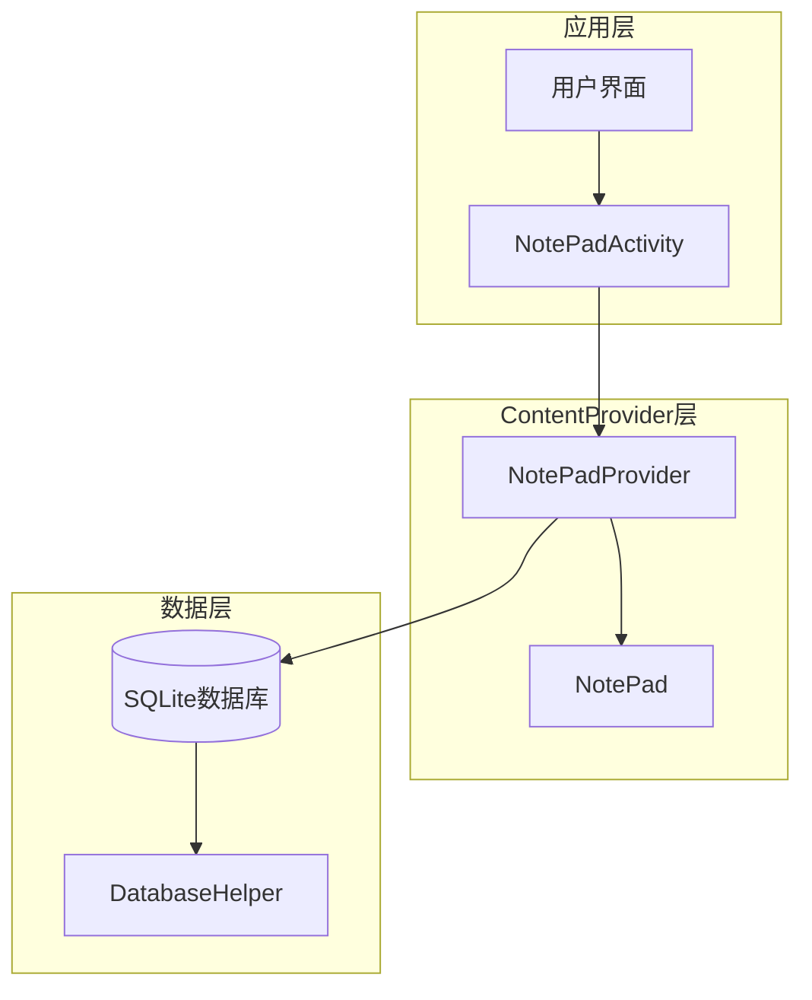
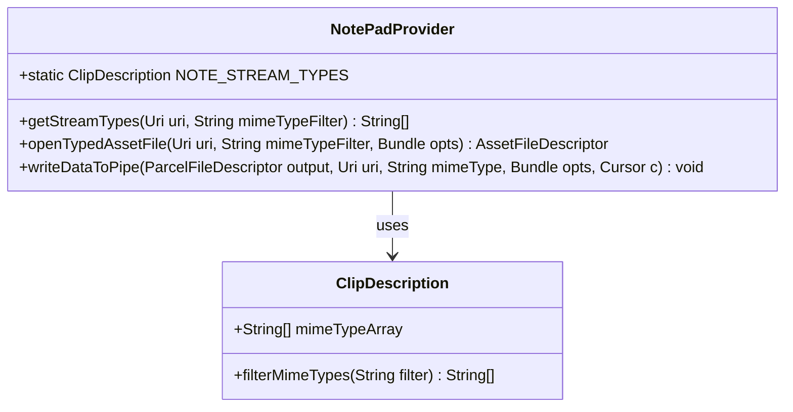
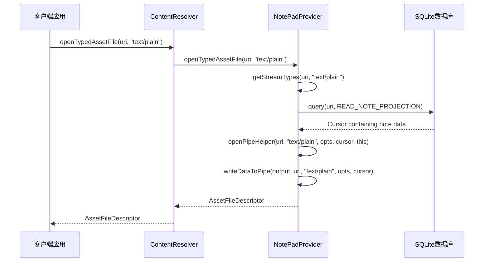
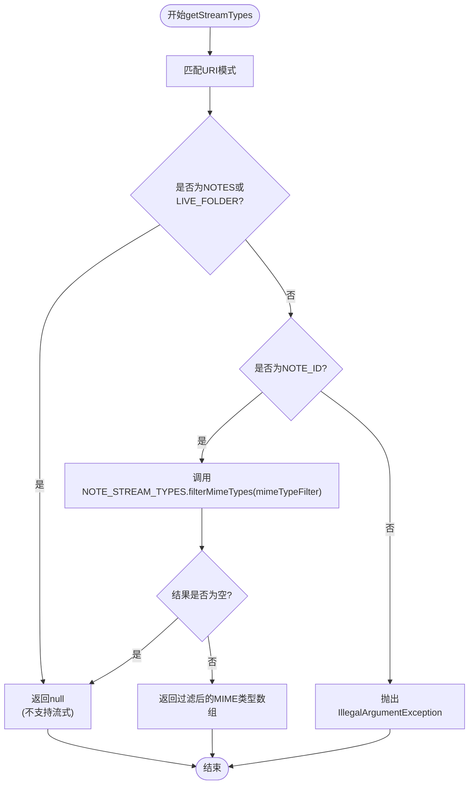
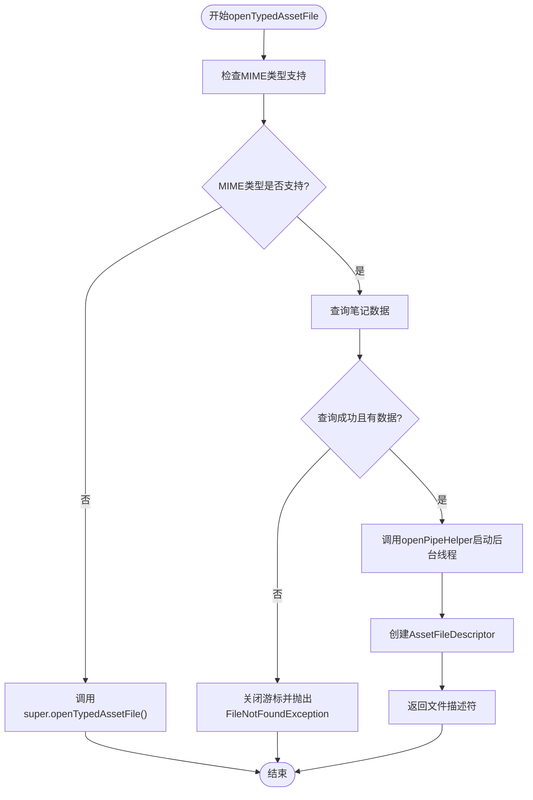
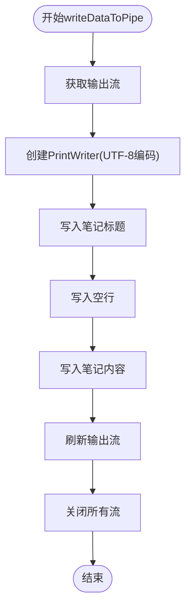
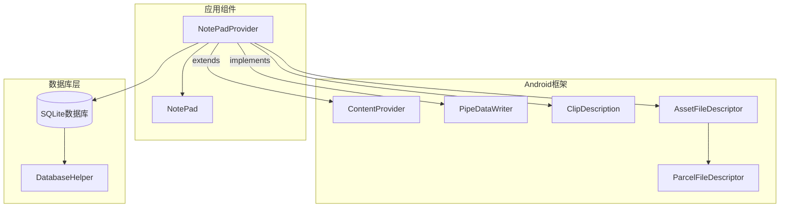

# 数据流支持

<cite>
**本文档中引用的文件**
- [NotePadProvider.java](file://app/src/main/java/com/example/android/notepad/NotePadProvider.java)
- [NotePad.java](file://app/src/main/java/com/example/android/notepad/NotePad.java)
- [NotePadProviderTest.java](file://app/src/androidTest/java/com/example/android/notepad/NotePadProviderTest.java)
</cite>

## 目录
1. [简介](#简介)
2. [项目结构概述](#项目结构概述)
3. [核心组件分析](#核心组件分析)
4. [架构概览](#架构概览)
5. [详细组件分析](#详细组件分析)
6. [依赖关系分析](#依赖关系分析)
7. [性能考虑](#性能考虑)
8. [故障排除指南](#故障排除指南)
9. [结论](#结论)

## 简介

NotePadProvider是Android应用中的一个ContentProvider实现，它提供了对笔记数据的结构化访问。该提供程序特别实现了数据流式访问支持，允许客户端以流的形式读取单个笔记的文本内容。这种设计使得笔记可以在分享、导出等场景中被高效地处理和传输。

本文档深入分析了NotePadProvider如何通过`openTypedAssetFile`和`getStreamTypes`方法实现数据流式访问，以及`NOTE_STREAM_TYPES`常量如何声明仅支持text/plain MIME类型的流式转换。

## 项目结构概述

NotePadProvider位于`com.example.android.notepad`包中，作为Android应用的核心数据访问层。该项目采用标准的Android ContentProvider架构，提供了完整的CRUD操作和特殊的数据流式访问功能。



**图表来源**
- [NotePadProvider.java](file://app/src/main/java/com/example/android/notepad/NotePadProvider.java#L54-L753)
- [NotePad.java](file://app/src/main/java/com/example/android/notepad/NotePad.java#L28-L155)

**章节来源**
- [NotePadProvider.java](file://app/src/main/java/com/example/android/notepad/NotePadProvider.java#L1-L50)
- [NotePad.java](file://app/src/main/java/com/example/android/notepad/NotePad.java#L1-L50)

## 核心组件分析

### NotePadProvider类

NotePadProvider是整个系统的核心组件，继承自ContentProvider并实现了PipeDataWriter接口。这个设计使得它能够提供传统的CRUD操作以及现代的数据流式访问功能。

主要特性包括：
- 实现了完整的ContentProvider接口
- 支持数据流式访问（流式转换）
- 使用SQLite数据库存储笔记数据
- 提供统一的URI匹配机制

### NOTE_STREAM_TYPES常量

`NOTE_STREAM_TYPES`是一个静态的ClipDescription对象，专门用于声明支持的流式MIME类型：



**图表来源**
- [NotePadProvider.java](file://app/src/main/java/com/example/android/notepad/NotePadProvider.java#L360-L362)

**章节来源**
- [NotePadProvider.java](file://app/src/main/java/com/example/android/notepad/NotePadProvider.java#L355-L395)

## 架构概览

NotePadProvider采用了分层架构设计，将数据访问、业务逻辑和UI展示清晰分离：



**图表来源**
- [NotePadProvider.java](file://app/src/main/java/com/example/android/notepad/NotePadProvider.java#L412-L455)

## 详细组件分析

### getStreamTypes方法实现

`getStreamTypes`方法负责确定哪些MIME类型可以作为数据流返回。该方法基于URI模式和MIME类型过滤器进行判断：



**图表来源**
- [NotePadProvider.java](file://app/src/main/java/com/example/android/notepad/NotePadProvider.java#L374-L395)

#### URI模式过滤逻辑

| URI模式 | 是否支持流式 | 原因 |
|---------|-------------|------|
| NOTES | 不支持 | 多条笔记记录，无法确定具体流式内容 |
| NOTE_ID | 支持 | 单条笔记记录，明确的流式内容源 |
| LIVE_FOLDER_NOTES | 不支持 | 类似NOTES，多条记录 |

#### MIME类型过滤逻辑

`NOTE_STREAM_TYPES`常量声明了仅支持`text/plain` MIME类型：

```java
static ClipDescription NOTE_STREAM_TYPES = new ClipDescription(null,
        new String[] { ClipDescription.MIMETYPE_TEXT_PLAIN });
```

当调用`filterMimeTypes`方法时，只有当`mimeTypeFilter`包含`text/plain`时才会返回非空结果。

**章节来源**
- [NotePadProvider.java](file://app/src/main/java/com/example/android/notepad/NotePadProvider.java#L374-L395)

### openTypedAssetFile方法实现

`openTypedAssetFile`方法是数据流式访问的主要入口点，它协调整个流式转换过程：



**图表来源**
- [NotePadProvider.java](file://app/src/main/java/com/example/android/notepad/NotePadProvider.java#L412-L455)

#### 查询笔记数据

方法首先使用预定义的`READ_NOTE_PROJECTION`投影来获取笔记的关键字段：

```java
private static final String[] READ_NOTE_PROJECTION = new String[] {
    NotePad.Notes._ID,               // Projection position 0, the note's id
    NotePad.Notes.COLUMN_NAME_NOTE,  // Projection position 1, the note's content
    NotePad.Notes.COLUMN_NAME_TITLE, // Projection position 2, the note's title
};
```

这确保了只获取必要的数据，提高查询效率。

#### 后台线程处理

通过`openPipeHelper`方法启动新的后台线程，在该线程中执行实际的数据转换工作。这种方法避免了阻塞主线程，保证了应用的响应性。

**章节来源**
- [NotePadProvider.java](file://app/src/main/java/com/example/android/notepad/NotePadProvider.java#L412-L455)

### writeDataToPipe方法实现

`writeDataToPipe`方法实现了具体的流式数据转换逻辑，将笔记的标题和内容写入到输出流中：



**图表来源**
- [NotePadProvider.java](file://app/src/main/java/com/example/android/notepad/NotePadProvider.java#L462-L486)

#### 数据格式化

输出的数据格式遵循以下结构：
1. 笔记标题（第一行）
2. 空行（分隔符）
3. 笔记内容（第三行）

这种格式便于后续处理和阅读，特别是在分享或导出场景中。

#### 异常处理

方法包含了完善的异常处理机制：
- 捕获`UnsupportedEncodingException`并记录警告日志
- 确保即使发生异常也能正确关闭资源
- 使用finally块保证资源释放

**章节来源**
- [NotePadProvider.java](file://app/src/main/java/com/example/android/notepad/NotePadProvider.java#L462-L486)

## 依赖关系分析

NotePadProvider与多个Android框架组件存在依赖关系：



**图表来源**
- [NotePadProvider.java](file://app/src/main/java/com/example/android/notepad/NotePadProvider.java#L54-L50)

### 关键依赖说明

| 组件 | 作用 | 重要性 |
|------|------|--------|
| ContentProvider | 基础ContentProvider功能 | 核心 |
| PipeDataWriter | 流式数据写入接口 | 核心 |
| ClipDescription | MIME类型描述 | 必需 |
| AssetFileDescriptor | 文件描述符管理 | 必需 |
| ParcelFileDescriptor | 底层文件描述符 | 必需 |

**章节来源**
- [NotePadProvider.java](file://app/src/main/java/com/example/android/notepad/NotePadProvider.java#L1-L50)

## 性能考虑

### 内存管理

- 使用`try-finally`确保资源正确释放
- 及时关闭Cursor和文件流
- 避免在主线程中执行耗时操作

### 数据库优化

- 使用预定义的投影减少内存占用
- 通过URI匹配快速定位数据
- 合理使用索引提高查询效率

### 并发处理

- 利用后台线程处理流式转换
- 避免阻塞主线程
- 支持并发访问

## 故障排除指南

### 常见问题及解决方案

#### FileNotFoundException
**原因**: URI无效或MIME类型不支持
**解决**: 检查URI格式和MIME类型参数

#### UnsupportedEncodingException
**原因**: 字符编码问题
**解决**: 确保系统支持UTF-8编码

#### Cursor为空
**原因**: 查询不到对应的数据
**解决**: 验证URI和数据库状态

**章节来源**
- [NotePadProviderTest.java](file://app/src/androidTest/java/com/example/android/notepad/NotePadProviderTest.java#L181-L326)

## 结论

NotePadProvider通过精心设计的数据流式访问机制，为Android应用提供了高效、灵活的笔记数据处理能力。其核心特性包括：

1. **精确的URI匹配**: 仅对单条笔记URI支持流式访问
2. **严格的MIME类型控制**: 仅支持text/plain MIME类型
3. **高效的后台处理**: 利用管道机制避免阻塞主线程
4. **完善的错误处理**: 提供健壮的异常处理机制

这种设计不仅满足了基本的数据访问需求，还为高级应用场景（如笔记分享、导出）提供了强有力的技术支持。通过合理的架构设计和性能优化，NotePadProvider展现了Android ContentProvider的最佳实践。