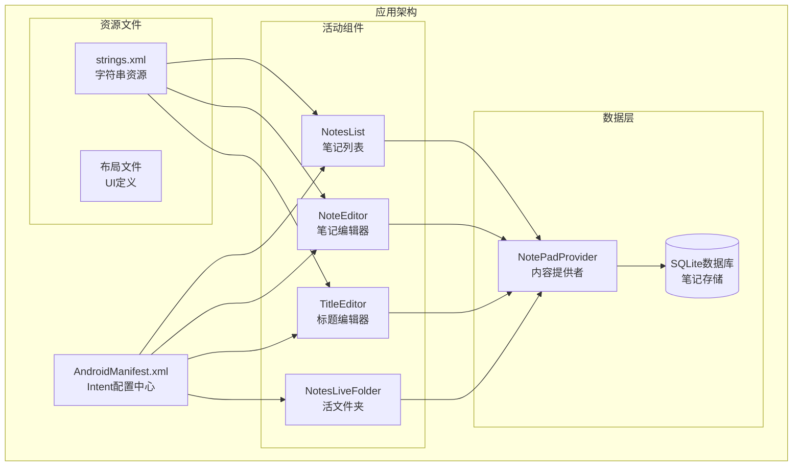
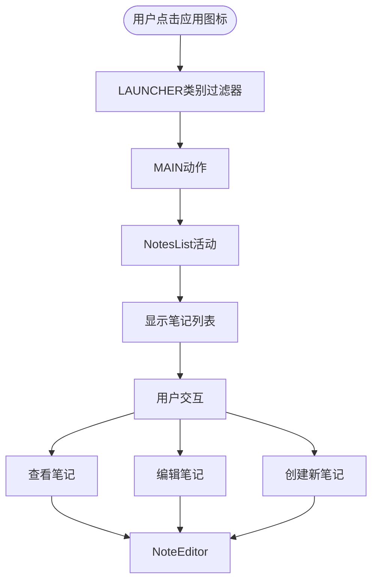
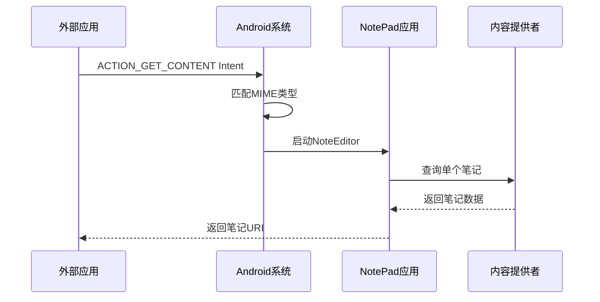
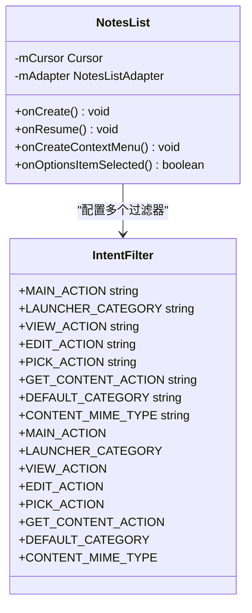
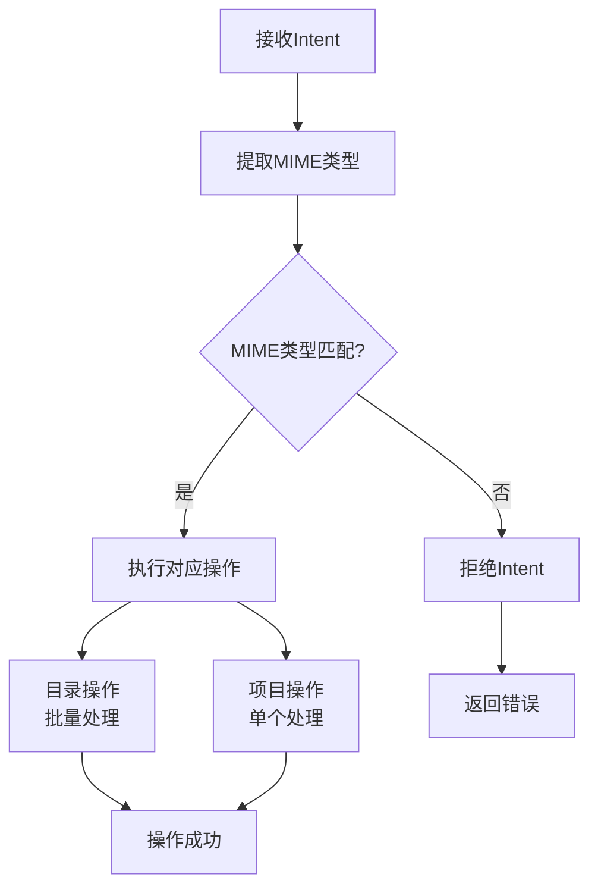
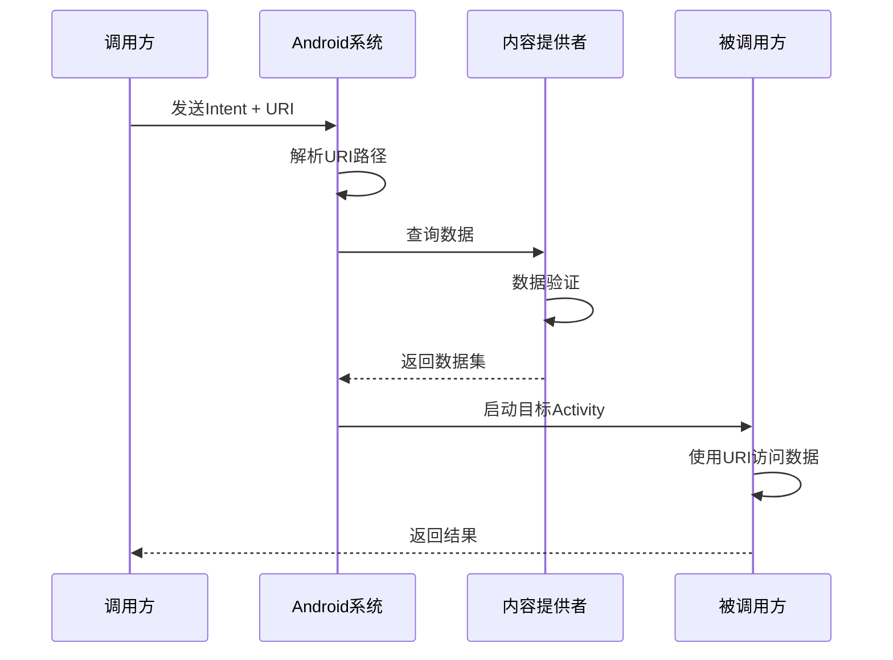
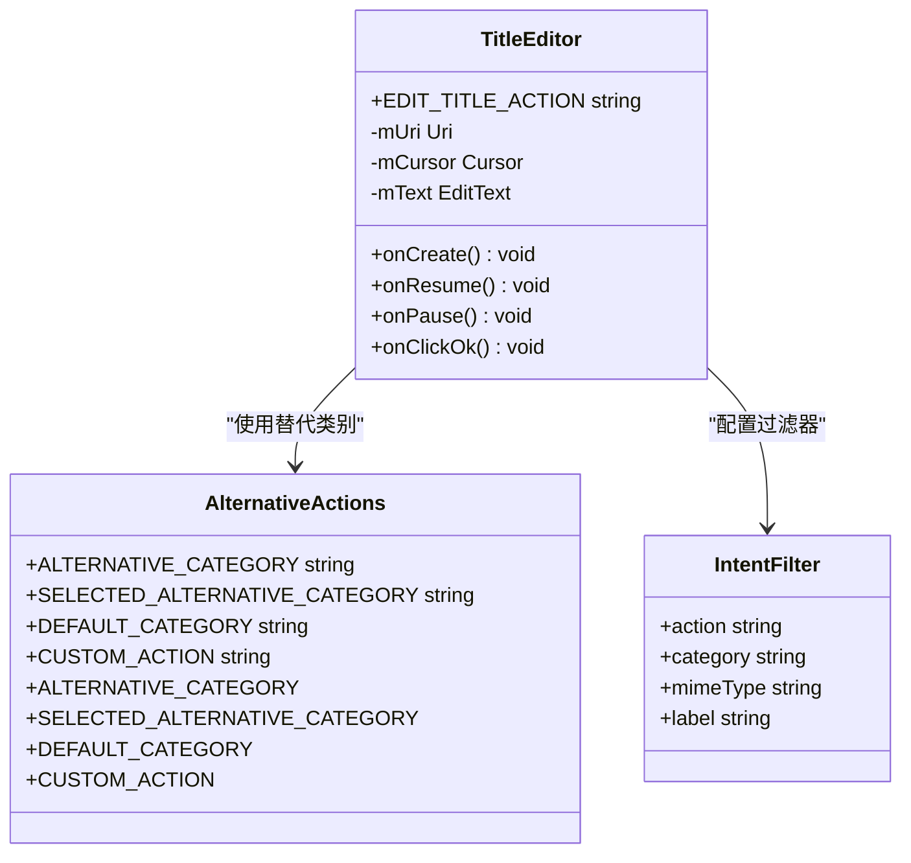
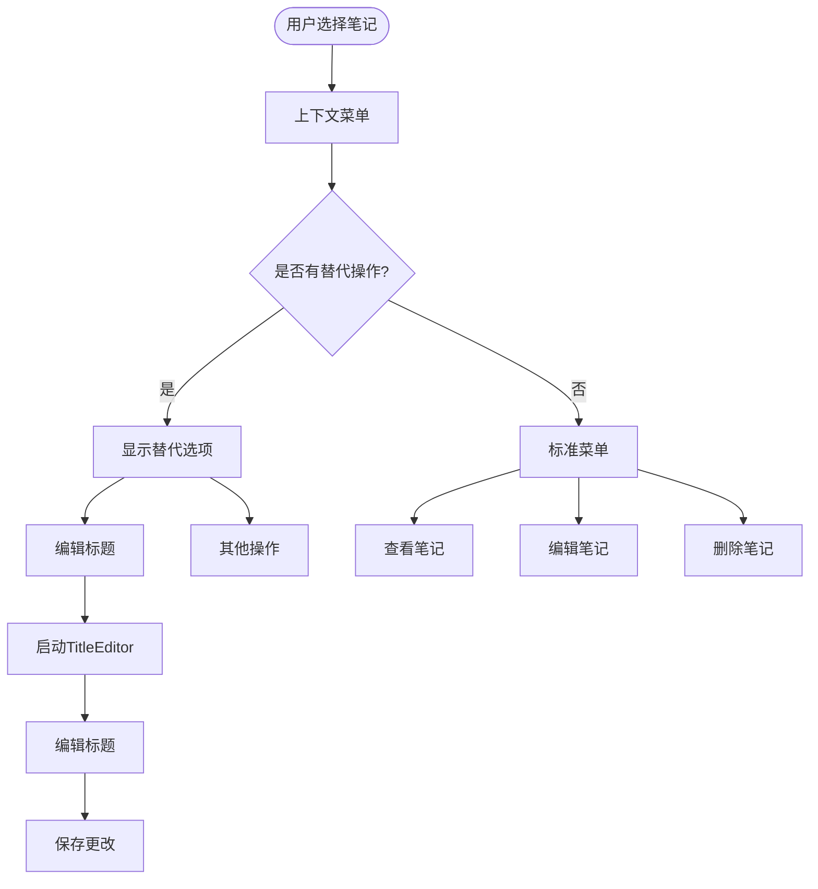
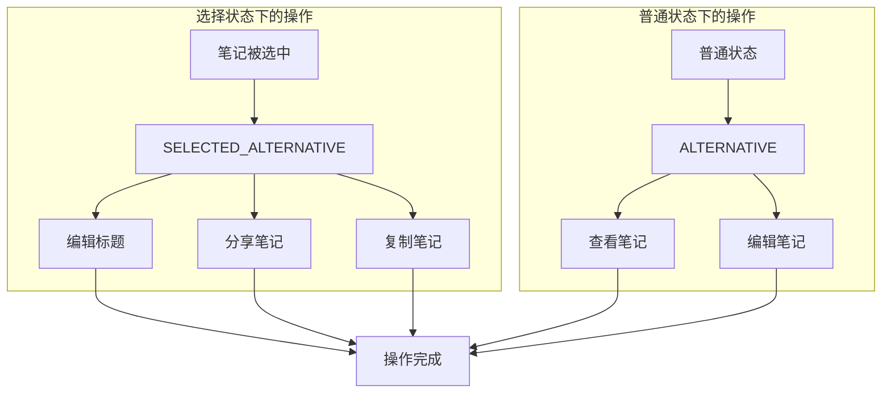
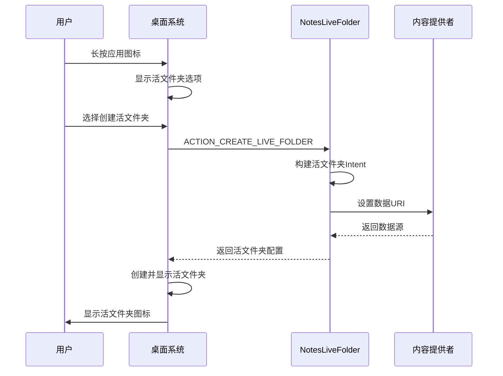

# NotePad应用Intent集成机制完整文档

<cite>
**本文档引用的文件**
- [AndroidManifest.xml](file://app/src/main/AndroidManifest.xml)
- [TitleEditor.java](file://app/src/main/java/com/example/android/notepad/TitleEditor.java)
- [NotesLiveFolder.java](file://app/src/main/java/com/example/android/notepad/NotesLiveFolder.java)
- [NoteEditor.java](file://app/src/main/java/com/example/android/notepad/NoteEditor.java)
- [NotePad.java](file://app/src/main/java/com/example/android/notepad/NotePad.java)
- [strings.xml](file://app/src/main/res/values/strings.xml)
</cite>

## 目录
1. [简介](#简介)
2. [项目结构概览](#项目结构概览)
3. [Intent过滤器架构](#intent过滤器架构)
4. [核心组件分析](#核心组件分析)
5. [MIME类型系统](#mime类型系统)
6. [组件间通信机制](#组件间通信机制)
7. [功能扩展机制](#功能扩展机制)
8. [桌面活文件夹支持](#桌面活文件夹支持)
9. [最佳实践与优化建议](#最佳实践与优化建议)
10. [总结](#总结)

## 简介

NotePad应用是一个典型的Android演示应用，展示了Intent集成机制的强大功能。通过精心设计的Intent过滤器，该应用实现了与其他应用的无缝集成，支持笔记的查看、编辑、创建等多种操作。本文档将深入解析其Intent集成机制，包括多种Intent过滤器的设计原理、MIME类型的使用、组件间通信方式以及功能扩展机制。

## 项目结构概览

NotePad应用采用标准的Android项目结构，主要包含以下核心组件：



**图表来源**
- [AndroidManifest.xml](file://app/src/main/AndroidManifest.xml#L22-L118)
- [NotePad.java](file://app/src/main/java/com/example/android/notepad/NotePad.java#L28-L155)

**章节来源**
- [AndroidManifest.xml](file://app/src/main/AndroidManifest.xml#L1-L119)
- [NotePad.java](file://app/src/main/java/com/example/android/notepad/NotePad.java#L1-L155)

## Intent过滤器架构

### LAUNCHER类别实现应用启动

AndroidManifest.xml中的第一个Intent过滤器专门用于应用启动：



**图表来源**
- [AndroidManifest.xml](file://app/src/main/AndroidManifest.xml#L34-L38)

### VIEW/EDIT操作支持

NotesList活动支持多种数据操作：

| 操作类型 | 动作名称 | MIME类型 | 使用场景 |
|---------|---------|---------|---------|
| 查看笔记 | VIEW | vnd.android.cursor.dir/vnd.google.note | 显示笔记列表 |
| 编辑笔记 | EDIT | vnd.android.cursor.dir/vnd.google.note | 批量编辑笔记 |
| 选择笔记 | PICK | vnd.android.cursor.dir/vnd.google.note | 笔记选择器模式 |
| 获取内容 | GET_CONTENT | vnd.android.cursor.item/vnd.google.note | 单个笔记内容获取 |

### GET_CONTENT用于内容选择

GET_CONTENT过滤器为外部应用提供了选择单个笔记的能力：



**图表来源**
- [AndroidManifest.xml](file://app/src/main/AndroidManifest.xml#L46-L50)

**章节来源**
- [AndroidManifest.xml](file://app/src/main/AndroidManifest.xml#L34-L50)

## 核心组件分析

### NotesList活动的Intent处理

NotesList活动通过多个Intent过滤器支持不同的操作模式：



**图表来源**
- [AndroidManifest.xml](file://app/src/main/AndroidManifest.xml#L34-L50)

### NoteEditor活动的功能扩展

NoteEditor活动支持多种编辑操作：

| 操作 | 动作 | 处理逻辑 |
|------|------|---------|
| VIEW | 查看笔记 | 从URI加载笔记内容 |
| EDIT | 编辑笔记 | 加载现有笔记进行修改 |
| INSERT | 创建笔记 | 插入空笔记记录 |
| PASTE | 粘贴笔记 | 从剪贴板创建新笔记 |
| 自定义编辑 | EDIT_NOTE | 特定的编辑操作 |

**章节来源**
- [AndroidManifest.xml](file://app/src/main/AndroidManifest.xml#L53-L77)
- [NoteEditor.java](file://app/src/main/java/com/example/android/notepad/NoteEditor.java#L140-L200)

## MIME类型系统

### MIME类型定义与用途

NotePad应用使用了标准化的MIME类型来标识数据类型：

```mermaid
graph LR
subgraph "MIME类型层次"
Root[vnd.android.cursor.dir]
ItemRoot[vnd.android.cursor.item]
DirType[/vnd.google.note]
ItemType[/vnd.google.note]
DirMime[目录类型<br/>vnd.android.cursor.dir/vnd.google.note]
ItemMime[项目类型<br/>vnd.android.cursor.item/vnd.google.note]
end
Root --> DirType
ItemRoot --> ItemType
DirType --> DirMime
ItemType --> ItemMime
subgraph "应用场景"
List[笔记列表<br/>目录操作]
Single[单个笔记<br/>项目操作]
end
DirMime --> List
ItemMime --> Single
```

**图表来源**
- [NotePad.java](file://app/src/main/java/com/example/android/notepad/NotePad.java#L110-L119)

### MIME类型匹配机制

系统通过MIME类型确保Intent操作的正确性：



**图表来源**
- [NotePad.java](file://app/src/main/java/com/example/android/notepad/NotePad.java#L332-L352)

**章节来源**
- [NotePad.java](file://app/src/main/java/com/example/android/notepad/NotePad.java#L110-L119)

## 组件间通信机制

### URI传递机制

NotePad应用通过统一资源标识符(URI)实现组件间的数据传递：



**图表来源**
- [NoteEditor.java](file://app/src/main/java/com/example/android/notepad/NoteEditor.java#L160-L170)

### TitleEditor的ALTERNATIVE功能

TitleEditor通过ALTERNATIVE和SELECTED_ALTERNATIVE类别实现功能扩展：



**图表来源**
- [TitleEditor.java](file://app/src/main/java/com/example/android/notepad/TitleEditor.java#L39-L41)
- [AndroidManifest.xml](file://app/src/main/AndroidManifest.xml#L80-L105)

**章节来源**
- [TitleEditor.java](file://app/src/main/java/com/example/android/notepad/TitleEditor.java#L1-L168)
- [AndroidManifest.xml](file://app/src/main/AndroidManifest.xml#L80-L105)

## 功能扩展机制

### ALTERNATIVE类别的工作原理

ALTERNATIVE类别允许其他应用发现并调用TitleEditor的功能：



**图表来源**
- [NoteEditor.java](file://app/src/main/java/com/example/android/notepad/NoteEditor.java#L389-L408)

### SELECTED_ALTERNATIVE的特殊作用

SELECTED_ALTERNATIVE类别在用户选择特定数据时提供额外的操作选项：



**章节来源**
- [AndroidManifest.xml](file://app/src/main/AndroidManifest.xml#L97-L102)
- [NoteEditor.java](file://app/src/main/java/com/example/android/notepad/NoteEditor.java#L399-L405)

## 桌面活文件夹支持

### CREATE_LIVE_FOLDER动作

NotesLiveFolder活动通过CREATE_LIVE_FOLDER动作支持桌面活文件夹功能：



**图表来源**
- [NotesLiveFolder.java](file://app/src/main/java/com/example/android/notepad/NotesLiveFolder.java#L37-L113)

### 活文件夹配置详解

活文件夹的配置包含了完整的用户界面和交互逻辑：

| 配置项 | 值 | 说明 |
|--------|-----|------|
| URI模式 | NotePad.Notes.LIVE_FOLDER_URI | 指向笔记数据源 |
| 显示名称 | R.string.live_folder_name | 活文件夹标题 |
| 图标资源 | R.drawable.live_folder_notes | 活文件夹图标 |
| 显示模式 | DISPLAY_MODE_LIST | 列表视图模式 |
| 基础Intent | Intent.ACTION_EDIT | 点击项目时的基础操作 |

**章节来源**
- [NotesLiveFolder.java](file://app/src/main/java/com/example/android/notepad/NotesLiveFolder.java#L1-L114)
- [AndroidManifest.xml](file://app/src/main/AndroidManifest.xml#L108-L113)

## 最佳实践与优化建议

### Intent过滤器设计原则

1. **明确的动作定义**：每个Intent过滤器都应明确指定要处理的动作类型
2. **适当的类别设置**：根据使用场景选择合适的类别组合
3. **精确的MIME类型匹配**：使用具体而非泛化的MIME类型
4. **合理的标签配置**：为Intent过滤器提供有意义的标签描述

### 性能优化建议

1. **异步数据操作**：避免在UI线程中执行耗时的数据库操作
2. **URI权限管理**：合理配置URI权限以保护数据安全
3. **内存管理**：及时释放不再使用的Cursor对象
4. **状态保存**：正确处理Activity生命周期中的状态保存

### 安全考虑

1. **输入验证**：对所有外部输入进行严格验证
2. **权限控制**：确保只有授权的应用才能访问敏感数据
3. **数据加密**：对敏感笔记内容进行适当加密
4. **审计日志**：记录重要的数据操作以便审计

## 总结

NotePad应用的Intent集成机制展现了Android平台强大的应用间协作能力。通过精心设计的Intent过滤器、标准化的MIME类型系统和灵活的组件通信机制，该应用实现了与系统的深度集成，为用户提供了一致且丰富的用户体验。

关键特性包括：
- **多维度的Intent支持**：从应用启动到具体操作的全方位覆盖
- **标准化的数据类型**：通过MIME类型确保数据的一致性和互操作性
- **灵活的功能扩展**：通过ALTERNATIVE和SELECTED_ALTERNATIVE类别支持第三方功能集成
- **桌面级体验**：通过活文件夹提供类似桌面应用的使用体验

这种设计模式不仅适用于笔记应用，也为其他Android应用的开发提供了宝贵的参考价值。通过遵循这些最佳实践，开发者可以构建出更加开放、易用且功能丰富的Android应用。