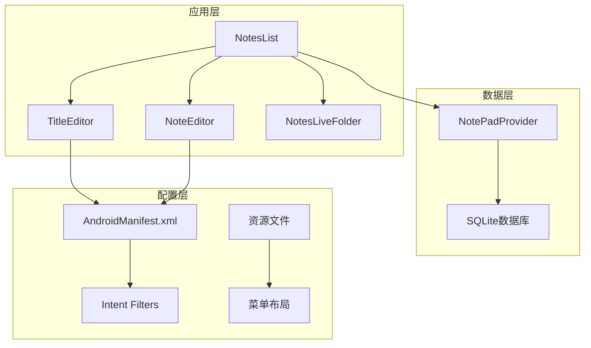
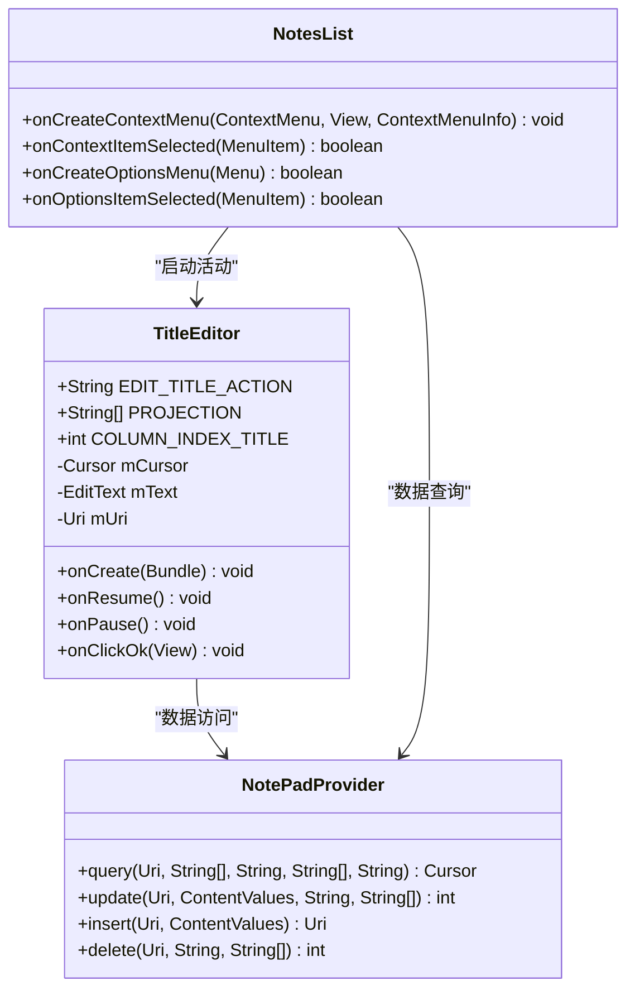
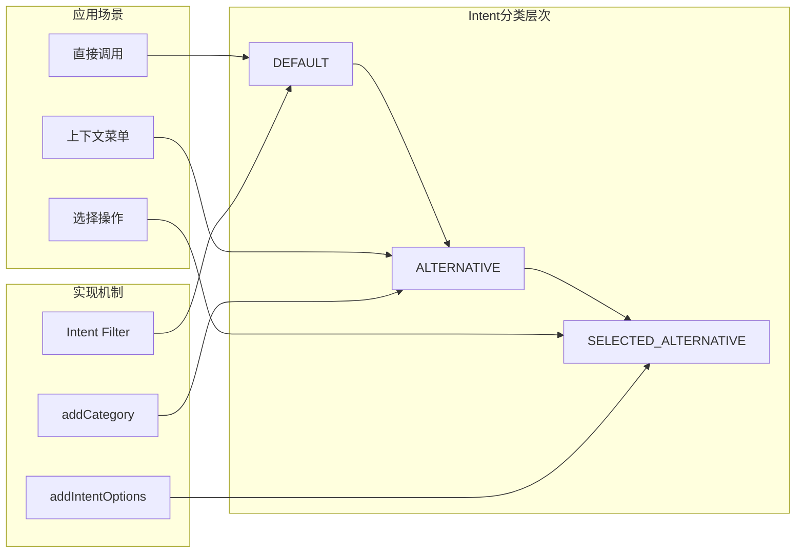
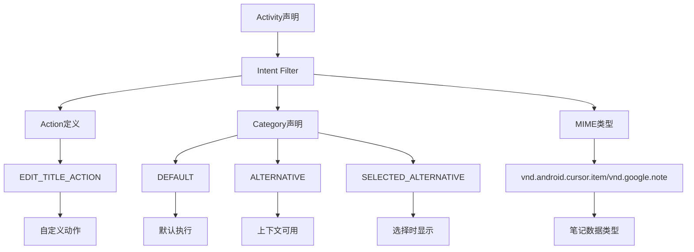
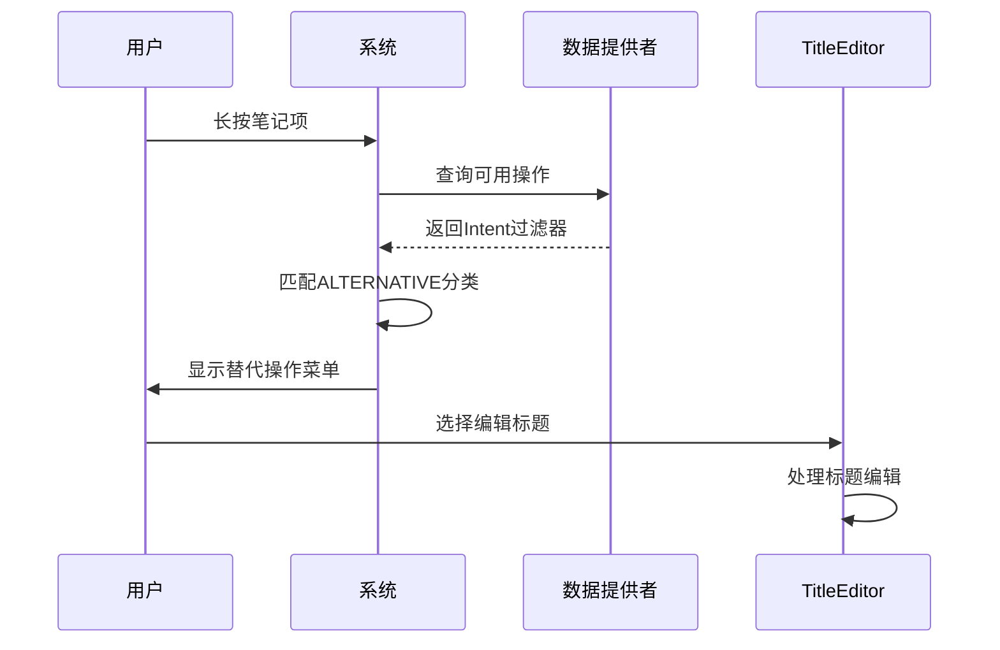
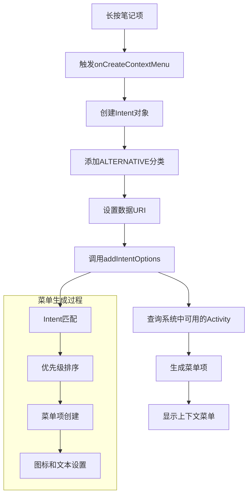
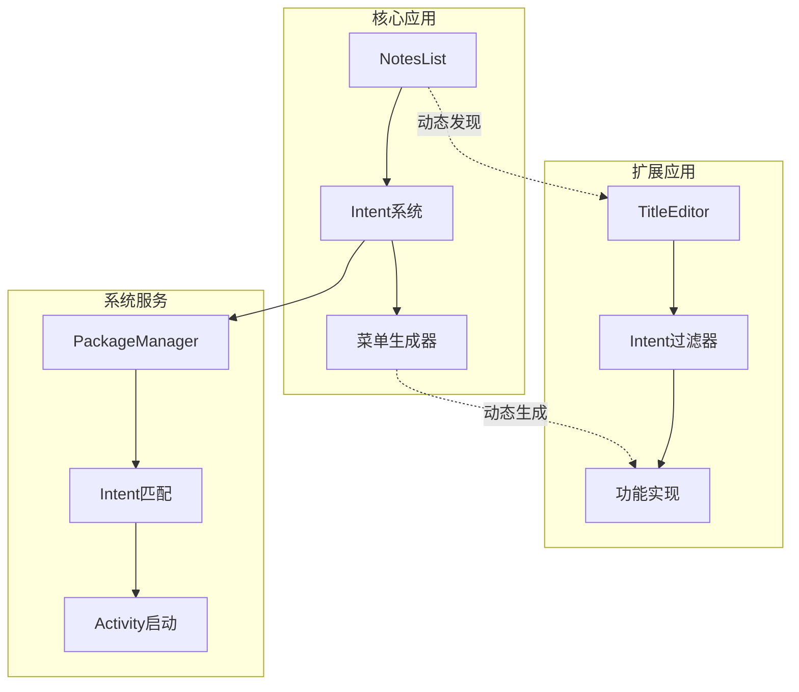
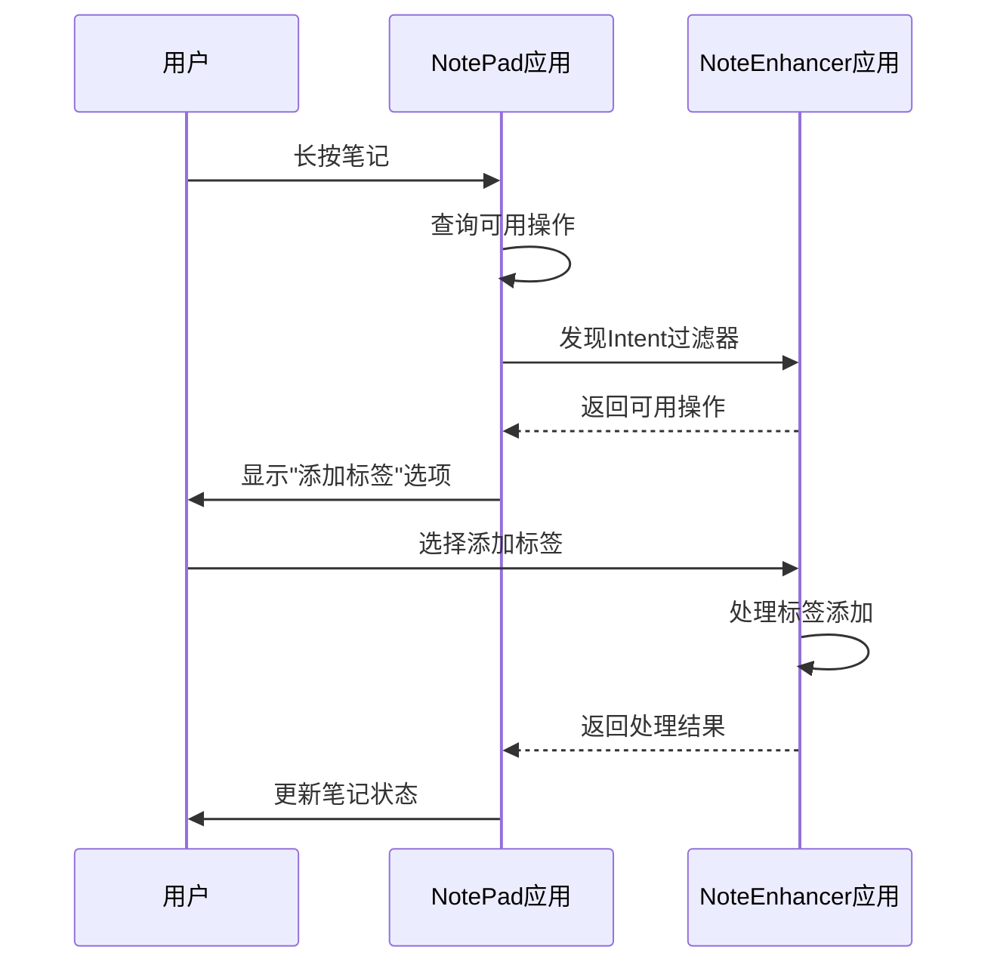
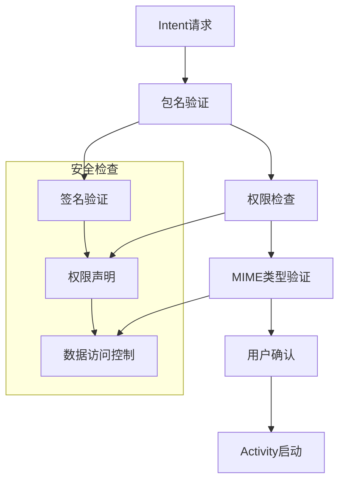

# 功能扩展点机制

<cite>
**本文档引用的文件**
- [TitleEditor.java](file://app/src/main/java/com/example/android/notepad/TitleEditor.java)
- [AndroidManifest.xml](file://app/src/main/AndroidManifest.xml)
- [NotesList.java](file://app/src/main/java/com/example/android/notepad/NotesList.java)
- [list_context_menu.xml](file://app/src/main/res/menu/list_context_menu.xml)
- [noteslist_item.xml](file://app/src/main/res/layout/noteslist_item.xml)
- [strings.xml](file://app/src/main/res/values/strings.xml)
</cite>

## 目录
1. [引言](#引言)
2. [项目结构概述](#项目结构概述)
3. [核心组件分析](#核心组件分析)
4. [功能扩展点架构](#功能扩展点架构)
5. [AndroidManifest声明机制](#androidmanifest声明机制)
6. [Intent分类机制详解](#intent分类机制详解)
7. [动态菜单生成流程](#动态菜单生成流程)
8. [插件式设计优势](#插件式设计优势)
9. [实际应用场景](#实际应用场景)
10. [安全考虑与权限控制](#安全考虑与权限控制)
11. [总结](#总结)

## 引言

Android系统提供了强大的功能扩展机制，允许第三方应用通过Intent过滤器声明自己的功能，从而与现有应用进行无缝集成。本项目通过TitleEditor组件展示了这种机制的核心实现：通过ALTERNATIVE和SELECTED_ALTERNATIVE类别，系统能够在特定上下文中发现并显示功能扩展选项。

这种设计模式体现了Android平台的开放性和可扩展性，使得应用开发者能够创建功能丰富的生态系统，而无需修改核心应用代码。

## 项目结构概述

NotePad项目采用标准的Android应用结构，主要包含以下核心模块：

**图表来源**
- [AndroidManifest.xml](file://app/src/main/AndroidManifest.xml#L34-L118)
- [NotesList.java](file://app/src/main/java/com/example/android/notepad/NotesList.java#L1-L50)

**章节来源**
- [AndroidManifest.xml](file://app/src/main/AndroidManifest.xml#L1-L119)
- [NotesList.java](file://app/src/main/java/com/example/android/notepad/NotesList.java#L1-L100)

## 核心组件分析

### TitleEditor组件

TitleEditor是项目中的核心扩展组件，负责处理笔记标题编辑功能。它通过自定义的编辑动作和Intent分类机制，实现了与其他应用的功能集成。

**图表来源**
- [TitleEditor.java](file://app/src/main/java/com/example/android/notepad/TitleEditor.java#L36-L168)
- [NotesList.java](file://app/src/main/java/com/example/android/notepad/NotesList.java#L290-L489)

**章节来源**
- [TitleEditor.java](file://app/src/main/java/com/example/android/notepad/TitleEditor.java#L1-L168)
- [NotesList.java](file://app/src/main/java/com/example/android/notepad/NotesList.java#L290-L489)

## 功能扩展点架构

### Intent分类体系

Android系统通过Intent分类机制实现了灵活的功能扩展点：

**图表来源**
- [AndroidManifest.xml](file://app/src/main/AndroidManifest.xml#L95-L102)
- [NotesList.java](file://app/src/main/java/com/example/android/notepad/NotesList.java#L307-L321)

### 扩展点识别机制

系统通过以下步骤识别和处理功能扩展点：

1. **Intent匹配**：根据Action、Category和Data类型匹配可用的Intent过滤器
2. **优先级排序**：按照系统预设的优先级对候选应用进行排序
3. **动态生成**：在运行时动态生成菜单项或对话框选项
4. **回调处理**：处理用户选择后的回调逻辑

**章节来源**
- [AndroidManifest.xml](file://app/src/main/AndroidManifest.xml#L95-L102)
- [NotesList.java](file://app/src/main/java/com/example/android/notepad/NotesList.java#L307-L321)

## AndroidManifest声明机制

### Intent过滤器配置

在AndroidManifest.xml中，功能扩展点通过Intent过滤器进行声明：

**图表来源**
- [AndroidManifest.xml](file://app/src/main/AndroidManifest.xml#L90-L104)

### 关键配置元素

| 配置项 | 值 | 作用 |
|--------|-----|------|
| Action | com.android.notepad.action.EDIT_TITLE | 定义具体的编辑动作 |
| Category | android.intent.category.DEFAULT | 允许直接调用 |
| Category | android.intent.category.ALTERNATIVE | 在上下文中显示为替代选项 |
| Category | android.intent.category.SELECTED_ALTERNATIVE | 在选择时显示 |
| Data MIME Type | vnd.android.cursor.item/vnd.google.note | 指定支持的数据类型 |

**章节来源**
- [AndroidManifest.xml](file://app/src/main/AndroidManifest.xml#L90-L104)

## Intent分类机制详解

### ALTERNATIVE分类的作用

ALTERNATIVE分类标识该Activity可以作为某个数据类型的替代操作选项：

**图表来源**
- [NotesList.java](file://app/src/main/java/com/example/android/notepad/NotesList.java#L426-L435)

### SELECTED_ALTERNATIVE分类的作用

SELECTED_ALTERNATIVE分类进一步细化了选择时机的控制：

| 分类 | 触发条件 | 使用场景 |
|------|----------|----------|
| ALTERNATIVE | 用户在上下文中操作数据 | 长按笔记项时显示 |
| SELECTED_ALTERNATIVE | 用户明确选择某项操作 | 在操作列表中显示 |

**章节来源**
- [AndroidManifest.xml](file://app/src/main/AndroidManifest.xml#L97-L102)
- [NotesList.java](file://app/src/main/java/com/example/android/notepad/NotesList.java#L426-L435)

## 动态菜单生成流程

### 上下文菜单生成

系统通过`onCreateContextMenu`方法动态生成上下文菜单：

**图表来源**
- [NotesList.java](file://app/src/main/java/com/example/android/notepad/NotesList.java#L426-L435)

### 菜单选项处理

当用户选择菜单项时，系统会：

1. **验证Intent**：检查Intent的有效性和安全性
2. **启动Activity**：使用匹配的Intent启动目标Activity
3. **传递数据**：将选中的笔记URI传递给目标Activity
4. **处理结果**：等待Activity返回结果并更新UI

**章节来源**
- [NotesList.java](file://app/src/main/java/com/example/android/notepad/NotesList.java#L426-L435)
- [NotesList.java](file://app/src/main/java/com/example/android/notepad/NotesList.java#L447-L489)

## 插件式设计优势

### 松耦合架构

这种设计模式实现了高度的模块化和松耦合：

**图表来源**
- [NotesList.java](file://app/src/main/java/com/example/android/notepad/NotesList.java#L426-L435)

### 可扩展性特征

| 特征 | 实现方式 | 优势 |
|------|----------|------|
| 动态发现 | PackageManager查询 | 无需编译时依赖 |
| 运行时加载 | Intent启动 | 支持热插拔 |
| 类型安全 | MIME类型匹配 | 防止错误调用 |
| 权限控制 | 系统级权限检查 | 保障安全性 |

### 跨应用集成能力

这种机制支持：

- **第三方应用开发**：开发者可以创建专门的笔记编辑工具
- **功能组合**：多个应用可以协同工作完成复杂任务
- **用户体验一致性**：所有应用遵循相同的Intent规范
- **版本兼容性**：新版本应用可以无缝集成到旧系统中

**章节来源**
- [AndroidManifest.xml](file://app/src/main/AndroidManifest.xml#L90-L104)
- [NotesList.java](file://app/src/main/java/com/example/android/notepad/NotesList.java#L426-L435)

## 实际应用场景

### 第三方应用集成示例

假设有一个名为"NoteEnhancer"的应用，它可以为笔记添加标签和分类功能：

### 常见使用场景

1. **笔记分享**：将笔记导出为PDF或发送到其他应用
2. **格式转换**：将Markdown笔记转换为富文本格式
3. **云同步**：将笔记同步到云端存储服务
4. **OCR识别**：从图片笔记中提取文字内容
5. **翻译功能**：自动翻译笔记内容到其他语言

### 开发者集成指南

对于想要集成到NotePad生态系统的开发者：

1. **声明Intent过滤器**：在AndroidManifest.xml中声明相应的Intent过滤器
2. **处理数据URI**：正确解析传入的笔记URI
3. **返回结果**：通过 setResult() 返回处理结果
4. **错误处理**：妥善处理各种异常情况

**章节来源**
- [AndroidManifest.xml](file://app/src/main/AndroidManifest.xml#L90-L104)
- [TitleEditor.java](file://app/src/main/java/com/example/android/notepad/TitleEditor.java#L36-L41)

## 安全考虑与权限控制

### Intent安全性机制

Android系统实施了多层安全保护：

### 权限控制策略

| 安全层级 | 控制措施 | 实现方式 |
|----------|----------|----------|
| 应用级 | 包名验证 | PackageManager检查 |
| 功能级 | 权限声明 | AndroidManifest权限 |
| 数据级 | URI权限 | grant-uri-permission |
| 用户级 | 操作确认 | 系统对话框 |

### 最佳实践建议

1. **最小权限原则**：只请求必要的权限
2. **输入验证**：严格验证传入的Intent参数
3. **输出控制**：确保返回的数据安全
4. **错误处理**：优雅处理各种异常情况
5. **日志记录**：记录关键操作以便调试

**章节来源**
- [AndroidManifest.xml](file://app/src/main/AndroidManifest.xml#L29-L32)

## 总结

Android的功能扩展点机制通过ALTERNATIVE和SELECTED_ALTERNATIVE类别，为应用间的功能集成提供了强大而灵活的解决方案。这种设计体现了Android平台的核心理念：

**技术优势**：
- **松耦合架构**：核心应用与扩展功能完全分离
- **动态发现**：运行时自动发现可用功能
- **类型安全**：通过MIME类型确保正确的功能匹配
- **用户友好**：提供直观的操作界面

**生态价值**：
- **促进创新**：鼓励第三方开发者创造新功能
- **增强体验**：为用户提供更丰富的功能选择
- **降低门槛**：简化了应用间的集成难度
- **保持统一**：维护了Android生态的一致性

这种机制不仅适用于笔记应用，也为其他类型的应用开发提供了宝贵的参考。随着Android平台的不断发展，这种设计理念将继续发挥重要作用，推动移动应用生态的繁荣发展。