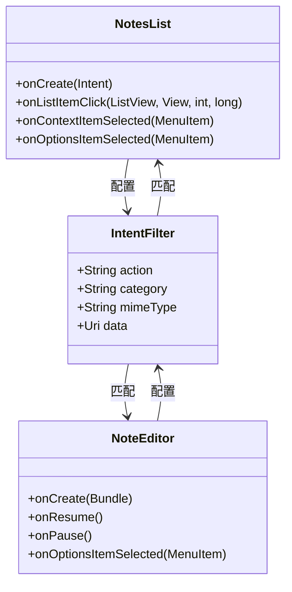
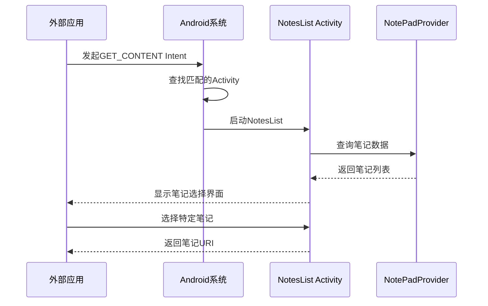
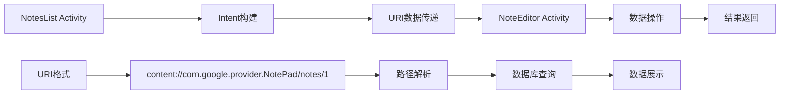
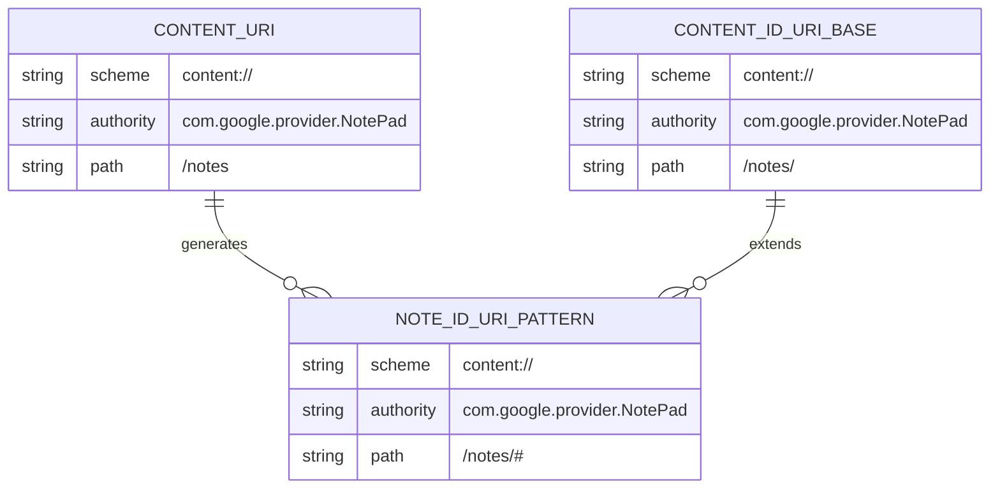
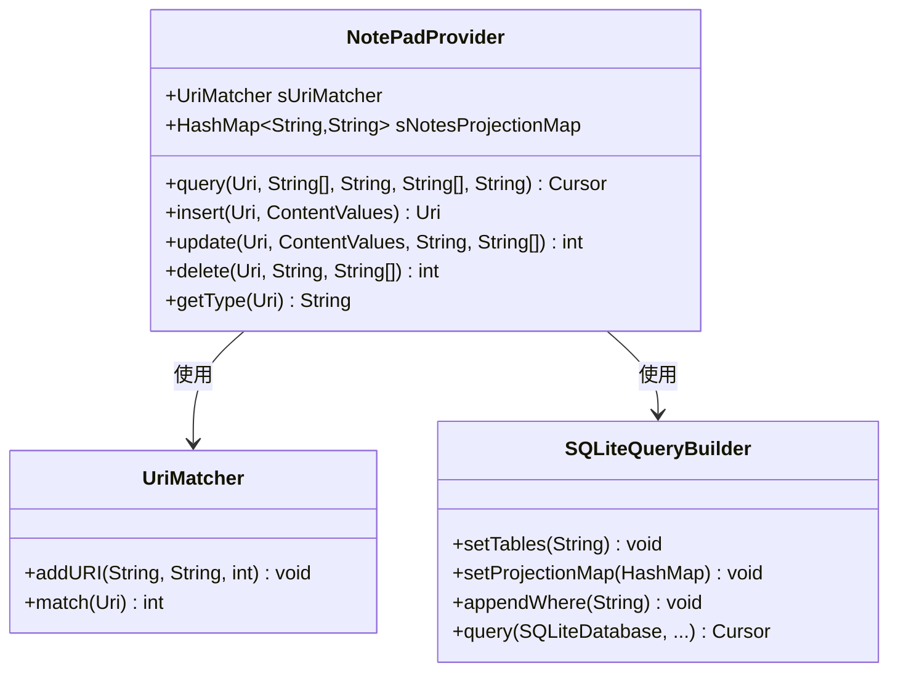
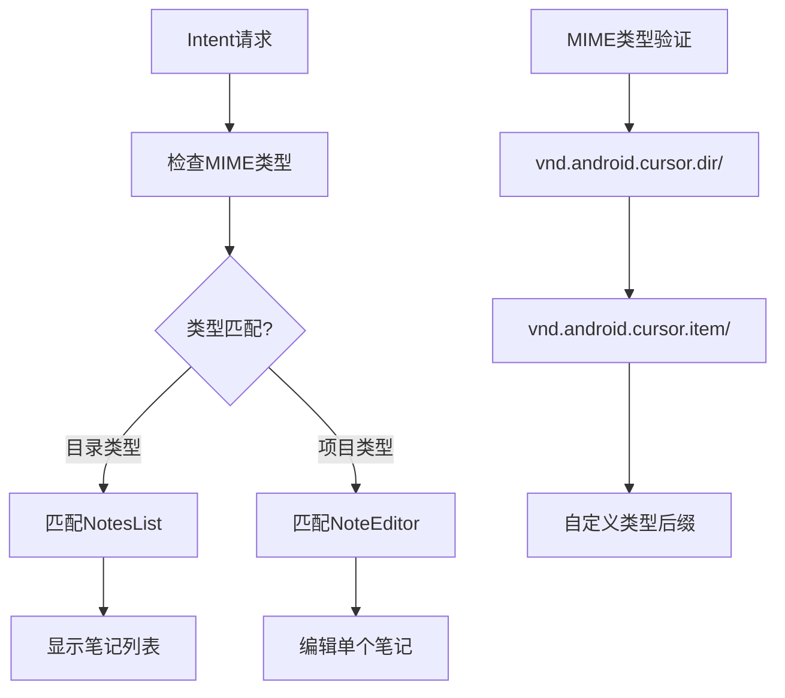
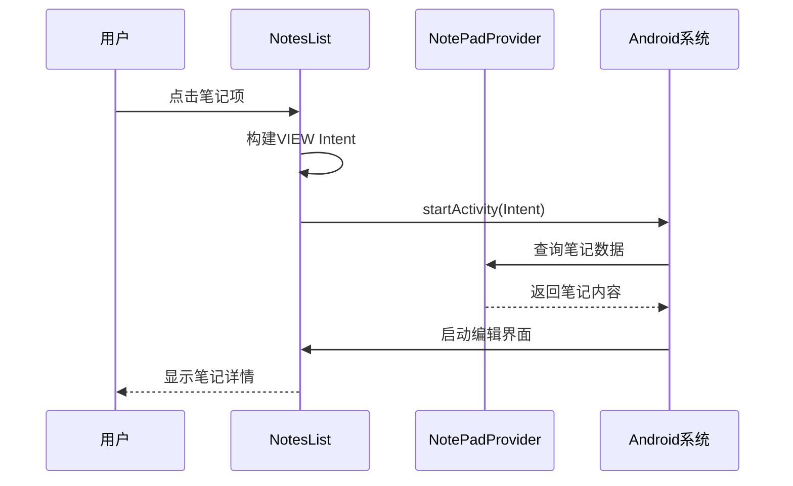
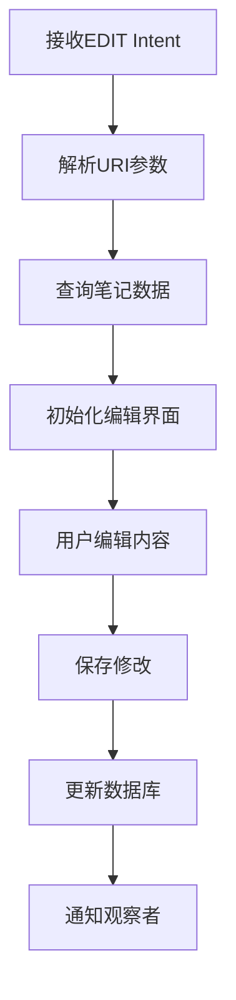
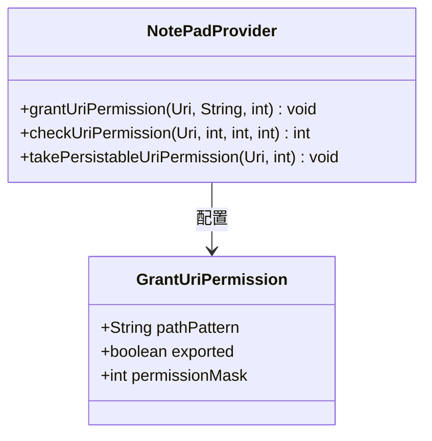

# 核心Intent机制

<cite>
**本文档引用的文件**
- [AndroidManifest.xml](file://app/src/main/AndroidManifest.xml)
- [NotesList.java](file://app/src/main/java/com/example/android/notepad/NotesList.java)
- [NoteEditor.java](file://app/src/main/java/com/example/android/notepad/NoteEditor.java)
- [NotePadProvider.java](file://app/src/main/java/com/example/android/notepad/NotePadProvider.java)
- [NotePad.java](file://app/src/main/java/com/example/android/notepad/NotePad.java)
- [NotesLiveFolder.java](file://app/src/main/java/com/example/android/notepad/NotesLiveFolder.java)
</cite>

## 目录
1. [简介](#简介)
2. [Intent机制概述](#intent机制概述)
3. [AndroidManifest.xml中的Intent过滤器配置](#androidmanifestxml中的intent过滤器配置)
4. [Activity间的Intent通信流程](#activity间的intent通信流程)
5. [URI数据传递机制](#uri数据传递机制)
6. [MIME类型匹配系统](#mime类型匹配系统)
7. [Intent操作详解](#intent操作详解)
8. [权限控制与安全机制](#权限控制与安全机制)
9. [常见问题排查](#常见问题排查)
10. [最佳实践建议](#最佳实践建议)

## 简介

NotePad应用展示了Android平台核心的Intent机制实现，通过精心设计的Intent过滤器、URI传递和MIME类型匹配，实现了灵活的应用间数据共享和操作调用。本文档深入解析了该应用中Intent机制的设计原理和实现细节。

## Intent机制概述

Intent是Android系统中用于组件间通信的核心机制，它封装了操作请求、目标组件信息和数据传递。在NotePad应用中，Intent机制主要体现在以下几个方面：

- **应用启动入口**：通过LAUNCHER类别实现应用的主入口点
- **数据操作**：支持VIEW、EDIT、INSERT等标准操作
- **内容选择**：通过GET_CONTENT实现外部应用的内容选择功能
- **跨应用协作**：允许其他应用与NotePad进行数据交互

## AndroidManifest.xml中的Intent过滤器配置

### LAUNCHER类别实现应用启动入口

```mermaid
flowchart TD
A["用户点击应用图标"] --> B["系统查找LAUNCHER类别"]
B --> C["匹配NotesList Activity"]
C --> D["启动NotesList Activity"]
D --> E["显示笔记列表界面"]
F["Intent过滤器配置"] --> G["<action android:name=\"android.intent.action.MAIN\" />"]
G --> H["<category android:name=\"android.intent.category.LAUNCHER\" />"]
H --> I["应用图标显示"]
```

**图表来源**
- [AndroidManifest.xml](file://app/src/main/AndroidManifest.xml#L34-L38)

NotesList Activity通过以下配置实现应用启动入口：

```xml
<activity android:name="NotesList" android:label="@string/title_notes_list">
    <intent-filter>
        <action android:name="android.intent.action.MAIN" />
        <category android:name="android.intent.category.LAUNCHER" />
    </intent-filter>
</activity>
```

这种配置确保：
- 应用图标出现在设备的主屏幕上
- 用户点击图标时直接启动NotesList Activity
- 系统能够识别该Activity作为应用的主要入口点

**节来源**
- [AndroidManifest.xml](file://app/src/main/AndroidManifest.xml#L34-L38)

### VIEW和EDIT操作支持



**图表来源**
- [AndroidManifest.xml](file://app/src/main/AndroidManifest.xml#L39-L50)
- [AndroidManifest.xml](file://app/src/main/AndroidManifest.xml#L60-L66)

NotesList Activity支持VIEW和EDIT操作的配置：

```xml
<intent-filter>
    <action android:name="android.intent.action.VIEW" />
    <action android:name="android.intent.action.EDIT" />
    <action android:name="android.intent.action.PICK" />
    <category android:name="android.intent.category.DEFAULT" />
    <data android:mimeType="vnd.android.cursor.dir/vnd.google.note" />
</intent-filter>
```

这些配置的作用：
- **VIEW操作**：允许外部应用请求查看笔记列表
- **EDIT操作**：支持编辑现有笔记
- **PICK操作**：允许选择单个笔记项
- **DEFAULT类别**：确保Intent能够被默认处理
- **MIME类型匹配**：精确匹配笔记目录类型

**节来源**
- [AndroidManifest.xml](file://app/src/main/AndroidManifest.xml#L39-L50)

### GET_CONTENT动作实现内容选择功能



**图表来源**
- [AndroidManifest.xml](file://app/src/main/AndroidManifest.xml#L47-L49)

GET_CONTENT操作的配置：

```xml
<intent-filter>
    <action android:name="android.intent.action.GET_CONTENT" />
    <category android:name="android.intent.category.DEFAULT" />
    <data android:mimeType="vnd.android.cursor.item/vnd.google.note" />
</intent-filter>
```

这种配置允许：
- 外部应用通过标准API请求选择笔记
- 系统自动匹配到NotesList Activity
- 提供统一的笔记选择界面
- 返回选中的笔记URI给调用者

**节来源**
- [AndroidManifest.xml](file://app/src/main/AndroidManifest.xml#L47-L49)

## Activity间的Intent通信流程

### 数据导航流程



**图表来源**
- [NotesList.java](file://app/src/main/java/com/example/android/notepad/NotesList.java#L531-L548)
- [NoteEditor.java](file://app/src/main/java/com/example/android/notepad/NoteEditor.java#L158-L190)

### 数据URI的构造和解析

NotePad应用使用标准的Content Provider URI格式：

| 组件 | 描述 | 示例值 |
|------|------|--------|
| **Scheme** | URI方案 | `content://` |
| **Authority** | 内容提供者标识 | `com.google.provider.NotePad` |
| **Path** | 数据路径 | `/notes/1` |
| **完整URI** | 最终形式 | `content://com.google.provider.NotePad/notes/1` |

URI解析过程：
1. **路径分割**：将URI按斜杠分割为各个部分
2. **参数提取**：从路径中提取笔记ID等参数
3. **数据库查询**：使用提取的参数查询对应的数据记录
4. **数据绑定**：将查询结果绑定到UI组件

**节来源**
- [NotePad.java](file://app/src/main/java/com/example/android/notepad/NotePad.java#L83-L98)
- [NotesList.java](file://app/src/main/java/com/example/android/notepad/NotesList.java#L531-L548)

## URI数据传递机制

### URI结构设计



**图表来源**
- [NotePad.java](file://app/src/main/java/com/example/android/notepad/NotePad.java#L83-L98)

### Content Provider数据访问

NotePadProvider负责处理所有URI相关的操作：



**图表来源**
- [NotePadProvider.java](file://app/src/main/java/com/example/android/notepad/NotePadProvider.java#L110-L132)

**节来源**
- [NotePadProvider.java](file://app/src/main/java/com/example/android/notepad/NotePadProvider.java#L251-L321)

## MIME类型匹配系统

### MIME类型定义

| MIME类型 | 用途 | 匹配模式 |
|----------|------|----------|
| **CONTENT_TYPE** | 笔记目录类型 | `vnd.android.cursor.dir/vnd.google.note` |
| **CONTENT_ITEM_TYPE** | 单个笔记类型 | `vnd.android.cursor.item/vnd.google.note` |

### MIME类型匹配机制



**图表来源**
- [NotePad.java](file://app/src/main/java/com/example/android/notepad/NotePad.java#L113-L119)

### 类型匹配实现

```java
// 目录类型匹配
case NOTES:
case LIVE_FOLDER_NOTES:
    return NotePad.Notes.CONTENT_TYPE;

// 项目类型匹配  
case NOTE_ID:
    return NotePad.Notes.CONTENT_ITEM_TYPE;
```

**节来源**
- [NotePadProvider.java](file://app/src/main/java/com/example/android/notepad/NotePadProvider.java#L332-L352)

## Intent操作详解

### VIEW操作：笔记查看场景



**图表来源**
- [NotesList.java](file://app/src/main/java/com/example/android/notepad/NotesList.java#L544-L548)

### EDIT操作：笔记编辑场景



**图表来源**
- [NoteEditor.java](file://app/src/main/java/com/example/android/notepad/NoteEditor.java#L158-L190)

### INSERT和PASTE操作

INSERT操作用于创建新笔记：
- 创建空笔记记录
- 返回新笔记的URI
- 启动编辑界面

PASTE操作用于从剪贴板导入：
- 检查剪贴板内容类型
- 解析笔记数据
- 创建新笔记记录

**节来源**
- [NoteEditor.java](file://app/src/main/java/com/example/android/notepad/NoteEditor.java#L164-L190)

### GET_CONTENT操作流程


**图表来源**
- [NotesList.java](file://app/src/main/java/com/example/android/notepad/NotesList.java#L537-L543)

**节来源**
- [NotesList.java](file://app/src/main/java/com/example/android/notepad/NotesList.java#L537-L548)

## 权限控制与安全机制

### URI权限管理



**图表来源**
- [AndroidManifest.xml](file://app/src/main/AndroidManifest.xml#L29-L31)

### 安全考虑

1. **URI权限授予**：通过`<grant-uri-permission>`标签精确控制权限范围
2. **路径模式匹配**：使用正则表达式限制可访问的URI路径
3. **权限验证**：在Content Provider层面进行权限检查
4. **数据隔离**：确保不同应用间的数据相互隔离

**节来源**
- [AndroidManifest.xml](file://app/src/main/AndroidManifest.xml#L29-L31)

## 常见问题排查

### Intent无法匹配问题

**问题症状**：
- 应用无法响应特定Intent
- 系统提示"没有应用可以处理此操作"

**排查步骤**：
1. **检查Intent过滤器配置**：确认Activity的Intent过滤器包含正确的action、category和data
2. **验证MIME类型**：确保发送方和接收方的MIME类型匹配
3. **检查URI格式**：验证URI是否符合预期格式
4. **测试Intent匹配**：使用adb命令测试Intent匹配

**解决方案**：
```bash
# 测试Intent匹配
adb shell dumpsys package | grep -A 10 "com.example.android.notepad"
```

### Activity启动失败

**问题症状**：
- Intent成功匹配但Activity无法启动
- 应用崩溃或无响应

**排查步骤**：
1. **检查Activity声明**：确认Activity已在AndroidManifest.xml中正确声明
2. **验证权限设置**：检查应用权限配置
3. **分析日志输出**：查看Logcat中的错误信息
4. **测试最小化案例**：创建简单的测试Activity验证基本功能

### 数据URI无效

**问题症状**：
- 无法正确解析URI参数
- 数据查询失败

**排查步骤**：
1. **验证URI格式**：检查URI是否符合Content Provider规范
2. **检查路径分割**：确认路径分割逻辑正确
3. **测试数据库连接**：验证数据库查询功能
4. **检查投影映射**：确认列名映射关系正确

## 最佳实践建议

### Intent设计原则

1. **明确语义**：为每个Intent操作指定清晰的语义
2. **一致性**：保持Intent接口的一致性
3. **向后兼容**：确保新版本与旧版本兼容
4. **安全性**：实施适当的安全控制措施

### 性能优化建议

1. **异步操作**：避免在主线程执行耗时的Intent处理
2. **缓存机制**：合理使用缓存减少重复查询
3. **资源管理**：及时释放不再需要的资源
4. **内存优化**：注意大对象的内存占用

### 错误处理策略

1. **优雅降级**：提供备用的处理方案
2. **用户反馈**：及时向用户提供错误信息
3. **日志记录**：详细记录错误信息便于调试
4. **恢复机制**：提供错误恢复的途径

### 测试建议

1. **单元测试**：测试Intent处理逻辑
2. **集成测试**：测试Activity间通信
3. **性能测试**：评估Intent处理性能
4. **兼容性测试**：验证不同Android版本的兼容性

通过深入理解和正确应用这些Intent机制，开发者可以构建出功能强大、用户体验优秀的Android应用，实现良好的应用间协作和数据共享。