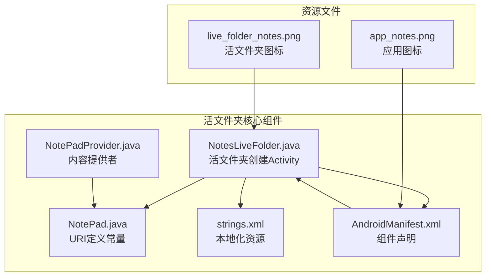
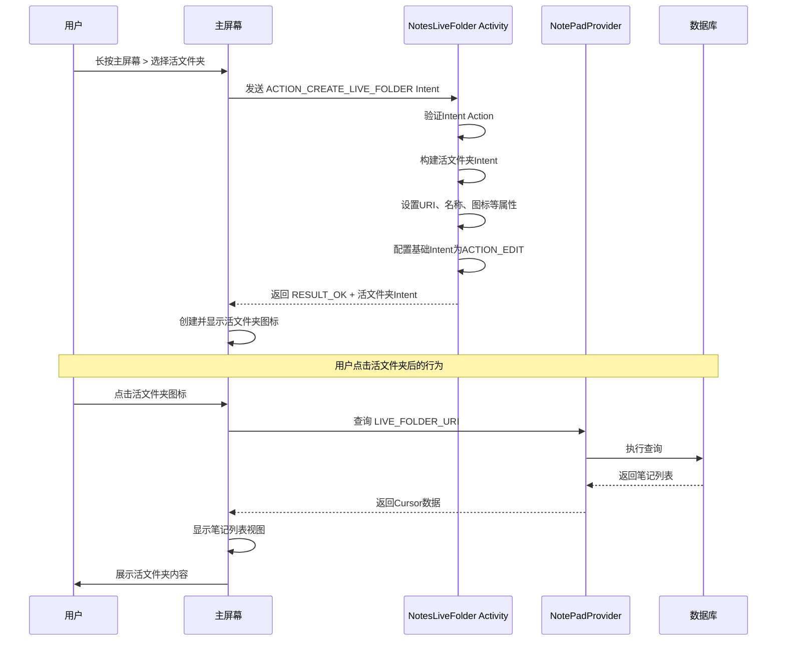
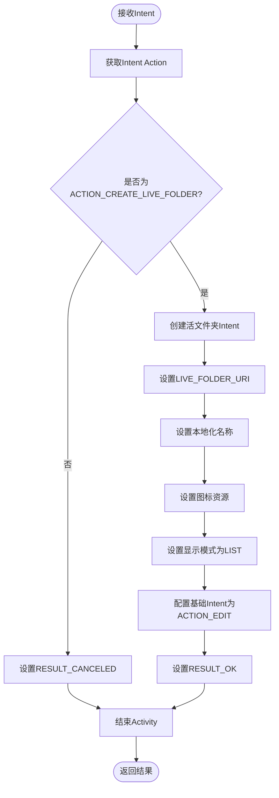
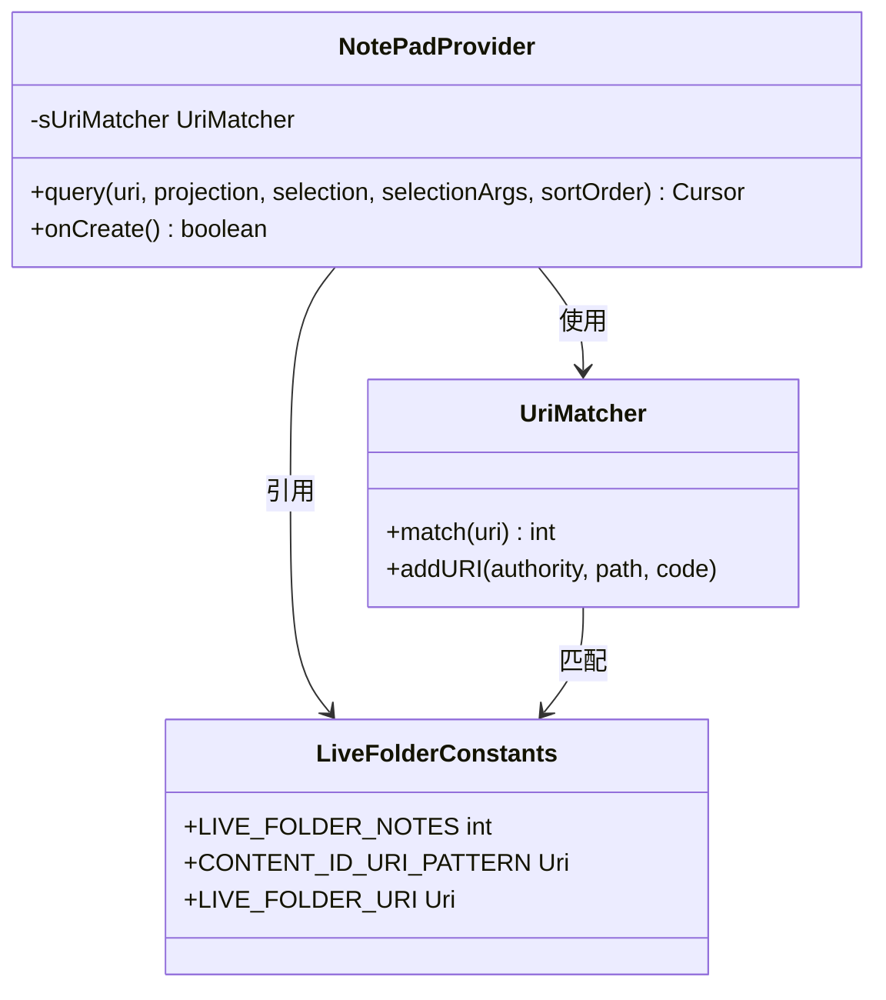
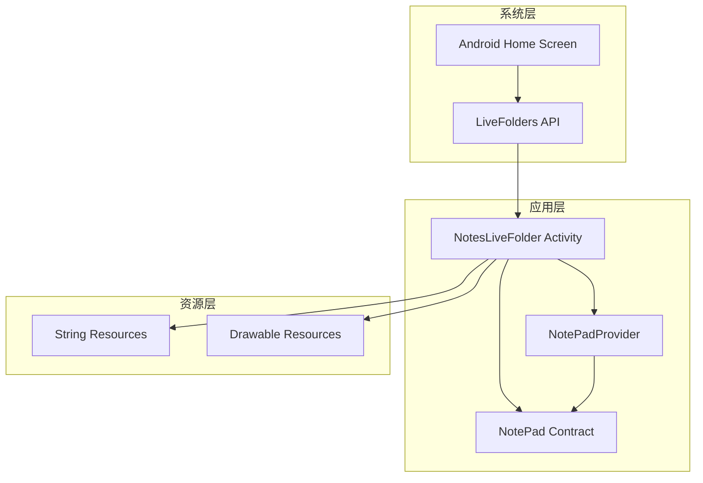

# 活文件夹支持

<cite>
**本文档中引用的文件**
- [NotesLiveFolder.java](file://app/src/main/java/com/example/android/notepad/NotesLiveFolder.java)
- [NotePad.java](file://app/src/main/java/com/example/android/notepad/NotePad.java)
- [NotePadProvider.java](file://app/src/main/java/com/example/android/notepad/NotePadProvider.java)
- [strings.xml](file://app/src/main/res/values/strings.xml)
- [AndroidManifest.xml](file://app/src/main/AndroidManifest.xml)
</cite>

## 目录
1. [简介](#简介)
2. [项目结构](#项目结构)
3. [核心组件](#核心组件)
4. [架构概览](#架构概览)
5. [详细组件分析](#详细组件分析)
6. [依赖关系分析](#依赖关系分析)
7. [性能考虑](#性能考虑)
8. [故障排除指南](#故障排除指南)
9. [结论](#结论)

## 简介

NotesLiveFolder活文件夹支持是Android系统中一个重要的用户体验增强功能，它允许用户在主屏幕创建动态的笔记文件夹快捷方式。当用户长按主屏幕并选择"活文件夹"选项时，系统会触发活文件夹创建流程，最终生成一个指向特定内容提供者的动态文件夹。

该功能的核心价值在于：
- **实时数据更新**：活文件夹中的内容会随着底层数据库的变化而自动更新
- **无缝用户体验**：用户可以直接从主屏幕访问应用内容，无需启动应用
- **高效导航**：提供了一种快速访问应用内特定内容的方式

## 项目结构

NotePad应用的活文件夹支持功能分布在以下关键文件中：



**图表来源**
- [NotesLiveFolder.java](file://app/src/main/java/com/example/android/notepad/NotesLiveFolder.java#L1-L113)
- [NotePad.java](file://app/src/main/java/com/example/android/notepad/NotePad.java#L1-L155)
- [AndroidManifest.xml](file://app/src/main/AndroidManifest.xml#L108-L114)

**章节来源**
- [NotesLiveFolder.java](file://app/src/main/java/com/example/android/notepad/NotesLiveFolder.java#L1-L113)
- [AndroidManifest.xml](file://app/src/main/AndroidManifest.xml#L108-L114)

## 核心组件

### NotesLiveFolder Activity

NotesLiveFolder是活文件夹功能的核心组件，负责响应系统创建活文件夹的Intent请求。该Activity继承自`android.app.Activity`，专门用于处理`ACTION_CREATE_LIVE_FOLDER` Intent。

主要职责包括：
- 响应系统创建活文件夹的Intent
- 构建包含活文件夹配置信息的返回Intent
- 设置活文件夹的基本属性（名称、图标、显示模式）
- 配置活文件夹的点击行为

### URI定义常量

在NotePad类中定义了活文件夹相关的URI常量：

| 常量名 | 类型 | 描述 |
|--------|------|------|
| `LIVE_FOLDER_URI` | `Uri` | 活文件夹内容提供者的URI模式 |
| `CONTENT_ID_URI_PATTERN` | `Uri` | 单个笔记的URI模式 |

### 内容提供者集成

NotePadProvider通过`LIVE_FOLDER_NOTES`匹配器处理活文件夹查询请求，使用专门的投影映射来格式化返回的数据。

**章节来源**
- [NotesLiveFolder.java](file://app/src/main/java/com/example/android/notepad/NotesLiveFolder.java#L37-L113)
- [NotePad.java](file://app/src/main/java/com/example/android/notepad/NotePad.java#L96-L104)
- [NotePadProvider.java](file://app/src/main/java/com/example/android/notepad/NotePadProvider.java#L99-L100)

## 架构概览

活文件夹支持的整体架构展示了系统级组件与应用级组件之间的交互关系：



**图表来源**
- [NotesLiveFolder.java](file://app/src/main/java/com/example/android/notepad/NotesLiveFolder.java#L47-L111)
- [NotePadProvider.java](file://app/src/main/java/com/example/android/notepad/NotePadProvider.java#L281-L284)

## 详细组件分析

### NotesLiveFolder Activity实现

#### Intent处理流程



**图表来源**
- [NotesLiveFolder.java](file://app/src/main/java/com/example/android/notepad/NotesLiveFolder.java#L47-L111)

#### 关键配置参数

活文件夹的配置通过以下关键参数实现：

| 参数 | 值 | 作用 |
|------|-----|------|
| `LIVE_FOLDER_URI` | `content://com.google.provider.NotePad/live_folders/notes` | 指定活文件夹的数据源URI |
| `EXTRA_LIVE_FOLDER_NAME` | `R.string.live_folder_name` | 设置活文件夹显示名称 |
| `EXTRA_LIVE_FOLDER_ICON` | `R.drawable.live_folder_notes` | 设置活文件夹图标资源 |
| `EXTRA_LIVE_FOLDER_DISPLAY_MODE` | `DISPLAY_MODE_LIST` | 设置显示模式为列表视图 |
| `EXTRA_LIVE_FOLDER_BASE_INTENT` | `ACTION_EDIT + CONTENT_ID_URI_PATTERN` | 配置点击后的默认操作 |

#### 本地化处理

getString(R.string.live_folder_name)方法用于获取本地化的活文件夹名称，确保应用支持多语言环境。

#### 图标资源加载

ShortcutIconResource.fromContext(this, R.drawable.live_folder_notes)方法用于从上下文中加载图标资源，支持不同密度的图标适配。

**章节来源**
- [NotesLiveFolder.java](file://app/src/main/java/com/example/android/notepad/NotesLiveFolder.java#L65-L95)
- [strings.xml](file://app/src/main/res/values/strings.xml#L19)

### 内容提供者数据处理

#### URI匹配机制



**图表来源**
- [NotePadProvider.java](file://app/src/main/java/com/example/android/notepad/NotePadProvider.java#L105-L131)
- [NotePad.java](file://app/src/main/java/com/example/android/notepad/NotePad.java#L96-L104)

#### 投影映射配置

活文件夹使用专门的投影映射来格式化返回的数据：

| 源列名 | 映射目标 | 用途 |
|--------|----------|------|
| `_ID` | `_ID AS _ID` | 提供唯一标识符 |
| `COLUMN_NAME_TITLE` | `title AS NAME` | 显示笔记标题作为名称 |

**章节来源**
- [NotePadProvider.java](file://app/src/main/java/com/example/android/notepad/NotePadProvider.java#L166-L171)
- [NotePadProvider.java](file://app/src/main/java/com/example/android/notepad/NotePadProvider.java#L281-L284)

### Manifest配置

AndroidManifest.xml中的配置确保了活文件夹功能的正确注册：

```mermaid
graph LR
subgraph "Activity声明"
A[NotesLiveFolder] --> B[android.intent.action.CREATE_LIVE_FOLDER]
A --> C[android.intent.category.DEFAULT]
end
subgraph "资源引用"
D[android:label="@string/live_folder_name"]
E[android:icon="@drawable/live_folder_notes"]
end
A --> D
A --> E
```

**图表来源**
- [AndroidManifest.xml](file://app/src/main/AndroidManifest.xml#L110-L113)

**章节来源**
- [AndroidManifest.xml](file://app/src/main/AndroidManifest.xml#L108-L114)

## 依赖关系分析

活文件夹功能涉及多个组件之间的复杂依赖关系：



**图表来源**
- [NotesLiveFolder.java](file://app/src/main/java/com/example/android/notepad/NotesLiveFolder.java#L21-L26)
- [NotePadProvider.java](file://app/src/main/java/com/example/android/notepad/NotePadProvider.java#L105-L131)

### 组件耦合度分析

| 组件对 | 耦合类型 | 耦合强度 | 说明 |
|--------|----------|----------|------|
| NotesLiveFolder ↔ NotePadProvider | 功能耦合 | 中等 | 通过URI常量进行数据交换 |
| NotesLiveFolder ↔ Strings | 资源耦合 | 低 | 依赖字符串资源进行本地化 |
| NotesLiveFolder ↔ Drawables | 资源耦合 | 低 | 依赖图标资源进行界面展示 |
| NotePadProvider ↔ Database | 数据耦合 | 高 | 直接操作SQLite数据库 |

**章节来源**
- [NotesLiveFolder.java](file://app/src/main/java/com/example/android/notepad/NotesLiveFolder.java#L19-L26)
- [NotePadProvider.java](file://app/src/main/java/com/example/android/notepad/NotePadProvider.java#L105-L131)

## 性能考虑

### 数据查询优化

活文件夹的数据查询通过以下机制优化性能：

1. **投影映射优化**：只查询必要的字段，减少内存占用
2. **URI匹配缓存**：使用UriMatcher进行高效的URI模式匹配
3. **游标通知机制**：自动监听数据变化并更新显示

### 内存管理

- 使用静态投影映射避免重复创建对象
- 及时关闭游标释放资源
- 合理使用缓存策略

### 响应时间优化

- 异步数据加载
- 渐进式渲染
- 预加载常用数据

## 故障排除指南

### 常见部署问题及解决方案

#### 问题1：图标不显示

**症状**：活文件夹创建成功但图标缺失

**可能原因**：
- 图标资源文件不存在或命名错误
- 图标文件格式不支持
- 图标文件大小超出限制

**解决方案**：
1. 检查`res/drawable/live_folder_notes.png`文件是否存在
2. 验证图标文件格式是否为PNG
3. 确保图标分辨率符合要求（建议48x48像素）

#### 问题2：文件夹无法创建

**症状**：长按主屏幕选择活文件夹后无响应

**可能原因**：
- NotesLiveFolder Activity未正确定义Intent过滤器
- 权限配置错误
- 应用签名不匹配

**解决方案**：
1. 检查AndroidManifest.xml中的Intent过滤器配置
2. 验证应用权限声明
3. 确保应用签名一致性

#### 问题3：点击后无响应

**症状**：活文件夹图标显示正常但点击无反应

**可能原因**：
- CONTENT_ID_URI_PATTERN配置错误
- NoteEditor Activity未正确定义
- 数据库查询失败

**解决方案**：
1. 验证CONTENT_ID_URI_PATTERN的URI格式
2. 检查NoteEditor Activity的Intent过滤器
3. 查看Logcat日志排查数据库错误

#### 问题4：数据不更新

**症状**：活文件夹内容不会随数据库变化而更新

**可能原因**：
- 游标通知机制未正确设置
- 数据库变更监听器失效
- 缓存策略问题

**解决方案**：
1. 确保调用`c.setNotificationUri()`方法
2. 检查数据库变更监听器配置
3. 实现适当的缓存刷新机制

### 调试技巧

1. **启用调试日志**：在NotesLiveFolder中添加日志输出
2. **检查Intent传递**：验证Intent参数的正确性
3. **监控数据库查询**：使用数据库调试工具
4. **测试不同设备**：确保兼容性

**章节来源**
- [NotesLiveFolder.java](file://app/src/main/java/com/example/android/notepad/NotesLiveFolder.java#L47-L111)
- [NotePadProvider.java](file://app/src/main/java/com/example/android/notepad/NotePadProvider.java#L281-L284)

## 结论

NotesLiveFolder活文件夹支持功能展现了Android系统中内容提供者与UI组件协作的强大能力。通过精心设计的架构，该功能实现了：

### 技术优势

1. **系统集成度高**：深度集成Android系统的活文件夹API
2. **用户体验优秀**：提供直观、响应迅速的活文件夹体验
3. **扩展性强**：基于标准的Content Provider架构，易于扩展
4. **维护成本低**：清晰的代码结构和明确的职责分工

### 最佳实践

1. **遵循Android设计规范**：正确使用LiveFolders API
2. **注重本地化支持**：通过字符串资源实现多语言支持
3. **优化资源使用**：合理管理图标和布局资源
4. **确保稳定性**：完善的错误处理和异常捕获机制

### 未来改进方向

1. **性能优化**：进一步优化数据查询和渲染性能
2. **功能扩展**：支持更多类型的活文件夹内容
3. **用户体验提升**：增加动画效果和交互反馈
4. **兼容性增强**：支持更多Android版本和设备

该活文件夹实现为Android应用开发提供了优秀的参考范例，展示了如何充分利用系统功能来提升应用的可用性和用户满意度。