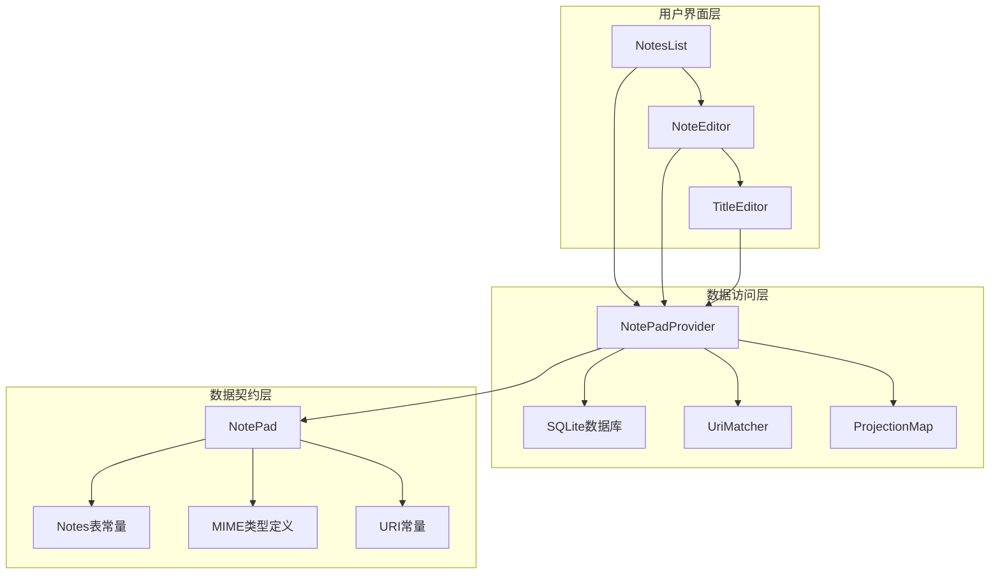
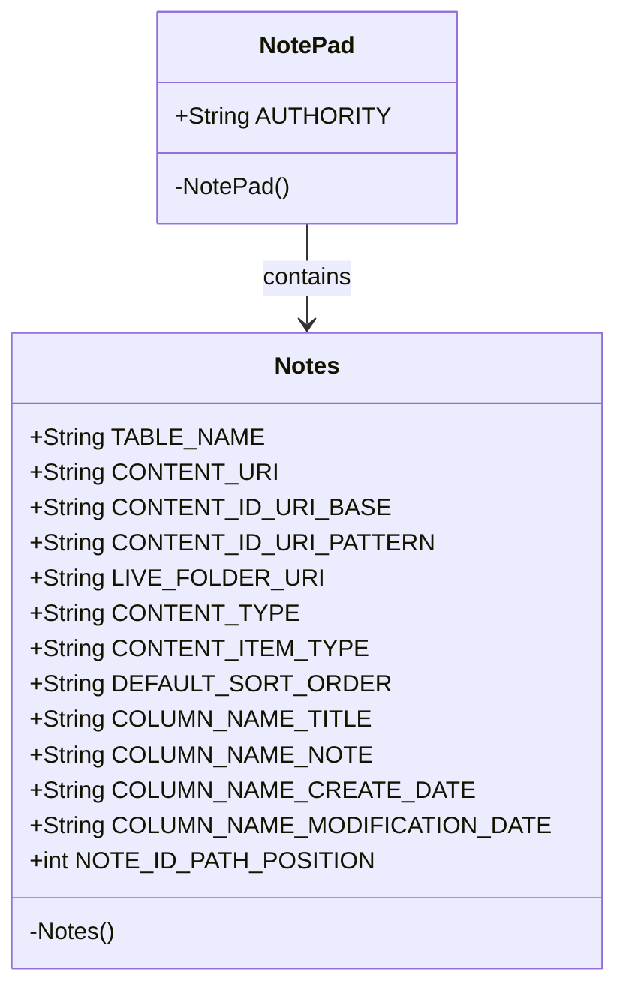
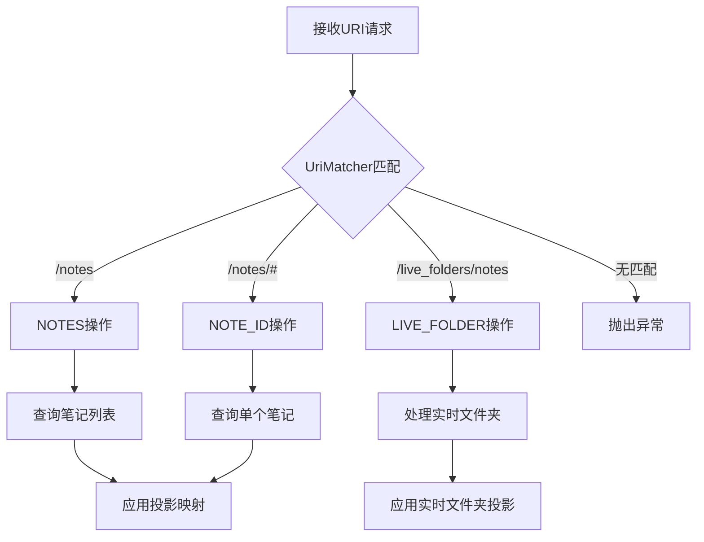
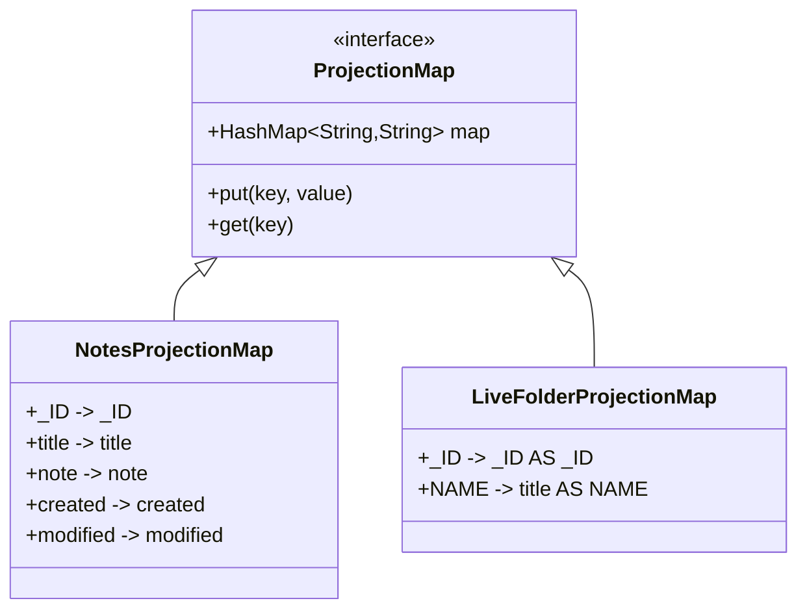
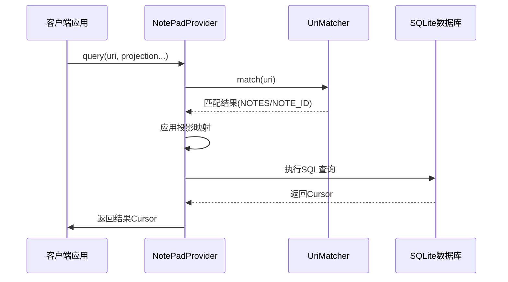
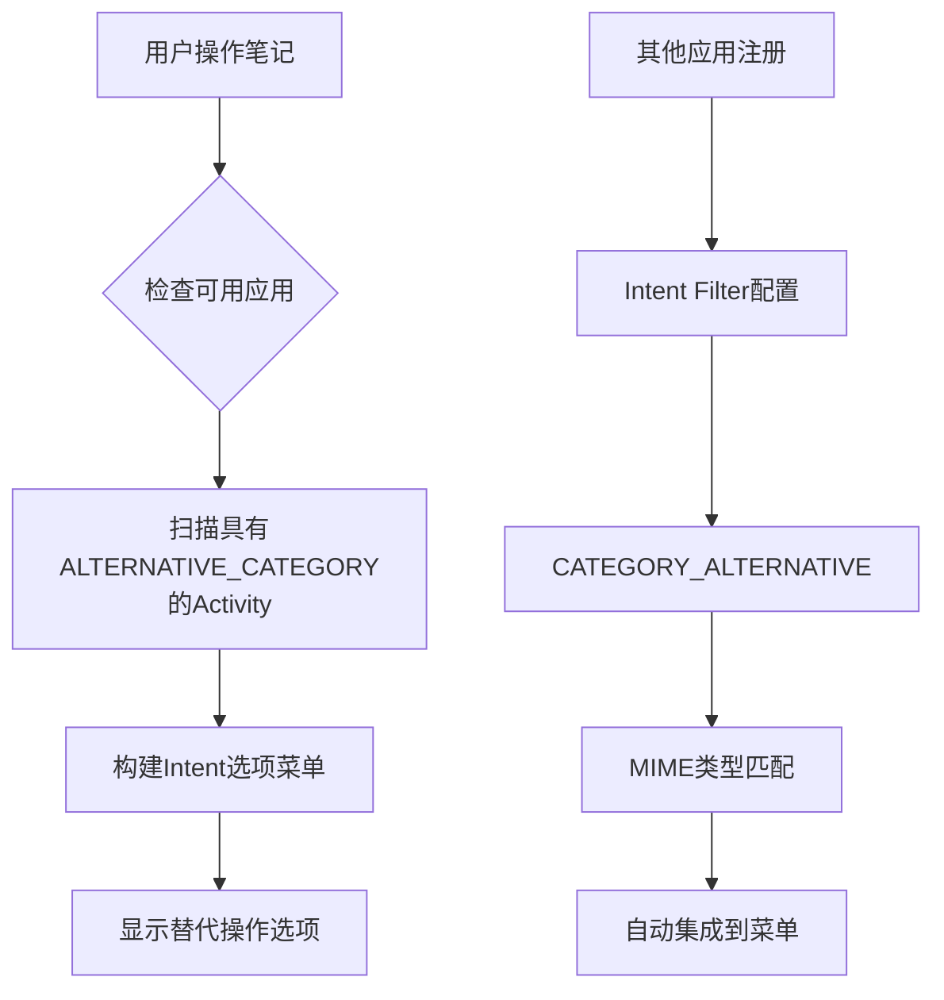
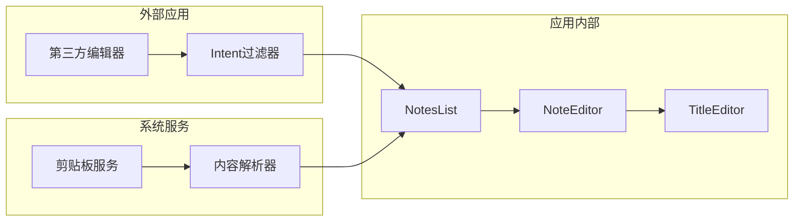

# NotePad应用关键技术模式深度解析

<cite>
**本文档中引用的文件**
- [NotePad.java](file://app/src/main/java/com/example/android/notepad/NotePad.java)
- [NotePadProvider.java](file://app/src/main/java/com/example/android/notepad/NotePadProvider.java)
- [AndroidManifest.xml](file://app/src/main/AndroidManifest.xml)
- [NotesList.java](file://app/src/main/java/com/example/android/notepad/NotesList.java)
- [NoteEditor.java](file://app/src/main/java/com/example/android/notepad/NoteEditor.java)
- [strings.xml](file://app/src/main/res/values/strings.xml)
</cite>

## 目录
1. [引言](#引言)
2. [项目架构概览](#项目架构概览)
3. [契约模式深度解析](#契约模式深度解析)
4. [Content Provider设计详解](#content-provider设计详解)
5. [Intent集成机制分析](#intent集成机制分析)
6. [最佳实践建议](#最佳实践建议)
7. [总结](#总结)

## 引言

NotePad应用是Android平台上的经典示例应用，展示了多种重要的设计模式和技术实践。本文档将深入分析该应用中的三个核心技术模式：契约模式（Contract Pattern）、Content Provider设计和Intent集成机制，为Android开发者提供全面的技术洞察和最佳实践指导。

## 项目架构概览

NotePad应用采用典型的Android三层架构设计，包含以下核心组件：



**图表来源**
- [NotePad.java](file://app/src/main/java/com/example/android/notepad/NotePad.java#L28-L155)
- [NotePadProvider.java](file://app/src/main/java/com/example/android/notepad/NotePadProvider.java#L54-L753)

**章节来源**
- [NotePad.java](file://app/src/main/java/com/example/android/notepad/NotePad.java#L1-L155)
- [NotePadProvider.java](file://app/src/main/java/com/example/android/notepad/NotePadProvider.java#L1-L753)

## 契约模式深度解析

### 契约模式的核心思想

契约模式在NotePad应用中体现为`NotePad`类的设计，它作为单一数据源定义了整个应用的数据访问规范。这种设计确保了数据访问的一致性和可维护性。

### 数据库表结构定义

`NotePad.Notes`内部类封装了笔记表的所有元数据：



**图表来源**
- [NotePad.java](file://app/src/main/java/com/example/android/notepad/NotePad.java#L38-L154)

### URI常量系统

URI常量系统提供了统一的资源定位方式：

| URI类型 | 常量名称 | URI格式 | 用途 |
|---------|----------|---------|------|
| 笔记列表URI | CONTENT_URI | content://com.google.provider.NotePad/notes | 获取所有笔记 |
| 单个笔记URI | CONTENT_ID_URI_BASE | content://com.google.provider.NotePad/notes/ | 访问特定笔记 |
| 笔记ID模式URI | CONTENT_ID_URI_PATTERN | content://com.google.provider.NotePad/notes/# | 匹配笔记ID |
| 实时文件夹URI | LIVE_FOLDER_URI | content://com.google.provider.NotePad/live_folders/notes | 实时文件夹 |

### MIME类型管理

应用定义了精确的MIME类型来标识数据内容：

- **目录类型**: `vnd.android.cursor.dir/vnd.google.note` - 表示笔记列表
- **单个项目类型**: `vnd.android.cursor.item/vnd.google.note` - 表示单个笔记

**章节来源**
- [NotePad.java](file://app/src/main/java/com/example/android/notepad/NotePad.java#L28-L155)

## Content Provider设计详解

### UriMatcher路由机制

`NotePadProvider`使用`UriMatcher`实现智能的URI路由：



**图表来源**
- [NotePadProvider.java](file://app/src/main/java/com/example/android/notepad/NotePadProvider.java#L120-L131)

### 投影映射机制

投影映射实现了灵活的列选择功能：



**图表来源**
- [NotePadProvider.java](file://app/src/main/java/com/example/android/notepad/NotePadProvider.java#L137-L172)

### 数据库操作实现

Content Provider支持完整的CRUD操作：

| 操作类型 | 方法名 | 功能描述 | URI匹配 |
|----------|--------|----------|---------|
| 查询 | query() | 根据URI获取数据 | NOTES, NOTE_ID, LIVE_FOLDER_NOTES |
| 插入 | insert() | 创建新记录 | NOTES |
| 更新 | update() | 修改现有记录 | NOTES, NOTE_ID |
| 删除 | delete() | 删除记录 | NOTES, NOTE_ID |
| 类型检查 | getType() | 返回MIME类型 | 所有URI模式 |

### 数据流控制



**图表来源**
- [NotePadProvider.java](file://app/src/main/java/com/example/android/notepad/NotePadProvider.java#L252-L321)

**章节来源**
- [NotePadProvider.java](file://app/src/main/java/com/example/android/notepad/NotePadProvider.java#L54-L753)

## Intent集成机制分析

### CATEGORY_ALTERNATIVE机制

`CATEGORY_ALTERNATIVE`允许其他应用扩展NotePad的功能：



**图表来源**
- [NotesList.java](file://app/src/main/java/com/example/android/notepad/NotesList.java#L196-L200)

### Intent过滤器配置

AndroidManifest.xml中的Intent过滤器设计：

| Activity | Action | Category | Data Type | 功能描述 |
|----------|--------|----------|-----------|----------|
| NotesList | VIEW, EDIT, PICK | DEFAULT | vnd.android.cursor.dir/vnd.google.note | 显示笔记列表 |
| NotesList | GET_CONTENT | DEFAULT | vnd.android.cursor.item/vnd.google.note | 获取笔记内容 |
| NoteEditor | VIEW, EDIT | DEFAULT | vnd.android.cursor.item/vnd.google.note | 编辑单个笔记 |
| NoteEditor | INSERT, PASTE | DEFAULT | vnd.android.cursor.dir/vnd.google.note | 创建新笔记 |
| TitleEditor | EDIT_TITLE | DEFAULT, ALTERNATIVE, SELECTED_ALTERNATIVE | vnd.android.cursor.item/vnd.google.note | 编辑笔记标题 |

### CATEGORY_SELECTED_ALTERNATIVE的作用

`CATEGORY_SELECTED_ALTERNATIVE`专门用于处理用户已选择数据的情况：

```mermaid
sequenceDiagram
participant User as 用户
participant List as NotesList
participant Menu as 菜单系统
participant Alt as 替代应用
User->>List : 长按选择笔记
List->>Menu : onCreateContextMenu()
Menu->>Menu : 添加CATEGORY_ALTERNATIVE选项
User->>Menu : 选择替代操作
Menu->>Alt : 启动替代应用
Alt->>User : 处理选中的笔记
```

**图表来源**
- [AndroidManifest.xml](file://app/src/main/AndroidManifest.xml#L90-L105)

### 组件间松耦合通信

Intent机制实现了组件间的松耦合设计：



**章节来源**
- [AndroidManifest.xml](file://app/src/main/AndroidManifest.xml#L1-L119)
- [NotesList.java](file://app/src/main/java/com/example/android/notepad/NotesList.java#L170-L336)

## 最佳实践建议

### 契约模式最佳实践

1. **单一数据源原则**
   - 将所有常量集中定义在单一类中
   - 使用静态内部类组织相关常量
   - 确保常量的不可变性（final修饰）

2. **URI设计规范**
   - 采用层次化的URI结构
   - 使用一致的命名约定
   - 提供清晰的路径语义

3. **MIME类型管理**
   - 定义精确的MIME类型
   - 区分集合和单个资源类型
   - 支持版本兼容性

### Content Provider优化策略

1. **性能优化**
   - 使用投影映射减少不必要的列加载
   - 实现适当的索引策略
   - 考虑使用异步查询处理大数据集

2. **安全性考虑**
   - 实现权限验证机制
   - 使用URI权限授予限制访问范围
   - 防止SQL注入攻击

3. **错误处理**
   - 提供详细的异常信息
   - 实现优雅的降级策略
   - 记录详细的日志信息

### Intent集成设计指南

1. **Intent过滤器配置**
   - 明确指定支持的操作类型
   - 正确设置MIME类型匹配
   - 合理使用各种Category

2. **替代操作设计**
   - 利用CATEGORY_ALTERNATIVE扩展功能
   - 支持CATEGORY_SELECTED_ALTERNATIVE处理选中数据
   - 提供清晰的用户界面提示

3. **跨应用通信**
   - 遵循Android的组件通信规范
   - 处理可能的组件不存在情况
   - 实现适当的错误恢复机制

## 总结

NotePad应用展现了Android开发中几个关键设计模式的完美结合：

1. **契约模式**通过`NotePad`类建立了统一的数据访问接口，确保了整个应用的数据一致性
2. **Content Provider设计**展示了如何构建高效、安全的数据访问层，通过UriMatcher和投影映射实现了灵活的数据操作
3. **Intent集成机制**体现了Android系统的松耦合设计理念，通过CATEGORY_ALTERNATIVE等机制实现了功能的无缝扩展

这些设计模式不仅提高了代码的可维护性和可扩展性，还为Android应用开发提供了宝贵的经验和最佳实践。开发者可以借鉴这些模式，在自己的应用中实现类似的功能和架构设计。

通过深入理解这些技术模式，开发者能够更好地把握Android应用开发的核心理念，构建出更加健壮、灵活和用户友好的应用程序。