# 契约模式深度解析：NotePad应用中的数据访问一致性设计

<cite>
**本文档中引用的文件**
- [NotePad.java](file://app/src/main/java/com/example/android/notepad/NotePad.java)
- [NotePadProvider.java](file://app/src/main/java/com/example/android/notepad/NotePadProvider.java)
- [NotesList.java](file://app/src/main/java/com/example/android/notepad/NotesList.java)
- [NoteEditor.java](file://app/src/main/java/com/example/android/notepad/NoteEditor.java)
- [strings.xml](file://app/src/main/res/values/strings.xml)
- [NotePadProviderTest.java](file://app/src/androidTest/java/com/example/android/notepad/NotePadProviderTest.java)
</cite>

## 目录
1. [引言](#引言)
2. [契约模式概述](#契约模式概述)
3. [NotePad类的架构设计](#notepad类的架构设计)
4. [核心常量定义分析](#核心常量定义分析)
5. [URI模式与路径管理](#uri模式与路径管理)
6. [MIME类型系统](#mime类型系统)
7. [排序规则实现](#排序规则实现)
8. [字段映射机制](#字段映射机制)
9. [组件间的契约关系](#组件间的契约关系)
10. [最佳实践指南](#最佳实践指南)
11. [总结](#总结)

## 引言

在Android应用开发中，数据访问的一致性和可维护性是至关重要的设计原则。NotePad应用通过实现契约模式（Contract Pattern），将数据库表结构、URI常量和MIME类型等核心配置集中在一个单一的数据源中，确保了整个应用的数据访问一致性。这种设计不仅提高了代码的可维护性，还为开发者提供了清晰的接口规范。

本文档将深入分析NotePad应用中契约模式的具体实现，探讨其设计理念和最佳实践，为Android开发者提供有价值的设计参考。

## 契约模式概述

契约模式是一种软件设计模式，它定义了一组接口或规范，确保不同组件之间能够以一致的方式进行交互。在NotePad应用中，契约模式主要体现在以下几个方面：

### 核心特征

1. **单一数据源**：所有数据访问相关的常量都集中在一个类中
2. **不可变性**：契约类采用final修饰符，防止被继承和修改
3. **完整性**：包含完整的数据访问所需的所有常量
4. **一致性**：确保所有组件使用相同的常量定义

### 设计优势

- **减少错误**：避免硬编码导致的拼写错误
- **易于维护**：修改一处即可影响所有相关组件
- **提高可读性**：清晰的命名和组织结构
- **便于测试**：提供统一的测试入口点

## NotePad类的架构设计

NotePad类作为整个应用的契约中心，采用了分层的内部类设计模式，将不同类型的数据访问常量进行逻辑分离。

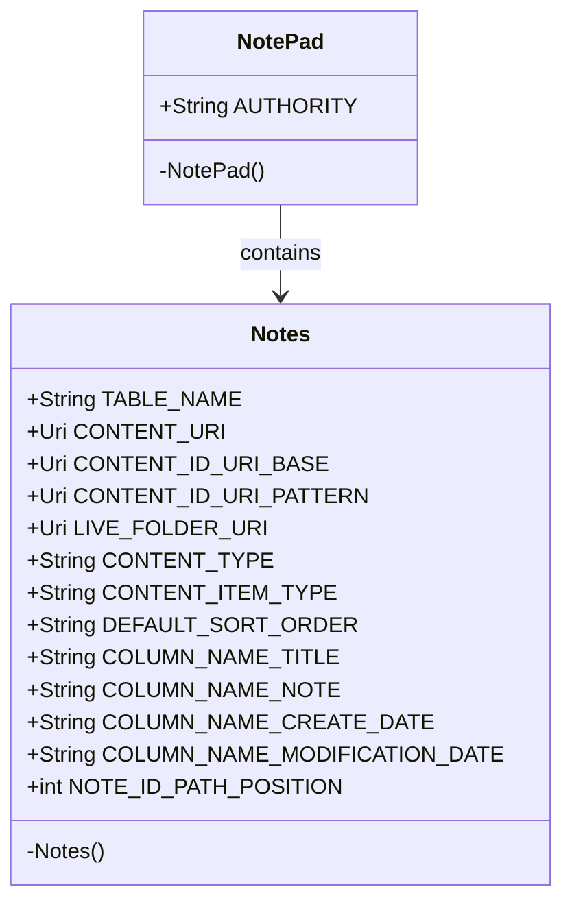

**图表来源**
- [NotePad.java](file://app/src/main/java/com/example/android/notepad/NotePad.java#L28-L154)

### 类层次结构分析

NotePad类采用以下设计原则：

1. **外部类设计**：NotePad作为顶级契约类，定义全局常量
2. **内部类封装**：Notes内部类专门处理笔记相关的常量
3. **私有构造器**：防止实例化，确保类的工具性质
4. **静态常量**：所有常量都是静态的，便于直接访问

**章节来源**
- [NotePad.java](file://app/src/main/java/com/example/android/notepad/NotePad.java#L28-L33)

## 核心常量定义分析

### AUTHORITY常量

AUTHORITY常量定义了内容提供者的唯一标识符，是整个URI体系的基础。

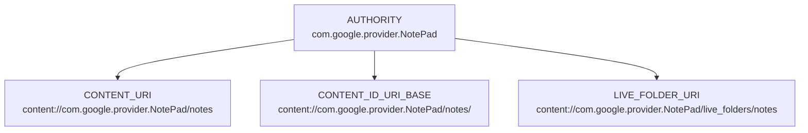

**图表来源**
- [NotePad.java](file://app/src/main/java/com/example/android/notepad/NotePad.java#L29)

### 数据库表结构定义

Notes内部类通过静态常量定义了完整的数据库表结构：

| 常量名称 | 类型 | 描述 | 约束 |
|---------|------|------|------|
| TABLE_NAME | String | 表名 | "notes" |
| COLUMN_NAME_TITLE | String | 标题列名 | TEXT类型 |
| COLUMN_NAME_NOTE | String | 内容列名 | TEXT类型 |
| COLUMN_NAME_CREATE_DATE | String | 创建时间戳 | INTEGER类型 |
| COLUMN_NAME_MODIFICATION_DATE | String | 修改时间戳 | INTEGER类型 |

**章节来源**
- [NotePad.java](file://app/src/main/java/com/example/android/notepad/NotePad.java#L46-L153)

## URI模式与路径管理

### URI构建策略

NotePad应用采用标准化的URI构建策略，确保URI的一致性和可预测性：

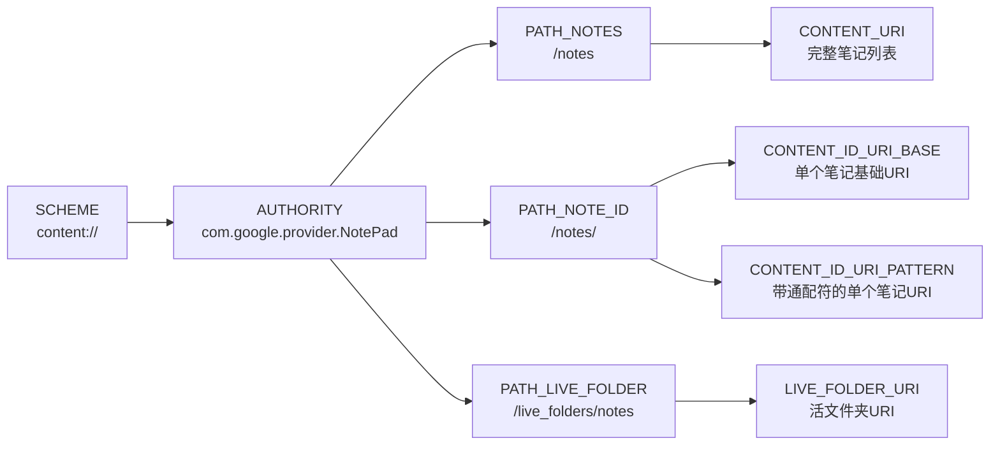

**图表来源**
- [NotePad.java](file://app/src/main/java/com/example/android/notepad/NotePad.java#L55-L98)

### 路径位置常量

NOTE_ID_PATH_POSITION常量定义了URI路径中笔记ID的位置，用于动态解析URI参数：

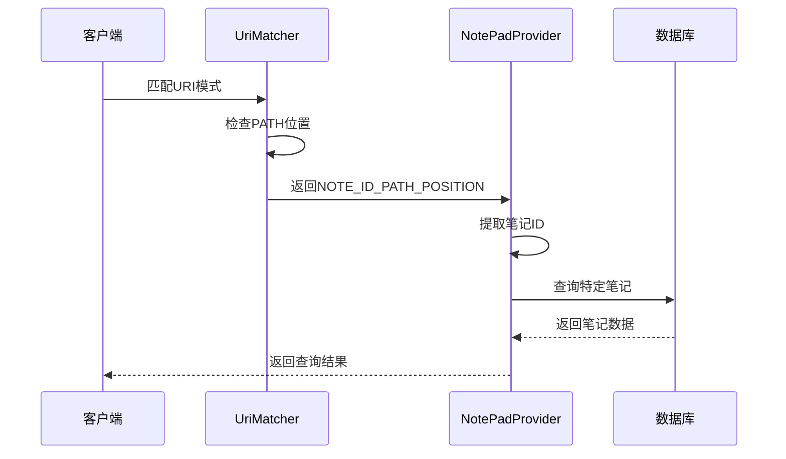

**图表来源**
- [NotePad.java](file://app/src/main/java/com/example/android/notepad/NotePad.java#L74)
- [NotePadProvider.java](file://app/src/main/java/com/example/android/notepad/NotePadProvider.java#L272-L278)

**章节来源**
- [NotePad.java](file://app/src/main/java/com/example/android/notepad/NotePad.java#L64-L98)

## MIME类型系统

### 内容类型定义

NotePad应用实现了完整的MIME类型系统，支持不同类型的数据访问需求：

| MIME类型 | 用途 | URI模式 |
|---------|------|---------|
| CONTENT_TYPE | 笔记列表目录 | `/notes` |
| CONTENT_ITEM_TYPE | 单个笔记项 | `/notes/{id}` |
| STREAM_TYPE | 文本流数据 | `/notes/{id}` |

### MIME类型匹配流程

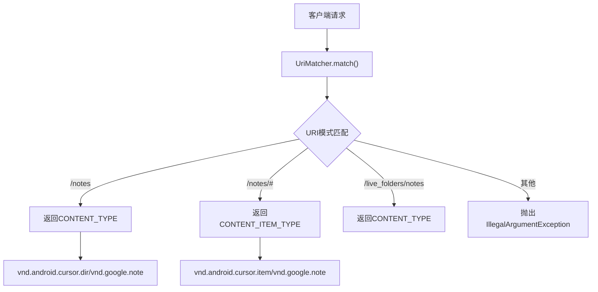

**图表来源**
- [NotePadProvider.java](file://app/src/main/java/com/example/android/notepad/NotePadProvider.java#L338-L347)

**章节来源**
- [NotePad.java](file://app/src/main/java/com/example/android/notepad/NotePad.java#L113-L119)
- [NotePadProvider.java](file://app/src/main/java/com/example/android/notepad/NotePadProvider.java#L333-L352)

## 排序规则实现

### 默认排序策略

DEFAULT_SORT_ORDER常量定义了笔记列表的默认排序规则："modified DESC"，即按照修改时间降序排列。

### 排序规则的应用场景

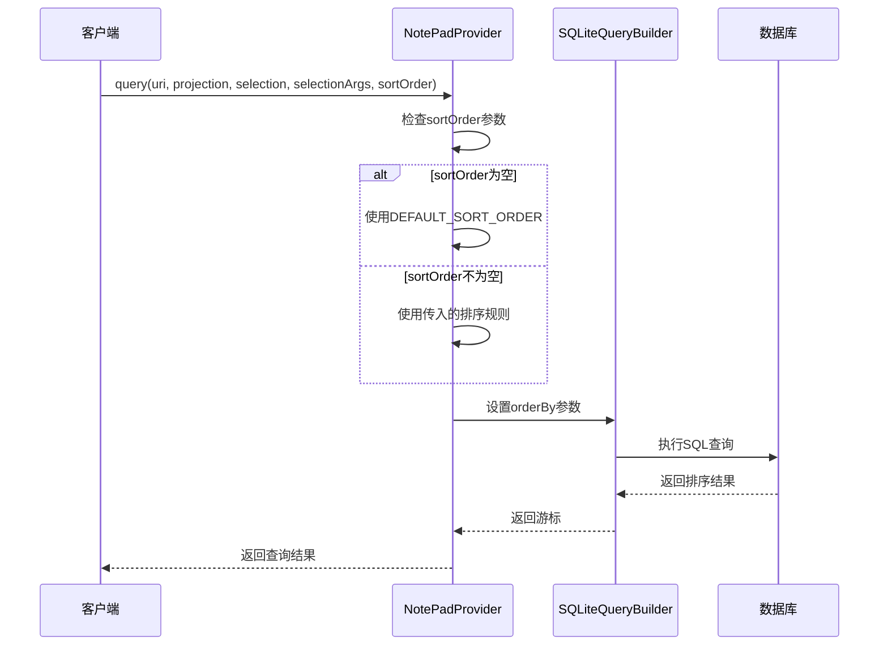

**图表来源**
- [NotePadProvider.java](file://app/src/main/java/com/example/android/notepad/NotePadProvider.java#L292-L299)

**章节来源**
- [NotePad.java](file://app/src/main/java/com/example/android/notepad/NotePad.java#L124)
- [NotePadProvider.java](file://app/src/main/java/com/example/android/notepad/NotePadProvider.java#L292-L299)

## 字段映射机制

### 投影映射表

NotePadProvider类中实现了完整的字段映射机制，确保数据库字段与应用层字段的一致性：

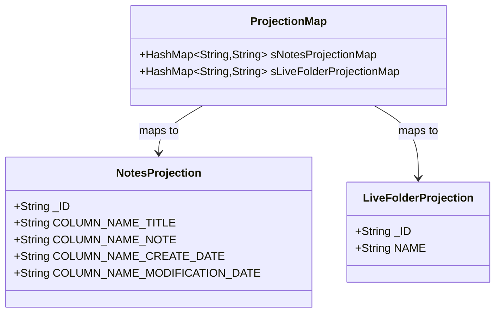

**图表来源**
- [NotePadProvider.java](file://app/src/main/java/com/example/android/notepad/NotePadProvider.java#L71-L172)

### 映射机制的优势

1. **字段重命名支持**：可以在投影中重命名数据库字段
2. **计算字段支持**：可以创建基于现有字段的计算字段
3. **权限控制**：可以限制某些字段的访问
4. **性能优化**：只选择需要的字段，减少数据传输

**章节来源**
- [NotePadProvider.java](file://app/src/main/java/com/example/android/notepad/NotePadProvider.java#L139-L171)

## 组件间的契约关系

### 主要组件的契约引用

NotePad应用中的各个组件都通过引用NotePad契约类来确保数据访问的一致性：

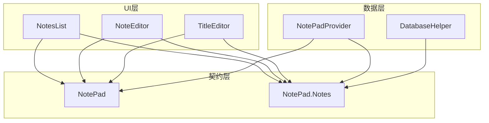

**图表来源**
- [NotesList.java](file://app/src/main/java/com/example/android/notepad/NotesList.java#L19)
- [NoteEditor.java](file://app/src/main/java/com/example/android/notepad/NoteEditor.java#L19)
- [NotePadProvider.java](file://app/src/main/java/com/example/android/notepad/NotePadProvider.java#L19)

### 具体组件的契约使用示例

#### NotesList组件的契约使用

NotesList组件通过契约类获取投影、排序规则和URI：

| 使用场景 | 契约常量 | 用途 |
|---------|---------|------|
| 数据投影 | PROJECTION数组 | 定义查询返回的字段 |
| 排序规则 | DEFAULT_SORT_ORDER | 设置默认排序 |
| URI访问 | CONTENT_URI | 访问笔记列表数据 |

#### NoteEditor组件的契约使用

NoteEditor组件在编辑操作中使用契约常量：

| 使用场景 | 契约常量 | 用途 |
|---------|---------|------|
| 数据查询 | PROJECTION数组 | 获取笔记的标题和内容 |
| 状态判断 | STATE_EDIT/STATE_INSERT | 区分编辑和插入状态 |
| URI构建 | CONTENT_ID_URI_BASE | 构建单个笔记的URI |

**章节来源**
- [NotesList.java](file://app/src/main/java/com/example/android/notepad/NotesList.java#L64-L86)
- [NoteEditor.java](file://app/src/main/java/com/example/android/notepad/NoteEditor.java#L61-L66)

## 最佳实践指南

### 设计原则

1. **单一职责原则**
   - 契约类只负责定义常量和接口
   - 不包含业务逻辑或数据处理代码

2. **开放封闭原则**
   - 契约类应该是最终的（final），防止被继承
   - 对扩展开放，可以通过添加新的常量来扩展功能

3. **依赖倒置原则**
   - 高层模块不依赖低层模块的具体实现
   - 都依赖于契约抽象

### 实现建议

#### 1. 常量组织结构

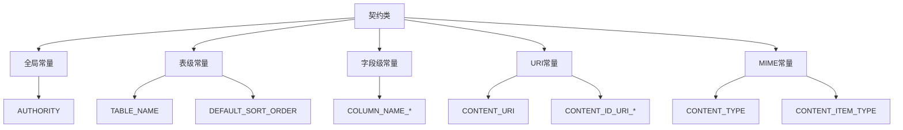

#### 2. 命名规范

- **表级别常量**：使用大写字母和下划线，如`TABLE_NAME`
- **字段级别常量**：使用`COLUMN_NAME_`前缀，如`COLUMN_NAME_TITLE`
- **URI常量**：使用描述性名称，如`CONTENT_URI`
- **MIME类型**：遵循Android标准格式

#### 3. 版本兼容性

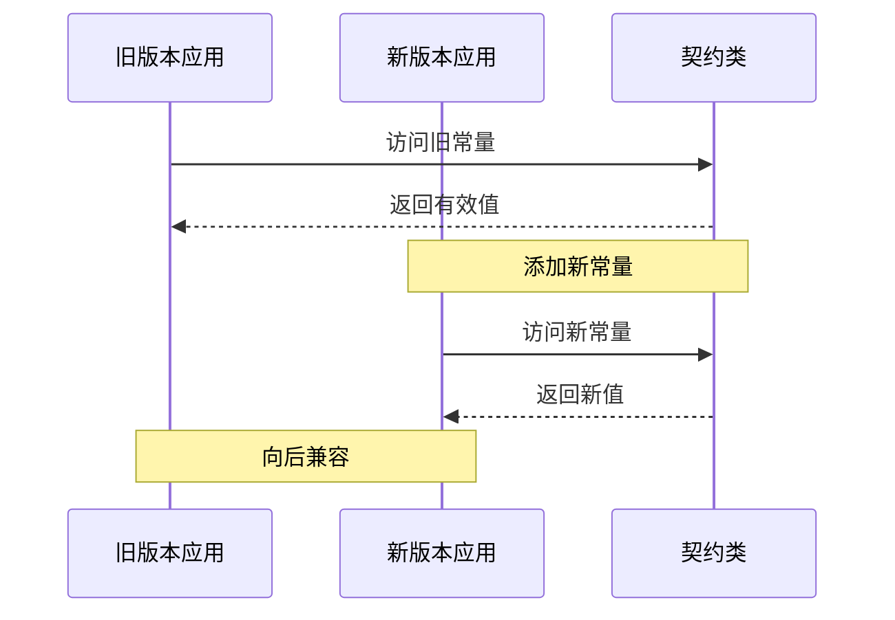

#### 4. 测试策略

契约类应该包含完整的单元测试，验证常量的有效性和一致性：

| 测试类型 | 测试内容 | 验证要点 |
|---------|---------|---------|
| 基础验证 | 常量值正确性 | 确保常量值符合预期 |
| URI验证 | URI格式正确性 | 验证URI构建的正确性 |
| MIME验证 | MIME类型匹配 | 确保MIME类型与URI匹配 |
| 连接测试 | 组件间协作 | 验证各组件正确使用契约 |

**章节来源**
- [NotePadProviderTest.java](file://app/src/androidTest/java/com/example/android/notepad/NotePadProviderTest.java#L163-L177)

### 性能考虑

1. **静态初始化**：所有常量都应该在静态块中初始化
2. **延迟加载**：对于复杂的URI构建，考虑延迟到首次使用时
3. **缓存策略**：对于频繁使用的URI，可以考虑缓存机制

### 错误处理

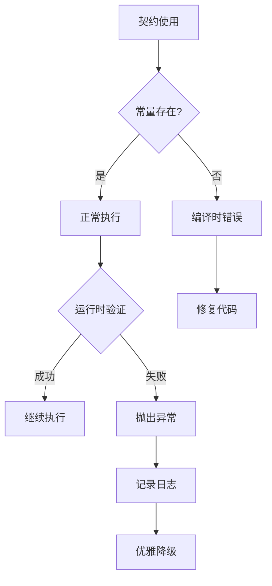

## 总结

NotePad应用中的契约模式实现展现了优秀的软件设计原则。通过将数据访问相关的所有常量集中在一个单一的契约类中，实现了以下关键目标：

### 核心价值

1. **一致性保证**：所有组件使用相同的常量定义，避免了分散的硬编码
2. **可维护性提升**：修改一处常量即可影响所有相关组件
3. **可读性增强**：清晰的命名和组织结构使代码更易理解
4. **测试友好**：提供统一的测试入口点，简化了单元测试

### 设计亮点

- **分层架构**：通过内部类实现逻辑分离
- **标准化URI**：采用content://scheme的标准化URI格式
- **完整的MIME支持**：涵盖目录和单项数据的类型定义
- **灵活的排序机制**：支持默认排序和自定义排序

### 应用建议

对于Android开发者而言，NotePad的契约模式实现提供了以下实践指导：

1. **从一开始就设计契约**：在项目初期就建立清晰的契约规范
2. **保持契约的稳定性**：避免频繁修改契约常量
3. **完善的测试覆盖**：确保契约类的正确性和一致性
4. **文档化契约内容**：为契约类编写详细的文档说明

通过深入理解和应用契约模式，开发者可以构建更加健壮、可维护和可扩展的Android应用程序。这种设计模式不仅适用于数据访问场景，也可以推广到网络请求、配置管理等多个领域，为现代移动应用开发提供坚实的设计基础。