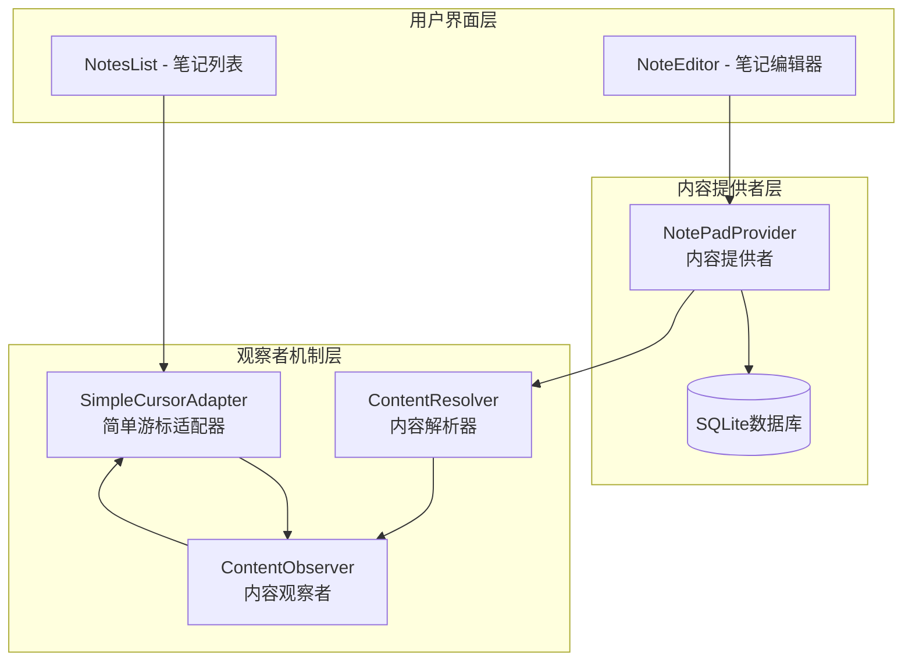
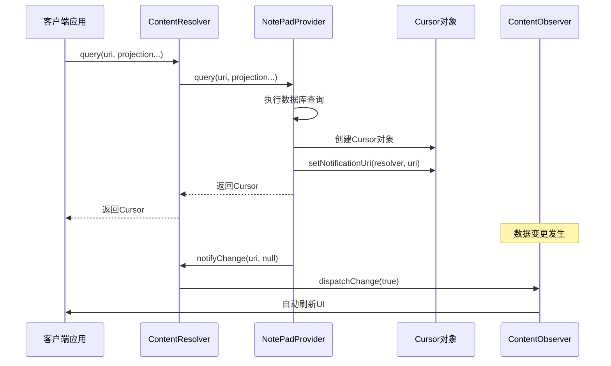
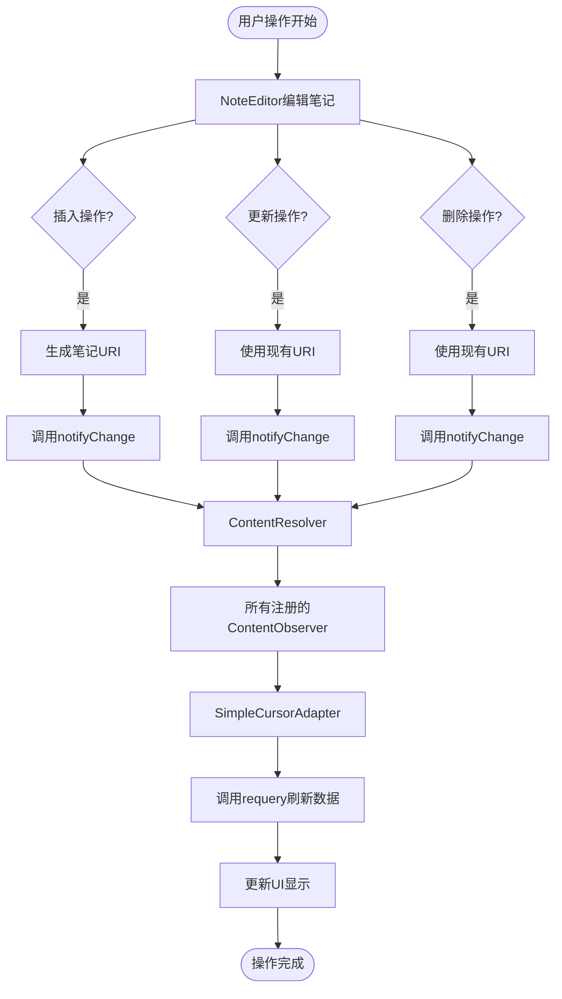
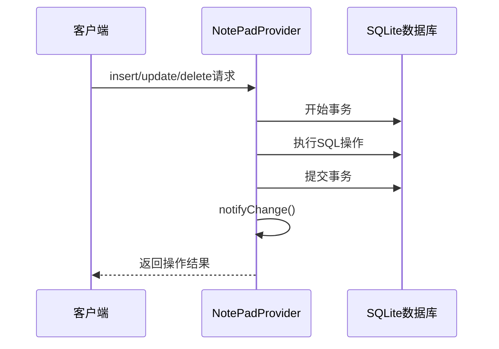

# 变更通知机制

<cite>
**本文档引用的文件**
- [NotePadProvider.java](file://app/src/main/java/com/example/android/notepad/NotePadProvider.java)
- [NotesList.java](file://app/src/main/java/com/example/android/notepad/NotesList.java)
- [NotePad.java](file://app/src/main/java/com/example/android/notepad/NotePad.java)
- [NoteEditor.java](file://app/src/main/java/com/example/android/notepad/NoteEditor.java)
- [NotePadProviderTest.java](file://app/src/androidTest/java/com/example/android/notepad/NotePadProviderTest.java)
- [AndroidManifest.xml](file://app/src/main/AndroidManifest.xml)
</cite>

## 目录
1. [概述](#概述)
2. [系统架构](#系统架构)
3. [核心组件分析](#核心组件分析)
4. [观察者模式实现](#观察者模式实现)
5. [变更通知流程](#变更通知流程)
6. [技术细节深入](#技术细节深入)
7. [性能考虑](#性能考虑)
8. [故障排除指南](#故障排除指南)
9. [总结](#总结)

## 概述

NotePad应用的变更通知机制是Android ContentProvider框架中观察者模式的典型实现。该机制通过ContentProvider的`notifyChange()`方法和SimpleCursorAdapter的ContentObserver机制，实现了数据源与UI界面之间的自动同步。当用户在NoteEditor中对笔记进行增删改操作时，系统会自动通知所有注册了相应URI观察者的组件（如NotesList），从而触发UI的自动刷新。

这种设计遵循了Android平台的设计原则，确保了数据的一致性和用户体验的流畅性。通过观察者模式，系统实现了松耦合的数据管理架构，各个组件只需要关注自己的职责，而不需要直接协调其他组件的状态。

## 系统架构

**图表来源**
- [NotePadProvider.java](file://app/src/main/java/com/example/android/notepad/NotePadProvider.java#L560-L736)
- [NotesList.java](file://app/src/main/java/com/example/android/notepad/NotesList.java#L137-L166)

**章节来源**
- [NotePadProvider.java](file://app/src/main/java/com/example/android/notepad/NotePadProvider.java#L1-L50)
- [NotesList.java](file://app/src/main/java/com/example/android/notepad/NotesList.java#L1-L50)

## 核心组件分析

### NotePadProvider - 内容提供者

NotePadProvider是整个变更通知机制的核心组件，它继承自ContentProvider并实现了PipeDataWriter接口。该类负责管理笔记数据的存储和检索，并在数据发生变更时通知相关的观察者。

#### 关键特性：
- **数据持久化**：基于SQLite数据库存储笔记数据
- **URI匹配**：使用UriMatcher处理不同类型的URI请求
- **变更通知**：在insert、update、delete操作后调用notifyChange()
- **投影映射**：维护列名到数据库字段的映射关系

#### 数据库操作方法：
- `insert()`：插入新笔记，通知URI变更
- `update()`：更新现有笔记，通知URI变更  
- `delete()`：删除笔记，通知URI变更
- `query()`：查询笔记数据，设置通知URI

**章节来源**
- [NotePadProvider.java](file://app/src/main/java/com/example/android/notepad/NotePadProvider.java#L498-L738)

### NotesList - 笔记列表界面

NotesList是主界面Activity，负责显示所有笔记的列表。它使用SimpleCursorAdapter作为ListView的适配器，并通过ContentObserver机制监听数据变更。

#### 关键特性：
- **列表显示**：使用ListView展示笔记标题和修改时间
- **搜索功能**：支持按标题或内容搜索笔记
- **上下文菜单**：提供编辑、复制、删除等操作
- **自动刷新**：通过ContentObserver自动更新列表

**章节来源**
- [NotesList.java](file://app/src/main/java/com/example/android/notepad/NotesList.java#L56-L166)

### SimpleCursorAdapter - 游标适配器

SimpleCursorAdapter是连接数据源和UI界面的重要桥梁，它不仅负责将数据库中的数据转换为视图可显示的格式，还负责注册ContentObserver来监听数据变更。

**章节来源**
- [NotesList.java](file://app/src/main/java/com/example/android/notepad/NotesList.java#L137-L166)

## 观察者模式实现

### c.setNotificationUri() 方法详解

在NotePadProvider的query()方法中，有一个关键的调用：`c.setNotificationUri(getContext().getContentResolver(), uri)`。这个方法为Cursor设置了通知URI，这是观察者模式的第一步。

**图表来源**
- [NotePadProvider.java](file://app/src/main/java/com/example/android/notepad/NotePadProvider.java#L319)
- [NotesList.java](file://app/src/main/java/com/example/android/notepad/NotesList.java#L137-L166)

### ContentObserver回调机制

SimpleCursorAdapter内部会自动注册ContentObserver来监听指定URI的数据变更。当ContentResolver收到notifyChange()调用时，会通知所有注册的观察者。

#### 注册过程：
1. SimpleCursorAdapter创建时自动注册ContentObserver
2. ContentObserver监听指定URI的所有变更
3. 当数据变更发生时，ContentObserver被触发
4. 触发后自动调用requery()重新查询数据
5. 更新UI显示最新的数据状态

**章节来源**
- [NotePadProvider.java](file://app/src/main/java/com/example/android/notepad/NotePadProvider.java#L319)
- [NotesList.java](file://app/src/main/java/com/example/android/notepad/NotesList.java#L137-L166)

## 变更通知流程

### 数据变更到UI刷新的完整流程

**图表来源**
- [NotePadProvider.java](file://app/src/main/java/com/example/android/notepad/NotePadProvider.java#L560-L736)
- [NoteEditor.java](file://app/src/main/java/com/example/android/notepad/NoteEditor.java#L572-L577)

### 具体操作步骤

#### 1. 插入操作的通知流程
当用户在NoteEditor中创建新笔记时，系统会：
1. 调用ContentResolver.insert()插入数据
2. NotePadProvider返回新笔记的URI
3. NotePadProvider调用notifyChange()通知变更
4. ContentResolver通知所有相关观察者
5. NotesList中的SimpleCursorAdapter接收到通知
6. 自动调用requery()刷新数据列表

#### 2. 更新操作的通知流程
当用户编辑现有笔记时，系统会：
1. 调用ContentResolver.update()更新数据
2. NotePadProvider更新数据库记录
3. NotePadProvider调用notifyChange()通知变更
4. ContentResolver分发通知给所有观察者
5. SimpleCursorAdapter重新查询数据
6. UI显示更新后的笔记信息

#### 3. 删除操作的通知流程
当用户删除笔记时，系统会：
1. 调用ContentResolver.delete()删除数据
2. NotePadProvider从数据库中移除记录
3. NotePadProvider调用notifyChange()通知变更
4. ContentResolver通知所有相关观察者
5. SimpleCursorAdapter刷新数据列表
6. 被删除的笔记从UI中消失

**章节来源**
- [NotePadProvider.java](file://app/src/main/java/com/example/android/notepad/NotePadProvider.java#L560-L736)
- [NoteEditor.java](file://app/src/main/java/com/example/android/notepad/NoteEditor.java#L572-L577)

## 技术细节深入

### URI设计与匹配

NotePad应用使用了精心设计的URI结构来支持不同的操作类型：

| URI模式 | 用途 | 示例 |
|---------|------|------|
| `content://com.google.provider.NotePad/notes` | 查询所有笔记 | 基础查询URI |
| `content://com.google.provider.NotePad/notes/#` | 查询特定笔记 | 包含笔记ID的URI |
| `content://com.google.provider.NotePad/live_folders/notes` | 实时文件夹URI | 动态数据源 |

### ContentProvider生命周期管理

NotePadProvider的生命周期包括以下关键阶段：

1. **初始化阶段**：onCreate()方法创建DatabaseHelper
2. **查询阶段**：query()方法处理数据查询请求
3. **变更阶段**：insert()、update()、delete()方法处理数据变更
4. **通知阶段**：notifyChange()方法通知观察者

### 数据库事务处理

为了保证数据一致性，NotePadProvider在执行插入、更新、删除操作时都使用了数据库事务：

**图表来源**
- [NotePadProvider.java](file://app/src/main/java/com/example/android/notepad/NotePadProvider.java#L543-L553)

**章节来源**
- [NotePadProvider.java](file://app/src/main/java/com/example/android/notepad/NotePadProvider.java#L231-L239)
- [NotePad.java](file://app/src/main/java/com/example/android/notepad/NotePad.java#L28-L155)

## 性能考虑

### Cursor优化策略

1. **延迟加载**：Cursor采用延迟加载机制，只有在需要时才查询数据
2. **内存管理**：及时关闭不再使用的Cursor对象
3. **批量操作**：对于大量数据的操作，考虑使用批量处理

### 观察者注册优化

1. **条件注册**：只在需要时注册ContentObserver
2. **去重处理**：避免重复注册相同的观察者
3. **生命周期管理**：在适当的生命周期阶段注册和注销观察者

### 数据库性能优化

1. **索引策略**：为常用查询字段建立索引
2. **查询优化**：使用合适的投影和过滤条件
3. **事务管理**：合理使用事务减少数据库锁定时间

## 故障排除指南

### 常见问题及解决方案

#### 1. 数据变更后UI不刷新
**症状**：在NoteEditor中编辑笔记后，NotesList没有显示最新内容
**原因**：ContentObserver没有正确注册或notifyChange()没有被调用
**解决方案**：
- 检查SimpleCursorAdapter是否正确创建
- 验证NotePadProvider的notifyChange()调用
- 确认URI匹配是否正确

#### 2. 内存泄漏问题
**症状**：长时间使用后应用出现内存不足错误
**原因**：Cursor或ContentObserver没有正确释放
**解决方案**：
- 在适当位置调用cursor.close()
- 使用managedQuery()让系统自动管理Cursor生命周期
- 在Activity销毁时注销ContentObserver

#### 3. 数据一致性问题
**症状**：不同设备间的数据不同步
**原因**：网络同步或本地缓存问题
**解决方案**：
- 检查ContentProvider的URI设计
- 验证数据变更通知的完整性
- 实现冲突解决机制

**章节来源**
- [NotePadProviderTest.java](file://app/src/androidTest/java/com/example/android/notepad/NotePadProviderTest.java#L1-L100)
- [NotesList.java](file://app/src/main/java/com/example/android/notepad/NotesList.java#L233-L256)

## 总结

NotePad应用的变更通知机制展示了Android平台ContentProvider框架的强大功能。通过观察者模式的巧妙运用，系统实现了数据源与UI界面之间的自动同步，为用户提供了流畅的使用体验。

### 关键优势

1. **松耦合设计**：各组件之间通过标准接口通信，降低了耦合度
2. **自动同步**：数据变更后UI自动更新，无需手动刷新
3. **扩展性强**：新的观察者可以轻松添加到系统中
4. **性能优化**：只在必要时通知相关组件，提高了系统效率

### 最佳实践建议

1. **合理使用URI**：设计清晰的URI结构便于管理和维护
2. **及时释放资源**：正确管理Cursor和观察者的生命周期
3. **异常处理**：在数据操作中添加适当的异常处理机制
4. **测试覆盖**：编写全面的单元测试确保变更通知机制正常工作

这种基于观察者模式的变更通知机制不仅适用于NotePad应用，也为其他Android应用开发提供了优秀的参考范例。通过理解和掌握这一机制，开发者可以构建出更加响应迅速、用户体验良好的移动应用。