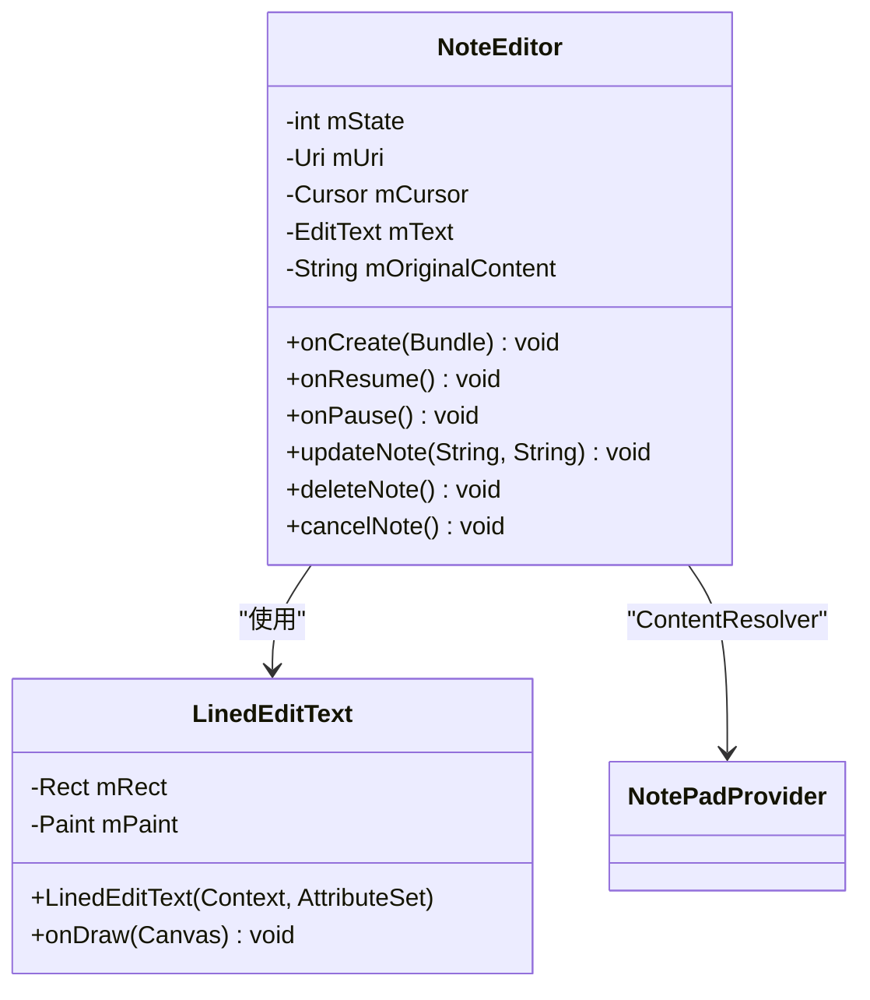
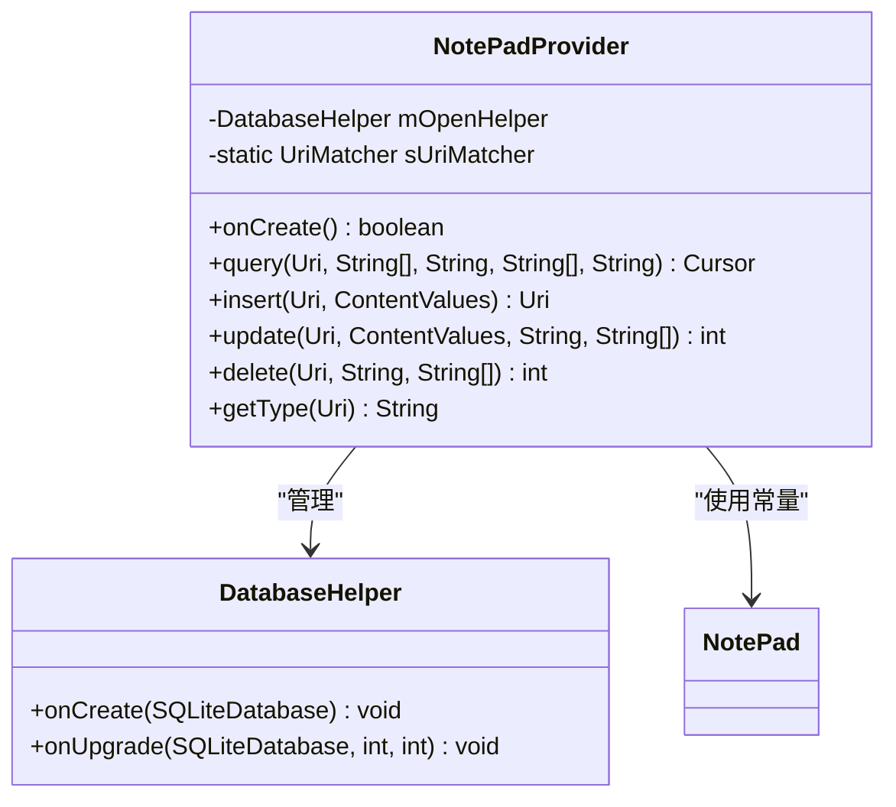
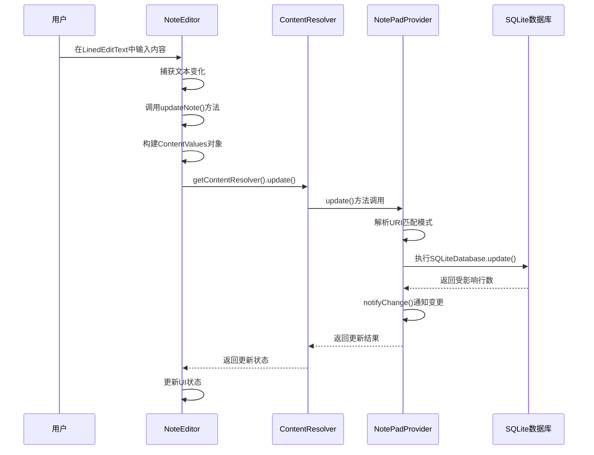
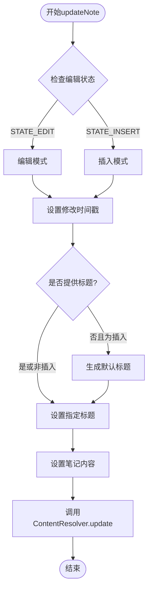
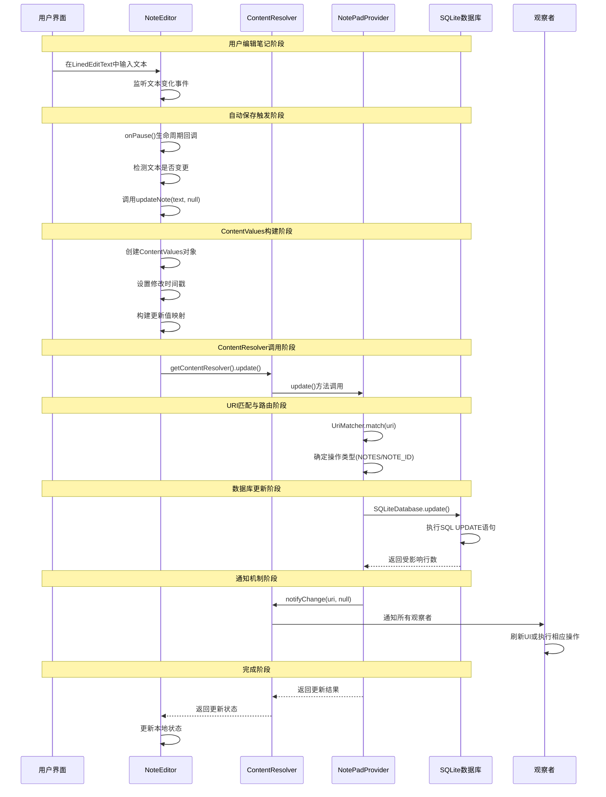
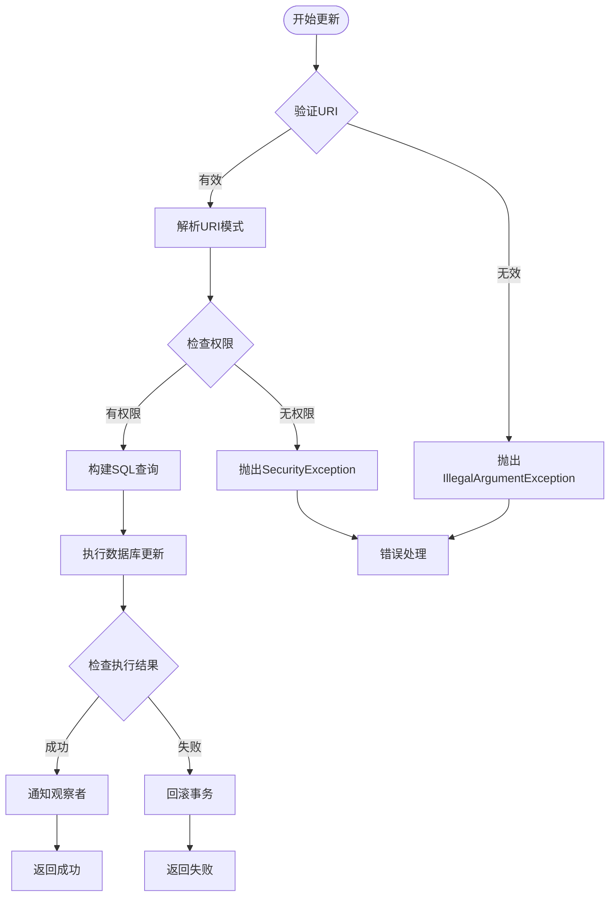

# 数据写入流

<cite>
**本文档中引用的文件**
- [NoteEditor.java](file://app/src/main/java/com/example/android/notepad/NoteEditor.java)
- [NotePadProvider.java](file://app/src/main/java/com/example/android/notepad/NotePadProvider.java)
- [NotePad.java](file://app/src/main/java/com/example/android/notepad/NotePad.java)
- [note_editor.xml](file://app/src/main/res/layout/note_editor.xml)
- [TitleEditor.java](file://app/src/main/java/com/example/android/notepad/TitleEditor.java)
</cite>

## 目录
1. [简介](#简介)
2. [项目架构概览](#项目架构概览)
3. [核心组件分析](#核心组件分析)
4. [数据写入流程详解](#数据写入流程详解)
5. [ContentValues数据封装](#contentvalues数据封装)
6. [数据库更新机制](#数据库更新机制)
7. [时序图分析](#时序图分析)
8. [性能考虑](#性能考虑)
9. [故障排除指南](#故障排除指南)
10. [总结](#总结)

## 简介

NotePad应用是一个典型的Android内容提供者(Content Provider)示例，展示了从用户界面到数据库持久化的完整数据写入流程。本文档深入分析了用户在NoteEditor中修改笔记内容到数据持久化之间的完整技术流程，重点阐述了NoteEditor中的updateNote()方法、ContentValues数据封装机制，以及NotePadProvider中update()方法的实现细节。

该应用采用标准的Android内容提供者架构，通过ContentResolver与ContentProvider的协作，实现了数据的统一管理和持久化存储。整个写入流程涉及用户交互、数据验证、ContentValues构建、数据库操作等多个环节，形成了一个完整的数据生命周期管理机制。

## 项目架构概览

NotePad应用采用了经典的Android内容提供者架构模式，主要包含以下核心组件：

```mermaid
graph TB
subgraph "用户界面层"
A[NoteEditor] --> B[LinedEditText]
C[TitleEditor] --> D[EditText]
end
subgraph "内容提供者层"
E[NotePadProvider] --> F[SQLiteOpenHelper]
E --> G[UriMatcher]
end
subgraph "数据存储层"
F --> H[SQLite数据库]
H --> I[notes表]
end
subgraph "通信机制"
J[ContentResolver] --> K[ContentProvider]
A --> J
C --> J
K --> E
end
A -.->|用户输入| B
B -.->|数据变更| A
A --> |updateNote()| J
J --> |getContentResolver().update()| E
E --> |update()| F
F --> |SQLiteDatabase| H
H --> |notifyChange()| A
```

**图表来源**
- [NoteEditor.java](file://app/src/main/java/com/example/android/notepad/NoteEditor.java#L54-L616)
- [NotePadProvider.java](file://app/src/main/java/com/example/android/notepad/NotePadProvider.java#L54-L753)
- [NotePad.java](file://app/src/main/java/com/example/android/notepad/NotePad.java#L28-L155)

**章节来源**
- [NoteEditor.java](file://app/src/main/java/com/example/android/notepad/NoteEditor.java#L1-L50)
- [NotePadProvider.java](file://app/src/main/java/com/example/android/notepad/NotePadProvider.java#L1-L50)

## 核心组件分析

### NoteEditor活动组件

NoteEditor是应用的主要编辑界面，负责处理用户的笔记编辑操作。它继承自Activity类，并包含了自定义的LinedEditText控件用于显示带网格线的文本编辑器。



**图表来源**
- [NoteEditor.java](file://app/src/main/java/com/example/android/notepad/NoteEditor.java#L54-L134)

### NotePadProvider内容提供者

NotePadProvider是应用的核心数据访问组件，实现了ContentProvider接口，负责管理笔记数据的增删改查操作。



**图表来源**
- [NotePadProvider.java](file://app/src/main/java/com/example/android/notepad/NotePadProvider.java#L54-L240)

**章节来源**
- [NoteEditor.java](file://app/src/main/java/com/example/android/notepad/NoteEditor.java#L54-L134)
- [NotePadProvider.java](file://app/src/main/java/com/example/android/notepad/NotePadProvider.java#L54-L240)

## 数据写入流程详解

### 用户输入捕获阶段

用户在NoteEditor中的编辑操作始于LinedEditText控件的文本输入。LinedEditText继承自EditText，提供了带网格线的文本编辑体验，增强了用户的书写体验。

当用户在编辑器中输入或修改内容时，这些变化会实时反映在NoteEditor的mText变量中。系统会在适当的时机（如onPause()生命周期方法）捕获这些变更。

### updateNote()方法触发

数据写入流程的核心在于updateNote()方法的调用。该方法在多个场景下被触发：

1. **用户点击保存菜单项**：用户主动选择保存当前编辑的笔记
2. **Activity暂停时自动保存**：当用户离开编辑界面时，系统自动保存更改
3. **插入新笔记后的标题设置**：在创建新笔记时同时设置标题



**图表来源**
- [NoteEditor.java](file://app/src/main/java/com/example/android/notepad/NoteEditor.java#L522-L578)
- [NotePadProvider.java](file://app/src/main/java/com/example/android/notepad/NotePadProvider.java#L668-L739)

### 数据变更检测与处理

在updateNote()方法中，系统首先检查是否有实际的数据变更。如果检测到文本内容发生变化，才会触发后续的更新操作。这种优化机制避免了不必要的数据库操作，提高了应用性能。

**章节来源**
- [NoteEditor.java](file://app/src/main/java/com/example/android/notepad/NoteEditor.java#L522-L578)

## ContentValues数据封装

### ContentValue结构设计

ContentValues是Android提供的键值对容器，专门用于封装要更新的数据库字段及其对应的新值。在NotePad应用中，ContentValues对象包含了以下关键字段：

| 字段名 | 类型 | 描述 | 示例值 |
|--------|------|------|--------|
| title | TEXT | 笔记标题 | "会议记录" |
| note | TEXT | 笔记内容 | "讨论项目进度..." |
| modified | INTEGER | 修改时间戳 | System.currentTimeMillis() |

### 动态字段构建

updateNote()方法根据不同的编辑状态动态构建ContentValues对象：



**图表来源**
- [NoteEditor.java](file://app/src/main/java/com/example/android/notepad/NoteEditor.java#L522-L578)

### 时间戳自动更新

每次数据更新时，系统都会自动更新修改时间戳字段。这确保了笔记的排序和历史追踪功能正常工作。修改时间戳使用System.currentTimeMillis()获取，保证了精确的时间记录。

**章节来源**
- [NoteEditor.java](file://app/src/main/java/com/example/android/notepad/NoteEditor.java#L522-L578)

## 数据库更新机制

### URI匹配与路由

NotePadProvider使用UriMatcher来解析传入的URI，确定操作类型和目标记录。系统支持两种主要的URI模式：

```mermaid
graph LR
subgraph "URI匹配模式"
A[NOTES<br/>/notes] --> B[批量更新]
C[NOTE_ID<br/>/notes/{id}] --> D[单条记录更新]
end
subgraph "匹配逻辑"
E[UriMatcher.match(uri)] --> F{返回值}
F --> |NOTES| A
F --> |NOTE_ID| C
F --> |其他| G[抛出异常]
end
```

**图表来源**
- [NotePadProvider.java](file://app/src/main/java/com/example/android/notepad/NotePadProvider.java#L93-L101)

### SQLite数据库操作

update()方法内部使用SQLiteDatabase的update()方法执行实际的数据库更新操作。该方法支持多种查询条件和参数绑定：

| 参数 | 类型 | 描述 | 用途 |
|------|------|------|------|
| table | String | 表名 | 指定要更新的目标表 |
| values | ContentValues | 更新值集合 | 包含要更新的字段和值 |
| whereClause | String | WHERE子句 | 条件过滤表达式 |
| whereArgs | String[] | WHERE参数 | 占位符替换值 |

### 通知机制

更新完成后，系统通过notifyChange()方法通知所有注册的观察者数据已变更。这确保了其他组件能够及时响应数据变化，保持UI的一致性。

**章节来源**
- [NotePadProvider.java](file://app/src/main/java/com/example/android/notepad/NotePadProvider.java#L668-L739)

## 时序图分析

### 完整数据写入时序

以下是NotePad应用中数据写入的完整时序图，展示了从用户输入到数据库持久化的全过程：



**图表来源**
- [NoteEditor.java](file://app/src/main/java/com/example/android/notepad/NoteEditor.java#L337-L377)
- [NotePadProvider.java](file://app/src/main/java/com/example/android/notepad/NotePadProvider.java#L668-L739)

### 异常处理流程

在数据写入过程中，系统实现了完善的异常处理机制：



**图表来源**
- [NotePadProvider.java](file://app/src/main/java/com/example/android/notepad/NotePadProvider.java#L668-L739)

## 性能考虑

### 同步操作优化

当前实现中，所有数据库操作都在UI线程执行，这虽然简化了代码结构，但在实际应用中可能会导致界面卡顿。建议采用AsyncTask或WorkManager等异步处理机制来提升用户体验。

### 批量更新策略

对于大量数据的更新操作，可以考虑使用批量更新策略，减少数据库连接开销。通过事务管理，确保数据一致性的同时提高操作效率。

### 内存管理

ContentValues对象的频繁创建和销毁可能带来内存压力。建议在适当场景下重用ContentValues实例，特别是在循环更新大量记录时。

## 故障排除指南

### 常见问题诊断

1. **数据未保存问题**
   - 检查onPause()方法是否正确调用了updateNote()
   - 验证ContentValues是否正确构建
   - 确认URI格式是否正确

2. **数据库更新失败**
   - 检查数据库连接状态
   - 验证SQL语法是否正确
   - 确认权限配置是否完整

3. **通知机制失效**
   - 验证URI匹配规则
   - 检查观察者注册状态
   - 确认通知URI格式

### 调试技巧

- 使用Logcat监控ContentProvider的日志输出
- 通过SQLite命令行工具直接查询数据库状态
- 利用Android Studio的Database Inspector可视化查看数据

**章节来源**
- [NoteEditor.java](file://app/src/main/java/com/example/android/notepad/NoteEditor.java#L337-L377)
- [NotePadProvider.java](file://app/src/main/java/com/example/android/notepad/NotePadProvider.java#L668-L739)

## 总结

NotePad应用的数据写入流程展现了Android内容提供者架构的最佳实践。从用户在LinedEditText中的输入，到ContentValues的数据封装，再到NotePadProvider的数据库更新，整个流程体现了Android平台数据管理的设计精髓。

关键技术要点包括：
- **分层架构**：清晰的UI层、内容提供者层和数据存储层分离
- **URI路由**：灵活的URI匹配机制支持多种操作模式
- **数据封装**：ContentValues提供类型安全的数据传递
- **通知机制**：自动化的观察者通知确保UI同步
- **异常处理**：完善的错误处理和恢复机制

这个实现不仅为开发者提供了完整的数据写入参考，也为理解Android内容提供者的工作原理提供了宝贵的实践案例。通过深入分析这个简单的但功能完整的应用，开发者可以掌握Android数据持久化的核心技术，为构建更复杂的应用奠定坚实基础。