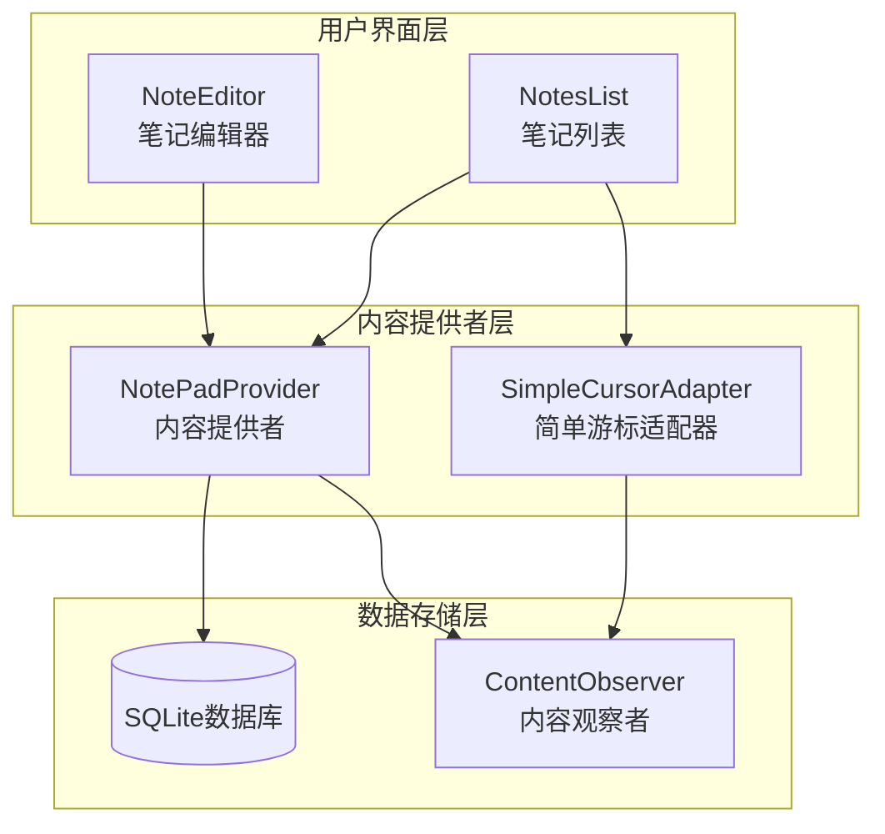
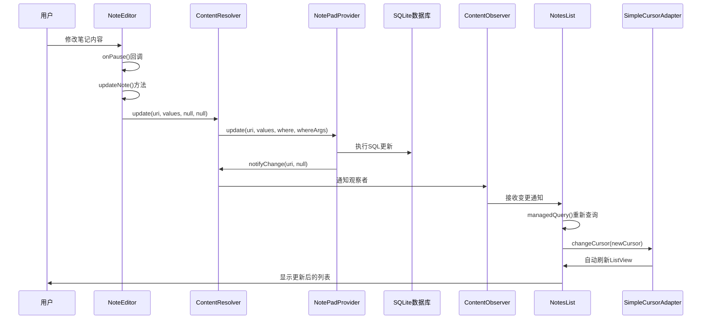
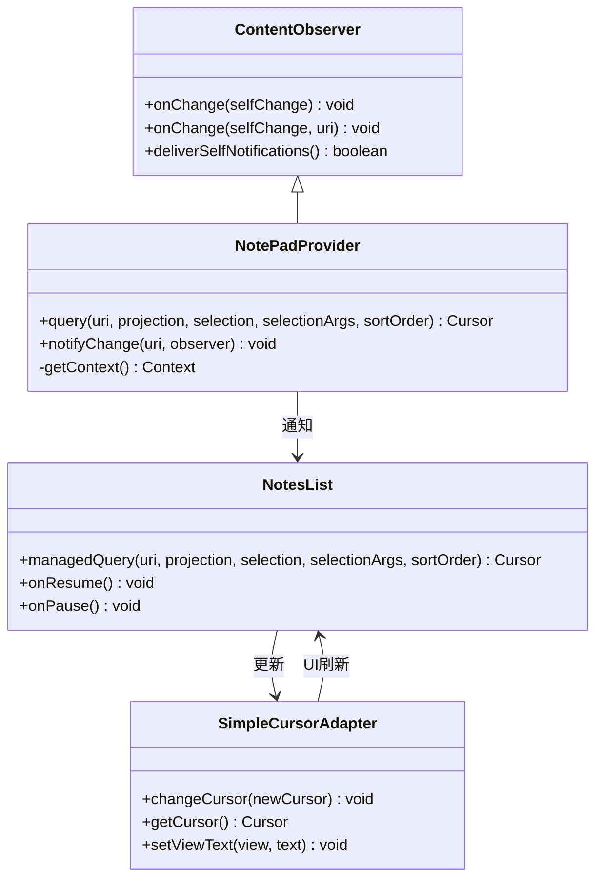
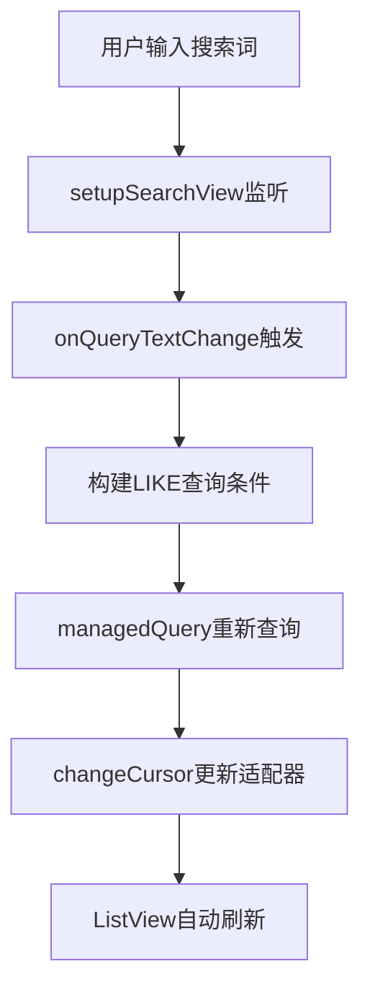
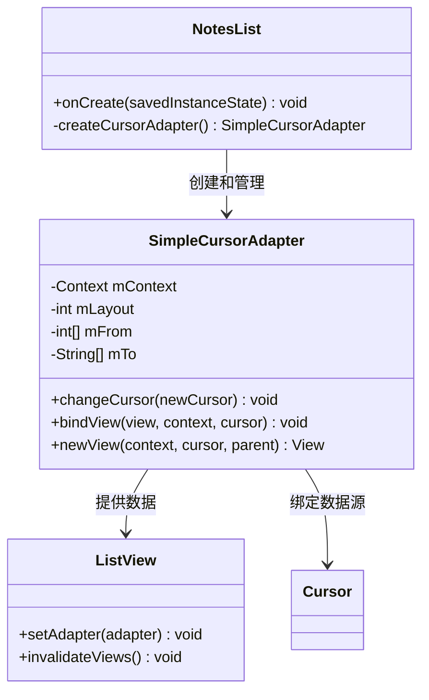

# 数据流与观察者模式

<cite>
**本文档引用的文件**
- [NoteEditor.java](file://app/src/main/java/com/example/android/notepad/NoteEditor.java)
- [NotePadProvider.java](file://app/src/main/java/com/example/android/notepad/NotePadProvider.java)
- [NotesList.java](file://app/src/main/java/com/example/android/notepad/NotesList.java)
- [NotePad.java](file://app/src/main/java/com/example/android/notepad/NotePad.java)
- [note_editor.xml](file://app/src/main/res/layout/note_editor.xml)
- [noteslist_item.xml](file://app/src/main/res/layout/noteslist_item.xml)
- [AndroidManifest.xml](file://app/src/main/AndroidManifest.xml)
</cite>

## 目录
1. [引言](#引言)
2. [系统架构概览](#系统架构概览)
3. [数据流完整路径分析](#数据流完整路径分析)
4. [观察者模式核心实现](#观察者模式核心实现)
5. [关键组件详细分析](#关键组件详细分析)
6. [数据绑定机制](#数据绑定机制)
7. [性能优化考虑](#性能优化考虑)
8. [故障排除指南](#故障排除指南)
9. [总结](#总结)

## 引言

NotePad应用是一个经典的Android数据管理示例，展示了Android平台中数据流与观察者模式的完美结合。该应用通过ContentProvider架构实现了数据的统一管理和UI的自动更新，体现了Android数据绑定的最佳实践。本文档将深入分析从用户操作到数据持久化再到UI更新的完整数据流路径，并详细阐述观察者模式在Android数据绑定中的应用。

## 系统架构概览

NotePad应用采用典型的Android三层架构：用户界面层、内容提供者层和数据存储层。这种分层设计确保了数据的一致性和UI的响应性。



**图表来源**
- [NoteEditor.java](file://app/src/main/java/com/example/android/notepad/NoteEditor.java#L54-L616)
- [NotesList.java](file://app/src/main/java/com/example/android/notepad/NotesList.java#L56-L550)
- [NotePadProvider.java](file://app/src/main/java/com/example/android/notepad/NotePadProvider.java#L54-L753)

## 数据流完整路径分析

### 用户操作到数据持久化的完整流程

当用户在NoteEditor中修改笔记时，数据流按照以下路径进行：



**图表来源**
- [NoteEditor.java](file://app/src/main/java/com/example/android/notepad/NoteEditor.java#L369-L374)
- [NotePadProvider.java](file://app/src/main/java/com/example/android/notepad/NotePadProvider.java#L670-L738)

### 数据流的关键节点分析

#### 1. 用户输入捕获
用户在NoteEditor的EditText中输入或修改文本，这些变化通过Android的事件处理机制被捕获。

#### 2. 数据验证与转换
NoteEditor对用户输入进行验证和格式化，确保数据符合数据库要求。

#### 3. 内容解析器调用
通过`getContentResolver().update()`方法将数据更新请求发送给ContentProvider。

#### 4. 数据库持久化
NotePadProvider执行SQL更新操作，将数据写入SQLite数据库。

#### 5. 变更通知机制
通过`notifyChange()`方法通知所有注册的观察者数据已发生变化。

**节来源**
- [NoteEditor.java](file://app/src/main/java/com/example/android/notepad/NoteEditor.java#L369-L374)
- [NotePadProvider.java](file://app/src/main/java/com/example/android/notepad/NotePadProvider.java#L670-L738)

## 观察者模式核心实现

### ContentObserver模式的应用

Android的观察者模式主要通过ContentObserver类实现，它监听特定URI的数据变化。



**图表来源**
- [NotePadProvider.java](file://app/src/main/java/com/example/android/notepad/NotePadProvider.java#L319-L321)
- [NotesList.java](file://app/src/main/java/com/example/android/notepad/NotesList.java#L113-L119)

### c.setNotificationUri()机制详解

在NotePadProvider的query()方法中，关键的`c.setNotificationUri()`调用建立了观察者机制：

```mermaid
flowchart TD
A[query方法开始] --> B[创建SQLiteQueryBuilder]
B --> C[设置表名和投影映射]
C --> D[根据URI匹配模式选择查询策略]
D --> E[执行数据库查询]
E --> F[创建Cursor对象]
F --> G[c.setNotificationUri(context, uri)]
G --> H[返回Cursor给客户端]
G --> I[建立通知URI关联]
I --> J[当数据变化时触发通知]
J --> K[ContentResolver分发通知]
K --> L[观察者接收通知]
```

**图表来源**
- [NotePadProvider.java](file://app/src/main/java/com/example/android/notepad/NotePadProvider.java#L319-L321)

**节来源**
- [NotePadProvider.java](file://app/src/main/java/com/example/android/notepad/NotePadProvider.java#L252-L321)

## 关键组件详细分析

### NoteEditor组件 - 数据修改入口

NoteEditor作为用户交互的主要界面，负责捕获用户输入并执行数据更新：

#### 核心功能分析
- **生命周期管理**：通过`onPause()`方法自动保存数据
- **数据验证**：确保输入数据的有效性
- **异步处理**：虽然示例中同步执行，但推荐使用AsyncQueryHandler

#### 数据更新流程
```mermaid
flowchart TD
A[用户修改笔记] --> B[onPause()触发]
B --> C{检查状态}
C --> |编辑状态| D[updateNote方法]
C --> |插入状态| E[updateNote + 状态转换]
D --> F[构建ContentValues]
F --> G[设置修改时间戳]
G --> H[调用ContentResolver.update]
H --> I[数据持久化完成]
E --> H
```

**图表来源**
- [NoteEditor.java](file://app/src/main/java/com/example/android/notepad/NoteEditor.java#L369-L374)

**节来源**
- [NoteEditor.java](file://app/src/main/java/com/example/android/notepad/NoteEditor.java#L369-L374)

### NotePadProvider组件 - 数据管理核心

NotePadProvider是整个数据架构的核心，实现了ContentProvider接口的所有方法：

#### 查询机制
Provider通过`query()`方法支持多种查询模式：
- **全量查询**：获取所有笔记
- **单条查询**：根据ID获取特定笔记
- **LiveFolder查询**：支持动态文件夹

#### 数据变更通知
Provider在每个数据操作后都调用`notifyChange()`方法：
- **insert()**：新记录插入后通知
- **update()**：记录更新后通知  
- **delete()**：记录删除后通知

**节来源**
- [NotePadProvider.java](file://app/src/main/java/com/example/android/notepad/NotePadProvider.java#L252-L321)
- [NotePadProvider.java](file://app/src/main/java/com/example/android/notepad/NotePadProvider.java#L560-L561)
- [NotePadProvider.java](file://app/src/main/java/com/example/android/notepad/NotePadProvider.java#L642-L643)
- [NotePadProvider.java](file://app/src/main/java/com/example/android/notepad/NotePadProvider.java#L735-L736)

### NotesList组件 - 数据展示界面

NotesList负责显示笔记列表，并通过SimpleCursorAdapter实现数据绑定：

#### 适配器模式应用
SimpleCursorAdapter将数据库游标的数据映射到ListView的视图元素：
- **数据列映射**：title -> text1, modified -> text2
- **视图ID映射**：确保正确的视图绑定
- **自定义格式化**：修改日期格式化显示

#### 搜索功能实现
NotesList支持实时搜索功能，通过动态构建查询条件实现：



**图表来源**
- [NotesList.java](file://app/src/main/java/com/example/android/notepad/NotesList.java#L207-L230)
- [NotesList.java](file://app/src/main/java/com/example/android/notepad/NotesList.java#L233-L256)

**节来源**
- [NotesList.java](file://app/src/main/java/com/example/android/notepad/NotesList.java#L137-L166)
- [NotesList.java](file://app/src/main/java/com/example/android/notepad/NotesList.java#L233-L256)

## 数据绑定机制

### SimpleCursorAdapter的工作原理

SimpleCursorAdapter是Android中实现数据绑定的核心组件，它建立了数据库游标与ListView视图之间的桥梁：



**图表来源**
- [NotesList.java](file://app/src/main/java/com/example/android/notepad/NotesList.java#L137-L166)

### 自动刷新机制

当数据发生变化时，SimpleCursorAdapter通过以下机制实现自动刷新：

1. **观察者注册**：Cursor通过`setNotificationUri()`注册观察者
2. **变更检测**：ContentResolver检测到数据变化
3. **通知分发**：通知所有注册的观察者
4. **游标更新**：SimpleCursorAdapter接收到通知后更新游标
5. **UI刷新**：ListView自动重新绘制可见项

**节来源**
- [NotesList.java](file://app/src/main/java/com/example/android/notepad/NotesList.java#L137-L166)

## 性能优化考虑

### 内存管理策略

1. **游标生命周期管理**
   - 使用`managedQuery()`自动管理游标生命周期
   - 在适当时机关闭游标以释放资源

2. **异步操作建议**
   - 虽然示例中同步执行数据库操作，但实际应用应使用AsyncQueryHandler或AsyncTask
   - 避免在UI线程执行耗时数据库操作

3. **批量操作优化**
   - 对于大量数据操作，考虑使用事务处理
   - 减少不必要的查询和更新操作

### 缓存策略

1. **内存缓存**：缓存频繁访问的数据
2. **数据库索引**：为常用查询字段建立索引
3. **懒加载**：按需加载数据，减少初始加载时间

## 故障排除指南

### 常见问题及解决方案

#### 1. 数据不自动更新
**症状**：修改笔记后列表不显示最新内容
**原因**：ContentResolver通知机制未正确触发
**解决方案**：
- 检查`notifyChange()`调用是否正确
- 确认ContentObserver是否正确注册
- 验证URI匹配是否准确

#### 2. 内存泄漏
**症状**：长时间使用后应用崩溃
**原因**：游标或观察者未正确释放
**解决方案**：
- 确保在适当的生命周期方法中释放资源
- 使用弱引用避免循环依赖

#### 3. 查询性能问题
**症状**：大数据集查询缓慢
**解决方案**：
- 添加适当的数据库索引
- 实现分页查询
- 使用异步查询避免阻塞UI

**节来源**
- [NotePadProvider.java](file://app/src/main/java/com/example/android/notepad/NotePadProvider.java#L670-L738)
- [NotesList.java](file://app/src/main/java/com/example/android/notepad/NotesList.java#L113-L119)

## 总结

NotePad应用展示了Android平台中数据流与观察者模式的完美结合。通过ContentProvider架构，实现了数据的统一管理和持久化；通过观察者模式，确保了UI与数据的实时同步。这种设计具有以下优势：

1. **松耦合架构**：UI层与数据层完全分离，便于维护和扩展
2. **自动同步**：数据变化自动反映到UI，提升用户体验
3. **性能优化**：通过游标和观察者机制实现高效的数据访问
4. **可扩展性**：支持多种查询模式和数据操作

对于Android开发者而言，理解这种数据流模式不仅有助于开发高质量的应用程序，也为深入学习Android架构设计奠定了坚实基础。在实际项目中，应当根据具体需求选择合适的异步处理方式，并注意内存管理和性能优化。