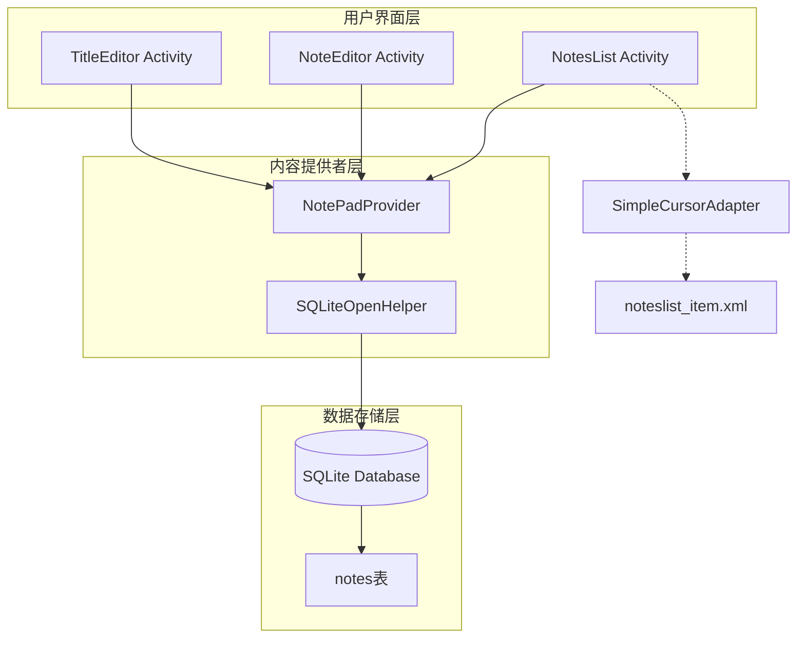
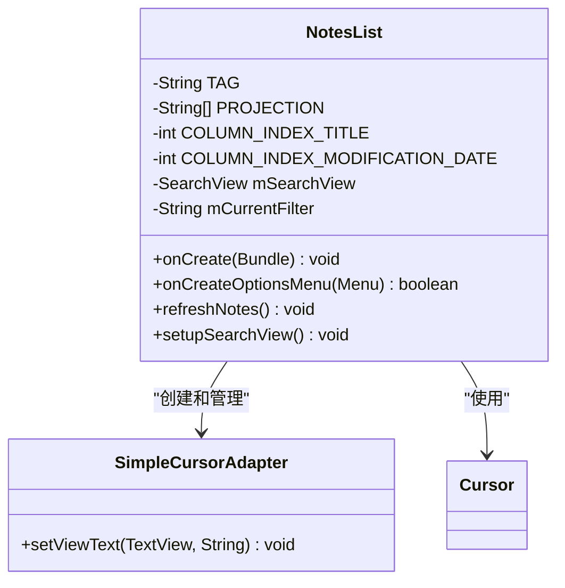
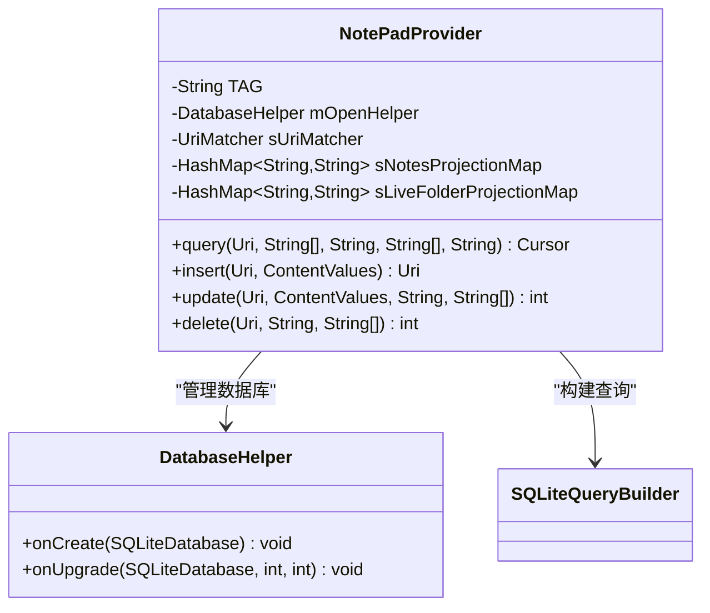
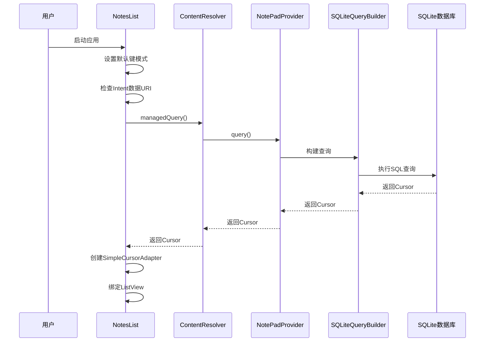
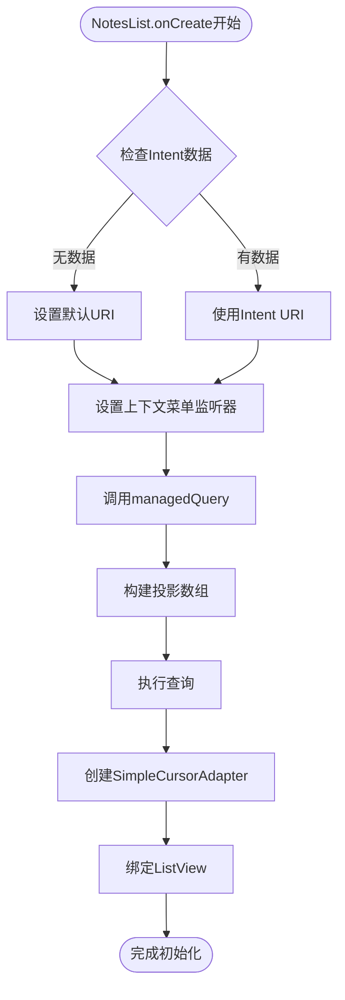
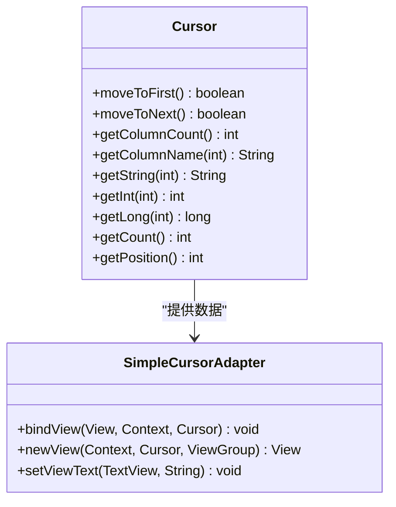
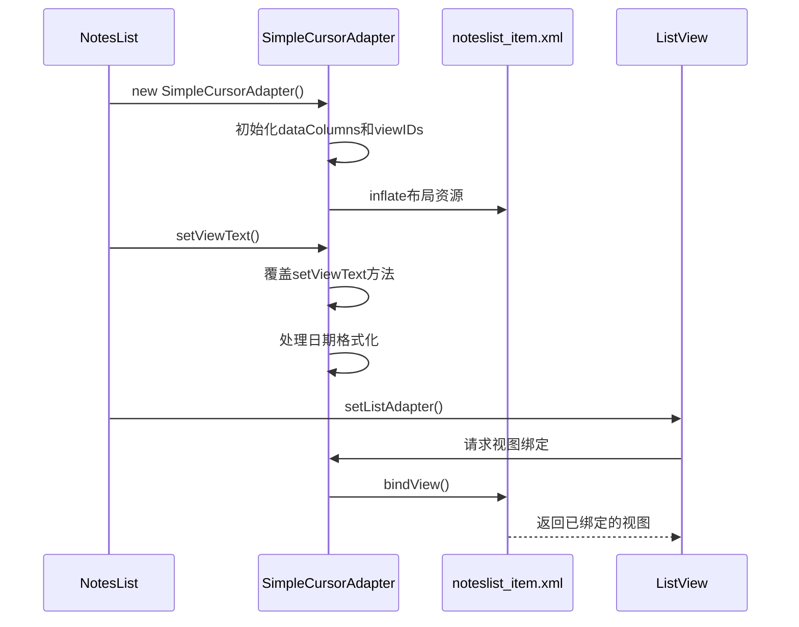
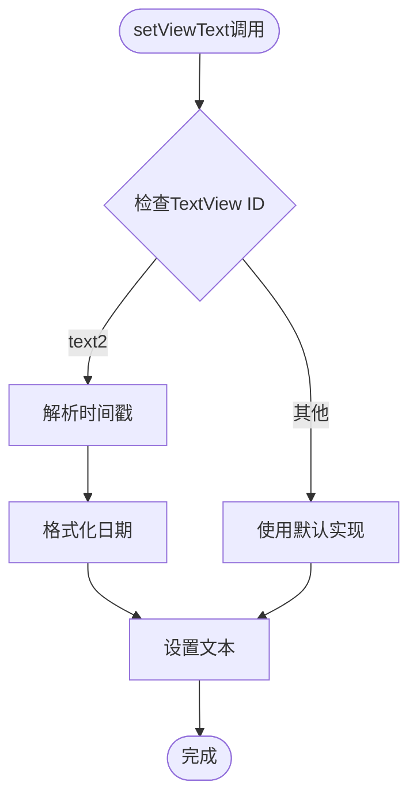
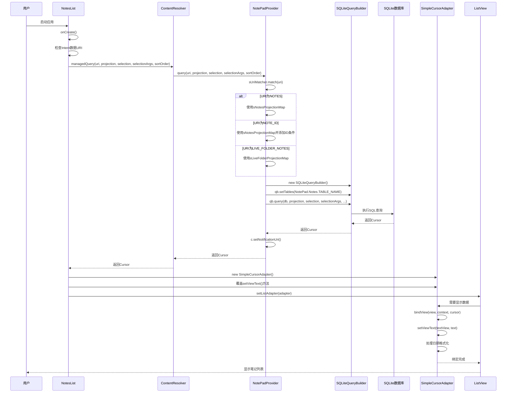
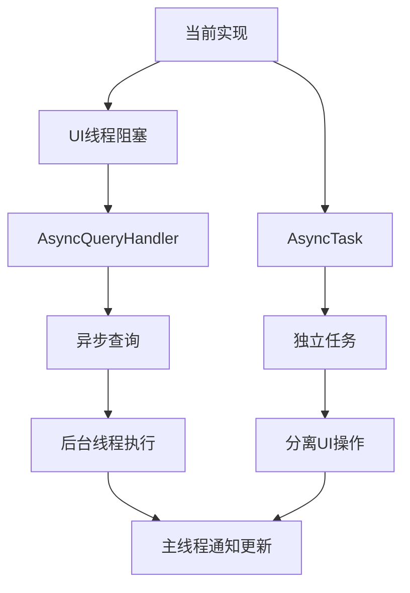

# 数据读取流

<cite>
**本文档中引用的文件**
- [NotesList.java](file://app/src/main/java/com/example/android/notepad/NotesList.java)
- [NotePadProvider.java](file://app/src/main/java/com/example/android/notepad/NotePadProvider.java)
- [NotePad.java](file://app/src/main/java/com/example/android/notepad/NotePad.java)
- [noteslist_item.xml](file://app/src/main/res/layout/noteslist_item.xml)
- [AndroidManifest.xml](file://app/src/main/AndroidManifest.xml)
</cite>

## 目录
1. [简介](#简介)
2. [项目架构概览](#项目架构概览)
3. [核心组件分析](#核心组件分析)
4. [数据读取流程详解](#数据读取流程详解)
5. [SQLiteQueryBuilder构建过程](#sqlitequerybuilder构建过程)
6. [Cursor数据封装机制](#cursor数据封装机制)
7. [SimpleCursorAdapter绑定过程](#simplecursoradapter绑定过程)
8. [时序图分析](#时序图分析)
9. [性能优化建议](#性能优化建议)
10. [故障排除指南](#故障排除指南)
11. [总结](#总结)

## 简介

NotePad应用是一个典型的Android内容提供者(Content Provider)示例，展示了如何通过ContentResolver与SQLite数据库进行交互。本文档深入分析从NotesList初始化到数据显示的完整数据读取流程，重点阐述NotesList调用managedQuery()方法发起查询请求，NotePadProvider根据URI类型设置不同的投影映射和查询条件，以及SQLiteQueryBuilder如何构建安全的SQL查询等核心机制。

## 项目架构概览

NotePad应用采用经典的Android三层架构设计：



**图表来源**
- [NotesList.java](file://app/src/main/java/com/example/android/notepad/NotesList.java#L56-L167)
- [NotePadProvider.java](file://app/src/main/java/com/example/android/notepad/NotePadProvider.java#L54-L322)

## 核心组件分析

### NotesList类结构

NotesList是应用的主要列表界面，继承自ListActivity，负责显示笔记列表：



**图表来源**
- [NotesList.java](file://app/src/main/java/com/example/android/notepad/NotesList.java#L56-L167)

### NotePadProvider类结构

NotePadProvider是内容提供者的实现类，负责数据库操作：



**图表来源**
- [NotePadProvider.java](file://app/src/main/java/com/example/android/notepad/NotePadProvider.java#L54-L322)

**章节来源**
- [NotesList.java](file://app/src/main/java/com/example/android/notepad/NotesList.java#L56-L167)
- [NotePadProvider.java](file://app/src/main/java/com/example/android/notepad/NotePadProvider.java#L54-L322)

## 数据读取流程详解

### NotesList初始化流程

NotesList的onCreate()方法是数据读取流程的起点：



**图表来源**
- [NotesList.java](file://app/src/main/java/com/example/android/notepad/NotesList.java#L81-L167)
- [NotePadProvider.java](file://app/src/main/java/com/example/android/notepad/NotePadProvider.java#L252-L322)

### managedQuery()方法调用

在NotesList的onCreate()方法中，managedQuery()是发起查询的核心方法：



**图表来源**
- [NotesList.java](file://app/src/main/java/com/example/android/notepad/NotesList.java#L81-L167)

**章节来源**
- [NotesList.java](file://app/src/main/java/com/example/android/notepad/NotesList.java#L81-L167)

## SQLiteQueryBuilder构建过程

### URI匹配与投影映射

NotePadProvider中的query()方法根据URI类型设置不同的投影映射：

```mermaid
flowchart TD
Start([query方法开始]) --> CreateBuilder[创建SQLiteQueryBuilder]
CreateBuilder --> SetTable[设置表名]
SetTable --> MatchURI[sUriMatcher.match(uri)]
MatchURI --> |NOTES| SetNotesMap[设置sNotesProjectionMap]
MatchURI --> |NOTE_ID| SetNotesMapWithWhere[设置sNotesProjectionMap<br/>添加ID条件]
MatchURI --> |LIVE_FOLDER_NOTES| SetLiveFolderMap[设置sLiveFolderProjectionMap]
SetNotesMap --> CheckSortOrder{检查排序参数}
SetLiveFolderMap --> CheckSortOrder
SetNotesMapWithWhere --> CheckSortOrder
CheckSortOrder --> |为空| UseDefault[使用默认排序]
CheckSortOrder --> |有值| UseProvided[使用提供的排序]
UseDefault --> GetReadableDB[获取可读数据库]
UseProvided --> GetReadableDB
GetReadableDB --> ExecuteQuery[qb.query执行]
ExecuteQuery --> SetNotification[设置通知URI]
SetNotification --> ReturnCursor[返回Cursor]
ReturnCursor --> End([结束])
```

**图表来源**
- [NotePadProvider.java](file://app/src/main/java/com/example/android/notepad/NotePadProvider.java#L252-L322)

### 投影映射机制

不同URI模式对应不同的投影映射：

| URI模式 | 投影映射 | 用途 |
|---------|----------|------|
| NOTES | sNotesProjectionMap | 查询所有笔记的基本信息 |
| NOTE_ID | sNotesProjectionMap | 查询单个笔记的详细信息 |
| LIVE_FOLDER_NOTES | sLiveFolderProjectionMap | 查询用于实时文件夹的格式化数据 |

**章节来源**
- [NotePadProvider.java](file://app/src/main/java/com/example/android/notepad/NotePadProvider.java#L252-L322)

## Cursor数据封装机制

### Cursor对象结构

Cursor对象封装了查询结果的所有信息：



**图表来源**
- [NotesList.java](file://app/src/main/java/com/example/android/notepad/NotesList.java#L136-L166)

### 数据列映射

NotesList中定义了特定的数据列映射：

| 列索引 | 列名 | 在布局中的视图ID |
|--------|------|------------------|
| 0 | _ID | 不直接显示 |
| 1 | COLUMN_NAME_TITLE | android.R.id.text1 |
| 2 | COLUMN_NAME_MODIFICATION_DATE | android.R.id.text2 |

**章节来源**
- [NotesList.java](file://app/src/main/java/com/example/android/notepad/NotesList.java#L64-L73)

## SimpleCursorAdapter绑定过程

### 适配器创建流程

SimpleCursorAdapter负责将Cursor数据绑定到ListView：



**图表来源**
- [NotesList.java](file://app/src/main/java/com/example/android/notepad/NotesList.java#L136-L166)

### 自定义文本处理

SimpleCursorAdapter重写了setViewText方法来处理特殊格式：



**图表来源**
- [NotesList.java](file://app/src/main/java/com/example/android/notepad/NotesList.java#L146-L162)

**章节来源**
- [NotesList.java](file://app/src/main/java/com/example/android/notepad/NotesList.java#L136-L166)

## 时序图分析

### 完整数据读取时序

以下是NotePad应用数据读取的完整时序图：



**图表来源**
- [NotesList.java](file://app/src/main/java/com/example/android/notepad/NotesList.java#L81-L167)
- [NotePadProvider.java](file://app/src/main/java/com/example/android/notepad/NotePadProvider.java#L252-L322)

## 性能优化建议

### 异步查询优化

当前实现中，数据库操作在UI线程执行，存在性能问题：



### 查询优化策略

1. **索引优化**：确保常用查询字段建立索引
2. **投影优化**：只查询需要的列
3. **分页查询**：大数据集使用分页加载
4. **缓存机制**：实现查询结果缓存

## 故障排除指南

### 常见问题及解决方案

| 问题类型 | 症状 | 可能原因 | 解决方案 |
|----------|------|----------|----------|
| 查询超时 | 应用无响应 | 数据库锁或复杂查询 | 使用AsyncQueryHandler |
| 内存泄漏 | 应用内存持续增长 | Cursor未正确关闭 | 实现proper cursor management |
| 数据不一致 | 显示数据错误 | URI匹配错误 | 检查sUriMatcher配置 |
| 格式化失败 | 日期显示异常 | 时间戳格式错误 | 添加异常处理逻辑 |

### 调试技巧

1. **日志记录**：在关键节点添加Log输出
2. **断点调试**：在query()方法入口设置断点
3. **数据库查看**：使用adb shell查看数据库状态
4. **内存监控**：使用Android Profiler监控内存使用

**章节来源**
- [NotesList.java](file://app/src/main/java/com/example/android/notepad/NotesList.java#L51-L55)
- [NotePadProvider.java](file://app/src/main/java/com/example/android/notepad/NotePadProvider.java#L252-L322)

## 总结

NotePad应用的数据读取流程展示了Android内容提供者模式的经典实现。从NotesList的managedQuery()调用开始，经过NotePadProvider的URI匹配和SQLiteQueryBuilder的查询构建，最终通过SimpleCursorAdapter将数据绑定到ListView，形成了一个完整的数据访问链路。

关键要点包括：
1. **URI路由机制**：通过UriMatcher实现不同URI模式的精确匹配
2. **投影映射**：灵活的列映射支持不同类型的数据查询需求
3. **安全查询**：SQLiteQueryBuilder自动处理SQL注入防护
4. **数据绑定**：SimpleCursorAdapter提供高效的视图绑定机制

这个流程为Android开发者提供了内容提供者开发的最佳实践参考，特别是在数据读取、查询优化和UI绑定方面的设计思路。