# NotePad应用架构设计文档

<cite>
**本文档中引用的文件**
- [NotePad.java](file://app/src/main/java/com/example/android/notepad/NotePad.java)
- [NotePadProvider.java](file://app/src/main/java/com/example/android/notepad/NotePadProvider.java)
- [NotesList.java](file://app/src/main/java/com/example/android/notepad/NotesList.java)
- [NoteEditor.java](file://app/src/main/java/com/example/android/notepad/NoteEditor.java)
- [TitleEditor.java](file://app/src/main/java/com/example/android/notepad/TitleEditor.java)
- [NotesLiveFolder.java](file://app/src/main/java/com/example/android/notepad/NotesLiveFolder.java)
- [note_editor.xml](file://app/src/main/res/layout/note_editor.xml)
- [noteslist_item.xml](file://app/src/main/res/layout/noteslist_item.xml)
- [AndroidManifest.xml](file://app/src/main/AndroidManifest.xml)
- [strings.xml](file://app/src/main/res/values/strings.xml)
</cite>

## 目录
1. [引言](#引言)
2. [项目结构概述](#项目结构概述)
3. [MVC架构设计](#mvc架构设计)
4. [Model层分析](#model层分析)
5. [View层分析](#view层分析)
6. [Controller层分析](#controller层分析)
7. [契约类设计](#契约类设计)
8. [Content Provider核心作用](#content-provider核心作用)
9. [组件间通信机制](#组件间通信机制)
10. [观察者模式应用](#观察者模式应用)
11. [架构图表](#架构图表)
12. [总结](#总结)

## 引言

NotePad应用是一个经典的Android学习项目，展示了标准的MVC（Model-View-Controller）架构模式的实现。该应用通过Content Provider作为数据访问层，实现了数据的统一管理和跨应用共享。本文档将深入分析其架构设计，重点探讨MVC各层的具体实现以及组件间的协作机制。

## 项目结构概述

NotePad应用采用标准的Android项目结构，主要包含以下层次：

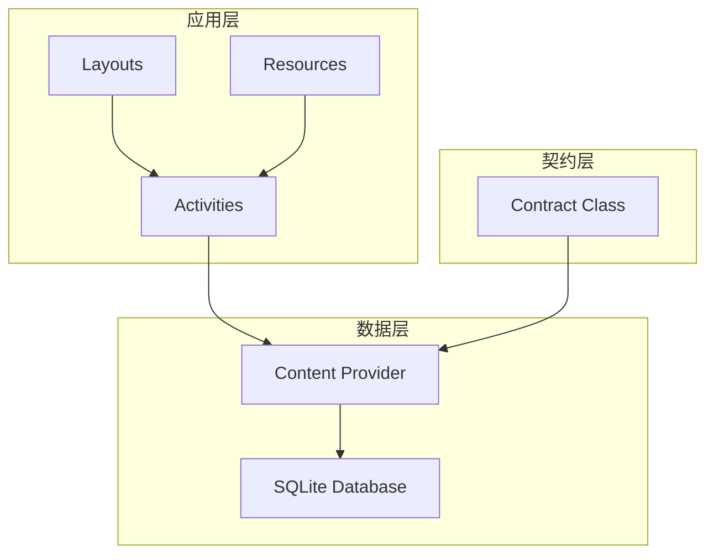

**图表来源**
- [AndroidManifest.xml](file://app/src/main/AndroidManifest.xml#L28-L32)
- [NotePadProvider.java](file://app/src/main/java/com/example/android/notepad/NotePadProvider.java#L54-L753)

**章节来源**
- [AndroidManifest.xml](file://app/src/main/AndroidManifest.xml#L1-L119)

## MVC架构设计

NotePad应用严格遵循MVC架构模式，每层都有明确的职责分工：

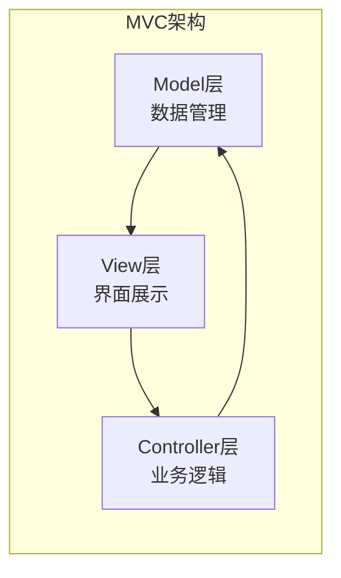

### 架构特点

1. **分离关注点**：每层专注于特定的功能领域
2. **可测试性**：各层可以独立进行单元测试
3. **可维护性**：修改某一层不会影响其他层
4. **可扩展性**：新增功能可以通过添加新层来实现

## Model层分析

Model层由NotePadProvider和SQLite数据库组成，负责数据的存储与访问。

### 数据库设计

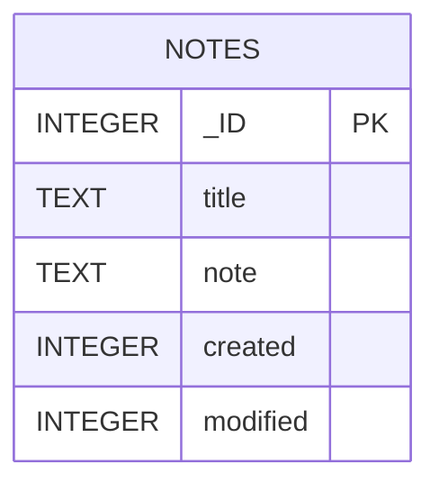

**图表来源**
- [NotePadProvider.java](file://app/src/main/java/com/example/android/notepad/NotePadProvider.java#L194-L200)

### NotePadProvider核心功能

NotePadProvider继承自ContentProvider，提供了完整的CRUD操作：

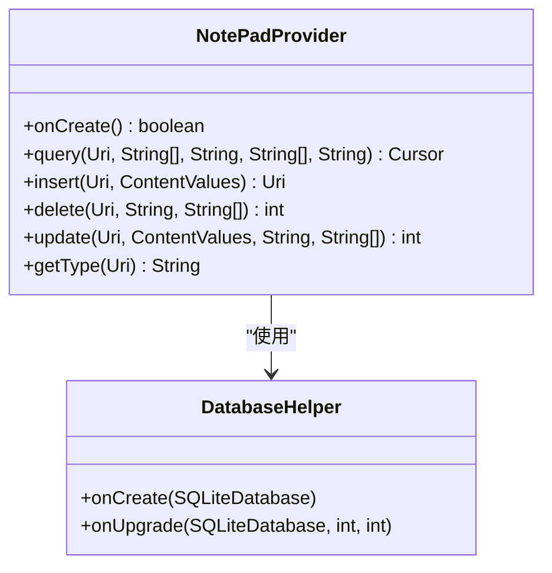

**图表来源**
- [NotePadProvider.java](file://app/src/main/java/com/example/android/notepad/NotePadProvider.java#L54-L753)

### 数据库操作流程

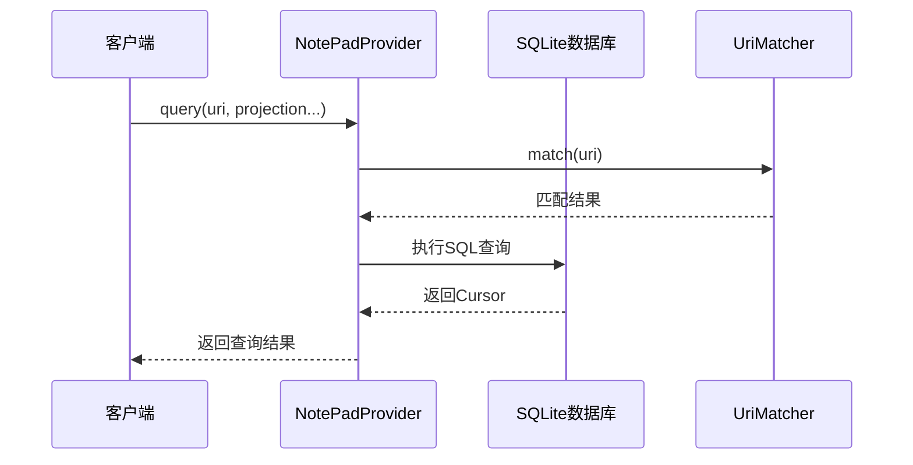

**图表来源**
- [NotePadProvider.java](file://app/src/main/java/com/example/android/notepad/NotePadProvider.java#L252-L321)

**章节来源**
- [NotePadProvider.java](file://app/src/main/java/com/example/android/notepad/NotePadProvider.java#L1-L753)

## View层分析

View层由res/layout/目录下的XML布局文件构成，负责用户界面的呈现。

### 布局文件结构

| 文件名 | 功能描述 | 主要组件 |
|--------|----------|----------|
| note_editor.xml | 笔记编辑界面 | 自定义LinedEditText |
| noteslist_item.xml | 列表项布局 | 标题和修改时间显示 |
| title_editor.xml | 标题编辑界面 | 简单文本输入框 |

### 用户界面设计

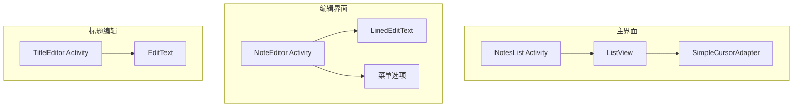

**图表来源**
- [NotesList.java](file://app/src/main/java/com/example/android/notepad/NotesList.java#L132-L161)
- [NoteEditor.java](file://app/src/main/java/com/example/android/notepad/NoteEditor.java#L227-L232)

### 自定义控件

应用包含两个自定义控件：

1. **LinedEditText**：带有网格线的多行文本编辑器
2. **TitleEditor**：专门用于编辑笔记标题的对话框

**章节来源**
- [note_editor.xml](file://app/src/main/res/layout/note_editor.xml#L1-L29)
- [noteslist_item.xml](file://app/src/main/res/layout/noteslist_item.xml#L1-L40)

## Controller层分析

Controller层由NotesList、NoteEditor等Activity构成，负责处理用户交互和业务逻辑。

### 主要Activity组件

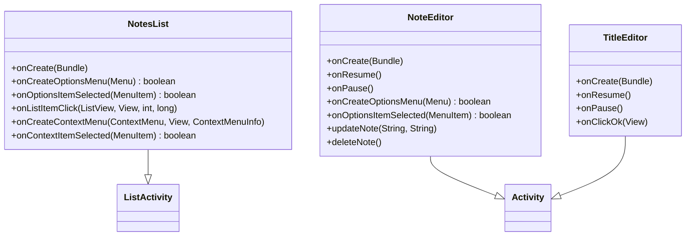

**图表来源**
- [NotesList.java](file://app/src/main/java/com/example/android/notepad/NotesList.java#L54-L487)
- [NoteEditor.java](file://app/src/main/java/com/example/android/notepad/NoteEditor.java#L54-L616)
- [TitleEditor.java](file://app/src/main/java/com/example/android/notepad/TitleEditor.java#L36-L168)

### Activity生命周期管理

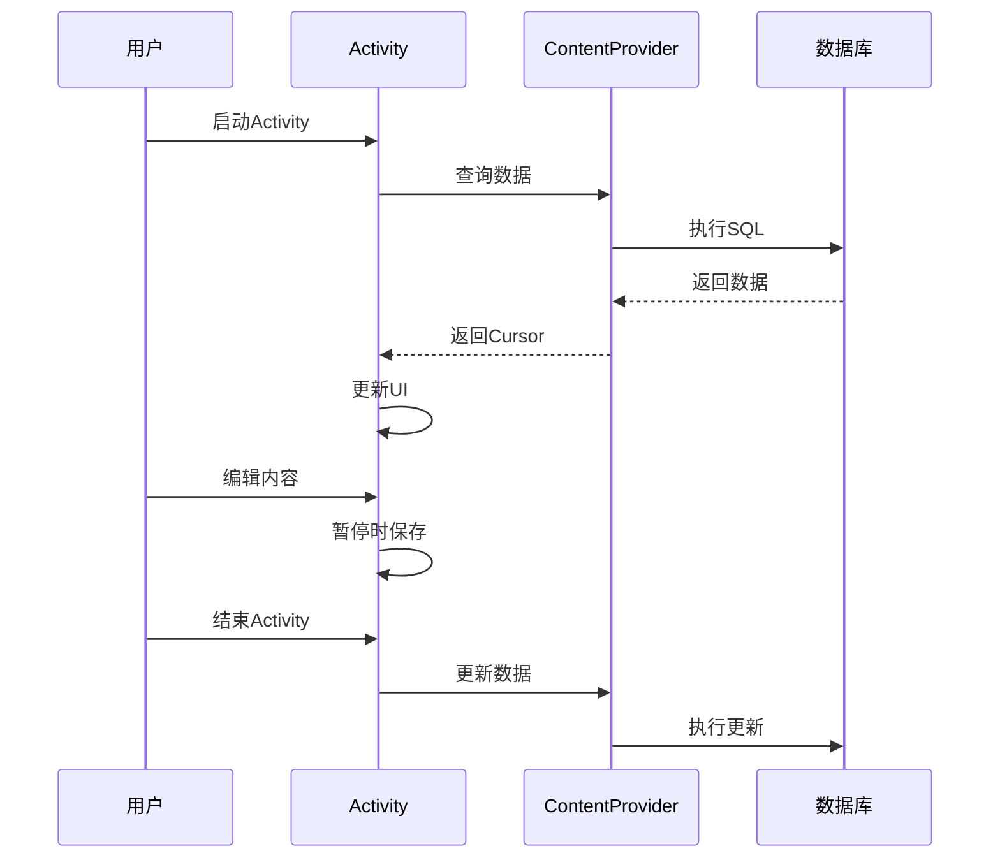

**图表来源**
- [NotesList.java](file://app/src/main/java/com/example/android/notepad/NotesList.java#L108-L114)
- [NoteEditor.java](file://app/src/main/java/com/example/android/notepad/NoteEditor.java#L338-L376)

**章节来源**
- [NotesList.java](file://app/src/main/java/com/example/android/notepad/NotesList.java#L1-L487)
- [NoteEditor.java](file://app/src/main/java/com/example/android/notepad/NoteEditor.java#L1-L616)
- [TitleEditor.java](file://app/src/main/java/com/example/android/notepad/TitleEditor.java#L1-L168)

## 契约类设计

NotePad.java中的契约类（Contract Class）作为核心，定义了数据库表结构、URI常量和MIME类型。

### 契约类结构

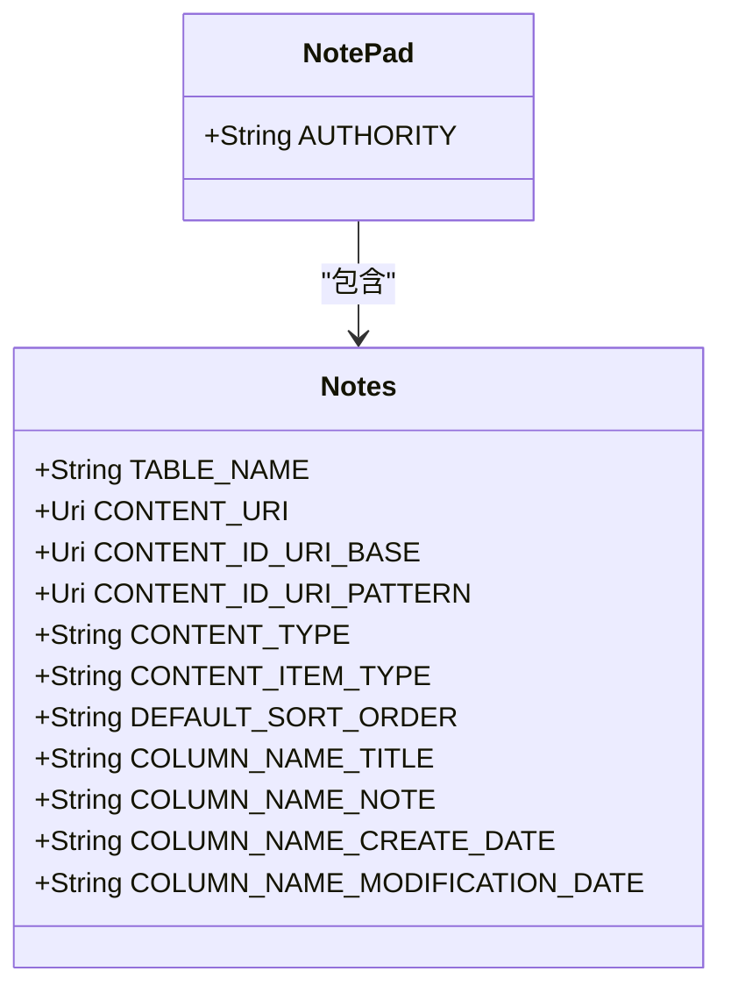

**图表来源**
- [NotePad.java](file://app/src/main/java/com/example/android/notepad/NotePad.java#L28-L155)

### URI设计规范

| URI类型 | 格式 | 示例 |
|---------|------|------|
| 内容URI | content://authority/notes | content://com.google.provider.NotePad/notes |
| 单条记录URI | content://authority/notes/id | content://com.google.provider.NotePad/notes/123 |
| Live Folder URI | content://authority/live_folders/notes | content://com.google.provider.NotePad/live_folders/notes |

### MIME类型定义

- **目录类型**：`vnd.android.cursor.dir/vnd.google.note`
- **单条记录类型**：`vnd.android.cursor.item/vnd.google.note`

**章节来源**
- [NotePad.java](file://app/src/main/java/com/example/android/notepad/NotePad.java#L1-L155)

## Content Provider核心作用

Content Provider在架构中扮演着数据访问的唯一入口，为应用内外提供统一的数据操作接口。

### 提供者注册

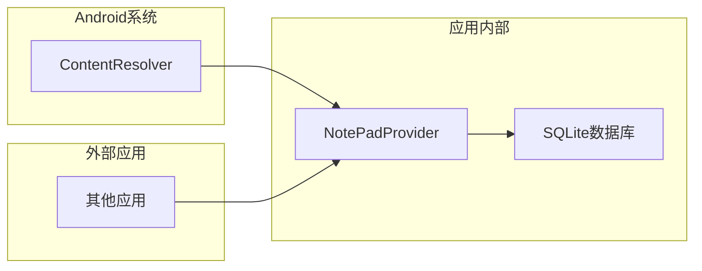

**图表来源**
- [AndroidManifest.xml](file://app/src/main/AndroidManifest.xml#L28-L32)

### 数据访问流程

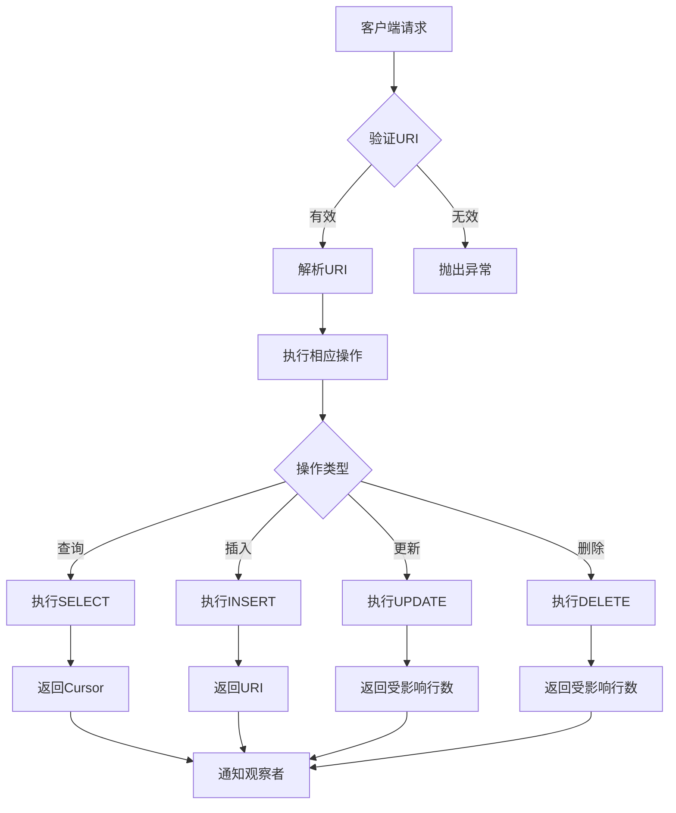

**图表来源**
- [NotePadProvider.java](file://app/src/main/java/com/example/android/notepad/NotePadProvider.java#L252-L738)

**章节来源**
- [NotePadProvider.java](file://app/src/main/java/com/example/android/notepad/NotePadProvider.java#L231-L240)

## 组件间通信机制

AndroidManifest.xml文件定义了组件间的集成方式，特别是Intent过滤器如何定义Activity的启动条件和数据类型。

### Intent过滤器设计

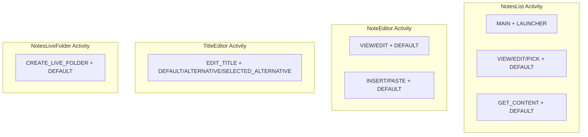

**图表来源**
- [AndroidManifest.xml](file://app/src/main/AndroidManifest.xml#L34-L114)

### 数据类型匹配

| Action | MIME Type | 用途 |
|--------|-----------|------|
| VIEW/EDIT | vnd.android.cursor.item/vnd.google.note | 编辑单个笔记 |
| INSERT/PASTE | vnd.android.cursor.dir/vnd.google.note | 创建新笔记 |
| GET_CONTENT | vnd.android.cursor.item/vnd.google.note | 获取笔记内容 |

### 松耦合通信

```mermaid
sequenceDiagram
participant App1 as 应用A
participant Resolver as ContentResolver
participant Provider as NotePadProvider
participant App2 as 应用B
App1->>Resolver : 查询笔记列表
Resolver->>Provider : query(CONTENT_URI)
Provider-->>Resolver : 返回笔记列表
Resolver-->>App1 : 返回数据
App2->>Resolver : 编辑笔记
Resolver->>Provider : update(noteUri, values)
Provider-->>Resolver : 更新成功
Resolver-->>App2 : 返回结果
NotePad应用接收通知
Provider->>Resolver : notifyChange(uri)
Resolver->>App1 : 通知数据变更
```

**图表来源**
- [AndroidManifest.xml](file://app/src/main/AndroidManifest.xml#L39-L50)
- [NotePadProvider.java](file://app/src/main/java/com/example/android/notepad/NotePadProvider.java#L560-L562)

**章节来源**
- [AndroidManifest.xml](file://app/src/main/AndroidManifest.xml#L1-L119)

## 观察者模式应用

通过ContentObserver实现数据变更时的自动UI刷新，体现了观察者模式的应用。

### 观察者注册流程

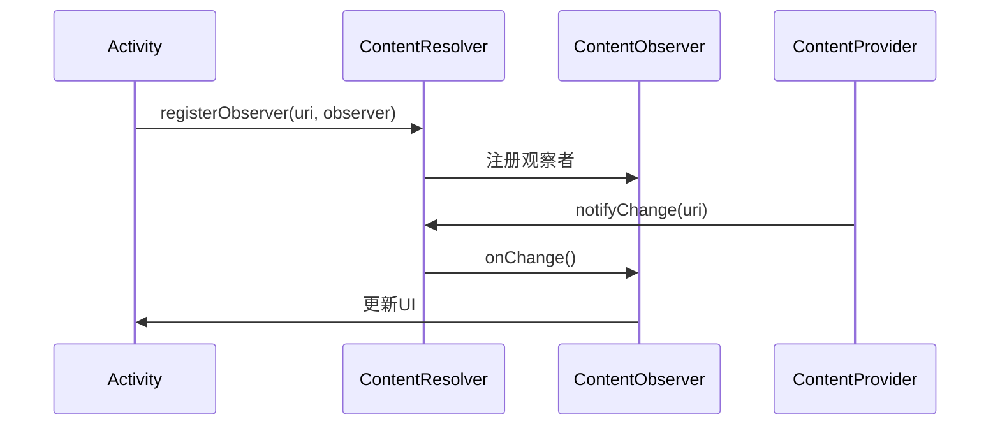

**图表来源**
- [NotePadProvider.java](file://app/src/main/java/com/example/android/notepad/NotePadProvider.java#L319-L321)

### 自动刷新机制

当数据发生变更时，ContentProvider会通知所有注册的观察者，观察者负责更新相应的UI组件。

**章节来源**
- [NotePadProvider.java](file://app/src/main/java/com/example/android/notepad/NotePadProvider.java#L319-L321)

## 架构图表

### 整体架构图

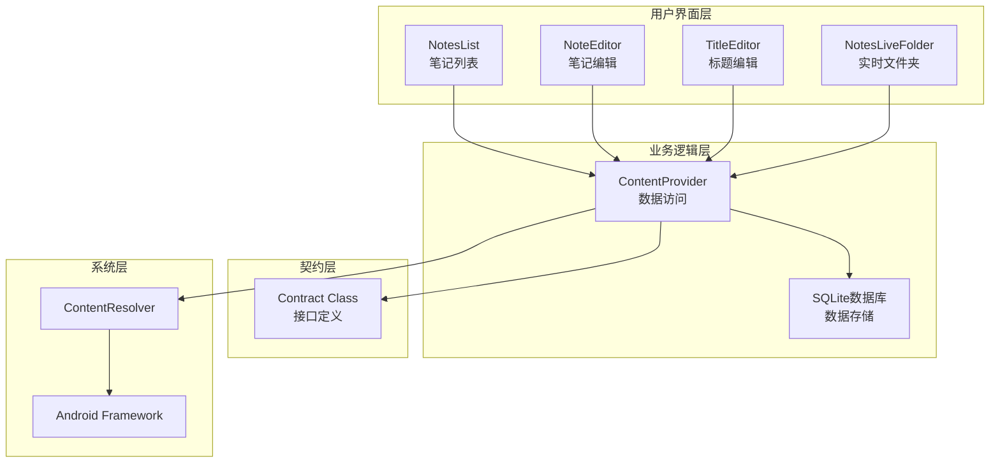

**图表来源**
- [NotesList.java](file://app/src/main/java/com/example/android/notepad/NotesList.java#L54-L487)
- [NoteEditor.java](file://app/src/main/java/com/example/android/notepad/NoteEditor.java#L54-L616)
- [NotePadProvider.java](file://app/src/main/java/com/example/android/notepad/NotePadProvider.java#L54-L753)

### 数据流图

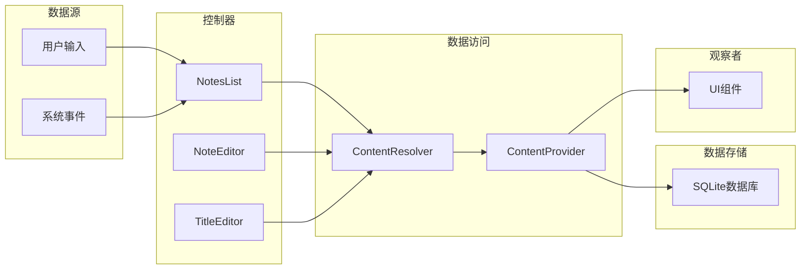

**图表来源**
- [NotesList.java](file://app/src/main/java/com/example/android/notepad/NotesList.java#L108-L114)
- [NoteEditor.java](file://app/src/main/java/com/example/android/notepad/NoteEditor.java#L338-L376)

## 总结

NotePad应用展现了经典的MVC架构模式在Android开发中的完美实现：

1. **清晰的分层架构**：Model、View、Controller各司其职，职责分明
2. **统一的数据访问接口**：通过ContentProvider提供标准化的数据操作
3. **灵活的组件通信**：基于Intent的松耦合设计，支持跨应用数据共享
4. **自动化的UI更新**：观察者模式确保数据变更时界面的及时刷新
5. **完善的契约设计**：通过契约类统一定义接口规范，提高代码可维护性

这种架构设计不仅保证了应用的稳定性和可扩展性，也为Android开发提供了优秀的参考范例。开发者可以基于此架构模式，快速构建功能完善、结构清晰的Android应用。