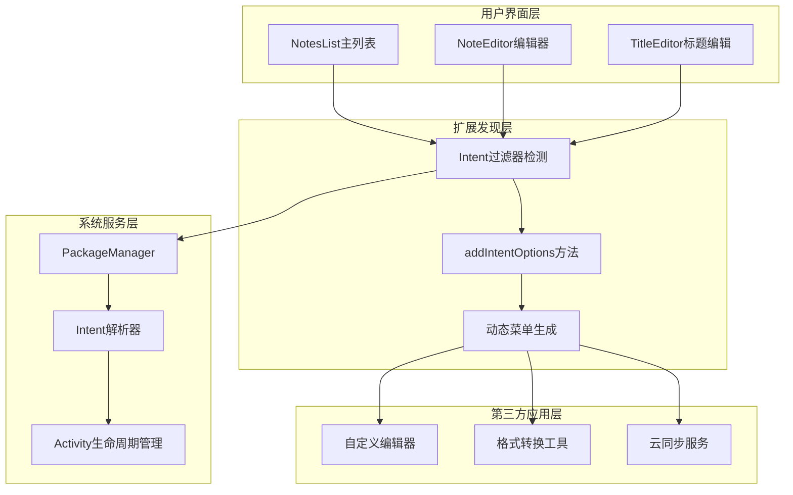
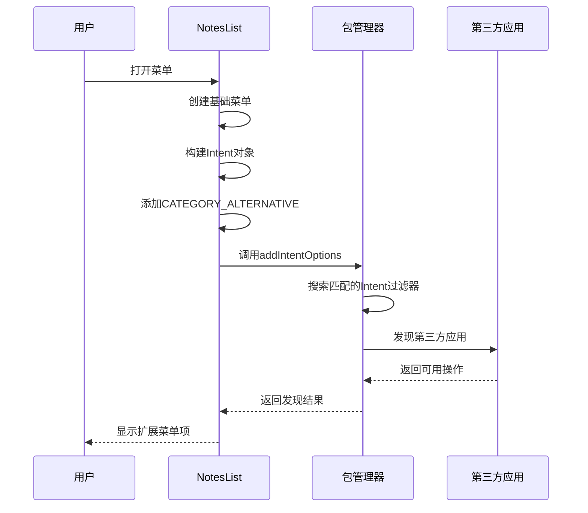
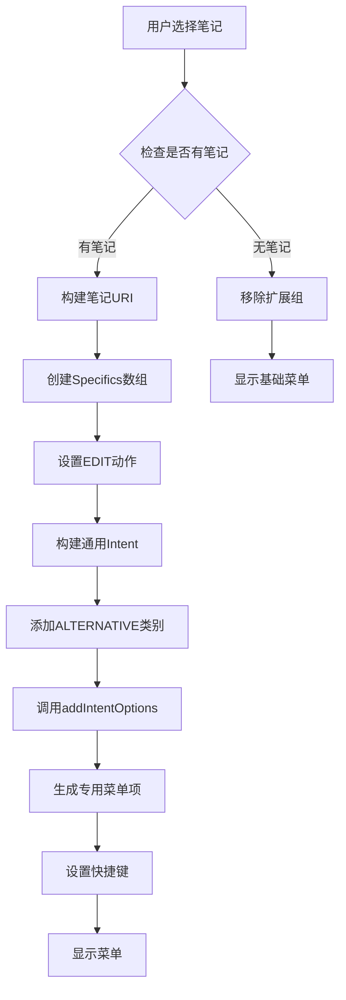
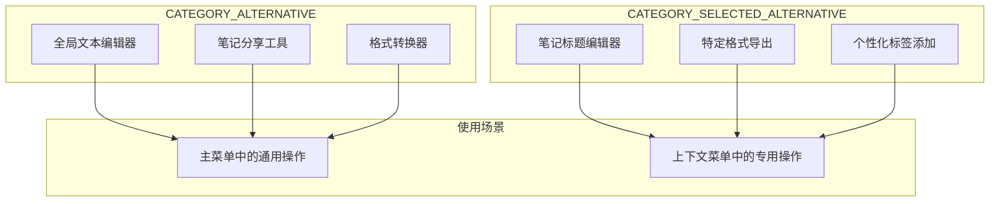
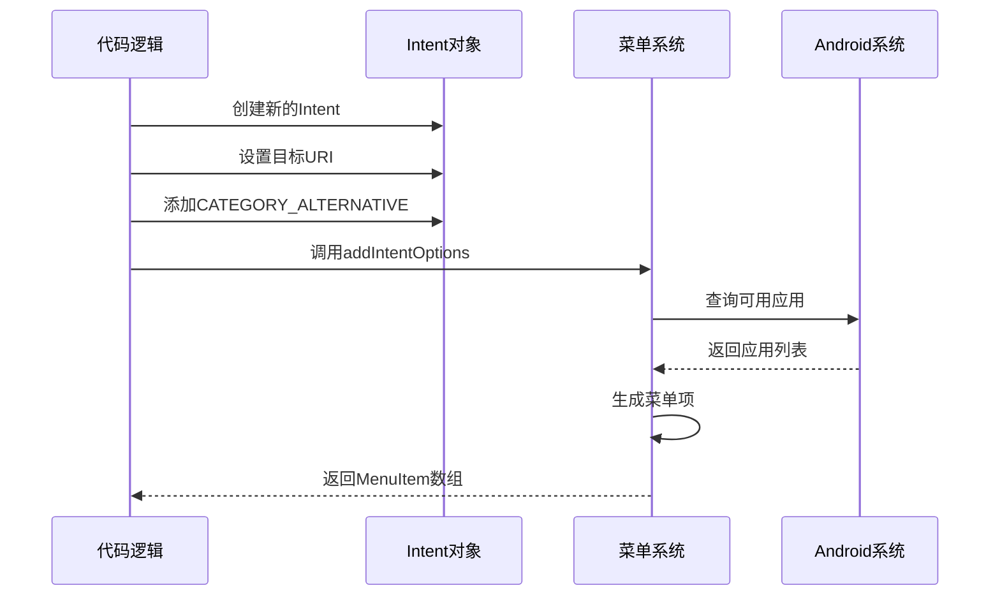
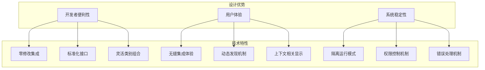

# ALTERNATIVE扩展机制

<cite>
**本文档中引用的文件**
- [NotesList.java](file://app/src/main/java/com/example/android/notepad/NotesList.java)
- [TitleEditor.java](file://app/src/main/java/com/example/android/notepad/TitleEditor.java)
- [NoteEditor.java](file://app/src/main/java/com/example/android/notepad/NoteEditor.java)
- [AndroidManifest.xml](file://app/src/main/AndroidManifest.xml)
- [list_options_menu.xml](file://app/src/main/res/menu/list_options_menu.xml)
- [list_context_menu.xml](file://app/src/main/res/menu/list_context_menu.xml)
- [strings.xml](file://app/src/main/res/values/strings.xml)
</cite>

## 目录
1. [简介](#简介)
2. [系统架构概述](#系统架构概述)
3. [核心组件分析](#核心组件分析)
4. [ALTERNATIVE扩展机制详解](#alternative扩展机制详解)
5. [CATEGORY_ALTERNATIVE与CATEGORY_SELECTED_ALTERNATIVE的区别](#category_alternative与category_selected_alternative的区别)
6. [动态菜单生成过程](#动态菜单生成过程)
7. [插件式架构设计优势](#插件式架构设计优势)
8. [实际应用场景](#实际应用场景)
9. [总结](#总结)

## 简介

NotePad应用采用了一种创新的插件式扩展机制，通过Android的Intent过滤器系统实现了高度可扩展的笔记处理功能。该机制的核心是利用`CATEGORY_ALTERNATIVE`和`CATEGORY_SELECTED_ALTERNATIVE`两个特殊的Intent类别，使得第三方应用能够无缝集成到NotePad的功能体系中，为用户提供丰富的替代操作选项。

这种设计不仅保持了应用的简洁性，还通过动态发现和集成机制，让系统具备了强大的扩展能力。用户可以在不修改原应用的情况下，通过安装第三方应用来增强笔记处理功能。

## 系统架构概述

NotePad应用的扩展机制建立在一个清晰的分层架构之上，主要包括以下几个层次：

**图表来源**
- [NotesList.java](file://app/src/main/java/com/example/android/notepad/NotesList.java#L182-L202)
- [AndroidManifest.xml](file://app/src/main/AndroidManifest.xml#L80-L105)

## 核心组件分析

### NotesList主列表组件

NotesList是扩展机制的主要入口点，负责在不同场景下发现和集成第三方应用提供的替代操作。

#### onCreateOptionsMenu方法实现

在菜单创建阶段，NotesList通过以下步骤实现扩展机制：

**图表来源**
- [NotesList.java](file://app/src/main/java/com/example/android/notepad/NotesList.java#L182-L202)

#### onPrepareOptionsMenu方法实现

当用户选择特定笔记时，系统会动态生成针对该笔记的专用扩展菜单：

**图表来源**
- [NotesList.java](file://app/src/main/java/com/example/android/notepad/NotesList.java#L259-L336)

**章节来源**
- [NotesList.java](file://app/src/main/java/com/example/android/notepad/NotesList.java#L182-L336)

### TitleEditor组件

TitleEditor作为具体的扩展实现，展示了如何正确声明ALTERNATIVE和SELECTED_ALTERNATIVE类别：

#### Intent过滤器配置

TitleEditor的Intent过滤器配置体现了扩展机制的核心要素：

| 配置项 | 值 | 说明 |
|--------|-----|------|
| 动作类型 | `com.android.notepad.action.EDIT_TITLE` | 自定义编辑标题的动作 |
| 默认类别 | `android.intent.category.DEFAULT` | 允许直接调用 |
| ALTERNATIVE类别 | `android.intent.category.ALTERNATIVE` | 表示这是替代操作 |
| SELECTED_ALTERNATIVE类别 | `android.intent.category.SELECTED_ALTERNATIVE` | 表示这是针对选中数据的操作 |
| MIME类型 | `vnd.android.cursor.item/vnd.google.note` | 支持单个笔记数据 |

**章节来源**
- [TitleEditor.java](file://app/src/main/java/com/example/android/notepad/TitleEditor.java#L39-L168)
- [AndroidManifest.xml](file://app/src/main/AndroidManifest.xml#L80-L105)

## ALTERNATIVE扩展机制详解

### 扩展发现原理

扩展机制的核心在于Android的Intent过滤器系统。当系统需要发现可用的替代操作时，会执行以下流程：

**图表来源**
- [NotesList.java](file://app/src/main/java/com/example/android/notepad/NotesList.java#L197-L200)
- [NotesList.java](file://app/src/main/java/com/example/android/notepad/NotesList.java#L302-L322)

### addIntentOptions方法详解

`addIntentOptions`方法是扩展机制的关键，它负责将发现的第三方应用集成到菜单中：

#### 方法参数说明

| 参数位置 | 参数名 | 类型 | 说明 |
|----------|--------|------|------|
| 1 | group | int | 菜单项所属的组（Menu.CATEGORY_ALTERNATIVE） |
| 2 | id | int | 菜单项的唯一标识符 |
| 3 | category | int | 菜单项的类别 |
| 4 | caller | ComponentName | 调用者的组件名称 |
| 5 | specifics | Intent[] | 特定的Intent数组 |
| 6 | intent | Intent | 通用的Intent模板 |
| 7 | flags | int | 标志位 |
| 8 | outSpecifics | MenuItem[] | 输出的菜单项数组 |

**章节来源**
- [NotesList.java](file://app/src/main/java/com/example/android/notepad/NotesList.java#L197-L200)
- [NotesList.java](file://app/src/main/java/com/example/android/notepad/NotesList.java#L313-L322)

## CATEGORY_ALTERNATIVE与CATEGORY_SELECTED_ALTERNATIVE的区别

### CATEGORY_ALTERNATIVE

`CATEGORY_ALTERNATIVE`表示这是一个替代操作，可以应用于任何符合要求的数据。在NotePad中，这个类别用于：

- 主列表菜单中的全局操作
- 上下文菜单中的通用操作
- 不依赖于特定数据的选择

### CATEGORY_SELECTED_ALTERNATIVE

`CATEGORY_SELECTED_ALTERNATIVE`表示这是一个专门针对已选择数据的操作。在NotePad中，这个类别用于：

- 针对特定笔记的专用操作
- 需要访问具体数据内容的操作
- 提供更精确功能的扩展应用

### 实际应用对比

**图表来源**
- [AndroidManifest.xml](file://app/src/main/AndroidManifest.xml#L97-L102)

**章节来源**
- [AndroidManifest.xml](file://app/src/main/AndroidManifest.xml#L80-L105)

## 动态菜单生成过程

### Intent构建与类别添加

扩展机制的菜单生成遵循严格的流程，确保每个步骤都正确执行：

**图表来源**
- [NotesList.java](file://app/src/main/java/com/example/android/notepad/NotesList.java#L197-L200)
- [NotesList.java](file://app/src/main/java/com/example/android/notepad/NotesList.java#L302-L322)

### 选项排序机制

系统通过多种方式控制菜单项的排序：

1. **specifics数组优先级**：指定的Intent操作总是排在前面
2. **应用可见性**：只有可见的应用才会出现在菜单中
3. **用户使用频率**：系统可能根据使用频率进行智能排序
4. **开发者指定顺序**：通过flags参数控制排序行为

**章节来源**
- [NotesList.java](file://app/src/main/java/com/example/android/notepad/NotesList.java#L313-L322)

## 插件式架构设计优势

### 开发者友好性

1. **零修改集成**：第三方应用无需修改NotePad源码即可提供功能
2. **标准化接口**：通过Intent过滤器规范统一的集成方式
3. **灵活的类别组合**：支持多种类别的组合使用

### 用户体验优化

1. **无缝集成**：扩展功能与原生功能无异
2. **动态发现**：新安装的应用自动出现在菜单中
3. **上下文相关**：菜单项根据当前操作场景智能显示

### 系统稳定性保障

1. **隔离运行**：扩展应用在独立进程中运行
2. **权限控制**：通过Intent机制进行细粒度权限控制
3. **错误处理**：系统自动处理扩展应用的异常情况

**图表来源**
- [NotesList.java](file://app/src/main/java/com/example/android/notepad/NotesList.java#L176-L181)

## 实际应用场景

### 文本编辑扩展

第三方应用可以通过实现`CATEGORY_ALTERNATIVE`类别提供高级文本编辑功能：

- Markdown编辑器
- 富文本编辑器
- 语法高亮编辑器

### 数据格式转换

支持各种笔记格式之间的转换：

- PDF导出工具
- HTML格式化器
- JSON序列化器

### 云服务集成

提供云端存储和同步功能：

- Dropbox同步工具
- Google Drive集成
- 云备份服务

### 分析和统计

提供笔记数据分析功能：

- 词频统计工具
- 写作时间分析器
- 学习进度跟踪器

## 总结

NotePad应用的ALTERNATIVE扩展机制代表了Android平台插件式架构设计的优秀实践。通过巧妙地利用Intent过滤器系统和两个特殊类别，该机制实现了：

1. **高度可扩展性**：第三方应用可以无缝集成新功能
2. **良好的用户体验**：扩展功能与原生功能无异
3. **开发简便性**：开发者只需声明适当的Intent过滤器
4. **系统稳定性**：通过隔离机制保障应用安全

这种设计不仅提升了NotePad应用的功能丰富度，更为整个Android生态系统提供了可借鉴的扩展架构模式。随着移动应用生态的不断发展，这种插件式设计理念将继续发挥重要作用，推动应用间的协作和功能互补。