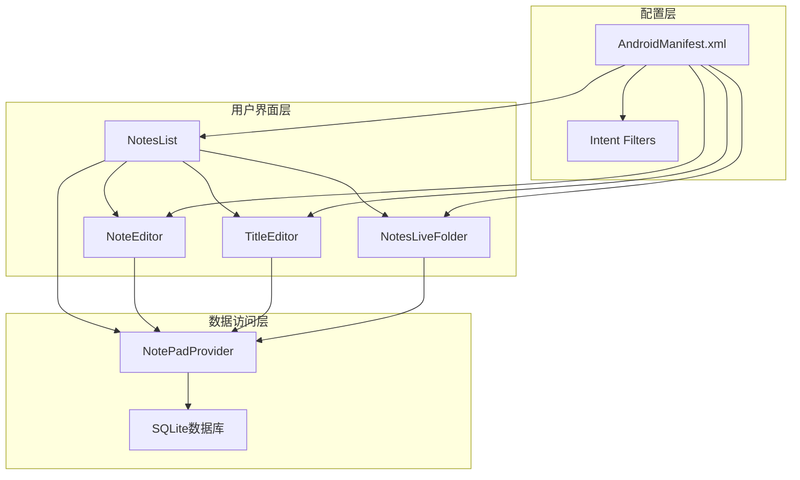
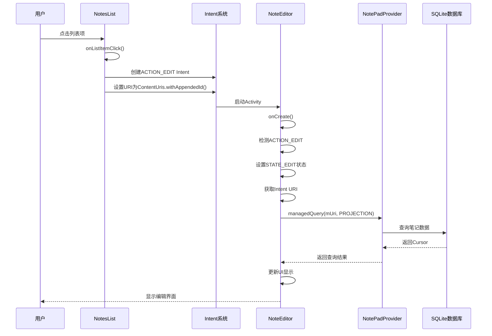
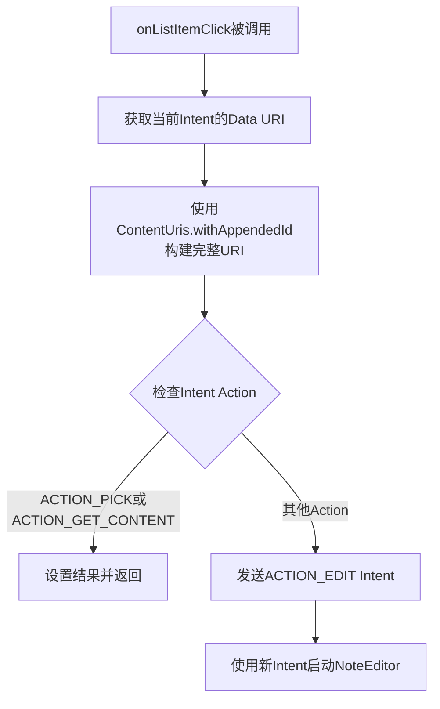
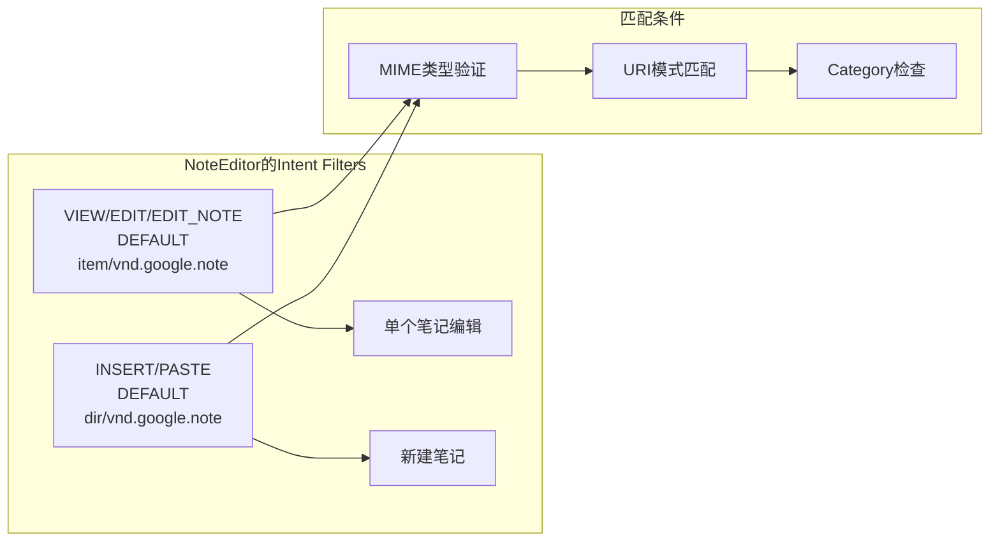
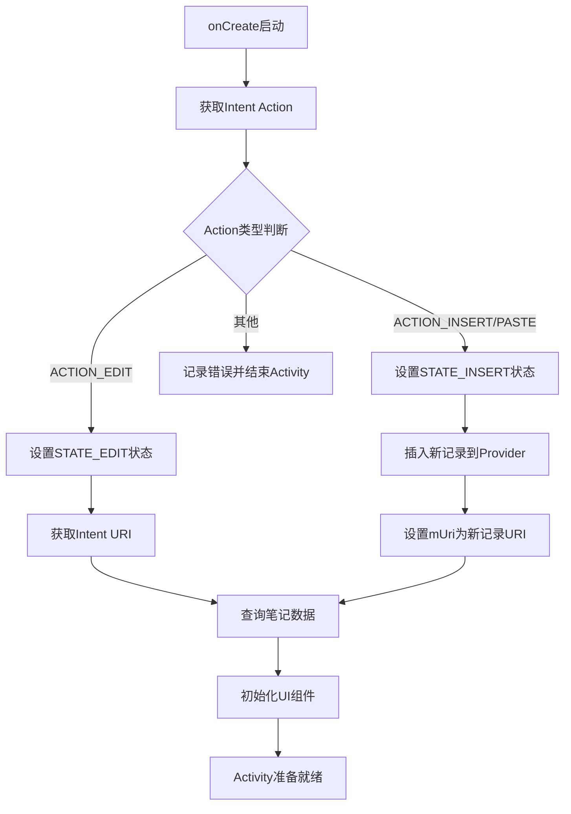
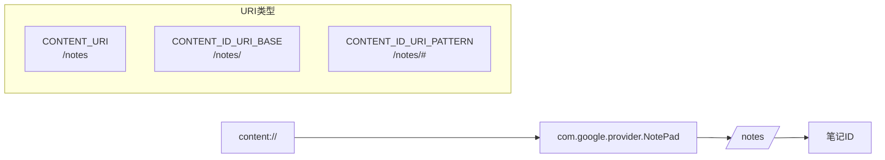
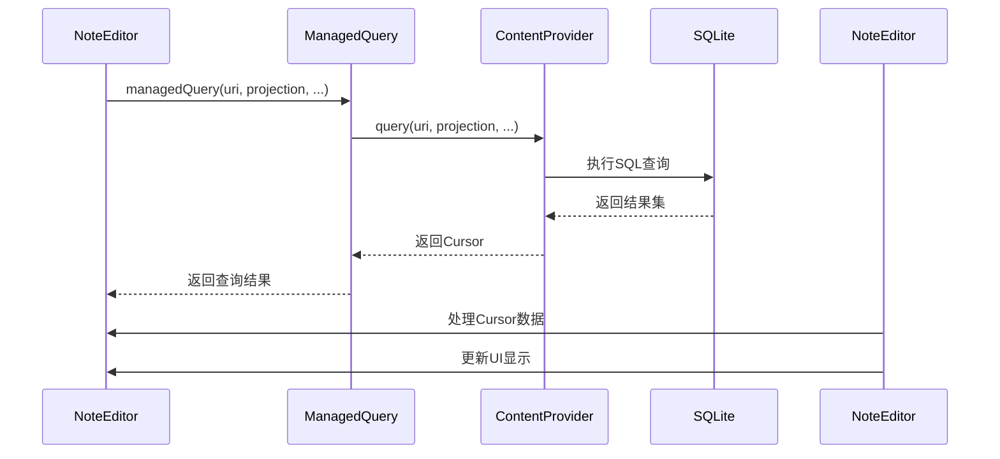
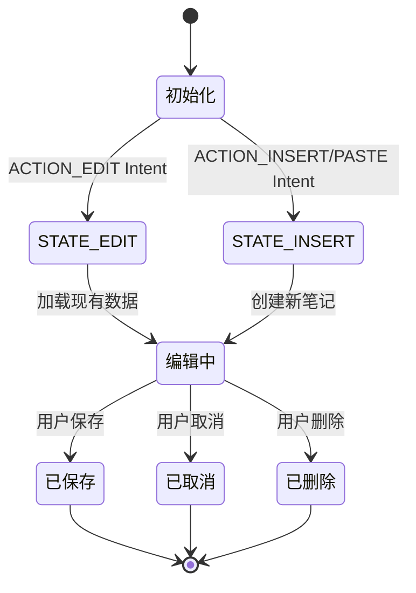

# EDIT操作路由

<cite>
**本文档中引用的文件**
- [NotesList.java](file://app/src/main/java/com/example/android/notepad/NotesList.java)
- [NoteEditor.java](file://app/src/main/java/com/example/android/notepad/NoteEditor.java)
- [AndroidManifest.xml](file://app/src/main/AndroidManifest.xml)
- [NotePad.java](file://app/src/main/java/com/example/android/notepad/NotePad.java)
- [NotesLiveFolder.java](file://app/src/main/java/com/example/android/notepad/NotesLiveFolder.java)
</cite>

## 目录
1. [简介](#简介)
2. [系统架构概览](#系统架构概览)
3. [ACTION_EDIT操作的完整路由流程](#action_edit操作的完整路由流程)
4. [NotesList中的onListItemClick方法](#noteslist中的onlistitemclick方法)
5. [AndroidManifest.xml中的Intent Filter配置](#androidmanifestxml中的intent-filter配置)
6. [NoteEditor中的onCreate方法处理](#noteeditor中的oncreate方法处理)
7. [URI构建与数据查询机制](#uri构建与数据查询机制)
8. [状态管理与数据传递](#状态管理与数据传递)
9. [总结](#总结)

## 简介

NotePad应用是一个典型的Android内容提供者应用程序，它展示了如何通过Intent机制实现不同Activity之间的数据传递和状态管理。本文档详细分析了ACTION_EDIT操作从触发到完成的完整路由流程，包括从NotesList列表项点击到NoteEditor编辑界面显示的整个过程。

ACTION_EDIT是Android系统中用于编辑现有数据的标准Intent操作，当用户选择要编辑的笔记时，系统会通过这个操作启动相应的编辑器Activity。

## 系统架构概览

NotePad应用采用经典的Android MVC架构模式，主要包含以下核心组件：



**图表来源**
- [NotesList.java](file://app/src/main/java/com/example/android/notepad/NotesList.java#L56-L550)
- [NoteEditor.java](file://app/src/main/java/com/example/android/notepad/NoteEditor.java#L54-L616)
- [AndroidManifest.xml](file://app/src/main/AndroidManifest.xml#L34-L78)

## ACTION_EDIT操作的完整路由流程

ACTION_EDIT操作的路由流程涉及多个步骤，从用户交互到最终的数据展示：



**图表来源**
- [NotesList.java](file://app/src/main/java/com/example/android/notepad/NotesList.java#L528-L548)
- [NoteEditor.java](file://app/src/main/java/com/example/android/notepad/NoteEditor.java#L140-L240)

## NotesList中的onListItemClick方法

NotesList的onListItemClick方法是ACTION_EDIT操作的起点，它负责处理用户点击列表项的事件：

### 方法功能分析

该方法的主要职责包括：
1. 构建目标笔记的完整URI
2. 根据Intent的Action类型决定处理方式
3. 对于非PICK和GET_CONTENT操作，发送ACTION_EDIT Intent

### URI构建机制



**图表来源**
- [NotesList.java](file://app/src/main/java/com/example/android/notepad/NotesList.java#L531-L548)

### 关键实现细节

- **URI构建**：使用`ContentUris.withAppendedId(getIntent().getData(), id)`方法
- **Action判断**：通过`getIntent().getAction()`获取当前操作类型
- **Intent创建**：`new Intent(Intent.ACTION_EDIT, uri)`创建编辑意图

**节来源**
- [NotesList.java](file://app/src/main/java/com/example/android/notepad/NotesList.java#L528-L548)

## AndroidManifest.xml中的Intent Filter配置

NoteEditor Activity的Intent Filter配置决定了它如何响应ACTION_EDIT操作：

### 核心配置分析



**图表来源**
- [AndroidManifest.xml](file://app/src/main/AndroidManifest.xml#L58-L77)

### 配置详解

1. **第一个Intent Filter**（第58-66行）：
   - 支持的操作：VIEW、EDIT、EDIT_NOTE
   - MIME类型：`vnd.android.cursor.item/vnd.google.note`
   - Category：DEFAULT

2. **第二个Intent Filter**（第72-77行）：
   - 支持的操作：INSERT、PASTE
   - MIME类型：`vnd.android.cursor.dir/vnd.google.note`
   - Category：DEFAULT

### ACTION_EDIT的匹配机制

当系统接收到ACTION_EDIT Intent时，会按照以下顺序匹配：
1. 检查Intent的Action是否匹配
2. 验证URI的MIME类型是否符合要求
3. 确认Category包含DEFAULT

**节来源**
- [AndroidManifest.xml](file://app/src/main/AndroidManifest.xml#L58-L77)

## NoteEditor中的onCreate方法处理

NoteEditor的onCreate方法是处理ACTION_EDIT操作的核心逻辑：

### 状态检测与初始化



**图表来源**
- [NoteEditor.java](file://app/src/main/java/com/example/android/notepad/NoteEditor.java#L140-L240)

### ACTION_EDIT的具体处理流程

1. **状态设置**（第158-162行）：
   ```java
   if (Intent.ACTION_EDIT.equals(action)) {
       mState = STATE_EDIT;
       mUri = intent.getData();
   }
   ```

2. **URI获取**：直接从Intent中提取URI数据

3. **状态常量定义**：
   - `STATE_EDIT = 0`：表示正在编辑现有笔记
   - `STATE_INSERT = 1`：表示正在创建新笔记

### 数据查询机制

NoteEditor使用managedQuery方法从ContentProvider获取笔记数据：

```java
mCursor = managedQuery(
    mUri,         // 要查询的URI
    PROJECTION,   // 投影数组，包含需要的列
    null,         // 无筛选条件
    null,         // 无参数
    null          // 使用默认排序
);
```

**节来源**
- [NoteEditor.java](file://app/src/main/java/com/example/android/notepad/NoteEditor.java#L140-L240)

## URI构建与数据查询机制

URI构建和数据查询是ACTION_EDIT操作的关键技术环节：

### URI结构分析

基于NotePad类的定义，URI结构如下：



**图表来源**
- [NotePad.java](file://app/src/main/java/com/example/android/notepad/NotePad.java#L83-L98)

### ContentUris.withAppendedId的工作原理

该方法将基础URI和ID组合成完整的笔记URI：

1. **输入参数**：
   - 基础URI：`NotePad.Notes.CONTENT_ID_URI_BASE`
   - ID值：从列表项获取的行ID

2. **输出结果**：形如`content://com.google.provider.NotePad/notes/123`的完整URI

### Cursor数据查询流程



**图表来源**
- [NoteEditor.java](file://app/src/main/java/com/example/android/notepad/NoteEditor.java#L210-L216)

### 投影数组定义

NoteEditor使用以下投影数组获取所需数据：

| 列索引 | 列名 | 描述 |
|--------|------|------|
| 0 | _ID | 笔记唯一标识符 |
| 1 | COLUMN_NAME_TITLE | 笔记标题 |
| 2 | COLUMN_NAME_NOTE | 笔记内容 |

**节来源**
- [NoteEditor.java](file://app/src/main/java/com/example/android/notepad/NoteEditor.java#L61-L66)

## 状态管理与数据传递

NoteEditor实现了完善的状态管理系统来区分不同的操作模式：

### 状态常量定义

```java
private static final int STATE_EDIT = 0;    // 编辑现有笔记
private static final int STATE_INSERT = 1;  // 创建新笔记
```

### 状态转换机制



### 数据传递机制

1. **Intent传递**：通过Intent的URI数据传递目标笔记
2. **状态变量**：使用`mState`变量跟踪当前操作状态
3. **全局变量**：`mUri`存储当前笔记的URI，`mCursor`存储查询结果

### onResume方法中的数据恢复

当Activity重新获得焦点时，onResume方法会：
1. 重新查询数据（防止数据过期）
2. 移动到第一行记录
3. 根据状态设置窗口标题
4. 将数据填充到EditText控件

**节来源**
- [NoteEditor.java](file://app/src/main/java/com/example/android/notepad/NoteEditor.java#L241-L308)

## 总结

NotePad应用中的ACTION_EDIT操作路由展示了Android Intent机制的强大功能和灵活性。整个流程从用户点击列表项开始，经过Intent构建、Activity启动、状态检测、数据查询等多个步骤，最终完成笔记编辑界面的显示。

### 关键技术要点

1. **Intent驱动的组件通信**：通过标准Intent操作实现Activity间的解耦
2. **URI标准化**：使用ContentProvider的URI规范进行数据访问
3. **状态管理模式**：通过状态常量和变量实现不同操作模式的区分
4. **数据绑定机制**：通过Cursor和Adapter实现数据与UI的自动同步

### 最佳实践体现

- **单一职责原则**：每个Activity只负责特定的功能
- **松耦合设计**：Intent机制实现组件间的松耦合通信
- **标准化接口**：遵循Android平台的标准Intent规范
- **资源管理**：使用managedQuery自动管理Cursor生命周期

这种设计模式不仅保证了代码的可维护性和可扩展性，也为开发者提供了清晰的开发框架和最佳实践指导。