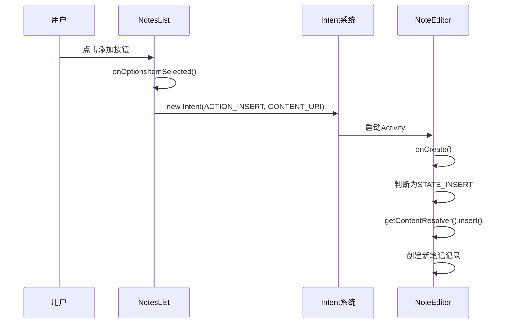
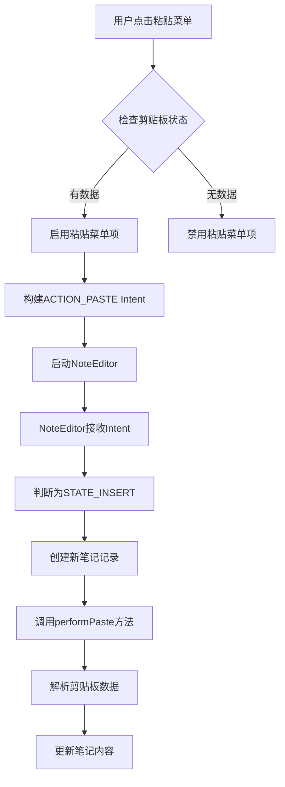
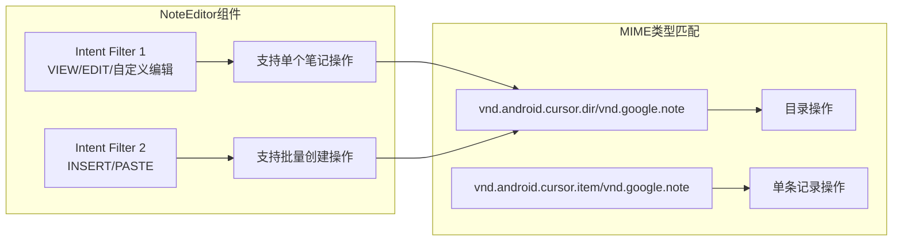
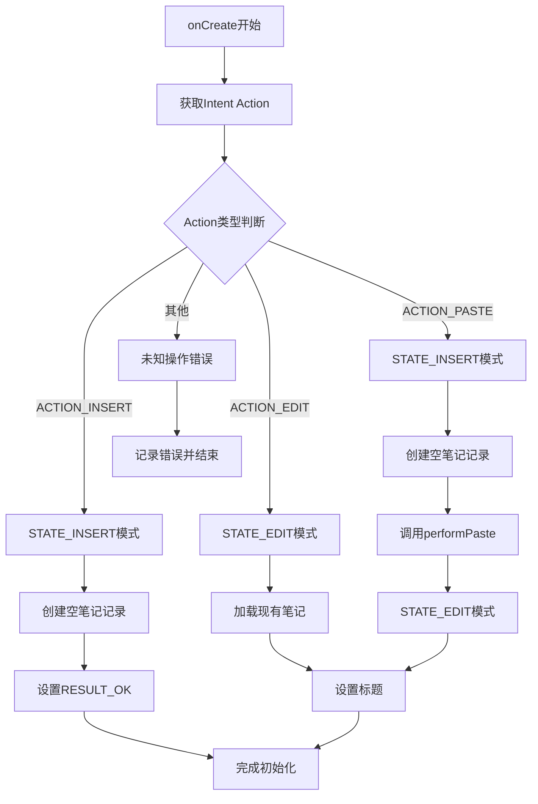
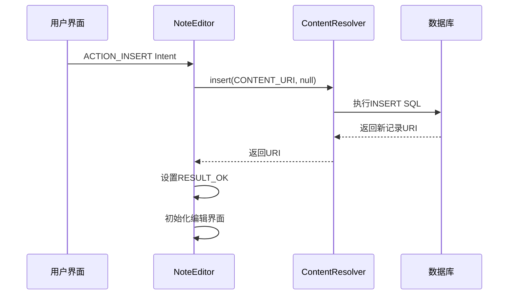
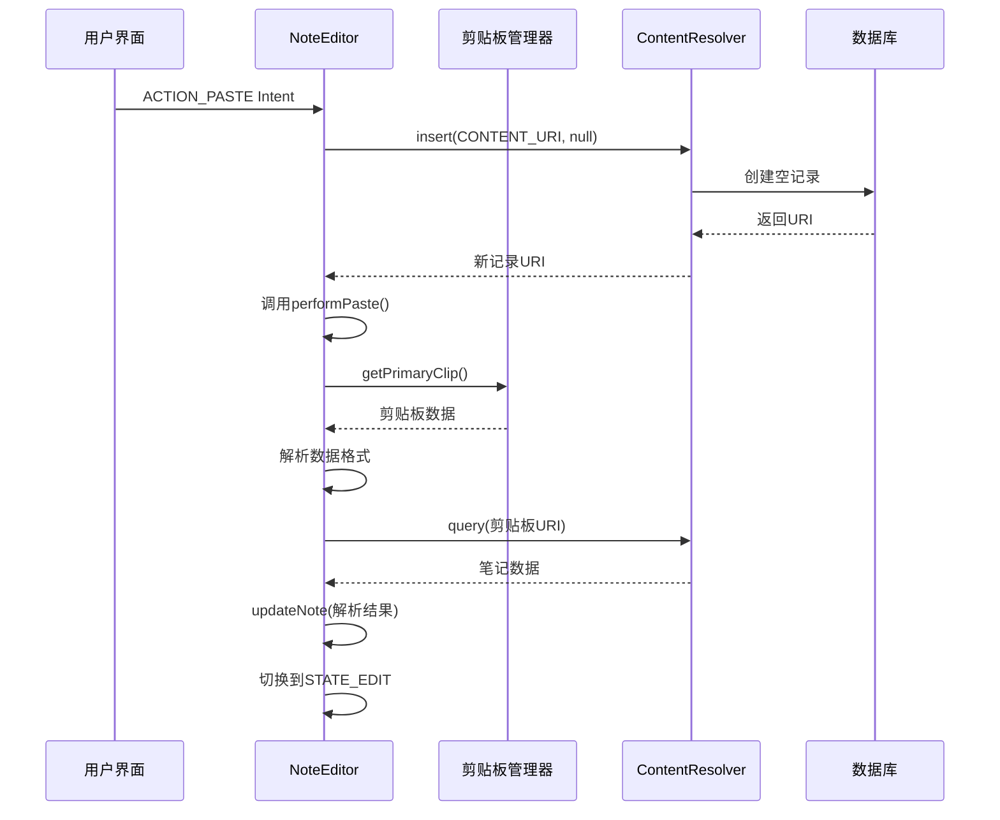
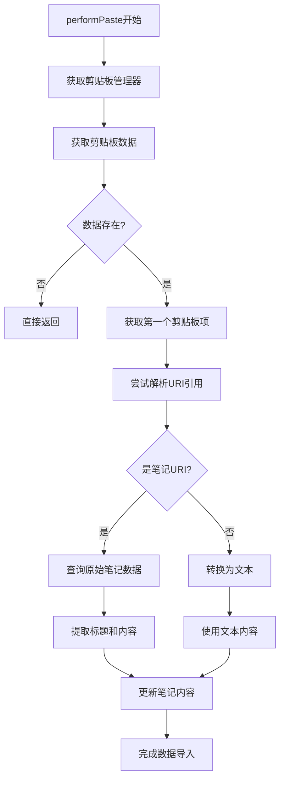

# INSERT与PASTE操作路由机制详细分析

<cite>
**本文档引用的文件**
- [NotesList.java](file://app/src/main/java/com/example/android/notepad/NotesList.java)
- [NoteEditor.java](file://app/src/main/java/com/example/android/notepad/NoteEditor.java)
- [AndroidManifest.xml](file://app/src/main/AndroidManifest.xml)
- [NotePad.java](file://app/src/main/java/com/example/android/notepad/NotePad.java)
- [list_options_menu.xml](file://app/src/main/res/menu/list_options_menu.xml)
- [editor_options_menu.xml](file://app/src/main/res/res/menu/editor_options_menu.xml)
</cite>

## 目录
1. [引言](#引言)
2. [系统架构概览](#系统架构概览)
3. [ACTION_INSERT操作路由机制](#action_insert操作路由机制)
4. [ACTION_PASTE操作路由机制](#action_paste操作路由机制)
5. [Intent过滤器配置](#intent过滤器配置)
6. [NoteEditor中的操作区分逻辑](#noteeditor中的操作区分逻辑)
7. [数据流分析](#数据流分析)
8. [剪贴板数据处理](#剪贴板数据处理)
9. [性能考虑](#性能考虑)
10. [故障排除指南](#故障排除指南)
11. [总结](#总结)

## 引言

NotePad应用是一个典型的Android内容提供者示例，展示了如何通过Intent机制实现不同操作类型（INSERT和PASTE）之间的路由。本文档深入分析了这两个核心操作的完整生命周期，从用户界面交互到后台数据处理的每个环节。

## 系统架构概览

NotePad应用采用经典的Android MVC架构模式，包含以下核心组件：

```mermaid
graph TB
subgraph "用户界面层"
A[NotesList] --> B[列表选项菜单]
C[NoteEditor] --> D[编辑器选项菜单]
end
subgraph "Intent路由层"
E[Intent过滤器] --> F[AndroidManifest.xml]
G[ACTION_INSERT] --> H[启动NoteEditor]
I[ACTION_PASTE] --> J[启动NoteEditor]
end
subgraph "业务逻辑层"
K[NoteEditor.onCreate] --> L[操作类型判断]
M[STATE_INSERT] --> N[创建空笔记]
O[STATE_PASTE] --> P[从剪贴板导入]
end
subgraph "数据访问层"
Q[ContentResolver] --> R[数据库操作]
S[getContentResolver().insert] --> T[插入新记录]
U[performPaste方法] --> V[查询剪贴板数据]
end
A --> E
C --> K
K --> Q
```

**图表来源**
- [NotesList.java](file://app/src/main/java/com/example/android/notepad/NotesList.java#L351-L369)
- [NoteEditor.java](file://app/src/main/java/com/example/android/notepad/NoteEditor.java#L140-L200)
- [AndroidManifest.xml](file://app/src/main/AndroidManifest.xml#L53-L78)

## ACTION_INSERT操作路由机制

### 用户界面触发

ACTION_INSERT操作通过NotesList中的添加按钮触发，具体实现如下：



**图表来源**
- [NotesList.java](file://app/src/main/java/com/example/android/notepad/NotesList.java#L351-L360)
- [NoteEditor.java](file://app/src/main/java/com/example/android/notepad/NoteEditor.java#L165-L171)

### Intent构建与传递

在NotesList中，ACTION_INSERT操作通过以下代码实现：

**节来源**
- [NotesList.java](file://app/src/main/java/com/example/android/notepad/NotesList.java#L351-L360)

### NoteEditor接收处理

NoteEditor通过Intent的action字段识别INSERT操作，并执行相应的初始化逻辑。

**节来源**
- [NoteEditor.java](file://app/src/main/java/com/example/android/notepad/NoteEditor.java#L165-L171)

## ACTION_PASTE操作路由机制

### 剪贴板数据准备

ACTION_PASTE操作需要依赖系统剪贴板中的数据，其触发流程包括：



**图表来源**
- [NotesList.java](file://app/src/main/java/com/example/android/notepad/NotesList.java#L263-L276)
- [NotesList.java](file://app/src/main/java/com/example/android/notepad/NotesList.java#L361-L368)

### 剪贴板数据检测

NotesList通过ClipboardManager检测剪贴板状态，动态控制粘贴菜单项的可用性。

**节来源**
- [NotesList.java](file://app/src/main/java/com/example/android/notepad/NotesList.java#L263-L276)

### 数据导入流程

ACTION_PASTE操作不仅创建新笔记，还包含复杂的剪贴板数据解析逻辑。

**节来源**
- [NotesList.java](file://app/src/main/java/com/example/android/notepad/NotesList.java#L361-L368)

## Intent过滤器配置

### AndroidManifest.xml中的配置

NotePad应用在AndroidManifest.xml中定义了两个关键的intent-filter：



**图表来源**
- [AndroidManifest.xml](file://app/src/main/AndroidManifest.xml#L53-L78)

### 过滤器详解

**节来源**
- [AndroidManifest.xml](file://app/src/main/AndroidManifest.xml#L53-L78)

## NoteEditor中的操作区分逻辑

### onCreate方法中的状态判断

NoteEditor的onCreate方法是整个操作区分的核心，通过以下逻辑实现：



**图表来源**
- [NoteEditor.java](file://app/src/main/java/com/example/android/notepad/NoteEditor.java#L140-L200)

### STATE_INSERT处理逻辑

当识别到INSERT或PASTE操作时，NoteEditor执行相同的初始化流程：

**节来源**
- [NoteEditor.java](file://app/src/main/java/com/example/android/notepad/NoteEditor.java#L165-L171)

### STATE_PASTE特殊处理

PASTE操作在完成基础初始化后，会立即调用performPaste方法：

**节来源**
- [NoteEditor.java](file://app/src/main/java/com/example/android/notepad/NoteEditor.java#L218-L225)

## 数据流分析

### INSERT操作的数据流

INSERT操作的数据流相对简单，主要涉及新记录的创建：



**图表来源**
- [NoteEditor.java](file://app/src/main/java/com/example/android/notepad/NoteEditor.java#L170-L171)

### PASTE操作的数据流

PASTE操作包含额外的剪贴板数据处理步骤：



**图表来源**
- [NoteEditor.java](file://app/src/main/java/com/example/android/notepad/NoteEditor.java#L218-L225)
- [NoteEditor.java](file://app/src/main/java/com/example/android/notepad/NoteEditor.java#L452-L515)

## 剪贴板数据处理

### performPaste方法实现

performPaste方法是PASTE操作的核心，负责从剪贴板提取和解析数据：



**图表来源**
- [NoteEditor.java](file://app/src/main/java/com/example/android/notepad/NoteEditor.java#L452-L515)

### 数据格式解析

剪贴板数据可能包含多种格式，performPaste方法实现了智能解析：

**节来源**
- [NoteEditor.java](file://app/src/main/java/com/example/android/notepad/NoteEditor.java#L452-L515)

## 性能考虑

### UI线程阻塞问题

NotePad应用在多个地方直接在UI线程执行数据库操作，这虽然简化了代码结构，但存在性能风险：

- **managedQuery** 在 onResume 中被调用
- **getContentResolver().insert()** 在 onCreate 中被调用  
- **getContentResolver().update()** 在 onPause 中被调用

### 异步处理建议

为了提高应用性能，建议使用以下异步处理方案：

1. **AsyncQueryHandler** 替代 managedQuery
2. **AsyncTask** 处理数据库操作
3. **Loader** 框架进行数据加载

## 故障排除指南

### 常见问题及解决方案

#### 1. INSERT操作失败

**症状**: 新建笔记时应用崩溃或无法创建新记录

**原因分析**: 
- 数据库权限问题
- ContentProvider未正确注册
- URI格式不正确

**解决方案**:
- 检查AndroidManifest.xml中的provider配置
- 验证CONTENT_URI常量定义
- 确认数据库表结构正确

#### 2. PASTE操作无效果

**症状**: 粘贴菜单项可用但没有数据导入

**原因分析**:
- 剪贴板为空或格式不正确
- MIME类型不匹配
- 权限不足

**解决方案**:
- 验证剪贴板数据格式
- 检查MIME类型匹配规则
- 确认READ_EXTERNAL_STORAGE权限

#### 3. Intent路由失败

**症状**: 点击菜单项无响应或跳转到错误Activity

**原因分析**:
- Intent过滤器配置错误
- Action名称不匹配
- Category缺失

**解决方案**:
- 检查AndroidManifest.xml中的intent-filter配置
- 验证Action常量定义
- 确认Category设置

## 总结

NotePad应用的INSERT和PASTE操作路由机制展现了Android Intent系统的强大功能。通过精心设计的Intent过滤器和清晰的状态判断逻辑，应用能够优雅地处理不同类型的操作请求。

### 关键设计原则

1. **单一职责**: 每个Intent过滤器专注于特定的操作类型
2. **状态分离**: 通过STATE常量明确区分不同的编辑状态
3. **数据驱动**: 基于Intent内容自动选择处理逻辑
4. **用户体验**: 提供直观的操作反馈和错误处理

### 最佳实践建议

1. **异步处理**: 将数据库操作移至后台线程
2. **错误处理**: 添加完善的异常捕获和用户提示
3. **性能优化**: 使用缓存和预加载提升响应速度
4. **安全性**: 验证输入数据和权限检查

这种设计模式不仅适用于笔记应用，也为其他Android应用的内容提供者开发提供了宝贵的参考价值。