# Intent路由机制

<cite>
**本文档中引用的文件**
- [AndroidManifest.xml](file://app/src/main/AndroidManifest.xml)
- [NotesList.java](file://app/src/main/java/com/example/android/notepad/NotesList.java)
- [NoteEditor.java](file://app/src/main/java/com/example/android/notepad/NoteEditor.java)
- [NotePad.java](file://app/src/main/java/com/example/android/notepad/NotePad.java)
- [list_options_menu.xml](file://app/src/main/res/menu/list_options_menu.xml)
- [editor_options_menu.xml](file://app/src/main/res/menu/editor_options_menu.xml)
- [strings.xml](file://app/src/main/res/values/strings.xml)
</cite>

## 目录
1. [简介](#简介)
2. [项目结构概览](#项目结构概览)
3. [Intent过滤器架构](#intent过滤器架构)
4. [核心Activity的Intent路由](#核心activity的intent路由)
5. [NotesList中的Intent处理](#noteslist中的intent处理)
6. [NoteEditor中的Intent处理](#noteeditor中的intent处理)
7. [扩展点机制与CATEGORY_ALTERNATIVE](#扩展点机制与category_alternative)
8. [完整流程分析](#完整流程分析)
9. [总结](#总结)

## 简介

NotePad应用的Intent路由机制是Android应用程序中Intent分发和Activity启动的核心体现。该系统通过精心设计的Intent过滤器、Action识别和数据路由，在NotesList和NoteEditor之间建立了灵活而高效的通信机制。本文档将深入分析这一机制的实现细节，包括不同Action的路由逻辑、扩展点机制以及完整的Intent传递流程。

## 项目结构概览

NotePad应用采用典型的Android MVC架构，主要包含以下核心组件：

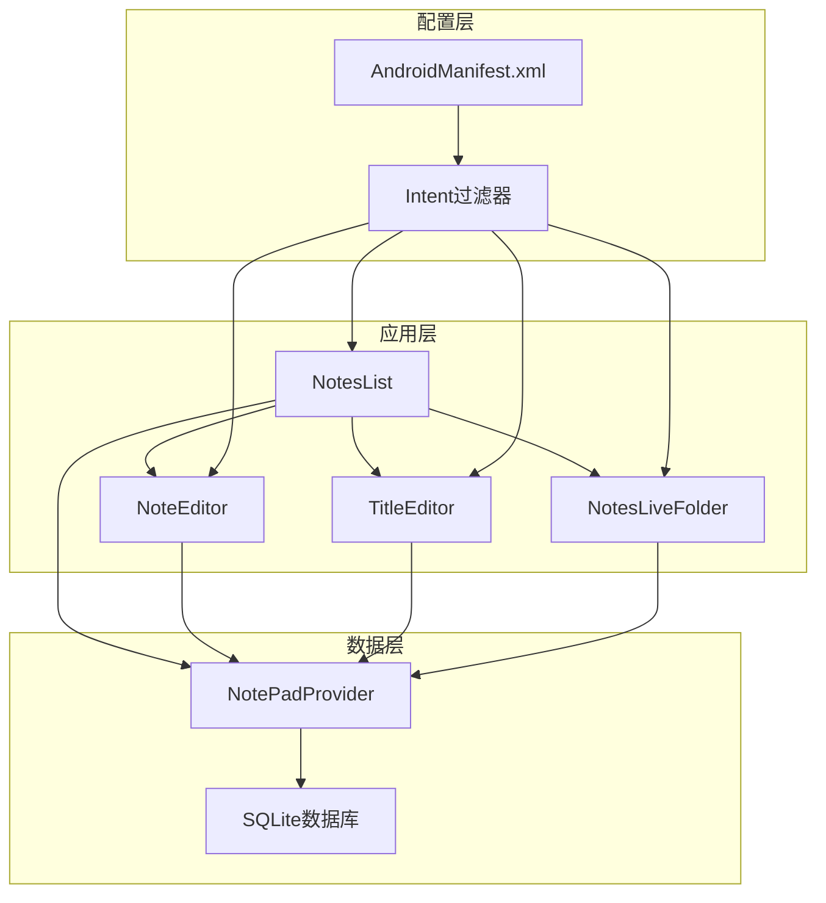

**图表来源**
- [AndroidManifest.xml](file://app/src/main/AndroidManifest.xml#L34-L116)
- [NotesList.java](file://app/src/main/java/com/example/android/notepad/NotesList.java#L56-L550)
- [NoteEditor.java](file://app/src/main/java/com/example/android/notepad/NoteEditor.java#L54-L616)

**章节来源**
- [AndroidManifest.xml](file://app/src/main/AndroidManifest.xml#L1-L119)
- [NotesList.java](file://app/src/main/java/com/example/android/notepad/NotesList.java#L1-L50)

## Intent过滤器架构

AndroidManifest.xml中定义了三个主要Activity的Intent过滤器，每个过滤器都针对特定的使用场景进行了优化。

### NotesList的Intent过滤器

NotesList作为主界面，配置了多个Intent过滤器以支持不同的操作模式：

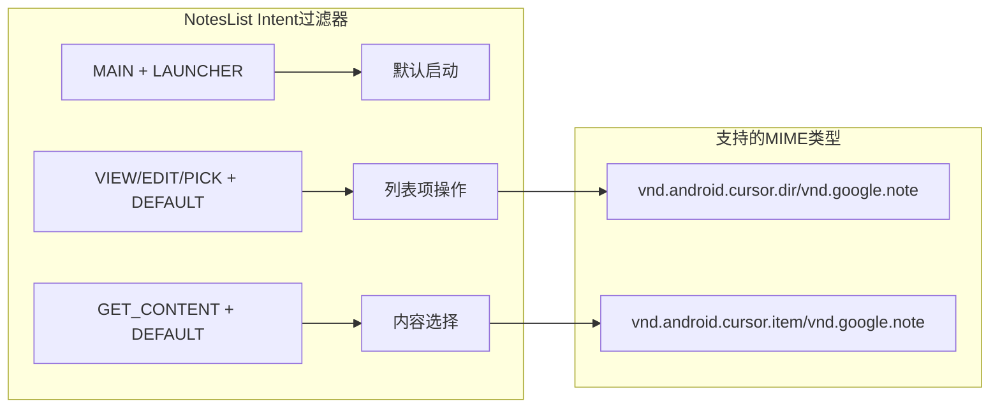

**图表来源**
- [AndroidManifest.xml](file://app/src/main/AndroidManifest.xml#L34-L50)

### NoteEditor的Intent过滤器

NoteEditor配置了两个专门的Intent过滤器，分别处理不同的编辑场景：

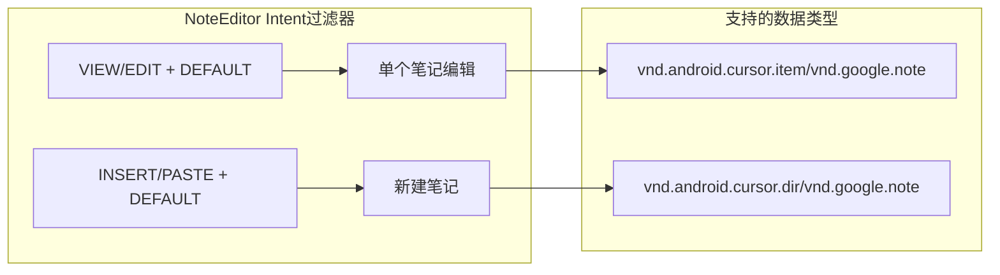

**图表来源**
- [AndroidManifest.xml](file://app/src/main/AndroidManifest.xml#L53-L77)

**章节来源**
- [AndroidManifest.xml](file://app/src/main/AndroidManifest.xml#L34-L77)

## 核心Activity的Intent路由

### ACTION_EDIT路由机制

ACTION_EDIT是最常用的Intent Action，用于打开和编辑现有笔记：

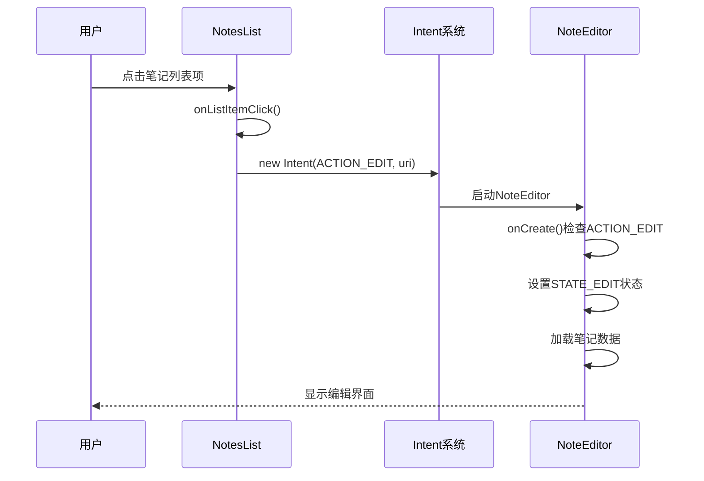

**图表来源**
- [NotesList.java](file://app/src/main/java/com/example/android/notepad/NotesList.java#L528-L548)
- [NoteEditor.java](file://app/src/main/java/com/example/android/notepad/NoteEditor.java#L138-L200)

### ACTION_INSERT路由机制

ACTION_INSERT用于创建新的空白笔记：

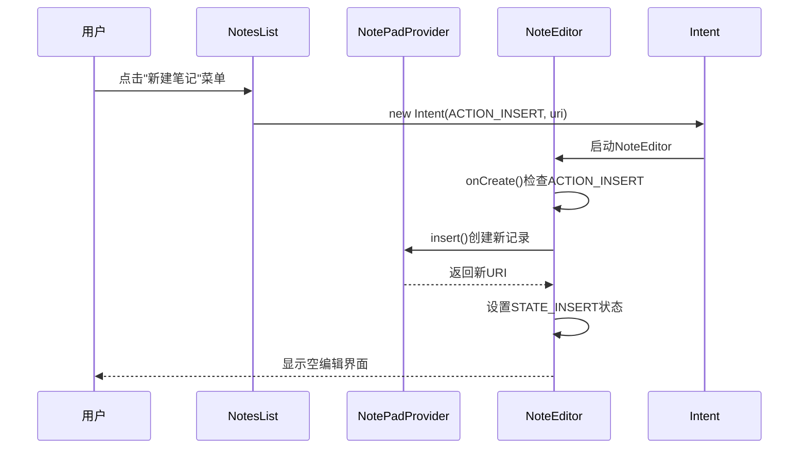

**图表来源**
- [NotesList.java](file://app/src/main/java/com/example/android/notepad/NotesList.java#L353-L359)
- [NoteEditor.java](file://app/src/main/java/com/example/android/notepad/NoteEditor.java#L165-L178)

### ACTION_PASTE路由机制

ACTION_PASTE用于从剪贴板创建新笔记：

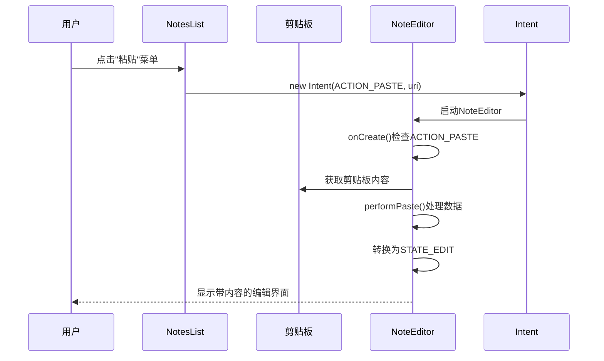

**图表来源**
- [NotesList.java](file://app/src/main/java/com/example/android/notepad/NotesList.java#L361-L367)
- [NoteEditor.java](file://app/src/main/java/com/example/android/notepad/NoteEditor.java#L165-L178)

**章节来源**
- [NotesList.java](file://app/src/main/java/com/example/android/notepad/NotesList.java#L353-L367)
- [NoteEditor.java](file://app/src/main/java/com/example/android/notepad/NoteEditor.java#L138-L200)

## NotesList中的Intent处理

### onListItemClick方法的路由逻辑

NotesList的onListItemClick方法是Intent路由的核心入口，根据Intent Action决定不同的处理方式：

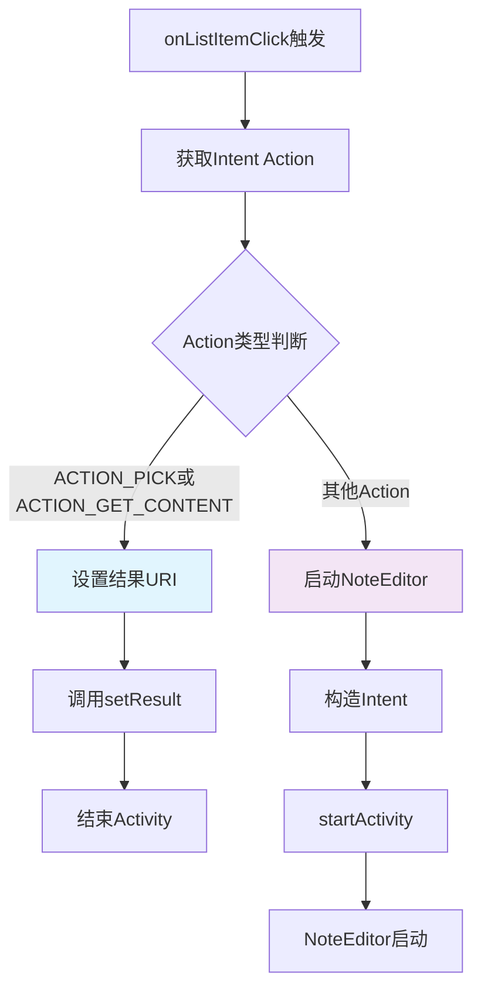

**图表来源**
- [NotesList.java](file://app/src/main/java/com/example/android/notepad/NotesList.java#L528-L548)

### 菜单选项的Intent生成

NotesList提供了多种菜单选项，每种都对应特定的Intent Action：

| 菜单项 | Intent Action | 目标Activity | 数据URI |
|--------|---------------|--------------|---------|
| 新建笔记 | ACTION_INSERT | NoteEditor | Notes.CONTENT_URI |
| 粘贴 | ACTION_PASTE | NoteEditor | Notes.CONTENT_URI |
| 打开 | ACTION_EDIT | NoteEditor | 选中笔记URI |

**章节来源**
- [NotesList.java](file://app/src/main/java/com/example/android/notepad/NotesList.java#L353-L367)
- [list_options_menu.xml](file://app/src/main/res/menu/list_options_menu.xml#L4-L22)

## NoteEditor中的Intent处理

### onCreate方法的状态初始化

NoteEditor的onCreate方法根据Intent Action设置不同的编辑状态：

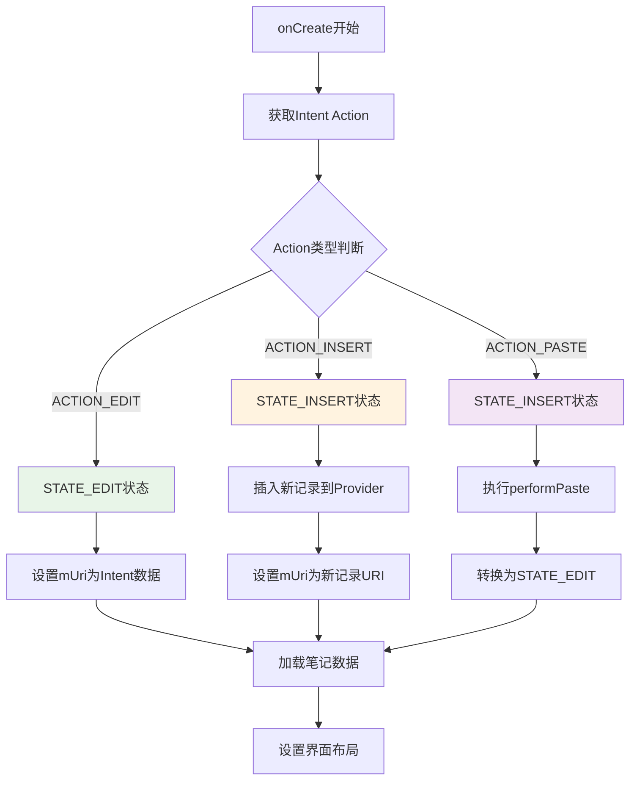

**图表来源**
- [NoteEditor.java](file://app/src/main/java/com/example/android/notepad/NoteEditor.java#L138-L200)

### 编辑状态管理

NoteEditor维护两种主要状态来控制编辑行为：

| 状态常量 | 数值 | 描述 | 主要行为 |
|----------|------|------|----------|
| STATE_EDIT | 0 | 编辑现有笔记 | 从Provider读取数据，更新时修改现有记录 |
| STATE_INSERT | 1 | 创建新笔记 | 插入新记录，首次保存后转换为STATE_EDIT |

**章节来源**
- [NoteEditor.java](file://app/src/main/java/com/example/android/notepad/NoteEditor.java#L73-L75)
- [NoteEditor.java](file://app/src/main/java/com/example/android/notepad/NoteEditor.java#L138-L200)

## 扩展点机制与CATEGORY_ALTERNATIVE

### CATEGORY_ALTERNATIVE的作用

CATEGORY_ALTERNATIVE是Android系统提供的扩展点机制，允许其他应用注册替代操作：

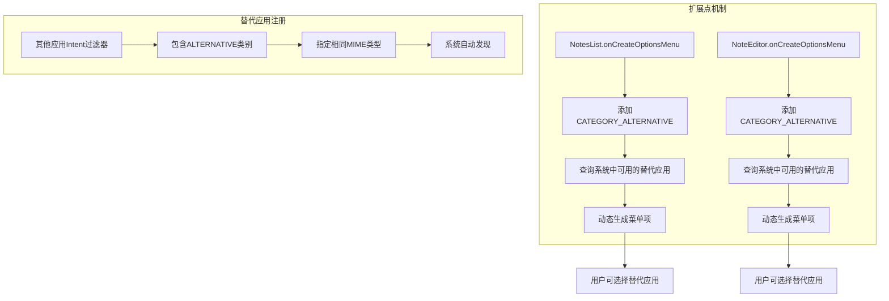

**图表来源**
- [NotesList.java](file://app/src/main/java/com/example/android/notepad/NotesList.java#L196-L200)
- [NoteEditor.java](file://app/src/main/java/com/example/android/notepad/NoteEditor.java#L390-L405)

### CATEGORY_SELECTED_ALTERNATIVE

CATEGORY_SELECTED_ALTERNATIVE用于标记当用户选择特定数据时可用的替代操作：

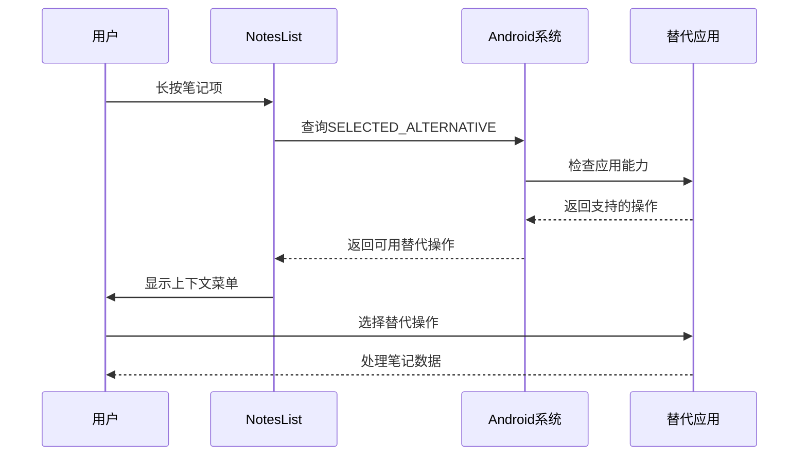

**图表来源**
- [AndroidManifest.xml](file://app/src/main/AndroidManifest.xml#L90-L105)

**章节来源**
- [NotesList.java](file://app/src/main/java/com/example/android/notepad/NotesList.java#L196-L200)
- [NoteEditor.java](file://app/src/main/java/com/example/android/notepad/NoteEditor.java#L390-L405)
- [AndroidManifest.xml](file://app/src/main/AndroidManifest.xml#L90-L105)

## 完整流程分析

### 从菜单点击到Activity启动的完整流程

以下是用户点击"新建笔记"菜单项时的完整Intent传递过程：

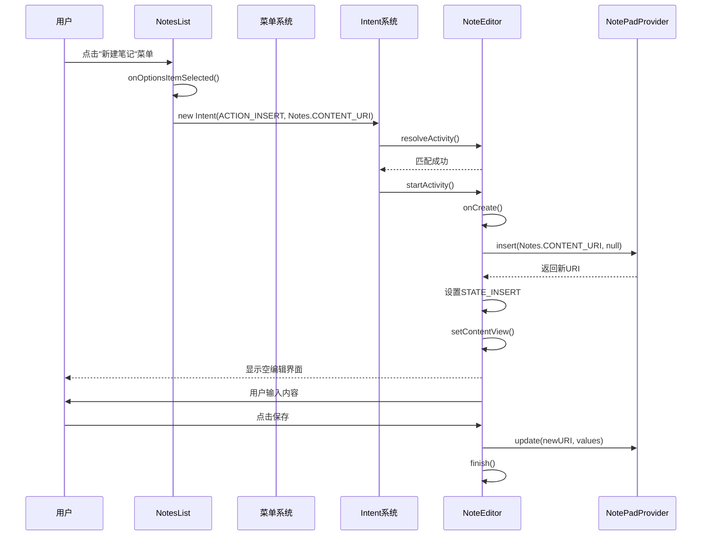

**图表来源**
- [NotesList.java](file://app/src/main/java/com/example/android/notepad/NotesList.java#L353-L359)
- [NoteEditor.java](file://app/src/main/java/com/example/android/notepad/NoteEditor.java#L138-L178)

### 数据URI的构建和传递

NotePad应用中的URI构建遵循标准的Android内容提供者模式：

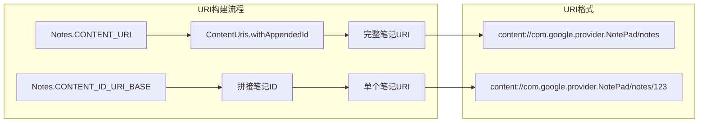

**图表来源**
- [NotePad.java](file://app/src/main/java/com/example/android/notepad/NotePad.java#L83-L98)

### 附加数据的处理

Intent系统支持在URI之外附加额外数据，这些数据可以通过Intent的putExtra方法传递：

| 数据类型 | 使用场景 | 示例 |
|----------|----------|------|
| String | 笔记标题 | Intent.putExtra("title", "会议记录") |
| Bundle | 复杂对象 | Intent.putExtra("extras", bundle) |
| Parcelable | 自定义对象 | Intent.putExtra("note", noteObject) |

**章节来源**
- [NotesList.java](file://app/src/main/java/com/example/android/notepad/NotesList.java#L353-L367)
- [NoteEditor.java](file://app/src/main/java/com/example/android/notepad/NoteEditor.java#L138-L200)
- [NotePad.java](file://app/src/main/java/com/example/android/notepad/NotePad.java#L83-L98)

## 总结

NotePad应用的Intent路由机制展现了Android系统Intent分发的强大功能。通过精心设计的Intent过滤器、Action识别和状态管理，系统实现了以下关键特性：

1. **灵活的路由机制**：通过不同的Intent Action（ACTION_EDIT、ACTION_INSERT、ACTION_PASTE）实现多样化的用户操作
2. **清晰的状态管理**：在NoteEditor中通过STATE常量区分编辑和插入两种模式
3. **强大的扩展性**：利用CATEGORY_ALTERNATIVE和CATEGORY_SELECTED_ALTERNATIVE支持第三方应用集成
4. **统一的数据模型**：基于标准URI模式实现数据的一致性访问
5. **流畅的用户体验**：从菜单点击到Activity启动的无缝衔接

这种设计不仅保证了应用内部的功能完整性，还为系统的可扩展性和互操作性奠定了坚实基础。开发者可以参考这一模式来设计自己的Android应用Intent路由系统，实现更加灵活和用户友好的交互体验。