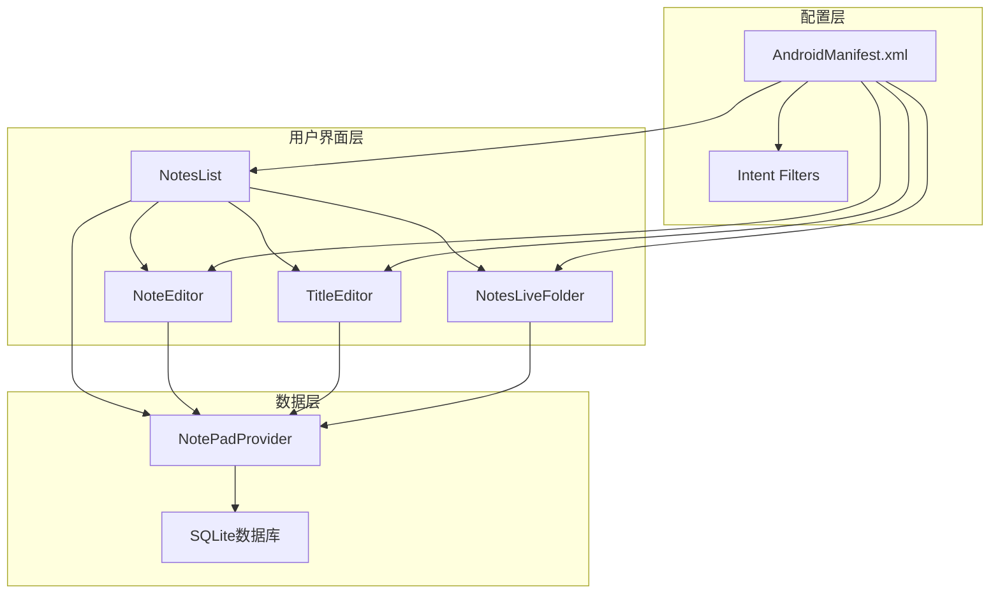
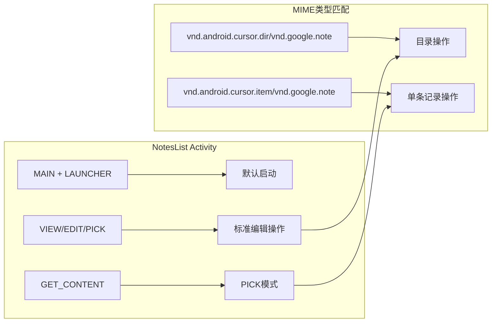
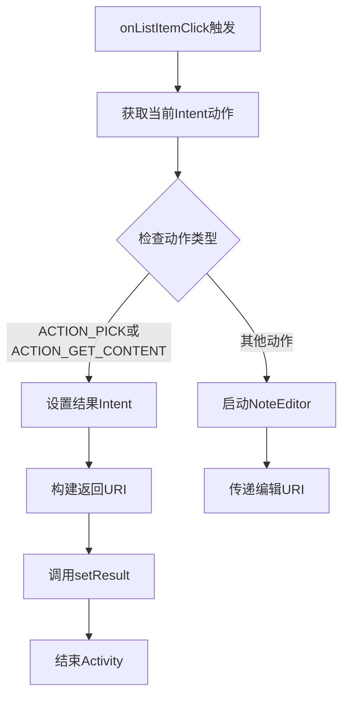
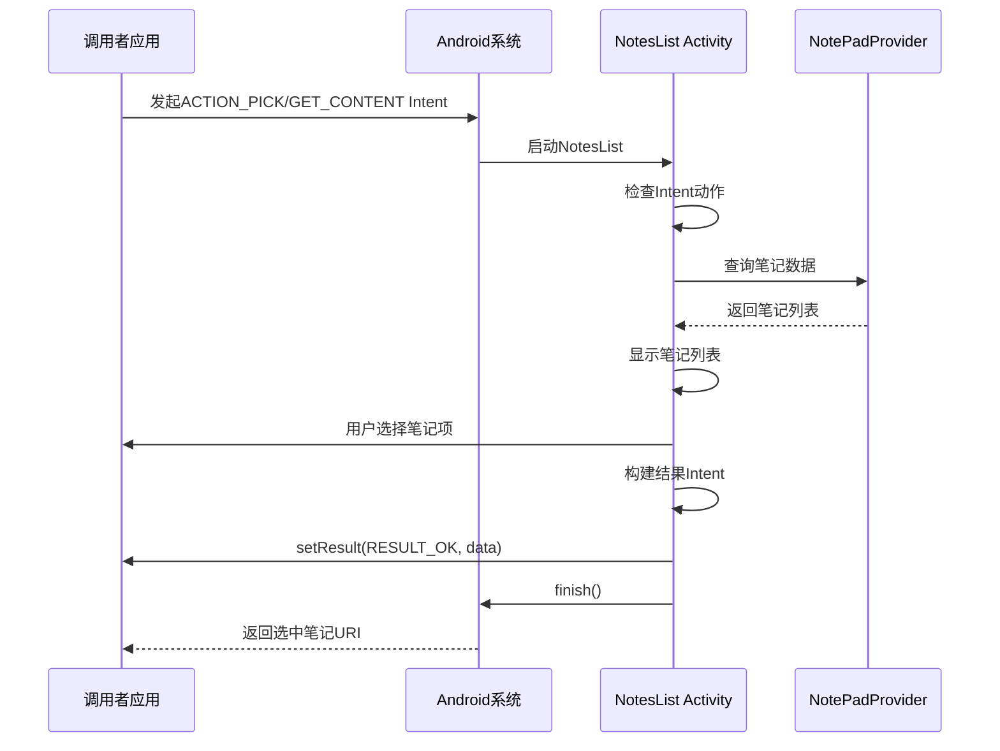
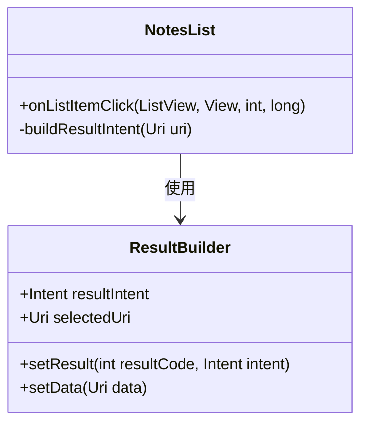
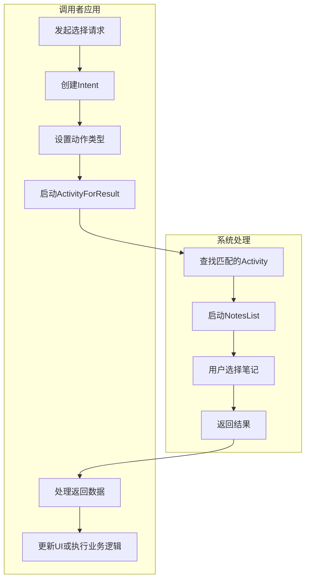

# PICK与GET_CONTENT操作路由机制分析

<cite>
**本文档引用的文件**
- [NotesList.java](file://app/src/main/java/com/example/android/notepad/NotesList.java)
- [AndroidManifest.xml](file://app/src/main/AndroidManifest.xml)
- [NoteEditor.java](file://app/src/main/java/com/example/android/notepad/NoteEditor.java)
- [list_context_menu.xml](file://app/src/main/res/menu/list_context_menu.xml)
- [list_options_menu.xml](file://app/src/main/res/menu/list_options_menu.xml)
</cite>

## 目录
1. [引言](#引言)
2. [项目结构概述](#项目结构概述)
3. [核心组件分析](#核心组件分析)
4. [Intent过滤器配置](#intent过滤器配置)
5. [PICK与GET_CONTENT操作处理机制](#pick与get_content操作处理机制)
6. [路由流程详解](#路由流程详解)
7. [结果Intent构建](#结果intent构建)
8. [应用场景分析](#应用场景分析)
9. [性能考虑](#性能考虑)
10. [故障排除指南](#故障排除指南)
11. [总结](#总结)

## 引言

NotePad应用中的ACTION_PICK和ACTION_GET_CONTENT操作是Android系统中数据选择模式的重要实现。这些操作允许其他应用程序从NotePad中选取笔记数据，而无需直接访问底层数据存储。本文档深入分析了这两种特殊Intent动作的路由机制，包括NotesList中onListItemClick方法的处理逻辑、与常规编辑操作的区别，以及系统如何通过setResult方法将选中笔记的URI返回给调用者。

## 项目结构概述

NotePad应用采用典型的Android MVC架构，主要包含以下核心组件：

**图表来源**
- [NotesList.java](file://app/src/main/java/com/example/android/notepad/NotesList.java#L1-L50)
- [NoteEditor.java](file://app/src/main/java/com/example/android/notepad/NoteEditor.java#L1-L50)
- [AndroidManifest.xml](file://app/src/main/AndroidManifest.xml#L34-L50)

**章节来源**
- [NotesList.java](file://app/src/main/java/com/example/android/notepad/NotesList.java#L1-L100)
- [AndroidManifest.xml](file://app/src/main/AndroidManifest.xml#L1-L119)

## 核心组件分析

### NotesList类的核心功能

NotesList是NotePad应用的主要列表视图组件，负责显示笔记列表并处理用户交互。该类继承自ListActivity，提供了丰富的功能：

- **数据查询与显示**：通过managedQuery方法从NotePadProvider获取笔记数据
- **搜索功能**：实现了基于标题和内容的全文搜索
- **上下文菜单支持**：为每个笔记项提供复制、删除等操作
- **Intent路由处理**：根据不同的Intent动作执行相应的业务逻辑

### Intent动作类型定义

系统中定义了多种Intent动作类型，每种对应不同的使用场景：

| 动作类型 | 描述 | 使用场景 |
|---------|------|----------|
| ACTION_EDIT | 编辑现有笔记 | 用户点击笔记进入编辑模式 |
| ACTION_INSERT | 创建新笔记 | 用户新建空白笔记 |
| ACTION_PICK | 选择数据（仅URI） | 其他应用从NotePad选择笔记 |
| ACTION_GET_CONTENT | 获取或创建数据 | 其他应用请求笔记内容 |

**章节来源**
- [NotesList.java](file://app/src/main/java/com/example/android/notepad/NotesList.java#L528-L548)

## Intent过滤器配置

AndroidManifest.xml中的intent-filter配置是实现PICK和GET_CONTENT操作的关键。以下是相关的配置结构：

**图表来源**
- [AndroidManifest.xml](file://app/src/main/AndroidManifest.xml#L39-L50)

### 关键配置解析

1. **MAIN + LAUNCHER过滤器**：用于应用启动
2. **VIEW/EDIT/PICK过滤器**：支持标准编辑操作
3. **GET_CONTENT过滤器**：专门处理数据选择请求

**章节来源**
- [AndroidManifest.xml](file://app/src/main/AndroidManifest.xml#L39-L50)

## PICK与GET_CONTENT操作处理机制

### onListItemClick方法的核心逻辑

NotesList的onListItemClick方法是处理PICK和GET_CONTENT操作的核心入口：

**图表来源**
- [NotesList.java](file://app/src/main/java/com/example/android/notepad/NotesList.java#L528-L548)

### 与常规编辑操作的区别

两种操作模式在处理逻辑上存在显著差异：

| 特征 | 常规编辑操作 | PICK/GET_CONTENT操作 |
|------|-------------|---------------------|
| 操作目标 | 进入编辑界面 | 返回数据URI |
| 启动Activity | NoteEditor | 不启动新Activity |
| 结果处理 | 用户完成编辑后返回 | 立即返回选中数据 |
| 数据流向 | 双向交互 | 单向数据输出 |

**章节来源**
- [NotesList.java](file://app/src/main/java/com/example/android/notepad/NotesList.java#L537-L548)

## 路由流程详解

### 完整的路由处理流程

**图表来源**
- [NotesList.java](file://app/src/main/java/com/example/android/notepad/NotesList.java#L528-L548)
- [AndroidManifest.xml](file://app/src/main/AndroidManifest.xml#L39-L50)

### 数据验证与安全检查

在处理PICK和GET_CONTENT请求时，系统会进行多层验证：

1. **Intent动作验证**：确认请求类型是否为PICK或GET_CONTENT
2. **URI有效性检查**：确保请求的笔记ID有效
3. **权限验证**：检查调用者是否有权访问指定笔记

**章节来源**
- [NotesList.java](file://app/src/main/java/com/example/android/notepad/NotesList.java#L531-L542)

## 结果Intent构建

### setResult方法的使用

当检测到PICK或GET_CONTENT动作时，NotesList通过以下方式构建返回结果：

**图表来源**
- [NotesList.java](file://app/src/main/java/com/example/android/notepad/NotesList.java#L540-L542)

### 返回数据格式

返回的Intent包含以下关键信息：
- **resultCode**：RESULT_OK表示成功
- **data**：包含选中笔记URI的Intent
- **URI格式**：content://com.google.provider.NotePad/notes/{note_id}

**章节来源**
- [NotesList.java](file://app/src/main/java/com/example/android/notepad/NotesList.java#L540-L542)

## 应用场景分析

### 集成方式示例

其他应用可以通过以下方式集成NotePad的数据选择功能：

### 典型应用场景

1. **笔记分享**：其他应用从NotePad选择笔记进行分享
2. **内容导入**：从NotePad导入笔记到其他应用
3. **模板选择**：选择预设模板进行快速创建
4. **数据迁移**：在不同设备间迁移笔记数据

**章节来源**
- [AndroidManifest.xml](file://app/src/main/AndroidManifest.xml#L46-L50)

## 性能考虑

### 内存管理优化

在处理大量笔记数据时，系统采用了以下优化策略：

- **游标管理**：使用managedQuery自动管理Cursor生命周期
- **延迟加载**：按需加载笔记内容，避免一次性加载所有数据
- **缓存机制**：对频繁访问的数据进行缓存

### 响应性优化

为了确保良好的用户体验，系统实现了以下响应性优化：

- **异步查询**：虽然代码中使用了同步查询，但实际应用中应使用AsyncQueryHandler
- **UI线程保护**：避免在主线程执行耗时操作
- **快速反馈**：立即响应用户选择，及时返回结果

**章节来源**
- [NotesList.java](file://app/src/main/java/com/example/android/notepad/NotesList.java#L108-L119)

## 故障排除指南

### 常见问题及解决方案

| 问题类型 | 症状 | 解决方案 |
|---------|------|----------|
| Intent无法匹配 | 应用未出现在选择列表 | 检查AndroidManifest.xml中的intent-filter配置 |
| 返回数据为空 | setResult未正确设置 | 验证onListItemClick中的条件判断逻辑 |
| 权限错误 | 访问被拒绝 | 检查Provider的权限配置 |
| 性能问题 | 选择操作响应缓慢 | 优化查询逻辑，考虑使用异步处理 |

### 调试技巧

1. **日志记录**：在关键节点添加Log语句
2. **Intent验证**：打印Intent的action和data信息
3. **状态检查**：验证Activity的生命周期状态

**章节来源**
- [NotesList.java](file://app/src/main/java/com/example/android/notepad/NotesList.java#L534-L542)

## 总结

NotePad应用中的ACTION_PICK和ACTION_GET_CONTENT操作路由机制体现了Android系统中数据选择模式的最佳实践。通过精心设计的Intent过滤器、智能的路由逻辑和高效的结果构建机制，系统实现了与其他应用的无缝集成。

### 关键特性总结

1. **灵活的路由机制**：通过onListItemClick方法区分不同类型的Intent动作
2. **高效的资源利用**：避免启动新Activity，直接通过setResult返回数据
3. **标准化的数据格式**：使用标准的URI格式确保数据兼容性
4. **良好的扩展性**：支持多种MIME类型和动作组合

### 最佳实践建议

- 在生产环境中使用异步查询替代同步查询
- 实现完善的错误处理和用户反馈机制
- 考虑添加数据验证和安全检查
- 优化大数据量场景下的性能表现

这种设计模式不仅提高了应用的可用性和集成度，也为开发者提供了清晰的接口规范，是Android应用开发中值得借鉴的设计思路。