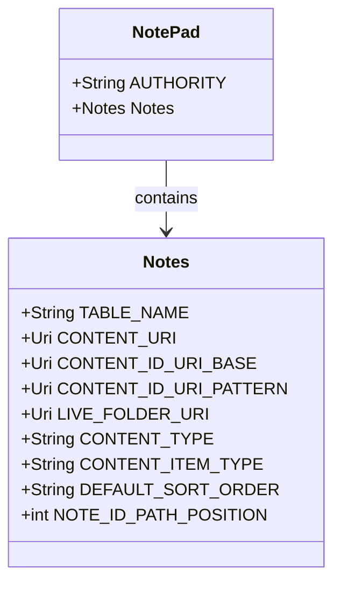
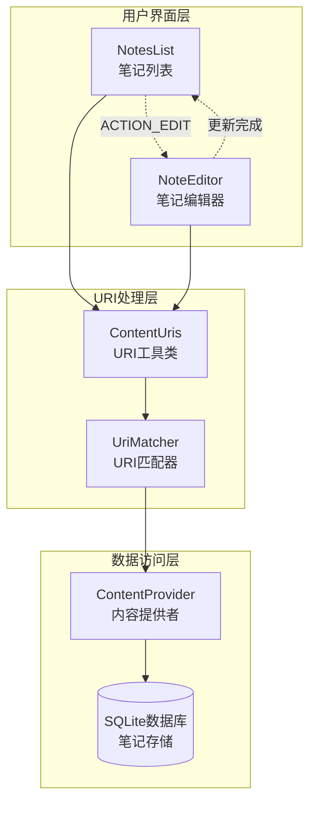
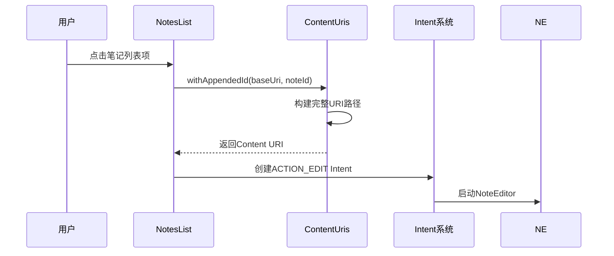
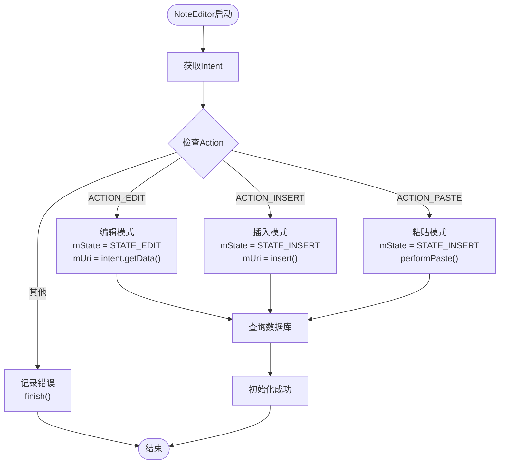
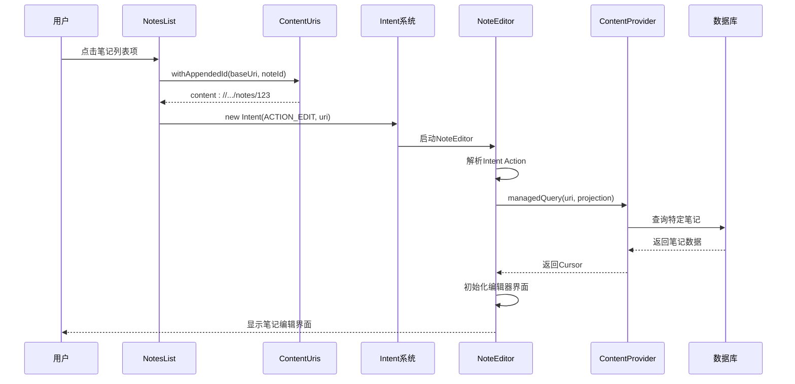
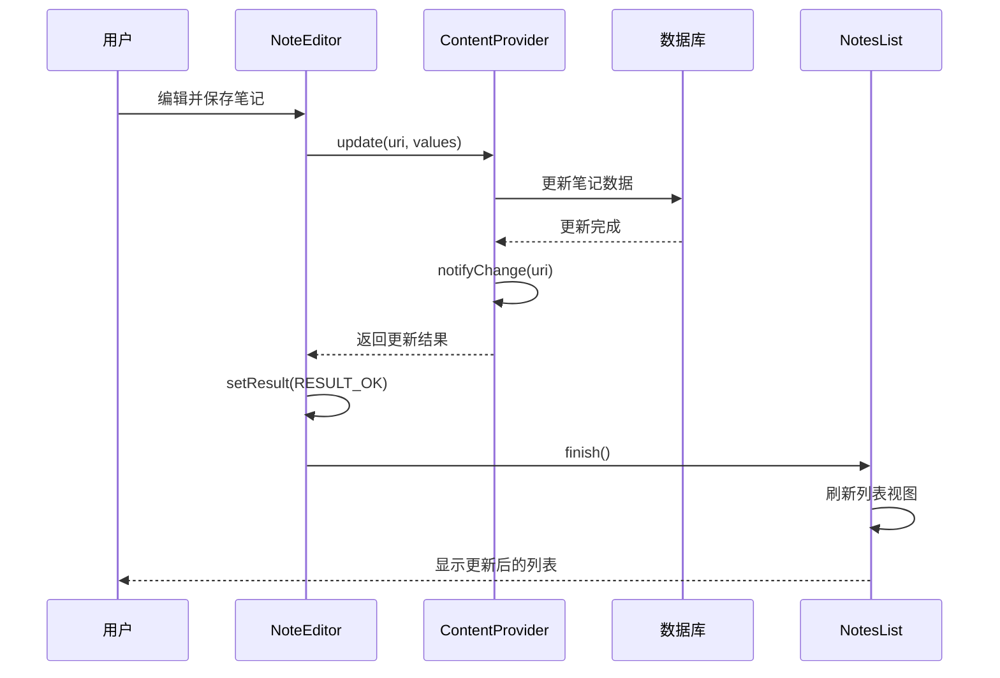

# URI传递机制详细文档

<cite>
**本文档引用的文件**
- [NotePad.java](file://app/src/main/java/com/example/android/notepad/NotePad.java)
- [NotesList.java](file://app/src/main/java/com/example/android/notepad/NotesList.java)
- [NoteEditor.java](file://app/src/main/java/com/example/android/notepad/NoteEditor.java)
- [NotePadProvider.java](file://app/src/main/java/com/example/android/notepad/NotePadProvider.java)
- [list_options_menu.xml](file://app/src/main/res/menu/list_options_menu.xml)
- [editor_options_menu.xml](file://app/src/main/res/menu/editor_options_menu.xml)
</cite>

## 目录
1. [简介](#简介)
2. [URI契约定义](#uri契约定义)
3. [URI传递架构](#uri传递架构)
4. [NotesList中的URI构建](#noteslist中的uri构建)
5. [NoteEditor中的URI解析](#noteeditor中的uri解析)
6. [操作模式下的URI处理](#操作模式下的uri处理)
7. [完整的传递流程](#完整的传递流程)
8. [错误处理与验证](#错误处理与验证)
9. [性能考虑](#性能考虑)
10. [总结](#总结)

## 简介

NotePad应用采用基于URI的统一接口机制，在应用内组件间传递数据。该机制通过Android的Content Provider框架实现，为笔记列表和编辑器提供了标准化的数据访问方式。本文档详细分析了从NotesList创建URI到NoteEditor解析URI的完整传递流程，以及不同操作模式下的URI构建和使用方式。

## URI契约定义

### 核心URI常量

NotePad应用在[`NotePad`](file://app/src/main/java/com/example/android/notepad/NotePad.java#L28-L155)契约类中定义了完整的URI结构：

**图表来源**
- [NotePad.java](file://app/src/main/java/com/example/android/notepad/NotePad.java#L28-L155)

### URI结构详解

| URI类型 | 完整URI格式 | 用途 |
|---------|-------------|------|
| 基础内容URI | `content://com.google.provider.NotePad/notes` | 访问所有笔记列表 |
| 笔记ID URI | `content://com.google.provider.NotePad/notes/{id}` | 访问特定笔记 |
| 内容项类型 | `vnd.android.cursor.item/vnd.google.note` | 单个笔记数据 |
| 目录类型 | `vnd.android.cursor.dir/vnd.google.note` | 笔记列表数据 |

**节来源**
- [NotePad.java](file://app/src/main/java/com/example/android/notepad/NotePad.java#L83-L104)

## URI传递架构

### 整体架构图

**图表来源**
- [NotesList.java](file://app/src/main/java/com/example/android/notepad/NotesList.java#L528-L548)
- [NoteEditor.java](file://app/src/main/java/com/example/android/notepad/NoteEditor.java#L140-L200)
- [NotePadProvider.java](file://app/src/main/java/com/example/android/notepad/NotePadProvider.java#L105-L132)

## NotesList中的URI构建

### onListItemClick方法中的URI创建

NotesList通过[`onListItemClick`](file://app/src/main/java/com/example/android/notepad/NotesList.java#L528-L548)方法创建指向特定笔记的URI：

**图表来源**
- [NotesList.java](file://app/src/main/java/com/example/android/notepad/NotesList.java#L528-L548)

### ContentUris.withAppendedId的应用

在多个位置使用[`ContentUris.withAppendedId`](file://app/src/main/java/com/example/android/notepad/NotesList.java#L531)方法：

1. **列表项点击处理**：[`NotesList.java#L531`](file://app/src/main/java/com/example/android/notepad/NotesList.java#L531)
2. **上下文菜单处理**：[`NotesList.java#L429-L430`](file://app/src/main/java/com/example/android/notepad/NotesList.java#L429-L430)
3. **选项菜单处理**：[`NotesList.java#L288-L296`](file://app/src/main/java/com/example/android/notepad/NotesList.java#L288-L296)

### 不同操作模式的URI构建

| 操作类型 | Intent Action | URI构建方式 | 结果URI示例 |
|----------|---------------|-------------|-------------|
| 编辑现有笔记 | ACTION_EDIT | `withAppendedId(baseUri, noteId)` | `content://.../notes/123` |
| 插入新笔记 | ACTION_INSERT | `baseUri` (不附加ID) | `content://.../notes` |
| 上下文编辑 | ACTION_EDIT | `withAppendedId(baseUri, noteId)` | `content://.../notes/456` |
| 复制笔记 | ACTION_COPY | `withAppendedId(baseUri, noteId)` | `content://.../notes/789` |

**节来源**
- [NotesList.java](file://app/src/main/java/com/example/android/notepad/NotesList.java#L528-L548)
- [NotesList.java](file://app/src/main/java/com/example/android/notepad/NotesList.java#L288-L296)

## NoteEditor中的URI解析

### onCreate方法中的URI处理

NoteEditor在[`onCreate`](file://app/src/main/java/com/example/android/notepad/NoteEditor.java#L140-L200)方法中根据Intent Action解析URI：

**图表来源**
- [NoteEditor.java](file://app/src/main/java/com/example/android/notepad/NoteEditor.java#L140-L200)

### URI状态管理

NoteEditor维护两种主要状态：

| 状态常量 | 数值 | 用途 | URI处理方式 |
|----------|------|------|-------------|
| STATE_EDIT | 0 | 编辑现有笔记 | 使用Intent中提供的URI |
| STATE_INSERT | 1 | 创建新笔记 | 调用insert()返回新URI |

**节来源**
- [NoteEditor.java](file://app/src/main/java/com/example/android/notepad/NoteEditor.java#L72-L75)

## 操作模式下的URI处理

### ACTION_EDIT模式

当用户选择编辑现有笔记时：

1. **URI提取**：从Intent中提取原始URI
2. **状态设置**：设置为编辑模式(`STATE_EDIT`)
3. **数据库查询**：使用URI查询特定笔记数据
4. **UI初始化**：填充编辑器界面

### ACTION_INSERT模式

当用户创建新笔记时：

1. **URI插入**：调用`getContentResolver().insert()`创建新记录
2. **状态设置**：设置为插入模式(`STATE_INSERT`)
3. **默认数据**：提供默认标题和空内容
4. **结果返回**：返回新创建笔记的URI

### ACTION_PASTE模式

当用户从剪贴板粘贴笔记时：

1. **剪贴板检查**：获取剪贴板内容
2. **URI验证**：验证是否为有效的笔记URI
3. **数据提取**：从剪贴板URI提取笔记内容
4. **状态转换**：转换为编辑模式

**节来源**
- [NoteEditor.java](file://app/src/main/java/com/example/android/notepad/NoteEditor.java#L158-L200)

## 完整的传递流程

### 从NotesList到NoteEditor的完整流程

**图表来源**
- [NotesList.java](file://app/src/main/java/com/example/android/notepad/NotesList.java#L528-L548)
- [NoteEditor.java](file://app/src/main/java/com/example/android/notepad/NoteEditor.java#L140-L200)

### 更新操作的反向传递

**图表来源**
- [NoteEditor.java](file://app/src/main/java/com/example/android/notepad/NoteEditor.java#L368-L375)
- [NotePadProvider.java](file://app/src/main/java/com/example/android/notepad/NotePadProvider.java#L668-L739)

## 错误处理与验证

### URI有效性检查

系统在多个层次进行URI有效性验证：

1. **Intent Action验证**：检查Action是否为已知类型
2. **URI格式验证**：确保URI符合预期格式
3. **数据库查询验证**：确认查询结果非空
4. **权限检查**：验证访问权限

### 异常处理策略

| 错误类型 | 处理方式 | 用户反馈 |
|----------|----------|----------|
| 无效URI | 记录日志，关闭Activity | 显示错误消息 |
| 查询失败 | 设置错误标题和消息 | 显示错误界面 |
| 插入失败 | 记录错误，关闭Activity | 显示失败提示 |
| 权限不足 | 拒绝操作，返回取消结果 | 显示权限提示 |

**节来源**
- [NoteEditor.java](file://app/src/main/java/com/example/android/notepad/NoteEditor.java#L178-L199)
- [NoteEditor.java](file://app/src/main/java/com/example/android/notepad/NoteEditor.java#L304-L307)

## 性能考虑

### 数据库操作优化

1. **异步查询**：建议使用AsyncQueryHandler或AsyncTask
2. **游标管理**：正确关闭游标避免内存泄漏
3. **批量操作**：合并多个数据库操作减少开销
4. **缓存策略**：合理使用游标通知机制

### URI处理性能

1. **静态常量**：URI常量作为静态字段提高访问效率
2. **字符串拼接**：避免重复的字符串拼接操作
3. **对象复用**：重用UriMatcher等对象
4. **延迟加载**：按需加载URI相关资源

## 总结

NotePad应用的URI传递机制体现了Android Content Provider架构的最佳实践。通过统一的URI接口，实现了以下核心功能：

1. **标准化数据访问**：所有组件都通过URI与Content Provider交互
2. **灵活的操作模式**：支持编辑、插入、删除等多种操作
3. **清晰的状态管理**：明确区分编辑和插入两种状态
4. **完善的错误处理**：多层次的验证和异常处理机制
5. **高效的性能表现**：合理的数据库操作和URI处理策略

这种设计不仅保证了应用内部组件间的良好解耦，也为扩展和维护提供了坚实的基础。开发者可以基于这套机制轻松添加新的功能，而无需修改现有的URI传递逻辑。