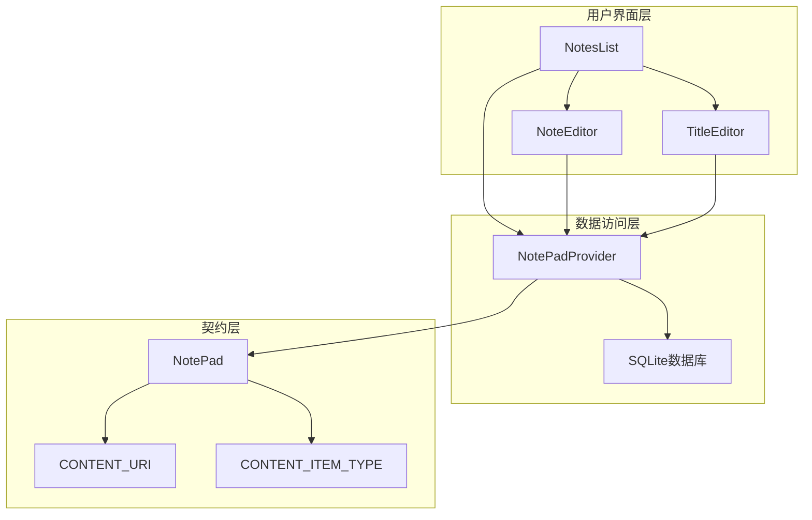
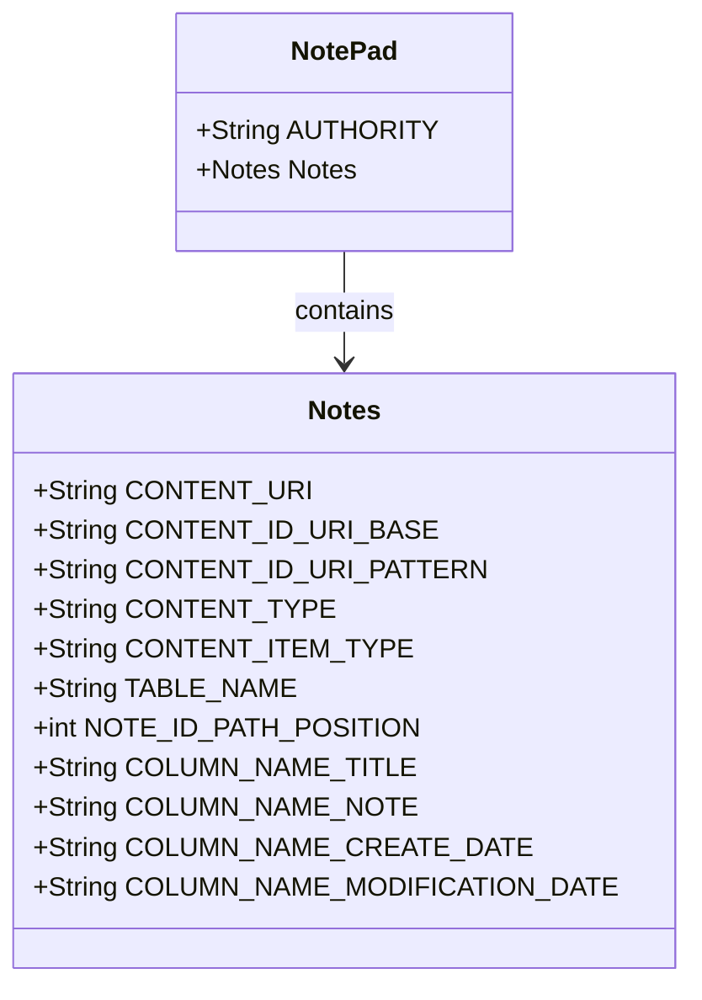
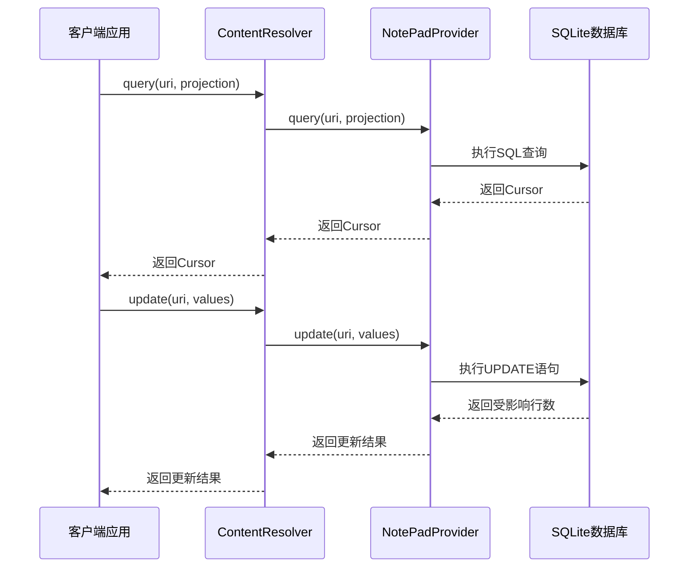
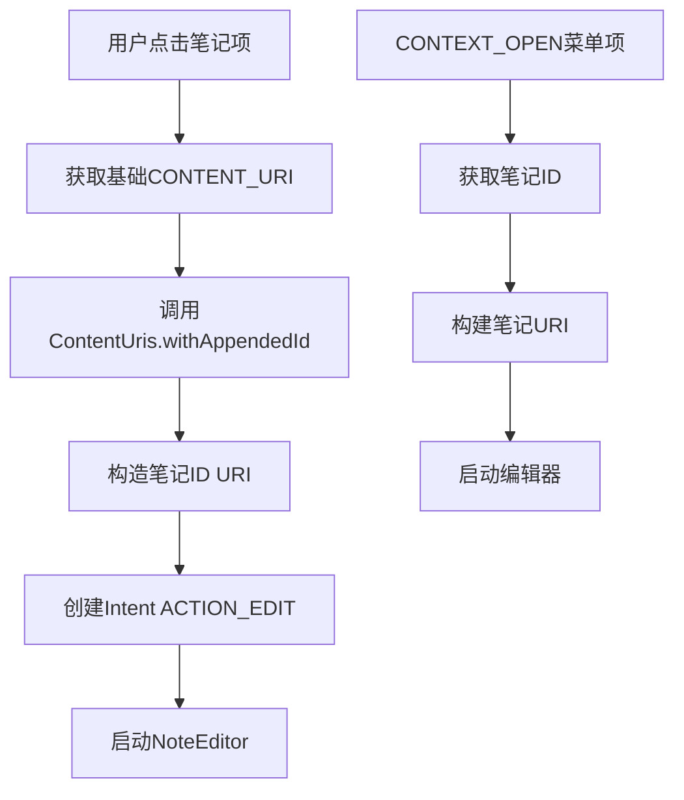
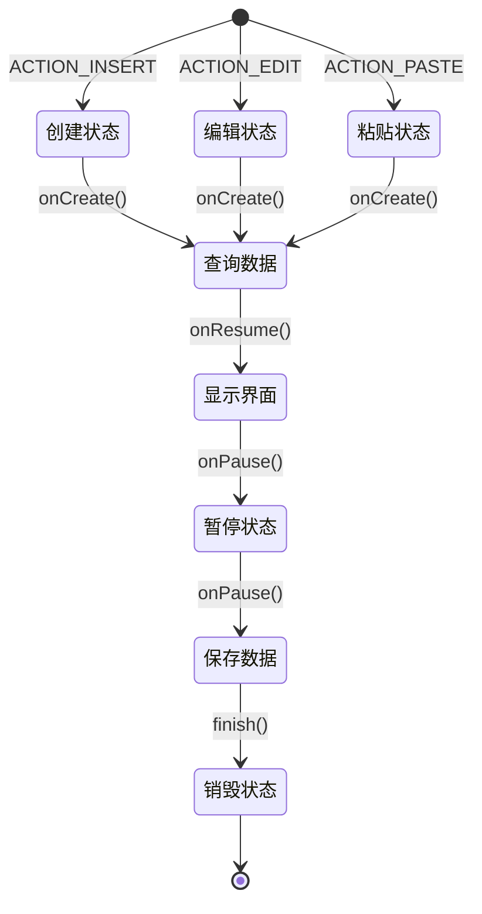
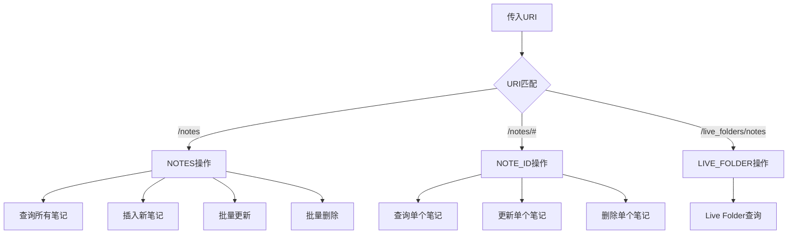
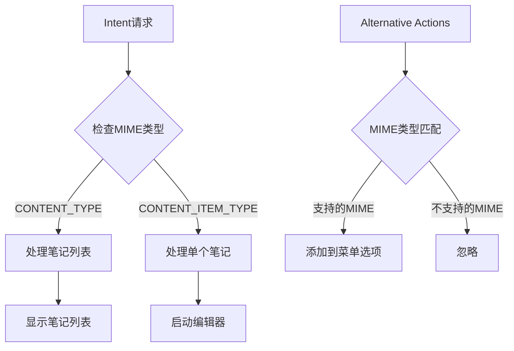
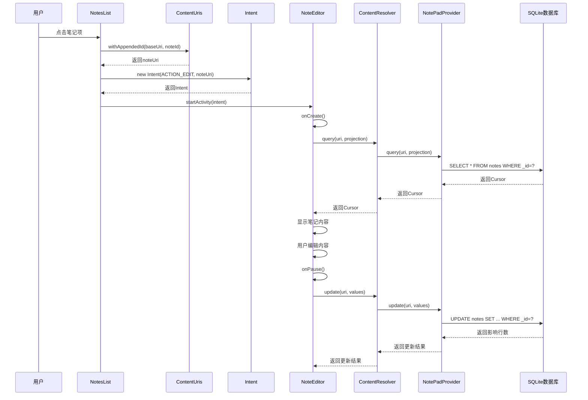
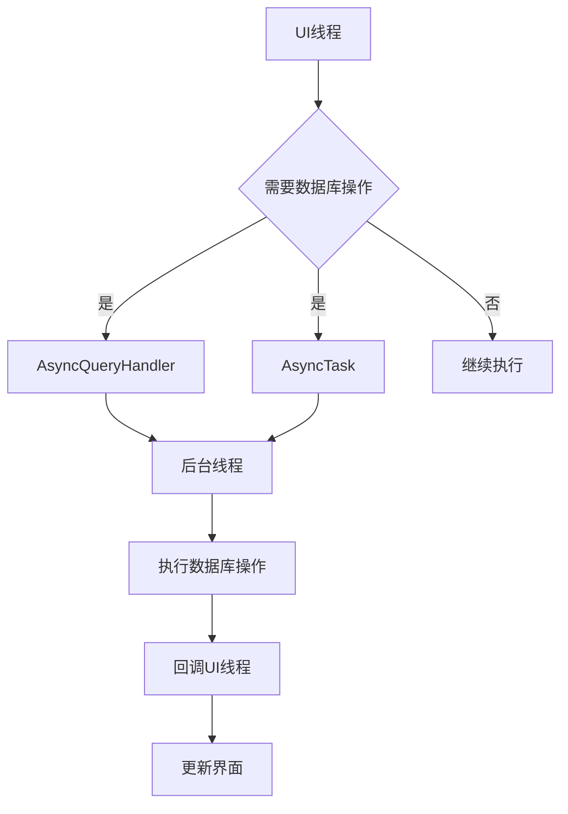

# 数据传递模式

<cite>
**本文档中引用的文件**
- [NotePad.java](file://app/src/main/java/com/example/android/notepad/NotePad.java)
- [NotesList.java](file://app/src/main/java/com/example/android/notepad/NotesList.java)
- [NoteEditor.java](file://app/src/main/java/com/example/android/notepad/NoteEditor.java)
- [NotePadProvider.java](file://app/src/main/java/com/example/android/notepad/NotePadProvider.java)
- [strings.xml](file://app/src/main/res/values/strings.xml)
</cite>

## 目录
1. [简介](#简介)
2. [项目结构概览](#项目结构概览)
3. [核心契约类分析](#核心契约类分析)
4. [数据传递架构](#数据传递架构)
5. [详细组件分析](#详细组件分析)
6. [MIME类型系统](#mime类型系统)
7. [数据流完整示例](#数据流完整示例)
8. [性能考虑](#性能考虑)
9. [故障排除指南](#故障排除指南)
10. [总结](#总结)

## 简介

NotePad应用采用了一套完整的数据传递模式，通过Android的Content Provider架构实现应用内数据的统一管理和传递。该模式基于契约类（Contract Class）定义的标准接口，确保了数据访问的一致性和可扩展性。本文档详细分析了从NotesList到NoteEditor的数据传递流程，以及MIME类型在数据过滤和Intent处理中的重要作用。

## 项目结构概览

NotePad应用采用典型的Android Content Provider架构，主要包含以下核心组件：

**图表来源**
- [NotesList.java](file://app/src/main/java/com/example/android/notepad/NotesList.java#L56-L550)
- [NoteEditor.java](file://app/src/main/java/com/example/android/notepad/NoteEditor.java#L54-L616)
- [NotePadProvider.java](file://app/src/main/java/com/example/android/notepad/NotePadProvider.java#L54-L753)

## 核心契约类分析

### NotePad契约类设计

NotePad契约类是整个数据传递模式的核心，它定义了所有与数据访问相关的基本常量和URI模式。

**图表来源**
- [NotePad.java](file://app/src/main/java/com/example/android/notepad/NotePad.java#L28-L155)

### URI模式定义

契约类定义了三种主要的URI模式：

1. **CONTENT_URI**: `/notes` - 访问所有笔记的集合
2. **CONTENT_ID_URI_BASE**: `/notes/` - 基础URI，用于构建单个笔记URI
3. **CONTENT_ID_URI_PATTERN**: `/notes/#` - 匹配单个笔记ID的URI模式

**章节来源**
- [NotePad.java](file://app/src/main/java/com/example/android/notepad/NotePad.java#L83-L98)

## 数据传递架构

### 统一接口设计

NotePad应用通过Content Provider提供统一的数据访问接口，所有数据操作都通过ContentResolver进行：

**图表来源**
- [NotePadProvider.java](file://app/src/main/java/com/example/android/notepad/NotePadProvider.java#L252-L321)
- [NotePadProvider.java](file://app/src/main/java/com/example/android/notepad/NotePadProvider.java#L668-L738)

## 详细组件分析

### NotesList组件 - 数据展示与导航

NotesList负责显示笔记列表，并处理用户交互以启动编辑器：

#### URI构建与传递

NotesList使用ContentUris.withAppendedId方法构建指向特定笔记的URI：

**图表来源**
- [NotesList.java](file://app/src/main/java/com/example/android/notepad/NotesList.java#L529-L548)
- [NotesList.java](file://app/src/main/java/com/example/android/notepad/NotesList.java#L475-L485)

#### 数据查询与适配

NotesList通过managedQuery方法查询笔记数据，并使用SimpleCursorAdapter显示：

**章节来源**
- [NotesList.java](file://app/src/main/java/com/example/android/notepad/NotesList.java#L113-L166)

### NoteEditor组件 - 数据编辑与保存

NoteEditor负责处理笔记的创建、编辑和删除操作：

#### 生命周期管理

**图表来源**
- [NoteEditor.java](file://app/src/main/java/com/example/android/notepad/NoteEditor.java#L140-L200)
- [NoteEditor.java](file://app/src/main/java/com/example/android/notepad/NoteEditor.java#L338-L376)

#### 数据保存机制

NoteEditor在onPause()方法中自动保存修改：

**章节来源**
- [NoteEditor.java](file://app/src/main/java/com/example/android/notepad/NoteEditor.java#L338-L376)

### NotePadProvider组件 - 数据库操作

NotePadProvider实现了ContentProvider接口，提供完整的CRUD操作：

#### URI匹配与路由

**图表来源**
- [NotePadProvider.java](file://app/src/main/java/com/example/android/notepad/NotePadProvider.java#L93-L101)
- [NotePadProvider.java](file://app/src/main/java/com/example/android/notepad/NotePadProvider.java#L262-L288)

**章节来源**
- [NotePadProvider.java](file://app/src/main/java/com/example/android/notepad/NotePadProvider.java#L252-L321)
- [NotePadProvider.java](file://app/src/main/java/com/example/android/notepad/NotePadProvider.java#L498-L567)

## MIME类型系统

### MIME类型定义

NotePad应用定义了两种主要的MIME类型：

| MIME类型 | 用途 | URI模式 |
|---------|------|---------|
| `vnd.android.cursor.dir/vnd.google.note` | 笔记列表目录 | `/notes` |
| `vnd.android.cursor.item/vnd.google.note` | 单个笔记项 | `/notes/#` |

### MIME类型在Intent过滤中的作用

MIME类型不仅用于Content Provider的getType()方法，还在Intent过滤中发挥重要作用：

**图表来源**
- [NotePadProvider.java](file://app/src/main/java/com/example/android/notepad/NotePadProvider.java#L332-L352)
- [NotesList.java](file://app/src/main/java/com/example/android/notepad/NotesList.java#L295-L322)

**章节来源**
- [NotePad.java](file://app/src/main/java/com/example/android/notepad/NotePad.java#L110-L119)
- [NotePadProvider.java](file://app/src/main/java/com/example/android/notepad/NotePadProvider.java#L332-L352)

## 数据流完整示例

### 从NotesList到NoteEditor的完整数据流

以下是用户点击笔记项后，数据在各组件间传递的完整流程：

**图表来源**
- [NotesList.java](file://app/src/main/java/com/example/android/notepad/NotesList.java#L529-L548)
- [NoteEditor.java](file://app/src/main/java/com/example/android/notepad/NoteEditor.java#L140-L200)
- [NotePadProvider.java](file://app/src/main/java/com/example/android/notepad/NotePadProvider.java#L252-L321)

### 数据验证与错误处理

在整个数据流过程中，系统实现了多层次的验证和错误处理：

1. **URI验证**: 确保传入的URI格式正确
2. **MIME类型检查**: 验证数据类型匹配
3. **数据库约束**: 确保数据完整性
4. **异常处理**: 处理各种可能的错误情况

**章节来源**
- [NotesList.java](file://app/src/main/java/com/example/android/notepad/NotesList.java#L529-L548)
- [NoteEditor.java](file://app/src/main/java/com/example/android/notepad/NoteEditor.java#L140-L200)
- [NotePadProvider.java](file://app/src/main/java/com/example/android/notepad/NotePadProvider.java#L252-L321)

## 性能考虑

### 异步操作建议

虽然当前实现直接在UI线程执行数据库操作，但在实际生产环境中应该考虑异步处理：

### 内存管理

- 使用managedQuery自动管理Cursor生命周期
- 及时关闭不需要的资源
- 避免内存泄漏

## 故障排除指南

### 常见问题与解决方案

| 问题 | 可能原因 | 解决方案 |
|------|----------|----------|
| 无法打开笔记 | URI格式错误 | 检查CONTENT_URI和ID拼接 |
| 数据保存失败 | 权限不足 | 确认数据库写权限 |
| MIME类型不匹配 | 类型定义错误 | 检查CONTENT_TYPE定义 |
| 内存泄漏 | Cursor未关闭 | 使用managedQuery或手动关闭 |

### 调试技巧

1. **日志记录**: 在关键节点添加Log输出
2. **断点调试**: 在ContentProvider方法中设置断点
3. **单元测试**: 编写针对各个组件的测试用例

**章节来源**
- [NotePadProvider.java](file://app/src/main/java/com/example/android/notepad/NotePadProvider.java#L252-L321)
- [NoteEditor.java](file://app/src/main/java/com/example/android/notepad/NoteEditor.java#L338-L376)

## 总结

NotePad应用的数据传递模式展现了Android Content Provider架构的最佳实践。通过契约类定义的统一接口，实现了：

1. **清晰的职责分离**: UI层、业务逻辑层和数据访问层各司其职
2. **灵活的URI设计**: 支持多种数据访问模式
3. **标准的MIME类型**: 确保数据类型的正确识别和处理
4. **完整的生命周期管理**: 从数据查询到保存的全流程控制

这种设计模式不仅保证了应用的稳定性和可维护性，还为未来的功能扩展提供了良好的基础。开发者可以基于这套模式快速构建类似的数据驱动应用。