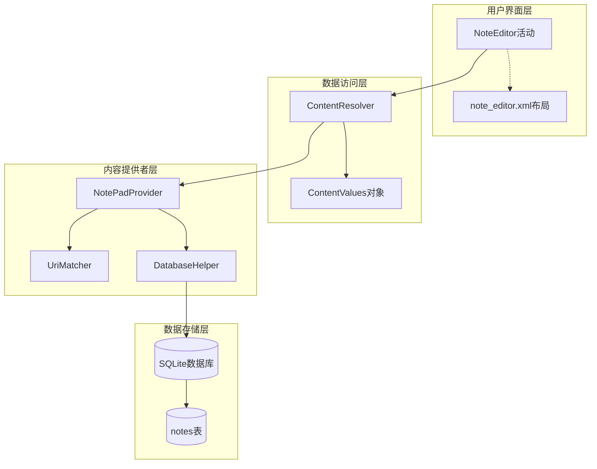
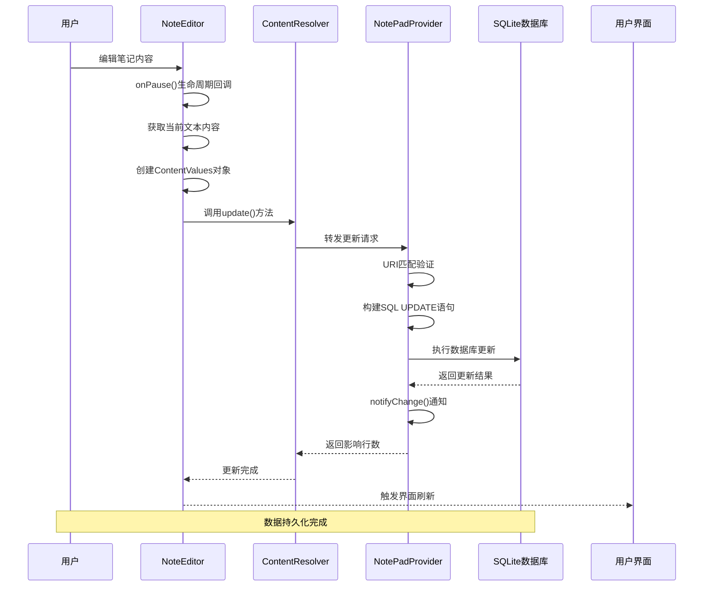
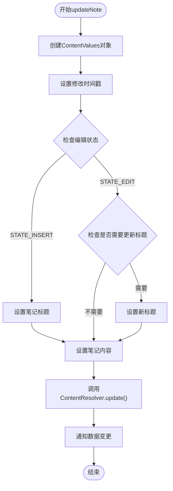
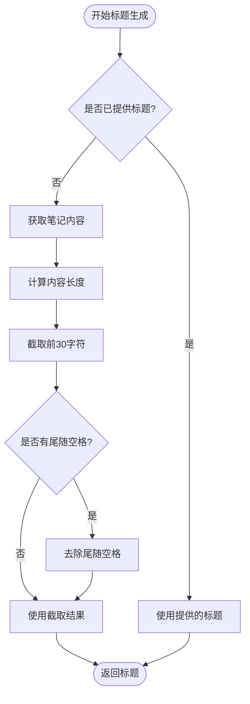
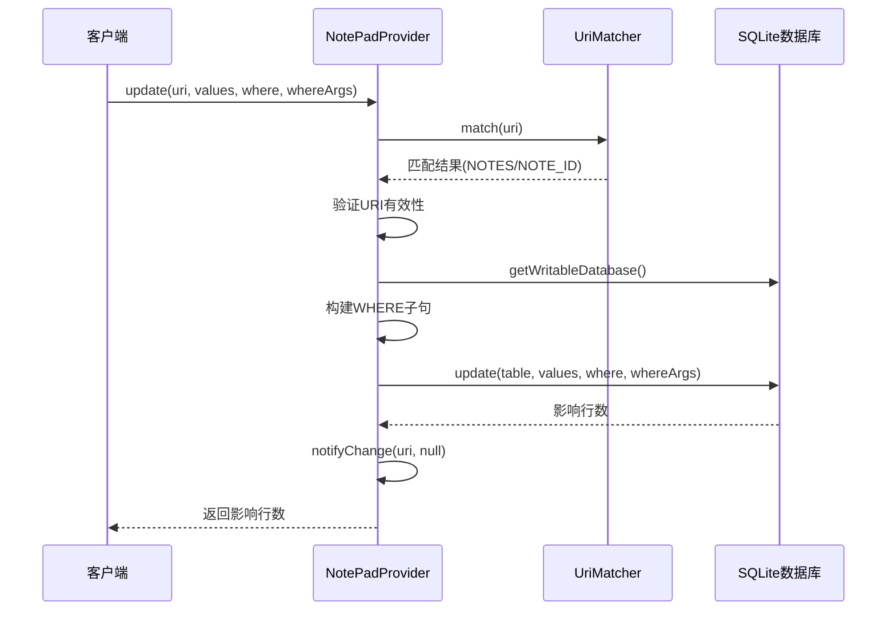

# 数据持久化

<cite>
**本文档引用的文件**
- [NoteEditor.java](file://app/src/main/java/com/example/android/notepad/NoteEditor.java)
- [NotePadProvider.java](file://app/src/main/java/com/example/android/notepad/NotePadProvider.java)
- [NotePad.java](file://app/src/main/java/com/example/android/notepad/NotePad.java)
- [AndroidManifest.xml](file://app/src/main/AndroidManifest.xml)
- [note_editor.xml](file://app/src/main/res/layout/note_editor.xml)
</cite>

## 目录
1. [简介](#简介)
2. [系统架构概览](#系统架构概览)
3. [核心组件分析](#核心组件分析)
4. [数据持久化流程详解](#数据持久化流程详解)
5. [ContentValues数据封装](#contentvalues数据封装)
6. [ContentProvider更新机制](#contentprovider更新机制)
7. [数据完整性保障](#数据完整性保障)
8. [性能优化考虑](#性能优化考虑)
9. [故障排除指南](#故障排除指南)
10. [总结](#总结)

## 简介

NotePad应用采用Android平台的标准ContentProvider架构实现数据持久化，通过NoteEditor活动和NotePadProvider提供者之间的协作，确保笔记数据能够安全、高效地存储和检索。本文档深入分析了从用户编辑笔记到数据最终持久化的完整流程，重点阐述了ContentResolver、ContentValues和ContentProvider在数据持久化过程中的作用机制。

## 系统架构概览

NotePad应用的数据持久化架构基于Android ContentProvider模式，该模式提供了统一的数据访问接口和严格的安全控制机制。

**图表来源**
- [NoteEditor.java](file://app/src/main/java/com/example/android/notepad/NoteEditor.java#L347-L377)
- [NotePadProvider.java](file://app/src/main/java/com/example/android/notepad/NotePadProvider.java#L668-L739)

**章节来源**
- [NoteEditor.java](file://app/src/main/java/com/example/android/notepad/NoteEditor.java#L1-L616)
- [NotePadProvider.java](file://app/src/main/java/com/example/android/notepad/NotePadProvider.java#L1-L753)

## 核心组件分析

### NoteEditor活动组件

NoteEditor是负责笔记编辑的主要活动组件，它继承自Activity类并实现了完整的生命周期管理。该组件包含以下关键功能模块：

- **状态管理**：维护编辑状态（STATE_EDIT）和插入状态（STATE_INSERT）
- **数据绑定**：通过PROJECTION数组定义查询投影列
- **生命周期回调**：处理onCreate、onResume、onPause等关键生命周期事件
- **用户交互**：响应菜单操作和文本输入事件

### NotePadProvider提供者组件

NotePadProvider是ContentProvider的具体实现，负责管理笔记数据的CRUD操作。其核心特性包括：

- **URI路由**：使用UriMatcher进行URI模式匹配
- **数据库操作**：封装SQLite数据库的增删改查操作
- **数据验证**：确保数据完整性和类型正确性
- **通知机制**：通过notifyChange通知数据变更

### 数据模型定义

NotePad类定义了完整的数据模型契约，包括：

- **表结构**：notes表的列定义和约束
- **URI常量**：各种操作的URI模式
- **MIME类型**：内容类型标识符
- **排序规则**：默认的查询排序方式

**章节来源**
- [NoteEditor.java](file://app/src/main/java/com/example/android/notepad/NoteEditor.java#L54-L82)
- [NotePadProvider.java](file://app/src/main/java/com/example/android/notepad/NotePadProvider.java#L54-L172)
- [NotePad.java](file://app/src/main/java/com/example/android/notepad/NotePad.java#L28-L154)

## 数据持久化流程详解

### 完整持久化流程图

**图表来源**
- [NoteEditor.java](file://app/src/main/java/com/example/android/notepad/NoteEditor.java#L337-L377)
- [NotePadProvider.java](file://app/src/main/java/com/example/android/notepad/NotePadProvider.java#L668-L739)

### onPause生命周期中的持久化触发

当NoteEditor进入暂停状态时，系统会自动调用onPause方法，在此期间会触发数据持久化操作：

1. **状态检查**：验证mCursor是否有效且不为空
2. **内容获取**：从EditText控件获取当前编辑的文本内容
3. **条件判断**：根据编辑状态决定执行更新或删除操作
4. **异步处理**：通过ContentResolver异步执行数据库更新

### updateNote方法的实现逻辑

updateNote方法是数据持久化的核心入口，它负责构建ContentValues对象并触发实际的更新操作：

**图表来源**
- [NoteEditor.java](file://app/src/main/java/com/example/android/notepad/NoteEditor.java#L523-L578)

**章节来源**
- [NoteEditor.java](file://app/src/main/java/com/example/android/notepad/NoteEditor.java#L337-L377)
- [NoteEditor.java](file://app/src/main/java/com/example/android/notepad/NoteEditor.java#L523-L578)

## ContentValues数据封装

### ContentValue对象的构建过程

ContentValues是Android提供的键值对容器，专门用于封装数据库操作的参数。在NotePad应用中，ContentValues对象包含以下关键字段：

| 字段名称 | 数据类型 | 描述 | 默认值 |
|---------|---------|------|--------|
| title | TEXT | 笔记标题 | 自动生成的前30字符 |
| note | TEXT | 笔记内容 | 用户输入的文本 |
| created | INTEGER | 创建时间戳 | 当前系统时间 |
| modified | INTEGER | 修改时间戳 | 当前系统时间 |

### 自动时间戳管理

系统实现了智能的时间戳管理机制：

- **创建时间**：仅在新笔记创建时设置，后续更新保持不变
- **修改时间**：每次更新操作都会自动更新为当前时间
- **时间精度**：使用System.currentTimeMillis()提供毫秒级精度

### 标题自动生成逻辑

当处于插入状态且未提供标题时，系统会自动从笔记内容中提取标题：

**图表来源**
- [NoteEditor.java](file://app/src/main/java/com/example/android/notepad/NoteEditor.java#L530-L549)

**章节来源**
- [NoteEditor.java](file://app/src/main/java/com/example/android/notepad/NoteEditor.java#L523-L578)
- [NotePad.java](file://app/src/main/java/com/example/android/notepad/NotePad.java#L130-L152)

## ContentProvider更新机制

### URI匹配与路由

NotePadProvider使用UriMatcher进行精确的URI模式匹配，支持以下三种模式：

| 匹配模式 | URI格式 | 操作类型 | 用途 |
|---------|---------|----------|------|
| NOTES | content://com.google.provider.NotePad/notes | 批量操作 | 查询、插入、删除多个笔记 |
| NOTE_ID | content://com.google.provider.NotePad/notes/# | 单条操作 | 查询、更新、删除指定ID的笔记 |
| LIVE_FOLDER_NOTES | content://com.google.provider.NotePad/live_folders/notes | 实时文件夹 | 动态生成笔记列表 |

### update方法的执行流程

update方法是ContentProvider的核心更新接口，其实现包含以下关键步骤：

**图表来源**
- [NotePadProvider.java](file://app/src/main/java/com/example/android/notepad/NotePadProvider.java#L668-L739)

### 数据库更新的SQL转换

ContentProvider将ContentValues对象转换为相应的SQL语句：

- **批量更新**：`UPDATE notes SET column1=value1, column2=value2 WHERE condition`
- **单条更新**：`UPDATE notes SET column1=value1 WHERE _id=specific_id`
- **条件更新**：支持复杂的WHERE子句和参数绑定

### 通知机制的实现

更新完成后，Provider通过notifyChange方法通知所有注册的观察者：

- **URI通知**：向特定URI的所有监听器发送通知
- **数据刷新**：触发相关Cursor的重新查询
- **UI同步**：确保用户界面与数据库状态保持一致

**章节来源**
- [NotePadProvider.java](file://app/src/main/java/com/example/android/notepad/NotePadProvider.java#L668-L739)
- [NotePadProvider.java](file://app/src/main/java/com/example/android/notepad/NotePadProvider.java#L119-L132)

## 数据完整性保障

### 时间戳自动更新机制

系统实现了严格的时间戳管理策略：

- **创建保护**：创建时间一旦设置就不会被修改
- **修改追踪**：每次更新都自动更新修改时间
- **并发控制**：通过数据库事务保证时间戳的一致性

### 数据验证与约束

数据库层面实施了多重数据验证：

- **主键约束**：_id字段作为唯一标识符
- **非空约束**：笔记内容不能为空
- **类型约束**：时间戳字段必须为INTEGER类型
- **默认值**：标题使用系统默认字符串

### 事务处理机制

虽然当前实现中没有显式使用事务，但SQLite数据库本身提供了ACID特性：

- **原子性**：单个更新操作要么完全成功，要么完全失败
- **一致性**：数据库始终处于有效状态
- **隔离性**：并发操作不会相互干扰
- **持久性**：更新结果永久保存

**章节来源**
- [NotePadProvider.java](file://app/src/main/java/com/example/android/notepad/NotePadProvider.java#L518-L539)
- [NotePadProvider.java](file://app/src/main/java/com/example/android/notepad/NotePadProvider.java#L194-L200)

## 性能优化考虑

### 异步操作建议

当前实现中，数据库操作直接在UI线程执行，这在实际应用中可能造成性能问题：

- **UI阻塞风险**：大数据量操作可能导致界面卡顿
- **ANR风险**：长时间运行的数据库操作可能触发应用程序无响应
- **解决方案**：应使用AsyncQueryHandler或AsyncTask进行异步处理

### 内存管理优化

ContentValues对象的使用需要注意内存效率：

- **对象复用**：避免频繁创建新的ContentValues实例
- **数据清理**：及时释放不再使用的数据引用
- **批量操作**：对于大量数据更新，考虑批量处理

### 数据库连接池

SQLite数据库支持连接池机制：

- **连接复用**：重用数据库连接减少开销
- **读写分离**：区分读写操作优化性能
- **索引优化**：为常用查询字段建立索引

## 故障排除指南

### 常见问题诊断

| 问题症状 | 可能原因 | 解决方案 |
|---------|---------|----------|
| 数据无法保存 | onPause()未正确调用 | 检查Activity生命周期管理 |
| 更新失败 | URI匹配错误 | 验证URI格式和权限设置 |
| 数据丢失 | 数据库版本升级 | 实施数据迁移策略 |
| 性能缓慢 | 同步数据库操作 | 引入异步处理机制 |

### 调试技巧

- **日志记录**：在关键位置添加Log输出
- **异常捕获**：包装数据库操作于try-catch块
- **状态监控**：跟踪ContentValues的内容变化
- **网络调试**：使用adb shell监控数据库文件

### 错误恢复机制

系统提供了多层次的错误恢复能力：

- **状态备份**：onSaveInstanceState保存原始内容
- **回滚操作**：cancelNote方法提供内容恢复
- **异常处理**：优雅处理数据库访问异常
- **数据校验**：验证数据完整性和一致性

**章节来源**
- [NoteEditor.java](file://app/src/main/java/com/example/android/notepad/NoteEditor.java#L337-L377)
- [NoteEditor.java](file://app/src/main/java/com/example/android/notepad/NoteEditor.java#L582-L601)

## 总结

NotePad应用的数据持久化机制展现了Android平台ContentProvider模式的最佳实践。通过NoteEditor的updateNote方法和NotePadProvider的update操作，系统实现了从用户界面到数据库存储的完整数据流转。ContentValues对象的巧妙运用确保了数据的有效封装，而URI匹配机制则保证了操作的精确路由。

该架构的核心优势在于：

- **标准化接口**：遵循Android ContentProvider规范
- **数据安全**：严格的权限控制和数据验证
- **性能优化**：合理的URI路由和数据缓存
- **可扩展性**：清晰的架构设计便于功能扩展

通过深入理解这些机制，开发者可以构建更加健壮和高效的Android应用程序，为用户提供流畅的数据操作体验。