# 数据查询机制详细文档

<cite>
**本文档引用的文件**
- [NoteEditor.java](file://app/src/main/java/com/example/android/notepad/NoteEditor.java)
- [NotePadProvider.java](file://app/src/main/java/com/example/android/notepad/NotePadProvider.java)
- [NotePad.java](file://app/src/main/java/com/example/android/notepad/NotePad.java)
- [NotePadProviderTest.java](file://app/src/androidTest/java/com/example/android/notepad/NotePadProviderTest.java)
</cite>

## 目录
1. [简介](#简介)
2. [项目架构概览](#项目架构概览)
3. [核心组件分析](#核心组件分析)
4. [数据查询机制详解](#数据查询机制详解)
5. [PROJECTION数组设计](#projection数组设计)
6. [URI匹配与查询路由](#uri匹配与查询路由)
7. [SQLiteQueryBuilder执行流程](#sqlitequerybuilder执行流程)
8. [Cursor结果处理](#cursor结果处理)
9. [查询性能优化](#查询性能优化)
10. [故障排除指南](#故障排除指南)
11. [总结](#总结)

## 简介

NotePad应用的数据查询机制是Android ContentProvider模式的核心实现，通过ContentResolver和NotePadProvider协作完成笔记数据的查询操作。该系统采用统一的URI接口设计，支持多种查询模式，包括全表查询、单条记录查询和带条件筛选的查询。

本文档基于NoteEditor中使用的managedQuery方法，深入解析从客户端发起查询请求到数据库执行查询的完整流程，详细说明PROJECTION数组如何定义返回列，以及NotePadProvider如何根据URI匹配模式执行不同查询逻辑。

## 项目架构概览

NotePad应用采用典型的Android ContentProvider架构，包含以下核心组件：

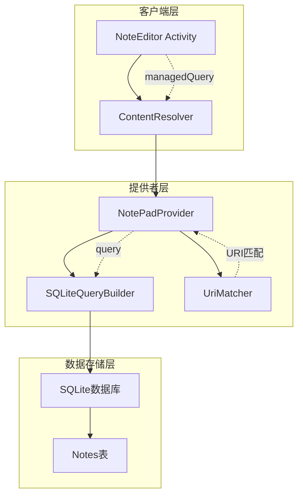

**图表来源**
- [NoteEditor.java](file://app/src/main/java/com/example/android/notepad/NoteEditor.java#L210-L216)
- [NotePadProvider.java](file://app/src/main/java/com/example/android/notepad/NotePadProvider.java#L252-L321)

## 核心组件分析

### NoteEditor查询发起器

NoteEditor作为查询的发起端，负责构建查询参数并调用ContentResolver的managedQuery方法：

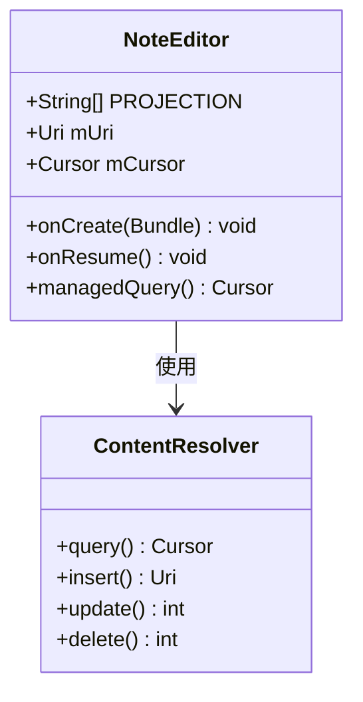

**图表来源**
- [NoteEditor.java](file://app/src/main/java/com/example/android/notepad/NoteEditor.java#L61-L66)
- [NoteEditor.java](file://app/src/main/java/com/example/android/notepad/NoteEditor.java#L210-L216)

### NotePadProvider查询处理器

NotePadProvider是数据查询的核心处理器，负责解析URI、构建查询语句并执行数据库操作：

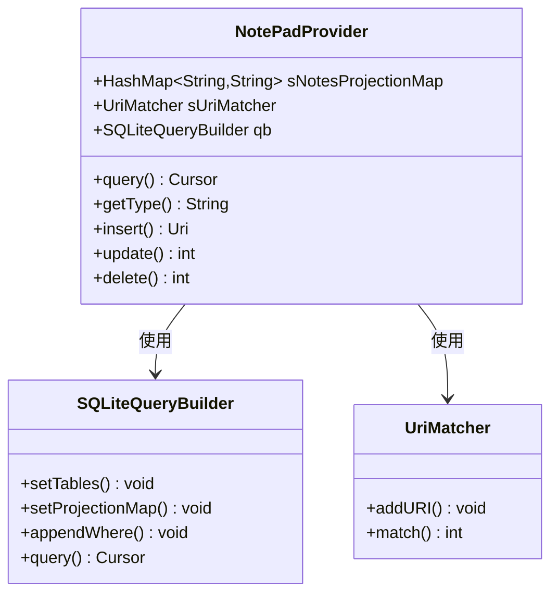

**图表来源**
- [NotePadProvider.java](file://app/src/main/java/com/example/android/notepad/NotePadProvider.java#L71-L77)
- [NotePadProvider.java](file://app/src/main/java/com/example/android/notepad/NotePadProvider.java#L105-L132)

**章节来源**
- [NoteEditor.java](file://app/src/main/java/com/example/android/notepad/NoteEditor.java#L54-L66)
- [NotePadProvider.java](file://app/src/main/java/com/example/android/notepad/NotePadProvider.java#L54-L172)

## 数据查询机制详解

### 查询发起流程

NoteEditor通过managedQuery方法发起查询请求，该方法是ContentResolver的高级封装：

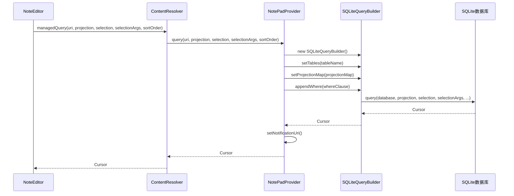

**图表来源**
- [NoteEditor.java](file://app/src/main/java/com/example/android/notepad/NoteEditor.java#L210-L216)
- [NotePadProvider.java](file://app/src/main/java/com/example/android/notepad/NotePadProvider.java#L252-L321)

### 查询参数详解

查询方法接收五个关键参数，每个参数都有特定的作用：

| 参数 | 类型 | 描述 | 示例值 |
|------|------|------|--------|
| uri | Uri | 查询的目标URI，决定查询范围和模式 | `content://com.google.provider.NotePad/notes` |
| projection | String[] | 需要返回的列名数组 | `{_ID, title, note}` |
| selection | String | WHERE子句的列名部分 | `"title = ?"` |
| selectionArgs | String[] | WHERE子句的参数值 | `{"我的笔记"}` |
| sortOrder | String | 排序规则 | `"modified DESC"` |

**章节来源**
- [NoteEditor.java](file://app/src/main/java/com/example/android/notepad/NoteEditor.java#L210-L216)
- [NotePadProvider.java](file://app/src/main/java/com/example/android/notepad/NotePadProvider.java#L252-L257)

## PROJECTION数组设计

### 标准PROJECTION定义

NoteEditor中定义的标准PROJECTION数组指定了查询结果需要返回的列：

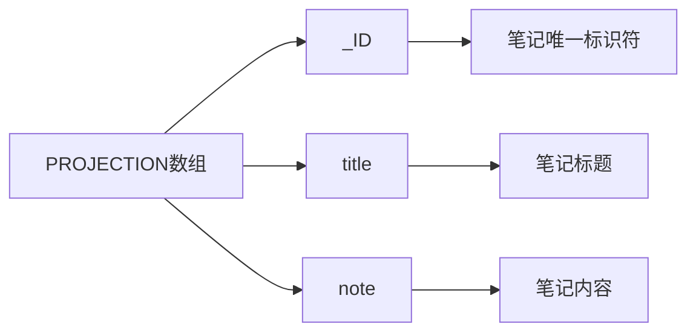

**图表来源**
- [NoteEditor.java](file://app/src/main/java/com/example/android/notepad/NoteEditor.java#L61-L66)

### 列映射关系

PROJECTION数组中的列名与数据库表结构保持一致：

| PROJECTION索引 | 列名常量 | 数据库列名 | 数据类型 | 描述 |
|----------------|----------|------------|----------|------|
| 0 | `_ID` | `_id` | INTEGER | 笔记的唯一主键 |
| 1 | `COLUMN_NAME_TITLE` | `title` | TEXT | 笔记标题 |
| 2 | `COLUMN_NAME_NOTE` | `note` | TEXT | 笔记内容 |

### 动态PROJECTION选择

NotePadProvider支持动态选择返回的列，通过sNotesProjectionMap进行列映射：

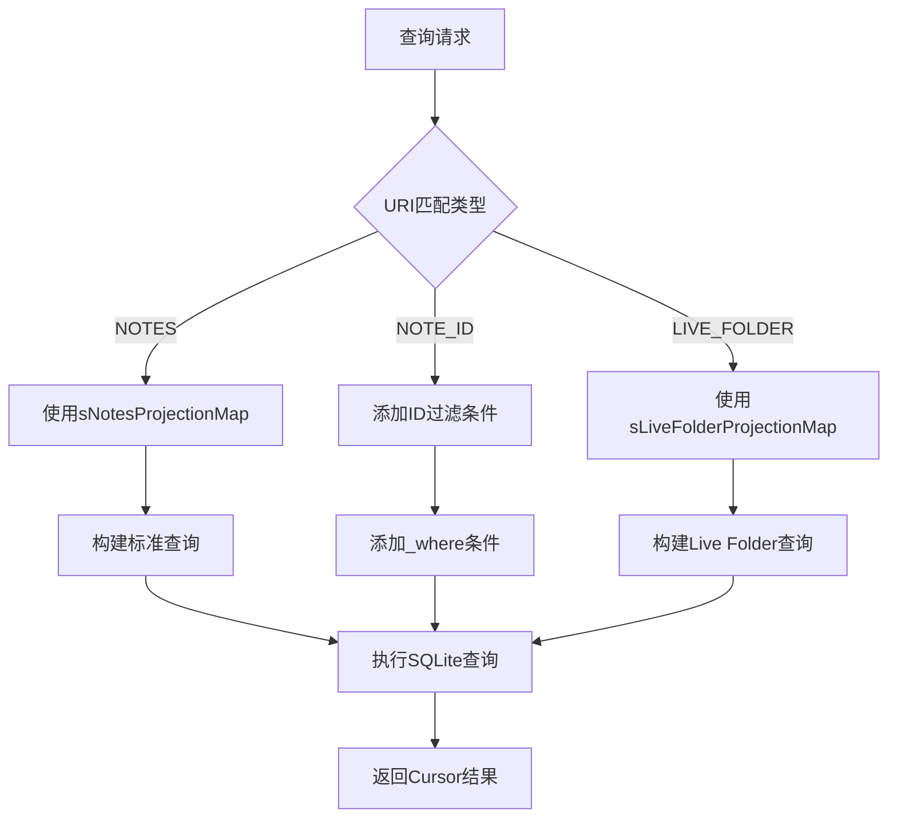

**图表来源**
- [NotePadProvider.java](file://app/src/main/java/com/example/android/notepad/NotePadProvider.java#L262-L288)

**章节来源**
- [NoteEditor.java](file://app/src/main/java/com/example/android/notepad/NoteEditor.java#L61-L66)
- [NotePadProvider.java](file://app/src/main/java/com/example/android/notepad/NotePadProvider.java#L78-L88)

## URI匹配与查询路由

### URI匹配器配置

NotePadProvider使用UriMatcher来识别不同的URI模式：

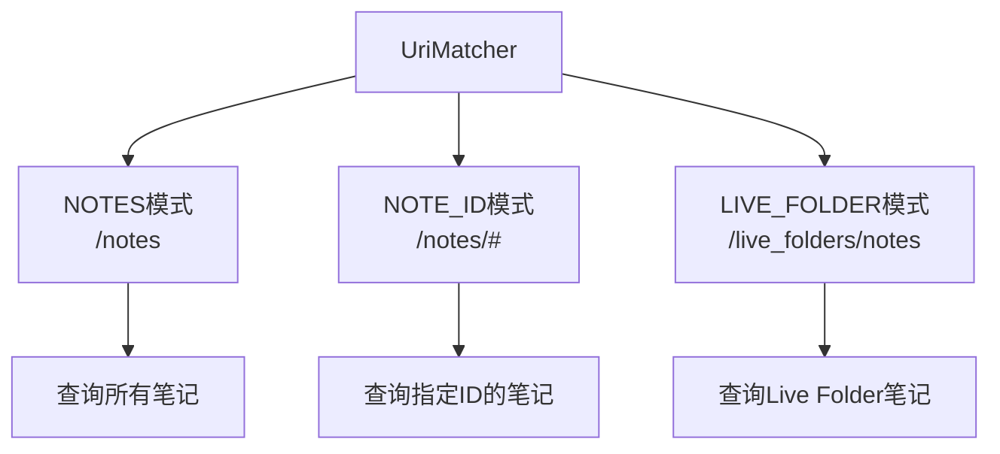

**图表来源**
- [NotePadProvider.java](file://app/src/main/java/com/example/android/notepad/NotePadProvider.java#L122-L131)

### URI匹配逻辑

URI匹配过程决定了查询的具体行为：

```mermaid
flowchart TD
A[输入URI] --> B[sUriMatcher.match(uri)]
B --> C{匹配类型判断}
C --> |NOTES| D[查询所有笔记<br/>无ID过滤]
C --> |NOTE_ID| E[查询单条笔记<br/>添加ID过滤]
C --> |LIVE_FOLDER| F[查询Live Folder<br/>特殊投影映射]
C --> |其他| G[抛出IllegalArgumentException]
D --> H[设置sNotesProjectionMap]
E --> I[设置sNotesProjectionMap<br/>appendWhere(ID条件)]
F --> J[设置sLiveFolderProjectionMap]
H --> K[执行查询]
I --> K
J --> K
```

**图表来源**
- [NotePadProvider.java](file://app/src/main/java/com/example/android/notepad/NotePadProvider.java#L262-L288)

### NOTE_ID模式的ID过滤

当URI匹配NOTE_ID模式时，系统会自动添加ID过滤条件：

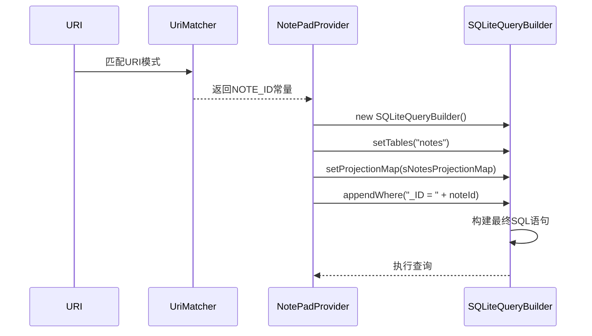

**图表来源**
- [NotePadProvider.java](file://app/src/main/java/com/example/android/notepad/NotePadProvider.java#L272-L278)

**章节来源**
- [NotePadProvider.java](file://app/src/main/java/com/example/android/notepad/NotePadProvider.java#L93-L131)
- [NotePadProvider.java](file://app/src/main/java/com/example/android/notepad/NotePadProvider.java#L262-L288)

## SQLiteQueryBuilder执行流程

### 查询构建器初始化

SQLiteQueryBuilder是查询构建的核心组件：

```mermaid
flowchart TD
A[new SQLiteQueryBuilder] --> B[setTables(tableName)]
B --> C[setProjectionMap(projectionMap)]
C --> D{URI匹配类型}
D --> |NOTE_ID| E[appendWhere条件]
D --> |其他| F[直接执行查询]
E --> G[构建完整WHERE子句]
F --> H[执行基础查询]
G --> H
H --> I[query方法执行]
I --> J[返回Cursor结果]
```

**图表来源**
- [NotePadProvider.java](file://app/src/main/java/com/example/android/notepad/NotePadProvider.java#L256-L257)
- [NotePadProvider.java](file://app/src/main/java/com/example/android/notepad/NotePadProvider.java#L274-L278)

### 查询执行参数

SQLiteQueryBuilder的query方法接收多个参数：

| 参数 | 类型 | 描述 | 来源 |
|------|------|------|------|
| db | SQLiteDatabase | 可读数据库连接 | `mOpenHelper.getReadableDatabase()` |
| projection | String[] | 投影列数组 | query方法参数 |
| selection | String | WHERE子句列名 | query方法参数 |
| selectionArgs | String[] | WHERE子句参数值 | query方法参数 |
| groupBy | String | GROUP BY子句 | null（不使用） |
| having | String | HAVING子句 | null（不使用） |
| orderBy | String | ORDER BY子句 | 排序参数或默认排序 |

### 数据库连接管理

查询过程中数据库连接的生命周期管理：

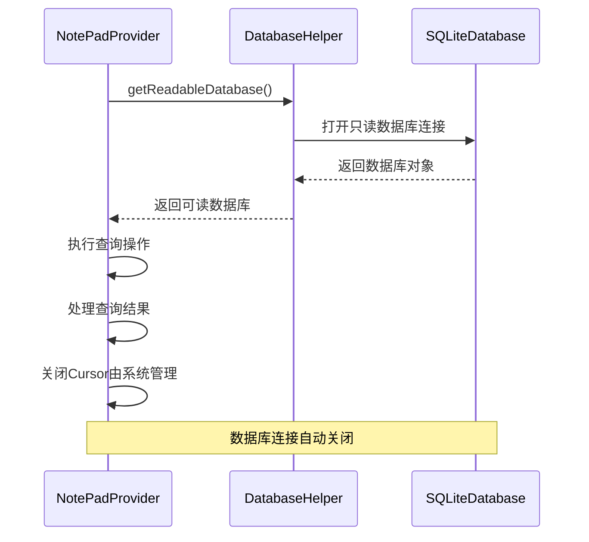

**图表来源**
- [NotePadProvider.java](file://app/src/main/java/com/example/android/notepad/NotePadProvider.java#L302-L303)
- [NotePadProvider.java](file://app/src/main/java/com/example/android/notepad/NotePadProvider.java#L319-L321)

**章节来源**
- [NotePadProvider.java](file://app/src/main/java/com/example/android/notepad/NotePadProvider.java#L256-L321)

## Cursor结果处理

### Cursor对象结构

查询结果以Cursor对象形式返回，包含查询的所有数据：

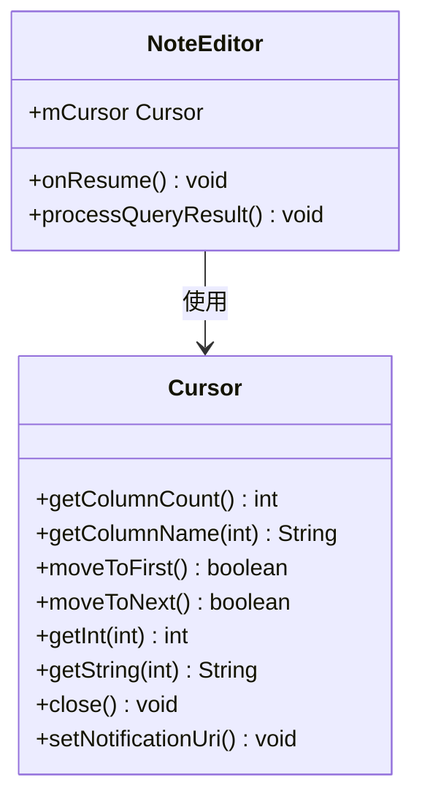

**图表来源**
- [NoteEditor.java](file://app/src/main/java/com/example/android/notepad/NoteEditor.java#L79-L80)

### 数据类型映射关系

Cursor中数据类型与数据库字段类型的映射：

| 数据库类型 | Cursor方法 | Java类型 | 示例值 |
|------------|------------|----------|--------|
| INTEGER | getInt() | int | `123` |
| TEXT | getString() | String | `"我的笔记"` |
| INTEGER | getLong() | long | `1609459200000L` |

### Cursor使用示例

NoteEditor中Cursor的典型使用模式：

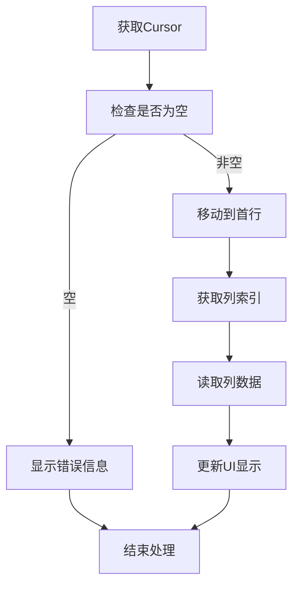

**图表来源**
- [NoteEditor.java](file://app/src/main/java/com/example/android/notepad/NoteEditor.java#L258-L307)

### 结果集通知机制

NotePadProvider为Cursor设置了通知URI，实现数据变更通知：

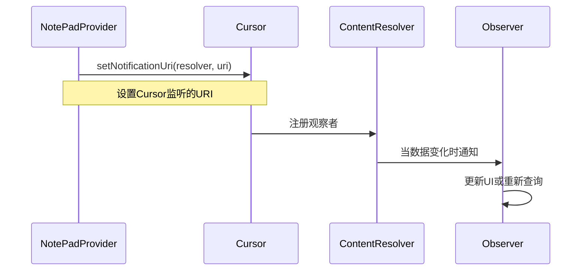

**图表来源**
- [NotePadProvider.java](file://app/src/main/java/com/example/android/notepad/NotePadProvider.java#L319-L321)

**章节来源**
- [NoteEditor.java](file://app/src/main/java/com/example/android/notepad/NoteEditor.java#L258-L307)
- [NotePadProvider.java](file://app/src/main/java/com/example/android/notepad/NotePadProvider.java#L319-L321)

## 查询性能优化

### 查询优化策略

NotePad应用采用了多种查询性能优化技术：

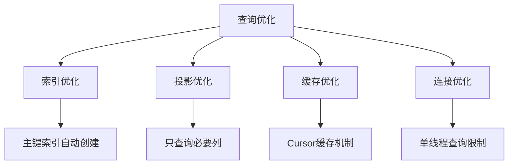

### 内存管理

查询过程中的内存管理要点：

| 优化点 | 实现方式 | 性能影响 |
|--------|----------|----------|
| Cursor关闭 | 自动由系统管理 | 防止内存泄漏 |
| 投影选择 | 只查询必需列 | 减少内存占用 |
| 数据类型转换 | 直接类型映射 | 避免不必要的转换 |
| URI通知 | 智能通知机制 | 减少不必要的更新 |

### 并发控制

NotePadProvider的并发控制策略：

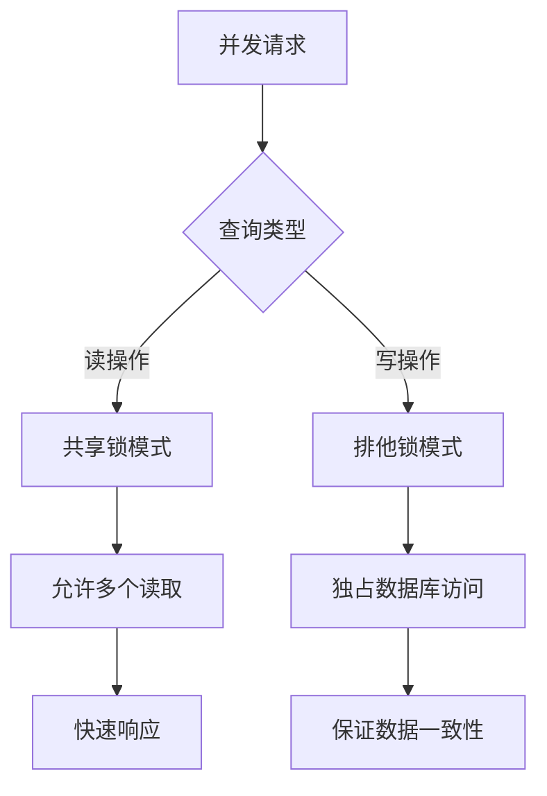

**章节来源**
- [NoteEditor.java](file://app/src/main/java/com/example/android/notepad/NoteEditor.java#L50-L52)
- [NotePadProvider.java](file://app/src/main/java/com/example/android/notepad/NotePadProvider.java#L302-L303)

## 故障排除指南

### 常见查询问题

| 问题类型 | 症状 | 可能原因 | 解决方案 |
|----------|------|----------|----------|
| 查询失败 | 返回null Cursor | URI格式错误 | 检查URI匹配模式 |
| 数据不完整 | 返回列数不足 | PROJECTION数组错误 | 验证列名定义 |
| 性能问题 | 查询响应慢 | 未使用适当索引 | 添加数据库索引 |
| 内存泄漏 | 应用崩溃 | Cursor未正确关闭 | 确保Cursor生命周期管理 |

### 调试技巧

查询调试的最佳实践：

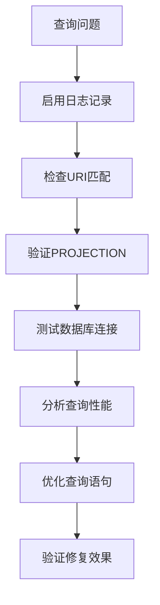

### 错误处理机制

NotePadProvider的错误处理策略：

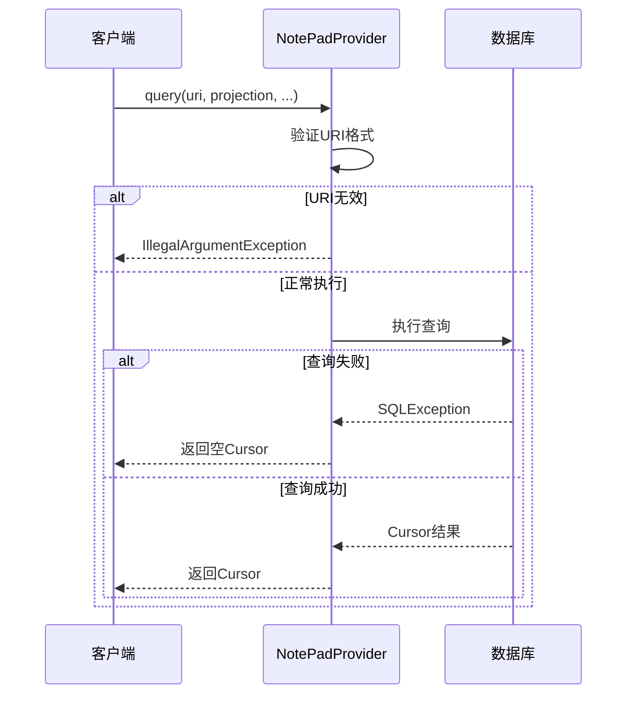

**图表来源**
- [NotePadProvider.java](file://app/src/main/java/com/example/android/notepad/NotePadProvider.java#L287-L289)
- [NotePadProvider.java](file://app/src/main/java/com/example/android/notepad/NotePadProvider.java#L305-L308)

**章节来源**
- [NotePadProvider.java](file://app/src/main/java/com/example/android/notepad/NotePadProvider.java#L287-L289)
- [NotePadProvider.java](file://app/src/main/java/com/example/android/notepad/NotePadProvider.java#L305-L308)

## 总结

NotePad应用的数据查询机制展现了Android ContentProvider模式的优雅设计。通过统一的URI接口、灵活的PROJECTION系统和智能的URI匹配机制，实现了高效、可扩展的数据查询功能。

### 关键特性总结

1. **统一接口设计**：通过ContentResolver提供统一的查询接口
2. **灵活的投影系统**：支持动态选择返回的列，优化查询性能
3. **智能URI匹配**：根据URI模式自动选择合适的查询逻辑
4. **类型安全映射**：确保数据库字段与Java类型的安全转换
5. **自动通知机制**：实现数据变更的实时通知

### 最佳实践建议

- 在生产环境中使用AsyncQueryHandler或AsyncTask进行异步查询
- 合理设计PROJECTION数组，避免查询不必要的列
- 充分利用数据库索引提高查询性能
- 正确管理Cursor生命周期，防止内存泄漏
- 实现适当的错误处理和日志记录机制

这个查询机制为Android应用开发提供了优秀的参考模板，展示了如何构建健壮、高效的数据库访问层。