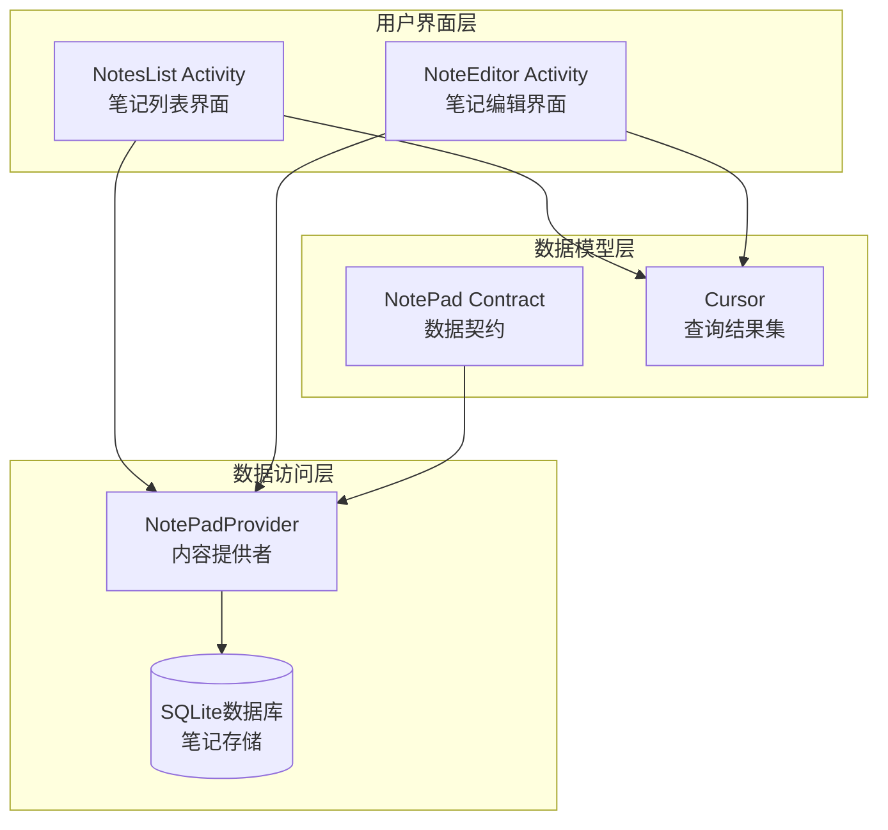
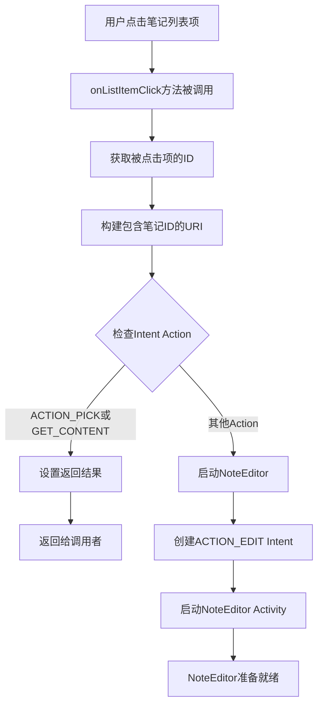
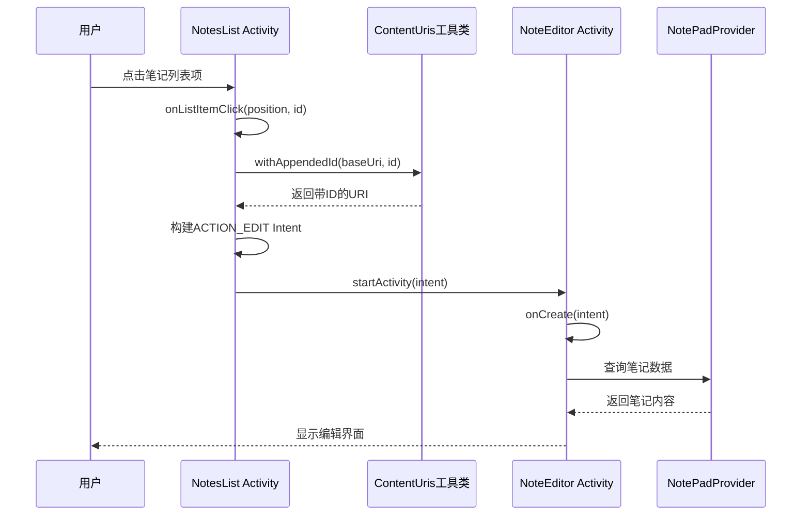
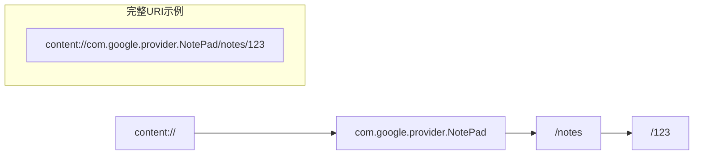
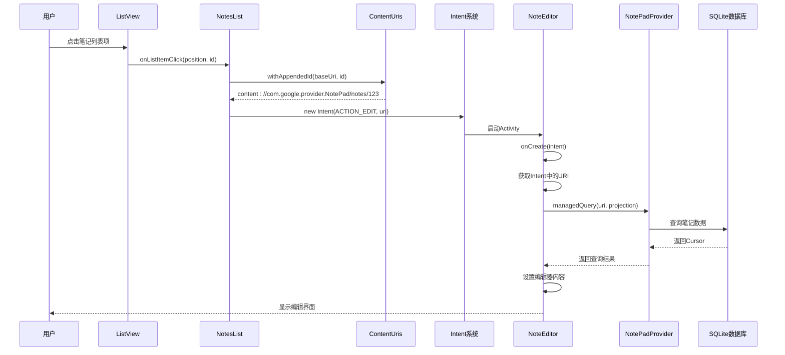

# NotesList到NoteEditor导航流程详细文档

<cite>
**本文档中引用的文件**
- [NotesList.java](file://app/src/main/java/com/example/android/notepad/NotesList.java)
- [NoteEditor.java](file://app/src/main/java/com/example/android/notepad/NoteEditor.java)
- [AndroidManifest.xml](file://app/src/main/AndroidManifest.xml)
- [NotePad.java](file://app/src/main/java/com/example/android/notepad/NotePad.java)
- [noteslist_item.xml](file://app/src/main/res/layout/noteslist_item.xml)
</cite>

## 目录
1. [简介](#简介)
2. [系统架构概览](#系统架构概览)
3. [核心组件分析](#核心组件分析)
4. [导航流程详细分析](#导航流程详细分析)
5. [数据传递链路](#数据传递链路)
6. [时序图展示](#时序图展示)
7. [关键代码实现](#关键代码实现)
8. [性能考虑](#性能考虑)
9. [故障排除指南](#故障排除指南)
10. [总结](#总结)

## 简介

本文档详细分析了Android NotePad应用中NotesList到NoteEditor的导航流程。当用户在NotesList界面点击某个笔记列表项时，系统会通过onListItemClick方法构建包含笔记ID的URI，并启动ACTION_EDIT Intent来启动NoteEditor Activity进行编辑操作。这个过程涉及Intent的构建、Activity启动和数据查询等多个环节。

## 系统架构概览

NotePad应用采用典型的Android MVC架构模式，主要包含以下核心组件：

**图表来源**
- [NotesList.java](file://app/src/main/java/com/example/android/notepad/NotesList.java#L56-L550)
- [NoteEditor.java](file://app/src/main/java/com/example/android/notepad/NoteEditor.java#L54-L616)
- [NotePadProvider.java](file://app/src/main/java/com/example/android/notepad/NotePadProvider.java#L366-L673)

## 核心组件分析

### NotesList Activity

NotesList是应用的主要入口点，负责显示笔记列表并处理用户交互。其核心功能包括：

- **列表数据显示**：使用SimpleCursorAdapter显示笔记标题和修改时间
- **用户交互处理**：响应列表项点击事件
- **上下文菜单支持**：提供复制、删除等操作选项

### NoteEditor Activity

NoteEditor负责处理笔记的编辑操作，支持多种编辑模式：

- **编辑模式（ACTION_EDIT）**：编辑现有笔记
- **插入模式（ACTION_INSERT）**：创建新笔记
- **粘贴模式（ACTION_PASTE）**：从剪贴板创建笔记

**章节来源**
- [NotesList.java](file://app/src/main/java/com/example/android/notepad/NotesList.java#L56-L167)
- [NoteEditor.java](file://app/src/main/java/com/example/android/notepad/NoteEditor.java#L54-L240)

## 导航流程详细分析

### 用户点击事件处理

当用户点击NotesList中的某个笔记列表项时，系统会调用onListItemClick方法：

**图表来源**
- [NotesList.java](file://app/src/main/java/com/example/android/notepad/NotesList.java#L528-L548)

### ContentUris.withAppendedId的作用

在onListItemClick方法中，系统使用ContentUris.withAppendedId方法将笔记ID附加到基础URI上：

**图表来源**
- [NotesList.java](file://app/src/main/java/com/example/android/notepad/NotesList.java#L531-L548)

**章节来源**
- [NotesList.java](file://app/src/main/java/com/example/android/notepad/NotesList.java#L528-L548)

## 数据传递链路

### Intent构建过程

数据传递的核心在于Intent的正确构建和解析：

| 组件 | 操作 | 目标 | 数据内容 |
|------|------|------|----------|
| NotesList | onListItemClick | 创建Intent | ACTION_EDIT + 带ID的URI |
| Intent | 启动Activity | NoteEditor | 包含笔记ID的URI |
| NoteEditor | onCreate | 解析Intent | 提取URI和Action |
| NoteEditor | managedQuery | 查询数据 | 使用URI获取笔记内容 |

### URI结构分析

基于NotePad的数据契约，URI结构如下：

**图表来源**
- [NotePad.java](file://app/src/main/java/com/example/android/notepad/NotePad.java#L33-L85)

**章节来源**
- [NotesList.java](file://app/src/main/java/com/example/android/notepad/NotesList.java#L531-L548)
- [NoteEditor.java](file://app/src/main/java/com/example/android/notepad/NoteEditor.java#L148-L200)

## 时序图展示

以下是完整的导航流程时序图：

**图表来源**
- [NotesList.java](file://app/src/main/java/com/example/android/notepad/NotesList.java#L528-L548)
- [NoteEditor.java](file://app/src/main/java/com/example/android/notepad/NoteEditor.java#L148-L200)

## 关键代码实现

### NotesList中的onListItemClick实现

onListItemClick方法位于NotesList.java的第528-548行，实现了完整的导航逻辑：

- **URI构建**：使用ContentUris.withAppendedId将笔记ID附加到基础URI
- **Action判断**：根据Intent的Action决定是设置返回结果还是启动编辑器
- **Intent启动**：创建ACTION_EDIT Intent并启动NoteEditor

### NoteEditor中的Intent处理

NoteEditor的onCreate方法处理不同类型的Intent：

- **ACTION_EDIT**：进入编辑模式，加载指定ID的笔记
- **ACTION_INSERT**：创建新笔记，插入空记录
- **ACTION_PASTE**：从剪贴板创建笔记

**章节来源**
- [NotesList.java](file://app/src/main/java/com/example/android/notepad/NotesList.java#L528-L548)
- [NoteEditor.java](file://app/src/main/java/com/example/android/notepad/NoteEditor.java#L148-L200)

## 性能考虑

### 数据库查询优化

当前实现直接在UI线程执行数据库查询，这在实际应用中可能造成性能问题：

- **建议使用AsyncQueryHandler**：将数据库操作移到后台线程
- **缓存策略**：对频繁访问的数据建立缓存机制
- **批量查询**：减少不必要的数据库访问次数

### 内存管理

- **Cursor管理**：确保及时关闭不再使用的Cursor对象
- **Activity生命周期**：正确处理Activity的暂停和恢复状态

## 故障排除指南

### 常见问题及解决方案

| 问题类型 | 症状 | 可能原因 | 解决方案 |
|----------|------|----------|----------|
| 笔记无法打开 | 点击后无反应 | URI格式错误 | 检查ContentUris.withAppendedId的使用 |
| 编辑器空白 | 打开后显示为空 | 数据查询失败 | 验证managedQuery的参数和权限 |
| 应用崩溃 | 点击时应用异常退出 | 空指针或异常处理不当 | 添加适当的异常处理和日志记录 |

### 调试技巧

- **日志输出**：在关键位置添加Log.d语句
- **断点调试**：在IDE中设置断点跟踪执行流程
- **Intent验证**：检查Intent的Action和Data字段

## 总结

NotesList到NoteEditor的导航流程体现了Android应用中Activity间通信的经典模式。通过Intent机制，系统能够优雅地实现页面间的导航和数据传递。ContentUris.withAppendedId方法的使用确保了URI的正确构建，而Intent的Action区分则支持了不同的操作模式。

这个设计模式具有以下优势：
- **解耦性好**：Activity之间通过Intent通信，降低耦合度
- **扩展性强**：新的操作可以通过添加Intent Filter轻松支持
- **用户体验佳**：流畅的导航体验和一致的操作模式

对于开发者而言，理解这一流程有助于更好地设计和实现Android应用的导航逻辑，特别是在需要多个Activity协作的应用中。