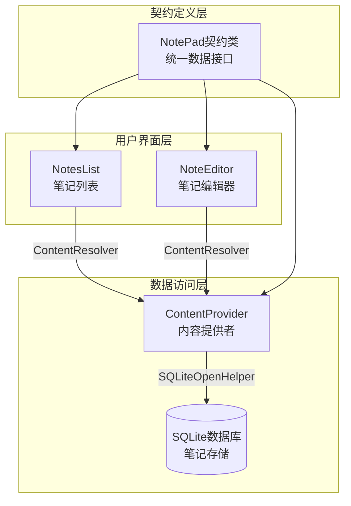
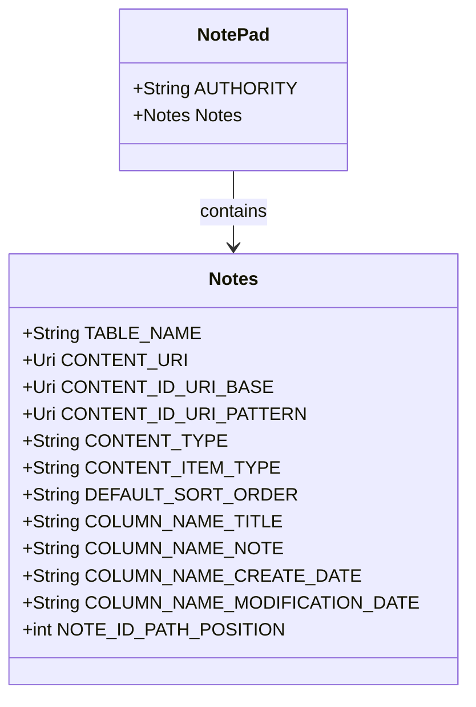
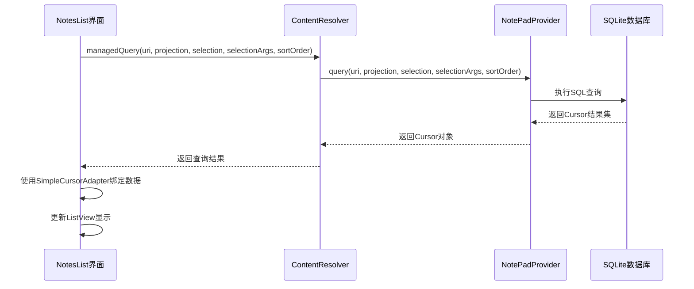
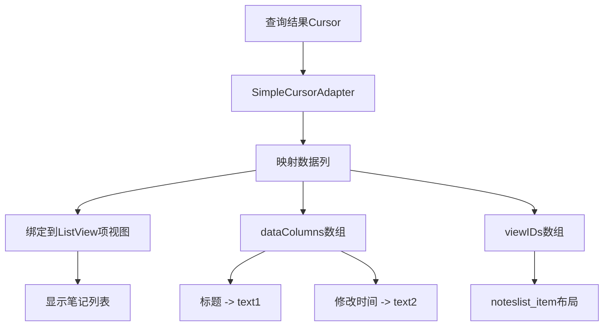
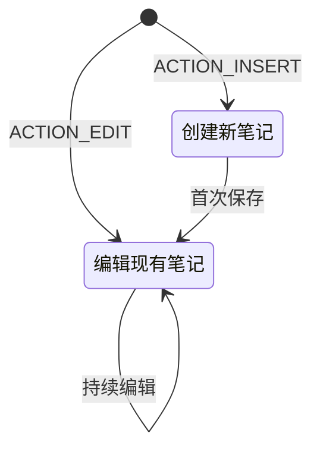
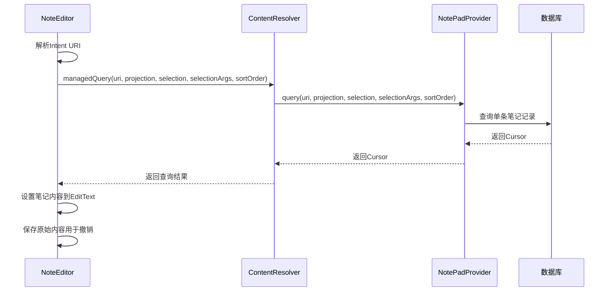
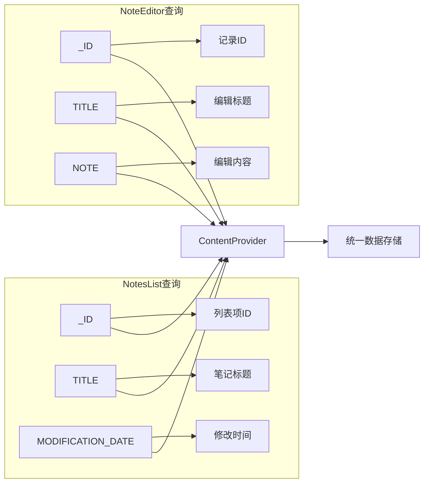
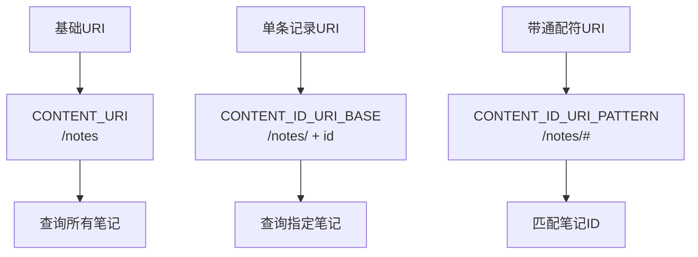
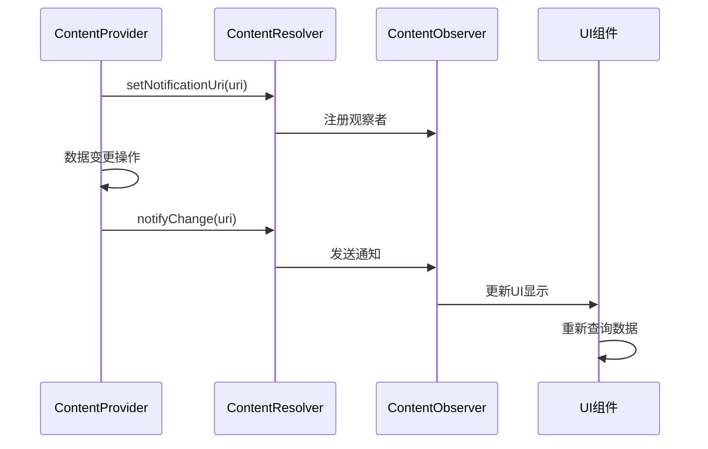

# 数据传递机制

<cite>
**本文档中引用的文件**
- [NotePad.java](file://app/src/main/java/com/example/android/notepad/NotePad.java)
- [NotesList.java](file://app/src/main/java/com/example/android/notepad/NotesList.java)
- [NoteEditor.java](file://app/src/main/java/com/example/android/notepad/NoteEditor.java)
- [NotePadProvider.java](file://app/src/main/java/com/example/android/notepad/NotePadProvider.java)
- [noteslist_item.xml](file://app/src/main/res/layout/noteslist_item.xml)
- [note_editor.xml](file://app/src/main/res/layout/note_editor.xml)
- [list_options_menu.xml](file://app/src/main/res/menu/list_options_menu.xml)
- [editor_options_menu.xml](file://app/src/main/res/menu/editor_options_menu.xml)
</cite>

## 目录
1. [简介](#简介)
2. [项目架构概览](#项目架构概览)
3. [核心数据契约](#核心数据契约)
4. [NotesList数据查询机制](#noteslist数据查询机制)
5. [NoteEditor数据编辑机制](#noteeditor数据编辑机制)
6. [PROJECTION数组一致性分析](#projection数组一致性分析)
7. [URI构建与数据操作](#uri构建与数据操作)
8. [ContentObserver数据通知机制](#contentobserver数据通知机制)
9. [数据流分析](#数据流分析)
10. [总结](#总结)

## 简介

NotePad应用采用Android Content Provider架构实现数据管理，通过统一的ContentResolver接口在NotesList和NoteEditor之间建立数据通信机制。本文档详细分析了两个组件如何通过NotePad契约类定义的常量进行数据交换，包括数据查询、更新、通知等核心功能的实现原理。

## 项目架构概览

NotePad应用采用分层架构设计，核心组件包括：



**图表来源**
- [NotesList.java](file://app/src/main/java/com/example/android/notepad/NotesList.java#L56-L100)
- [NoteEditor.java](file://app/src/main/java/com/example/android/notepad/NoteEditor.java#L54-L85)
- [NotePadProvider.java](file://app/src/main/java/com/example/android/notepad/NotePadProvider.java#L54-L110)

## 核心数据契约

### NotePad契约类结构

NotePad契约类定义了整个应用的数据访问标准，包含以下关键常量：



**图表来源**
- [NotePad.java](file://app/src/main/java/com/example/android/notepad/NotePad.java#L28-L155)

### 关键URI常量

| 常量名称 | 描述 | 示例值 |
|---------|------|--------|
| AUTHORITY | 提供者授权标识 | `com.google.provider.NotePad` |
| CONTENT_URI | 笔记列表URI | `content://com.google.provider.NotePad/notes` |
| CONTENT_ID_URI_BASE | 单个笔记URI基础 | `content://com.google.provider.NotePad/notes/` |
| CONTENT_ID_URI_PATTERN | 笔记ID匹配模式 | `content://com.google.provider.NotePad/notes/#` |

**节来源**
- [NotePad.java](file://app/src/main/java/com/example/android/notepad/NotePad.java#L29-L104)

## NotesList数据查询机制

### 查询流程分析

NotesList通过managedQuery方法从ContentProvider查询数据，实现数据展示：



**图表来源**
- [NotesList.java](file://app/src/main/java/com/example/android/notepad/NotesList.java#L113-L119)
- [NotePadProvider.java](file://app/src/main/java/com/example/android/notepad/NotePadProvider.java#L252-L321)

### PROJECTION配置

NotesList定义了特定的查询投影：

| 索引 | 列名 | 类型 | 用途 |
|------|------|------|------|
| 0 | _ID | INTEGER | 笔记唯一标识符 |
| 1 | COLUMN_NAME_TITLE | TEXT | 笔记标题 |
| 2 | COLUMN_NAME_MODIFICATION_DATE | INTEGER | 修改时间戳 |

**节来源**
- [NotesList.java](file://app/src/main/java/com/example/android/notepad/NotesList.java#L64-L68)

### SimpleCursorAdapter绑定



**图表来源**
- [NotesList.java](file://app/src/main/java/com/example/android/notepad/NotesList.java#L129-L144)
- [noteslist_item.xml](file://app/src/main/res/layout/noteslist_item.xml#L23-L38)

**节来源**
- [NotesList.java](file://app/src/main/java/com/example/android/notepad/NotesList.java#L129-L166)

## NoteEditor数据编辑机制

### 编辑状态管理

NoteEditor根据Intent Action区分编辑状态：



**图表来源**
- [NoteEditor.java](file://app/src/main/java/com/example/android/notepad/NoteEditor.java#L73-L75)

### 数据加载流程



**图表来源**
- [NoteEditor.java](file://app/src/main/java/com/example/android/notepad/NoteEditor.java#L210-L216)
- [NotePadProvider.java](file://app/src/main/java/com/example/android/notepad/NotePadProvider.java#L252-L321)

### 数据更新机制

NoteEditor通过getContentResolver().update方法将编辑后的数据持久化：

```mermaid
flowchart TD
A[用户编辑笔记] --> B[onPause触发]
B --> C{检查编辑状态}
C --> |STATE_EDIT| D[updateNote方法]
C --> |STATE_INSERT| E[插入新记录]
D --> F[构建ContentValues]
F --> G[设置修改时间戳]
G --> H[调用getContentResolver().update]
H --> I[通知ContentProvider更新]
I --> J[通知观察者数据变更]
```

**图表来源**
- [NoteEditor.java](file://app/src/main/java/com/example/android/notepad/NoteEditor.java#L369-L371)
- [NoteEditor.java](file://app/src/main/java/com/example/android/notepad/NoteEditor.java#L523-L577)

**节来源**
- [NoteEditor.java](file://app/src/main/java/com/example/android/notepad/NoteEditor.java#L369-L377)

## PROJECTION数组一致性分析

### 两个Activity的PROJECTION对比

| 组件 | 索引 | 列名 | NotesList | NoteEditor | 用途 |
|------|------|------|-----------|------------|------|
| NotesList | 0 | _ID | ✓ | ✗ | 列表项标识 |
| NotesList | 1 | COLUMN_NAME_TITLE | ✓ | ✓ | 显示标题 |
| NotesList | 2 | COLUMN_NAME_MODIFICATION_DATE | ✓ | ✗ | 显示修改时间 |
| NoteEditor | 0 | _ID | ✗ | ✓ | 记录标识 |
| NoteEditor | 1 | COLUMN_NAME_TITLE | ✗ | ✓ | 编辑标题 |
| NoteEditor | 2 | COLUMN_NAME_NOTE | ✗ | ✓ | 编辑内容 |

### 数据列映射关系



**图表来源**
- [NotesList.java](file://app/src/main/java/com/example/android/notepad/NotesList.java#L64-L68)
- [NoteEditor.java](file://app/src/main/java/com/example/android/notepad/NoteEditor.java#L61-L66)

**节来源**
- [NotesList.java](file://app/src/main/java/com/example/android/notepad/NotesList.java#L64-L68)
- [NoteEditor.java](file://app/src/main/java/com/example/android/notepad/NoteEditor.java#L61-L66)

## URI构建与数据操作

### URI构建规则



**图表来源**
- [NotePad.java](file://app/src/main/java/com/example/android/notepad/NotePad.java#L83-L99)

### 数据操作示例

#### NotesList中的查询操作
```java
// 查询所有笔记
Cursor cursor = managedQuery(
    NotePad.Notes.CONTENT_URI,        // 基础URI
    PROJECTION,                       // 查询投影
    null,                             // 无筛选条件
    null,                             // 无参数
    NotePad.Notes.DEFAULT_SORT_ORDER  // 默认排序
);
```

#### NoteEditor中的更新操作
```java
// 更新单条笔记
getContentResolver().update(
    mUri,           // 单条记录URI
    values,         // 更新值映射
    null,           // 无筛选条件
    null            // 无参数
);
```

**节来源**
- [NotesList.java](file://app/src/main/java/com/example/android/notepad/NotesList.java#L113-L119)
- [NoteEditor.java](file://app/src/main/java/com/example/android/notepad/NoteEditor.java#L572-L577)

## ContentObserver数据通知机制

### 观察者注册



**图表来源**
- [NotePadProvider.java](file://app/src/main/java/com/example/android/notepad/NotePadProvider.java#L319-L321)
- [NotePadProvider.java](file://app/src/main/java/com/example/android/notepad/NotePadProvider.java#L560-L562)

### 自动刷新机制

ContentProvider在数据变更时自动通知观察者：

```mermaid
flowchart TD
A[数据变更操作] --> B[notifyChange(uri)]
B --> C[ContentResolver处理]
C --> D[查找注册的观察者]
D --> E[发送通知]
E --> F[UI组件响应]
F --> G[重新查询数据]
G --> H[更新界面显示]
```

**图表来源**
- [NotePadProvider.java](file://app/src/main/java/com/example/android/notepad/NotePadProvider.java#L560-L562)
- [NotePadProvider.java](file://app/src/main/java/com/example/android/notepad/NotePadProvider.java#L638-L642)

**节来源**
- [NotePadProvider.java](file://app/src/main/java/com/example/android/notepad/NotePadProvider.java#L319-L321)
- [NotePadProvider.java](file://app/src/main/java/com/example/android/notepad/NotePadProvider.java#L560-L562)

## 数据流分析

### 完整数据传递流程

```mermaid
graph TB
subgraph "NotesList到NoteEditor"
A[点击笔记项] --> B[构建编辑URI]
B --> C[启动NoteEditor]
C --> D[解析URI参数]
D --> E[查询笔记数据]
E --> F[填充编辑界面]
end
subgraph "NoteEditor到NotesList"
G[编辑完成] --> H[保存数据]
H --> I[更新ContentProvider]
I --> J[通知数据变更]
J --> K[NotesList自动刷新]
K --> L[更新列表显示]
end
subgraph "数据一致性保证"
M[统一PROJECTION] --> N[共享NotePad契约]
N --> O[一致的列映射]
O --> P[稳定的URI结构]
end
```



**图表来源**
- [NotesList.java](file://app/src/main/java/com/example/android/notepad/NotesList.java#L528-L548)
- [NoteEditor.java](file://app/src/main/java/com/example/android/notepad/NoteEditor.java#L369-L377)

### 错误处理与边界情况

| 场景 | NotesList处理 | NoteEditor处理 |
|------|---------------|----------------|
| 查询失败 | 显示错误提示 | 显示错误界面 |
| 更新失败 | 日志记录 | 显示保存失败 |
| URI无效 | 使用默认URI | 结束Activity |
| 数据为空 | 清空列表 | 显示新建界面 |

**节来源**
- [NotesList.java](file://app/src/main/java/com/example/android/notepad/NotesList.java#L504-L509)
- [NoteEditor.java](file://app/src/main/java/com/example/android/notepad/NoteEditor.java#L178-L185)

## 总结

NotePad应用通过Content Provider架构实现了NotesList与NoteEditor之间的高效数据通信。关键特性包括：

1. **统一的数据契约**：通过NotePad契约类定义的标准常量确保数据接口的一致性
2. **灵活的查询机制**：NotesList使用managedQuery配合SimpleCursorAdapter实现数据展示
3. **实时的数据更新**：NoteEditor通过ContentResolver的update方法实现数据持久化
4. **自动化的数据通知**：ContentObserver机制确保UI界面的实时同步
5. **一致的列映射**：PROJECTION数组在两个Activity中保持数据列的一致性

这种设计模式不仅保证了数据访问的安全性和一致性，还提供了良好的用户体验和系统的可扩展性。开发者可以基于这套机制轻松扩展新的功能，而无需修改现有的数据通信逻辑。