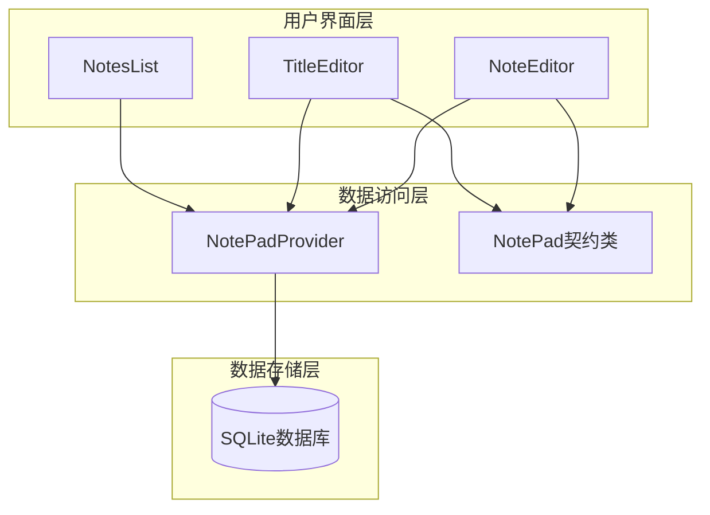
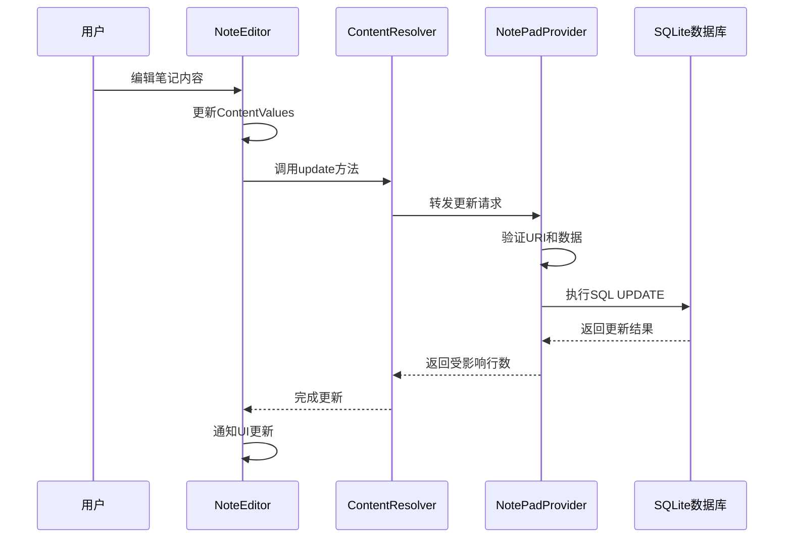
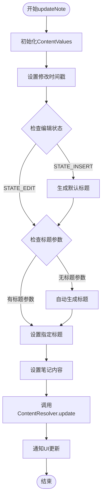
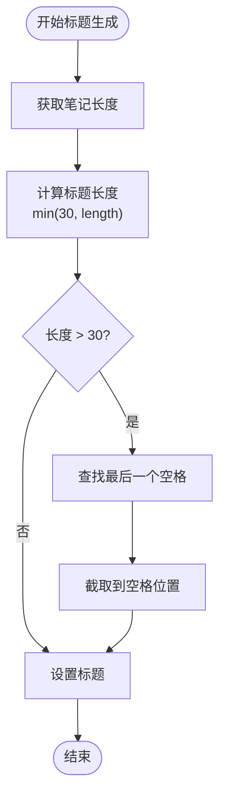
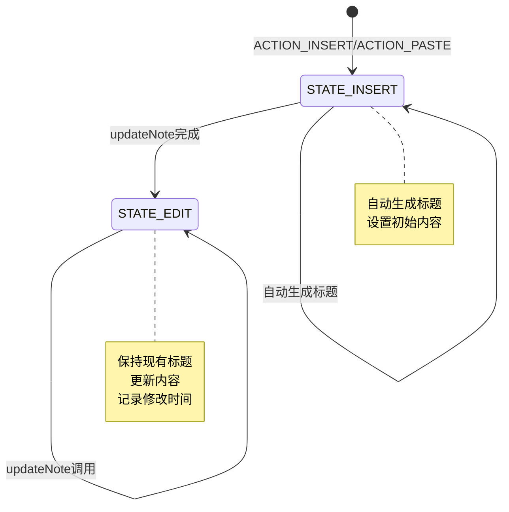
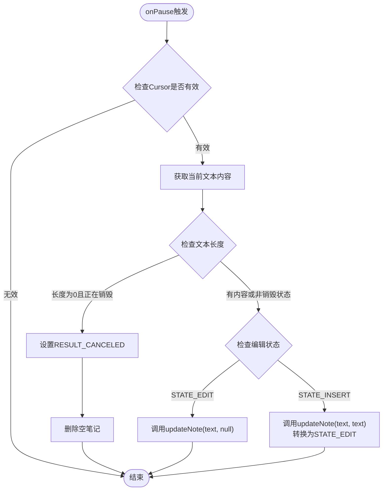
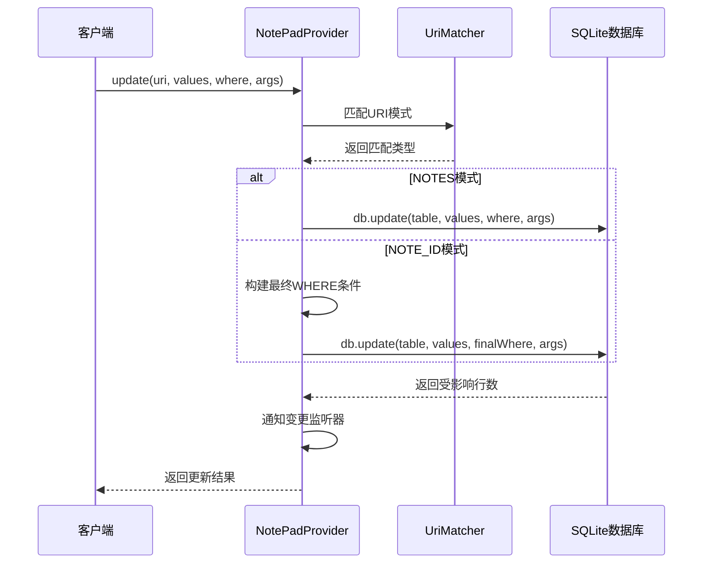
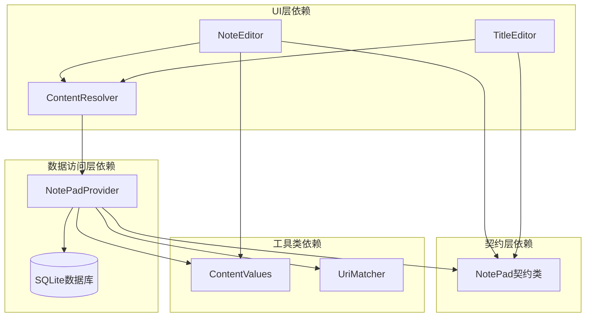

# 数据更新机制

<cite>
**本文档中引用的文件**
- [NoteEditor.java](file://app/src/main/java/com/example/android/notepad/NoteEditor.java)
- [NotePad.java](file://app/src/main/java/com/example/android/notepad/NotePad.java)
- [NotePadProvider.java](file://app/src/main/java/com/example/android/notepad/NotePadProvider.java)
- [TitleEditor.java](file://app/src/main/java/com/example/android/notepad/TitleEditor.java)
</cite>

## 目录
1. [简介](#简介)
2. [项目结构概述](#项目结构概述)
3. [核心组件分析](#核心组件分析)
4. [架构概览](#架构概览)
5. [详细组件分析](#详细组件分析)
6. [依赖关系分析](#依赖关系分析)
7. [性能考虑](#性能考虑)
8. [故障排除指南](#故障排除指南)
9. [结论](#结论)

## 简介

NotePad应用程序采用Android的Content Provider架构模式，实现了基于ContentResolver的数据持久化机制。本文档详细分析了NoteEditor中数据更新机制的实现原理，重点说明了如何通过ContentResolver的update方法将编辑后的笔记数据持久化到ContentProvider中。系统通过不同的状态（STATE_EDIT和STATE_INSERT）处理数据更新的差异，并在onPause生命周期中实现了自动保存逻辑。

## 项目结构概述

NotePad项目遵循Android标准的MVC架构模式，主要包含以下核心模块：

**图表来源**
- [NoteEditor.java](file://app/src/main/java/com/example/android/notepad/NoteEditor.java#L1-L50)
- [NotePadProvider.java](file://app/src/main/java/com/example/android/notepad/NotePadProvider.java#L1-L50)
- [NotePad.java](file://app/src/main/java/com/example/android/notepad/NotePad.java#L1-L50)

**章节来源**
- [NoteEditor.java](file://app/src/main/java/com/example/android/notepad/NoteEditor.java#L1-L100)
- [NotePadProvider.java](file://app/src/main/java/com/example/android/notepad/NotePadProvider.java#L1-L100)

## 核心组件分析

### NoteEditor活动组件

NoteEditor是笔记编辑的主要UI组件，负责处理用户输入和数据更新操作。该组件维护两种编辑状态：

- **STATE_EDIT**: 编辑现有笔记的状态
- **STATE_INSERT**: 创建新笔记的状态

### NotePad契约类

NotePad契约类定义了Content Provider的列常量和URI模式，为数据访问提供标准化接口：

| 列常量 | 类型 | 描述 |
|--------|------|------|
| COLUMN_NAME_TITLE | TEXT | 笔记标题 |
| COLUMN_NAME_NOTE | TEXT | 笔记内容 |
| COLUMN_NAME_CREATE_DATE | INTEGER | 创建时间戳 |
| COLUMN_NAME_MODIFICATION_DATE | INTEGER | 修改时间戳 |

### ContentResolver更新机制

系统通过ContentResolver的update方法实现数据持久化，该方法接受以下参数：
- **URI**: 指向要更新的记录
- **ContentValues**: 包含新值的映射对象
- **where**: 可选的SQL WHERE子句
- **whereArgs**: WHERE子句的参数数组

**章节来源**
- [NoteEditor.java](file://app/src/main/java/com/example/android/notepad/NoteEditor.java#L55-L85)
- [NotePad.java](file://app/src/main/java/com/example/android/notepad/NotePad.java#L130-L155)

## 架构概览

NotePad的数据更新机制采用分层架构设计，确保数据的一致性和完整性：

**图表来源**
- [NoteEditor.java](file://app/src/main/java/com/example/android/notepad/NoteEditor.java#L570-L580)
- [NotePadProvider.java](file://app/src/main/java/com/example/android/notepad/NotePadProvider.java#L668-L722)

## 详细组件分析

### updateNote方法详解

updateNote方法是数据更新的核心逻辑，负责构建ContentValues并调用ContentResolver的update方法：

**图表来源**
- [NoteEditor.java](file://app/src/main/java/com/example/android/notepad/NoteEditor.java#L523-L580)

#### ContentValues构建过程

updateNote方法中的ContentValues构建遵循以下策略：

1. **修改时间戳更新**: 始终更新COLUMN_NAME_MODIFICATION_DATE字段
2. **标题处理**: 根据编辑状态决定标题的处理方式
3. **内容更新**: 总是更新COLUMN_NAME_NOTE字段

#### 标题生成策略

对于STATE_INSERT状态，系统实现了智能的标题生成算法：

**图表来源**
- [NoteEditor.java](file://app/src/main/java/com/example/android/notepad/NoteEditor.java#L535-L550)

**章节来源**
- [NoteEditor.java](file://app/src/main/java/com/example/android/notepad/NoteEditor.java#L523-L580)

### 不同状态下的数据更新差异

#### STATE_EDIT状态处理

在编辑现有笔记时，系统采用以下更新策略：

1. **标题保持不变**: 如果提供了新的标题参数，则更新标题；否则保持原状
2. **内容更新**: 总是使用当前编辑器中的文本内容
3. **时间戳更新**: 自动更新修改时间戳

#### STATE_INSERT状态处理

在创建新笔记时，系统需要额外的初始化逻辑：

1. **默认标题生成**: 当没有提供标题时，从笔记内容自动生成
2. **状态转换**: 更新完成后将状态从STATE_INSERT转换为STATE_EDIT
3. **记录创建**: 通过ContentResolver.insert创建新记录

**图表来源**
- [NoteEditor.java](file://app/src/main/java/com/example/android/notepad/NoteEditor.java#L160-L171)
- [NoteEditor.java](file://app/src/main/java/com/example/android/notepad/NoteEditor.java#L369-L375)

**章节来源**
- [NoteEditor.java](file://app/src/main/java/com/example/android/notepad/NoteEditor.java#L369-L375)

### onPause生命周期中的自动保存机制

onPause方法实现了自动保存逻辑，确保用户编辑的内容不会丢失：

**图表来源**
- [NoteEditor.java](file://app/src/main/java/com/example/android/notepad/NoteEditor.java#L338-L376)

#### 自动保存的具体实现

自动保存逻辑的关键特性：

1. **智能判断**: 根据编辑状态选择合适的更新策略
2. **资源管理**: 在STATE_INSERT状态下正确处理新创建的笔记
3. **用户体验**: 确保用户编辑的内容得到及时保存

**章节来源**
- [NoteEditor.java](file://app/src/main/java/com/example/android/notepad/NoteEditor.java#L338-L376)

### ContentProvider端的数据处理

NotePadProvider负责处理来自ContentResolver的更新请求：

**图表来源**
- [NotePadProvider.java](file://app/src/main/java/com/example/android/notepad/NotePadProvider.java#L668-L722)

**章节来源**
- [NotePadProvider.java](file://app/src/main/java/com/example/android/notepad/NotePadProvider.java#L668-L722)

## 依赖关系分析

NotePad应用的数据更新机制涉及多个组件之间的复杂依赖关系：

**图表来源**
- [NoteEditor.java](file://app/src/main/java/com/example/android/notepad/NoteEditor.java#L1-L50)
- [NotePadProvider.java](file://app/src/main/java/com/example/android/notepad/NotePadProvider.java#L1-L50)
- [NotePad.java](file://app/src/main/java/com/example/android/notepad/NotePad.java#L1-L50)

### 关键依赖关系

1. **NoteEditor ↔ ContentResolver**: UI组件直接依赖ContentResolver进行数据操作
2. **ContentResolver ↔ NotePadProvider**: 数据访问层的核心依赖关系
3. **NotePadProvider ↔ SQLite数据库**: 底层数据存储的直接依赖
4. **所有组件 ↔ NotePad契约类**: 统一的数据访问接口

**章节来源**
- [NoteEditor.java](file://app/src/main/java/com/example/android/notepad/NoteEditor.java#L1-L100)
- [NotePadProvider.java](file://app/src/main/java/com/example/android/notepad/NotePadProvider.java#L1-L100)

## 性能考虑

### 同步操作的性能影响

当前实现中，所有数据库操作都在UI线程上执行，这可能会导致性能问题：

1. **阻塞风险**: 大数据量操作会阻塞UI线程
2. **响应延迟**: 用户界面可能变得不响应
3. **内存压力**: 大量数据加载可能导致内存不足

### 异步优化建议

为了提高性能，建议采用以下异步处理方案：

1. **AsyncTask**: 使用后台线程执行数据库操作
2. **LoaderManager**: 利用Android的Loader框架进行异步数据加载
3. **Room数据库**: 迁移到现代的Room数据库框架

### 内存管理优化

1. **Cursor管理**: 及时关闭不再使用的Cursor对象
2. **ContentValues复用**: 合理复用ContentValues对象减少内存分配
3. **状态保存优化**: 仅保存必要的状态信息

## 故障排除指南

### 常见问题及解决方案

#### 数据更新失败

**症状**: 笔记内容无法保存，更新返回0行受影响

**可能原因**:
1. URI格式错误
2. 数据库连接问题
3. 权限不足

**解决方案**:
1. 验证URI格式是否符合预期模式
2. 检查数据库是否正常打开
3. 确认应用具有适当的权限

#### 自动保存失效

**症状**: 应用切换时笔记内容丢失

**可能原因**:
1. onPause方法未正确调用
2. Cursor对象已关闭
3. 状态判断错误

**解决方案**:
1. 确保onPause方法被正确调用
2. 检查Cursor的有效性
3. 验证编辑状态的正确性

#### 标题生成异常

**症状**: 新建笔记时标题为空或生成异常

**可能原因**:
1. 笔记内容为空
2. 字符串处理错误
3. 编码问题

**解决方案**:
1. 添加空内容检查
2. 验证字符串截取逻辑
3. 确认字符编码设置

**章节来源**
- [NoteEditor.java](file://app/src/main/java/com/example/android/notepad/NoteEditor.java#L338-L376)
- [NotePadProvider.java](file://app/src/main/java/com/example/android/notepad/NotePadProvider.java#L668-L722)

## 结论

NotePad应用的数据更新机制展现了Android Content Provider架构的典型实现模式。通过ContentResolver的update方法，系统实现了高效的数据持久化，支持多种编辑状态的差异化处理，并在生命周期管理中实现了智能的自动保存功能。

### 主要优势

1. **架构清晰**: 采用分层架构，职责分离明确
2. **状态管理**: 有效处理编辑和插入两种状态
3. **自动保存**: 在onPause中实现智能的自动保存
4. **契约标准化**: 通过NotePad契约类提供统一的接口

### 改进建议

1. **异步处理**: 将数据库操作移至后台线程
2. **错误处理**: 增强异常处理和恢复机制
3. **性能优化**: 实现更高效的缓存和批量操作
4. **测试覆盖**: 增加单元测试和集成测试

该数据更新机制为Android应用开发提供了良好的参考范例，展示了如何在保持代码简洁的同时实现功能完整的数据持久化解决方案。