# 数据查询机制

<cite>
**本文档中引用的文件**
- [NotesList.java](file://app/src/main/java/com/example/android/notepad/NotesList.java)
- [NotePad.java](file://app/src/main/java/com/example/android/notepad/NotePad.java)
- [NotePadProvider.java](file://app/src/main/java/com/example/android/notepad/NotePadProvider.java)
- [noteslist_item.xml](file://app/src/main/res/layout/noteslist_item.xml)
- [list_options_menu.xml](file://app/src/main/res/menu/list_options_menu.xml)
- [list_context_menu.xml](file://app/src/main/res/menu/list_context_menu.xml)
- [strings.xml](file://app/src/main/res/values/strings.xml)
</cite>

## 目录
1. [简介](#简介)
2. [项目结构概述](#项目结构概述)
3. [核心组件分析](#核心组件分析)
4. [数据查询架构](#数据查询架构)
5. [详细组件分析](#详细组件分析)
6. [查询流程详解](#查询流程详解)
7. [适配器绑定机制](#适配器绑定机制)
8. [性能优化考虑](#性能优化考虑)
9. [故障排除指南](#故障排除指南)
10. [结论](#结论)

## 简介

本文档详细分析了Android NotePad应用中NotesList组件的数据查询机制。该系统基于Android的ContentProvider架构，通过NotePad契约类中的CONTENT_URI和PROJECTION常量，使用managedQuery方法从ContentProvider获取数据，并通过SimpleCursorAdapter将查询结果绑定到ListView中显示。

数据查询机制是整个应用的核心功能之一，它负责从SQLite数据库中检索笔记数据，经过适当的投影和排序后展示给用户。该机制采用了标准的Android数据访问模式，确保了良好的可维护性和扩展性。

## 项目结构概述

NotePad应用采用典型的Android MVC架构，主要包含以下核心模块：

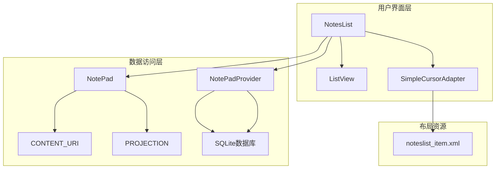

**图表来源**
- [NotesList.java](file://app/src/main/java/com/example/android/notepad/NotesList.java#L1-L50)
- [NotePad.java](file://app/src/main/java/com/example/android/notepad/NotePad.java#L1-L50)
- [NotePadProvider.java](file://app/src/main/java/com/example/android/notepad/NotePadProvider.java#L1-L50)

**章节来源**
- [NotesList.java](file://app/src/main/java/com/example/android/notepad/NotesList.java#L1-L100)
- [NotePad.java](file://app/src/main/java/com/example/android/notepad/NotePad.java#L1-L155)

## 核心组件分析

### NotePad契约类

NotePad契约类定义了整个应用的数据访问接口，包含了所有重要的URI和列名常量：

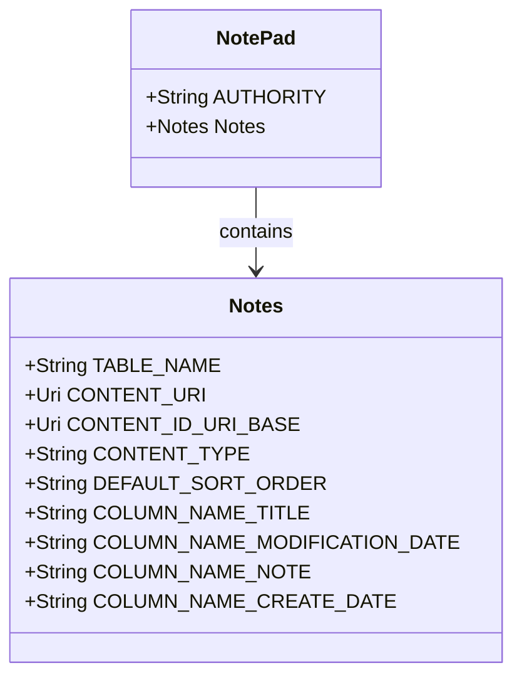

**图表来源**
- [NotePad.java](file://app/src/main/java/com/example/android/notepad/NotePad.java#L28-L155)

### NotesList活动类

NotesList是主列表视图的控制器，负责处理数据查询、适配器绑定和用户交互：

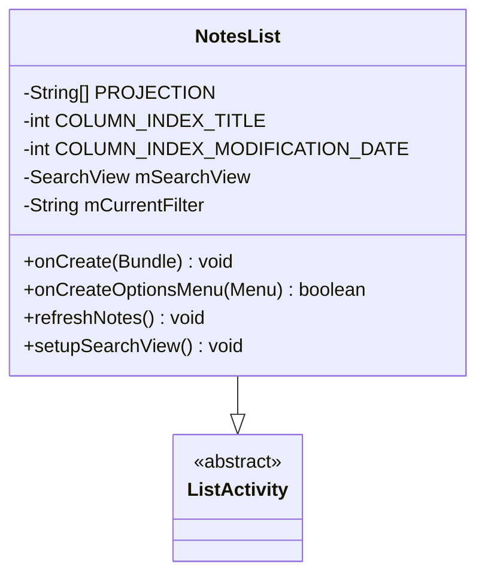

**图表来源**
- [NotesList.java](file://app/src/main/java/com/example/android/notepad/NotesList.java#L56-L167)

**章节来源**
- [NotesList.java](file://app/src/main/java/com/example/android/notepad/NotesList.java#L56-L167)
- [NotePad.java](file://app/src/main/java/com/example/android/notepad/NotePad.java#L38-L155)

## 数据查询架构

### 查询参数配置

数据查询过程涉及多个关键参数的配置：

| 参数 | 类型 | 描述 | 默认值 |
|------|------|------|--------|
| URI | Uri | 数据源标识符 | NotePad.Notes.CONTENT_URI |
| 投影列 | String[] | 需要查询的列名数组 | PROJECTION常量 |
| 选择条件 | String | WHERE子句条件 | null（查询所有记录） |
| 选择参数 | String[] | WHERE子句的参数值 | null |
| 排序方式 | String | ORDER BY子句 | NotePad.Notes.DEFAULT_SORT_ORDER |

### URI构建机制

ContentProvider使用统一资源标识符来定位和操作数据：

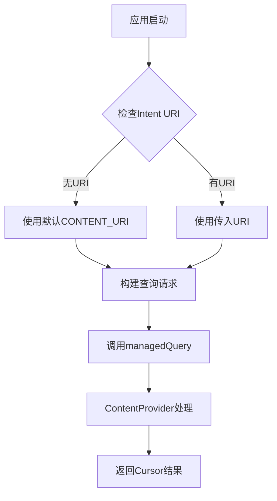

**图表来源**
- [NotesList.java](file://app/src/main/java/com/example/android/notepad/NotesList.java#L88-L119)

**章节来源**
- [NotesList.java](file://app/src/main/java/com/example/android/notepad/NotesList.java#L88-L119)
- [NotePad.java](file://app/src/main/java/com/example/android/notepad/NotePad.java#L83-L98)

## 详细组件分析

### PROJECTION数组设计

PROJECTION数组定义了查询中需要返回的列，这种设计确保了只查询必要的数据列：

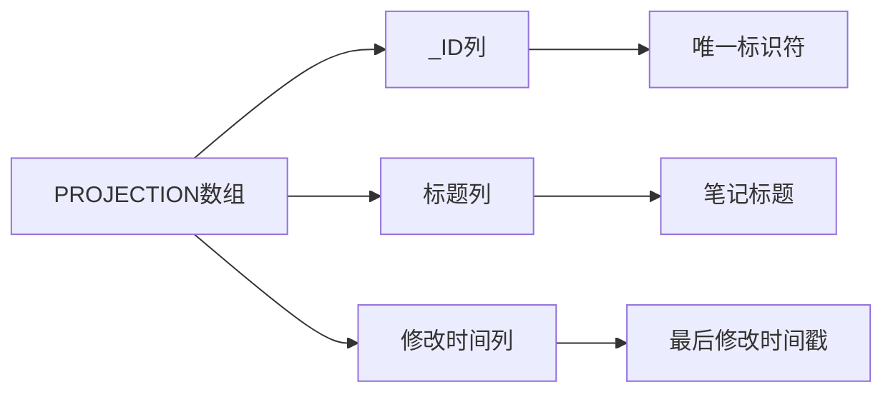

**图表来源**
- [NotesList.java](file://app/src/main/java/com/example/android/notepad/NotesList.java#L64-L68)

### managedQuery方法执行流程

managedQuery是Android提供的高级查询方法，自动管理Cursor的生命周期：

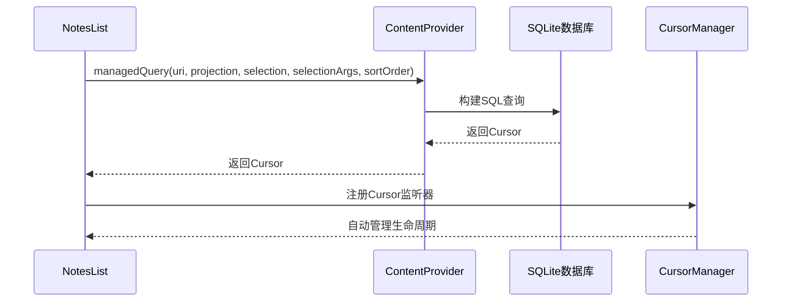

**图表来源**
- [NotesList.java](file://app/src/main/java/com/example/android/notepad/NotesList.java#L113-L119)
- [NotePadProvider.java](file://app/src/main/java/com/example/android/notepad/NotePadProvider.java#L252-L321)

**章节来源**
- [NotesList.java](file://app/src/main/java/com/example/android/notepad/NotesList.java#L64-L68)
- [NotesList.java](file://app/src/main/java/com/example/android/notepad/NotesList.java#L113-L119)

## 查询流程详解

### onCreate方法中的数据查询

onCreate方法展示了完整的数据查询和显示流程：

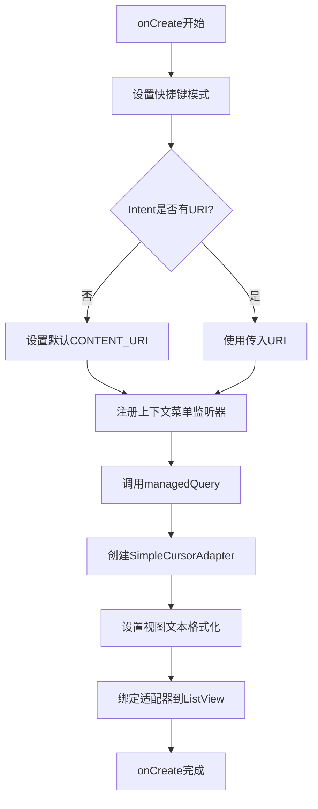

**图表来源**
- [NotesList.java](file://app/src/main/java/com/example/android/notepad/NotesList.java#L81-L167)

### 默认URI设置机制

当没有提供特定的URI时，系统会自动使用默认的CONTENT_URI：

```mermaid
flowchart TD
A[获取Intent] --> B{Intent.getData() == null?}
B --> |是| C[intent.setData(CONTENT_URI)]
B --> |否| D[使用现有URI]
C --> E[设置为默认URI]
D --> F[继续处理]
E --> F
```

**图表来源**
- [NotesList.java](file://app/src/main/java/com/example/android/notepad/NotesList.java#L93-L99)

### 游标创建和管理

游标是查询结果的直接映射，其生命周期由managedQuery自动管理：

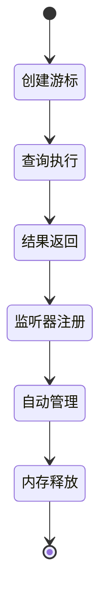

**图表来源**
- [NotesList.java](file://app/src/main/java/com/example/android/notepad/NotesList.java#L113-L119)

**章节来源**
- [NotesList.java](file://app/src/main/java/com/example/android/notepad/NotesList.java#L81-L167)

## 适配器绑定机制

### SimpleCursorAdapter配置

SimpleCursorAdapter负责将Cursor中的数据绑定到ListView的视图元素：

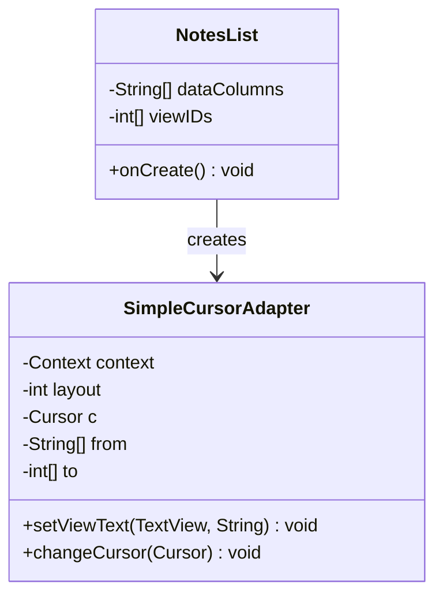

**图表来源**
- [NotesList.java](file://app/src/main/java/com/example/android/notepad/NotesList.java#L137-L163)

### 视图映射关系

数据列与视图ID之间建立了明确的映射关系：

| 数据列 | 视图ID | 显示内容 |
|--------|--------|----------|
| COLUMN_NAME_TITLE | android.R.id.text1 | 笔记标题 |
| COLUMN_NAME_MODIFICATION_DATE | android.R.id.text2 | 修改时间 |

### 自定义文本格式化

适配器提供了自定义文本格式化的功能，特别是对时间戳的处理：

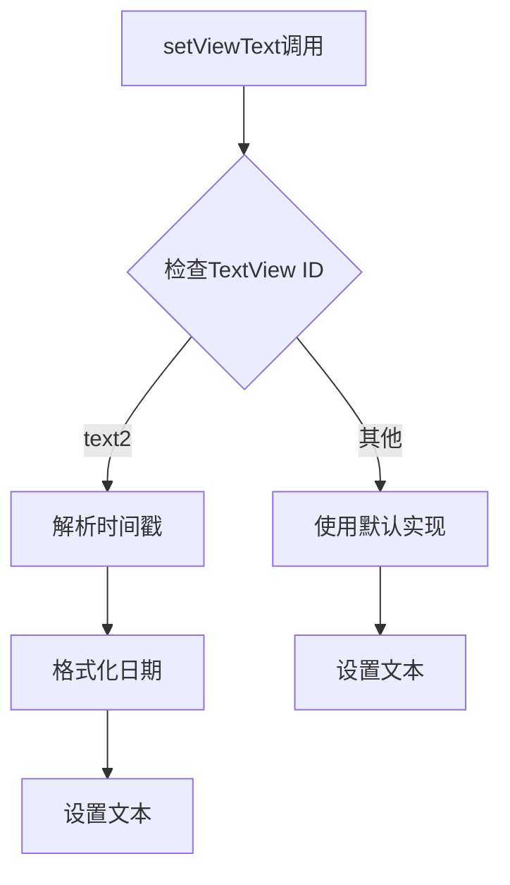

**图表来源**
- [NotesList.java](file://app/src/main/java/com/example/android/notepad/NotesList.java#L146-L162)

**章节来源**
- [NotesList.java](file://app/src/main/java/com/example/android/notepad/NotesList.java#L137-L167)
- [noteslist_item.xml](file://app/src/main/res/layout/noteslist_item.xml#L23-L38)

## 性能优化考虑

### 投影优化策略

通过精确指定需要的列，避免了不必要的数据传输：

- **减少内存占用**：只查询必要的列
- **提高查询速度**：减少I/O操作
- **降低网络开销**：在跨进程通信中尤为重要

### 游标生命周期管理

managedQuery自动管理游标的生命周期，确保资源的正确释放：

- **自动关闭**：Activity销毁时自动关闭游标
- **重新查询**：数据变化时自动重新查询
- **内存优化**：及时释放不再需要的资源

### 懒加载机制

对于大型数据集，可以考虑实现懒加载或分页加载机制：

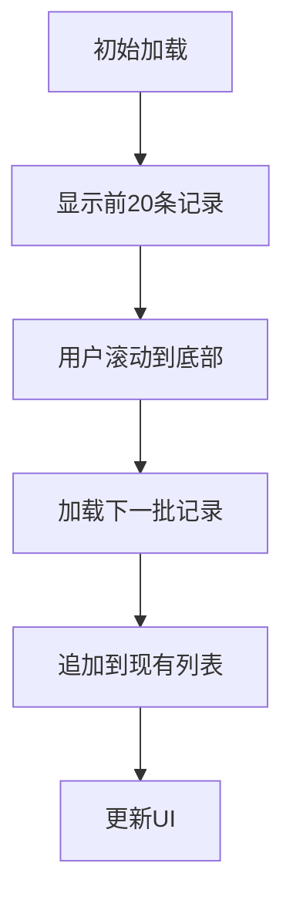

## 故障排除指南

### 常见查询问题

| 问题类型 | 可能原因 | 解决方案 |
|----------|----------|----------|
| 查询超时 | 数据库锁定或大量数据 | 优化查询条件，添加索引 |
| 内存泄漏 | 游标未正确关闭 | 使用managedQuery自动管理 |
| 数据不一致 | 并发访问冲突 | 实现适当的同步机制 |
| 性能下降 | 过度投影或复杂查询 | 优化PROJECTION和WHERE条件 |

### 调试技巧

1. **启用日志记录**：在NotePadProvider中添加日志输出
2. **监控内存使用**：使用Android Profiler分析内存占用
3. **测试边界情况**：验证空数据、大量数据等情况
4. **性能基准测试**：测量查询响应时间和内存使用

### 错误处理策略

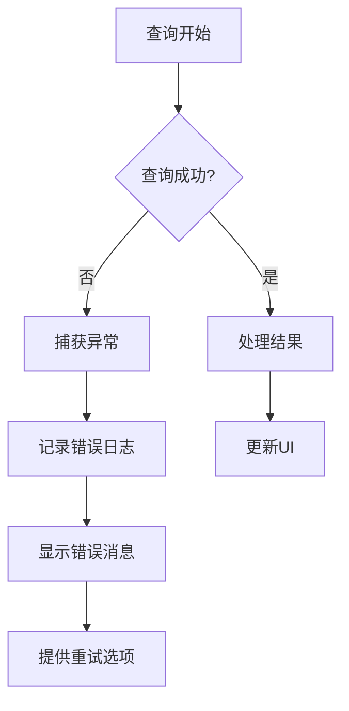

**章节来源**
- [NotesList.java](file://app/src/main/java/com/example/android/notepad/NotesList.java#L113-L119)
- [NotePadProvider.java](file://app/src/main/java/com/example/android/notepad/NotePadProvider.java#L252-L321)

## 结论

NotePad应用的NotesList数据查询机制展现了Android平台标准的数据访问模式。通过合理使用ContentProvider、managedQuery和SimpleCursorAdapter，实现了高效、可维护的数据查询和显示功能。

该机制的主要优势包括：

1. **标准化接口**：遵循Android开发最佳实践
2. **资源管理**：自动管理游标生命周期
3. **性能优化**：精确控制查询范围和结果
4. **用户体验**：流畅的数据加载和更新

对于开发者而言，理解这套机制不仅有助于维护现有代码，也为开发类似应用提供了宝贵的参考。随着应用规模的增长，可以在此基础上进一步优化查询性能，实现更复杂的数据处理逻辑。