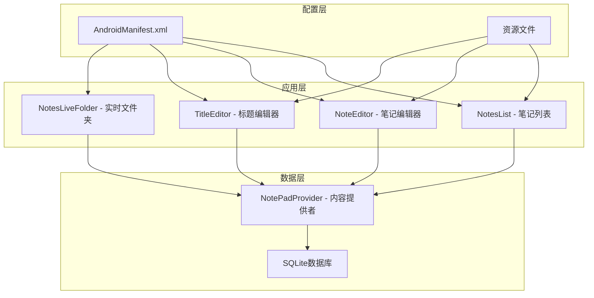
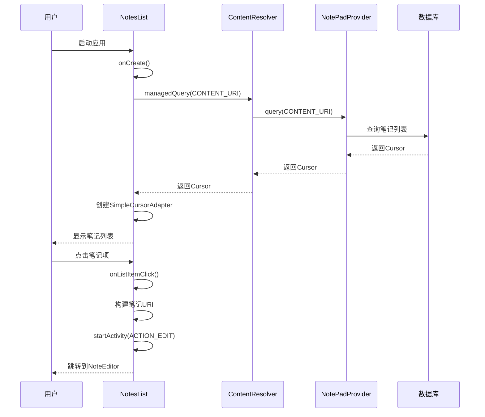
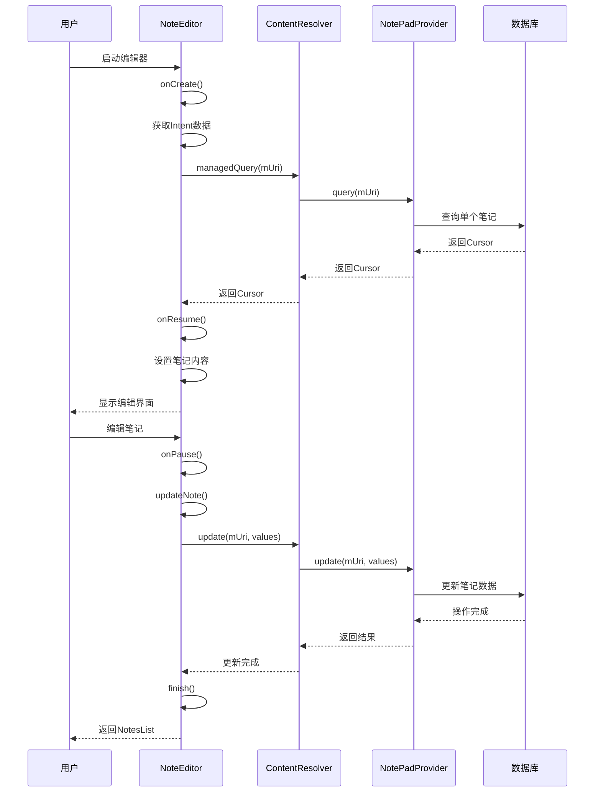
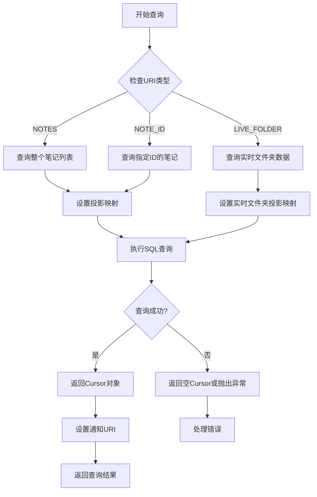
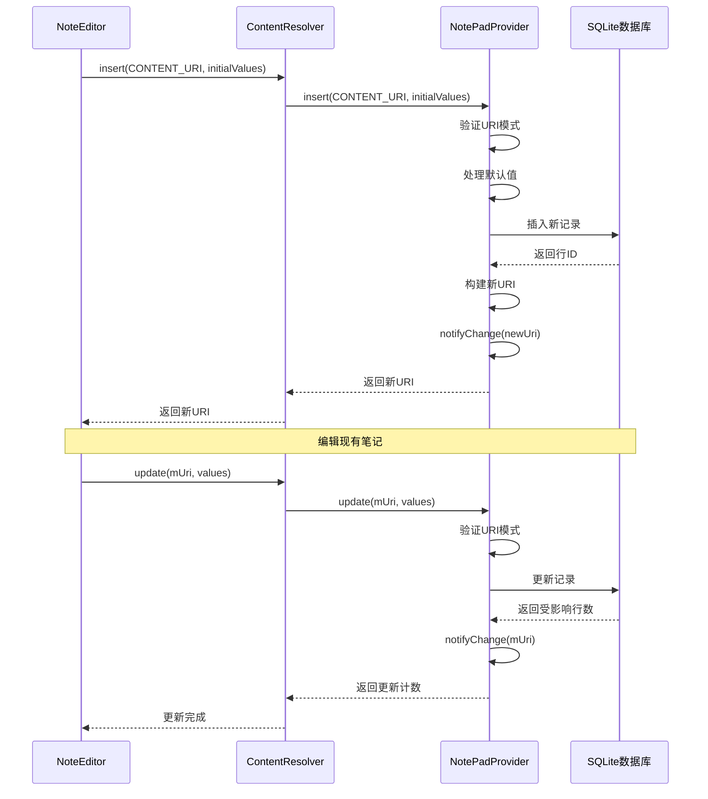
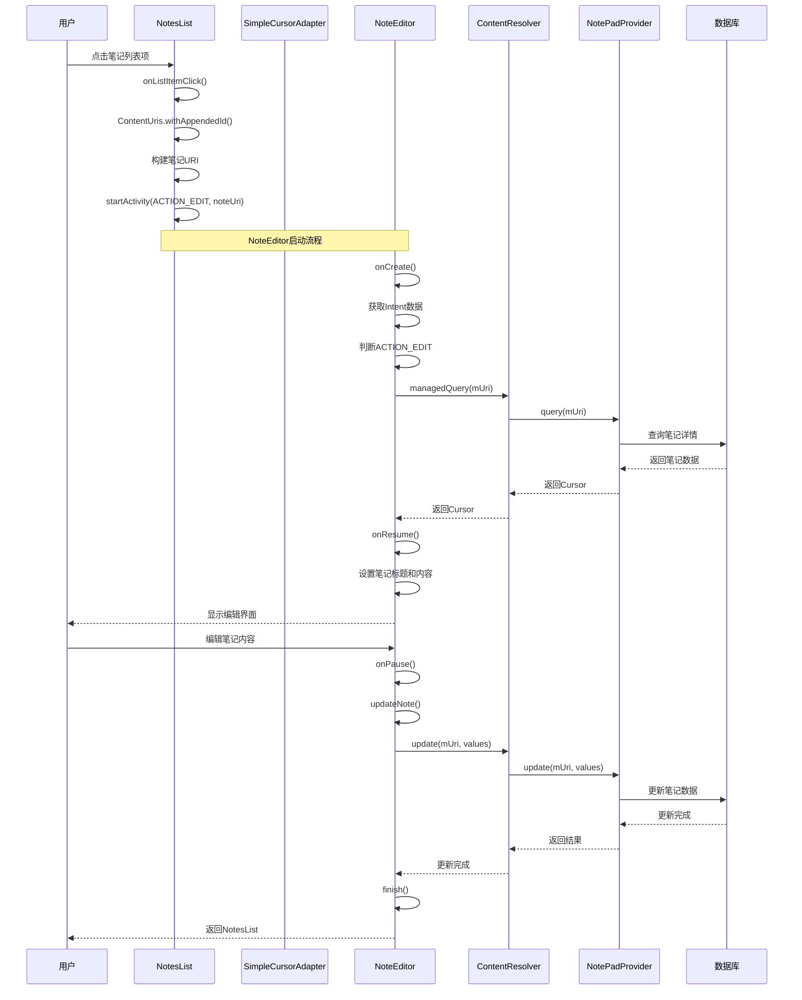
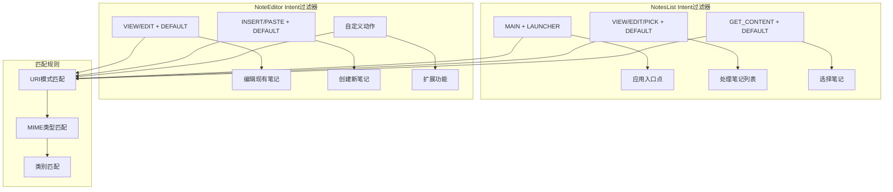
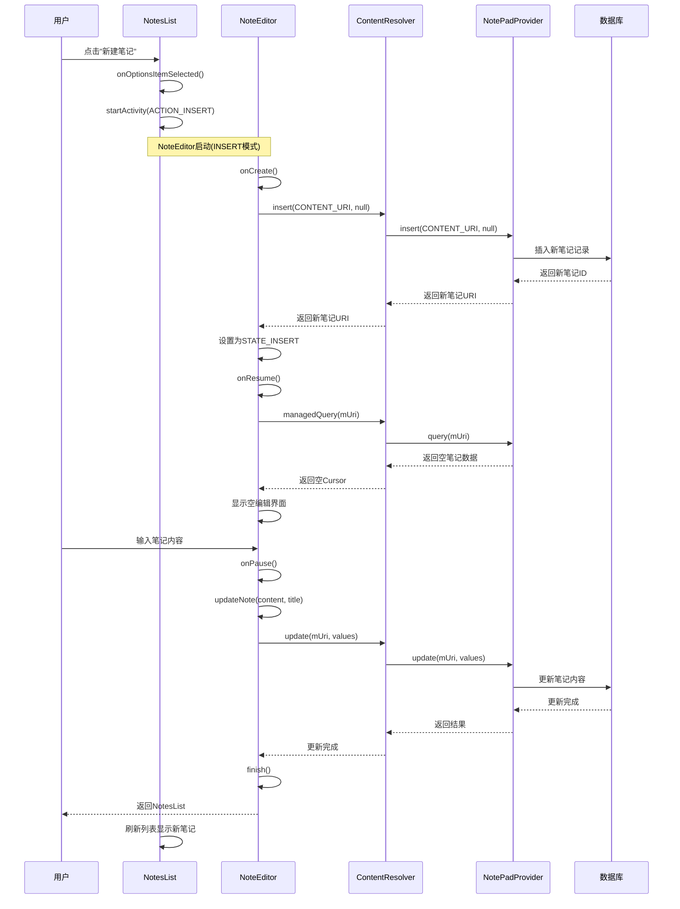
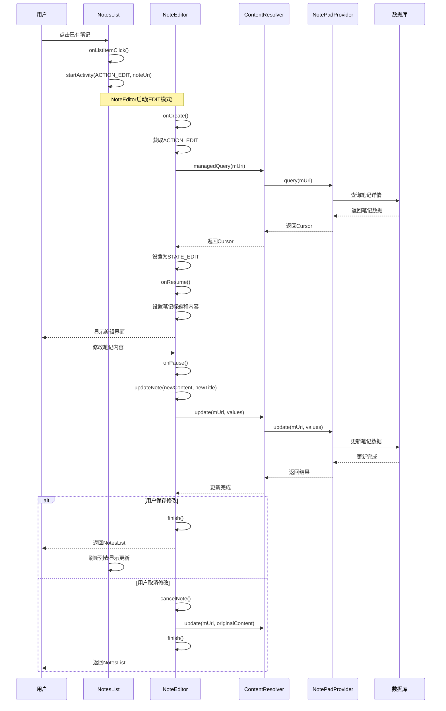
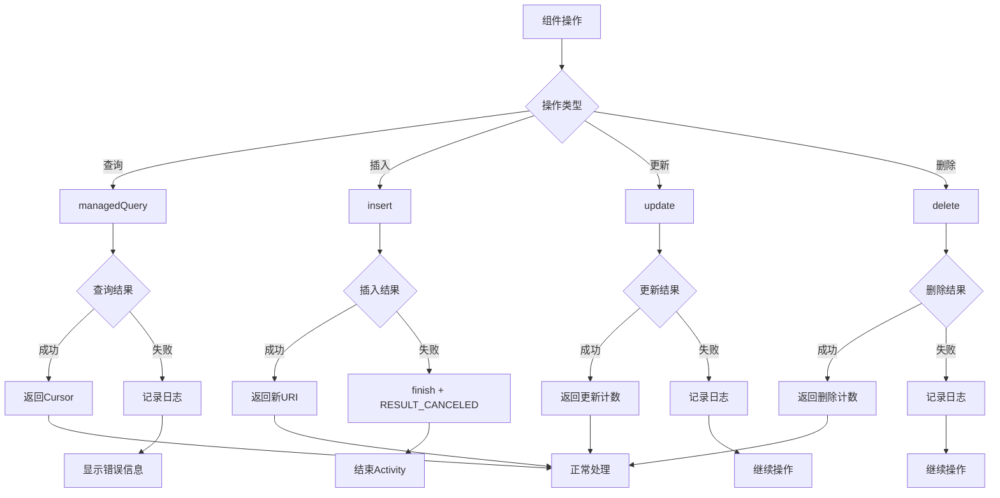

# 核心组件交互

<cite>
**本文档中引用的文件**
- [NotePad.java](file://app/src/main/java/com/example/android/notepad/NotePad.java)
- [NotesList.java](file://app/src/main/java/com/example/android/notepad/NotesList.java)
- [NoteEditor.java](file://app/src/main/java/com/example/android/notepad/NoteEditor.java)
- [NotePadProvider.java](file://app/src/main/java/com/example/android/notepad/NotePadProvider.java)
- [AndroidManifest.xml](file://app/src/main/AndroidManifest.xml)
- [note_editor.xml](file://app/src/main/res/layout/note_editor.xml)
- [list_options_menu.xml](file://app/src/main/res/menu/list_options_menu.xml)
- [strings.xml](file://app/src/main/res/values/strings.xml)
</cite>

## 目录
1. [简介](#简介)
2. [项目结构概览](#项目结构概览)
3. [核心组件架构](#核心组件架构)
4. [URI常量和MIME类型定义](#uri常量和mime类型定义)
5. [Activity生命周期管理](#activity生命周期管理)
6. [数据查询和持久化机制](#数据查询和持久化机制)
7. [组件间通信流程](#组件间通信流程)
8. [时序图分析](#时序图分析)
9. [错误处理和状态管理](#错误处理和状态管理)
10. [性能优化考虑](#性能优化考虑)
11. [总结](#总结)

## 简介

NotePad应用是一个典型的Android内容提供者模式实现，展示了如何通过统一的数据接口在不同组件间进行通信。该应用的核心是基于契约类（Contract Class）中的URI常量和MIME类型定义，实现了NotesList和NoteEditor两个主要组件之间的无缝协作。

本文档详细分析了从用户点击列表项到编辑界面显示完整笔记内容的完整调用链路，包括URI的构建、数据查询和Activity跳转过程，并结合代码实例说明了数据持久化操作的具体实现。

## 项目结构概览

NotePad应用采用标准的Android项目结构，主要包含以下核心模块：



**图表来源**
- [AndroidManifest.xml](file://app/src/main/AndroidManifest.xml#L25-L118)
- [NotePadProvider.java](file://app/src/main/java/com/example/android/notepad/NotePadProvider.java#L54-L753)

**章节来源**
- [AndroidManifest.xml](file://app/src/main/AndroidManifest.xml#L1-L119)

## 核心组件架构

### 组件关系图

```mermaid
classDiagram
class NotePad {
+String AUTHORITY
+Notes$Notes
+Notes() private
}
class Notes$Notes {
+String TABLE_NAME
+Uri CONTENT_URI
+Uri CONTENT_ID_URI_BASE
+Uri CONTENT_ID_URI_PATTERN
+String CONTENT_TYPE
+String CONTENT_ITEM_TYPE
+String DEFAULT_SORT_ORDER
+String COLUMN_NAME_TITLE
+String COLUMN_NAME_NOTE
+String COLUMN_NAME_CREATE_DATE
+String COLUMN_NAME_MODIFICATION_DATE
+int NOTE_ID_PATH_POSITION
}
class NotesList {
+String[] PROJECTION
+int COLUMN_INDEX_TITLE
+int COLUMN_INDEX_MODIFICATION_DATE
+SearchView mSearchView
+String mCurrentFilter
+onCreate(Bundle) void
+onListItemClick(ListView, View, int, long) void
+managedQuery(Uri, String[], String, String[], String) Cursor
}
class NoteEditor {
+String[] PROJECTION
+int STATE_EDIT
+int STATE_INSERT
+int mState
+Uri mUri
+Cursor mCursor
+EditText mText
+String mOriginalContent
+onCreate(Bundle) void
+onResume() void
+onPause() void
+updateNote(String, String) void
}
class NotePadProvider {
+String DATABASE_NAME
+int DATABASE_VERSION
+UriMatcher sUriMatcher
+HashMap~String,String~ sNotesProjectionMap
+onCreate() boolean
+query(Uri, String[], String, String[], String) Cursor
+insert(Uri, ContentValues) Uri
+update(Uri, ContentValues, String, String[]) int
+delete(Uri, String, String[]) int
}
NotePad --> Notes$Notes
NotesList --> NotePad
NoteEditor --> NotePad
NotesList --> NotePadProvider
NoteEditor --> NotePadProvider
```

**图表来源**
- [NotePad.java](file://app/src/main/java/com/example/android/notepad/NotePad.java#L28-L155)
- [NotesList.java](file://app/src/main/java/com/example/android/notepad/NotesList.java#L56-L550)
- [NoteEditor.java](file://app/src/main/java/com/example/android/notepad/NoteEditor.java#L54-L616)
- [NotePadProvider.java](file://app/src/main/java/com/example/android/notepad/NotePadProvider.java#L54-L753)

**章节来源**
- [NotePad.java](file://app/src/main/java/com/example/android/notepad/NotePad.java#L1-L155)
- [NotesList.java](file://app/src/main/java/com/example/android/notepad/NotesList.java#L1-L550)
- [NoteEditor.java](file://app/src/main/java/com/example/android/notepad/NoteEditor.java#L1-L616)

## URI常量和MIME类型定义

### 契约类设计

NotePad应用通过`NotePad`契约类定义了统一的数据访问接口，所有组件都依赖这些常量进行数据交互：

```mermaid
graph LR
subgraph "URI结构"
A[content://] --> B[com.google.provider.NotePad]
B --> C[/notes]
B --> D[/notes/]
B --> E[/live_folders/notes]
end
subgraph "MIME类型"
F[vnd.android.cursor.dir/vnd.google.note] --> G[目录类型]
H[vnd.android.cursor.item/vnd.google.note] --> I[单个条目类型]
end
subgraph "路径位置"
J[NOTES: /notes]
K[NOTE_ID: /notes/{id}]
L[LIVE_FOLDER: /live_folders/notes]
end
```

**图表来源**
- [NotePad.java](file://app/src/main/java/com/example/android/notepad/NotePad.java#L52-L104)

### 关键URI常量

| 常量名称 | 值 | 用途 |
|---------|-----|------|
| `AUTHORITY` | `"com.google.provider.NotePad"` | 提供者的授权标识符 |
| `CONTENT_URI` | `"content://com.google.provider.NotePad/notes"` | 笔记列表的根URI |
| `CONTENT_ID_URI_BASE` | `"content://com.google.provider.NotePad/notes/"` | 单个笔记URI的基础URI |
| `CONTENT_ID_URI_PATTERN` | `"content://com.google.provider.NotePad/notes/#"` | 匹配单个笔记ID的URI模式 |
| `LIVE_FOLDER_URI` | `"content://com.google.provider.NotePad/live_folders/notes"` | 实时文件夹URI |

### MIME类型定义

| 类型 | 值 | 说明 |
|------|-----|------|
| `CONTENT_TYPE` | `"vnd.android.cursor.dir/vnd.google.note"` | 笔记列表的MIME类型 |
| `CONTENT_ITEM_TYPE` | `"vnd.android.cursor.item/vnd.google.note"` | 单个笔记的MIME类型 |

**章节来源**
- [NotePad.java](file://app/src/main/java/com/example/android/notepad/NotePad.java#L28-L155)

## Activity生命周期管理

### NotesList生命周期



**图表来源**
- [NotesList.java](file://app/src/main/java/com/example/android/notepad/NotesList.java#L81-L167)

### NoteEditor生命周期



**图表来源**
- [NoteEditor.java](file://app/src/main/java/com/example/android/notepad/NoteEditor.java#L140-L378)

**章节来源**
- [NotesList.java](file://app/src/main/java/com/example/android/notepad/NotesList.java#L81-L550)
- [NoteEditor.java](file://app/src/main/java/com/example/android/notepad/NoteEditor.java#L140-L616)

## 数据查询和持久化机制

### ContentResolver查询流程



**图表来源**
- [NotePadProvider.java](file://app/src/main/java/com/example/android/notepad/NotePadProvider.java#L252-L321)

### 数据插入和更新机制



**图表来源**
- [NotePadProvider.java](file://app/src/main/java/com/example/android/notepad/NotePadProvider.java#L499-L567)
- [NotePadProvider.java](file://app/src/main/java/com/example/android/notepad/NotePadProvider.java#L668-L739)

**章节来源**
- [NotePadProvider.java](file://app/src/main/java/com/example/android/notepad/NotePadProvider.java#L252-L739)

## 组件间通信流程

### 从列表点击到编辑器启动的完整流程



**图表来源**
- [NotesList.java](file://app/src/main/java/com/example/android/notepad/NotesList.java#L528-L549)
- [NoteEditor.java](file://app/src/main/java/com/example/android/notepad/NoteEditor.java#L140-L378)

### Intent过滤器匹配机制



**图表来源**
- [AndroidManifest.xml](file://app/src/main/AndroidManifest.xml#L34-L77)

**章节来源**
- [NotesList.java](file://app/src/main/java/com/example/android/notepad/NotesList.java#L528-L549)
- [NoteEditor.java](file://app/src/main/java/com/example/android/notepad/NoteEditor.java#L140-L378)
- [AndroidManifest.xml](file://app/src/main/AndroidManifest.xml#L34-L77)

## 时序图分析

### 笔记创建流程时序图



**图表来源**
- [NotesList.java](file://app/src/main/java/com/example/android/notepad/NotesList.java#L351-L370)
- [NoteEditor.java](file://app/src/main/java/com/example/android/notepad/NoteEditor.java#L140-L200)

### 笔记编辑流程时序图



**图表来源**
- [NotesList.java](file://app/src/main/java/com/example/android/notepad/NotesList.java#L528-L549)
- [NoteEditor.java](file://app/src/main/java/com/example/android/notepad/NoteEditor.java#L140-L378)

## 错误处理和状态管理

### 异常处理机制



**图表来源**
- [NoteEditor.java](file://app/src/main/java/com/example/android/notepad/NoteEditor.java#L178-L185)
- [NotePadProvider.java](file://app/src/main/java/com/example/android/notepad/NotePadProvider.java#L565-L567)

### 状态管理模式

| 状态常量 | 值 | 说明 |
|----------|-----|------|
| `STATE_EDIT` | `0` | 编辑现有笔记状态 |
| `STATE_INSERT` | `1` | 创建新笔记状态 |

| 生命周期方法 | STATE_EDIT | STATE_INSERT |
|-------------|------------|--------------|
| `onCreate()` | 从URI查询现有数据 | 插入新记录并获取URI |
| `onResume()` | 设置笔记标题和内容 | 显示空编辑界面 |
| `onPause()` | 保存修改内容 | 保存新笔记内容 |
| `updateNote()` | 更新现有记录 | 插入新记录后切换到编辑状态 |

**章节来源**
- [NoteEditor.java](file://app/src/main/java/com/example/android/notepad/NoteEditor.java#L73-L82)
- [NoteEditor.java](file://app/src/main/java/com/example/android/notepad/NoteEditor.java#L140-L200)

## 性能优化考虑

### 数据库操作优化

1. **异步查询处理**: 当前实现直接在UI线程执行数据库操作，实际应用应使用`AsyncQueryHandler`或`AsyncTask`
2. **游标管理**: 使用`managedQuery()`自动管理游标生命周期
3. **批量操作**: 对于大量数据操作，考虑使用事务处理

### 内存管理

1. **Cursor关闭**: 确保在适当时候关闭游标避免内存泄漏
2. **资源释放**: 在`onDestroy()`中释放持有的资源
3. **状态保存**: 使用`onSaveInstanceState()`保存重要状态信息

### 网络和I/O优化

1. **延迟加载**: 对于大型笔记内容，考虑分页加载
2. **缓存策略**: 实现适当的本地缓存机制
3. **压缩存储**: 对于大文本内容，考虑压缩存储

## 总结

NotePad应用通过精心设计的契约类和内容提供者模式，实现了组件间的松耦合通信。其核心优势包括：

1. **统一的数据接口**: 通过URI常量和MIME类型定义，确保所有组件使用一致的数据访问方式
2. **清晰的生命周期管理**: 每个Activity都有明确的状态管理和数据处理逻辑
3. **灵活的Intent过滤**: 支持多种操作模式和外部应用集成
4. **可靠的数据持久化**: 通过ContentResolver和ContentProvider确保数据一致性

这种架构设计不仅保证了应用的功能完整性，还为未来的功能扩展和维护奠定了良好的基础。开发者可以基于这个模式快速构建类似的笔记类应用，同时也可以参考其中的最佳实践来改进自己的Android应用开发。