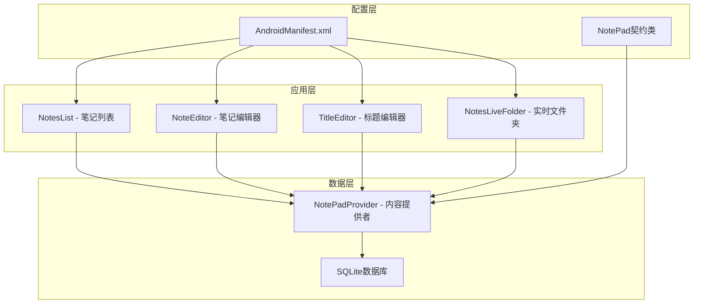
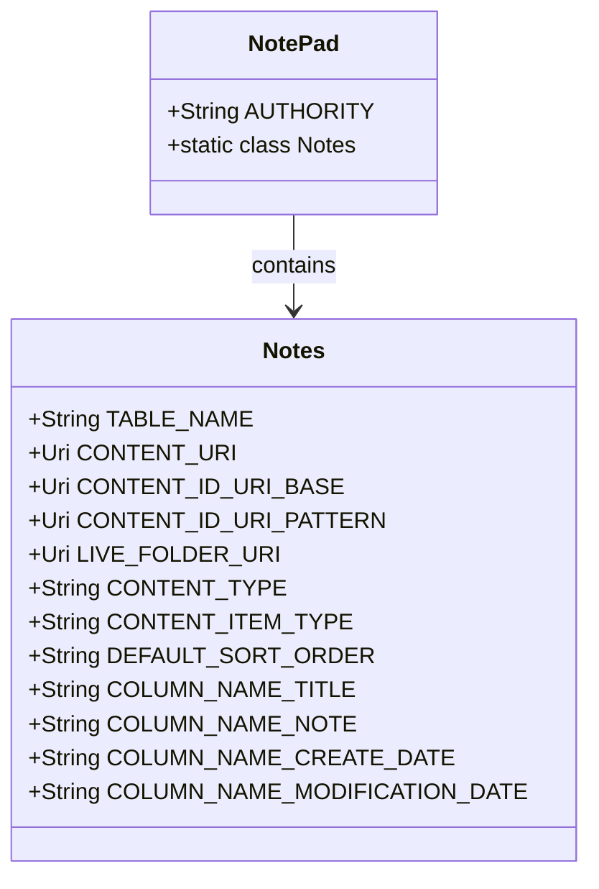
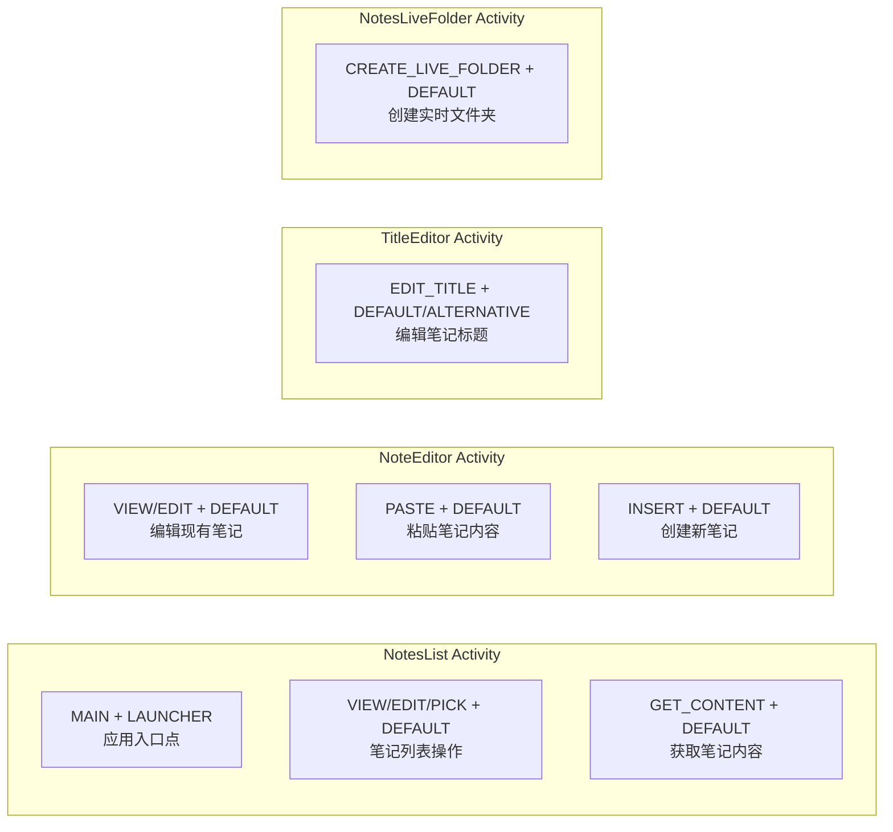
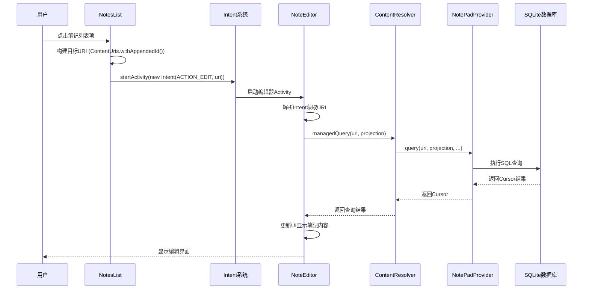
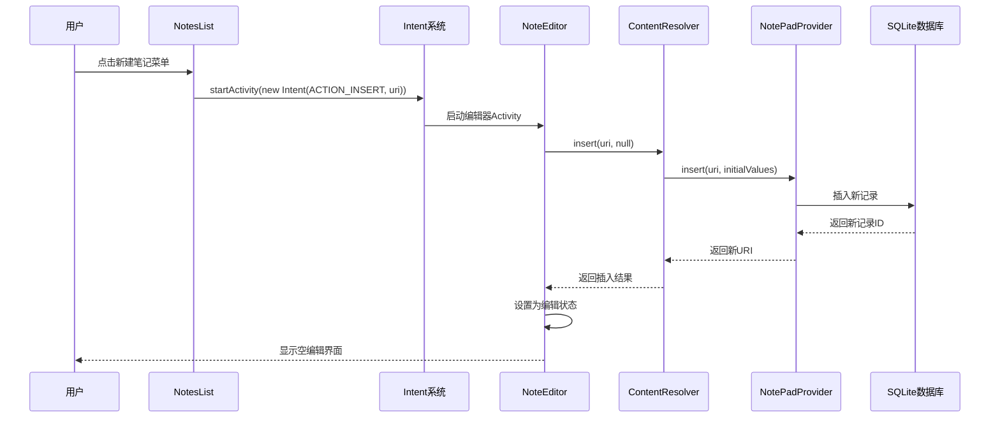
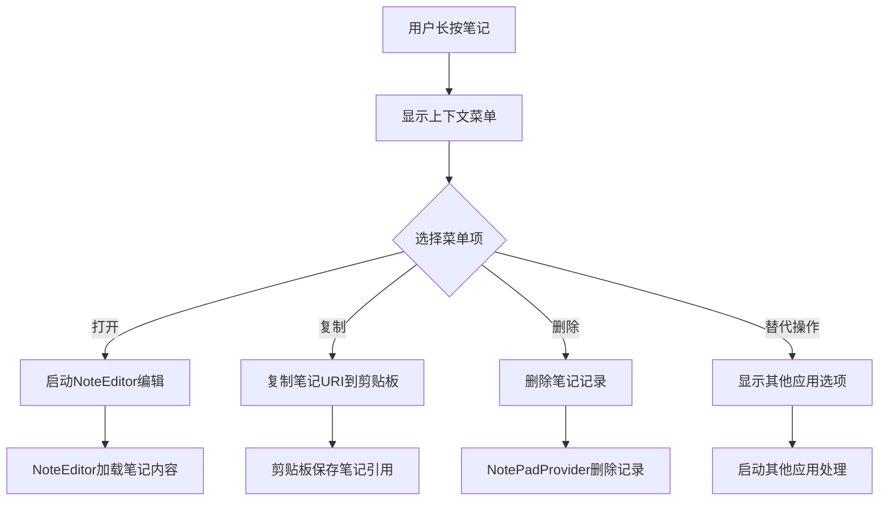
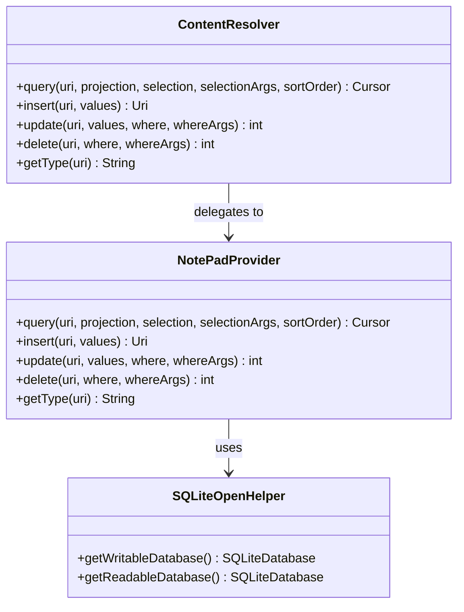
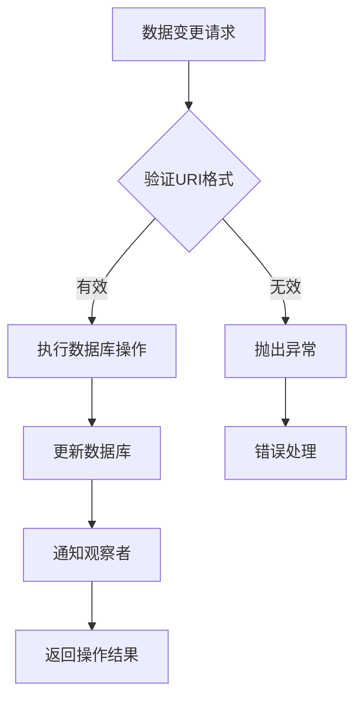
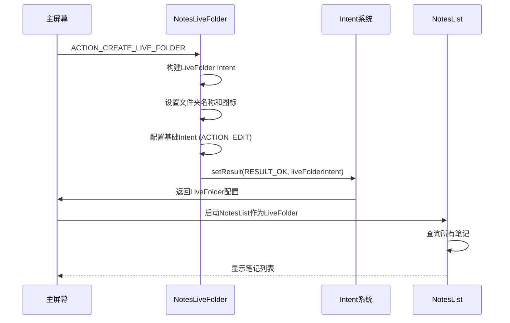

# 组件交互关系

<cite>
**本文档中引用的文件**
- [NotePad.java](file://app/src/main/java/com/example/android/notepad/NotePad.java)
- [NotesList.java](file://app/src/main/java/com/example/android/notepad/NotesList.java)
- [NoteEditor.java](file://app/src/main/java/com/example/android/notepad/NoteEditor.java)
- [NotePadProvider.java](file://app/src/main/java/com/example/android/notepad/NotePadProvider.java)
- [TitleEditor.java](file://app/src/main/java/com/example/android/notepad/TitleEditor.java)
- [NotesLiveFolder.java](file://app/src/main/java/com/example/android/notepad/NotesLiveFolder.java)
- [AndroidManifest.xml](file://app/src/main/AndroidManifest.xml)
- [note_editor.xml](file://app/src/main/res/layout/note_editor.xml)
- [strings.xml](file://app/src/main/res/values/strings.xml)
</cite>

## 目录
1. [概述](#概述)
2. [项目结构分析](#项目结构分析)
3. [核心组件架构](#核心组件架构)
4. [URI常量和MIME类型系统](#uri常量和mime类型系统)
5. [AndroidManifest配置分析](#androidmanifest配置分析)
6. [组件交互流程详解](#组件交互流程详解)
7. [数据持久化机制](#数据持久化机制)
8. [时序图分析](#时序图分析)
9. [总结](#总结)

## 概述

NotePad应用是一个典型的Android内容提供者(Content Provider)应用程序，展示了如何通过统一的数据接口实现组件间的通信。该应用的核心是基于契约类(Contract Class)设计模式，通过URI常量和MIME类型定义建立标准化的数据访问协议，确保各个组件能够高效、安全地进行数据交换。

## 项目结构分析

NotePad应用采用标准的Android项目结构，主要包含以下核心模块：



**图表来源**
- [NotesList.java](file://app/src/main/java/com/example/android/notepad/NotesList.java#L1-L50)
- [NoteEditor.java](file://app/src/main/java/com/example/android/notepad/NoteEditor.java#L1-L50)
- [NotePadProvider.java](file://app/src/main/java/com/example/android/notepad/NotePadProvider.java#L1-L50)

**章节来源**
- [AndroidManifest.xml](file://app/src/main/AndroidManifest.xml#L1-L119)
- [NotePad.java](file://app/src/main/java/com/example/android/notepad/NotePad.java#L1-L155)

## 核心组件架构

### 契约类设计模式

NotePad应用采用契约类设计模式，通过`NotePad`类定义统一的数据访问接口：



**图表来源**
- [NotePad.java](file://app/src/main/java/com/example/android/notepad/NotePad.java#L28-L155)

### 组件职责分工

| 组件 | 职责 | 主要功能 |
|------|------|----------|
| NotesList | 列表管理 | 显示笔记列表、处理用户选择、提供上下文菜单 |
| NoteEditor | 编辑控制 | 处理笔记的增删改查、状态管理、UI更新 |
| NotePadProvider | 数据提供 | 管理SQLite数据库、提供CRUD操作接口 |
| TitleEditor | 标题编辑 | 单独编辑笔记标题、轻量级编辑界面 |
| NotesLiveFolder | 实时文件夹 | 创建动态文件夹、提供快捷访问 |

**章节来源**
- [NotesList.java](file://app/src/main/java/com/example/android/notepad/NotesList.java#L47-L550)
- [NoteEditor.java](file://app/src/main/java/com/example/android/notepad/NoteEditor.java#L44-L616)
- [NotePadProvider.java](file://app/src/main/java/com/example/android/notepad/NotePadProvider.java#L54-L753)

## URI常量和MIME类型系统

### URI层次结构

NotePad应用定义了清晰的URI层次结构，支持多种数据访问模式：

```mermaid
graph TD
A[content://com.google.provider.NotePad] --> B[/notes - 笔记集合]
A --> C[/notes/{id} - 单个笔记]
A --> D[/live_folders/notes - 实时文件夹]
B --> E[CONTENT_URI<br/>用于查询所有笔记]
C --> F[CONTENT_ID_URI_BASE<br/>用于单个笔记操作]
C --> G[CONTENT_ID_URI_PATTERN<br/>用于Intent匹配]
D --> H[LIVE_FOLDER_URI<br/>用于实时文件夹]
```

**图表来源**
- [NotePad.java](file://app/src/main/java/com/example/android/notepad/NotePad.java#L51-L98)

### MIME类型定义

| MIME类型 | 用途 | 对应URI模式 |
|----------|------|-------------|
| `vnd.android.cursor.dir/vnd.google.note` | 笔记集合目录 | `/notes` |
| `vnd.android.cursor.item/vnd.google.note` | 单个笔记项 | `/notes/{id}` |

### URI匹配机制

Content Provider使用UriMatcher进行URI模式匹配：

```mermaid
flowchart TD
A[接收URI请求] --> B{UriMatcher.match()}
B --> |NOTES| C[处理笔记集合查询]
B --> |NOTE_ID| D[处理单个笔记查询]
B --> |LIVE_FOLDER_NOTES| E[处理实时文件夹查询]
B --> |其他| F[抛出IllegalArgumentException]
C --> G[返回笔记列表游标]
D --> H[返回指定ID笔记]
E --> I[返回实时文件夹数据]
```

**图表来源**
- [NotePadProvider.java](file://app/src/main/java/com/example/android/notepad/NotePadProvider.java#L93-L131)

**章节来源**
- [NotePad.java](file://app/src/main/java/com/example/android/notepad/NotePad.java#L51-L120)
- [NotePadProvider.java](file://app/src/main/java/com/example/android/notepad/NotePadProvider.java#L119-L132)

## AndroidManifest配置分析

### Activity声明和Intent过滤器

AndroidManifest.xml中定义了四个主要Activity及其Intent过滤器：



**图表来源**
- [AndroidManifest.xml](file://app/src/main/AndroidManifest.xml#L34-L114)

### Content Provider配置

```xml
<provider android:name="NotePadProvider"
    android:authorities="com.google.provider.NotePad"
    android:exported="true">
    <grant-uri-permission android:pathPattern=".*" />
</provider>
```

### 权限和URI授权

- **权限级别**: `android:exported="true"` 允许其他应用访问
- **URI权限**: 使用正则表达式`.*`授予所有路径的访问权限
- **安全考虑**: 通过MIME类型和Intent过滤器限制访问范围

**章节来源**
- [AndroidManifest.xml](file://app/src/main/AndroidManifest.xml#L28-L32)

## 组件交互流程详解

### 用户点击列表项到编辑界面的完整调用链路

当用户在NotesList中点击某个笔记项时，会触发以下完整的组件交互流程：



**图表来源**
- [NotesList.java](file://app/src/main/java/com/example/android/notepad/NotesList.java#L528-L549)
- [NoteEditor.java](file://app/src/main/java/com/example/android/notepad/NoteEditor.java#L140-L200)
- [NotePadProvider.java](file://app/src/main/java/com/example/android/notepad/NotePadProvider.java#L251-L322)

### 新建笔记的完整流程



**图表来源**
- [NotesList.java](file://app/src/main/java/com/example/android/notepad/NotesList.java#L351-L370)
- [NoteEditor.java](file://app/src/main/java/com/example/android/notepad/NoteEditor.java#L164-L190)
- [NotePadProvider.java](file://app/src/main/java/com/example/android/notepad/NotePadProvider.java#L498-L567)

### 上下文菜单操作流程



**图表来源**
- [NotesList.java](file://app/src/main/java/com/example/android/notepad/NotesList.java#L373-L516)

**章节来源**
- [NotesList.java](file://app/src/main/java/com/example/android/notepad/NotesList.java#L528-L549)
- [NoteEditor.java](file://app/src/main/java/com/example/android/notepad/NoteEditor.java#L140-L200)

## 数据持久化机制

### ContentResolver接口抽象

NotePad应用通过ContentResolver提供统一的数据访问接口：



**图表来源**
- [NotePadProvider.java](file://app/src/main/java/com/example/android/notepad/NotePadProvider.java#L251-L738)

### 数据库操作模式

| 操作类型 | 方法签名 | 功能描述 |
|----------|----------|----------|
| 查询 | `query(Uri, String[], String, String[], String)` | 查询笔记数据，支持条件过滤和排序 |
| 插入 | `insert(Uri, ContentValues)` | 创建新笔记，自动生成时间戳 |
| 更新 | `update(Uri, ContentValues, String, String[])` | 修改现有笔记内容和属性 |
| 删除 | `delete(Uri, String, String[])` | 删除指定笔记或符合条件的笔记集 |

### 数据一致性保证



**图表来源**
- [NotePadProvider.java](file://app/src/main/java/com/example/android/notepad/NotePadProvider.java#L498-L738)

**章节来源**
- [NotePadProvider.java](file://app/src/main/java/com/example/android/notepad/NotePadProvider.java#L251-L738)

## 时序图分析

### 完整的笔记编辑生命周期

```mermaid
sequenceDiagram
participant UI as 用户界面
participant NL as NotesList
participant NE as NoteEditor
participant CR as ContentResolver
participant NPP as NotePadProvider
participant DB as 数据库
NoteOver UI,NE : 用户创建新笔记
UI->>NL : 点击新建按钮
NL->>NE : ACTION_INSERT Intent
NE->>CR : insert(CONTENT_URI, null)
CR->>NPP : insert(CONTENT_URI, null)
NPP->>DB : INSERT INTO notes VALUES(...)
DB-->>NPP : 返回新ID
NPP-->>CR : 返回新URI
CR-->>NE : 返回新URI
NE->>NE : 设置为编辑状态
NE-->>UI : 显示空编辑界面
NoteOver UI,NE : 用户编辑笔记
UI->>NE : 输入笔记内容
NE->>NE : onPause()自动保存
NE->>CR : update(uri, values)
CR->>NPP : update(uri, values, ...)
NPP->>DB : UPDATE notes SET ... WHERE _id=?
DB-->>NPP : 返回更新行数
NPP-->>CR : 返回更新结果
CR-->>NE : 保存完成
NE-->>UI : 显示保存状态
NoteOver UI,NE : 用户删除笔记
UI->>NL : 长按笔记选择删除
NL->>CR : delete(uri)
CR->>NPP : delete(uri, ...)
NPP->>DB : DELETE FROM notes WHERE _id=?
DB-->>NPP : 返回删除行数
NPP-->>CR : 返回删除结果
CR-->>NL : 删除完成
NL-->>UI : 更新列表显示
```

**图表来源**
- [NotesList.java](file://app/src/main/java/com/example/android/notepad/NotesList.java#L528-L549)
- [NoteEditor.java](file://app/src/main/java/com/example/android/notepad/NoteEditor.java#L140-L200)
- [NotePadProvider.java](file://app/src/main/java/com/example/android/notepad/NotePadProvider.java#L498-L738)

### 实时文件夹创建流程



**图表来源**
- [NotesLiveFolder.java](file://app/src/main/java/com/example/android/notepad/NotesLiveFolder.java#L43-L113)

## 总结

NotePad应用通过精心设计的组件交互关系，展示了一个完整的Android内容提供者应用架构。其核心特点包括：

### 设计优势

1. **统一的数据接口**: 通过契约类和URI常量定义标准化的数据访问协议
2. **灵活的组件解耦**: 各组件通过Intent和ContentResolver进行松耦合通信
3. **丰富的交互模式**: 支持列表浏览、编辑、上下文操作等多种用户交互方式
4. **完善的数据持久化**: 基于SQLite的可靠数据存储和事务处理

### 技术亮点

- **URI匹配机制**: 通过UriMatcher实现精确的路由分发
- **MIME类型系统**: 提供类型安全的数据访问控制
- **观察者模式**: 自动化的数据变更通知机制
- **异步操作支持**: 为复杂场景预留扩展空间

### 应用价值

该应用为Android开发者提供了内容提供者模式的最佳实践范例，展示了如何构建可扩展、可维护的Android应用程序架构。通过深入理解这些组件交互关系，开发者可以更好地设计自己的Android应用，实现高效的数据管理和用户交互。