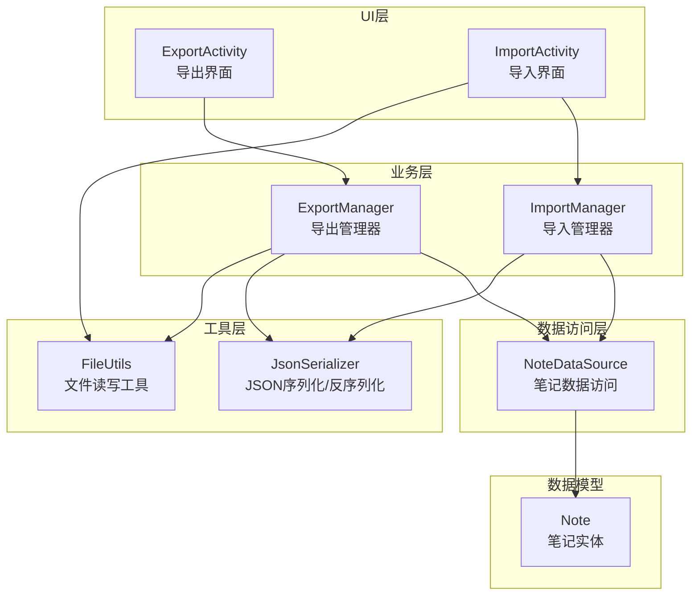
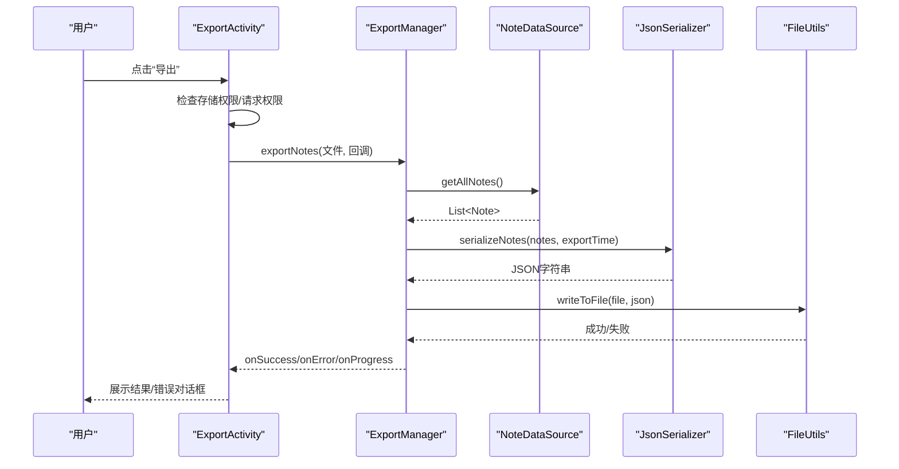
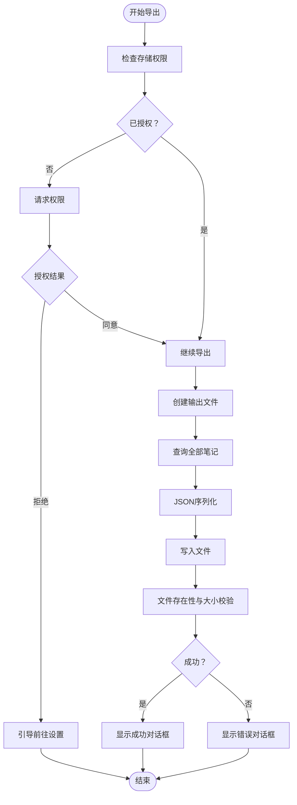
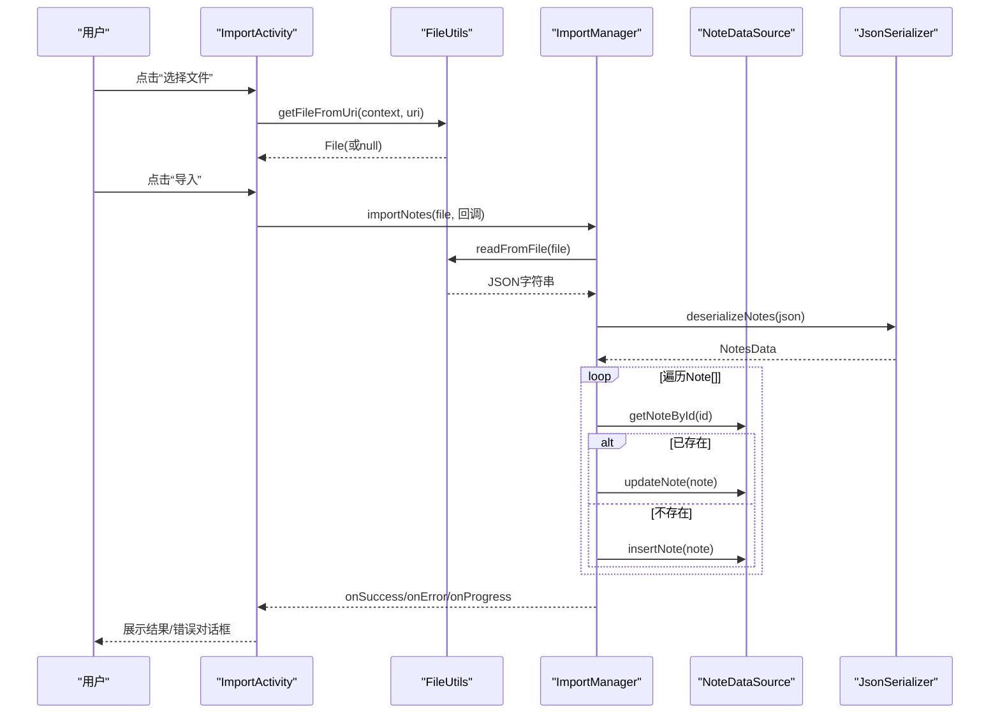
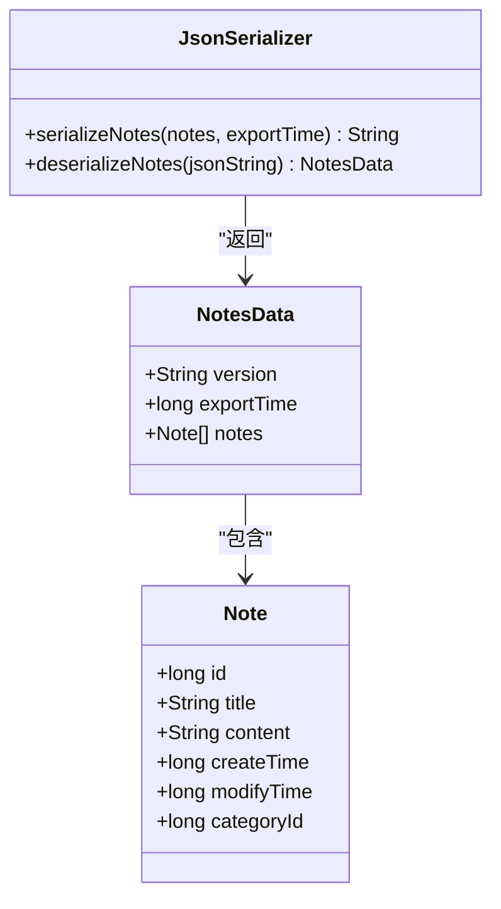
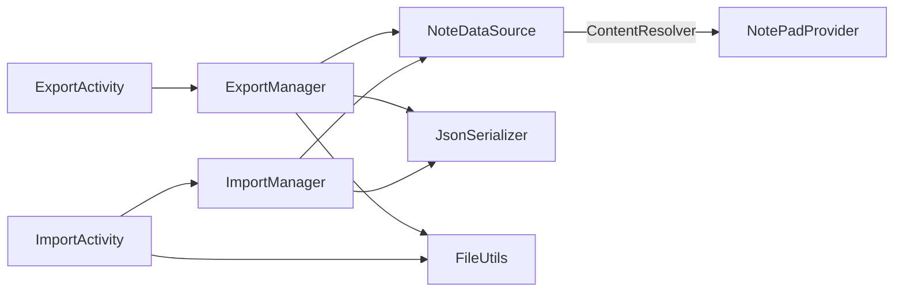

# 导入导出系统

<cite>
**本文引用的文件**
- [ExportActivity.java](file://app/src/main/java/com/example/android/notepad/ExportActivity.java)
- [ExportManager.java](file://app/src/main/java/com/example/android/notepad/ExportManager.java)
- [ImportActivity.java](file://app/src/main/java/com/example/android/notepad/ImportActivity.java)
- [ImportManager.java](file://app/src/main/java/com/example/android/notepad/ImportManager.java)
- [FileUtils.java](file://app/src/main/java/com/example/android/notepad/FileUtils.java)
- [JsonSerializer.java](file://app/src/main/java/com/example/android/notepad/JsonSerializer.java)
- [NoteDataSource.java](file://app/src/main/java/com/example/android/notepad/NoteDataSource.java)
- [Note.java](file://app/src/main/java/com/example/android/notepad/Note.java)
- [activity_export.xml](file://app/src/main/res/layout/activity_export.xml)
- [activity_import.xml](file://app/src/main/res/layout/activity_import.xml)
- [README.md](file://README.md)
</cite>

## 目录
1. [简介](#简介)
2. [项目结构](#项目结构)
3. [核心组件](#核心组件)
4. [架构总览](#架构总览)
5. [详细组件分析](#详细组件分析)
6. [依赖关系分析](#依赖关系分析)
7. [性能考量](#性能考量)
8. [故障排查指南](#故障排查指南)
9. [结论](#结论)
10. [附录](#附录)

## 简介
本文件聚焦于NotePad应用的“导入导出系统”，系统采用JSON作为跨设备/跨进程的数据交换格式，结合Android平台的ContentResolver与文件I/O能力，实现笔记数据的备份与恢复。系统分为两大部分：
- 导出流程：由ExportActivity触发，ExportManager负责异步导出全部笔记至外部存储的JSON文件。
- 导入流程：由ImportActivity触发，ImportManager负责从文件读取JSON并回写到应用数据库。

系统在API 23兼容性上做了专门适配，包括运行时存储权限检查、环境路径获取与文件写入校验等，确保在较老版本Android设备上的稳定运行。

## 项目结构
导入导出系统涉及的代码与资源主要分布在以下位置：
- UI层：ExportActivity、ImportActivity及其布局文件
- 业务层：ExportManager、ImportManager
- 工具层：FileUtils、JsonSerializer
- 数据访问层：NoteDataSource
- 数据模型：Note

图表来源
- [ExportActivity.java](file://app/src/main/java/com/example/android/notepad/ExportActivity.java#L1-L369)
- [ExportManager.java](file://app/src/main/java/com/example/android/notepad/ExportManager.java#L1-L258)
- [ImportActivity.java](file://app/src/main/java/com/example/android/notepad/ImportActivity.java#L1-L247)
- [ImportManager.java](file://app/src/main/java/com/example/android/notepad/ImportManager.java#L1-L194)
- [FileUtils.java](file://app/src/main/java/com/example/android/notepad/FileUtils.java#L1-L342)
- [JsonSerializer.java](file://app/src/main/java/com/example/android/notepad/JsonSerializer.java#L1-L121)
- [NoteDataSource.java](file://app/src/main/java/com/example/android/notepad/NoteDataSource.java#L1-L209)
- [Note.java](file://app/src/main/java/com/example/android/notepad/Note.java#L1-L137)

章节来源
- [README.md](file://README.md#L1-L97)

## 核心组件
- ExportActivity：负责导出界面交互、权限申请与进度反馈，并委托ExportManager执行导出。
- ExportManager：异步导出全部笔记，序列化为JSON并写入文件，包含严格的文件存在性与完整性校验。
- ImportActivity：负责导入界面交互、文件选择与进度反馈，并委托ImportManager执行导入。
- ImportManager：异步从文件读取JSON，反序列化为Note数组，按ID存在性决定更新或插入。
- FileUtils：提供文件读写、Uri到文件转换、外部存储目录获取等通用能力。
- JsonSerializer：定义JSON结构与序列化/反序列化逻辑，包含版本字段与导出时间戳。
- NoteDataSource：封装ContentResolver对NotePadProvider的CRUD操作。
- Note：笔记实体模型，包含标题、内容、创建/修改时间、分类ID等字段。

章节来源
- [ExportActivity.java](file://app/src/main/java/com/example/android/notepad/ExportActivity.java#L1-L369)
- [ExportManager.java](file://app/src/main/java/com/example/android/notepad/ExportManager.java#L1-L258)
- [ImportActivity.java](file://app/src/main/java/com/example/android/notepad/ImportActivity.java#L1-L247)
- [ImportManager.java](file://app/src/main/java/com/example/android/notepad/ImportManager.java#L1-L194)
- [FileUtils.java](file://app/src/main/java/com/example/android/notepad/FileUtils.java#L1-L342)
- [JsonSerializer.java](file://app/src/main/java/com/example/android/notepad/JsonSerializer.java#L1-L121)
- [NoteDataSource.java](file://app/src/main/java/com/example/android/notepad/NoteDataSource.java#L1-L209)
- [Note.java](file://app/src/main/java/com/example/android/notepad/Note.java#L1-L137)

## 架构总览
导入导出系统遵循“UI-业务-工具-数据”的分层架构，UI层只负责交互与回调，业务层负责异步任务与进度回调，工具层提供文件与序列化能力，数据访问层负责与ContentProvider交互。

图表来源
- [ExportActivity.java](file://app/src/main/java/com/example/android/notepad/ExportActivity.java#L1-L369)
- [ExportManager.java](file://app/src/main/java/com/example/android/notepad/ExportManager.java#L1-L258)
- [NoteDataSource.java](file://app/src/main/java/com/example/android/notepad/NoteDataSource.java#L1-L209)
- [JsonSerializer.java](file://app/src/main/java/com/example/android/notepad/JsonSerializer.java#L1-L121)
- [FileUtils.java](file://app/src/main/java/com/example/android/notepad/FileUtils.java#L1-L342)

## 详细组件分析

### 导出流程（ExportActivity → ExportManager）
- 权限与入口
  - UI层在点击导出时检查存储权限；若无权限则请求运行时权限，并在授权后继续执行。
  - 若权限被拒绝，引导用户前往设置页面手动授权。
- 导出执行
  - 生成输出文件（默认位于公共下载目录），确保父目录存在且可写。
  - 异步导出：查询全部笔记、序列化为JSON、写入文件、二次校验文件存在性与大小。
  - 进度回调：阶段性更新UI进度条；完成后弹出成功对话框并返回主页面。
- 错误处理
  - 统一捕获异常并转为错误对话框，附带常见问题排查建议（权限、存储可用性、空间等）。

图表来源
- [ExportActivity.java](file://app/src/main/java/com/example/android/notepad/ExportActivity.java#L1-L369)
- [ExportManager.java](file://app/src/main/java/com/example/android/notepad/ExportManager.java#L1-L258)
- [FileUtils.java](file://app/src/main/java/com/example/android/notepad/FileUtils.java#L1-L342)

章节来源
- [ExportActivity.java](file://app/src/main/java/com/example/android/notepad/ExportActivity.java#L1-L369)
- [ExportManager.java](file://app/src/main/java/com/example/android/notepad/ExportManager.java#L1-L258)

### 导入流程（ImportActivity → ImportManager）
- 文件选择
  - 通过系统文件选择器选择任意类型文件；内部通过FileUtils将Uri转换为可读文件（优先直接路径，否则复制到缓存目录）。
- 导入执行
  - 异步导入：读取文件内容、反序列化为Note数组、逐条判断是否存在同ID笔记，存在则更新，不存在则插入并重置创建/修改时间为当前时间。
  - 进度回调：分阶段更新UI进度条；完成后弹出成功对话框并返回主页面。
- 错误处理
  - 统一捕获JSON解析与IO异常并提示错误信息。

图表来源
- [ImportActivity.java](file://app/src/main/java/com/example/android/notepad/ImportActivity.java#L1-L247)
- [ImportManager.java](file://app/src/main/java/com/example/android/notepad/ImportManager.java#L1-L194)
- [FileUtils.java](file://app/src/main/java/com/example/android/notepad/FileUtils.java#L1-L342)
- [JsonSerializer.java](file://app/src/main/java/com/example/android/notepad/JsonSerializer.java#L1-L121)
- [NoteDataSource.java](file://app/src/main/java/com/example/android/notepad/NoteDataSource.java#L1-L209)

章节来源
- [ImportActivity.java](file://app/src/main/java/com/example/android/notepad/ImportActivity.java#L1-L247)
- [ImportManager.java](file://app/src/main/java/com/example/android/notepad/ImportManager.java#L1-L194)

### 数据模型与序列化
- JSON结构
  - 包含版本号、导出时间戳与笔记数组；每个笔记包含ID、标题、内容、创建时间、修改时间。
- 版本控制
  - 通过版本字段便于未来升级时的兼容处理。
- Note实体
  - 提供标准的getter/setter与哈希/相等比较，保证数据一致性。

图表来源
- [Note.java](file://app/src/main/java/com/example/android/notepad/Note.java#L1-L137)
- [JsonSerializer.java](file://app/src/main/java/com/example/android/notepad/JsonSerializer.java#L1-L121)

章节来源
- [JsonSerializer.java](file://app/src/main/java/com/example/android/notepad/JsonSerializer.java#L1-L121)
- [Note.java](file://app/src/main/java/com/example/android/notepad/Note.java#L1-L137)

### 文件工具与权限适配
- 文件读写
  - 写入时确保父目录存在、可写；写入后进行存在性与大小校验；异常时清理空文件或残留文件。
  - 读取采用缓冲流逐行读取，资源在finally中关闭。
- Uri到文件
  - 优先尝试从Uri获取真实路径；若不可用则复制到应用缓存目录生成临时文件，再进行读取。
- 权限适配
  - 仅在API 23及以上请求运行时存储权限；低版本默认视为已授权；权限被拒时引导用户前往设置。

章节来源
- [FileUtils.java](file://app/src/main/java/com/example/android/notepad/FileUtils.java#L1-L342)
- [ExportActivity.java](file://app/src/main/java/com/example/android/notepad/ExportActivity.java#L1-L369)
- [ImportActivity.java](file://app/src/main/java/com/example/android/notepad/ImportActivity.java#L1-L247)

## 依赖关系分析
- UI层依赖业务层：ExportActivity/ImportActivity通过回调与业务层解耦。
- 业务层依赖工具层与数据访问层：ExportManager/ImportManager分别依赖FileUtils与JsonSerializer，以及NoteDataSource。
- 数据访问层依赖ContentResolver：NoteDataSource通过ContentResolver与NotePadProvider交互。
- 资源层：activity_export.xml与activity_import.xml提供UI布局。

图表来源
- [ExportActivity.java](file://app/src/main/java/com/example/android/notepad/ExportActivity.java#L1-L369)
- [ExportManager.java](file://app/src/main/java/com/example/android/notepad/ExportManager.java#L1-L258)
- [ImportActivity.java](file://app/src/main/java/com/example/android/notepad/ImportActivity.java#L1-L247)
- [ImportManager.java](file://app/src/main/java/com/example/android/notepad/ImportManager.java#L1-L194)
- [NoteDataSource.java](file://app/src/main/java/com/example/android/notepad/NoteDataSource.java#L1-L209)

章节来源
- [ExportActivity.java](file://app/src/main/java/com/example/android/notepad/ExportActivity.java#L1-L369)
- [ExportManager.java](file://app/src/main/java/com/example/android/notepad/ExportManager.java#L1-L258)
- [ImportActivity.java](file://app/src/main/java/com/example/android/notepad/ImportActivity.java#L1-L247)
- [ImportManager.java](file://app/src/main/java/com/example/android/notepad/ImportManager.java#L1-L194)
- [NoteDataSource.java](file://app/src/main/java/com/example/android/notepad/NoteDataSource.java#L1-L209)

## 性能考量
- 异步执行：导出与导入均使用AsyncTask异步执行，避免阻塞主线程。
- 进度反馈：阶段性publishProgress，UI侧实时更新，改善用户体验。
- I/O优化：写入采用UTF-8编码与flush/sync，减少数据丢失风险；读取采用缓冲流，降低频繁系统调用开销。
- 数据量控制：导出时一次性查询全部笔记，建议在笔记数量较大时考虑分批导出策略（当前实现为一次性导出）。
- 文件校验：写入后进行存在性与大小校验，防止空文件或不完整文件影响后续导入。

## 故障排查指南
- 导出失败
  - 权限问题：确认已授予存储权限；若被拒，点击“去设置”跳转授权。
  - 存储不可用：检查外部存储是否可用、SD卡是否挂载、剩余空间是否充足。
  - 数据为空：确认数据库中是否存在笔记数据。
- 导入失败
  - 文件不可读：确认所选文件可访问；若为content Uri，系统会尝试复制到缓存目录，但仍需确保文件内容为合法JSON。
  - JSON格式错误：检查备份文件是否为系统导出的JSON格式。
- UI交互
  - 导出/导入过程中的进度对话框会在后台任务结束后自动消失；如异常退出，onDestroy中会主动释放资源。

章节来源
- [ExportActivity.java](file://app/src/main/java/com/example/android/notepad/ExportActivity.java#L1-L369)
- [ImportActivity.java](file://app/src/main/java/com/example/android/notepad/ImportActivity.java#L1-L247)
- [ExportManager.java](file://app/src/main/java/com/example/android/notepad/ExportManager.java#L1-L258)
- [ImportManager.java](file://app/src/main/java/com/example/android/notepad/ImportManager.java#L1-L194)

## 结论
导入导出系统以JSON为载体，结合AsyncTask与ContentResolver，实现了在API 23兼容性下的稳定备份与恢复能力。系统通过严格的文件校验与错误提示，提升了用户在不同设备与存储环境下的成功率。未来可在大数据量场景下引入分批导出、增量备份等优化策略，进一步提升性能与可靠性。

## 附录
- 布局文件
  - 导出界面布局：包含文件名输入与导出按钮。
  - 导入界面布局：包含文件选择区域、选择文件按钮与导入按钮。

章节来源
- [activity_export.xml](file://app/src/main/res/layout/activity_export.xml#L1-L54)
- [activity_import.xml](file://app/src/main/res/layout/activity_import.xml#L1-L64)