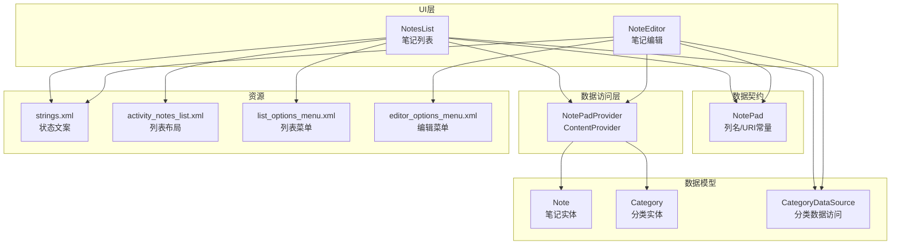
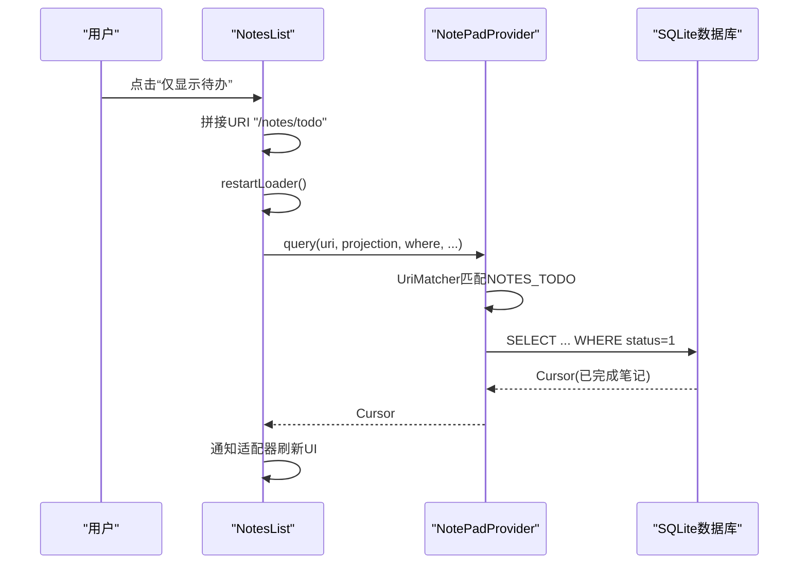
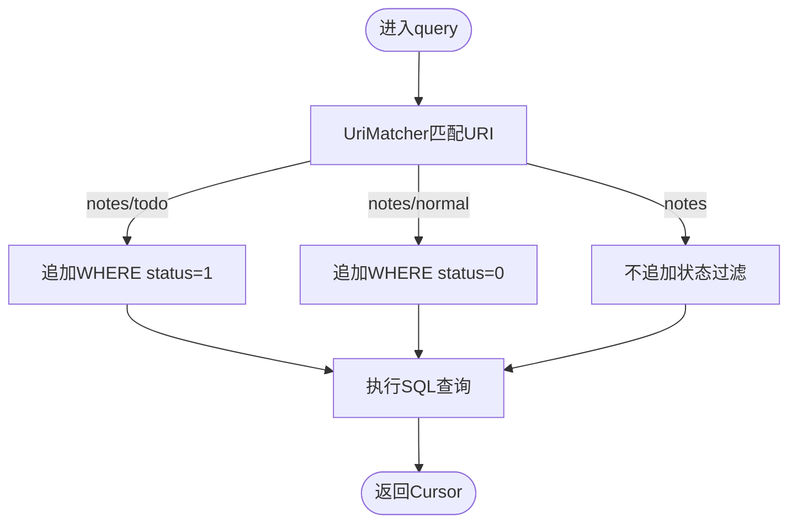
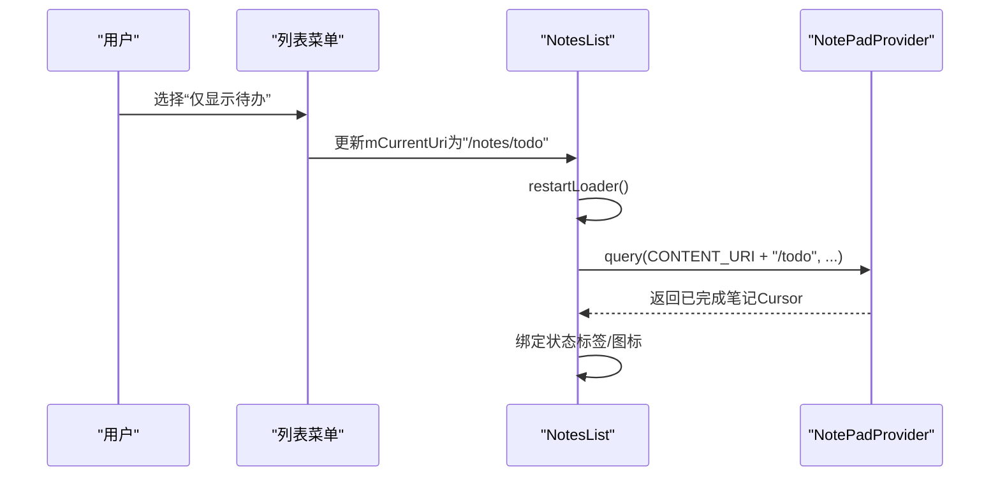
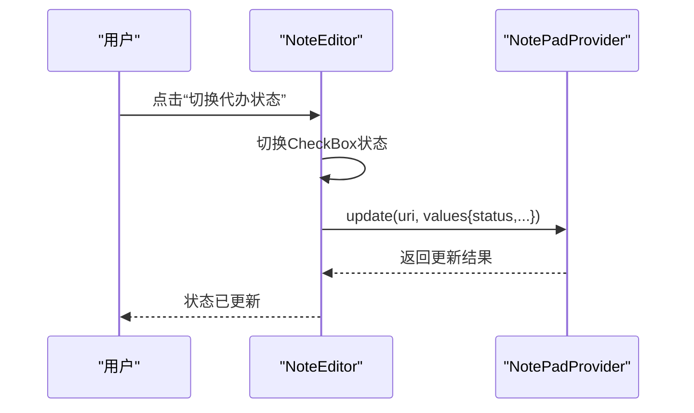
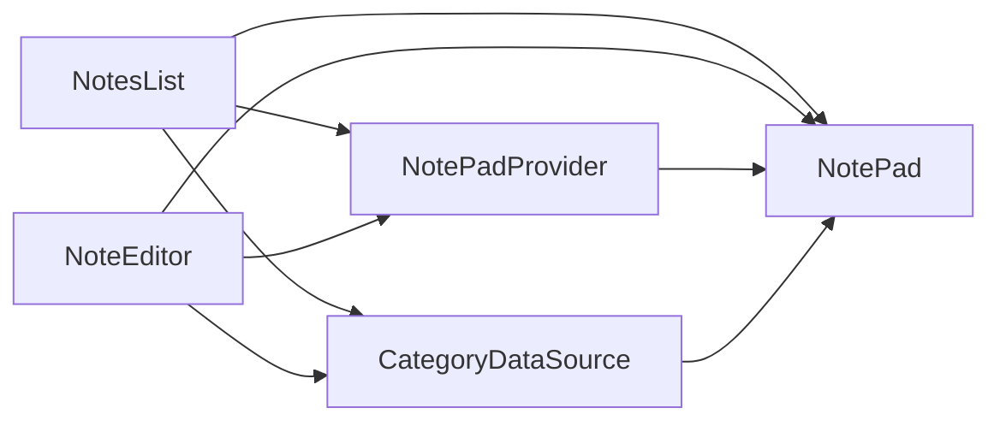

# 待办事项功能

<cite>
**本文引用的文件**
- [NotePad.java](file://app/src/main/java/com/example/android/notepad/NotePad.java)
- [NotePadProvider.java](file://app/src/main/java/com/example/android/notepad/NotePadProvider.java)
- [NotesList.java](file://app/src/main/java/com/example/android/notepad/NotesList.java)
- [NoteEditor.java](file://app/src/main/java/com/example/android/notepad/NoteEditor.java)
- [Note.java](file://app/src/main/java/com/example/android/notepad/Note.java)
- [Category.java](file://app/src/main/java/com/example/android/notepad/Category.java)
- [CategoryDataSource.java](file://app/src/main/java/com/example/android/notepad/CategoryDataSource.java)
- [strings.xml](file://app/src/main/res/values/strings.xml)
- [activity_notes_list.xml](file://app/src/main/res/layout/activity_notes_list.xml)
- [list_options_menu.xml](file://app/src/main/res/menu/list_options_menu.xml)
- [editor_options_menu.xml](file://app/src/main/res/menu/editor_options_menu.xml)
- [README.md](file://README.md)
</cite>

## 目录
1. [简介](#简介)
2. [项目结构](#项目结构)
3. [核心组件](#核心组件)
4. [架构总览](#架构总览)
5. [详细组件分析](#详细组件分析)
6. [依赖关系分析](#依赖关系分析)
7. [性能考量](#性能考量)
8. [故障排查指南](#故障排查指南)
9. [结论](#结论)

## 简介
本文件聚焦于“待办事项”功能的设计与实现，涵盖从数据模型、内容提供者、UI交互到筛选与状态切换的完整链路。项目基于Android官方示例扩展而来，新增了笔记状态字段与相关UI呈现，并通过内容提供者的URI模式支持“仅显示待办/普通笔记”的筛选能力。

## 项目结构
- 应用采用传统Activity架构，数据访问通过ContentProvider与SQLite实现。
- 待办事项相关的关键文件：
  - 数据契约与列定义：NotePad.java
  - 数据访问与URI匹配：NotePadProvider.java
  - 列表展示与筛选：NotesList.java
  - 编辑与状态切换：NoteEditor.java
  - 数据模型：Note.java、Category.java、CategoryDataSource.java
  - UI资源：strings.xml、activity_notes_list.xml、list_options_menu.xml、editor_options_menu.xml

图表来源
- [NotePad.java](file://app/src/main/java/com/example/android/notepad/NotePad.java#L1-L280)
- [NotePadProvider.java](file://app/src/main/java/com/example/android/notepad/NotePadProvider.java#L1-L200)
- [NotesList.java](file://app/src/main/java/com/example/android/notepad/NotesList.java#L1-L200)
- [NoteEditor.java](file://app/src/main/java/com/example/android/notepad/NoteEditor.java#L1-L120)
- [Note.java](file://app/src/main/java/com/example/android/notepad/Note.java#L1-L137)
- [Category.java](file://app/src/main/java/com/example/android/notepad/Category.java#L1-L102)
- [CategoryDataSource.java](file://app/src/main/java/com/example/android/notepad/CategoryDataSource.java#L1-L196)
- [strings.xml](file://app/src/main/res/values/strings.xml#L1-L56)
- [activity_notes_list.xml](file://app/src/main/res/layout/activity_notes_list.xml#L1-L32)
- [list_options_menu.xml](file://app/src/main/res/menu/list_options_menu.xml#L1-L58)
- [editor_options_menu.xml](file://app/src/main/res/menu/editor_options_menu.xml#L1-L17)

章节来源
- [README.md](file://README.md#L1-L97)

## 核心组件
- 数据契约与列定义
  - 在NotePad中定义了笔记表的列名、默认排序、状态枚举值以及URI常量；其中包含状态列与分类ID列，为待办状态与分类关联提供基础。
- 内容提供者
  - NotePadProvider通过UriMatcher识别“notes/todo”和“notes/normal”两类URI模式，分别返回已完成与待办笔记；同时在查询时根据状态过滤。
- 列表与筛选
  - NotesList在菜单中提供“仅显示待办/普通笔记”，点击后拼接对应URI并重启Loader，从而触发Provider按状态过滤。
- 编辑与状态切换
  - NoteEditor提供“切换代办状态”菜单项，结合CheckBox实时更新状态并在保存时写入Provider。
- 数据模型与分类
  - Note与Category分别承载笔记与分类的数据结构；CategoryDataSource提供分类的CRUD与计数查询，支撑UI中的分类筛选与标签显示。

章节来源
- [NotePad.java](file://app/src/main/java/com/example/android/notepad/NotePad.java#L120-L175)
- [NotePadProvider.java](file://app/src/main/java/com/example/android/notepad/NotePadProvider.java#L130-L170)
- [NotesList.java](file://app/src/main/java/com/example/android/notepad/NotesList.java#L560-L573)
- [NoteEditor.java](file://app/src/main/java/com/example/android/notepad/NoteEditor.java#L570-L586)
- [Note.java](file://app/src/main/java/com/example/android/notepad/Note.java#L1-L137)
- [Category.java](file://app/src/main/java/com/example/android/notepad/Category.java#L1-L102)
- [CategoryDataSource.java](file://app/src/main/java/com/example/android/notepad/CategoryDataSource.java#L93-L196)

## 架构总览
待办事项功能遵循“UI -> 内容提供者 -> 数据库”的经典Android架构，状态字段与URI模式共同实现“按状态筛选”。

图表来源
- [NotesList.java](file://app/src/main/java/com/example/android/notepad/NotesList.java#L560-L573)
- [NotePadProvider.java](file://app/src/main/java/com/example/android/notepad/NotePadProvider.java#L360-L377)
- [NotePad.java](file://app/src/main/java/com/example/android/notepad/NotePad.java#L120-L175)

## 详细组件分析

### 数据契约与状态枚举
- 列定义
  - 包含标题、内容、创建时间、修改时间、状态、分类ID等列名常量。
- 状态枚举
  - 定义了待办与完成两种状态值，供UI与Provider使用。
- URI常量
  - 提供通用notes URI、带ID的URI、LiveFolder URI以及“/notes/todo”、“/notes/normal”等扩展路径。

章节来源
- [NotePad.java](file://app/src/main/java/com/example/android/notepad/NotePad.java#L120-L175)

### 内容提供者与URI匹配
- UriMatcher
  - 注册“notes/todo”和“notes/normal”两类模式，分别映射到NOTES_TODO与NOTES_NORMAL常量。
- query方法
  - 当匹配到NOTES_TODO时，追加WHERE条件“status=1”；匹配NOTES_NORMAL时，追加“status=0”。
- 插入默认值
  - 插入笔记时若未显式提供状态，默认设置为待办（0）。

图表来源
- [NotePadProvider.java](file://app/src/main/java/com/example/notepad/NotePadProvider.java#L130-L170)
- [NotePadProvider.java](file://app/src/main/java/com/example/android/notepad/NotePadProvider.java#L360-L377)
- [NotePadProvider.java](file://app/src/main/java/com/example/android/notepad/NotePadProvider.java#L638-L671)

章节来源
- [NotePadProvider.java](file://app/src/main/java/com/example/android/notepad/NotePadProvider.java#L130-L170)
- [NotePadProvider.java](file://app/src/main/java/com/example/android/notepad/NotePadProvider.java#L360-L377)
- [NotePadProvider.java](file://app/src/main/java/com/example/android/notepad/NotePadProvider.java#L638-L671)

### 列表筛选与状态显示
- 菜单入口
  - 列表菜单提供“仅显示待办/普通笔记”两个入口，点击后更新当前URI并重启Loader。
- UI呈现
  - 列表适配器根据状态列渲染“待办/已完成”标签与图标，并格式化修改时间。
- 分类关联
  - 列表还支持按分类筛选（通过底部抽屉），并与分类缓存配合减少数据库访问。

图表来源
- [NotesList.java](file://app/src/main/java/com/example/android/notepad/NotesList.java#L560-L573)
- [NotesList.java](file://app/src/main/java/com/example/android/notepad/NotesList.java#L134-L190)
- [NotePadProvider.java](file://app/src/main/java/com/example/android/notepad/NotePadProvider.java#L360-L377)

章节来源
- [NotesList.java](file://app/src/main/java/com/example/android/notepad/NotesList.java#L560-L573)
- [NotesList.java](file://app/src/main/java/com/example/android/notepad/NotesList.java#L134-L190)
- [strings.xml](file://app/src/main/res/values/strings.xml#L46-L56)
- [list_options_menu.xml](file://app/src/main/res/menu/list_options_menu.xml#L42-L49)

### 编辑与状态切换
- 状态切换
  - 编辑页提供“切换代办状态”菜单项，点击后切换CheckBox状态并立即保存。
- UI反馈
  - 保存时将状态写入Provider，列表侧通过Loader回调自动刷新。
- 默认状态
  - 新建笔记默认状态为待办（0）。

图表来源
- [NoteEditor.java](file://app/src/main/java/com/example/android/notepad/NoteEditor.java#L570-L586)
- [NoteEditor.java](file://app/src/main/java/com/example/android/notepad/NoteEditor.java#L630-L640)
- [NotePadProvider.java](file://app/src/main/java/com/example/android/notepad/NotePadProvider.java#L638-L671)

章节来源
- [NoteEditor.java](file://app/src/main/java/com/example/android/notepad/NoteEditor.java#L570-L586)
- [NoteEditor.java](file://app/src/main/java/com/example/android/notepad/NoteEditor.java#L630-L640)
- [NotePadProvider.java](file://app/src/main/java/com/example/android/notepad/NotePadProvider.java#L638-L671)

### 上下文菜单与状态切换
- 上下文菜单
  - 列表长按笔记弹出上下文菜单，包含“切换状态”选项。
- 切换逻辑
  - 读取当前状态，取反后写回Provider，Toast提示切换结果，随后重启Loader刷新。

章节来源
- [NotesList.java](file://app/src/main/java/com/example/android/notepad/NotesList.java#L700-L720)

## 依赖关系分析
- NotesList依赖NotePad（列名/URI）、NotePadProvider（查询）、CategoryDataSource（分类缓存与筛选）。
- NoteEditor依赖NotePad（列名/URI）、NotePadProvider（插入/更新）、CategoryDataSource（分类下拉）。
- NotePadProvider依赖NotePad（列名/URI常量）、SQLiteOpenHelper（数据库）。
- CategoryDataSource依赖ContentResolver与NotePad契约常量。

图表来源
- [NotesList.java](file://app/src/main/java/com/example/android/notepad/NotesList.java#L1-L120)
- [NoteEditor.java](file://app/src/main/java/com/example/android/notepad/NoteEditor.java#L1-L120)
- [NotePadProvider.java](file://app/src/main/java/com/example/android/notepad/NotePadProvider.java#L1-L120)
- [CategoryDataSource.java](file://app/src/main/java/com/example/android/notepad/CategoryDataSource.java#L1-L60)
- [NotePad.java](file://app/src/main/java/com/example/android/notepad/NotePad.java#L1-L120)

章节来源
- [NotesList.java](file://app/src/main/java/com/example/android/notepad/NotesList.java#L1-L120)
- [NoteEditor.java](file://app/src/main/java/com/example/android/notepad/NoteEditor.java#L1-L120)
- [NotePadProvider.java](file://app/src/main/java/com/example/android/notepad/NotePadProvider.java#L1-L120)
- [CategoryDataSource.java](file://app/src/main/java/com/example/android/notepad/CategoryDataSource.java#L1-L60)
- [NotePad.java](file://app/src/main/java/com/example/android/notepad/NotePad.java#L1-L120)

## 性能考量
- 异步加载
  - 列表使用LoaderManager异步查询，避免主线程阻塞。
- 缓存策略
  - 列表侧维护分类缓存，减少重复查询；但未见针对笔记状态的缓存，建议在高频筛选场景考虑本地缓存。
- UI绘制
  - 列表项绑定时对日期格式化与状态图标着色，注意避免在主线程做耗时计算。
- 数据库升级
  - Provider在升级时添加状态与分类字段，注意历史数据迁移与兼容性。

[本节为通用指导，无需列出具体文件来源]

## 故障排查指南
- “仅显示待办/普通笔记”无效
  - 检查菜单项是否正确拼接“/todo”或“/normal”路径；确认restartLoader被调用。
  - 参考：[NotesList.java](file://app/src/main/java/com/example/android/notepad/NotesList.java#L560-L573)
- 切换状态无反应
  - 确认上下文菜单或编辑页菜单项已触发状态切换与更新；检查Provider返回的更新行数。
  - 参考：[NotesList.java](file://app/src/main/java/com/example/android/notepad/NotesList.java#L700-L720)，[NoteEditor.java](file://app/src/main/java/com/example/android/notepad/NoteEditor.java#L570-L586)
- 新建笔记状态异常
  - 插入时未显式提供状态则默认为待办；如需其他默认值，请在插入前设置状态。
  - 参考：[NotePadProvider.java](file://app/src/main/java/com/example/android/notepad/NotePadProvider.java#L638-L671)
- 分类筛选不生效
  - 确认底部抽屉中选择了正确的分类ID；检查CategoryDataSource查询与缓存逻辑。
  - 参考：[NotesList.java](file://app/src/main/java/com/example/android/notepad/NotesList.java#L765-L800)，[CategoryDataSource.java](file://app/src/main/java/com/example/android/notepad/CategoryDataSource.java#L93-L196)

章节来源
- [NotesList.java](file://app/src/main/java/com/example/android/notepad/NotesList.java#L560-L573)
- [NotesList.java](file://app/src/main/java/com/example/android/notepad/NotesList.java#L700-L720)
- [NoteEditor.java](file://app/src/main/java/com/example/android/notepad/NoteEditor.java#L570-L586)
- [NotePadProvider.java](file://app/src/main/java/com/example/android/notepad/NotePadProvider.java#L638-L671)
- [CategoryDataSource.java](file://app/src/main/java/com/example/android/notepad/CategoryDataSource.java#L93-L196)

## 结论
待办事项功能通过“状态列 + URI模式 + UI筛选”的组合实现，具备良好的扩展性与一致性。建议后续在高频筛选场景引入本地缓存、优化UI绘制与异步任务调度，以进一步提升性能与用户体验。