# 核心模块

<cite>
**本文档中引用的文件**
- [NotePad.java](file://app/src/main/java/com/example/android/notepad/NotePad.java)
- [NotePadProvider.java](file://app/src/main/java/com/example/android/notepad/NotePadProvider.java)
- [NotesList.java](file://app/src/main/java/com/example/android/notepad/NotesList.java)
- [NoteEditor.java](file://app/src/main/java/com/example/android/notepad/NoteEditor.java)
- [AndroidManifest.xml](file://app/src/main/AndroidManifest.xml)
- [noteslist_item.xml](file://app/src/main/res/layout/noteslist_item.xml)
- [list_options_menu.xml](file://app/src/main/res/menu/list_options_menu.xml)
- [editor_options_menu.xml](file://app/src/main/res/menu/editor_options_menu.xml)
</cite>

## 目录
1. [简介](#简介)
2. [项目结构概览](#项目结构概览)
3. [NotePad契约类详解](#notepad契约类详解)
4. [NotePadProvider内容提供者](#notepadprovider内容提供者)
5. [NotesList主界面](#noteslist主界面)
6. [NoteEditor编辑器](#noteeditor编辑器)
7. [架构关系图](#架构关系图)
8. [总结](#总结)

## 简介

NotePad应用是一个典型的Android内容提供者模式的应用程序，它展示了如何构建一个完整的笔记应用程序。该应用由四个核心Java类组成：NotePad契约类、NotePadProvider内容提供者、NotesList主界面和NoteEditor编辑器。这些组件协同工作，为用户提供了一个功能完整的笔记管理体验。

本文档将深入分析这四个核心模块的设计理念、实现细节和相互关系，帮助开发者理解Android内容提供者模式的最佳实践。

## 项目结构概览

NotePad应用采用标准的Android项目结构，主要包含以下核心组件：

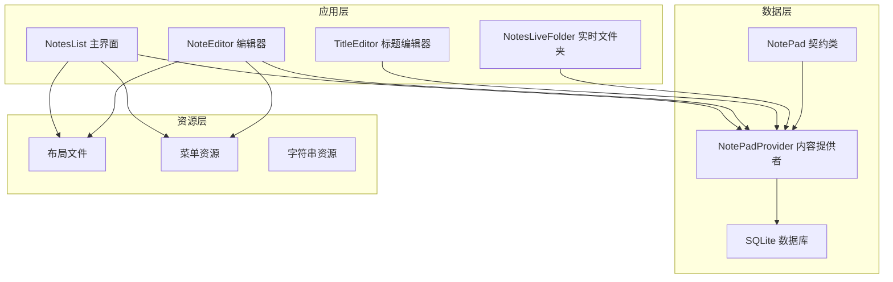

**图表来源**
- [NotesList.java](file://app/src/main/java/com/example/android/notepad/NotesList.java#L1-L50)
- [NoteEditor.java](file://app/src/main/java/com/example/android/notepad/NoteEditor.java#L1-L50)
- [NotePadProvider.java](file://app/src/main/java/com/example/android/notepad/NotePadProvider.java#L1-L50)

## NotePad契约类详解

NotePad契约类是整个应用的数据访问接口，它定义了与数据库交互的所有常量和规范。这个类采用了静态内部类的设计模式，将相关的常量组织在一起。

### 核心设计特点

契约类采用了final修饰符确保不可继承，私有构造函数防止实例化，这种设计符合单例模式的思想但更加严格。通过这种方式，契约类充当了应用与数据库之间的标准化接口。

### URI常量定义

契约类定义了完整的URI体系，支持多种操作场景：

| URI常量 | 描述 | 使用场景 |
|---------|------|----------|
| CONTENT_URI | 笔记列表的基础URI | 查询所有笔记 |
| CONTENT_ID_URI_BASE | 单个笔记的URI基础 | 构建特定笔记URI |
| CONTENT_ID_URI_PATTERN | 笔记ID的URI模式 | URI匹配和验证 |
| LIVE_FOLDER_URI | 实时文件夹URI | 实时数据展示 |

### MIME类型常量

契约类定义了标准的MIME类型，用于标识不同类型的查询结果：

| MIME常量 | 类型 | 应用场景 |
|----------|------|----------|
| CONTENT_TYPE | 目录类型 | 笔记列表查询 |
| CONTENT_ITEM_TYPE | 单项类型 | 单个笔记查询 |

### 数据库表结构常量

契约类详细定义了数据库表的结构，包括所有字段的名称和类型：

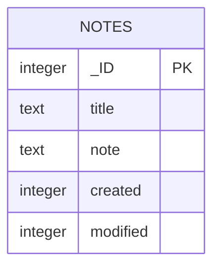

**图表来源**
- [NotePad.java](file://app/src/main/java/com/example/android/notepad/NotePad.java#L130-L153)

### 排序和默认行为

契约类还定义了默认的排序规则，确保数据展示的一致性：
- 默认按修改时间降序排列
- 提供可扩展的排序机制

**章节来源**
- [NotePad.java](file://app/src/main/java/com/example/android/notepad/NotePad.java#L1-L155)

## NotePadProvider内容提供者

NotePadProvider是Android内容提供者模式的核心实现，它封装了数据库操作的复杂性，为上层应用提供了简洁的API接口。

### 数据库初始化和管理

Provider采用了延迟初始化策略，在首次需要时才创建数据库连接。这种设计提高了应用启动性能，避免了不必要的资源消耗。

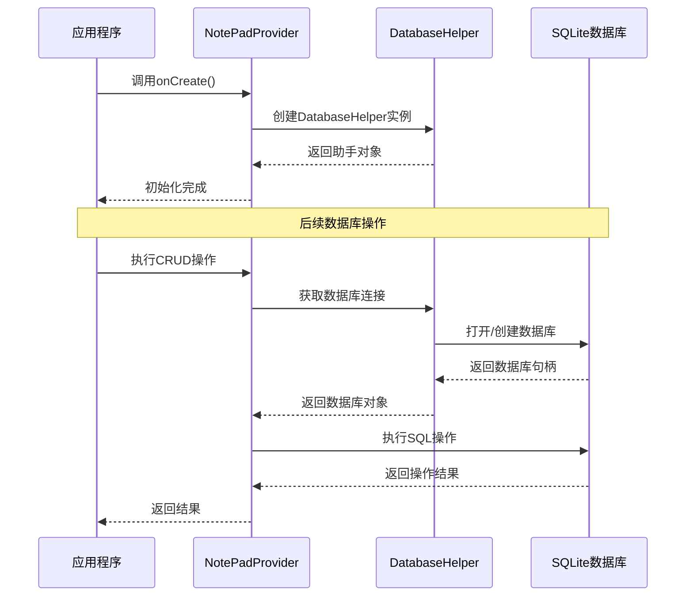

**图表来源**
- [NotePadProvider.java](file://app/src/main/java/com/example/android/notepad/NotePadProvider.java#L231-L240)

### URI匹配器配置

Provider使用UriMatcher来高效地识别和路由不同的URI请求：

| 匹配模式 | 常量值 | 处理逻辑 |
|----------|--------|----------|
| "notes" | NOTES (1) | 处理笔记列表查询 |
| "notes/#" | NOTE_ID (2) | 处理单个笔记操作 |
| "live_folders/notes" | LIVE_FOLDER_NOTES (3) | 处理实时文件夹 |

### CRUD操作实现

#### 查询操作 (query)

查询方法支持灵活的投影映射和条件过滤：

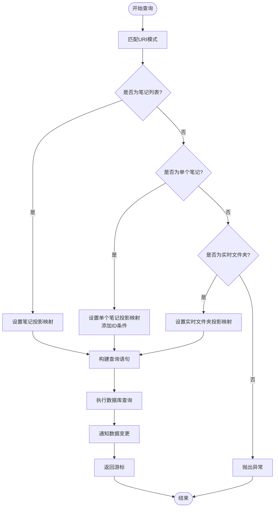

**图表来源**
- [NotePadProvider.java](file://app/src/main/java/com/example/android/notepad/NotePadProvider.java#L251-L322)

#### 插入操作 (insert)

插入操作包含了智能的默认值填充机制：

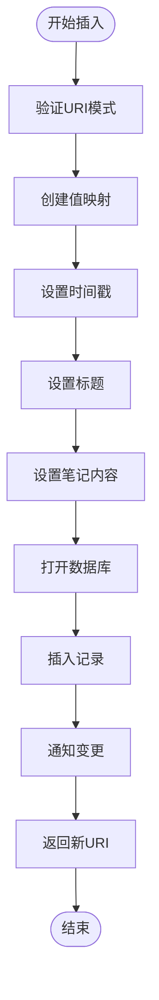

**图表来源**
- [NotePadProvider.java](file://app/src/main/java/com/example/android/notepad/NotePadProvider.java#L498-L567)

#### 更新和删除操作

更新和删除操作都采用了相似的模式：先验证URI，然后根据URI模式确定操作范围，最后执行相应的数据库操作并通知变更监听器。

### 投影映射系统

Provider维护了两个投影映射表，分别用于普通查询和实时文件夹查询：

| 映射类型 | 用途 | 关键特性 |
|----------|------|----------|
| sNotesProjectionMap | 普通笔记查询 | 标准字段映射 |
| sLiveFolderProjectionMap | 实时文件夹查询 | 特殊字段重命名 |

**章节来源**
- [NotePadProvider.java](file://app/src/main/java/com/example/android/notepad/NotePadProvider.java#L1-L753)

## NotesList主界面

NotesList是应用的主界面，负责显示笔记列表并提供基本的用户交互功能。它采用了ListActivity基类，简化了列表视图的实现。

### 数据绑定机制

NotesList使用SimpleCursorAdapter将数据库查询结果直接绑定到ListView：

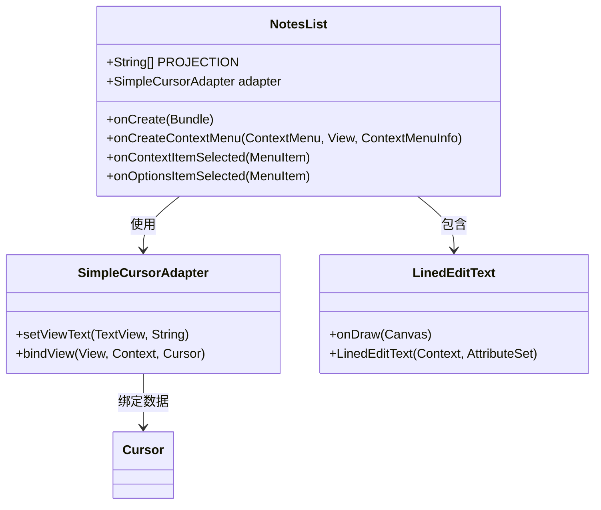

**图表来源**
- [NotesList.java](file://app/src/main/java/com/example/android/notepad/NotesList.java#L132-L158)

### 列表项自定义

SimpleCursorAdapter的子类重写了setViewText方法，实现了特殊的日期格式化功能：

| 功能 | 实现方式 | 效果 |
|------|----------|------|
| 标题显示 | 默认实现 | 直接显示笔记标题 |
| 日期格式化 | 自定义逻辑 | 将时间戳转换为易读格式 |
| 错误处理 | 异常捕获 | 防止格式化失败影响应用 |

### 上下文菜单系统

NotesList实现了丰富的上下文菜单功能：

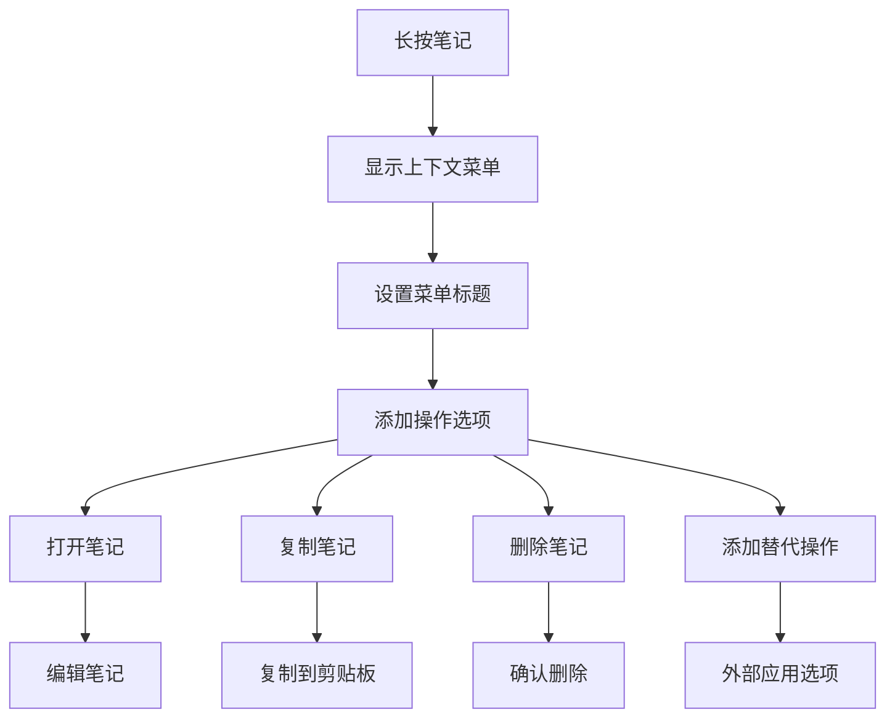

**图表来源**
- [NotesList.java](file://app/src/main/java/com/example/android/notepad/NotesList.java#L322-L371)

### 选项菜单功能

选项菜单提供了全局操作入口：

| 菜单项 | 功能 | 快捷键 |
|--------|------|--------|
| 添加笔记 | 创建新笔记 | Alt+A |
| 粘贴笔记 | 从剪贴板创建 | Alt+P |

### Intent处理机制

NotesList能够处理多种Intent操作：

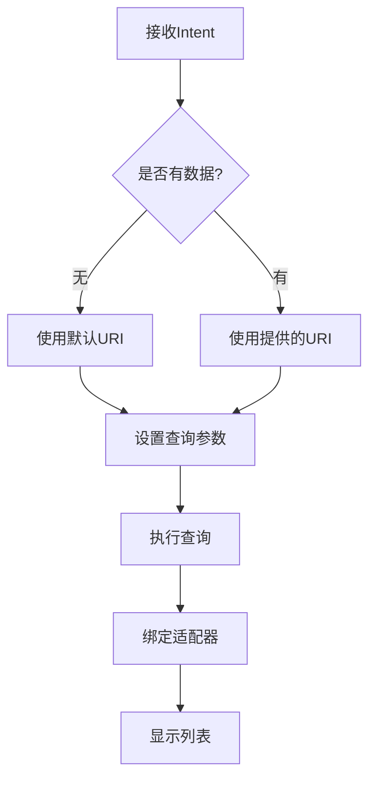

**图表来源**
- [NotesList.java](file://app/src/main/java/com/example/android/notepad/NotesList.java#L87-L114)

**章节来源**
- [NotesList.java](file://app/src/main/java/com/example/android/notepad/NotesList.java#L1-L487)

## NoteEditor编辑器

NoteEditor是应用的核心编辑功能实现，它能够处理笔记的创建、编辑和粘贴操作。该组件采用了状态机模式来管理不同的编辑状态。

### 状态管理系统

NoteEditor使用状态枚举来区分不同的操作模式：

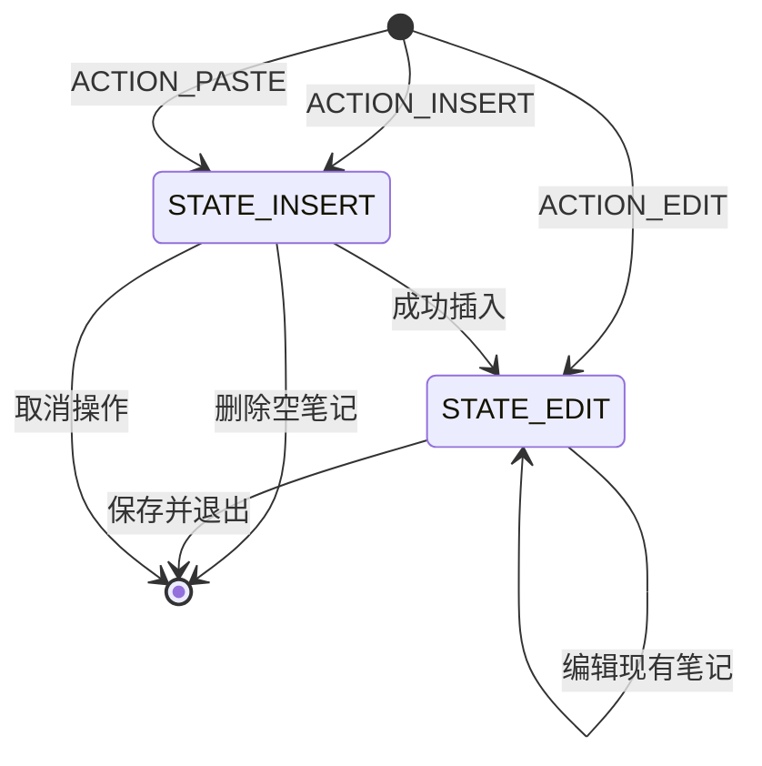

**图表来源**
- [NoteEditor.java](file://app/src/main/java/com/example/android/notepad/NoteEditor.java#L72-L75)

### 文本编辑器增强

NoteEditor包含了一个自定义的LinedEditText组件，为多行文本输入提供了视觉辅助：

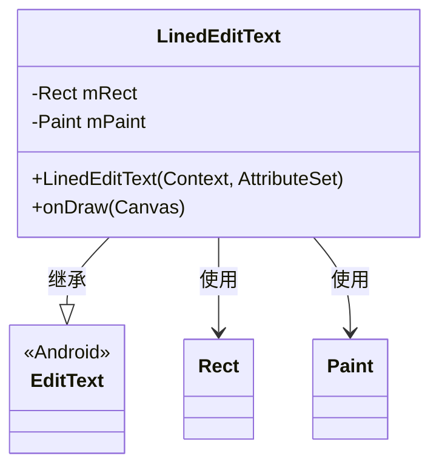

**图表来源**
- [NoteEditor.java](file://app/src/main/java/com/example/android/notepad/NoteEditor.java#L84-L134)

### 编辑器生命周期

NoteEditor的生命周期管理体现了Android开发的最佳实践：

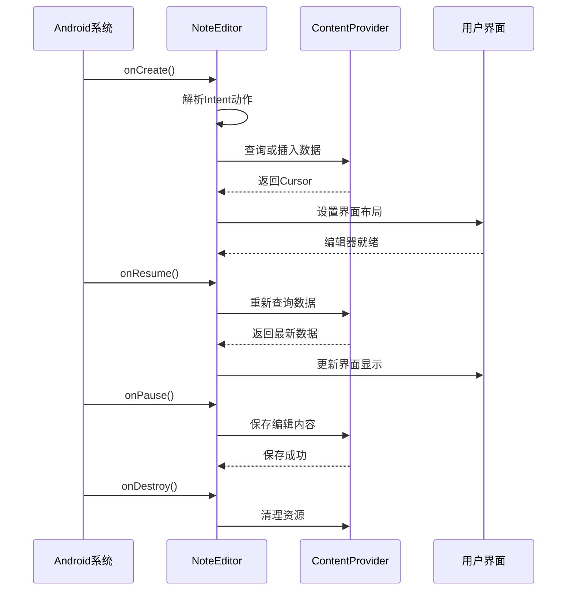

**图表来源**
- [NoteEditor.java](file://app/src/main/java/com/example/android/notepad/NoteEditor.java#L140-L308)

### 粘贴功能实现

NoteEditor的粘贴功能展示了如何处理复杂的剪贴板数据：

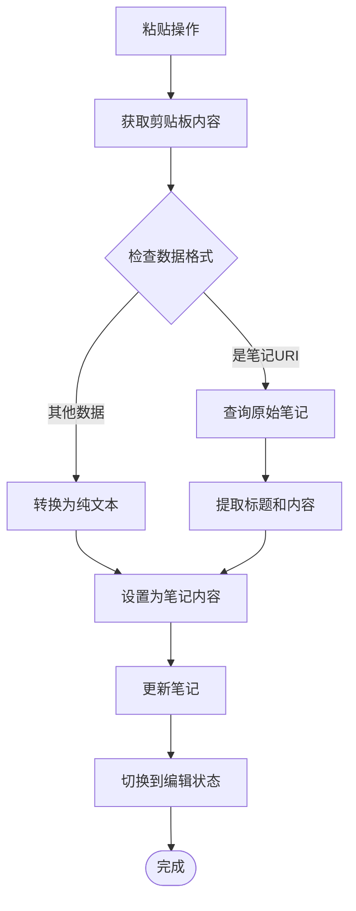

**图表来源**
- [NoteEditor.java](file://app/src/main/java/com/example/android/notepad/NoteEditor.java#L451-L515)

### 菜单系统

NoteEditor提供了完整的编辑菜单：

| 菜单项 | 功能 | 快捷键 |
|--------|------|--------|
| 保存 | 保存当前编辑 | Alt+S |
| 撤销 | 恢复原始内容 | - |
| 删除 | 删除当前笔记 | Alt+D |

### 撤销和恢复机制

NoteEditor实现了智能的撤销功能，能够区分未修改和已修改的状态：

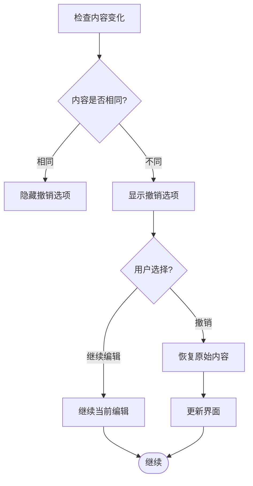

**图表来源**
- [NoteEditor.java](file://app/src/main/java/com/example/android/notepad/NoteEditor.java#L411-L423)

**章节来源**
- [NoteEditor.java](file://app/src/main/java/com/example/android/notepad/NoteEditor.java#L1-L616)

## 架构关系图

四个核心模块之间形成了清晰的层次结构和依赖关系：

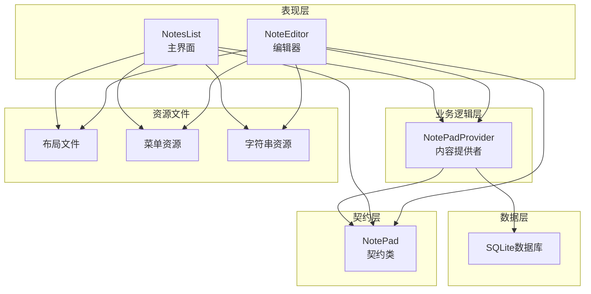

**图表来源**
- [NotesList.java](file://app/src/main/java/com/example/android/notepad/NotesList.java#L1-L50)
- [NoteEditor.java](file://app/src/main/java/com/example/android/notepad/NoteEditor.java#L1-L50)
- [NotePadProvider.java](file://app/src/main/java/com/example/android/notepad/NotePadProvider.java#L1-L50)
- [NotePad.java](file://app/src/main/java/com/example/android/notepad/NotePad.java#L1-L50)

## 总结

NotePad应用的四个核心模块展现了Android开发的最佳实践：

1. **NotePad契约类**提供了标准化的数据访问接口，确保了数据一致性和可维护性
2. **NotePadProvider内容提供者**实现了完整的CRUD操作，封装了数据库访问的复杂性
3. **NotesList主界面**展示了如何优雅地处理列表数据和用户交互
4. **NoteEditor编辑器**演示了复杂的生命周期管理和状态控制

这些模块共同构成了一个功能完整、结构清晰的Android应用，为学习内容提供者模式和Android应用开发提供了优秀的参考案例。通过深入理解这些核心组件，开发者可以更好地掌握Android平台的架构设计理念和最佳实践。